# Order Processing

<cite>
**Referenced Files in This Document**
- [OrderController.php](file://packages/Webkul/Admin/src/Http/Controllers/Sales/OrderController.php)
- [Order.php](file://packages/Webkul/Sales/src/Models/Order.php)
- [OrderItem.php](file://packages/Webkul/Sales/src/Models/OrderItem.php)
- [Invoice.php](file://packages/Webkul/Sales/src/Models/Invoice.php)
- [OrderAddress.php](file://packages/Webkul/Sales/src/Models/OrderAddress.php)
- [OrderRepository.php](file://packages/Webkul/Sales/src/Repositories/OrderRepository.php)
- [Cart.php](file://packages/Webkul/Checkout/src/Cart.php)
- [Cart.php (Model)](file://packages/Webkul/Checkout/src/Models/Cart.php)
- [Payment.php](file://packages/Webkul/Payment/src/Payment.php)
- [Shipping.php](file://packages/Webkul/Shipping/src/Shipping.php)
- [system.php](file://packages/Webkul/Admin/src/Config/system.php)
- [index.blade.php](file://packages/Webkul/Admin/src/Resources/views/sales/orders/index.blade.php)
- [summary.blade.php](file://packages/Webkul/Admin/src/Resources/views/sales/orders/create/cart/summary.blade.php)
</cite>

## Table of Contents
1. [Introduction](#introduction)
2. [Project Structure](#project-structure)
3. [Core Components](#core-components)
4. [Architecture Overview](#architecture-overview)
5. [Detailed Component Analysis](#detailed-component-analysis)
6. [Dependency Analysis](#dependency-analysis)
7. [Performance Considerations](#performance-considerations)
8. [Troubleshooting Guide](#troubleshooting-guide)
9. [Conclusion](#conclusion)

## Introduction
This document explains Frooxi’s order processing system end-to-end, covering the complete lifecycle from cart creation through order fulfillment. It details shopping cart management, checkout workflow, order validation, state transitions, pricing and totals computation, tax handling, discount application, payment and shipping integration, and order management interfaces for administrators. It also outlines customer-facing order history and administrative order management capabilities.

## Project Structure
The order processing system spans several modules:
- Admin controllers orchestrate order creation from an existing cart.
- Sales models define orders, items, invoices, and addresses.
- Checkout module manages cart creation, updates, totals, and validation.
- Payment module exposes supported payment methods and redirects.
- Shipping module computes and validates shipping rates.
- Configuration under Admin defines order settings, taxes, and checkout options.

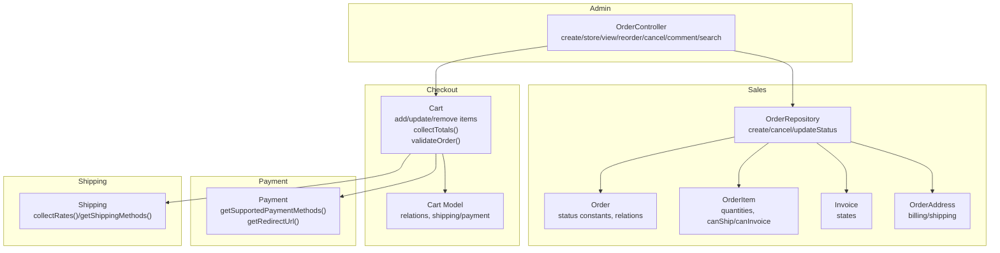

**Diagram sources**
- [OrderController.php:77-119](file://packages/Webkul/Admin/src/Http/Controllers/Sales/OrderController.php#L77-L119)
- [OrderRepository.php:45-118](file://packages/Webkul/Sales/src/Repositories/OrderRepository.php#L45-L118)
- [Order.php:37-67](file://packages/Webkul/Sales/src/Models/Order.php#L37-L67)
- [OrderItem.php:75-142](file://packages/Webkul/Sales/src/Models/OrderItem.php#L75-L142)
- [Invoice.php:23-44](file://packages/Webkul/Sales/src/Models/Invoice.php#L23-L44)
- [OrderAddress.php:28-33](file://packages/Webkul/Sales/src/Models/OrderAddress.php#L28-L33)
- [Cart.php:852-946](file://packages/Webkul/Checkout/src/Cart.php#L852-L946)
- [Cart.php (Model):108-121](file://packages/Webkul/Checkout/src/Models/Cart.php#L108-L121)
- [Payment.php:15-67](file://packages/Webkul/Payment/src/Payment.php#L15-L67)
- [Shipping.php:22-51](file://packages/Webkul/Shipping/src/Shipping.php#L22-L51)

**Section sources**
- [OrderController.php:41-119](file://packages/Webkul/Admin/src/Http/Controllers/Sales/OrderController.php#L41-L119)
- [OrderRepository.php:45-118](file://packages/Webkul/Sales/src/Repositories/OrderRepository.php#L45-L118)
- [Cart.php:852-946](file://packages/Webkul/Checkout/src/Cart.php#L852-L946)

## Core Components
- Order: Encapsulates order state, totals, addresses, items, invoices, shipments, and refund relations. Provides status constants and helper checks for canShip/canInvoice/canCancel/canRefund/canReorder.
- OrderItem: Tracks per-item quantities, cancellations, invoicing, shipping, and refund eligibility, delegating product-type-specific logic.
- Invoice: Defines invoice states (pending, pending_payment, paid, overdue, refunded) and links to order and billing address.
- OrderAddress: Distinguishes billing vs shipping addresses for orders.
- OrderRepository: Creates orders with retries, manages inventory reservations via order items, and updates order status based on item-level state.
- Cart: Manages cart lifecycle, item addition/removal, address saving, shipping/payment selection, coupon application, and total recalculation.
- Payment: Discovers available payment methods and determines redirect URLs.
- Shipping: Computes shipping rates, persists them to cart, and validates selected methods.

**Section sources**
- [Order.php:37-67](file://packages/Webkul/Sales/src/Models/Order.php#L37-L67)
- [OrderItem.php:75-142](file://packages/Webkul/Sales/src/Models/OrderItem.php#L75-L142)
- [Invoice.php:23-44](file://packages/Webkul/Sales/src/Models/Invoice.php#L23-L44)
- [OrderAddress.php:28-33](file://packages/Webkul/Sales/src/Models/OrderAddress.php#L28-L33)
- [OrderRepository.php:45-118](file://packages/Webkul/Sales/src/Repositories/OrderRepository.php#L45-L118)
- [Cart.php:852-946](file://packages/Webkul/Checkout/src/Cart.php#L852-L946)
- [Payment.php:15-67](file://packages/Webkul/Payment/src/Payment.php#L15-L67)
- [Shipping.php:22-51](file://packages/Webkul/Shipping/src/Shipping.php#L22-L51)

## Architecture Overview
The admin-driven order creation flow starts from a pre-existing cart. The controller validates the cart, collects totals, and creates an order via the repository. The repository persists order, payments, addresses, items, and invokes inventory management hooks. Administrative order management supports viewing, commenting, cancellation, and reordering.

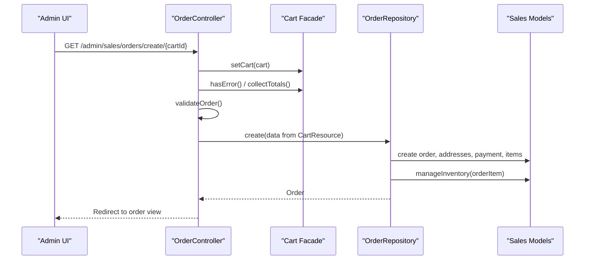

**Diagram sources**
- [OrderController.php:77-119](file://packages/Webkul/Admin/src/Http/Controllers/Sales/OrderController.php#L77-L119)
- [OrderRepository.php:45-118](file://packages/Webkul/Sales/src/Repositories/OrderRepository.php#L45-L118)
- [Cart.php:852-946](file://packages/Webkul/Checkout/src/Cart.php#L852-L946)

## Detailed Component Analysis

### Shopping Cart Management
- Cart creation and activation: The cart is initialized per customer/session, merged on login, and activated/deactivated as needed.
- Item lifecycle: Items are added via product type handlers, validated, and updated with quantities. Totals are recalculated after each change.
- Address management: Billing and shipping addresses are persisted to the cart; shipping address is optional for non-stockable carts.
- Shipping and payment: Shipping methods are collected and saved; payment method is stored on the cart.
- Coupons: Coupon code can be applied or removed.
- Validation: Cart-level validation ensures sufficient quantities, minimum order thresholds, and presence of required addresses/methods.

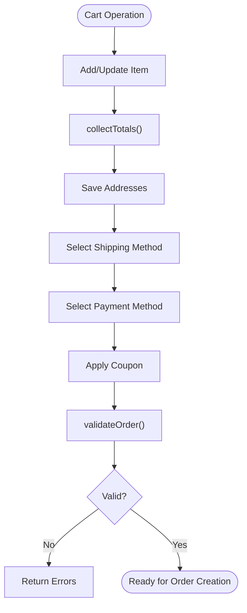

**Diagram sources**
- [Cart.php:259-315](file://packages/Webkul/Checkout/src/Cart.php#L259-L315)
- [Cart.php:852-946](file://packages/Webkul/Checkout/src/Cart.php#L852-L946)
- [Cart.php:425-545](file://packages/Webkul/Checkout/src/Cart.php#L425-L545)
- [Cart.php:562-616](file://packages/Webkul/Checkout/src/Cart.php#L562-L616)
- [Cart.php:621-636](file://packages/Webkul/Checkout/src/Cart.php#L621-L636)
- [OrderController.php:234-265](file://packages/Webkul/Admin/src/Http/Controllers/Sales/OrderController.php#L234-L265)

**Section sources**
- [Cart.php:70-254](file://packages/Webkul/Checkout/src/Cart.php#L70-L254)
- [Cart.php:852-946](file://packages/Webkul/Checkout/src/Cart.php#L852-L946)
- [Cart.php (Model):108-121](file://packages/Webkul/Checkout/src/Models/Cart.php#L108-L121)
- [OrderController.php:234-265](file://packages/Webkul/Admin/src/Http/Controllers/Sales/OrderController.php#L234-L265)

### Checkout Workflow and Order Validation
- Admin cart creation: The admin UI does not expose a “create cart” button; orders are created from an existing cart.
- Validation rules enforced by the controller include minimum order amount, presence of shipping/billing addresses (when applicable), selected shipping method, and payment method.
- After validation, totals are collected and an order is created.

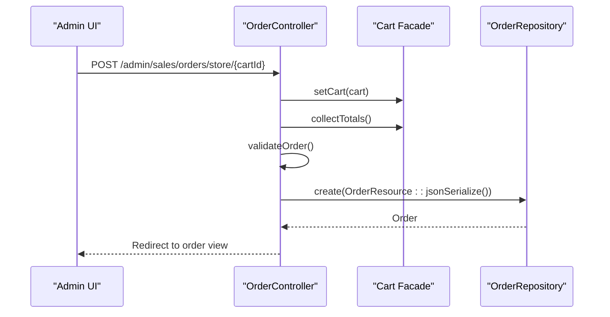

**Diagram sources**
- [OrderController.php:77-119](file://packages/Webkul/Admin/src/Http/Controllers/Sales/OrderController.php#L77-L119)
- [OrderRepository.php:45-118](file://packages/Webkul/Sales/src/Repositories/OrderRepository.php#L45-L118)

**Section sources**
- [index.blade.php:17-29](file://packages/Webkul/Admin/src/Resources/views/sales/orders/index.blade.php#L17-L29)
- [OrderController.php:77-119](file://packages/Webkul/Admin/src/Http/Controllers/Sales/OrderController.php#L77-L119)

### Order Creation and Persistence
- The repository wraps order creation in a transaction, generating an increment ID and persisting items, addresses, and payment.
- For each order item, inventory is reserved and customizable options are recorded.
- Retry logic is applied for transient failures, with explicit handling for coupon usage limits.

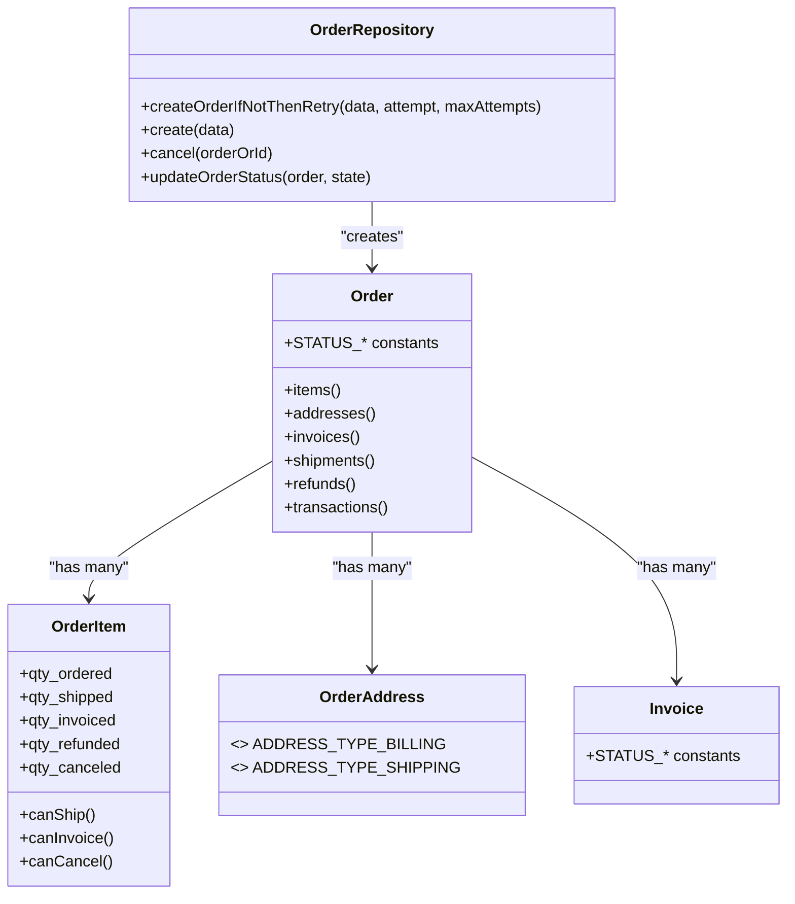

**Diagram sources**
- [OrderRepository.php:45-118](file://packages/Webkul/Sales/src/Repositories/OrderRepository.php#L45-L118)
- [Order.php:37-67](file://packages/Webkul/Sales/src/Models/Order.php#L37-L67)
- [OrderItem.php:75-142](file://packages/Webkul/Sales/src/Models/OrderItem.php#L75-L142)
- [Invoice.php:23-44](file://packages/Webkul/Sales/src/Models/Invoice.php#L23-L44)
- [OrderAddress.php:28-33](file://packages/Webkul/Sales/src/Models/OrderAddress.php#L28-L33)

**Section sources**
- [OrderRepository.php:45-118](file://packages/Webkul/Sales/src/Repositories/OrderRepository.php#L45-L118)
- [Order.php:144-147](file://packages/Webkul/Sales/src/Models/Order.php#L144-L147)

### Pricing Calculations, Tax Handling, and Discount Application
- Totals computation aggregates item totals, discounts, taxes, and shipping costs, rounding to currency precision.
- The cart recalculates item tax and shipping tax based on configured tax categories and calculation basis. Tax computation is currently disabled in the codebase and defaults to excluding tax fields.
- Discounts are included in minimum order amount computation based on configuration.

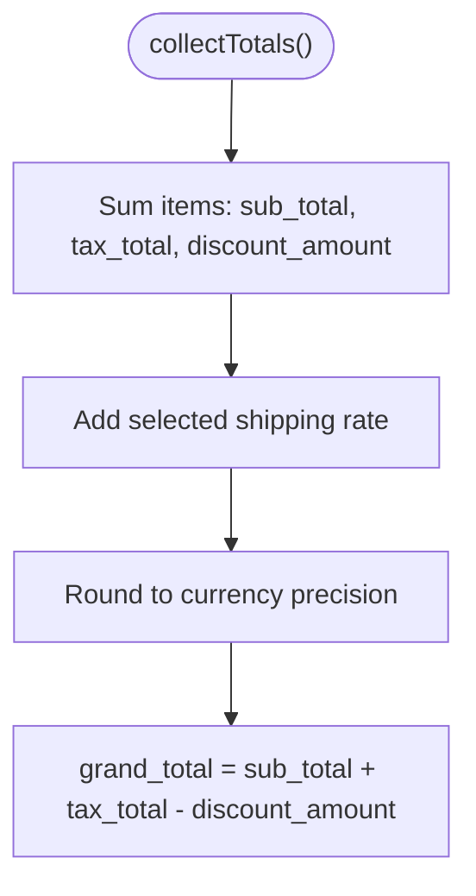

**Diagram sources**
- [Cart.php:852-946](file://packages/Webkul/Checkout/src/Cart.php#L852-L946)
- [Cart.php:1016-1140](file://packages/Webkul/Checkout/src/Cart.php#L1016-L1140)
- [Cart.php:1145-1226](file://packages/Webkul/Checkout/src/Cart.php#L1145-L1226)

**Section sources**
- [Cart.php:852-946](file://packages/Webkul/Checkout/src/Cart.php#L852-L946)
- [Cart.php:1016-1140](file://packages/Webkul/Checkout/src/Cart.php#L1016-L1140)
- [Cart.php:1145-1226](file://packages/Webkul/Checkout/src/Cart.php#L1145-L1226)

### Order State Transitions and Fulfillment
- Order statuses include pending, pending_payment, processing, completed, canceled, closed, and fraud.
- The repository updates order status based on item-level quantities shipped/invoiced/refunded/canceled.
- Helper methods on Order and OrderItem determine whether shipping, invoicing, cancellation, or refund actions are allowed.

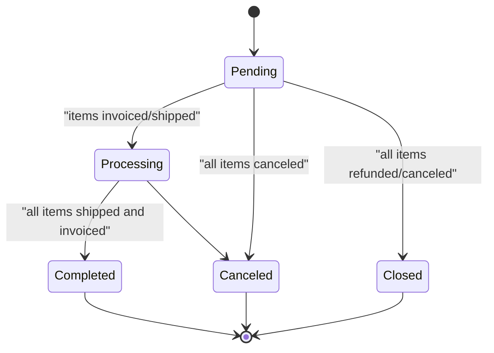

**Diagram sources**
- [Order.php:37-67](file://packages/Webkul/Sales/src/Models/Order.php#L37-L67)
- [OrderRepository.php:312-337](file://packages/Webkul/Sales/src/Repositories/OrderRepository.php#L312-L337)
- [OrderItem.php:75-142](file://packages/Webkul/Sales/src/Models/OrderItem.php#L75-L142)

**Section sources**
- [Order.php:37-67](file://packages/Webkul/Sales/src/Models/Order.php#L37-L67)
- [OrderRepository.php:312-337](file://packages/Webkul/Sales/src/Repositories/OrderRepository.php#L312-L337)
- [OrderItem.php:75-142](file://packages/Webkul/Sales/src/Models/OrderItem.php#L75-L142)

### Payment Processing Integration
- Supported payment methods are discovered from configuration and filtered by availability.
- A redirect URL can be returned for payment methods that require off-session processing.
- The controller restricts accepted payment methods during admin order creation.

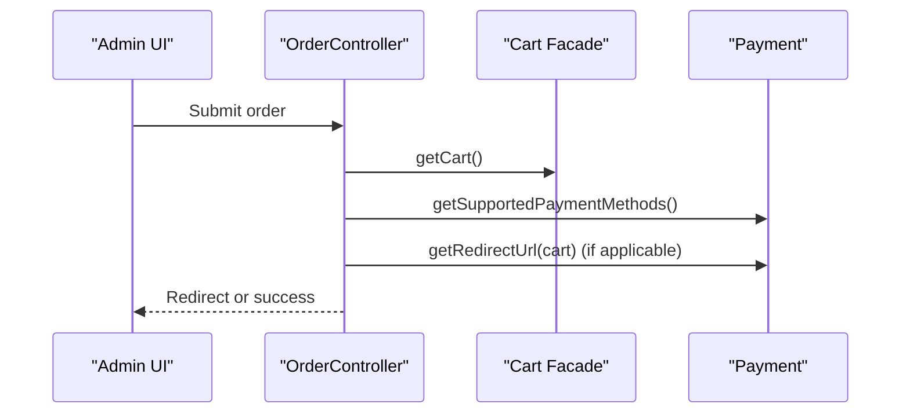

**Diagram sources**
- [OrderController.php:101-105](file://packages/Webkul/Admin/src/Http/Controllers/Sales/OrderController.php#L101-L105)
- [Payment.php:15-67](file://packages/Webkul/Payment/src/Payment.php#L15-L67)

**Section sources**
- [Payment.php:15-67](file://packages/Webkul/Payment/src/Payment.php#L15-L67)
- [OrderController.php:101-105](file://packages/Webkul/Admin/src/Http/Controllers/Sales/OrderController.php#L101-L105)

### Shipping Calculation and Selection
- Shipping rates are computed from registered carriers and grouped by carrier.
- Rates are persisted to the cart and selected shipping method is validated against available methods.
- The cart’s selected shipping rate contributes to tax and grand total calculations.

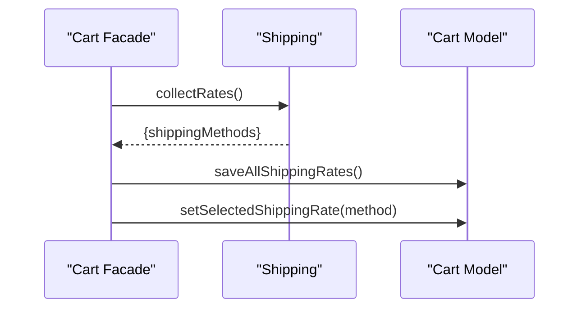

**Diagram sources**
- [Shipping.php:22-51](file://packages/Webkul/Shipping/src/Shipping.php#L22-L51)
- [Shipping.php:74-94](file://packages/Webkul/Shipping/src/Shipping.php#L74-L94)
- [Cart.php (Model):108-121](file://packages/Webkul/Checkout/src/Models/Cart.php#L108-L121)

**Section sources**
- [Shipping.php:22-51](file://packages/Webkul/Shipping/src/Shipping.php#L22-L51)
- [Shipping.php:148-174](file://packages/Webkul/Shipping/src/Shipping.php#L148-L174)
- [Cart.php (Model):108-121](file://packages/Webkul/Checkout/src/Models/Cart.php#L108-L121)

### Order Management Interfaces and Customer History
- Admin order listing and filtering by customer, status, or ID.
- Order view page for details, comments, and actions (cancel, reorder).
- Reorder capability recreates a cart from a previous order for quick repurchase.
- Cart summary displays tax configuration values for prices/subtotal/shipping.

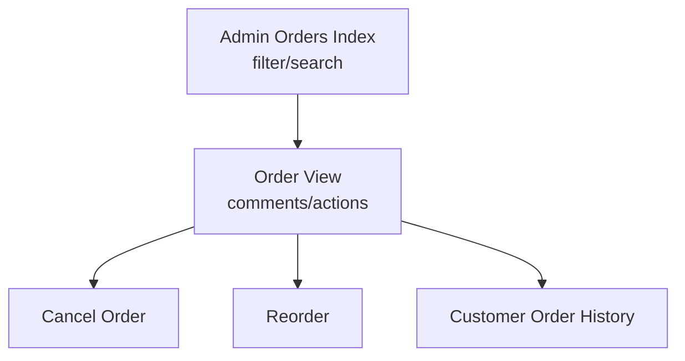

**Diagram sources**
- [OrderController.php:41-52](file://packages/Webkul/Admin/src/Http/Controllers/Sales/OrderController.php#L41-L52)
- [OrderController.php:126-158](file://packages/Webkul/Admin/src/Http/Controllers/Sales/OrderController.php#L126-L158)
- [summary.blade.php:292-298](file://packages/Webkul/Admin/src/Resources/views/sales/orders/create/cart/summary.blade.php#L292-L298)

**Section sources**
- [OrderController.php:41-52](file://packages/Webkul/Admin/src/Http/Controllers/Sales/OrderController.php#L41-L52)
- [OrderController.php:126-158](file://packages/Webkul/Admin/src/Http/Controllers/Sales/OrderController.php#L126-L158)
- [summary.blade.php:292-298](file://packages/Webkul/Admin/src/Resources/views/sales/orders/create/cart/summary.blade.php#L292-L298)

## Dependency Analysis
- Coupling: OrderController depends on Cart facade and OrderRepository. OrderRepository depends on OrderItemRepository and related repositories for inventory and links.
- Cohesion: Cart encapsulates pricing, tax, shipping, and coupon logic; Payment and Shipping modules are cohesive around their respective concerns.
- External integrations: Payment methods and shipping carriers are configured via the Admin configuration system.

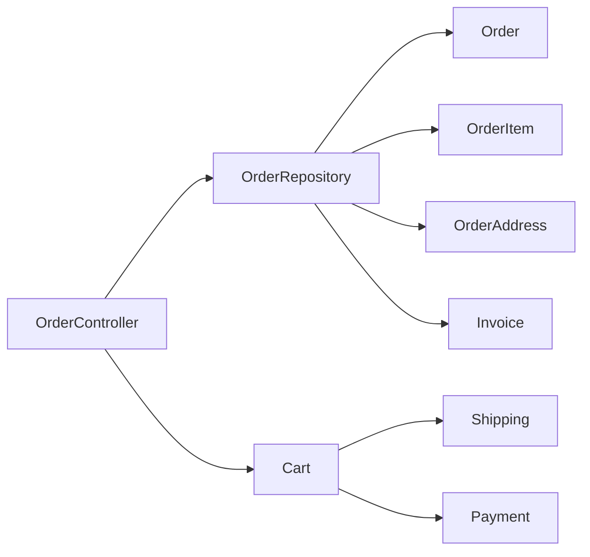

**Diagram sources**
- [OrderController.php:77-119](file://packages/Webkul/Admin/src/Http/Controllers/Sales/OrderController.php#L77-L119)
- [OrderRepository.php:45-118](file://packages/Webkul/Sales/src/Repositories/OrderRepository.php#L45-L118)
- [Cart.php:852-946](file://packages/Webkul/Checkout/src/Cart.php#L852-L946)
- [Shipping.php:22-51](file://packages/Webkul/Shipping/src/Shipping.php#L22-L51)
- [Payment.php:15-67](file://packages/Webkul/Payment/src/Payment.php#L15-L67)

**Section sources**
- [OrderController.php:77-119](file://packages/Webkul/Admin/src/Http/Controllers/Sales/OrderController.php#L77-L119)
- [OrderRepository.php:45-118](file://packages/Webkul/Sales/src/Repositories/OrderRepository.php#L45-L118)

## Performance Considerations
- Transaction retries: Order creation retries up to a configured maximum for transient failures, reducing manual intervention.
- Event-driven totals: Totals recalculation dispatches events before and after, enabling extensibility without tight coupling.
- Minimal tax computation: Tax calculation is disabled in the current codebase, simplifying totals computation and avoiding heavy tax engine dependencies.
- Efficient queries: OrderRepository aggregates invoice/refund totals and updates order totals in bulk.

[No sources needed since this section provides general guidance]

## Troubleshooting Guide
Common issues and resolutions:
- Cart validation errors: Insufficient quantity, missing shipping/billing address, unselected shipping method, or missing payment method trigger validation exceptions. Review the cart’s error list and ensure all required fields are present.
- Minimum order amount: If the configured minimum order amount is not met, validation fails. Adjust cart contents or review configuration.
- Payment method restrictions: Only supported payment methods are accepted during admin order creation; verify payment configuration.
- Inventory reservations: If inventory is insufficient, item validation removes or adjusts items; reconcile stock levels.
- Tax configuration: Tax-related totals are disabled in code; confirm display settings for prices/subtotal/shipping in Admin configuration.

**Section sources**
- [Cart.php:752-787](file://packages/Webkul/Checkout/src/Cart.php#L752-L787)
- [OrderController.php:234-265](file://packages/Webkul/Admin/src/Http/Controllers/Sales/OrderController.php#L234-L265)
- [system.php:2772-2802](file://packages/Webkul/Admin/src/Config/system.php#L2772-L2802)

## Conclusion
Frooxi’s order processing system integrates cart management, checkout validation, and order persistence with clear separation of concerns across modules. The admin interface enables efficient order creation from existing carts, while robust validation and totals computation ensure accurate financial records. Payment and shipping integrations are configurable and extensible. Administrators can manage orders, track state transitions, and support customers through comments, cancellations, and reorders.