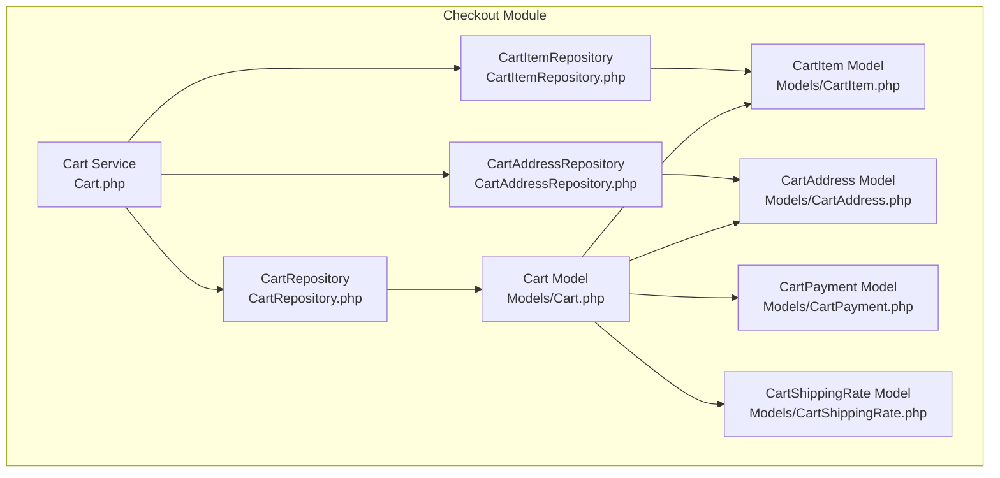
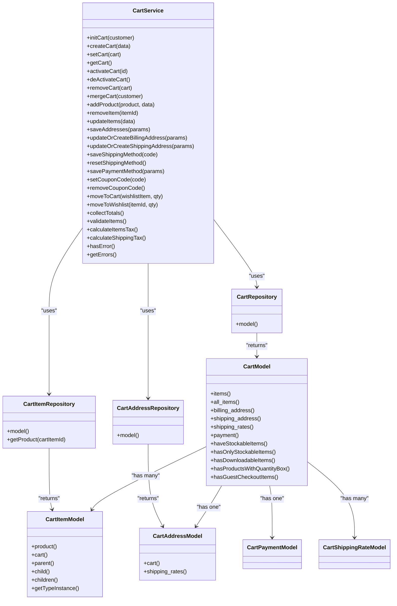
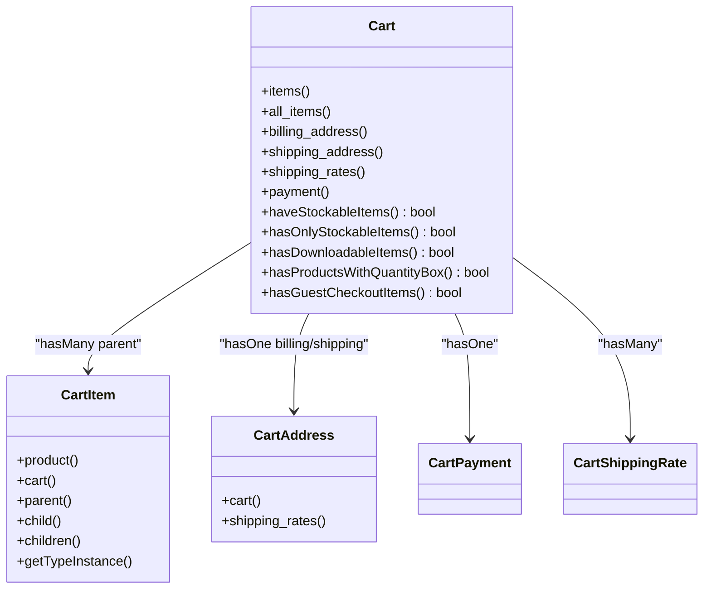
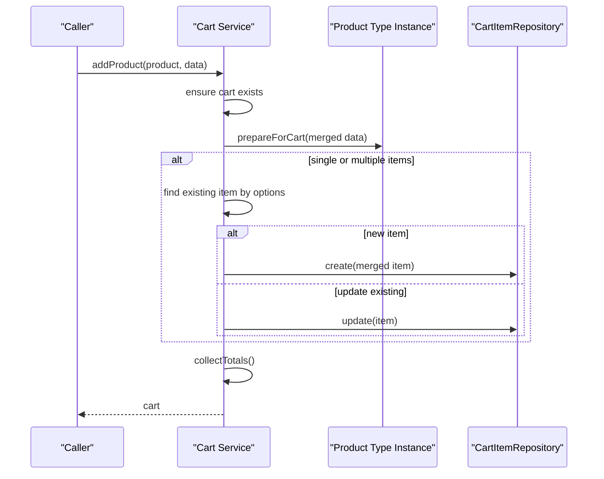
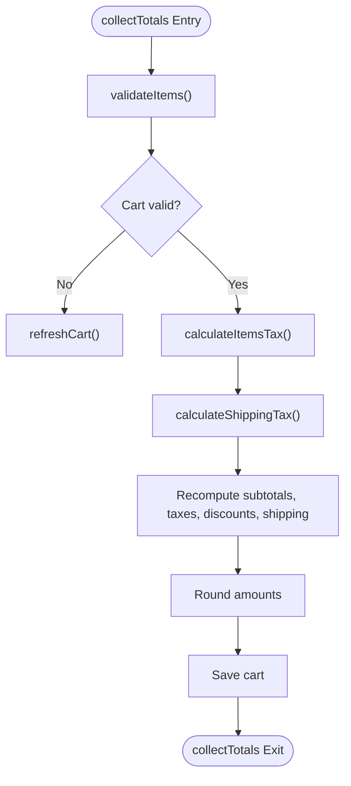
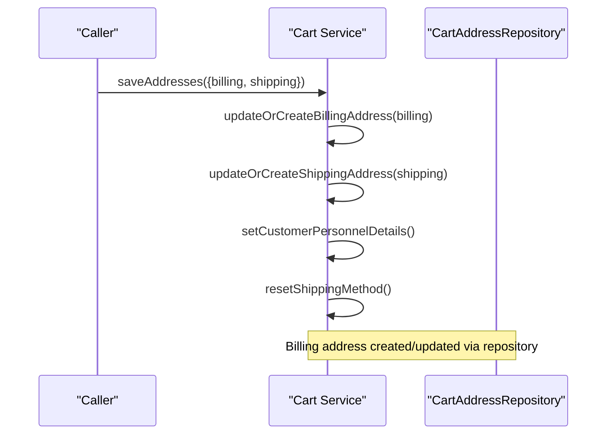
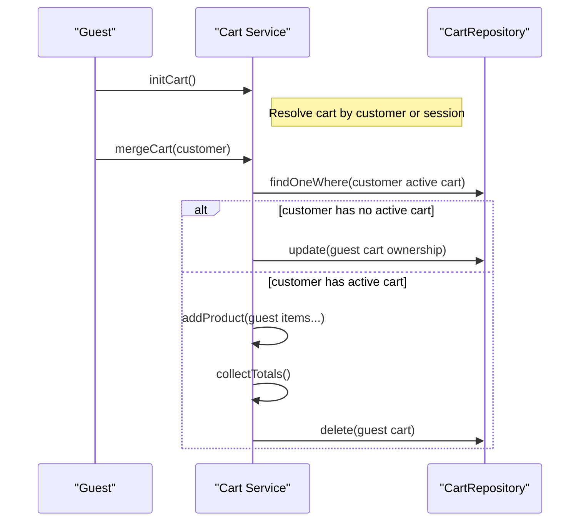
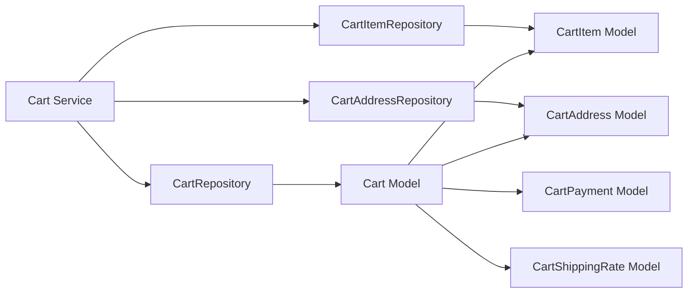

# Shopping Cart System

<cite>
**Referenced Files in This Document**
- [Cart.php](file://packages/Webkul/Checkout/src/Cart.php)
- [Cart.php](file://packages/Webkul/Checkout/src/Models/Cart.php)
- [CartItem.php](file://packages/Webkul/Checkout/src/Models/CartItem.php)
- [CartAddress.php](file://packages/Webkul/Checkout/src/Models/CartAddress.php)
- [CartPayment.php](file://packages/Webkul/Checkout/src/Models/CartPayment.php)
- [CartShippingRate.php](file://packages/Webkul/Checkout/src/Models/CartShippingRate.php)
- [CartRepository.php](file://packages/Webkul/Checkout/src/Repositories/CartRepository.php)
- [CartItemRepository.php](file://packages/Webkul/Checkout/src/Repositories/CartItemRepository.php)
- [CartAddressRepository.php](file://packages/Webkul/Checkout/src/Repositories/CartAddressRepository.php)
- [Cart.php](file://packages/Webkul/Checkout/src/Contracts/Cart.php)
- [Cart.php](file://packages/Webkul/Checkout/src/Contracts/CartItem.php)
- [Cart.php](file://packages/Webkul/Checkout/src/Contracts/CartAddress.php)
- [Cart.php](file://packages/Webkul/Checkout/src/Contracts/CartPayment.php)
- [Cart.php](file://packages/Webkul/Checkout/src/Contracts/CartShippingRate.php)
</cite>

## Table of Contents
1. [Introduction](#introduction)
2. [Project Structure](#project-structure)
3. [Core Components](#core-components)
4. [Architecture Overview](#architecture-overview)
5. [Detailed Component Analysis](#detailed-component-analysis)
6. [Dependency Analysis](#dependency-analysis)
7. [Performance Considerations](#performance-considerations)
8. [Troubleshooting Guide](#troubleshooting-guide)
9. [Conclusion](#conclusion)
10. [Appendices](#appendices)

## Introduction
This document describes the shopping cart system in the Bagisto codebase. It focuses on the Cart model architecture, cart item management, persistence mechanisms, and the lifecycle of a cart. It also covers address management, shipping and payment configuration, validation rules, stock checking, quantity limitations, and merging guest and registered customer carts. Practical examples of adding/removing items, updating quantities, and querying cart state are included via precise source references.

## Project Structure
The cart system resides primarily under the Checkout module. The key elements are:
- Business orchestration: Cart service class
- Persistence: Eloquent models for Cart, CartItem, CartAddress, CartPayment, CartShippingRate
- Repositories: CartRepository, CartItemRepository, CartAddressRepository
- Contracts: Interfaces for Cart-related entities

**Diagram sources**
- [Cart.php:25-120](file://packages/Webkul/Checkout/src/Cart.php#L25-L120)
- [CartRepository.php:7-16](file://packages/Webkul/Checkout/src/Repositories/CartRepository.php#L7-L16)
- [CartItemRepository.php:7-25](file://packages/Webkul/Checkout/src/Repositories/CartItemRepository.php#L7-L25)
- [CartAddressRepository.php:7-16](file://packages/Webkul/Checkout/src/Repositories/CartAddressRepository.php#L7-L16)
- [Cart.php:16-205](file://packages/Webkul/Checkout/src/Models/Cart.php#L16-L205)
- [CartItem.php:16-107](file://packages/Webkul/Checkout/src/Models/CartItem.php#L16-L107)
- [CartAddress.php:21-81](file://packages/Webkul/Checkout/src/Models/CartAddress.php#L21-L81)
- [CartPayment.php:11-25](file://packages/Webkul/Checkout/src/Models/CartPayment.php#L11-L25)
- [CartShippingRate.php:11-55](file://packages/Webkul/Checkout/src/Models/CartShippingRate.php#L11-L55)

**Section sources**
- [Cart.php:25-120](file://packages/Webkul/Checkout/src/Cart.php#L25-L120)
- [Cart.php:16-205](file://packages/Webkul/Checkout/src/Models/Cart.php#L16-L205)

## Core Components
- Cart service orchestrates cart creation, updates, totals computation, validation, and lifecycle transitions. It manages guest vs registered customer carts and merges them upon login.
- Cart model defines relations to items, addresses, payments, channels, and shipping rates, plus helper predicates for stockable/downloadable/guest-checkout eligibility.
- CartItem model encapsulates product association, parent-child relationships for configurable/bundle products, and lazy loading of product/type instances.
- CartAddress model stores billing/shipping addresses scoped to cart and exposes shipping rates relation.
- CartPayment model persists selected payment method per cart.
- CartShippingRate model holds computed shipping costs/taxes per shipping method/address.
- Repositories abstract persistence for each entity.

Key responsibilities:
- Cart management: create, activate/deactivate, remove, refresh
- Item management: add, update quantity, remove, move to/from wishlist
- Totals computation: subtotal, tax, shipping, discount, grand total
- Validation: inactive items, insufficient inventory, minimum order amount
- Addresses: save billing and shipping addresses, derive defaults, reset on changes
- Shipping/payment: select shipping method, reset shipping method, save payment method
- Session/cart linkage: persist guest cart id in session

**Section sources**
- [Cart.php:126-315](file://packages/Webkul/Checkout/src/Cart.php#L126-L315)
- [Cart.php:66-130](file://packages/Webkul/Checkout/src/Models/Cart.php#L66-L130)
- [CartItem.php:62-97](file://packages/Webkul/Checkout/src/Models/CartItem.php#L62-L97)
- [CartAddress.php:68-71](file://packages/Webkul/Checkout/src/Models/CartAddress.php#L68-L71)
- [CartPayment.php:15-23](file://packages/Webkul/Checkout/src/Models/CartPayment.php#L15-L23)
- [CartShippingRate.php:41-45](file://packages/Webkul/Checkout/src/Models/CartShippingRate.php#L41-L45)

## Architecture Overview
The Cart service composes repositories and models to manage cart state. It dispatches events around add/update/delete and computes totals after changes. Shipping and payment selections are persisted on the cart.

**Diagram sources**
- [Cart.php:25-1228](file://packages/Webkul/Checkout/src/Cart.php#L25-L1228)
- [CartRepository.php:7-16](file://packages/Webkul/Checkout/src/Repositories/CartRepository.php#L7-L16)
- [CartItemRepository.php:7-25](file://packages/Webkul/Checkout/src/Repositories/CartItemRepository.php#L7-L25)
- [CartAddressRepository.php:7-16](file://packages/Webkul/Checkout/src/Repositories/CartAddressRepository.php#L7-L16)
- [Cart.php:16-205](file://packages/Webkul/Checkout/src/Models/Cart.php#L16-L205)
- [CartItem.php:16-107](file://packages/Webkul/Checkout/src/Models/CartItem.php#L16-L107)
- [CartAddress.php:21-81](file://packages/Webkul/Checkout/src/Models/CartAddress.php#L21-L81)
- [CartPayment.php:11-25](file://packages/Webkul/Checkout/src/Models/CartPayment.php#L11-L25)
- [CartShippingRate.php:11-55](file://packages/Webkul/Checkout/src/Models/CartShippingRate.php#L11-L55)

## Detailed Component Analysis

### Cart Model and Relations
- Items relation returns top-level items and eagerly loads child/children for configurable/bundle products.
- Address relations restrict to billing/shipping types.
- Helper predicates:
  - Stockable items presence
  - Only stockable items
  - Downloadable items
  - Presence of products with quantity boxes
  - Guest checkout eligibility

**Diagram sources**
- [Cart.php:66-130](file://packages/Webkul/Checkout/src/Models/Cart.php#L66-L130)
- [CartItem.php:62-97](file://packages/Webkul/Checkout/src/Models/CartItem.php#L62-L97)
- [CartAddress.php:68-71](file://packages/Webkul/Checkout/src/Models/CartAddress.php#L68-L71)
- [CartPayment.php:15-23](file://packages/Webkul/Checkout/src/Models/CartPayment.php#L15-L23)
- [CartShippingRate.php:41-45](file://packages/Webkul/Checkout/src/Models/CartShippingRate.php#L41-L45)

**Section sources**
- [Cart.php:66-195](file://packages/Webkul/Checkout/src/Models/Cart.php#L66-L195)

### Cart Item Management
- Adding products:
  - Prepares items via product type instance, supports configurable/bundle structures.
  - Deduplicates by option comparison and either creates or updates items.
  - Computes totals and triggers recalculation.
- Removing items:
  - Validates ownership and existence, deletes via repository, resets shipping rates.
- Updating quantities:
  - Validates item ownership, checks product status, rejects invalid quantities, verifies inventory, recalculates totals.

**Diagram sources**
- [Cart.php:259-315](file://packages/Webkul/Checkout/src/Cart.php#L259-L315)
- [Cart.php:344-395](file://packages/Webkul/Checkout/src/Cart.php#L344-L395)

**Section sources**
- [Cart.php:259-315](file://packages/Webkul/Checkout/src/Cart.php#L259-L315)
- [Cart.php:344-395](file://packages/Webkul/Checkout/src/Cart.php#L344-L395)

### Cart Validation, Stock Checking, and Quantity Limitations
- Validation pipeline:
  - Removes inactive items and updates prices based on exchange rates.
  - Recomputes totals and refreshes cart state.
- Stock checking:
  - Delegates to product type instance to check item quantity availability.
- Minimum order amount:
  - Enforced based on configuration, optionally including taxes/discounts.

**Diagram sources**
- [Cart.php:852-946](file://packages/Webkul/Checkout/src/Cart.php#L852-L946)
- [Cart.php:951-1011](file://packages/Webkul/Checkout/src/Cart.php#L951-L1011)
- [Cart.php:1016-1140](file://packages/Webkul/Checkout/src/Cart.php#L1016-L1140)
- [Cart.php:1145-1226](file://packages/Webkul/Checkout/src/Cart.php#L1145-L1226)

**Section sources**
- [Cart.php:852-946](file://packages/Webkul/Checkout/src/Cart.php#L852-L946)
- [Cart.php:951-1011](file://packages/Webkul/Checkout/src/Cart.php#L951-L1011)
- [Cart.php:826-847](file://packages/Webkul/Checkout/src/Cart.php#L826-L847)

### Address Management and Shipping/Payment
- Billing address:
  - Creates or updates billing address bound to cart and customer.
- Shipping address:
  - Conditionally saved only if stockable items present.
  - Can reuse billing address if flagged; otherwise validated and persisted.
- Shipping method:
  - Saved only if valid; resetting clears method and shipping rates.
- Payment method:
  - Persists selected method with localized title from configuration.

**Diagram sources**
- [Cart.php:425-434](file://packages/Webkul/Checkout/src/Cart.php#L425-L434)
- [Cart.php:439-476](file://packages/Webkul/Checkout/src/Cart.php#L439-L476)
- [Cart.php:481-544](file://packages/Webkul/Checkout/src/Cart.php#L481-L544)
- [Cart.php:562-593](file://packages/Webkul/Checkout/src/Cart.php#L562-L593)
- [Cart.php:598-616](file://packages/Webkul/Checkout/src/Cart.php#L598-L616)

**Section sources**
- [Cart.php:425-593](file://packages/Webkul/Checkout/src/Cart.php#L425-L593)
- [Cart.php:598-616](file://packages/Webkul/Checkout/src/Cart.php#L598-L616)

### Cart Lifecycle, Session Handling, and Guest vs Registered Merge
- Initialization:
  - Resolves active cart for logged-in customer or guest session.
- Activation/deactivation:
  - Marks cart as active/inactive and updates current instance.
- Removal:
  - Deletes cart and clears session marker.
- Merge:
  - On login, transfers guest items to the customer’s active cart, merges options, collects totals, and removes guest cart.

**Diagram sources**
- [Cart.php:70-84](file://packages/Webkul/Checkout/src/Cart.php#L70-L84)
- [Cart.php:211-254](file://packages/Webkul/Checkout/src/Cart.php#L211-L254)

**Section sources**
- [Cart.php:70-84](file://packages/Webkul/Checkout/src/Cart.php#L70-L84)
- [Cart.php:211-254](file://packages/Webkul/Checkout/src/Cart.php#L211-L254)

### Examples of Cart Manipulation and Queries
- Add an item to the cart:
  - Use addProduct with product and item options; see [Cart.php:259-315](file://packages/Webkul/Checkout/src/Cart.php#L259-L315).
- Remove an item:
  - Use removeItem with item identifier; see [Cart.php:320-339](file://packages/Webkul/Checkout/src/Cart.php#L320-L339).
- Update item quantities:
  - Use updateItems with qty map; see [Cart.php:344-395](file://packages/Webkul/Checkout/src/Cart.php#L344-L395).
- Save addresses:
  - Use saveAddresses with billing and optional shipping params; see [Cart.php:425-434](file://packages/Webkul/Checkout/src/Cart.php#L425-L434).
- Select shipping method:
  - Use saveShippingMethod with a valid code; see [Cart.php:562-576](file://packages/Webkul/Checkout/src/Cart.php#L562-L576).
- Save payment method:
  - Use savePaymentMethod with method code; see [Cart.php:598-616](file://packages/Webkul/Checkout/src/Cart.php#L598-L616).
- Query cart state:
  - Use Cart model relations and helpers (items, billing_address, shipping_address, payment, shipping_rates); see [Cart.php:66-130](file://packages/Webkul/Checkout/src/Models/Cart.php#L66-L130).

**Section sources**
- [Cart.php:259-315](file://packages/Webkul/Checkout/src/Cart.php#L259-L315)
- [Cart.php:320-339](file://packages/Webkul/Checkout/src/Cart.php#L320-L339)
- [Cart.php:344-395](file://packages/Webkul/Checkout/src/Cart.php#L344-L395)
- [Cart.php:425-434](file://packages/Webkul/Checkout/src/Cart.php#L425-L434)
- [Cart.php:562-576](file://packages/Webkul/Checkout/src/Cart.php#L562-L576)
- [Cart.php:598-616](file://packages/Webkul/Checkout/src/Cart.php#L598-L616)
- [Cart.php:66-130](file://packages/Webkul/Checkout/src/Models/Cart.php#L66-L130)

## Dependency Analysis
- Cart service depends on repositories and models to manipulate cart state.
- Cart model defines strict relations and helper predicates.
- CartItem relies on product type instances for option comparison and validation.
- CartAddress is scoped to billing/shipping types and linked to cart.
- CartPayment and CartShippingRate are standalone models persisted with cart context.

**Diagram sources**
- [Cart.php:54-63](file://packages/Webkul/Checkout/src/Cart.php#L54-L63)
- [CartRepository.php:7-16](file://packages/Webkul/Checkout/src/Repositories/CartRepository.php#L7-L16)
- [CartItemRepository.php:7-25](file://packages/Webkul/Checkout/src/Repositories/CartItemRepository.php#L7-L25)
- [CartAddressRepository.php:7-16](file://packages/Webkul/Checkout/src/Repositories/CartAddressRepository.php#L7-L16)
- [Cart.php:16-205](file://packages/Webkul/Checkout/src/Models/Cart.php#L16-L205)
- [CartItem.php:16-107](file://packages/Webkul/Checkout/src/Models/CartItem.php#L16-L107)
- [CartAddress.php:21-81](file://packages/Webkul/Checkout/src/Models/CartAddress.php#L21-L81)
- [CartPayment.php:11-25](file://packages/Webkul/Checkout/src/Models/CartPayment.php#L11-L25)
- [CartShippingRate.php:11-55](file://packages/Webkul/Checkout/src/Models/CartShippingRate.php#L11-L55)

**Section sources**
- [Cart.php:54-63](file://packages/Webkul/Checkout/src/Cart.php#L54-L63)
- [Cart.php:16-205](file://packages/Webkul/Checkout/src/Models/Cart.php#L16-L205)

## Performance Considerations
- Minimize repeated repository calls by batching updates (e.g., updateItems loops).
- Use collectTotals sparingly; avoid unnecessary recomputation after multiple small changes.
- Prefer eager loading via model relations (e.g., items with children) to reduce N+1 queries.
- Clear shipping rates when addresses change to prevent stale rate computations.

## Troubleshooting Guide
- Cart not found:
  - getErrors returns a specific message when cart is missing; see [Cart.php:760-767](file://packages/Webkul/Checkout/src/Cart.php#L760-L767).
- Insufficient quantity:
  - Inventory warning raised during quantity updates; see [Cart.php:369-371](file://packages/Webkul/Checkout/src/Cart.php#L369-L371).
- Illegal quantity:
  - Quantities less than or equal to zero trigger removal and an exception; see [Cart.php:361-365](file://packages/Webkul/Checkout/src/Cart.php#L361-L365).
- Inactive items:
  - Items marked inactive are removed and info flashed; see [Cart.php:968-973](file://packages/Webkul/Checkout/src/Cart.php#L968-L973).
- Missing billing address:
  - Attempting to save shipping address without billing raises a dedicated exception; see [Cart.php:490-492](file://packages/Webkul/Checkout/src/Cart.php#L490-L492).

**Section sources**
- [Cart.php:760-787](file://packages/Webkul/Checkout/src/Cart.php#L760-L787)
- [Cart.php:361-371](file://packages/Webkul/Checkout/src/Cart.php#L361-L371)
- [Cart.php:968-973](file://packages/Webkul/Checkout/src/Cart.php#L968-L973)
- [Cart.php:490-492](file://packages/Webkul/Checkout/src/Cart.php#L490-L492)

## Conclusion
The cart system integrates a robust service layer with strongly typed models and repositories. It supports complex product types, validates inventory and pricing, manages addresses and shipping/payment, and provides lifecycle hooks for guest-to-customer merging. By leveraging the documented APIs and following the examples, developers can reliably implement cart operations while maintaining data integrity and performance.

## Appendices
- Contracts for extensibility:
  - Cart, CartItem, CartAddress, CartPayment, CartShippingRate interfaces define the extension points; see [Cart.php](file://packages/Webkul/Checkout/src/Contracts/Cart.php#L5), [Cart.php](file://packages/Webkul/Checkout/src/Contracts/CartItem.php#L5), [Cart.php](file://packages/Webkul/Checkout/src/Contracts/CartAddress.php#L5), [Cart.php](file://packages/Webkul/Checkout/src/Contracts/CartPayment.php#L5), [Cart.php](file://packages/Webkul/Checkout/src/Contracts/CartShippingRate.php#L5).

**Section sources**
- [Cart.php](file://packages/Webkul/Checkout/src/Contracts/Cart.php#L5)
- [Cart.php](file://packages/Webkul/Checkout/src/Contracts/CartItem.php#L5)
- [Cart.php](file://packages/Webkul/Checkout/src/Contracts/CartAddress.php#L5)
- [Cart.php](file://packages/Webkul/Checkout/src/Contracts/CartPayment.php#L5)
- [Cart.php](file://packages/Webkul/Checkout/src/Contracts/CartShippingRate.php#L5)