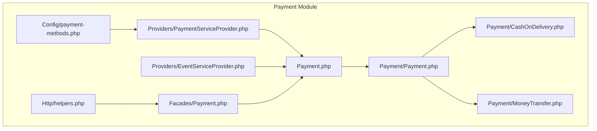
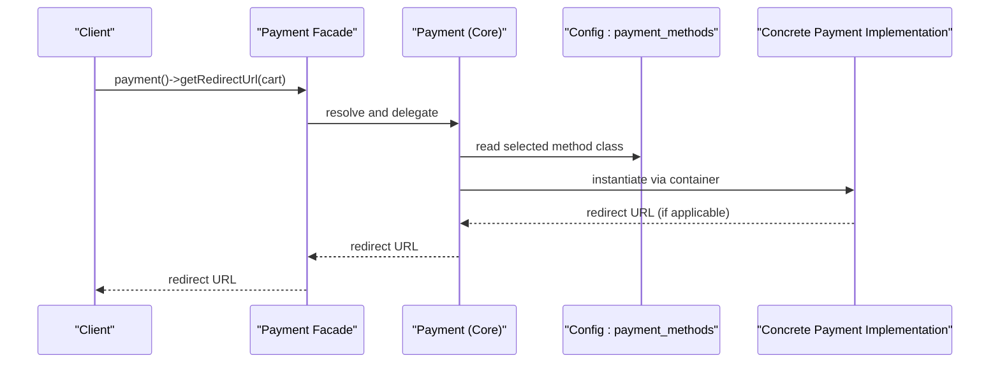
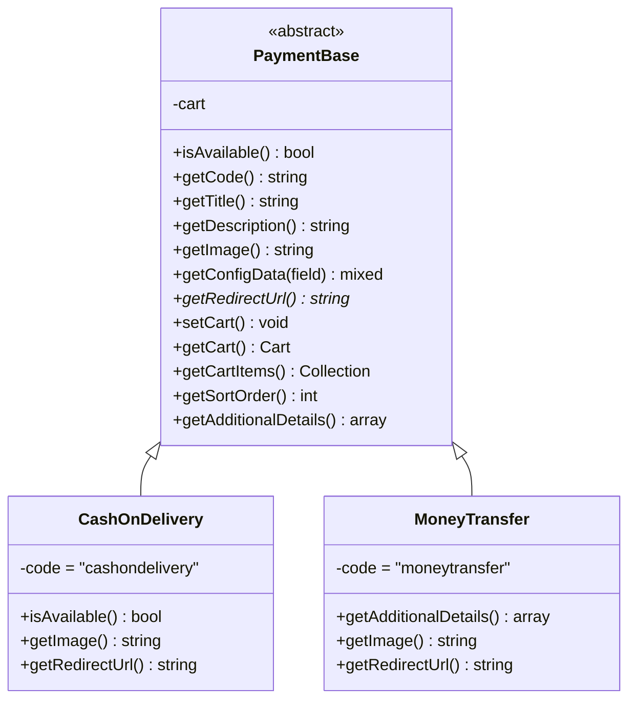
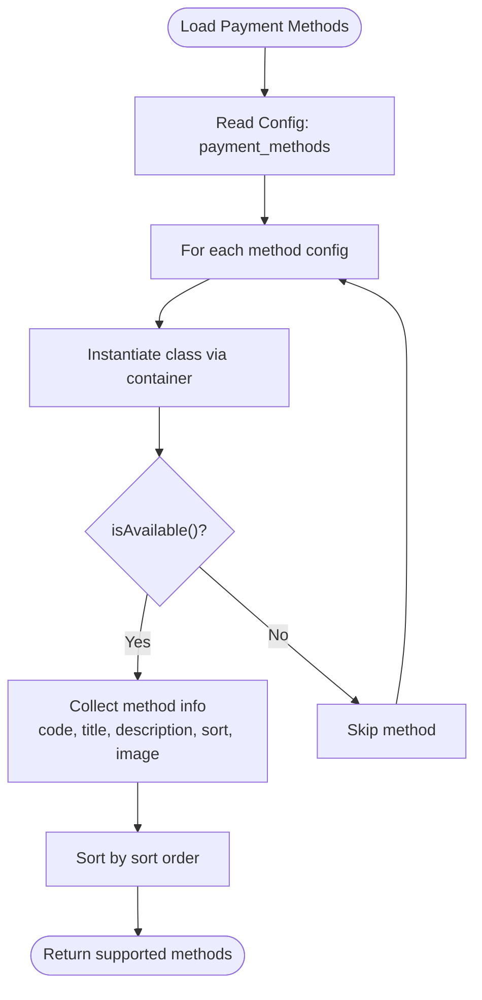
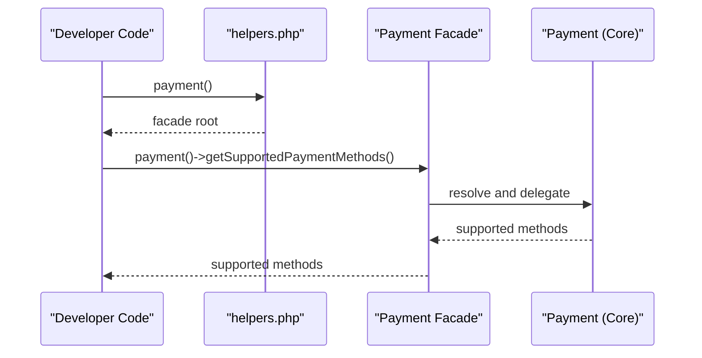
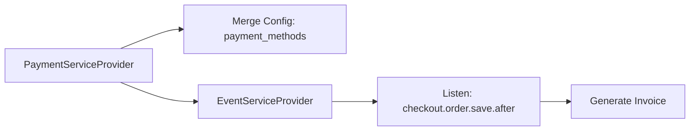
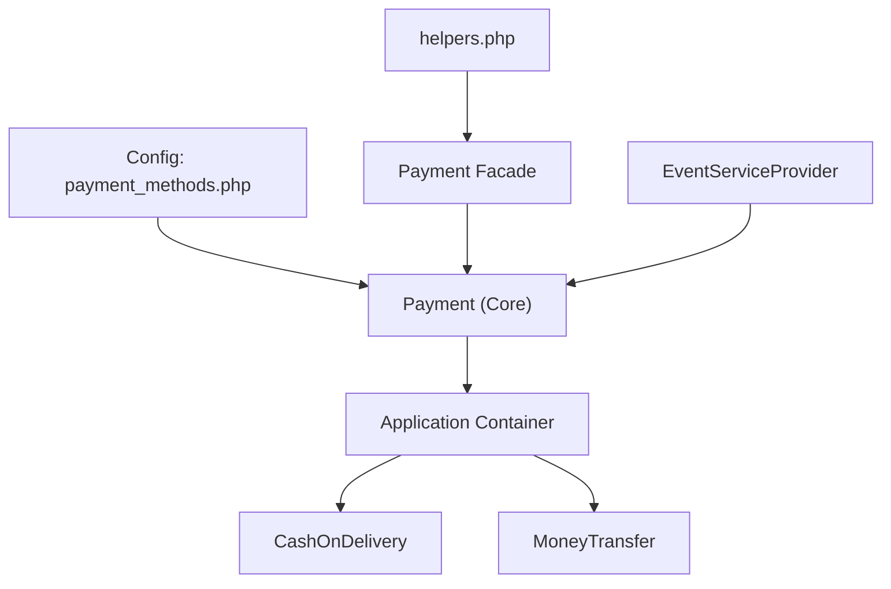
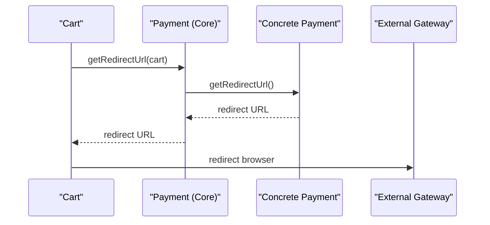

# Gateway Integration

<cite>
**Referenced Files in This Document**
- [Payment.php](file://packages/Webkul/Payment/src/Payment.php)
- [payment-methods.php](file://packages/Webkul/Payment/src/Config/payment-methods.php)
- [Payment Facade](file://packages/Webkul/Payment/src/Facades/Payment.php)
- [Payment Base](file://packages/Webkul/Payment/src/Payment/Payment.php)
- [CashOnDelivery](file://packages/Webkul/Payment/src/Payment/CashOnDelivery.php)
- [MoneyTransfer](file://packages/Webkul/Payment/src/Payment/MoneyTransfer.php)
- [PaymentServiceProvider](file://packages/Webkul/Payment/src/Providers/PaymentServiceProvider.php)
- [helpers.php](file://packages/Webkul/Payment/src/Http/helpers.php)
- [EventServiceProvider](file://packages/Webkul/Payment/src/Providers/EventServiceProvider.php)
</cite>

## Table of Contents
1. [Introduction](#introduction)
2. [Project Structure](#project-structure)
3. [Core Components](#core-components)
4. [Architecture Overview](#architecture-overview)
5. [Detailed Component Analysis](#detailed-component-analysis)
6. [Dependency Analysis](#dependency-analysis)
7. [Performance Considerations](#performance-considerations)
8. [Troubleshooting Guide](#troubleshooting-guide)
9. [Conclusion](#conclusion)
10. [Appendices](#appendices)

## Introduction
This document explains the payment gateway integration in Frooxi (Bagisto), focusing on the payment gateway abstraction layer, configuration-driven method registration, the Payment facade, and the discovery and instantiation of payment implementations. It also covers integration patterns for third-party gateways, webhook handling, payment response processing, redirection workflows, URL generation, and gateway communication protocols.

## Project Structure
The payment module is organized around a configuration-driven registry of payment methods, a base payment class, concrete implementations, a facade for easy access, and service providers that merge configuration and register events.

**Diagram sources**
- [PaymentServiceProvider:1-43](file://packages/Webkul/Payment/src/Providers/PaymentServiceProvider.php#L1-L43)
- [EventServiceProvider:1-19](file://packages/Webkul/Payment/src/Providers/EventServiceProvider.php#L1-L19)
- [payment-methods.php:1-27](file://packages/Webkul/Payment/src/Config/payment-methods.php#L1-L27)
- [Payment Facade:1-20](file://packages/Webkul/Payment/src/Facades/Payment.php#L1-L20)
- [helpers.php:1-16](file://packages/Webkul/Payment/src/Http/helpers.php#L1-L16)
- [Payment Base:1-156](file://packages/Webkul/Payment/src/Payment/Payment.php#L1-L156)
- [CashOnDelivery:1-49](file://packages/Webkul/Payment/src/Payment/CashOnDelivery.php#L1-L49)
- [MoneyTransfer:1-52](file://packages/Webkul/Payment/src/Payment/MoneyTransfer.php#L1-L52)
- [Payment.php:1-82](file://packages/Webkul/Payment/src/Payment.php#L1-L82)

**Section sources**
- [PaymentServiceProvider:1-43](file://packages/Webkul/Payment/src/Providers/PaymentServiceProvider.php#L1-L43)
- [payment-methods.php:1-27](file://packages/Webkul/Payment/src/Config/payment-methods.php#L1-L27)

## Core Components
- Payment facade and helper: Provide convenient access to the payment abstraction layer.
- Payment registry: Configuration-driven list of payment methods with class references.
- Base payment class: Defines common behavior and abstract contract for payment implementations.
- Concrete payment implementations: Examples such as Cash On Delivery and Money Transfer.
- Service providers: Merge configuration and register event listeners.

Key responsibilities:
- Discovery and availability checks of payment methods.
- Dynamic loading of payment classes via configuration.
- Redirect URL retrieval for methods that require external gateway redirection.
- Additional payment details retrieval for display and instructions.
- Event-driven invoice generation after order placement.

**Section sources**
- [Payment Facade:1-20](file://packages/Webkul/Payment/src/Facades/Payment.php#L1-L20)
- [helpers.php:1-16](file://packages/Webkul/Payment/src/Http/helpers.php#L1-L16)
- [Payment.php:1-82](file://packages/Webkul/Payment/src/Payment.php#L1-L82)
- [Payment Base:1-156](file://packages/Webkul/Payment/src/Payment/Payment.php#L1-L156)
- [CashOnDelivery:1-49](file://packages/Webkul/Payment/src/Payment/CashOnDelivery.php#L1-L49)
- [MoneyTransfer:1-52](file://packages/Webkul/Payment/src/Payment/MoneyTransfer.php#L1-L52)
- [EventServiceProvider:1-19](file://packages/Webkul/Payment/src/Providers/EventServiceProvider.php#L1-L19)

## Architecture Overview
The payment system follows a modular, configuration-first pattern:
- Configuration defines available payment methods and their PHP class references.
- The Payment facade resolves the base Payment class, which loads method configurations and instantiates concrete classes.
- Concrete classes implement the abstract contract, including availability checks and optional redirect URLs.
- Events integrate with checkout to trigger invoice generation.

**Diagram sources**
- [Payment.php:62-67](file://packages/Webkul/Payment/src/Payment.php#L62-L67)
- [payment-methods.php:1-27](file://packages/Webkul/Payment/src/Config/payment-methods.php#L1-L27)
- [Payment Base:87-87](file://packages/Webkul/Payment/src/Payment/Payment.php#L87-L87)

## Detailed Component Analysis

### Payment Abstraction Layer
The base Payment class defines the contract and shared utilities:
- Availability check reads configuration to determine if a method is active.
- Accessors for title, description, image, and sort order pull from configuration.
- Cart accessors ensure a cart instance is available for method-specific logic.
- Abstract method getRedirectUrl must be implemented by concrete classes.
- Additional details retrieval supports method-specific instructions.

**Diagram sources**
- [Payment Base:1-156](file://packages/Webkul/Payment/src/Payment/Payment.php#L1-L156)
- [CashOnDelivery:1-49](file://packages/Webkul/Payment/src/Payment/CashOnDelivery.php#L1-L49)
- [MoneyTransfer:1-52](file://packages/Webkul/Payment/src/Payment/MoneyTransfer.php#L1-L52)

**Section sources**
- [Payment Base:1-156](file://packages/Webkul/Payment/src/Payment/Payment.php#L1-L156)

### Payment Method Registry and Dynamic Loading
- The configuration file registers payment methods with their PHP class references and metadata.
- The Payment core class iterates over the registry, instantiates each class via the container, and filters by availability.
- Selected method classes are resolved dynamically using the cart’s chosen payment method code.

**Diagram sources**
- [Payment.php:15-54](file://packages/Webkul/Payment/src/Payment.php#L15-L54)
- [payment-methods.php:1-27](file://packages/Webkul/Payment/src/Config/payment-methods.php#L1-L27)

**Section sources**
- [Payment.php:15-54](file://packages/Webkul/Payment/src/Payment.php#L15-L54)
- [payment-methods.php:1-27](file://packages/Webkul/Payment/src/Config/payment-methods.php#L1-L27)

### Payment Facade and Helper
- The Payment facade binds the base Payment class to a container-resolved instance.
- A global helper function provides convenient access to the facade root.
- These enable concise calls from controllers, views, and services.

**Diagram sources**
- [helpers.php:1-16](file://packages/Webkul/Payment/src/Http/helpers.php#L1-L16)
- [Payment Facade:1-20](file://packages/Webkul/Payment/src/Facades/Payment.php#L1-L20)
- [Payment.php:15-20](file://packages/Webkul/Payment/src/Payment.php#L15-L20)

**Section sources**
- [Payment Facade:1-20](file://packages/Webkul/Payment/src/Facades/Payment.php#L1-L20)
- [helpers.php:1-16](file://packages/Webkul/Payment/src/Http/helpers.php#L1-L16)

### Concrete Implementations
- Cash On Delivery:
  - Enforces availability based on cart stockability.
  - Provides a default image fallback and no redirect URL.
- Money Transfer:
  - Supports additional details such as mailing address.
  - Provides a default image fallback and no redirect URL.

These classes demonstrate how to override availability checks, images, and optional details while adhering to the abstract contract.

**Section sources**
- [CashOnDelivery:1-49](file://packages/Webkul/Payment/src/Payment/CashOnDelivery.php#L1-L49)
- [MoneyTransfer:1-52](file://packages/Webkul/Payment/src/Payment/MoneyTransfer.php#L1-L52)

### Service Providers and Event Integration
- PaymentServiceProvider merges the payment methods configuration into the application and registers the EventServiceProvider.
- EventServiceProvider listens to a checkout order save event to generate invoices, integrating payment outcomes with order lifecycle.

**Diagram sources**
- [PaymentServiceProvider:1-43](file://packages/Webkul/Payment/src/Providers/PaymentServiceProvider.php#L1-L43)
- [EventServiceProvider:1-19](file://packages/Webkul/Payment/src/Providers/EventServiceProvider.php#L1-L19)

**Section sources**
- [PaymentServiceProvider:1-43](file://packages/Webkul/Payment/src/Providers/PaymentServiceProvider.php#L1-L43)
- [EventServiceProvider:1-19](file://packages/Webkul/Payment/src/Providers/EventServiceProvider.php#L1-L19)

## Dependency Analysis
- Configuration-to-class mapping: The registry maps method codes to concrete classes.
- Container resolution: The core class uses the application container to instantiate implementations.
- Facade and helper: Provide access to the core class without direct dependency on container APIs.
- Event-driven integration: Orders trigger invoice generation, decoupling payment outcomes from payment selection.

**Diagram sources**
- [payment-methods.php:1-27](file://packages/Webkul/Payment/src/Config/payment-methods.php#L1-L27)
- [Payment.php:1-82](file://packages/Webkul/Payment/src/Payment.php#L1-L82)
- [PaymentServiceProvider:1-43](file://packages/Webkul/Payment/src/Providers/PaymentServiceProvider.php#L1-L43)
- [EventServiceProvider:1-19](file://packages/Webkul/Payment/src/Providers/EventServiceProvider.php#L1-L19)

**Section sources**
- [Payment.php:1-82](file://packages/Webkul/Payment/src/Payment.php#L1-L82)
- [payment-methods.php:1-27](file://packages/Webkul/Payment/src/Config/payment-methods.php#L1-L27)

## Performance Considerations
- Minimize repeated container instantiation by caching method availability and metadata where appropriate.
- Avoid heavy operations inside isAvailable; defer to configuration reads and lightweight checks.
- Use lazy cart initialization to prevent unnecessary cart loading.
- Keep redirect URL generation efficient; avoid network calls during method discovery.

## Troubleshooting Guide
Common issues and resolutions:
- Method does not appear:
  - Verify the method code exists in the registry and the class is autoloadable.
  - Confirm the method’s active flag is enabled in configuration.
- Incorrect sorting or missing details:
  - Ensure sort order and title/description are set in configuration.
- Redirect URL missing:
  - Implement getRedirectUrl in the concrete class if the method requires redirection.
- Image not displaying:
  - Provide a valid storage path or fallback asset in the implementation.
- Invoice not generated:
  - Confirm the checkout order save event listener is registered and the event fires after order creation.

**Section sources**
- [Payment.php:15-54](file://packages/Webkul/Payment/src/Payment.php#L15-L54)
- [Payment Base:1-156](file://packages/Webkul/Payment/src/Payment/Payment.php#L1-L156)
- [EventServiceProvider:1-19](file://packages/Webkul/Payment/src/Providers/EventServiceProvider.php#L1-L19)

## Conclusion
Frooxi’s payment gateway integration centers on a clean abstraction layer, a configuration-driven registry, and a facade for easy access. Concrete implementations encapsulate gateway-specific logic, while service providers manage configuration and event hooks. This design enables straightforward extension for third-party gateways and robust integration with the checkout and invoicing workflows.

## Appendices

### Integration Patterns for Third-Party Gateways
- Create a new implementation class extending the base Payment class.
- Implement required methods: availability check, code, title, description, sort order, and optional redirect URL.
- Add a configuration entry mapping the method code to your implementation class.
- Register any necessary event listeners or invoice generation hooks.
- Provide additional details and images as needed.

**Section sources**
- [Payment Base:1-156](file://packages/Webkul/Payment/src/Payment/Payment.php#L1-L156)
- [payment-methods.php:1-27](file://packages/Webkul/Payment/src/Config/payment-methods.php#L1-L27)

### Webhook Handling and Payment Response Processing
- Implement a dedicated controller route to receive callbacks from the gateway.
- Validate signatures and reconstruct payment state using the transaction ID.
- Update order and payment statuses accordingly, triggering invoice generation if required.
- Log responses and errors for auditability and debugging.

[No sources needed since this section provides general guidance]

### Payment Redirection Workflow and URL Generation
- For methods requiring redirection, implement getRedirectUrl in the concrete class.
- The Payment core class resolves the selected method’s class and delegates to getRedirectUrl.
- Ensure the returned URL points to the gateway’s hosted page or secure form.

**Diagram sources**
- [Payment.php:62-67](file://packages/Webkul/Payment/src/Payment.php#L62-L67)
- [Payment Base:87-87](file://packages/Webkul/Payment/src/Payment/Payment.php#L87-L87)