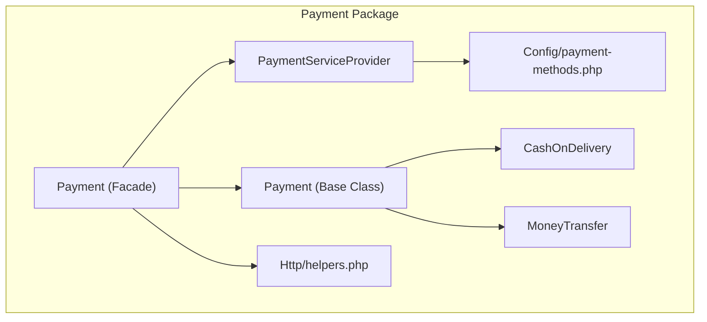
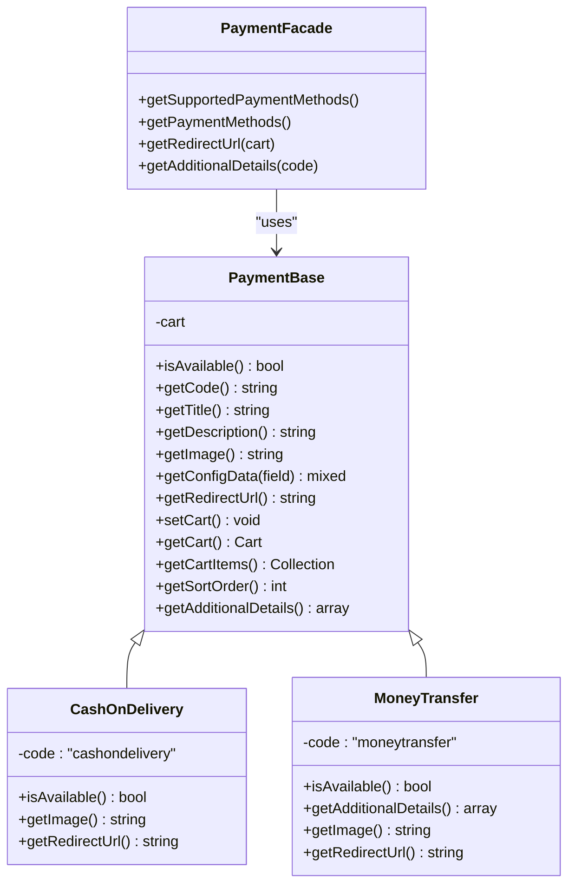
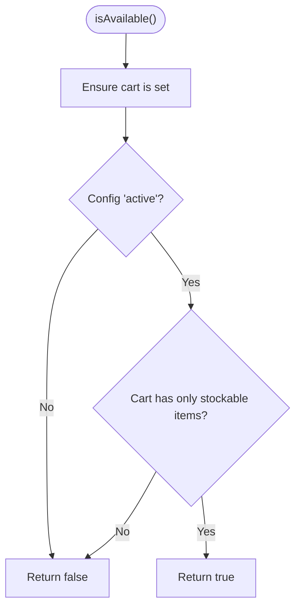
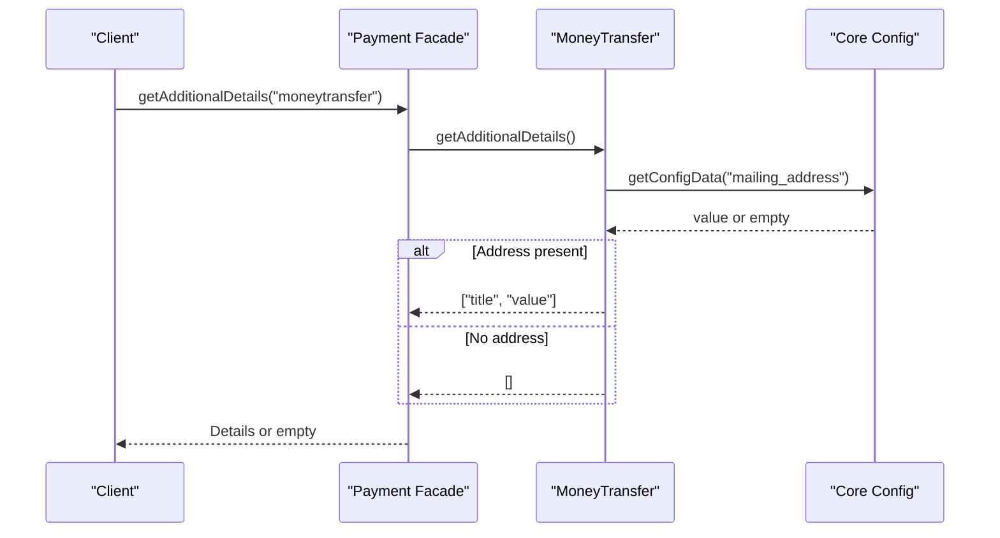
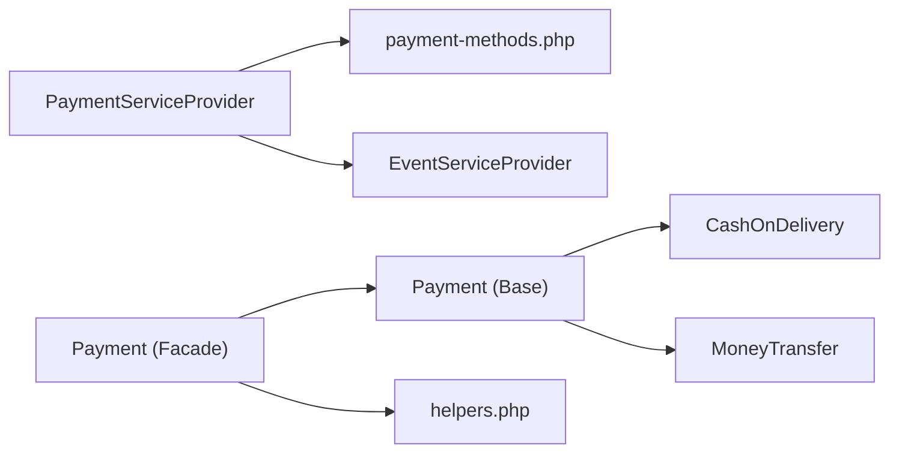

# Payment Methods

<cite>
**Referenced Files in This Document**
- [payment-methods.php](file://packages/Webkul/Payment/src/Config/payment-methods.php)
- [Payment.php](file://packages/Webkul/Payment/src/Payment.php)
- [Payment.php (Base)](file://packages/Webkul/Payment/src/Payment/Payment.php)
- [CashOnDelivery.php](file://packages/Webkul/Payment/src/Payment/CashOnDelivery.php)
- [MoneyTransfer.php](file://packages/Webkul/Payment/src/Payment/MoneyTransfer.php)
- [PaymentServiceProvider.php](file://packages/Webkul/Payment/src/Providers/PaymentServiceProvider.php)
- [helpers.php](file://packages/Webkul/Payment/src/Http/helpers.php)
- [Payment.php (Facade)](file://packages/Webkul/Payment/src/Facades/Payment.php)
- [system.php (Admin Config)](file://packages/Webkul/Admin/src/Config/system.php)
- [CheckoutTest.php](file://packages/Webkul/Shop/tests/Feature/Checkout/CheckoutTest.php)
</cite>

## Table of Contents
1. [Introduction](#introduction)
2. [Project Structure](#project-structure)
3. [Core Components](#core-components)
4. [Architecture Overview](#architecture-overview)
5. [Detailed Component Analysis](#detailed-component-analysis)
6. [Dependency Analysis](#dependency-analysis)
7. [Performance Considerations](#performance-considerations)
8. [Troubleshooting Guide](#troubleshooting-guide)
9. [Conclusion](#conclusion)

## Introduction
This document explains the payment methods subsystem in Frooxi’s Bagisto implementation. It focuses on the built-in methods CashOnDelivery and MoneyTransfer, detailing their configuration, availability checks, integration patterns, and extensibility. It also documents the payment method registration mechanism, method metadata (codes, titles, descriptions, sort ordering), customization options, and how to add new payment methods.

## Project Structure
The payment system is organized around a central facade and service provider, with a base payment class extended by concrete implementations. Configuration is centralized under a dedicated configuration file and merged into the application via the payment service provider. Admin configuration fields define how each payment method is presented and controlled.

**Diagram sources**
- [Payment.php (Facade):1-20](file://packages/Webkul/Payment/src/Facades/Payment.php#L1-L20)
- [PaymentServiceProvider.php:1-43](file://packages/Webkul/Payment/src/Providers/PaymentServiceProvider.php#L1-L43)
- [payment-methods.php:1-26](file://packages/Webkul/Payment/src/Config/payment-methods.php#L1-L26)
- [Payment.php (Base):1-156](file://packages/Webkul/Payment/src/Payment/Payment.php#L1-L156)
- [CashOnDelivery.php:1-49](file://packages/Webkul/Payment/src/Payment/CashOnDelivery.php#L1-L49)
- [MoneyTransfer.php:1-52](file://packages/Webkul/Payment/src/Payment/MoneyTransfer.php#L1-L52)
- [helpers.php:1-16](file://packages/Webkul/Payment/src/Http/helpers.php#L1-L16)

**Section sources**
- [PaymentServiceProvider.php:1-43](file://packages/Webkul/Payment/src/Providers/PaymentServiceProvider.php#L1-L43)
- [payment-methods.php:1-26](file://packages/Webkul/Payment/src/Config/payment-methods.php#L1-L26)

## Core Components
- Payment facade and helper: Provides access to the payment system and exposes convenience functions.
- Payment service provider: Boots the package, registers events, and merges configuration.
- Base payment class: Defines shared behavior (availability, metadata retrieval, cart integration).
- Concrete payment methods: Implement method-specific logic (availability rules, images, additional details).
- Configuration registry: Declares built-in methods, their metadata, and default settings.
- Admin configuration schema: Supplies UI fields for configuring each payment method.

Key responsibilities:
- Method discovery and sorting based on configuration.
- Availability checks against cart and configuration.
- Retrieval of localized titles, descriptions, and images.
- Additional details exposure for display (e.g., mailing address for MoneyTransfer).

**Section sources**
- [Payment.php (Facade):1-20](file://packages/Webkul/Payment/src/Facades/Payment.php#L1-L20)
- [helpers.php:1-16](file://packages/Webkul/Payment/src/Http/helpers.php#L1-L16)
- [PaymentServiceProvider.php:1-43](file://packages/Webkul/Payment/src/Providers/PaymentServiceProvider.php#L1-L43)
- [Payment.php (Base):1-156](file://packages/Webkul/Payment/src/Payment/Payment.php#L1-L156)
- [payment-methods.php:1-26](file://packages/Webkul/Payment/src/Config/payment-methods.php#L1-L26)

## Architecture Overview
The payment system follows a modular pattern:
- Configuration defines available methods and their metadata.
- The base Payment class encapsulates common logic and delegates method-specific behavior to subclasses.
- The facade resolves the base class and delegates to concrete implementations.
- Admin configuration controls visibility, presentation, and operational parameters per method.

**Diagram sources**
- [Payment.php (Facade):1-20](file://packages/Webkul/Payment/src/Facades/Payment.php#L1-L20)
- [Payment.php (Base):1-156](file://packages/Webkul/Payment/src/Payment/Payment.php#L1-L156)
- [CashOnDelivery.php:1-49](file://packages/Webkul/Payment/src/Payment/CashOnDelivery.php#L1-L49)
- [MoneyTransfer.php:1-52](file://packages/Webkul/Payment/src/Payment/MoneyTransfer.php#L1-L52)

## Detailed Component Analysis

### Payment Registration and Configuration
- Registration: The payment service provider merges the configuration file into the application configuration namespace.
- Configuration keys: Each method defines class, code, title, description, active flag, invoice generation behavior, and sort order.
- Defaults: Built-in methods include CashOnDelivery and MoneyTransfer with predefined metadata and sort positions.

Integration points:
- The Payment facade reads configuration to instantiate and filter available methods.
- Sorting is applied client-side after collection.

**Section sources**
- [PaymentServiceProvider.php:36-41](file://packages/Webkul/Payment/src/Providers/PaymentServiceProvider.php#L36-L41)
- [payment-methods.php:6-26](file://packages/Webkul/Payment/src/Config/payment-methods.php#L6-L26)
- [Payment.php:27-54](file://packages/Webkul/Payment/src/Payment.php#L27-L54)

### CashOnDelivery
Behavior:
- Availability: Active in configuration and requires the cart to contain only stockable items.
- Image: Resolves configured image or falls back to a default asset.
- Redirect: No redirection is performed.

Customization options:
- Title, description, image, sort order, and active flag are configurable via admin settings under the method’s configuration key.
- Additional details are not exposed by default.

Availability check flow:

**Diagram sources**
- [CashOnDelivery.php:28-35](file://packages/Webkul/Payment/src/Payment/CashOnDelivery.php#L28-L35)
- [Payment.php (Base):22-25](file://packages/Webkul/Payment/src/Payment/Payment.php#L22-L25)

**Section sources**
- [CashOnDelivery.php:1-49](file://packages/Webkul/Payment/src/Payment/CashOnDelivery.php#L1-L49)

### MoneyTransfer
Behavior:
- Availability: Active in configuration.
- Additional details: Exposes a mailing address when configured, suitable for display in checkout or order summaries.
- Image: Resolves configured image or falls back to a default asset.
- Redirect: No redirection is performed.

Customization options:
- Title, description, image, instructions, sort order, and active flag are configurable via admin settings.
- Mailing address is used to render additional details.

Additional details retrieval:

**Diagram sources**
- [Payment.php:75-80](file://packages/Webkul/Payment/src/Payment.php#L75-L80)
- [MoneyTransfer.php:28-38](file://packages/Webkul/Payment/src/Payment/MoneyTransfer.php#L28-L38)
- [Payment.php (Base):77-80](file://packages/Webkul/Payment/src/Payment/Payment.php#L77-L80)

**Section sources**
- [MoneyTransfer.php:1-52](file://packages/Webkul/Payment/src/Payment/MoneyTransfer.php#L1-L52)

### Payment Facade and Helper
- Facade: Resolves the base Payment class and forwards method calls.
- Helper: Provides a global function to access the payment facade.

Usage patterns:
- Retrieve supported payment methods with titles, descriptions, and sort order.
- Fetch additional details for a given method code.
- Obtain a redirect URL for a selected payment method during checkout.

**Section sources**
- [Payment.php (Facade):1-20](file://packages/Webkul/Payment/src/Facades/Payment.php#L1-L20)
- [helpers.php:1-16](file://packages/Webkul/Payment/src/Http/helpers.php#L1-L16)
- [Payment.php:15-80](file://packages/Webkul/Payment/src/Payment.php#L15-L80)

### Admin Configuration Schema
Admin configuration fields define how each payment method is presented and controlled:
- Visibility: active toggle.
- Presentation: title, description, logo/image upload.
- Behavior: sort order, invoice generation, order status defaults.
- Method-specific: mailing address for MoneyTransfer, instructions, sandbox/test credentials for other methods.

These fields map to configuration paths under the sales payment methods scope and are used by the base Payment class to retrieve localized metadata and flags.

**Section sources**
- [system.php (Admin Config):1978-2255](file://packages/Webkul/Admin/src/Config/system.php#L1978-L2255)
- [Payment.php (Base):77-80](file://packages/Webkul/Payment/src/Payment/Payment.php#L77-L80)

### Integration Patterns
- Method discovery: The Payment facade compiles available methods from configuration, instantiates their classes, and filters by availability.
- Sorting: Methods are sorted by their configured sort order.
- Rendering: Titles and descriptions are resolved from configuration and can be localized.
- Additional details: Method-specific details (e.g., mailing address) are retrieved via the facade.

Example test coverage demonstrates the expected shape of returned payment methods and their sort order.

**Section sources**
- [Payment.php:27-54](file://packages/Webkul/Payment/src/Payment.php#L27-L54)
- [CheckoutTest.php:473-482](file://packages/Webkul/Shop/tests/Feature/Checkout/CheckoutTest.php#L473-L482)
- [CheckoutTest.php:812-822](file://packages/Webkul/Shop/tests/Feature/Checkout/CheckoutTest.php#L812-L822)

## Dependency Analysis
The payment system exhibits low coupling and high cohesion:
- Payment facade depends on the base Payment class and configuration.
- Concrete methods depend on the base class and configuration.
- Service provider depends on configuration merging and event registration.
- Admin configuration schema depends on core configuration resolution.

**Diagram sources**
- [PaymentServiceProvider.php:14-29](file://packages/Webkul/Payment/src/Providers/PaymentServiceProvider.php#L14-L29)
- [payment-methods.php:1-26](file://packages/Webkul/Payment/src/Config/payment-methods.php#L1-L26)
- [Payment.php (Facade):1-20](file://packages/Webkul/Payment/src/Facades/Payment.php#L1-L20)
- [Payment.php (Base):1-156](file://packages/Webkul/Payment/src/Payment/Payment.php#L1-L156)
- [CashOnDelivery.php:1-49](file://packages/Webkul/Payment/src/Payment/CashOnDelivery.php#L1-L49)
- [MoneyTransfer.php:1-52](file://packages/Webkul/Payment/src/Payment/MoneyTransfer.php#L1-L52)
- [helpers.php:1-16](file://packages/Webkul/Payment/src/Http/helpers.php#L1-L16)

**Section sources**
- [PaymentServiceProvider.php:14-29](file://packages/Webkul/Payment/src/Providers/PaymentServiceProvider.php#L14-L29)
- [Payment.php (Base):1-156](file://packages/Webkul/Payment/src/Payment/Payment.php#L1-L156)

## Performance Considerations
- Instantiation cost: Each available method is instantiated once during discovery; keep method constructors lightweight.
- Configuration access: Repeated calls to configuration are inexpensive; avoid redundant lookups in tight loops.
- Sorting: Sorting is O(n log n); acceptable for typical small sets of payment methods.
- Image resolution: Storage URLs are resolved per method; caching rendered images at the view layer can reduce overhead.

## Troubleshooting Guide
Common issues and resolutions:
- Method does not appear:
  - Verify the method is registered in configuration and marked active.
  - Confirm availability checks pass (e.g., stockable items for CashOnDelivery).
- Incorrect ordering:
  - Ensure sort order is set and unique; methods are sorted ascending by sort value.
- Missing images:
  - Provide a logo/image in admin configuration or rely on default fallback assets.
- Additional details not displayed:
  - For MoneyTransfer, ensure mailing address is configured; otherwise, details are intentionally empty.
- Redirect URL expectations:
  - Both CashOnDelivery and MoneyTransfer return no redirect URL by default; implement in subclasses if needed.

**Section sources**
- [payment-methods.php:6-26](file://packages/Webkul/Payment/src/Config/payment-methods.php#L6-L26)
- [CashOnDelivery.php:28-35](file://packages/Webkul/Payment/src/Payment/CashOnDelivery.php#L28-L35)
- [MoneyTransfer.php:28-38](file://packages/Webkul/Payment/src/Payment/MoneyTransfer.php#L28-L38)
- [Payment.php:62-80](file://packages/Webkul/Payment/src/Payment.php#L62-L80)

## Conclusion
Frooxi’s payment system provides a clean, extensible foundation for payment methods. Built-in methods CashOnDelivery and MoneyTransfer demonstrate standardized configuration, availability checks, and customization via admin settings. The base class encapsulates shared behavior, while the facade and service provider integrate seamlessly with the application. Extending the system with new payment methods requires registering the method in configuration, implementing the base class, and leveraging admin configuration fields for presentation and behavior.