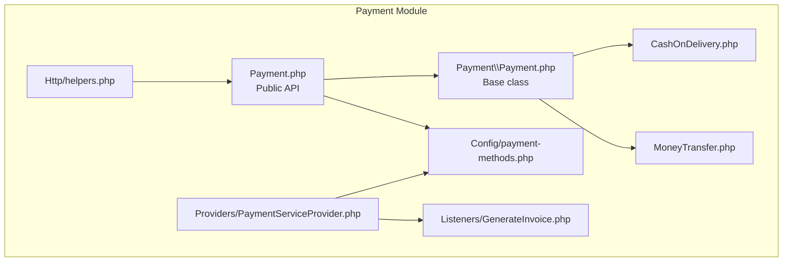
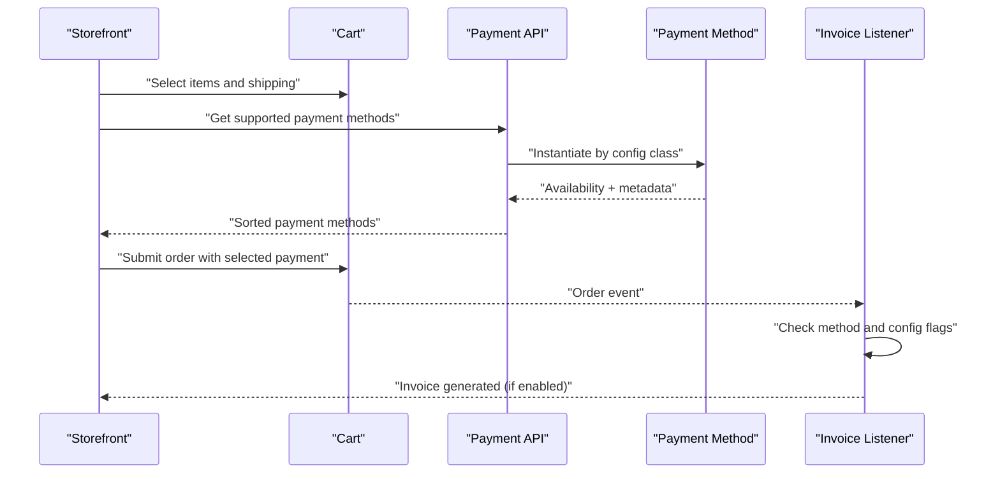
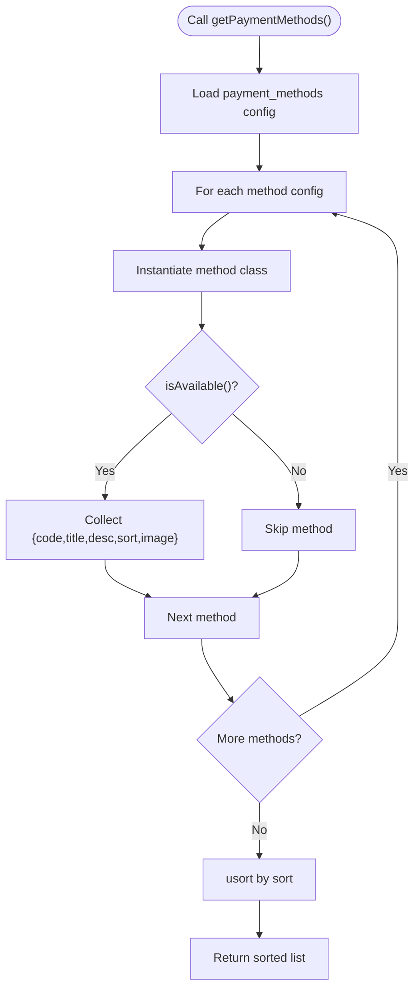
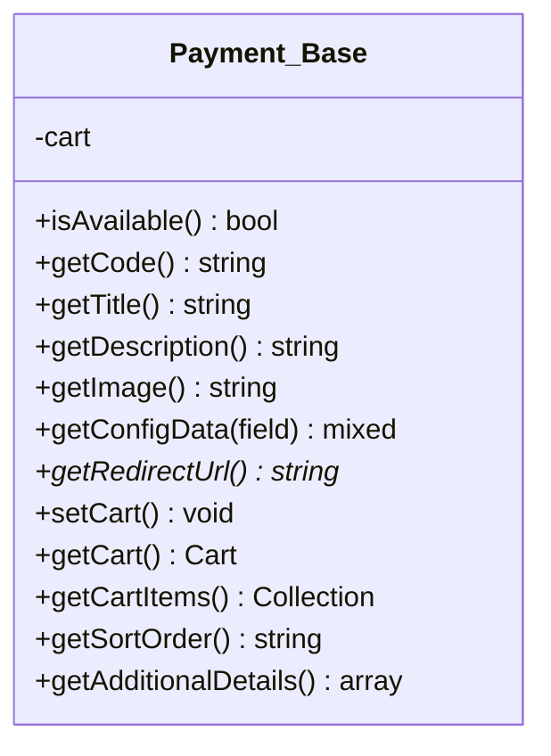
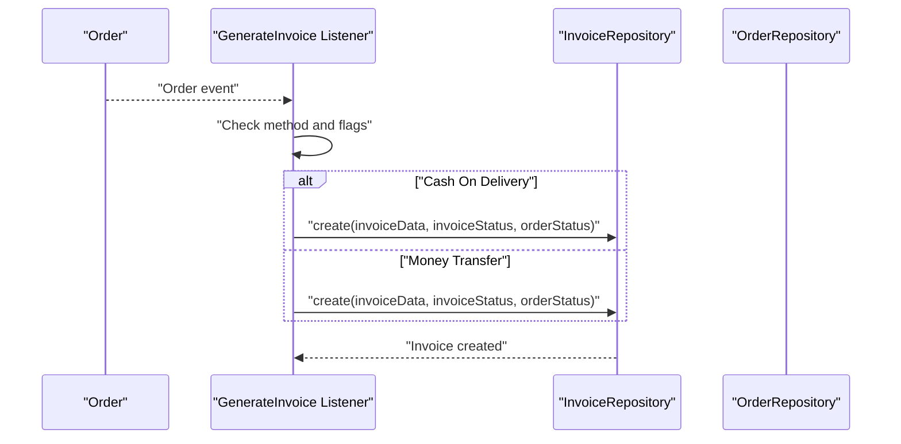
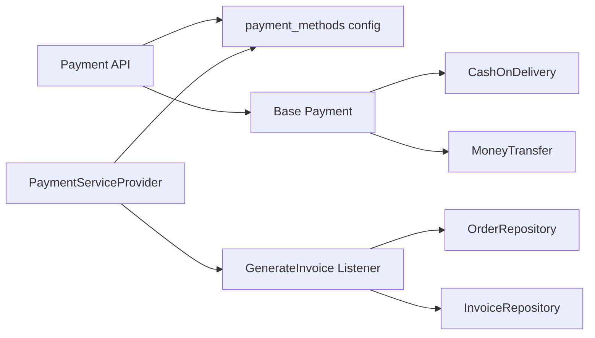

# Payment System

<cite>
**Referenced Files in This Document**
- [Payment.php](file://packages/Webkul/Payment/src/Payment.php)
- [Payment.php](file://packages/Webkul/Payment/src/Payment/Payment.php)
- [CashOnDelivery.php](file://packages/Webkul/Payment/src/Payment/CashOnDelivery.php)
- [MoneyTransfer.php](file://packages/Webkul/Payment/src/Payment/MoneyTransfer.php)
- [payment-methods.php](file://packages/Webkul/Payment/src/Config/payment-methods.php)
- [PaymentServiceProvider.php](file://packages/Webkul/Payment/src/Providers/PaymentServiceProvider.php)
- [helpers.php](file://packages/Webkul/Payment/src/Http/helpers.php)
- [GenerateInvoice.php](file://packages/Webkul/Payment/src/Listeners/GenerateInvoice.php)
- [composer.json](file://packages/Webkul/Payment/composer.json)
- [CheckoutTest.php](file://packages/Webkul/Shop/tests/Feature/Checkout/CheckoutTest.php)
- [system.php](file://packages/Webkul/Admin/src/Config/system.php)
</cite>

## Table of Contents
1. [Introduction](#introduction)
2. [Project Structure](#project-structure)
3. [Core Components](#core-components)
4. [Architecture Overview](#architecture-overview)
5. [Detailed Component Analysis](#detailed-component-analysis)
6. [Dependency Analysis](#dependency-analysis)
7. [Performance Considerations](#performance-considerations)
8. [Security and Compliance](#security-and-compliance)
9. [Troubleshooting Guide](#troubleshooting-guide)
10. [Conclusion](#conclusion)

## Introduction
This document describes Frooxi’s payment processing system as implemented in the repository. It covers supported payment methods, configuration, gateway integration points, transaction management, settlement via invoices, and operational workflows. It also outlines extensibility for third-party payment gateways, analytics hooks, and error handling patterns.

## Project Structure
The payment system is organized as a Laravel module under packages/Webkul/Payment. Key areas:
- Payment method base and implementations
- Configuration registry for payment methods
- Service provider registration and configuration merging
- Helper and facade support
- Listener for invoice generation upon order events
- Tests demonstrating supported payment methods in the storefront

**Diagram sources**
- [Payment.php:1-82](file://packages/Webkul/Payment/src/Payment.php#L1-L82)
- [Payment.php:1-156](file://packages/Webkul/Payment/src/Payment/Payment.php#L1-L156)
- [CashOnDelivery.php:1-49](file://packages/Webkul/Payment/src/Payment/CashOnDelivery.php#L1-L49)
- [MoneyTransfer.php:1-52](file://packages/Webkul/Payment/src/Payment/MoneyTransfer.php#L1-L52)
- [payment-methods.php:1-27](file://packages/Webkul/Payment/src/Config/payment-methods.php#L1-L27)
- [PaymentServiceProvider.php:1-43](file://packages/Webkul/Payment/src/Providers/PaymentServiceProvider.php#L1-L43)
- [helpers.php:1-16](file://packages/Webkul/Payment/src/Http/helpers.php#L1-L16)
- [GenerateInvoice.php:1-70](file://packages/Webkul/Payment/src/Listeners/GenerateInvoice.php#L1-L70)

**Section sources**
- [Payment.php:1-82](file://packages/Webkul/Payment/src/Payment.php#L1-L82)
- [Payment.php:1-156](file://packages/Webkul/Payment/src/Payment/Payment.php#L1-L156)
- [CashOnDelivery.php:1-49](file://packages/Webkul/Payment/src/Payment/CashOnDelivery.php#L1-L49)
- [MoneyTransfer.php:1-52](file://packages/Webkul/Payment/src/Payment/MoneyTransfer.php#L1-L52)
- [payment-methods.php:1-27](file://packages/Webkul/Payment/src/Config/payment-methods.php#L1-L27)
- [PaymentServiceProvider.php:1-43](file://packages/Webkul/Payment/src/Providers/PaymentServiceProvider.php#L1-L43)
- [helpers.php:1-16](file://packages/Webkul/Payment/src/Http/helpers.php#L1-L16)
- [GenerateInvoice.php:1-70](file://packages/Webkul/Payment/src/Listeners/GenerateInvoice.php#L1-L70)
- [composer.json:1-28](file://packages/Webkul/Payment/composer.json#L1-L28)

## Core Components
- Public Payment API: Aggregates supported payment methods, resolves redirect URLs per cart, and fetches additional payment details.
- Base Payment Method: Defines common behavior (availability, config retrieval, sorting, images, and abstract redirect URL).
- Concrete Methods: Cash On Delivery and Money Transfer with method-specific availability checks and presentation details.
- Configuration Registry: Declares built-in methods and their metadata (class, code, title, description, active flag, sort).
- Service Provider: Registers configuration and events; merges payment method config into the application.
- Helper: Provides a convenience function to access the payment API.
- Invoice Listener: Generates invoices for eligible cash-on-delivery and money-transfer orders based on configuration.

**Section sources**
- [Payment.php:15-80](file://packages/Webkul/Payment/src/Payment.php#L15-L80)
- [Payment.php:22-154](file://packages/Webkul/Payment/src/Payment/Payment.php#L22-L154)
- [CashOnDelivery.php:28-47](file://packages/Webkul/Payment/src/Payment/CashOnDelivery.php#L28-L47)
- [MoneyTransfer.php:28-50](file://packages/Webkul/Payment/src/Payment/MoneyTransfer.php#L28-L50)
- [payment-methods.php:6-26](file://packages/Webkul/Payment/src/Config/payment-methods.php#L6-L26)
- [PaymentServiceProvider.php:36-41](file://packages/Webkul/Payment/src/Providers/PaymentServiceProvider.php#L36-L41)
- [helpers.php:5-15](file://packages/Webkul/Payment/src/Http/helpers.php#L5-L15)
- [GenerateInvoice.php:29-68](file://packages/Webkul/Payment/src/Listeners/GenerateInvoice.php#L29-L68)

## Architecture Overview
The payment system exposes a unified interface to resolve available payment methods and derive redirect URLs when applicable. Concrete payment methods are resolved from configuration and queried for metadata and availability. Orders trigger invoice generation through a listener when configured.

**Diagram sources**
- [Payment.php:15-54](file://packages/Webkul/Payment/src/Payment.php#L15-L54)
- [Payment.php:62-67](file://packages/Webkul/Payment/src/Payment.php#L62-L67)
- [GenerateInvoice.php:29-68](file://packages/Webkul/Payment/src/Listeners/GenerateInvoice.php#L29-L68)
- [payment-methods.php:6-26](file://packages/Webkul/Payment/src/Config/payment-methods.php#L6-L26)

## Detailed Component Analysis

### Payment API
Responsibilities:
- Aggregate supported payment methods from configuration.
- Sort methods by configured order.
- Resolve redirect URL for a given cart.
- Fetch additional payment details for a method code.

Key behaviors:
- Iterates over registered payment methods and instantiates their classes.
- Filters by availability and collects method metadata (code, title, description, sort, image).
- Sorts by sort order ascending.

**Diagram sources**
- [Payment.php:27-54](file://packages/Webkul/Payment/src/Payment.php#L27-L54)

**Section sources**
- [Payment.php:15-80](file://packages/Webkul/Payment/src/Payment.php#L15-L80)

### Base Payment Method
Responsibilities:
- Provide availability check based on configuration.
- Retrieve localized configuration values (title, description, image, instructions, sort).
- Manage cart context for methods that require it.
- Define abstract redirect URL contract.

Notable points:
- Uses a core configuration accessor to read sales.payment_methods.<code>.<field>.
- Provides defaults for images when not configured.

**Diagram sources**
- [Payment.php:8-154](file://packages/Webkul/Payment/src/Payment/Payment.php#L8-L154)

**Section sources**
- [Payment.php:22-154](file://packages/Webkul/Payment/src/Payment/Payment.php#L22-L154)

### Cash On Delivery
Capabilities:
- Conditional availability based on cart stockability.
- Image resolution with fallback asset.
- No redirect URL (in-warehouse collection).

Behavior highlights:
- Availability depends on cart having only stockable items.
- Uses storage URL for configured image or falls back to a shop asset.

**Section sources**
- [CashOnDelivery.php:28-47](file://packages/Webkul/Payment/src/Payment/CashOnDelivery.php#L28-L47)

### Money Transfer
Capabilities:
- Additional details retrieval for mailing address.
- Image resolution with fallback asset.
- No redirect URL (bank transfer outside app).

Behavior highlights:
- Additional details include a configurable mailing address label/value.
- Resolves image from storage or shop asset.

**Section sources**
- [MoneyTransfer.php:28-50](file://packages/Webkul/Payment/src/Payment/MoneyTransfer.php#L28-L50)

### Payment Method Configuration
Registry:
- Declares built-in methods with class, code, title, description, active flag, and sort.
- Supports enabling/disabling and ordering of methods.

Integration:
- Service provider merges this config into the application under the key payment_methods.
- Payment API reads this registry to instantiate and query methods.

**Section sources**
- [payment-methods.php:6-26](file://packages/Webkul/Payment/src/Config/payment-methods.php#L6-L26)
- [PaymentServiceProvider.php:36-41](file://packages/Webkul/Payment/src/Providers/PaymentServiceProvider.php#L36-L41)

### Redirect URL Resolution
- The Payment API resolves the redirect URL for a given cart by instantiating the selected method class and delegating to its getRedirectUrl().
- Built-in methods (Cash On Delivery, Money Transfer) return empty URLs, indicating no external redirect is required.

**Section sources**
- [Payment.php:62-67](file://packages/Webkul/Payment/src/Payment.php#L62-L67)
- [CashOnDelivery.php](file://packages/Webkul/Payment/src/Payment/CashOnDelivery.php#L21)
- [MoneyTransfer.php](file://packages/Webkul/Payment/src/Payment/MoneyTransfer.php#L21)

### Invoice Generation and Settlement
- An event listener generates invoices for eligible orders when the payment method supports invoice creation and the configuration flag is enabled.
- Applies per-method invoice and order statuses from configuration.

**Diagram sources**
- [GenerateInvoice.php:29-68](file://packages/Webkul/Payment/src/Listeners/GenerateInvoice.php#L29-L68)

**Section sources**
- [GenerateInvoice.php:29-68](file://packages/Webkul/Payment/src/Listeners/GenerateInvoice.php#L29-L68)

### Third-Party Gateways and Extensibility
- The system supports third-party payment methods by registering them in the payment_methods configuration with their class and metadata.
- Tests demonstrate additional methods (e.g., Stripe, Razorpay, PayU, PayPal Smart Button, PayPal Standard) being returned by the storefront checkout endpoint, indicating integration points for external gateways.

**Section sources**
- [payment-methods.php:6-26](file://packages/Webkul/Payment/src/Config/payment-methods.php#L6-L26)
- [CheckoutTest.php:450-474](file://packages/Webkul/Shop/tests/Feature/Checkout/CheckoutTest.php#L450-L474)
- [CheckoutTest.php:790-813](file://packages/Webkul/Shop/tests/Feature/Checkout/CheckoutTest.php#L790-L813)
- [CheckoutTest.php:1191-1212](file://packages/Webkul/Shop/tests/Feature/Checkout/CheckoutTest.php#L1191-L1212)

### Payment Analytics
- The storefront checkout endpoint returns payment methods with method code, title, description, and sort order, enabling client-side analytics and reporting on method usage.

**Section sources**
- [CheckoutTest.php:450-474](file://packages/Webkul/Shop/tests/Feature/Checkout/CheckoutTest.php#L450-L474)

## Dependency Analysis
- Payment API depends on:
  - Configuration registry for method metadata and classes
  - Base Payment class for shared behavior
  - Concrete payment method implementations
  - Cart facade for cart context
- Service provider depends on:
  - Configuration file merge
  - Event service registration
- Listener depends on:
  - Order and Invoice repositories
  - Core configuration for per-method flags and statuses

**Diagram sources**
- [Payment.php:15-80](file://packages/Webkul/Payment/src/Payment.php#L15-L80)
- [PaymentServiceProvider.php:36-41](file://packages/Webkul/Payment/src/Providers/PaymentServiceProvider.php#L36-L41)
- [GenerateInvoice.php:18-21](file://packages/Webkul/Payment/src/Listeners/GenerateInvoice.php#L18-L21)

**Section sources**
- [Payment.php:15-80](file://packages/Webkul/Payment/src/Payment.php#L15-L80)
- [PaymentServiceProvider.php:36-41](file://packages/Webkul/Payment/src/Providers/PaymentServiceProvider.php#L36-L41)
- [GenerateInvoice.php:18-21](file://packages/Webkul/Payment/src/Listeners/GenerateInvoice.php#L18-L21)

## Performance Considerations
- Method enumeration and instantiation occur per request; keep the number of registered methods reasonable.
- Sorting is O(n log n); ensure sort values are consistent and minimal to reduce overhead.
- Avoid heavy operations inside isAvailable() and getRedirectUrl(); defer to configuration checks and cached cart data.
- Use caching for frequently accessed configuration values if needed.

## Security and Compliance
- PCI DSS: The current built-in methods (Cash On Delivery, Money Transfer) do not process card data within the application. They rely on offline or bank-based flows.
- Tokenization and sensitive data: For third-party gateways, ensure card data is handled by the gateway and not stored locally. Use HTTPS and secure cookies.
- Fraud prevention: Integrate with external fraud detection services and leverage order validation hooks. Monitor high-risk methods and countries.
- Logging and audit: Record payment attempts and outcomes without storing sensitive data. Use masked identifiers for logs.

## Troubleshooting Guide
Common scenarios and resolutions:
- Payment method not visible:
  - Verify the method is active in configuration and passes availability checks.
  - Confirm the method appears in the payment_methods registry.
- Incorrect order of methods:
  - Adjust the sort value in configuration for the affected method.
- Redirect URL missing:
  - Built-in methods intentionally return empty URLs; confirm the method does not require redirection.
- Invoice not generated:
  - Check per-method flags for invoice generation and statuses.
  - Ensure the order event fires and the listener executes.

**Section sources**
- [Payment.php:15-80](file://packages/Webkul/Payment/src/Payment.php#L15-L80)
- [payment-methods.php:6-26](file://packages/Webkul/Payment/src/Config/payment-methods.php#L6-L26)
- [GenerateInvoice.php:29-68](file://packages/Webkul/Payment/src/Listeners/GenerateInvoice.php#L29-L68)

## Conclusion
Frooxi’s payment system provides a modular, configurable foundation for payment methods with clear extension points for third-party gateways. It supports offline methods out-of-the-box, integrates with order events for invoice generation, and exposes method metadata for analytics. For production deployments integrating external gateways, ensure secure handling of sensitive data, robust error handling, and compliance with applicable regulations.