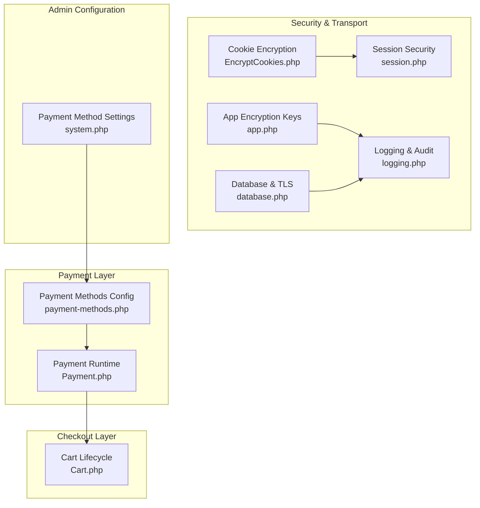
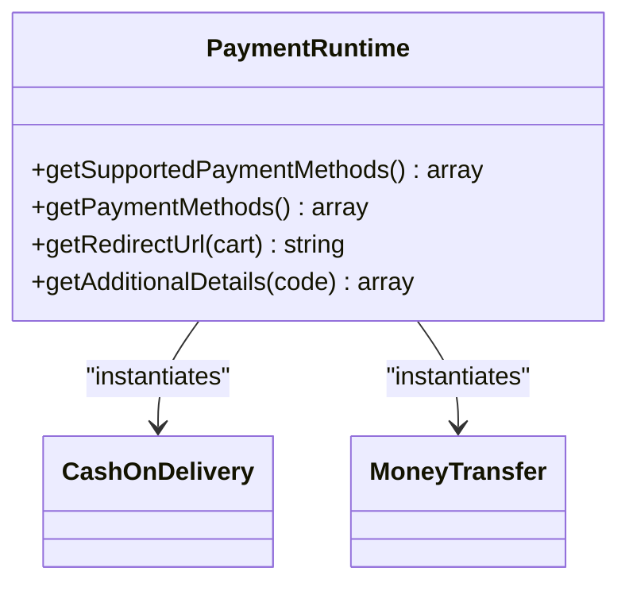
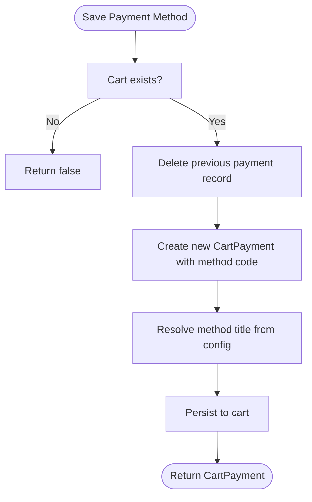
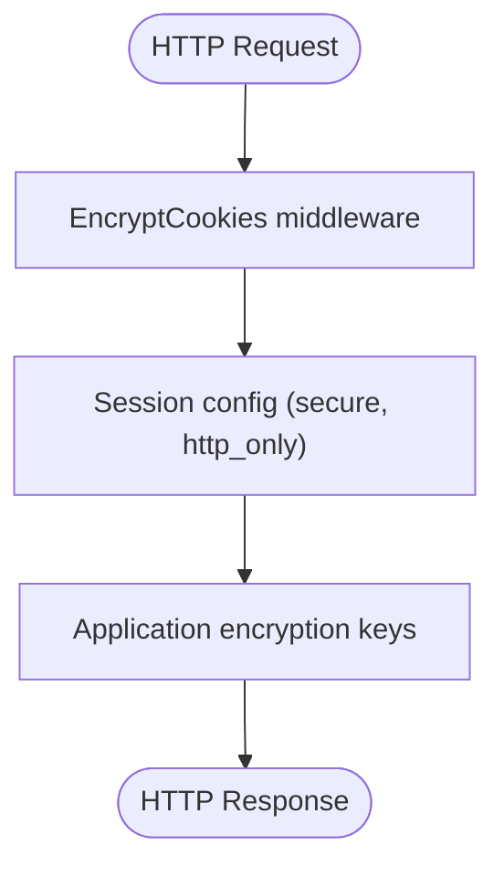
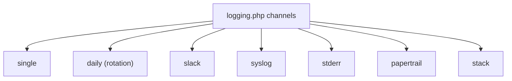
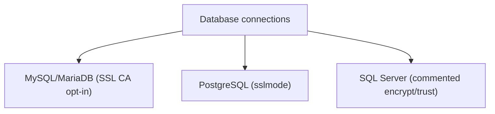
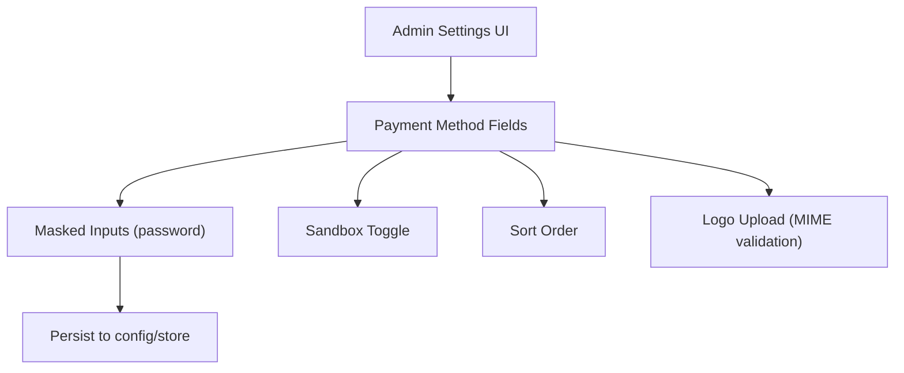
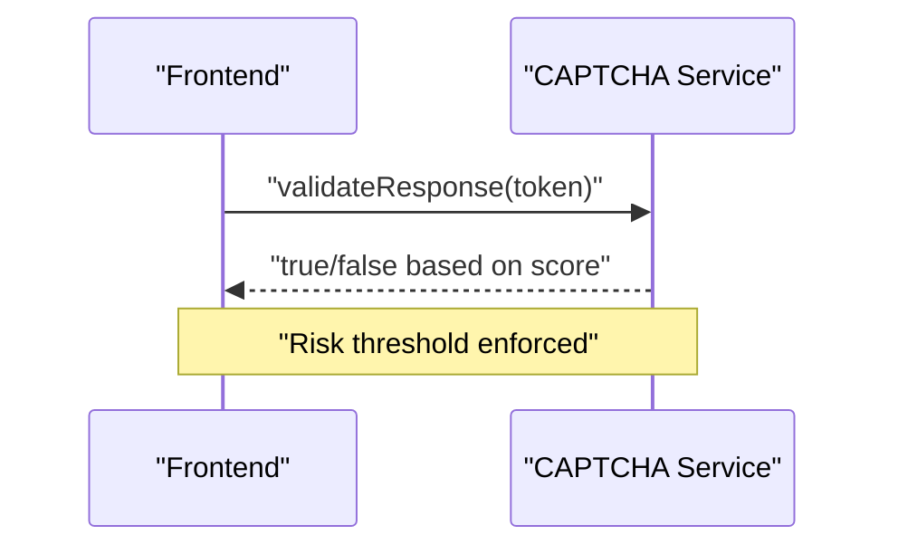
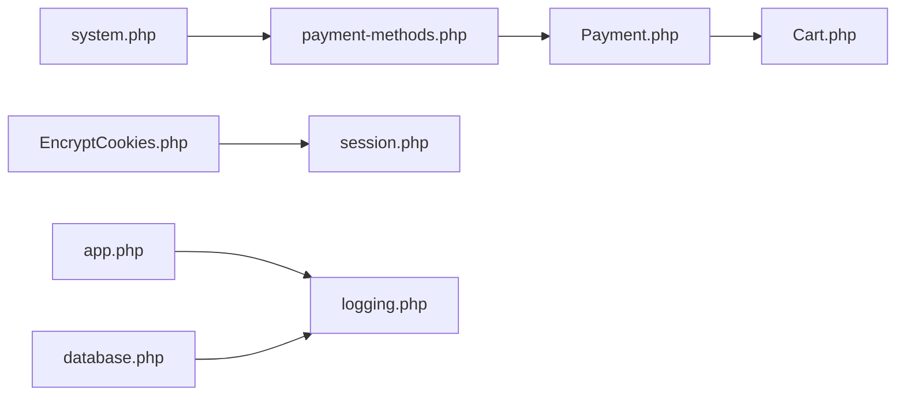

# Security & Compliance

<cite>
**Referenced Files in This Document**
- [SECURITY.md](file://SECURITY.md)
- [payment-methods.php](file://packages/Webkul/Payment/src/Config/payment-methods.php)
- [Payment.php](file://packages/Webkul/Payment/src/Payment.php)
- [Cart.php](file://packages/Webkul/Checkout/src/Cart.php)
- [EncryptCookies.php](file://app/Http/Middleware/EncryptCookies.php)
- [session.php](file://config/session.php)
- [app.php](file://config/app.php)
- [logging.php](file://config/logging.php)
- [database.php](file://config/database.php)
- [system.php](file://packages/Webkul/Admin/src/Config/system.php)
- [CaptchaTest.php](file://packages/Webkul/Customer/tests/Unit/CaptchaTest.php)
</cite>

## Table of Contents
1. [Introduction](#introduction)
2. [Project Structure](#project-structure)
3. [Core Components](#core-components)
4. [Architecture Overview](#architecture-overview)
5. [Detailed Component Analysis](#detailed-component-analysis)
6. [Dependency Analysis](#dependency-analysis)
7. [Performance Considerations](#performance-considerations)
8. [Troubleshooting Guide](#troubleshooting-guide)
9. [Conclusion](#conclusion)
10. [Appendices](#appendices)

## Introduction
This document provides comprehensive guidance on payment security and compliance for Frooxi (Bagisto). It focuses on PCI DSS alignment, secure handling of payment data, encryption practices, tokenization readiness, sensitive data protection, secure transmission, fraud prevention, risk assessment, and audit-readiness. It also outlines best practices for integrating third-party payment gateways, configuring SSL/TLS, and implementing secure payment pages, while addressing regulatory compliance, data retention, and security audit requirements.

## Project Structure
Frooxi’s payment security posture is distributed across several modules and configuration layers:
- Payment method registry and runtime selection
- Checkout cart lifecycle and payment method persistence
- Cookie and session security configuration
- Application encryption and logging
- Database connectivity and transport security
- Admin configuration for payment method credentials
- CAPTCHA-based risk scoring for frontend interactions



**Diagram sources**
- [payment-methods.php:1-27](file://packages/Webkul/Payment/src/Config/payment-methods.php#L1-L27)
- [Payment.php:1-82](file://packages/Webkul/Payment/src/Payment.php#L1-L82)
- [Cart.php:598-616](file://packages/Webkul/Checkout/src/Cart.php#L598-L616)
- [EncryptCookies.php:1-19](file://app/Http/Middleware/EncryptCookies.php#L1-L19)
- [session.php:159-185](file://config/session.php#L159-L185)
- [app.php:150-167](file://config/app.php#L150-L167)
- [logging.php:1-133](file://config/logging.php#L1-L133)
- [database.php:32-83](file://config/database.php#L32-L83)
- [system.php:1734-2147](file://packages/Webkul/Admin/src/Config/system.php#L1734-L2147)

**Section sources**
- [payment-methods.php:1-27](file://packages/Webkul/Payment/src/Config/payment-methods.php#L1-L27)
- [Payment.php:1-82](file://packages/Webkul/Payment/src/Payment.php#L1-L82)
- [Cart.php:598-616](file://packages/Webkul/Checkout/src/Cart.php#L598-L616)
- [EncryptCookies.php:1-19](file://app/Http/Middleware/EncryptCookies.php#L1-L19)
- [session.php:159-185](file://config/session.php#L159-L185)
- [app.php:150-167](file://config/app.php#L150-L167)
- [logging.php:1-133](file://config/logging.php#L1-L133)
- [database.php:32-83](file://config/database.php#L32-L83)
- [system.php:1734-2147](file://packages/Webkul/Admin/src/Config/system.php#L1734-L2147)

## Core Components
- Payment method registry and runtime resolution
- Cart payment method persistence
- Cookie and session security controls
- Application encryption keys and cipher suite
- Logging and audit trail configuration
- Database transport security options
- Admin credential configuration for payment methods
- Frontend CAPTCHA risk scoring

Key responsibilities:
- Payment methods are registered centrally and resolved at runtime.
- Payment method selection is persisted in the cart for order processing.
- Sensitive credentials are stored via admin configuration with masked input types.
- Sessions and cookies are secured via dedicated configuration.
- Logs capture operational events suitable for audits.
- Database connections support TLS-related options.

**Section sources**
- [payment-methods.php:6-26](file://packages/Webkul/Payment/src/Config/payment-methods.php#L6-L26)
- [Payment.php:15-80](file://packages/Webkul/Payment/src/Payment.php#L15-L80)
- [Cart.php:598-616](file://packages/Webkul/Checkout/src/Cart.php#L598-L616)
- [system.php:1734-2147](file://packages/Webkul/Admin/src/Config/system.php#L1734-L2147)
- [EncryptCookies.php:14-17](file://app/Http/Middleware/EncryptCookies.php#L14-L17)
- [session.php:159-185](file://config/session.php#L159-L185)
- [app.php:150-167](file://config/app.php#L150-L167)
- [logging.php:53-133](file://config/logging.php#L53-L133)
- [database.php:32-83](file://config/database.php#L32-L83)

## Architecture Overview
The payment security architecture integrates configuration-driven payment methods, a secure checkout flow, and hardened transport/security layers.

```mermaid
sequenceDiagram
participant Client as "Client Browser"
participant Shop as "Shop Frontend"
participant Cart as "Cart (Checkout)"
participant Pay as "Payment Runtime"
participant DB as "Database"
participant Admin as "Admin Panel"
Client->>Shop : "Select payment method"
Shop->>Cart : "Save selected payment method"
Cart->>DB : "Persist cart with payment method"
Cart->>Pay : "Resolve payment method class"
Pay-->>Shop : "Redirect URL or additional details"
Admin->>DB : "Store masked credentials (per method)"
Note over Client,DB : "All transport uses TLS; cookies and sessions are secured"
```

**Diagram sources**
- [Cart.php:598-616](file://packages/Webkul/Checkout/src/Cart.php#L598-L616)
- [Payment.php:62-67](file://packages/Webkul/Payment/src/Payment.php#L62-L67)
- [system.php:1734-2147](file://packages/Webkul/Admin/src/Config/system.php#L1734-L2147)
- [session.php:159-185](file://config/session.php#L159-L185)
- [database.php:32-83](file://config/database.php#L32-L83)

## Detailed Component Analysis

### Payment Method Registry and Runtime Resolution
- Payment methods are declared in a centralized configuration and resolved dynamically at runtime.
- The runtime aggregates available methods, sorts them, and exposes metadata for UI rendering.
- Redirect URLs and additional details are delegated to individual payment method classes.



**Diagram sources**
- [Payment.php:15-80](file://packages/Webkul/Payment/src/Payment.php#L15-L80)
- [payment-methods.php:6-26](file://packages/Webkul/Payment/src/Config/payment-methods.php#L6-L26)

**Section sources**
- [Payment.php:15-80](file://packages/Webkul/Payment/src/Payment.php#L15-L80)
- [payment-methods.php:6-26](file://packages/Webkul/Payment/src/Config/payment-methods.php#L6-L26)

### Cart Payment Method Persistence
- The cart persists the chosen payment method, ensuring continuity across checkout steps.
- The saved method title is resolved from system configuration.



**Diagram sources**
- [Cart.php:598-616](file://packages/Webkul/Checkout/src/Cart.php#L598-L616)

**Section sources**
- [Cart.php:598-616](file://packages/Webkul/Checkout/src/Cart.php#L598-L616)

### Secure Cookie and Session Management
- Cookies are encrypted by default, with a small allowlist of non-encrypted cookies.
- Session cookies enforce HTTPS-only and HTTP-only flags for reduced XSS and theft risk.
- Application encryption keys and cipher suite are configured centrally.



**Diagram sources**
- [EncryptCookies.php:14-17](file://app/Http/Middleware/EncryptCookies.php#L14-L17)
- [session.php:159-185](file://config/session.php#L159-L185)
- [app.php:150-167](file://config/app.php#L150-L167)

**Section sources**
- [EncryptCookies.php:14-17](file://app/Http/Middleware/EncryptCookies.php#L14-L17)
- [session.php:159-185](file://config/session.php#L159-L185)
- [app.php:150-167](file://config/app.php#L150-L167)

### Logging and Audit Trail
- Centralized logging configuration supports multiple channels and levels.
- Channels include daily rotation, Slack, syslog, stderr, and Papertrail.
- Deprecation logging and placeholder replacement are configurable.



**Diagram sources**
- [logging.php:53-133](file://config/logging.php#L53-L133)

**Section sources**
- [logging.php:53-133](file://config/logging.php#L53-L133)

### Database Transport Security
- MySQL/MariaDB connections accept SSL CA configuration via environment.
- PostgreSQL defaults include sslmode preference.
- SQL Server options include commented encryption/trust flags for future enablement.



**Diagram sources**
- [database.php:32-83](file://config/database.php#L32-L83)

**Section sources**
- [database.php:32-83](file://config/database.php#L32-L83)

### Admin Configuration for Payment Credentials
- Admin system exposes masked input fields for API keys, client secrets, publishable keys, merchant keys, and salts per payment method.
- Sandbox toggles and sort orders are configurable per channel/locale.
- Image uploads for logos are validated by MIME types.



**Diagram sources**
- [system.php:1734-2147](file://packages/Webkul/Admin/src/Config/system.php#L1734-L2147)

**Section sources**
- [system.php:1734-2147](file://packages/Webkul/Admin/src/Config/system.php#L1734-L2147)

### Frontend CAPTCHA Risk Scoring
- Tests demonstrate CAPTCHA validation against risk scores and token properties.
- Requests include site key, token, and expected action; thresholds determine pass/fail.



**Diagram sources**
- [CaptchaTest.php:288-301](file://packages/Webkul/Customer/tests/Unit/CaptchaTest.php#L288-L301)
- [CaptchaTest.php:488-503](file://packages/Webkul/Customer/tests/Unit/CaptchaTest.php#L488-L503)

**Section sources**
- [CaptchaTest.php:264-301](file://packages/Webkul/Customer/tests/Unit/CaptchaTest.php#L264-L301)
- [CaptchaTest.php:488-503](file://packages/Webkul/Customer/tests/Unit/CaptchaTest.php#L488-L503)

## Dependency Analysis
- Payment runtime depends on configuration-driven method registration.
- Cart depends on system configuration to resolve method titles.
- Session and cookie security depend on framework configuration.
- Logging and audit depend on channel configuration.
- Database connectivity depends on environment-provided SSL options.



**Diagram sources**
- [payment-methods.php:6-26](file://packages/Webkul/Payment/src/Config/payment-methods.php#L6-L26)
- [Payment.php:15-80](file://packages/Webkul/Payment/src/Payment.php#L15-L80)
- [Cart.php:598-616](file://packages/Webkul/Checkout/src/Cart.php#L598-L616)
- [EncryptCookies.php:14-17](file://app/Http/Middleware/EncryptCookies.php#L14-L17)
- [session.php:159-185](file://config/session.php#L159-L185)
- [app.php:150-167](file://config/app.php#L150-L167)
- [logging.php:53-133](file://config/logging.php#L53-L133)
- [database.php:32-83](file://config/database.php#L32-L83)
- [system.php:1734-2147](file://packages/Webkul/Admin/src/Config/system.php#L1734-L2147)

**Section sources**
- [Payment.php:15-80](file://packages/Webkul/Payment/src/Payment.php#L15-L80)
- [Cart.php:598-616](file://packages/Webkul/Checkout/src/Cart.php#L598-L616)
- [session.php:159-185](file://config/session.php#L159-L185)
- [logging.php:53-133](file://config/logging.php#L53-L133)
- [database.php:32-83](file://config/database.php#L32-L83)
- [system.php:1734-2147](file://packages/Webkul/Admin/src/Config/system.php#L1734-L2147)

## Performance Considerations
- Minimize repeated configuration reads by caching resolved payment method metadata where feasible.
- Use efficient logging channels (e.g., daily rotation) to balance retention and disk usage.
- Ensure database SSL options are tuned for your environment to avoid handshake overhead.

[No sources needed since this section provides general guidance]

## Troubleshooting Guide
- Responsible disclosure for security issues is documented and should be used instead of public channels.
- Verify session and cookie security flags are enabled in production.
- Confirm logging channels are configured appropriately for your environment and compliance needs.
- Review database SSL CA settings if TLS handshake errors occur.

**Section sources**
- [SECURITY.md:1-18](file://SECURITY.md#L1-L18)
- [session.php:159-185](file://config/session.php#L159-L185)
- [logging.php:53-133](file://config/logging.php#L53-L133)
- [database.php:32-83](file://config/database.php#L32-L83)

## Conclusion
Frooxi’s payment security model leverages configuration-driven payment methods, secure session and cookie handling, robust logging, and transport-layer options. To achieve PCI DSS alignment and strong compliance posture:
- Treat primary cardholder data as sensitive and avoid storing it in plaintext.
- Prefer tokenization via PCI-compliant gateways and store only tokens.
- Enforce HTTPS everywhere, secure cookies, and strict session policies.
- Maintain audit logs with appropriate retention and access controls.
- Continuously validate transport security and credential handling.

[No sources needed since this section summarizes without analyzing specific files]

## Appendices

### PCI DSS Alignment Checklist (Derived from Implementation)
- Do not store primary account numbers (PAN) or CVV/cvv2 in plaintext.
- Use transport layer encryption (TLS) for all payment-related communications.
- Enforce secure cookie flags and HTTPS-only sessions.
- Store payment credentials via masked admin inputs and limit access.
- Maintain audit logs with sufficient detail for reconstruction of events.
- Validate database transport security options appropriate for your deployment.

[No sources needed since this section provides general guidance]