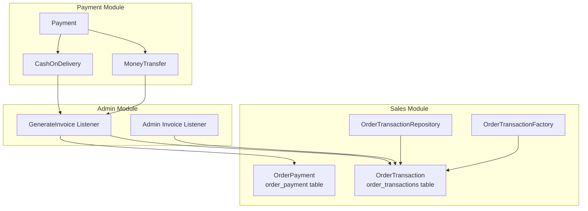
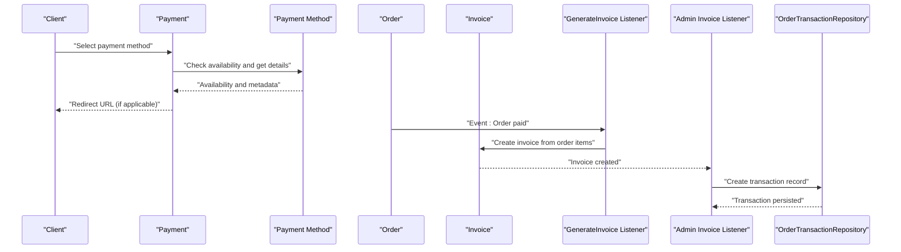
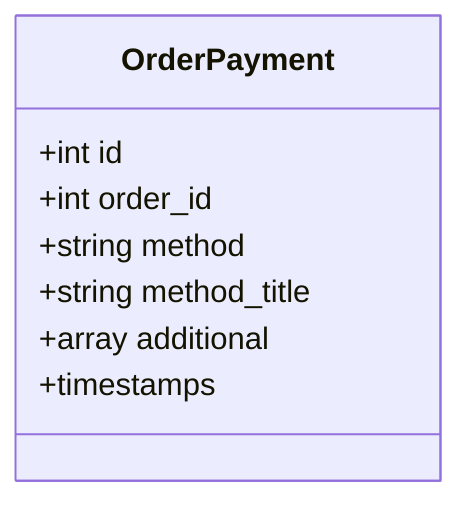
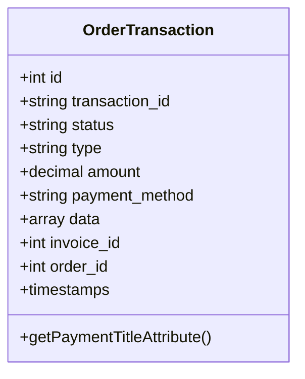
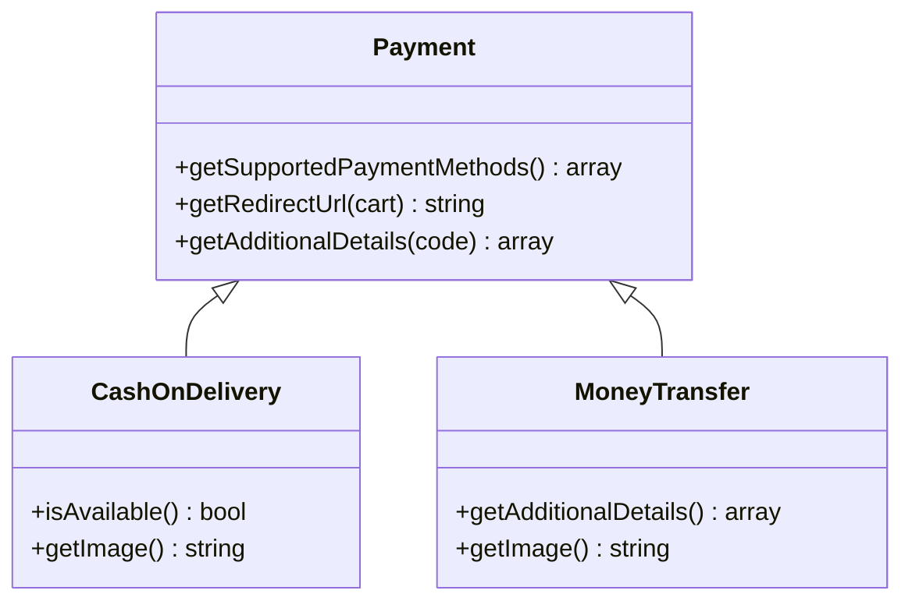
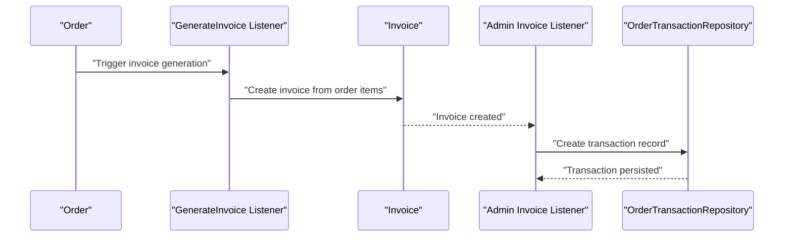
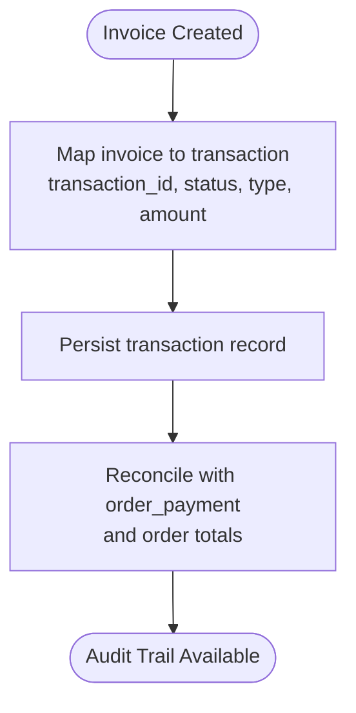
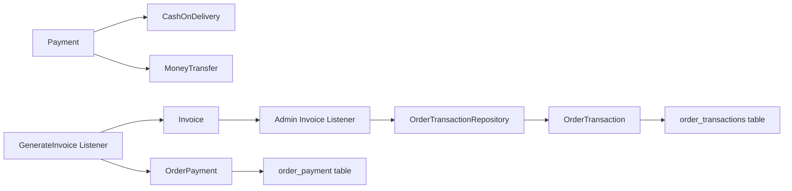

# Transaction Management

<cite>
**Referenced Files in This Document**
- [OrderPayment.php](file://packages/Webkul/Sales/src/Models/OrderPayment.php)
- [OrderTransaction.php](file://packages/Webkul/Sales/src/Models/OrderTransaction.php)
- [OrderTransactionRepository.php](file://packages/Webkul/Sales/src/Repositories/OrderTransactionRepository.php)
- [OrderTransactionFactory.php](file://packages/Webkul/Sales/src/Database/Factories/OrderTransactionFactory.php)
- [2018_10_01_095504_create_order_payment_table.php](file://packages/Webkul/Sales/src/Database/Migrations/2018_10_01_095504_create_order_payment_table.php)
- [2021_03_11_212124_create_order_transactions_table.php](file://packages/Webkul/Sales/src/Database/Migrations/2021_03_11_212124_create_order_transactions_table.php)
- [Payment.php](file://packages/Webkul/Payment/src/Payment.php)
- [CashOnDelivery.php](file://packages/Webkul/Payment/src/Payment/CashOnDelivery.php)
- [MoneyTransfer.php](file://packages/Webkul/Payment/src/Payment/MoneyTransfer.php)
- [GenerateInvoice.php](file://packages/Webkul/Payment/src/Listeners/GenerateInvoice.php)
- [Invoice.php](file://packages/Webkul/Admin/src/Listeners/Invoice.php)
- [sales.spec.ts](file://packages/Webkul/Admin/tests/e2e-pw/tests/sales.spec.ts)
</cite>

## Table of Contents
1. [Introduction](#introduction)
2. [Project Structure](#project-structure)
3. [Core Components](#core-components)
4. [Architecture Overview](#architecture-overview)
5. [Detailed Component Analysis](#detailed-component-analysis)
6. [Dependency Analysis](#dependency-analysis)
7. [Performance Considerations](#performance-considerations)
8. [Troubleshooting Guide](#troubleshooting-guide)
9. [Conclusion](#conclusion)

## Introduction
This document explains transaction management within Frooxi’s payment system. It covers how payments are recorded, how transactions are tracked, and how invoices are generated upon successful payment. It also documents the OrderPayment and OrderTransaction models, transaction status tracking, reconciliation processes, failure handling, retries, audit trails, payment history, settlement considerations, and security/compliance aspects.

## Project Structure
The transaction lifecycle spans three main areas:
- Sales module: payment records, transaction records, and invoice generation triggers
- Payment module: payment method selection, availability checks, and redirect handling
- Admin module: invoice-to-transaction synchronization and transaction listing

**Diagram sources**
- [OrderPayment.php:1-35](file://packages/Webkul/Sales/src/Models/OrderPayment.php#L1-L35)
- [OrderTransaction.php:1-53](file://packages/Webkul/Sales/src/Models/OrderTransaction.php#L1-L53)
- [OrderTransactionRepository.php:1-18](file://packages/Webkul/Sales/src/Repositories/OrderTransactionRepository.php#L1-L18)
- [OrderTransactionFactory.php:1-30](file://packages/Webkul/Sales/src/Database/Factories/OrderTransactionFactory.php#L1-L30)
- [Payment.php:1-82](file://packages/Webkul/Payment/src/Payment.php#L1-L82)
- [CashOnDelivery.php:1-49](file://packages/Webkul/Payment/src/Payment/CashOnDelivery.php#L1-L49)
- [MoneyTransfer.php:1-52](file://packages/Webkul/Payment/src/Payment/MoneyTransfer.php#L1-L52)
- [GenerateInvoice.php:1-70](file://packages/Webkul/Payment/src/Listeners/GenerateInvoice.php#L1-L70)
- [Invoice.php:63-75](file://packages/Webkul/Admin/src/Listeners/Invoice.php#L63-L75)

**Section sources**
- [OrderPayment.php:1-35](file://packages/Webkul/Sales/src/Models/OrderPayment.php#L1-L35)
- [OrderTransaction.php:1-53](file://packages/Webkul/Sales/src/Models/OrderTransaction.php#L1-L53)
- [OrderTransactionRepository.php:1-18](file://packages/Webkul/Sales/src/Repositories/OrderTransactionRepository.php#L1-L18)
- [OrderTransactionFactory.php:1-30](file://packages/Webkul/Sales/src/Database/Factories/OrderTransactionFactory.php#L1-L30)
- [Payment.php:1-82](file://packages/Webkul/Payment/src/Payment.php#L1-L82)
- [CashOnDelivery.php:1-49](file://packages/Webkul/Payment/src/Payment/CashOnDelivery.php#L1-L49)
- [MoneyTransfer.php:1-52](file://packages/Webkul/Payment/src/Payment/MoneyTransfer.php#L1-L52)
- [GenerateInvoice.php:1-70](file://packages/Webkul/Payment/src/Listeners/GenerateInvoice.php#L1-L70)
- [Invoice.php:63-75](file://packages/Webkul/Admin/src/Listeners/Invoice.php#L63-L75)

## Core Components
- OrderPayment: Stores payment metadata per order, including method, method title, and additional structured data.
- OrderTransaction: Records individual payment events with identifiers, amounts, statuses, types, and associated invoice/order references.
- Payment: Central orchestrator for retrieving supported payment methods, availability, and redirect URLs.
- Payment Methods: Concrete implementations (CashOnDelivery, MoneyTransfer) define availability rules and presentation details.
- Invoice Listeners: Generate invoices and synchronize transaction records after invoice creation.

Key responsibilities:
- Transaction creation: On invoice save, a transaction record is created reflecting the payment method, amount, and status.
- Payment capture: Invoices trigger invoice generation; for certain methods, invoice status can be configured.
- Invoice generation: Listeners create invoices based on order items and payment method configuration.
- Audit and history: Transactions persist payment activity with timestamps and JSON data for extensibility.

**Section sources**
- [OrderPayment.php:1-35](file://packages/Webkul/Sales/src/Models/OrderPayment.php#L1-L35)
- [OrderTransaction.php:1-53](file://packages/Webkul/Sales/src/Models/OrderTransaction.php#L1-L53)
- [OrderTransactionRepository.php:1-18](file://packages/Webkul/Sales/src/Repositories/OrderTransactionRepository.php#L1-L18)
- [OrderTransactionFactory.php:1-30](file://packages/Webkul/Sales/src/Database/Factories/OrderTransactionFactory.php#L1-L30)
- [Payment.php:1-82](file://packages/Webkul/Payment/src/Payment.php#L1-L82)
- [CashOnDelivery.php:1-49](file://packages/Webkul/Payment/src/Payment/CashOnDelivery.php#L1-L49)
- [MoneyTransfer.php:1-52](file://packages/Webkul/Payment/src/Payment/MoneyTransfer.php#L1-L52)
- [GenerateInvoice.php:1-70](file://packages/Webkul/Payment/src/Listeners/GenerateInvoice.php#L1-L70)
- [Invoice.php:63-75](file://packages/Webkul/Admin/src/Listeners/Invoice.php#L63-L75)

## Architecture Overview
The transaction lifecycle integrates payment selection, invoice creation, and transaction recording.

**Diagram sources**
- [Payment.php:1-82](file://packages/Webkul/Payment/src/Payment.php#L1-L82)
- [CashOnDelivery.php:1-49](file://packages/Webkul/Payment/src/Payment/CashOnDelivery.php#L1-L49)
- [MoneyTransfer.php:1-52](file://packages/Webkul/Payment/src/Payment/MoneyTransfer.php#L1-L52)
- [GenerateInvoice.php:1-70](file://packages/Webkul/Payment/src/Listeners/GenerateInvoice.php#L1-L70)
- [Invoice.php:63-75](file://packages/Webkul/Admin/src/Listeners/Invoice.php#L63-L75)
- [OrderTransactionRepository.php:1-18](file://packages/Webkul/Sales/src/Repositories/OrderTransactionRepository.php#L1-L18)

## Detailed Component Analysis

### OrderPayment Model
- Purpose: Persist payment metadata for an order.
- Fields: order_id, method, method_title, additional (JSON), timestamps.
- Behavior: Uses Laravel factories; guarded against mass assignment for id, created_at, updated_at; casts additional to array.

**Diagram sources**
- [OrderPayment.php:1-35](file://packages/Webkul/Sales/src/Models/OrderPayment.php#L1-L35)
- [2018_10_01_095504_create_order_payment_table.php:1-38](file://packages/Webkul/Sales/src/Database/Migrations/2018_10_01_095504_create_order_payment_table.php#L1-L38)

**Section sources**
- [OrderPayment.php:1-35](file://packages/Webkul/Sales/src/Models/OrderPayment.php#L1-L35)
- [2018_10_01_095504_create_order_payment_table.php:1-38](file://packages/Webkul/Sales/src/Database/Migrations/2018_10_01_095504_create_order_payment_table.php#L1-L38)

### OrderTransaction Model
- Purpose: Track individual payment events with status, type, amount, and associated invoice/order.
- Fields: transaction_id, status, type, amount, payment_method, data (JSON), invoice_id, order_id, timestamps.
- Behavior: Uses Laravel factories; guarded against mass assignment; resolves payment method title via configuration.

**Diagram sources**
- [OrderTransaction.php:1-53](file://packages/Webkul/Sales/src/Models/OrderTransaction.php#L1-L53)
- [2021_03_11_212124_create_order_transactions_table.php:1-42](file://packages/Webkul/Sales/src/Database/Migrations/2021_03_11_212124_create_order_transactions_table.php#L1-L42)

**Section sources**
- [OrderTransaction.php:1-53](file://packages/Webkul/Sales/src/Models/OrderTransaction.php#L1-L53)
- [2021_03_11_212124_create_order_transactions_table.php:1-42](file://packages/Webkul/Sales/src/Database/Migrations/2021_03_11_212124_create_order_transactions_table.php#L1-L42)

### Payment Orchestration
- Payment::getSupportedPaymentMethods(): Aggregates available payment methods from configuration, instantiating each class and filtering by availability.
- Payment::getRedirectUrl(): Resolves the redirect URL for the selected cart payment method.
- Payment::getAdditionalDetails(): Retrieves method-specific details for display.

Concrete methods:
- CashOnDelivery: Availability depends on cart stockability and configuration; no redirect URL.
- MoneyTransfer: Provides mailing address details and image; no redirect URL.

**Diagram sources**
- [Payment.php:1-82](file://packages/Webkul/Payment/src/Payment.php#L1-L82)
- [CashOnDelivery.php:1-49](file://packages/Webkul/Payment/src/Payment/CashOnDelivery.php#L1-L49)
- [MoneyTransfer.php:1-52](file://packages/Webkul/Payment/src/Payment/MoneyTransfer.php#L1-L52)

**Section sources**
- [Payment.php:1-82](file://packages/Webkul/Payment/src/Payment.php#L1-L82)
- [CashOnDelivery.php:1-49](file://packages/Webkul/Payment/src/Payment/CashOnDelivery.php#L1-L49)
- [MoneyTransfer.php:1-52](file://packages/Webkul/Payment/src/Payment/MoneyTransfer.php#L1-L52)

### Invoice Generation and Transaction Creation
- GenerateInvoice Listener: Creates invoices for eligible payment methods (e.g., cashondelivery, moneytransfer) based on configuration flags and order items.
- Admin Invoice Listener: Upon invoice creation, creates a corresponding transaction with transaction_id, status, type, payment_method, order_id, invoice_id, and amount.

**Diagram sources**
- [GenerateInvoice.php:1-70](file://packages/Webkul/Payment/src/Listeners/GenerateInvoice.php#L1-L70)
- [Invoice.php:63-75](file://packages/Webkul/Admin/src/Listeners/Invoice.php#L63-L75)
- [OrderTransactionRepository.php:1-18](file://packages/Webkul/Sales/src/Repositories/OrderTransactionRepository.php#L1-L18)

**Section sources**
- [GenerateInvoice.php:1-70](file://packages/Webkul/Payment/src/Listeners/GenerateInvoice.php#L1-L70)
- [Invoice.php:63-75](file://packages/Webkul/Admin/src/Listeners/Invoice.php#L63-L75)
- [OrderTransactionRepository.php:1-18](file://packages/Webkul/Sales/src/Repositories/OrderTransactionRepository.php#L1-L18)

### Transaction Status Tracking and Reconciliation
- Status propagation: Transactions mirror invoice state; reconciliation occurs by linking invoice_id to order_transactions.
- Amount reconciliation: Transaction amount equals invoice grand total; type/payment_method reflect the payment method used.
- Audit trail: Timestamps and JSON data enable historical reconstruction of payment events.

**Diagram sources**
- [Invoice.php:63-75](file://packages/Webkul/Admin/src/Listeners/Invoice.php#L63-L75)
- [OrderTransaction.php:1-53](file://packages/Webkul/Sales/src/Models/OrderTransaction.php#L1-L53)

**Section sources**
- [Invoice.php:63-75](file://packages/Webkul/Admin/src/Listeners/Invoice.php#L63-L75)
- [OrderTransaction.php:1-53](file://packages/Webkul/Sales/src/Models/OrderTransaction.php#L1-L53)

### Transaction Failure Handling, Retries, and Error Resolution
- Payment method availability: Payment methods filter out unavailable options; ensure cart conditions (e.g., stockability) are met.
- Redirect handling: Some methods do not require redirects; listeners handle invoice generation directly.
- Retry mechanisms: Not explicitly implemented in the observed code; consider implementing idempotent transaction creation and invoice re-generation hooks at the application level.
- Error resolution: Validate payment method configuration, ensure invoice creation succeeds, and confirm transaction creation follows invoice creation.

**Section sources**
- [CashOnDelivery.php:1-49](file://packages/Webkul/Payment/src/Payment/CashOnDelivery.php#L1-L49)
- [MoneyTransfer.php:1-52](file://packages/Webkul/Payment/src/Payment/MoneyTransfer.php#L1-L52)
- [GenerateInvoice.php:1-70](file://packages/Webkul/Payment/src/Listeners/GenerateInvoice.php#L1-L70)

### Transaction Security, Validation, and Compliance
- Data integrity: Guarded attributes prevent mass assignment; JSON fields (additional, data) store structured metadata safely.
- Idempotency: Use transaction_id to avoid duplicate entries; enforce uniqueness constraints at the database level.
- Compliance: Store minimal necessary data; log sensitive fields in encrypted storage if required; ensure audit logs include timestamps and user context where applicable.
- Validation: Payment method availability and cart eligibility checks reduce risk of invalid transactions.

**Section sources**
- [OrderPayment.php:1-35](file://packages/Webkul/Sales/src/Models/OrderPayment.php#L1-L35)
- [OrderTransaction.php:1-53](file://packages/Webkul/Sales/src/Models/OrderTransaction.php#L1-L53)
- [2018_10_01_095504_create_order_payment_table.php:1-38](file://packages/Webkul/Sales/src/Database/Migrations/2018_10_01_095504_create_order_payment_table.php#L1-L38)
- [2021_03_11_212124_create_order_transactions_table.php:1-42](file://packages/Webkul/Sales/src/Database/Migrations/2021_03_11_212124_create_order_transactions_table.php#L1-L42)

## Dependency Analysis

**Diagram sources**
- [Payment.php:1-82](file://packages/Webkul/Payment/src/Payment.php#L1-L82)
- [CashOnDelivery.php:1-49](file://packages/Webkul/Payment/src/Payment/CashOnDelivery.php#L1-L49)
- [MoneyTransfer.php:1-52](file://packages/Webkul/Payment/src/Payment/MoneyTransfer.php#L1-L52)
- [GenerateInvoice.php:1-70](file://packages/Webkul/Payment/src/Listeners/GenerateInvoice.php#L1-L70)
- [Invoice.php:63-75](file://packages/Webkul/Admin/src/Listeners/Invoice.php#L63-L75)
- [OrderTransactionRepository.php:1-18](file://packages/Webkul/Sales/src/Repositories/OrderTransactionRepository.php#L1-L18)
- [OrderTransaction.php:1-53](file://packages/Webkul/Sales/src/Models/OrderTransaction.php#L1-L53)
- [OrderPayment.php:1-35](file://packages/Webkul/Sales/src/Models/OrderPayment.php#L1-L35)

**Section sources**
- [Payment.php:1-82](file://packages/Webkul/Payment/src/Payment.php#L1-L82)
- [CashOnDelivery.php:1-49](file://packages/Webkul/Payment/src/Payment/CashOnDelivery.php#L1-L49)
- [MoneyTransfer.php:1-52](file://packages/Webkul/Payment/src/Payment/MoneyTransfer.php#L1-L52)
- [GenerateInvoice.php:1-70](file://packages/Webkul/Payment/src/Listeners/GenerateInvoice.php#L1-L70)
- [Invoice.php:63-75](file://packages/Webkul/Admin/src/Listeners/Invoice.php#L63-L75)
- [OrderTransactionRepository.php:1-18](file://packages/Webkul/Sales/src/Repositories/OrderTransactionRepository.php#L1-L18)
- [OrderTransaction.php:1-53](file://packages/Webkul/Sales/src/Models/OrderTransaction.php#L1-L53)
- [OrderPayment.php:1-35](file://packages/Webkul/Sales/src/Models/OrderPayment.php#L1-L35)

## Performance Considerations
- Indexing: Add indexes on order_id, invoice_id, payment_method, and status in order_transactions for fast reconciliation and reporting.
- Batch operations: When generating invoices and transactions in bulk, batch-create to minimize round trips.
- Caching: Cache payment method configurations to avoid repeated instantiation overhead.
- Idempotency: Use transaction_id as a deduplication key to prevent duplicate transaction writes.

## Troubleshooting Guide
- No invoice created: Verify payment method configuration flags and that the listener is triggered on invoice creation.
- Transaction not found: Confirm invoice_id and order_id linkage; check order_transactions foreign keys.
- Incorrect status: Ensure invoice state is propagated to transaction status during listener execution.
- Duplicate transactions: Enforce unique transaction_id and idempotent creation logic.
- Availability issues: For CashOnDelivery, ensure cart contains only stockable items and method is active.

**Section sources**
- [GenerateInvoice.php:1-70](file://packages/Webkul/Payment/src/Listeners/GenerateInvoice.php#L1-L70)
- [Invoice.php:63-75](file://packages/Webkul/Admin/src/Listeners/Invoice.php#L63-L75)
- [OrderTransaction.php:1-53](file://packages/Webkul/Sales/src/Models/OrderTransaction.php#L1-L53)
- [sales.spec.ts:2042-2073](file://packages/Webkul/Admin/tests/e2e-pw/tests/sales.spec.ts#L2042-L2073)

## Conclusion
Frooxi’s transaction management centers on robust persistence of payment metadata and granular transaction records linked to invoices. Payment orchestration ensures only valid methods are presented, while listeners automate invoice creation and transaction synchronization. Extending the system with idempotency, indexing, and explicit retry logic will further strengthen reliability and auditability.