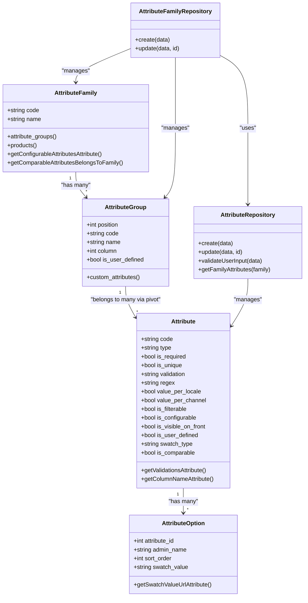
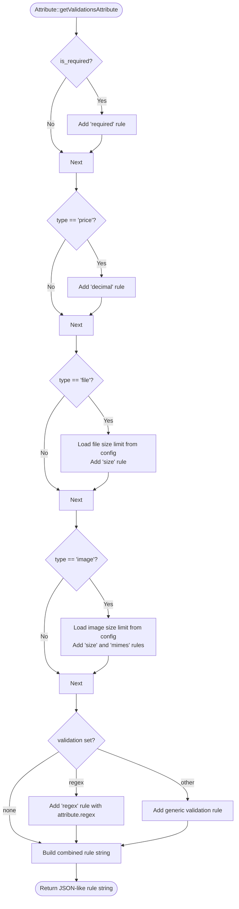
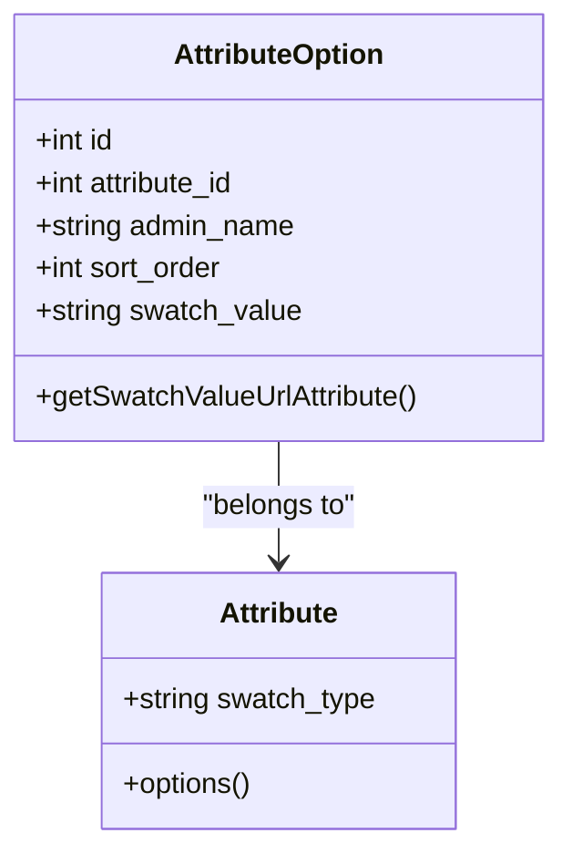
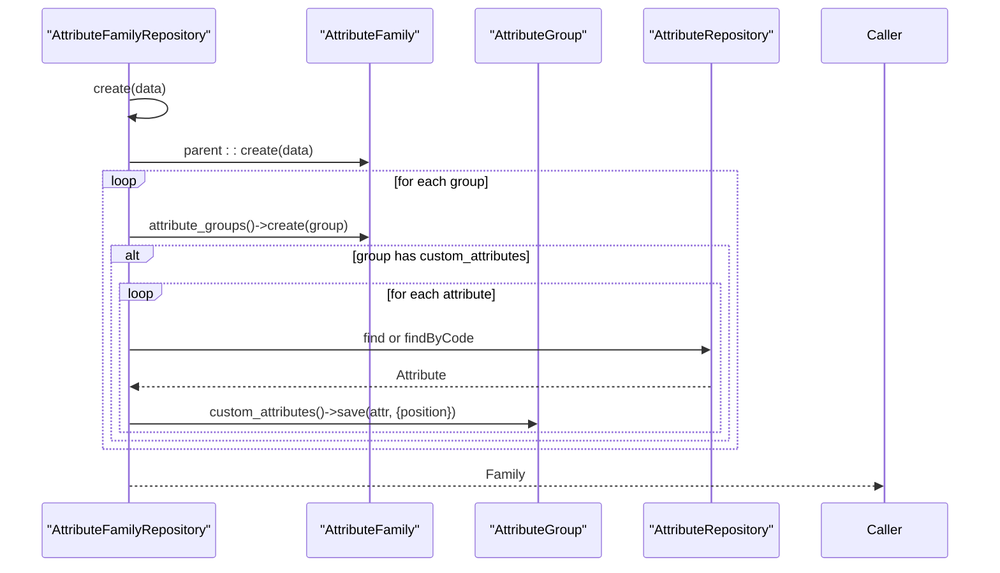
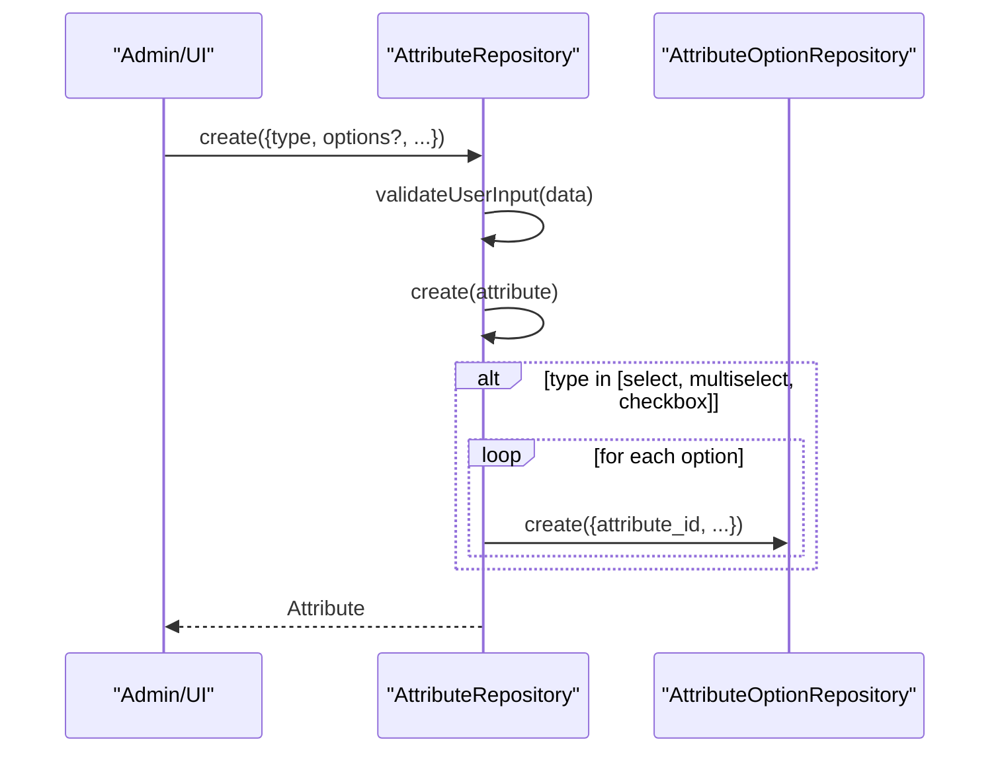
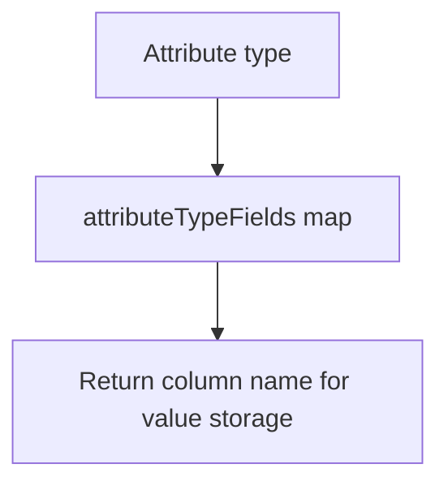
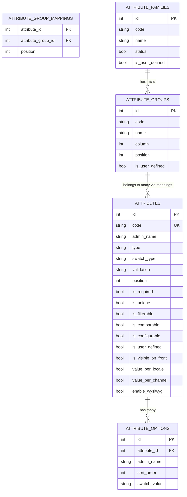
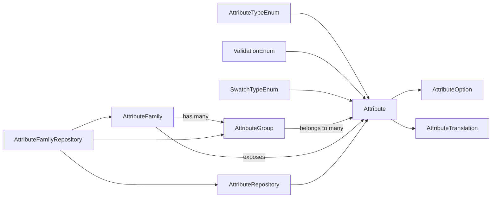

# Attribute System

<cite>
**Referenced Files in This Document**
- [Attribute.php](file://packages/Webkul/Attribute/src/Models/Attribute.php)
- [AttributeFamily.php](file://packages/Webkul/Attribute/src/Models/AttributeFamily.php)
- [AttributeGroup.php](file://packages/Webkul/Attribute/src/Models/AttributeGroup.php)
- [AttributeOption.php](file://packages/Webkul/Attribute/src/Models/AttributeOption.php)
- [AttributeRepository.php](file://packages/Webkul/Attribute/src/Repositories/AttributeRepository.php)
- [AttributeFamilyRepository.php](file://packages/Webkul/Attribute/src/Repositories/AttributeFamilyRepository.php)
- [AttributeTypeEnum.php](file://packages/Webkul/Attribute/src/Enums/AttributeTypeEnum.php)
- [SwatchTypeEnum.php](file://packages/Webkul/Attribute/src/Enums/SwatchTypeEnum.php)
- [ValidationEnum.php](file://packages/Webkul/Attribute/src/Enums/ValidationEnum.php)
- [2018_07_05_130148_create_attributes_table.php](file://packages/Webkul/Attribute/src/Database/Migrations/2018_07_05_130148_create_attributes_table.php)
- [2018_07_05_135150_create_attribute_families_table.php](file://packages/Webkul/Attribute/src/Database/Migrations/2018_07_05_135150_create_attribute_families_table.php)
- [2018_07_05_140832_create_attribute_options_table.php](file://packages/Webkul/Attribute/src/Database/Migrations/2018_07_05_140832_create_attribute_options_table.php)
- [2018_07_05_132854_create_attribute_translations_table.php](file://packages/Webkul/Attribute/src/Database/Migrations/2018_07_05_132854_create_attribute_translations_table.php)
- [2018_07_05_140856_create_attribute_option_translations_table.php](file://packages/Webkul/Attribute/src/Database/Migrations/2018_07_05_140856_create_attribute_option_translations_table.php)
- [2026_04_15_000001_create_sleeve_attribute.php](file://database/migrations/2026_04_15_000001_create_sleeve_attribute.php)
- [2026_04_15_000002_sync_size_options_with_frontend.php](file://database/migrations/2026_04_15_000002_sync_size_options_with_frontend.php)
- [AttributeTranslation.php](file://packages/Webkul/Attribute/src/Models/AttributeTranslation.php)
- [AttributeOptionTranslation.php](file://packages/Webkul/Attribute/src/Models/AttributeOptionTranslation.php)
</cite>

## Update Summary
**Changes Made**
- Added documentation for the new sleeve attribute system with configurable options
- Updated attribute types to include the new select type for sleeve attributes
- Enhanced size options documentation with over 40 new size variants
- Added information about attribute group integration and positioning
- Updated validation rules and swatch type considerations for select attributes

## Table of Contents
1. [Introduction](#introduction)
2. [Project Structure](#project-structure)
3. [Core Components](#core-components)
4. [Architecture Overview](#architecture-overview)
5. [Detailed Component Analysis](#detailed-component-analysis)
6. [New Sleeve Attribute System](#new-sleeve-attribute-system)
7. [Expanded Size Options](#expanded-size-options)
8. [Dependency Analysis](#dependency-analysis)
9. [Performance Considerations](#performance-considerations)
10. [Troubleshooting Guide](#troubleshooting-guide)
11. [Conclusion](#conclusion)
12. [Appendices](#appendices)

## Introduction
This document explains Frooxi's attribute system used to define product metadata and behavior. It covers attribute creation and management, attribute families and grouping, attribute types and validations, swatch support, and how attributes relate to product types. The system now includes a new sleeve attribute system with configurable options and significantly expanded size options for enhanced product categorization and filtering capabilities.

## Project Structure
The attribute system is implemented as a modular package with models, repositories, enums, migrations, and translation models. The key areas are:
- Models: Attribute, AttributeFamily, AttributeGroup, AttributeOption, and their translation models
- Repositories: AttributeRepository and AttributeFamilyRepository for CRUD and composition
- Enums: AttributeTypeEnum, SwatchTypeEnum, ValidationEnum
- Migrations: Database schema for attributes, families, options, and translations
- Translations: Localized names for attributes and labels for options

```mermaid
graph TB
subgraph "Attribute Package"
A["Attribute<br/>models/Attribute.php"]
AF["AttributeFamily<br/>models/AttributeFamily.php"]
AG["AttributeGroup<br/>models/AttributeGroup.php"]
AO["AttributeOption<br/>models/AttributeOption.php"]
AT["AttributeTranslation<br/>models/AttributeTranslation.php"]
AOT["AttributeOptionTranslation<br/>models/AttributeOptionTranslation.php"]
AR["AttributeRepository<br/>repositories/AttributeRepository.php"]
AFR["AttributeFamilyRepository<br/>repositories/AttributeFamilyRepository.php"]
ET["AttributeTypeEnum<br/>enums/AttributeTypeEnum.php"]
ST["SwatchTypeEnum<br/>enums/SwatchTypeEnum.php"]
VT["ValidationEnum<br/>enums/ValidationEnum.php"]
M1["Migrations: attributes<br/>2018_..._create_attributes_table.php"]
M2["Migrations: attribute_families<br/>2018_..._create_attribute_families_table.php"]
M3["Migrations: attribute_options<br/>2018_..._create_attribute_options_table.php"]
M4["Migrations: attribute_translations<br/>2018_..._create_attribute_translations_table.php"]
M5["Migrations: attribute_option_translations<br/>2018_..._create_attribute_option_translations_table.php"]
M6["Migration: sleeve attribute<br/>2026_..._create_sleeve_attribute.php"]
M7["Migration: size options sync<br/>2026_..._sync_size_options_with_frontend.php"]
end
AR --> A
AFR --> AF
A --> AO
AF --> AG
AG <- --> A
A -.-> AT
AO -.-> AOT
ET --> A
ST --> A
VT --> A
M1 --> A
M2 --> AF
M3 --> AO
M4 --> AT
M5 --> AOT
M6 --> A
M7 --> AO
```

**Diagram sources**
- [Attribute.php:13-139](file://packages/Webkul/Attribute/src/Models/Attribute.php#L13-L139)
- [AttributeFamily.php:13-91](file://packages/Webkul/Attribute/src/Models/AttributeFamily.php#L13-L91)
- [AttributeGroup.php:8-30](file://packages/Webkul/Attribute/src/Models/AttributeGroup.php#L8-L30)
- [AttributeOption.php:12-75](file://packages/Webkul/Attribute/src/Models/AttributeOption.php#L12-L75)
- [AttributeRepository.php:12-253](file://packages/Webkul/Attribute/src/Repositories/AttributeRepository.php#L12-L253)
- [AttributeFamilyRepository.php:10-166](file://packages/Webkul/Attribute/src/Repositories/AttributeFamilyRepository.php#L10-L166)
- [AttributeTypeEnum.php:5-90](file://packages/Webkul/Attribute/src/Enums/AttributeTypeEnum.php#L5-L90)
- [SwatchTypeEnum.php:5-38](file://packages/Webkul/Attribute/src/Enums/SwatchTypeEnum.php#L5-L38)
- [ValidationEnum.php:5-43](file://packages/Webkul/Attribute/src/Enums/ValidationEnum.php#L5-L43)
- [2018_07_05_130148_create_attributes_table.php:14-36](file://packages/Webkul/Attribute/src/Database/Migrations/2018_07_05_130148_create_attributes_table.php#L14-L36)
- [2018_07_05_135150_create_attribute_families_table.php:14-22](file://packages/Webkul/Attribute/src/Database/Migrations/2018_07_05_135150_create_attribute_families_table.php#L14-L22)
- [2018_07_05_140832_create_attribute_options_table.php:14-24](file://packages/Webkul/Attribute/src/Database/Migrations/2018_07_05_140832_create_attribute_options_table.php#L14-L24)
- [2018_07_05_132854_create_attribute_translations_table.php:14-24](file://packages/Webkul/Attribute/src/Database/Migrations/2018_07_05_132854_create_attribute_translations_table.php#L14-L24)
- [2018_07_05_140856_create_attribute_option_translations_table.php:14-24](file://packages/Webkul/Attribute/src/Database/Migrations/2018_07_05_140856_create_attribute_option_translations_table.php#L14-L24)
- [2026_04_15_000001_create_sleeve_attribute.php:11-89](file://database/migrations/2026_04_15_000001_create_sleeve_attribute.php#L11-L89)
- [2026_04_15_000002_sync_size_options_with_frontend.php:23-64](file://database/migrations/2026_04_15_000002_sync_size_options_with_frontend.php#L23-L64)

**Section sources**
- [Attribute.php:13-139](file://packages/Webkul/Attribute/src/Models/Attribute.php#L13-L139)
- [AttributeFamily.php:13-91](file://packages/Webkul/Attribute/src/Models/AttributeFamily.php#L13-L91)
- [AttributeGroup.php:8-30](file://packages/Webkul/Attribute/src/Models/AttributeGroup.php#L8-L30)
- [AttributeOption.php:12-75](file://packages/Webkul/Attribute/src/Models/AttributeOption.php#L12-L75)
- [AttributeRepository.php:12-253](file://packages/Webkul/Attribute/src/Repositories/AttributeRepository.php#L12-L253)
- [AttributeFamilyRepository.php:10-166](file://packages/Webkul/Attribute/src/Repositories/AttributeFamilyRepository.php#L10-L166)
- [AttributeTypeEnum.php:5-90](file://packages/Webkul/Attribute/src/Enums/AttributeTypeEnum.php#L5-L90)
- [SwatchTypeEnum.php:5-38](file://packages/Webkul/Attribute/src/Enums/SwatchTypeEnum.php#L5-L38)
- [ValidationEnum.php:5-43](file://packages/Webkul/Attribute/src/Enums/ValidationEnum.php#L5-L43)
- [2018_07_05_130148_create_attributes_table.php:14-36](file://packages/Webkul/Attribute/src/Database/Migrations/2018_07_05_130148_create_attributes_table.php#L14-L36)
- [2018_07_05_135150_create_attribute_families_table.php:14-22](file://packages/Webkul/Attribute/src/Database/Migrations/2018_07_05_135150_create_attribute_families_table.php#L14-L22)
- [2018_07_05_140832_create_attribute_options_table.php:14-24](file://packages/Webkul/Attribute/src/Database/Migrations/2018_07_05_140832_create_attribute_options_table.php#L14-L24)
- [2018_07_05_132854_create_attribute_translations_table.php:14-24](file://packages/Webkul/Attribute/src/Database/Migrations/2018_07_05_132854_create_attribute_translations_table.php#L14-L24)
- [2018_07_05_140856_create_attribute_option_translations_table.php:14-24](file://packages/Webkul/Attribute/src/Database/Migrations/2018_07_05_140856_create_attribute_option_translations_table.php#L14-L24)

## Core Components
- Attribute: Defines a single product metadata field with type, validation, localization flags, swatch type, and configurable flags. It maps attribute types to value columns and computes validation rules dynamically.
- AttributeOption: Represents selectable choices for select/multiselect/boolean attributes, with localized labels and optional swatch images.
- AttributeGroup: Logical grouping of attributes within a family, ordered by position.
- AttributeFamily: A collection of attribute groups and attributes, linking to products via product types.
- Repositories: AttributeRepository handles creation/update of attributes and their options; AttributeFamilyRepository composes families from groups and attributes.
- Enums: AttributeTypeEnum enumerates supported attribute types; SwatchTypeEnum enumerates swatch presentation modes; ValidationEnum enumerates validation rules.

Key capabilities:
- Attribute types: text, textarea, select, multiselect, boolean, datetime, date, price, image, file, checkbox
- Validation rules: required, numeric, email, decimal, url, regex
- Swatch types: dropdown, color, image, text
- Localization: attributes and options support localized names/labels
- Grouping: attributes grouped per family with ordering
- Filtering/comparison/configurable flags for UI and product behavior

**Section sources**
- [Attribute.php:17-129](file://packages/Webkul/Attribute/src/Models/Attribute.php#L17-L129)
- [AttributeOption.php:18-65](file://packages/Webkul/Attribute/src/Models/AttributeOption.php#L18-L65)
- [AttributeGroup.php:12-28](file://packages/Webkul/Attribute/src/Models/AttributeGroup.php#L12-L28)
- [AttributeFamily.php:19-81](file://packages/Webkul/Attribute/src/Models/AttributeFamily.php#L19-L81)
- [AttributeRepository.php:46-117](file://packages/Webkul/Attribute/src/Repositories/AttributeRepository.php#L46-L117)
- [AttributeFamilyRepository.php:36-124](file://packages/Webkul/Attribute/src/Repositories/AttributeFamilyRepository.php#L36-L124)
- [AttributeTypeEnum.php:5-90](file://packages/Webkul/Attribute/src/Enums/AttributeTypeEnum.php#L5-L90)
- [SwatchTypeEnum.php:5-38](file://packages/Webkul/Attribute/src/Enums/SwatchTypeEnum.php#L5-L38)
- [ValidationEnum.php:5-43](file://packages/Webkul/Attribute/src/Enums/ValidationEnum.php#L5-L43)

## Architecture Overview
The attribute system is built around a relational model with translation tables and pivot mappings. Families compose groups, groups compose attributes, and attributes can have options. Repositories orchestrate creation and updates, including option management for select/multiselect/boolean types.



**Diagram sources**
- [Attribute.php:13-139](file://packages/Webkul/Attribute/src/Models/Attribute.php#L13-L139)
- [AttributeOption.php:12-75](file://packages/Webkul/Attribute/src/Models/AttributeOption.php#L12-L75)
- [AttributeGroup.php:8-30](file://packages/Webkul/Attribute/src/Models/AttributeGroup.php#L8-L30)
- [AttributeFamily.php:13-91](file://packages/Webkul/Attribute/src/Models/AttributeFamily.php#L13-L91)
- [AttributeRepository.php:12-253](file://packages/Webkul/Attribute/src/Repositories/AttributeRepository.php#L12-L253)
- [AttributeFamilyRepository.php:10-166](file://packages/Webkul/Attribute/src/Repositories/AttributeFamilyRepository.php#L10-L166)

## Detailed Component Analysis

### Attribute Types and Validation
- Supported types include text, textarea, price, boolean, checkbox, select, multiselect, date, datetime, image, and file.
- Each type maps to a specific value column in the attribute value storage.
- Validation rules are computed dynamically:
  - Required flag adds a required rule
  - Price type adds decimal validation
  - File/image types enforce size and MIME constraints from configuration
  - Generic validation enum values and regex patterns are supported



**Diagram sources**
- [Attribute.php:82-129](file://packages/Webkul/Attribute/src/Models/Attribute.php#L82-L129)

**Section sources**
- [Attribute.php:45-57](file://packages/Webkul/Attribute/src/Models/Attribute.php#L45-L57)
- [Attribute.php:92-129](file://packages/Webkul/Attribute/src/Models/Attribute.php#L92-L129)
- [AttributeTypeEnum.php:5-90](file://packages/Webkul/Attribute/src/Enums/AttributeTypeEnum.php#L5-L90)
- [ValidationEnum.php:5-43](file://packages/Webkul/Attribute/src/Enums/ValidationEnum.php#L5-L43)

### Attribute Options and Swatches
- Options are available for select, multiselect, and boolean attributes.
- Options support localized labels via translations.
- Swatch types:
  - Color: display color swatches
  - Image: display thumbnail images
  - Text: display text labels
  - Dropdown: standard dropdown UI
- Option URLs for image swatches are generated using cached thumbnails.



**Diagram sources**
- [AttributeOption.php:12-75](file://packages/Webkul/Attribute/src/Models/AttributeOption.php#L12-L75)
- [Attribute.php:62-65](file://packages/Webkul/Attribute/src/Models/Attribute.php#L62-L65)

**Section sources**
- [AttributeOption.php:18-65](file://packages/Webkul/Attribute/src/Models/AttributeOption.php#L18-L65)
- [SwatchTypeEnum.php:5-38](file://packages/Webkul/Attribute/src/Enums/SwatchTypeEnum.php#L5-L38)
- [2018_07_05_140832_create_attribute_options_table.php:14-24](file://packages/Webkul/Attribute/src/Database/Migrations/2018_07_05_140832_create_attribute_options_table.php#L14-L24)
- [2018_07_05_140856_create_attribute_option_translations_table.php:14-24](file://packages/Webkul/Attribute/src/Database/Migrations/2018_07_05_140856_create_attribute_option_translations_table.php#L14-L24)

### Attribute Groups and Families
- AttributeGroup defines logical groupings with position and optional code/name.
- AttributeFamily aggregates groups and exposes convenience methods to fetch configurable and comparable attributes.
- Families link to products via product types; attributes are mapped to families via group mappings.



**Diagram sources**
- [AttributeFamilyRepository.php:36-61](file://packages/Webkul/Attribute/src/Repositories/AttributeFamilyRepository.php#L36-L61)
- [AttributeGroup.php:23-28](file://packages/Webkul/Attribute/src/Models/AttributeGroup.php#L23-L28)
- [AttributeRepository.php:52-56](file://packages/Webkul/Attribute/src/Repositories/AttributeRepository.php#L52-L56)

**Section sources**
- [AttributeGroup.php:12-28](file://packages/Webkul/Attribute/src/Models/AttributeGroup.php#L12-L28)
- [AttributeFamily.php:59-81](file://packages/Webkul/Attribute/src/Models/AttributeFamily.php#L59-L81)
- [AttributeFamilyRepository.php:36-124](file://packages/Webkul/Attribute/src/Repositories/AttributeFamilyRepository.php#L36-L124)

### Attribute Creation and Management
- Creating an attribute validates inputs, persists the attribute, and creates associated options for select/multiselect/checkbox types.
- Updating an attribute validates inputs, updates the attribute, and manages options (create, update, delete) based on isNew/isDelete flags.
- Special handling:
  - Configurable attributes disable locale/channel value flags
  - Filterable is only allowed for select/multiselect/boolean
  - Some types remove locale-specific value flags



**Diagram sources**
- [AttributeRepository.php:46-69](file://packages/Webkul/Attribute/src/Repositories/AttributeRepository.php#L46-L69)
- [AttributeRepository.php:125-149](file://packages/Webkul/Attribute/src/Repositories/AttributeRepository.php#L125-L149)

**Section sources**
- [AttributeRepository.php:46-117](file://packages/Webkul/Attribute/src/Repositories/AttributeRepository.php#L46-L117)
- [AttributeRepository.php:125-149](file://packages/Webkul/Attribute/src/Repositories/AttributeRepository.php#L125-L149)

### Attribute Value Columns and Type Mapping
- Each attribute type maps to a dedicated value column for efficient storage and retrieval.
- The mapping is used to determine the correct column for storing attribute values.



**Diagram sources**
- [Attribute.php:45-85](file://packages/Webkul/Attribute/src/Models/Attribute.php#L45-L85)

**Section sources**
- [Attribute.php:45-85](file://packages/Webkul/Attribute/src/Models/Attribute.php#L45-L85)

### Data Model and Relationships
- Attributes table stores core definitions and flags.
- Attribute options table stores selectable values and optional swatch values.
- Translation tables store localized names for attributes and option labels.
- Pivot table maps attribute groups to attributes.



**Diagram sources**
- [2018_07_05_130148_create_attributes_table.php:16-35](file://packages/Webkul/Attribute/src/Database/Migrations/2018_07_05_130148_create_attributes_table.php#L16-L35)
- [2018_07_05_140832_create_attribute_options_table.php:16-24](file://packages/Webkul/Attribute/src/Database/Migrations/2018_07_05_140832_create_attribute_options_table.php#L16-L24)
- [2018_07_05_135150_create_attribute_families_table.php:16-22](file://packages/Webkul/Attribute/src/Database/Migrations/2018_07_05_135150_create_attribute_families_table.php#L16-L22)
- [AttributeGroup.php:23-28](file://packages/Webkul/Attribute/src/Models/AttributeGroup.php#L23-L28)

**Section sources**
- [2018_07_05_130148_create_attributes_table.php:16-35](file://packages/Webkul/Attribute/src/Database/Migrations/2018_07_05_130148_create_attributes_table.php#L16-L35)
- [2018_07_05_140832_create_attribute_options_table.php:16-24](file://packages/Webkul/Attribute/src/Database/Migrations/2018_07_05_140832_create_attribute_options_table.php#L16-L24)
- [2018_07_05_132854_create_attribute_translations_table.php:16-24](file://packages/Webkul/Attribute/src/Database/Migrations/2018_07_05_132854_create_attribute_translations_table.php#L16-L24)
- [2018_07_05_140856_create_attribute_option_translations_table.php:16-24](file://packages/Webkul/Attribute/src/Database/Migrations/2018_07_05_140856_create_attribute_option_translations_table.php#L16-L24)
- [AttributeGroup.php:23-28](file://packages/Webkul/Attribute/src/Models/AttributeGroup.php#L23-L28)

## New Sleeve Attribute System

### Sleeve Attribute Overview
The new sleeve attribute system introduces a configurable select attribute for categorizing products by sleeve length. This attribute is designed specifically for clothing items and provides standardized options for filtering and product organization.

### Sleeve Attribute Configuration
- **Code**: `sleeve`
- **Type**: `select` (enabling dropdown selection)
- **Position**: `28` (placed in the General attribute group)
- **Flags**: 
  - `is_filterable`: `1` (enables filtering in product listings)
  - `is_configurable`: `1` (allows configurable product variations)
  - `is_visible_on_front`: `1` (visible to customers)
  - `is_user_defined`: `1` (custom attribute)

### Sleeve Options
The sleeve attribute includes five predefined options, each with specific sort order for consistent display:

1. **Sleeveless** (`sort_order: 1`)
2. **Short Sleeve** (`sort_order: 2`)
3. **3/4 Sleeve** (`sort_order: 3`)
4. **Long Sleeve** (`sort_order: 4`)
5. **Cap Sleeve** (`sort_order: 5`)

### Integration with Attribute Groups
The sleeve attribute is automatically integrated into the General attribute group (ID: 1) with proper positioning. The migration ensures the attribute appears alongside other core product attributes like name, description, and price.

### Frontend Implementation
The sleeve attribute is fully supported in the frontend filtering system, allowing customers to filter products by sleeve length. The implementation includes proper localization support through attribute option translations.

**Section sources**
- [2026_04_15_000001_create_sleeve_attribute.php:11-89](file://database/migrations/2026_04_15_000001_create_sleeve_attribute.php#L11-L89)
- [2026_04_15_000001_create_sleeve_attribute.php:38-70](file://database/migrations/2026_04_15_000001_create_sleeve_attribute.php#L38-L70)

## Expanded Size Options

### Size Attribute Enhancements
The size attribute system has been significantly expanded with over 40 new size variants to support diverse sizing requirements across different product categories and regions.

### New Size Variants
The expanded size options include:

#### Numerical Range Sizes
- **Single digit sizes**: 1, 2, 3, 4, 5, 6, 7, 8, 9, 10, 11, 12, 13, 14, 16
- **Double digit sizes**: 20, 22, 24, 26, 28, 30, 32, 34, 36, 38, 40, 42, 44, 46, 48, 50, 52, 54, 56
- **Range sizes**: 1-2, 2-3, 3-4, 4-5, 5-6, 6-7, 6-8, 7-8, 8-9, 9-10, 10-11, 11-12, 12-13, 13-14

#### Standard Sizes
- **Traditional sizes**: S, M, L, XL, XXL (existing sizes preserved)
- **Specialized sizes**: Free, semi-stitched, Unstitched

### Size Option Management
The synchronization migration intelligently manages size options by:
- Checking existing size options to avoid duplicates
- Maintaining proper sort order for consistent display
- Adding new options with sequential sort order
- Creating English translations for all new options

### Technical Implementation
The size synchronization process:
1. Identifies the size attribute by code
2. Retrieves existing size options (case-insensitive comparison)
3. Iterates through new size variants
4. Skips existing options to prevent duplication
5. Assigns sequential sort order
6. Creates English translations for new options

**Section sources**
- [2026_04_15_000002_sync_size_options_with_frontend.php:11-18](file://database/migrations/2026_04_15_000002_sync_size_options_with_frontend.php#L11-L18)
- [2026_04_15_000002_sync_size_options_with_frontend.php:23-64](file://database/migrations/2026_04_15_000002_sync_size_options_with_frontend.php#L23-L64)

## Dependency Analysis
- Attribute depends on:
  - AttributeOption for selectable values
  - AttributeTranslation for localized names
  - Enumerations for type and validation
- AttributeGroup depends on Attribute via a many-to-many relationship with position
- AttributeFamily depends on AttributeGroup and exposes convenience queries for configurable/comparable attributes
- Repositories coordinate persistence and composition of families/groups/attributes



**Diagram sources**
- [Attribute.php:13-139](file://packages/Webkul/Attribute/src/Models/Attribute.php#L13-L139)
- [AttributeOption.php:12-75](file://packages/Webkul/Attribute/src/Models/AttributeOption.php#L12-L75)
- [AttributeGroup.php:8-30](file://packages/Webkul/Attribute/src/Models/AttributeGroup.php#L8-L30)
- [AttributeFamily.php:13-91](file://packages/Webkul/Attribute/src/Models/AttributeFamily.php#L13-L91)
- [AttributeRepository.php:12-253](file://packages/Webkul/Attribute/src/Repositories/AttributeRepository.php#L12-L253)
- [AttributeFamilyRepository.php:10-166](file://packages/Webkul/Attribute/src/Repositories/AttributeFamilyRepository.php#L10-L166)
- [AttributeTypeEnum.php:5-90](file://packages/Webkul/Attribute/src/Enums/AttributeTypeEnum.php#L5-L90)
- [SwatchTypeEnum.php:5-38](file://packages/Webkul/Attribute/src/Enums/SwatchTypeEnum.php#L5-L38)
- [ValidationEnum.php:5-43](file://packages/Webkul/Attribute/src/Enums/ValidationEnum.php#L5-L43)

**Section sources**
- [AttributeRepository.php:12-253](file://packages/Webkul/Attribute/src/Repositories/AttributeRepository.php#L12-L253)
- [AttributeFamilyRepository.php:10-166](file://packages/Webkul/Attribute/src/Repositories/AttributeFamilyRepository.php#L10-L166)

## Performance Considerations
- Use repository methods to fetch only required columns (e.g., default product attributes) to minimize overhead.
- Leverage filtering flags (filterable, configurable, comparable) to reduce result sets.
- Avoid unnecessary joins when not required; AttributeFamilyRepository provides optimized queries for configurable/comparable attributes.
- Cache frequently accessed attribute families and groups where appropriate.
- The new sleeve attribute and expanded size options are designed to minimize performance impact through efficient database indexing and query optimization.

## Troubleshooting Guide
Common issues and resolutions:
- Validation failures for price/file/image attributes:
  - Ensure decimal validation for price and size/MIME constraints for file/image align with configured limits.
- Options not appearing for select/multiselect/boolean:
  - Verify options were created during attribute creation and that the attribute type supports options.
- Swatch images not rendering:
  - Confirm swatch_type is set to image and that the swatch_value points to a valid cached image path.
- Attribute not visible in filters/comparison/configurable:
  - Check flags is_filterable, is_comparable, is_configurable and type compatibility.
- Sleeve attribute not appearing in filters:
  - Verify the sleeve attribute was properly migrated and integrated into the General attribute group.
- Size options not displaying correctly:
  - Check that the size synchronization migration ran successfully and that new options have proper sort order assignments.

**Section sources**
- [Attribute.php:92-129](file://packages/Webkul/Attribute/src/Models/Attribute.php#L92-L129)
- [AttributeOption.php:47-65](file://packages/Webkul/Attribute/src/Models/AttributeOption.php#L47-L65)
- [AttributeRepository.php:125-149](file://packages/Webkul/Attribute/src/Repositories/AttributeRepository.php#L125-L149)
- [2026_04_15_000001_create_sleeve_attribute.php:94-128](file://database/migrations/2026_04_15_000001_create_sleeve_attribute.php#L94-L128)
- [2026_04_15_000002_sync_size_options_with_frontend.php:69-74](file://database/migrations/2026_04_15_000002_sync_size_options_with_frontend.php#L69-74)

## Conclusion
Frooxi's attribute system provides a flexible, extensible foundation for product metadata. The addition of the sleeve attribute system enhances product categorization capabilities with standardized sleeve length options, while the expanded size options support diverse sizing requirements across global markets. The system continues to support rich attribute types, robust validation, localized names, and swatch-based UI. Families and groups enable structured organization aligned with product types, while repositories simplify creation, updates, and composition.

## Appendices

### Attribute Types Reference
- text, textarea, price, boolean, checkbox, select, multiselect, date, datetime, image, file

**Section sources**
- [AttributeTypeEnum.php:5-90](file://packages/Webkul/Attribute/src/Enums/AttributeTypeEnum.php#L5-L90)

### Swatch Types Reference
- dropdown, color, image, text

**Section sources**
- [SwatchTypeEnum.php:5-38](file://packages/Webkul/Attribute/src/Enums/SwatchTypeEnum.php#L5-L38)

### Validation Rules Reference
- numeric, email, decimal, url, regex

**Section sources**
- [ValidationEnum.php:5-43](file://packages/Webkul/Attribute/src/Enums/ValidationEnum.php#L5-L43)

### Sleeve Attribute Options
- Sleeveless, Short Sleeve, 3/4 Sleeve, Long Sleeve, Cap Sleeve

**Section sources**
- [2026_04_15_000001_create_sleeve_attribute.php:38-44](file://database/migrations/2026_04_15_000001_create_sleeve_attribute.php#L38-L44)

### Expanded Size Options Reference
- Numerical ranges: 1-2, 2-3, 3-4, 4-5, 5-6, 6-7, 6-8, 7-8, 8-9, 9-10, 10-11, 11-12, 12-13, 13-14
- Single digits: 1, 2, 3, 4, 5, 6, 7, 8, 9, 10, 11, 12, 13, 14, 16
- Double digits: 20, 22, 24, 26, 28, 30, 32, 34, 36, 38, 40, 42, 44, 46, 48, 50, 52, 54, 56
- Traditional sizes: S, M, L, XL, XXL
- Specialized sizes: Free, semi-stitched, Unstitched

**Section sources**
- [2026_04_15_000002_sync_size_options_with_frontend.php:11-18](file://database/migrations/2026_04_15_000002_sync_size_options_with_frontend.php#L11-L18)