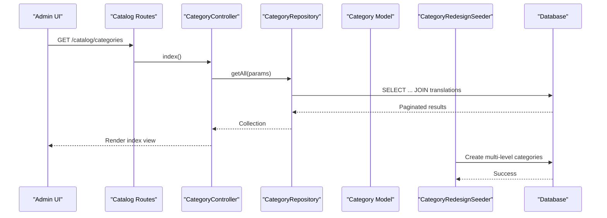
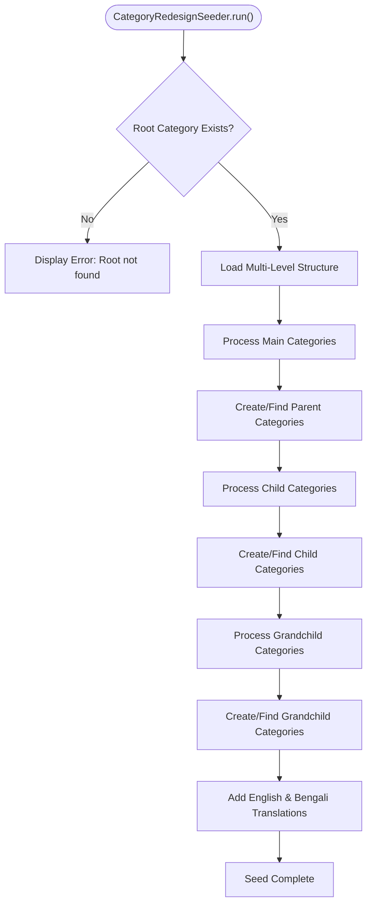
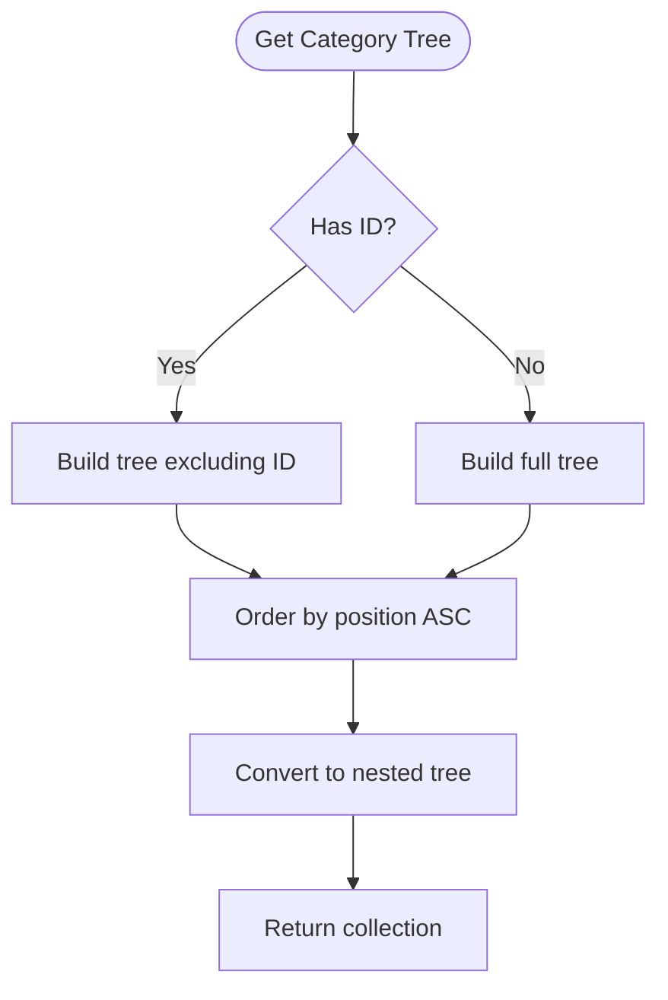
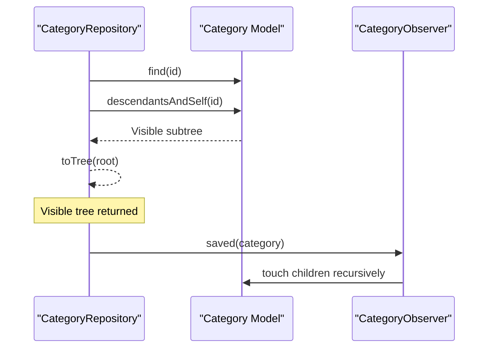
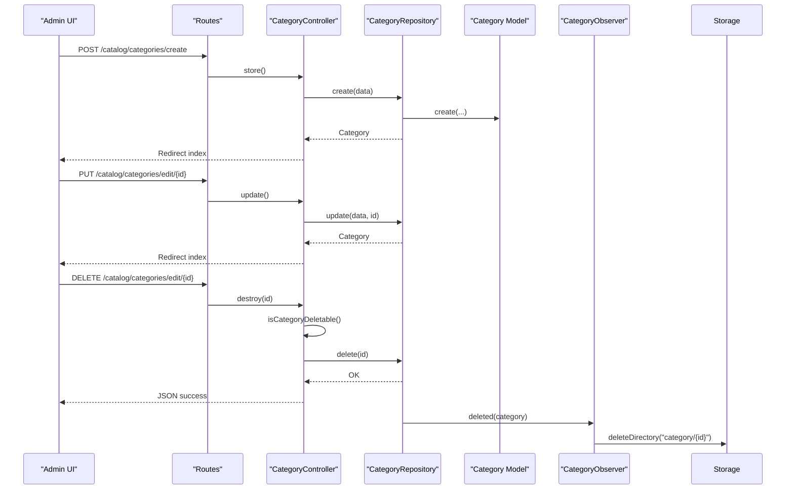
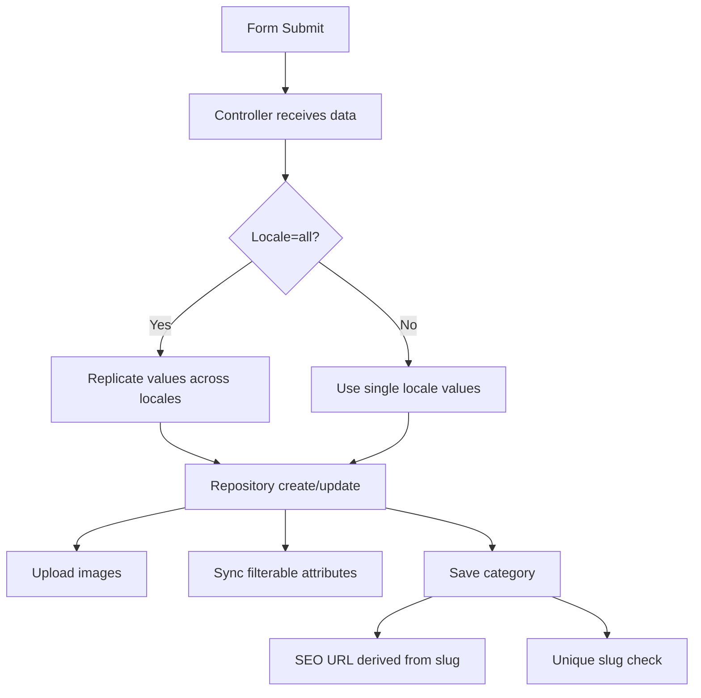
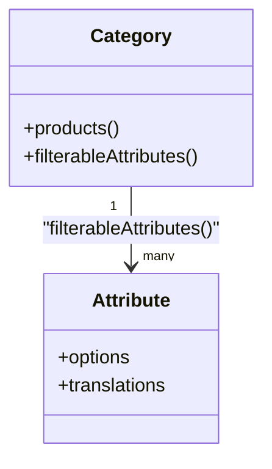
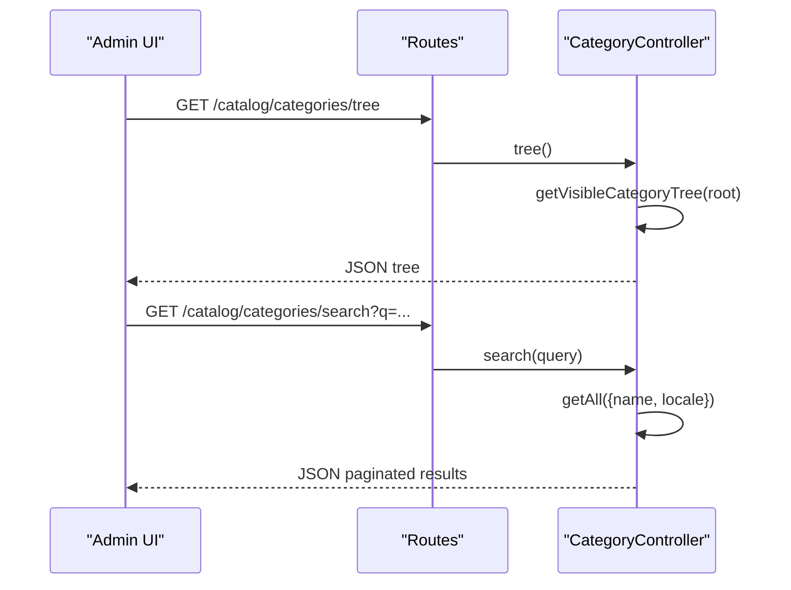
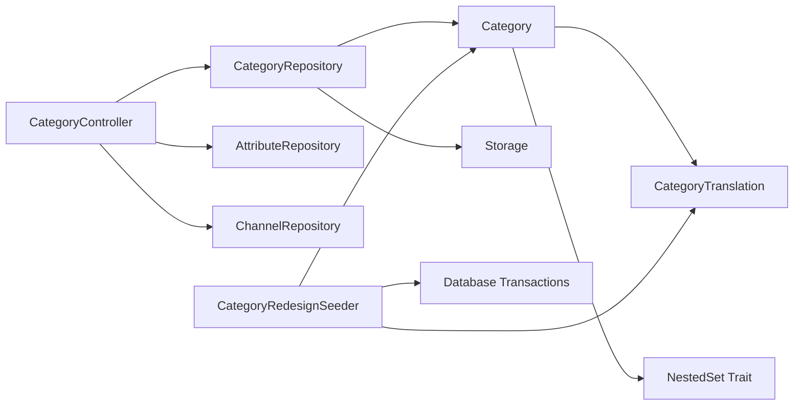

# Category Management

<cite>
**Referenced Files in This Document**
- [Category.php](file://packages/Webkul/Category/src/Models/Category.php)
- [CategoryTranslation.php](file://packages/Webkul/Category/src/Models/CategoryTranslation.php)
- [CategoryRepository.php](file://packages/Webkul/Category/src/Repositories/CategoryRepository.php)
- [CategoryServiceProvider.php](file://packages/Webkul/Category/src/Providers/CategoryServiceProvider.php)
- [CategoryObserver.php](file://packages/Webkul/Category/src/Observers/CategoryObserver.php)
- [2018_07_05_142820_create_categories_table.php](file://packages/Webkul/Category/src/Database/Migrations/2018_07_05_142820_create_categories_table.php)
- [2018_07_21_142836_create_category_translations_table.php](file://packages/Webkul/Category/src/Database/Migrations/2018_07_21_142836_create_category_translations_table.php)
- [2019_07_31_143339_create_category_filterable_attributes_table.php](file://packages/Webkul/Category/src/Database/Migrations/2019_07_31_143339_create_category_filterable_attributes_table.php)
- [CategoryController.php](file://packages/Webkul/Admin/src/Http/Controllers/Catalog/CategoryController.php)
- [catalog-routes.php](file://packages/Webkul/Admin/src/Routes/catalog-routes.php)
- [index.blade.php](file://packages/Webkul/Admin/src/Resources/views/catalog/categories/index.blade.php)
- [create.blade.php](file://packages/Webkul/Admin/src/Resources/views/catalog/categories/create.blade.php)
- [edit.blade.php](file://packages/Webkul/Admin/src/Resources/views/catalog/categories/edit.blade.php)
- [CategoryRedesignSeeder.php](file://database/seeders/CategoryRedesignSeeder.php)
- [CategoryCleanupSeeder.php](file://database/seeders/CategoryCleanupSeeder.php)
- [DatabaseSeeder.php](file://database/seeders/DatabaseSeeder.php)
</cite>

## Update Summary
**Changes Made**
- Added comprehensive documentation for the enhanced database seeding system with multi-level category support
- Updated category structure documentation to reflect the new three-tier hierarchy (Men, Women, Kids) with detailed subcategories
- Enhanced database seeding workflow documentation with improved translation data handling and slug assignment capabilities
- Added new sections covering CategoryRedesignSeeder and CategoryCleanupSeeder functionality
- Updated performance considerations to address large category structure optimization

## Table of Contents
1. [Introduction](#introduction)
2. [Project Structure](#project-structure)
3. [Core Components](#core-components)
4. [Architecture Overview](#architecture-overview)
5. [Enhanced Database Seeding System](#enhanced-database-seeding-system)
6. [Detailed Component Analysis](#detailed-component-analysis)
7. [Dependency Analysis](#dependency-analysis)
8. [Performance Considerations](#performance-considerations)
9. [Troubleshooting Guide](#troubleshooting-guide)
10. [Conclusion](#conclusion)

## Introduction
This document explains the category management system in Frooxi (Bagisto). It covers the hierarchical category structure, category tree navigation, category inheritance patterns, and workflows for creating, editing, and deleting categories. It also documents category translations, SEO metadata, category filtering via attributes, category-product relationships, category assignment during product creation, and category tree manipulation. The system now features an enhanced database seeding capability with multi-level category support including complex hierarchical structures with three main sections (Men, Women, Kids) and detailed subcategories including specific product types like T-Shirts, Shirts, Jeans, and specialized items like suits and dresses. Finally, it outlines sorting algorithms, performance optimization strategies for large category structures, and operational troubleshooting.

## Project Structure
The category management system spans several modules:
- Category domain model and translation model
- Category repository for queries and persistence
- Category service provider and observer for lifecycle hooks
- Admin controller and routes for CRUD operations
- Blade templates for category forms and listings
- Enhanced database seeders for multi-level category structures

```mermaid
graph TB
subgraph "Category Domain"
M_Category["Category Model<br/>packages/Webkul/Category/src/Models/Category.php"]
M_Translation["CategoryTranslation Model<br/>packages/Webkul/Category/src/Models/CategoryTranslation.php"]
R_Repo["CategoryRepository<br/>packages/Webkul/Category/src/Repositories/CategoryRepository.php"]
S_Provider["CategoryServiceProvider<br/>packages/Webkul/Category/src/Providers/CategoryServiceProvider.php"]
O_Observer["CategoryObserver<br/>packages/Webkul/Category/src/Observers/CategoryObserver.php"]
end
subgraph "Admin Layer"
C_Controller["CategoryController<br/>packages/Webkul/Admin/src/Http/Controllers/Catalog/CategoryController.php"]
R_Routes["Catalog Routes<br/>packages/Webkul/Admin/src/Routes/catalog-routes.php"]
V_Index["Index View<br/>packages/Webkul/Admin/src/Resources/views/catalog/categories/index.blade.php"]
V_Create["Create View<br/>packages/Webkul/Admin/src/Resources/views/catalog/categories/create.blade.php"]
V_Edit["Edit View<br/>packages/Webkul/Admin/src/Resources/views/catalog/categories/edit.blade.php"]
end
subgraph "Database Seeders"
S_Redesign["CategoryRedesignSeeder<br/>database/seeders/CategoryRedesignSeeder.php"]
S_Cleanup["CategoryCleanupSeeder<br/>database/seeders/CategoryCleanupSeeder.php"]
S_Main["DatabaseSeeder<br/>database/seeders/DatabaseSeeder.php"]
end
subgraph "Database"
MIG_Cats["Categories Migration<br/>.../2018_07_05_142820_create_categories_table.php"]
MIG_T["Translations Migration<br/>.../2018_07_21_142836_create_category_translations_table.php"]
MIG_FA["Filterable Attributes Migration<br/>.../2019_07_31_143339_create_category_filterable_attributes_table.php"]
end
C_Controller --> R_Repo
R_Repo --> M_Category
M_Category --> M_Translation
S_Provider --> O_Observer
C_Controller --> R_Routes
V_Index --> C_Controller
V_Create --> C_Controller
V_Edit --> C_Controller
M_Category --> MIG_Cats
M_Translation --> MIG_T
R_Repo --> MIG_FA
S_Redesign --> M_Category
S_Redesign --> M_Translation
S_Cleanup --> M_Category
S_Cleanup --> M_Translation
S_Main --> S_Redesign
S_Main --> S_Cleanup
```

**Diagram sources**
- [Category.php:16-154](file://packages/Webkul/Category/src/Models/Category.php#L16-L154)
- [CategoryTranslation.php:11-45](file://packages/Webkul/Category/src/Models/CategoryTranslation.php#L11-L45)
- [CategoryRepository.php:13-319](file://packages/Webkul/Category/src/Repositories/CategoryRepository.php#L13-L319)
- [CategoryServiceProvider.php:9-21](file://packages/Webkul/Category/src/Providers/CategoryServiceProvider.php#L9-L21)
- [CategoryObserver.php:8-34](file://packages/Webkul/Category/src/Observers/CategoryObserver.php#L8-L34)
- [CategoryController.php:21-308](file://packages/Webkul/Admin/src/Http/Controllers/Catalog/CategoryController.php#L21-L308)
- [catalog-routes.php:57-80](file://packages/Webkul/Admin/src/Routes/catalog-routes.php#L57-L80)
- [index.blade.php:1-33](file://packages/Webkul/Admin/src/Resources/views/catalog/categories/index.blade.php#L1-L33)
- [create.blade.php:1-440](file://packages/Webkul/Admin/src/Resources/views/catalog/categories/create.blade.php#L1-L440)
- [edit.blade.php:1-505](file://packages/Webkul/Admin/src/Resources/views/catalog/categories/edit.blade.php#L1-L505)
- [2018_07_05_142820_create_categories_table.php:17-27](file://packages/Webkul/Category/src/Database/Migrations/2018_07_05_142820_create_categories_table.php#L17-L27)
- [2018_07_21_142836_create_category_translations_table.php:16-32](file://packages/Webkul/Category/src/Database/Migrations/2018_07_21_142836_create_category_translations_table.php#L16-L32)
- [2019_07_31_143339_create_category_filterable_attributes_table.php:16-22](file://packages/Webkul/Category/src/Database/Migrations/2019_07_31_143339_create_category_filterable_attributes_table.php#L16-L22)
- [CategoryRedesignSeeder.php:9-309](file://database/seeders/CategoryRedesignSeeder.php#L9-L309)
- [CategoryCleanupSeeder.php:10-270](file://database/seeders/CategoryCleanupSeeder.php#L10-L270)
- [DatabaseSeeder.php:8-20](file://database/seeders/DatabaseSeeder.php#L8-L20)

**Section sources**
- [Category.php:16-154](file://packages/Webkul/Category/src/Models/Category.php#L16-L154)
- [CategoryTranslation.php:11-45](file://packages/Webkul/Category/src/Models/CategoryTranslation.php#L11-L45)
- [CategoryRepository.php:13-319](file://packages/Webkul/Category/src/Repositories/CategoryRepository.php#L13-L319)
- [CategoryServiceProvider.php:9-21](file://packages/Webkul/Category/src/Providers/CategoryServiceProvider.php#L9-L21)
- [CategoryObserver.php:8-34](file://packages/Webkul/Category/src/Observers/CategoryObserver.php#L8-L34)
- [CategoryController.php:21-308](file://packages/Webkul/Admin/src/Http/Controllers/Catalog/CategoryController.php#L21-L308)
- [catalog-routes.php:57-80](file://packages/Webkul/Admin/src/Routes/catalog-routes.php#L57-L80)
- [index.blade.php:1-33](file://packages/Webkul/Admin/src/Resources/views/catalog/categories/index.blade.php#L1-L33)
- [create.blade.php:1-440](file://packages/Webkul/Admin/src/Resources/views/catalog/categories/create.blade.php#L1-L440)
- [edit.blade.php:1-505](file://packages/Webkul/Admin/src/Resources/views/catalog/categories/edit.blade.php#L1-L505)
- [2018_07_05_142820_create_categories_table.php:17-27](file://packages/Webkul/Category/src/Database/Migrations/2018_07_05_142820_create_categories_table.php#L17-L27)
- [2018_07_21_142836_create_category_translations_table.php:16-32](file://packages/Webkul/Category/src/Database/Migrations/2018_07_21_142836_create_category_translations_table.php#L16-L32)
- [2019_07_31_143339_create_category_filterable_attributes_table.php:16-22](file://packages/Webkul/Category/src/Database/Migrations/2019_07_31_143339_create_category_filterable_attributes_table.php#L16-L22)
- [CategoryRedesignSeeder.php:9-309](file://database/seeders/CategoryRedesignSeeder.php#L9-L309)
- [CategoryCleanupSeeder.php:10-270](file://database/seeders/CategoryCleanupSeeder.php#L10-L270)
- [DatabaseSeeder.php:8-20](file://database/seeders/DatabaseSeeder.php#L8-L20)

## Core Components
- Category model: Defines translated attributes, nested set behavior, product and filterable attribute relations, SEO URL generation, and image URL resolution.
- CategoryTranslation model: Stores localized fields per category and locale.
- CategoryRepository: Implements category queries, CRUD, tree retrieval, visibility filtering, slug uniqueness checks, and image uploads.
- CategoryController: Handles admin CRUD actions, mass updates/deletes, tree and search endpoints, and integrates with repositories and events.
- CategoryServiceProvider and CategoryObserver: Bootstraps migrations and observers; observer cleans up media on delete and touches descendants on save.
- **Enhanced Database Seeders**: CategoryRedesignSeeder provides multi-level category structures with three main sections (Men, Women, Kids) and detailed subcategories; CategoryCleanupSeeder manages cleanup and structured category creation.

Key responsibilities:
- Hierarchical structure: Implemented via nested set columns for efficient ancestry queries.
- Translations: Separate translation table with locale-specific slugs and SEO metadata.
- Filtering: Many-to-many relationship with attributes for filterable attributes per category.
- SEO: Per-locale slug and meta fields for SEO-friendly URLs.
- Product association: Many-to-many relation with products via a pivot table.
- **Database Seeding**: Automated category structure creation with improved translation handling and slug assignment.

**Section sources**
- [Category.php:16-154](file://packages/Webkul/Category/src/Models/Category.php#L16-L154)
- [CategoryTranslation.php:11-45](file://packages/Webkul/Category/src/Models/CategoryTranslation.php#L11-L45)
- [CategoryRepository.php:13-319](file://packages/Webkul/Category/src/Repositories/CategoryRepository.php#L13-L319)
- [CategoryController.php:21-308](file://packages/Webkul/Admin/src/Http/Controllers/Catalog/CategoryController.php#L21-L308)
- [CategoryServiceProvider.php:9-21](file://packages/Webkul/Category/src/Providers/CategoryServiceProvider.php#L9-L21)
- [CategoryObserver.php:8-34](file://packages/Webkul/Category/src/Observers/CategoryObserver.php#L8-L34)
- [CategoryRedesignSeeder.php:9-309](file://database/seeders/CategoryRedesignSeeder.php#L9-L309)
- [CategoryCleanupSeeder.php:10-270](file://database/seeders/CategoryCleanupSeeder.php#L10-L270)

## Architecture Overview
The category management follows a layered architecture:
- Presentation: Admin Blade views render forms and lists.
- Controller: Handles HTTP requests, validates input, dispatches events, and delegates to repository.
- Repository: Encapsulates data access, queries, and persistence logic.
- Domain: Category and CategoryTranslation models define structure, relations, and behaviors.
- Persistence: Migrations define schema for categories, translations, and filterable attributes.
- **Seeding Layer**: Enhanced database seeders provide automated category structure creation with multi-level support.

**Diagram sources**
- [catalog-routes.php:57-80](file://packages/Webkul/Admin/src/Routes/catalog-routes.php#L57-L80)
- [CategoryController.php:39-99](file://packages/Webkul/Admin/src/Http/Controllers/Catalog/CategoryController.php#L39-L99)
- [CategoryRepository.php:28-102](file://packages/Webkul/Category/src/Repositories/CategoryRepository.php#L28-L102)
- [Category.php:16-154](file://packages/Webkul/Category/src/Models/Category.php#L16-L154)
- [CategoryRedesignSeeder.php:14-309](file://database/seeders/CategoryRedesignSeeder.php#L14-L309)

## Enhanced Database Seeding System

### Multi-Level Category Structure Support
The CategoryRedesignSeeder now provides comprehensive multi-level category support with a sophisticated three-tier hierarchy:

**Main Categories:**
- **Men**: Includes T-Shirts, Shirts, Trousers, Jeans, Jackets, and Suits
- **Women**: Includes Dresses, Tops, Jeans, Skirts, and Jackets  
- **Kids**: Includes Boys, Girls, Baby Boys, and Baby Girls

**Advanced Subcategory Management:**
- Supports both simple string-based and complex array-based subcategory definitions
- Automatic slug generation and translation synchronization
- Hierarchical parent-child-grandchild relationships
- Locale-specific translation handling for English and Bengali

**Diagram sources**
- [CategoryRedesignSeeder.php:14-309](file://database/seeders/CategoryRedesignSeeder.php#L14-L309)

### Improved Translation Data Handling
The seeder implements sophisticated translation management:
- Automatic locale duplication for 'all' locale selections
- Slug synchronization across all supported locales
- Comprehensive description generation with dynamic content insertion
- Transaction-safe category creation with rollback capabilities

**Section sources**
- [CategoryRedesignSeeder.php:25-187](file://database/seeders/CategoryRedesignSeeder.php#L25-L187)
- [CategoryRedesignSeeder.php:192-303](file://database/seeders/CategoryRedesignSeeder.php#L192-L303)
- [CategoryRedesignSeeder.php:208-217](file://database/seeders/CategoryRedesignSeeder.php#L208-L217)
- [CategoryRedesignSeeder.php:249-259](file://database/seeders/CategoryRedesignSeeder.php#L249-L259)
- [CategoryRedesignSeeder.php:283-293](file://database/seeders/CategoryRedesignSeeder.php#L283-L293)

### CategoryCleanupSeeder Functionality
The CategoryCleanupSeeder provides systematic category management:
- Transaction-safe cleanup of existing categories (ID > 1)
- Structured two-level category creation with precise positioning
- Comprehensive translation insertion with URL path generation
- Nested category structure with parent-child relationships

**Section sources**
- [CategoryCleanupSeeder.php:15-71](file://database/seeders/CategoryCleanupSeeder.php#L15-L71)
- [CategoryCleanupSeeder.php:39-68](file://database/seeders/CategoryCleanupSeeder.php#L39-L68)
- [CategoryCleanupSeeder.php:76-120](file://database/seeders/CategoryCleanupSeeder.php#L76-L120)
- [CategoryCleanupSeeder.php:125-268](file://database/seeders/CategoryCleanupSeeder.php#L125-L268)

## Detailed Component Analysis

### Hierarchical Category Structure and Tree Navigation
- Nested set implementation enables fast subtree queries and maintains order via position.
- Tree retrieval:
  - Full tree: ordered by position, converted to nested tree.
  - Without descendants: excludes descendants of a given ID.
  - Visible tree: filters by status and includes ancestors/descendants of a root channel.
- Root and child retrieval helpers support quick navigation.

**Diagram sources**
- [CategoryRepository.php:135-152](file://packages/Webkul/Category/src/Repositories/CategoryRepository.php#L135-L152)

**Section sources**
- [CategoryRepository.php:135-152](file://packages/Webkul/Category/src/Repositories/CategoryRepository.php#L135-L152)
- [2018_07_05_142820_create_categories_table.php:17-27](file://packages/Webkul/Category/src/Database/Migrations/2018_07_05_142820_create_categories_table.php#L17-L27)

### Category Inheritance Patterns
- Visibility inheritance: Visible tree includes descendants of a root category, ensuring consistent visibility across hierarchy.
- Fallback behavior: Category model uses fallback locale when requested locale lacks translation.
- Descendant touch: On save, observer triggers touch on children to refresh timestamps and caches.

**Diagram sources**
- [CategoryRepository.php:180-185](file://packages/Webkul/Category/src/Repositories/CategoryRepository.php#L180-L185)
- [CategoryObserver.php:27-32](file://packages/Webkul/Category/src/Observers/CategoryObserver.php#L27-L32)
- [Category.php:129-144](file://packages/Webkul/Category/src/Models/Category.php#L129-L144)

**Section sources**
- [CategoryRepository.php:180-185](file://packages/Webkul/Category/src/Repositories/CategoryRepository.php#L180-L185)
- [CategoryObserver.php:27-32](file://packages/Webkul/Category/src/Observers/CategoryObserver.php#L27-L32)
- [Category.php:129-144](file://packages/Webkul/Category/src/Models/Category.php#L129-L144)

### Category Creation, Editing, and Deletion Workflows
- Creation:
  - Admin form posts to store endpoint.
  - Controller validates and forwards to repository.
  - Repository creates category, uploads images, syncs filterable attributes.
- Editing:
  - Admin form posts to update endpoint with locale-aware data.
  - Controller prepares data and updates category; images are handled similarly.
- Deletion:
  - Controller checks deletability (root protection and channel root constraints).
  - Deletes category and observer cleans media directory.

**Diagram sources**
- [catalog-routes.php:60-72](file://packages/Webkul/Admin/src/Routes/catalog-routes.php#L60-L72)
- [CategoryController.php:67-99](file://packages/Webkul/Admin/src/Http/Controllers/Catalog/CategoryController.php#L67-L99)
- [CategoryController.php:122-154](file://packages/Webkul/Admin/src/Http/Controllers/Catalog/CategoryController.php#L122-L154)
- [CategoryController.php:159-184](file://packages/Webkul/Admin/src/Http/Controllers/Catalog/CategoryController.php#L159-L184)
- [CategoryRepository.php:72-102](file://packages/Webkul/Category/src/Repositories/CategoryRepository.php#L72-L102)
- [CategoryObserver.php:16-19](file://packages/Webkul/Category/src/Observers/CategoryObserver.php#L16-L19)

**Section sources**
- [create.blade.php:1-440](file://packages/Webkul/Admin/src/Resources/views/catalog/categories/create.blade.php#L1-L440)
- [edit.blade.php:1-505](file://packages/Webkul/Admin/src/Resources/views/catalog/categories/edit.blade.php#L1-L505)
- [CategoryController.php:67-184](file://packages/Webkul/Admin/src/Http/Controllers/Catalog/CategoryController.php#L67-L184)
- [CategoryRepository.php:72-102](file://packages/Webkul/Category/src/Repositories/CategoryRepository.php#L72-L102)
- [CategoryObserver.php:16-19](file://packages/Webkul/Category/src/Observers/CategoryObserver.php#L16-L19)

### Category Translations and SEO Optimization
- Translated fields: name, description, slug, meta_title, meta_description, meta_keywords.
- Locale handling: Repository duplicates values across locales when "all" is selected; slug synchronization ensures consistency across locales.
- SEO URL: Model computes URL from current locale's slug with fallback to default channel's locale.
- Unique slug validation: Repository checks uniqueness across locales for a given slug.

**Diagram sources**
- [CategoryRepository.php:72-102](file://packages/Webkul/Category/src/Repositories/CategoryRepository.php#L72-L102)
- [CategoryRepository.php:298-317](file://packages/Webkul/Category/src/Repositories/CategoryRepository.php#L298-L317)
- [Category.php:89-96](file://packages/Webkul/Category/src/Models/Category.php#L89-L96)
- [2018_07_21_142836_create_category_translations_table.php:16-32](file://packages/Webkul/Category/src/Database/Migrations/2018_07_21_142836_create_category_translations_table.php#L16-L32)

**Section sources**
- [CategoryTranslation.php:27-35](file://packages/Webkul/Category/src/Models/CategoryTranslation.php#L27-L35)
- [CategoryRepository.php:72-102](file://packages/Webkul/Category/src/Repositories/CategoryRepository.php#L72-L102)
- [CategoryRepository.php:194-203](file://packages/Webkul/Category/src/Repositories/CategoryRepository.php#L194-L203)
- [Category.php:89-96](file://packages/Webkul/Category/src/Models/Category.php#L89-L96)

### Category Filtering Capabilities
- Filterable attributes: Many-to-many relationship with attributes; options are eager-loaded and sorted by sort order.
- Selection in admin: Checkbox list of filterable attributes per category; synced on save.

**Diagram sources**
- [Category.php:64-82](file://packages/Webkul/Category/src/Models/Category.php#L64-L82)
- [2019_07_31_143339_create_category_filterable_attributes_table.php:16-22](file://packages/Webkul/Category/src/Database/Migrations/2019_07_31_143339_create_category_filterable_attributes_table.php#L16-L22)

**Section sources**
- [Category.php:64-82](file://packages/Webkul/Category/src/Models/Category.php#L64-L82)
- [create.blade.php:358-391](file://packages/Webkul/Admin/src/Resources/views/catalog/categories/create.blade.php#L358-L391)
- [edit.blade.php:422-457](file://packages/Webkul/Admin/src/Resources/views/catalog/categories/edit.blade.php#L422-L457)

### Category-Product Relationships and Assignment During Product Creation
- Category-product relationship: Many-to-many via pivot table.
- Category assignment during product creation: Admin selects categories in product forms; category selection is part of product creation UI.
- Category-based product organization: Products can be filtered and organized by categories.

Note: The category-product relationship is defined in the Category model's belongsToMany relation and is managed through product forms. Category tree is used to select parents and organize categories.

**Section sources**
- [Category.php:64-67](file://packages/Webkul/Category/src/Models/Category.php#L64-L67)
- [create.blade.php:90-106](file://packages/Webkul/Admin/src/Resources/views/catalog/categories/create.blade.php#L90-L106)
- [edit.blade.php:131-151](file://packages/Webkul/Admin/src/Resources/views/catalog/categories/edit.blade.php#L131-L151)

### Category Tree Manipulation and Sorting Algorithms
- Sorting: Categories are ordered by position ascending for tree construction.
- Tree manipulation:
  - Exclude self and descendants when building subtrees.
  - Restrict visible tree to status=1 nodes.
- Efficient traversal: Nested set columns enable O(1) ancestor/descendant checks and fast subtree enumeration.

**Section sources**
- [CategoryRepository.php:135-152](file://packages/Webkul/Category/src/Repositories/CategoryRepository.php#L135-L152)
- [CategoryRepository.php:180-185](file://packages/Webkul/Category/src/Repositories/CategoryRepository.php#L180-L185)
- [2018_07_05_142820_create_categories_table.php](file://packages/Webkul/Category/src/Database/Migrations/2018_07_05_142820_create_categories_table.php#L24)

### Admin UI and Endpoints
- Index: Lists categories with DataGrid.
- Create/Edit: Forms capture general info, description/images, SEO fields, settings, and filterable attributes.
- Routes: Define endpoints for CRUD, mass actions, search, and tree view.

**Diagram sources**
- [catalog-routes.php:77-80](file://packages/Webkul/Admin/src/Routes/catalog-routes.php#L77-L80)
- [CategoryController.php:286-306](file://packages/Webkul/Admin/src/Http/Controllers/Catalog/CategoryController.php#L286-L306)

**Section sources**
- [index.blade.php:26-30](file://packages/Webkul/Admin/src/Resources/views/catalog/categories/index.blade.php#L26-L30)
- [create.blade.php:1-440](file://packages/Webkul/Admin/src/Resources/views/catalog/categories/create.blade.php#L1-L440)
- [edit.blade.php:1-505](file://packages/Webkul/Admin/src/Resources/views/catalog/categories/edit.blade.php#L1-L505)
- [catalog-routes.php:57-80](file://packages/Webkul/Admin/src/Routes/catalog-routes.php#L57-L80)
- [CategoryController.php:286-306](file://packages/Webkul/Admin/src/Http/Controllers/Catalog/CategoryController.php#L286-L306)

## Dependency Analysis
- Category depends on:
  - Translatable base class for localization.
  - NestedSet trait for hierarchical storage.
  - Product and Attribute proxies for relations.
- Repository depends on:
  - Category model.
  - CategoryTranslation proxy for uniqueness checks.
  - Storage for image handling.
- Controller depends on:
  - CategoryRepository.
  - AttributeRepository for filterable attributes.
  - ChannelRepository for root category constraints.
- **Seeders depend on**:
  - Category and CategoryTranslation models for data creation.
  - Database transactions for atomic operations.
  - Locale-specific translation handling.

**Diagram sources**
- [CategoryController.php:28-32](file://packages/Webkul/Admin/src/Http/Controllers/Catalog/CategoryController.php#L28-L32)
- [CategoryRepository.php:9-11](file://packages/Webkul/Category/src/Repositories/CategoryRepository.php#L9-L11)
- [Category.php:10-14](file://packages/Webkul/Category/src/Models/Category.php#L10-L14)
- [CategoryRedesignSeeder.php:6-7](file://database/seeders/CategoryRedesignSeeder.php#L6-L7)

**Section sources**
- [CategoryController.php:28-32](file://packages/Webkul/Admin/src/Http/Controllers/Catalog/CategoryController.php#L28-L32)
- [CategoryRepository.php:9-11](file://packages/Webkul/Category/src/Repositories/CategoryRepository.php#L9-L11)
- [Category.php:10-14](file://packages/Webkul/Category/src/Models/Category.php#L10-L14)
- [CategoryRedesignSeeder.php:6-7](file://database/seeders/CategoryRedesignSeeder.php#L6-L7)

## Performance Considerations
- Use nested set for O(1) ancestor/descendant checks and efficient subtree enumeration.
- Eager-load translations and filterable attribute options to avoid N+1 queries.
- Paginate category listings and search results to limit payload sizes.
- Cache frequently accessed category trees and visible subtrees.
- Minimize image uploads and leverage CDN-backed storage for category images.
- Keep position indexing aligned with UI ordering to reduce re-sorting overhead.
- **Database Seeding Optimization**: Use transaction blocks for batch category creation to minimize database overhead and ensure atomic operations.
- **Multi-level Structure Performance**: Leverage the enhanced CategoryRedesignSeeder for efficient multi-level category creation with proper indexing and slug generation.

## Troubleshooting Guide
- Slug uniqueness conflicts:
  - Use repository's unique slug check before saving.
  - Ensure slug synchronization across locales when updating.
- Deletion failures:
  - Root category and channel root protections prevent deletion; verify constraints.
  - Media cleanup occurs on delete; confirm storage permissions.
- Visibility issues:
  - Confirm status=1 and correct root category selection for visible tree.
- SEO URL resolution:
  - Verify current locale translation exists; fallback to default channel locale applies.
- **Database Seeding Issues**:
  - Root category existence verification in CategoryRedesignSeeder.
  - Transaction rollback handling for failed category creations.
  - Locale-specific translation validation and slug generation.
  - Cleanup process verification in CategoryCleanupSeeder.

**Section sources**
- [CategoryRepository.php:194-203](file://packages/Webkul/Category/src/Repositories/CategoryRepository.php#L194-L203)
- [CategoryRepository.php:159-185](file://packages/Webkul/Category/src/Repositories/CategoryRepository.php#L159-L185)
- [Category.php:89-96](file://packages/Webkul/Category/src/Models/Category.php#L89-L96)
- [CategoryObserver.php:16-19](file://packages/Webkul/Category/src/Observers/CategoryObserver.php#L16-L19)
- [CategoryRedesignSeeder.php:19-23](file://database/seeders/CategoryRedesignSeeder.php#L19-L23)
- [CategoryCleanupSeeder.php:17-23](file://database/seeders/CategoryCleanupSeeder.php#L17-L23)

## Conclusion
Frooxi's category management system leverages a robust nested set model, comprehensive translation support, and efficient repository-driven queries. The enhanced database seeding system now provides sophisticated multi-level category support with automatic translation handling and slug assignment capabilities. Admin workflows provide intuitive CRUD and bulk operations, while SEO and filtering features enhance discoverability and usability. The new CategoryRedesignSeeder enables complex hierarchical structures with three main sections (Men, Women, Kids) and detailed subcategories, significantly improving the system's ability to handle sophisticated e-commerce category requirements. By following the outlined patterns and performance recommendations, teams can scale category structures effectively and maintain a consistent, localized, and optimized catalog experience with enhanced automation capabilities.