# Product Management

<cite>
**Referenced Files in This Document**
- [Product.php](file://packages/Webkul/Product/src/Models/Product.php)
- [product_types.php](file://packages/Webkul/Product/src/Config/product_types.php)
- [AbstractType.php](file://packages/Webkul/Product/src/Type/AbstractType.php)
- [Simple.php](file://packages/Webkul/Product/src/Type/Simple.php)
- [Configurable.php](file://packages/Webkul/Product/src/Type/Configurable.php)
- [Bundle.php](file://packages/Webkul/Product/src/Type/Bundle.php)
- [Grouped.php](file://packages/Webkul/Product/src/Type/Grouped.php)
- [Downloadable.php](file://packages/Webkul/Product/src/Type/Downloadable.php)
- [Virtual.php](file://packages/Webkul/Product/src/Type/Virtual.php)
- [Booking.php](file://packages/Webkul/Product/src/Type/Booking.php)
- [Attribute.php](file://packages/Webkul/Attribute/src/Models/Attribute.php)
- [ProductRepository.php](file://packages/Webkul/Product/src/Repositories/ProductRepository.php)
- [ProductMediaRepository.php](file://packages/Webkul/Product/src/Repositories/ProductMediaRepository.php)
- [ProductInventoryRepository.php](file://packages/Webkul/Product/src/Repositories/ProductInventoryRepository.php)
- [ProductPriceIndexRepository.php](file://packages/Webkul/Product/src/Repositories/ProductPriceIndexRepository.php)
- [ProductInventoryIndexRepository.php](file://packages/Webkul/Product/src/Repositories/ProductInventoryIndexRepository.php)
- [ElasticSearchRepository.php](file://packages/Webkul/Product/src/Repositories/ElasticSearchRepository.php)
- [SearchRepository.php](file://packages/Webkul/Product/src/Repositories/SearchRepository.php)
- [ProductImage.php](file://packages/Webkul/Product/src/ProductImage.php)
- [ProductVideo.php](file://packages/Webkul/Product/src/ProductVideo.php)
- [ProductFlat.php](file://packages/Webkul/Product/src/Models/ProductFlat.php)
- [ProductFlatRepository.php](file://packages/Webkul/Product/src/Repositories/ProductFlatRepository.php)
- [ProductAttributeValue.php](file://packages/Webkul/Product/src/Models/ProductAttributeValue.php)
- [ProductAttributeValueRepository.php](file://packages/Webkul/Product/src/Repositories/ProductAttributeValueRepository.php)
- [ProductCustomerGroupPrice.php](file://packages/Webkul/Product/src/Models/ProductCustomerGroupPrice.php)
- [ProductCustomerGroupPriceRepository.php](file://packages/Webkul/Product/src/Repositories/ProductCustomerGroupPriceRepository.php)
- [ProductGroupedProduct.php](file://packages/Webkul/Product/src/Models/ProductGroupedProduct.php)
- [ProductGroupedProductRepository.php](file://packages/Webkul/Product/src/Repositories/ProductGroupedProductRepository.php)
- [ProductBundleOption.php](file://packages/Webkul/Product/src/Models/ProductBundleOption.php)
- [ProductBundleOptionRepository.php](file://packages/Webkul/Product/src/Repositories/ProductBundleOptionRepository.php)
- [ProductBundleOptionProduct.php](file://packages/Webkul/Product/src/Models/ProductBundleOptionProduct.php)
- [ProductBundleOptionProductRepository.php](file://packages/Webkul/Product/src/Repositories/ProductBundleOptionProductRepository.php)
- [ProductDownloadableLink.php](file://packages/Webkul/Product/src/Models/ProductDownloadableLink.php)
- [ProductDownloadableLinkRepository.php](file://packages/Webkul/Product/src/Repositories/ProductDownloadableLinkRepository.php)
- [ProductDownloadableSample.php](file://packages/Webkul/Product/src/Models/ProductDownloadableSample.php)
- [ProductDownloadableSampleRepository.php](file://packages/Webkul/Product/src/Repositories/ProductDownloadableSampleRepository.php)
- [ProductImage.php](file://packages/Webkul/Product/src/Models/ProductImage.php)
- [ProductImageRepository.php](file://packages/Webkul/Product/src/Repositories/ProductImageRepository.php)
- [ProductVideo.php](file://packages/Webkul/Product/src/Models/ProductVideo.php)
- [ProductVideoRepository.php](file://packages/Webkul/Product/src/Repositories/ProductVideoRepository.php)
- [ProductInventory.php](file://packages/Webkul/Product/src/Models/ProductInventory.php)
- [ProductInventoryRepository.php](file://packages/Webkul/Product/src/Repositories/ProductInventoryRepository.php)
- [ProductPriceIndex.php](file://packages/Webkul/Product/src/Models/ProductPriceIndex.php)
- [ProductPriceIndexRepository.php](file://packages/Webkul/Product/src/Repositories/ProductPriceIndexRepository.php)
- [ProductInventoryIndex.php](file://packages/Webkul/Product/src/Models/ProductInventoryIndex.php)
- [ProductInventoryIndexRepository.php](file://packages/Webkul/Product/src/Repositories/ProductInventoryIndexRepository.php)
- [ProductReview.php](file://packages/Webkul/Product/src/Models/ProductReview.php)
- [ProductReviewRepository.php](file://packages/Webkul/Product/src/Repositories/ProductReviewRepository.php)
- [ProductReviewAttachment.php](file://packages/Webkul/Product/src/Models/ProductReviewAttachment.php)
- [ProductReviewAttachmentRepository.php](file://packages/Webkul/Product/src/Repositories/ProductReviewAttachmentRepository.php)
- [Category.php](file://packages/Webkul/Category/src/Models/Category.php)
- [CategoryRepository.php](file://packages/Webkul/Category/src/Repositories/CategoryRepository.php)
- [CategoryTranslation.php](file://packages/Webkul/Category/src/Models/CategoryTranslation.php)
- [CategoryTranslationRepository.php](file://packages/Webkul/Category/src/Repositories/CategoryTranslationRepository.php)
- [CategoryObserver.php](file://packages/Webkul/Category/src/Observers/CategoryObserver.php)
- [ProductObserver.php](file://packages/Webkul/Product/src/Observers/ProductObserver.php)
- [ProductServiceProvider.php](file://packages/Webkul/Product/src/Providers/ProductServiceProvider.php)
- [ProductFactory.php](file://packages/Webkul/Product/src/Database/Factories/ProductFactory.php)
- [ProductFactory.php](file://packages/Webkul/Product/src/Database/Factories/ProductFactory.php)
- [Product.php](file://packages/Webkul/Product/src/Models/Product.php)
- [ProductRepository.php](file://packages/Webkul/Product/src/Repositories/ProductRepository.php)
- [ProductMediaRepository.php](file://packages/Webkul/Product/src/Repositories/ProductMediaRepository.php)
- [ProductInventoryRepository.php](file://packages/Webkul/Product/src/Repositories/ProductInventoryRepository.php)
- [ProductPriceIndexRepository.php](file://packages/Webkul/Product/src/Repositories/ProductPriceIndexRepository.php)
- [ProductInventoryIndexRepository.php](file://packages/Webkul/Product/src/Repositories/ProductInventoryIndexRepository.php)
- [ElasticSearchRepository.php](file://packages/Webkul/Product/src/Repositories/ElasticSearchRepository.php)
- [SearchRepository.php](file://packages/Webkul/Product/src/Repositories/SearchRepository.php)
- [ProductImage.php](file://packages/Webkul/Product/src/ProductImage.php)
- [ProductVideo.php](file://packages/Webkul/Product/src/ProductVideo.php)
- [ProductFlat.php](file://packages/Webkul/Product/src/Models/ProductFlat.php)
- [ProductFlatRepository.php](file://packages/Webkul/Product/src/Repositories/ProductFlatRepository.php)
- [ProductAttributeValue.php](file://packages/Webkul/Product/src/Models/ProductAttributeValue.php)
- [ProductAttributeValueRepository.php](file://packages/Webkul/Product/src/Repositories/ProductAttributeValueRepository.php)
- [ProductCustomerGroupPrice.php](file://packages/Webkul/Product/src/Models/ProductCustomerGroupPrice.php)
- [ProductCustomerGroupPriceRepository.php](file://packages/Webkul/Product/src/Repositories/ProductCustomerGroupPriceRepository.php)
- [ProductGroupedProduct.php](file://packages/Webkul/Product/src/Models/ProductGroupedProduct.php)
- [ProductGroupedProductRepository.php](file://packages/Webkul/Product/src/Repositories/ProductGroupedProductRepository.php)
- [ProductBundleOption.php](file://packages/Webkul/Product/src/Models/ProductBundleOption.php)
- [ProductBundleOptionRepository.php](file://packages/Webkul/Product/src/Repositories/ProductBundleOptionRepository.php)
- [ProductBundleOptionProduct.php](file://packages/Webkul/Product/src/Models/ProductBundleOptionProduct.php)
- [ProductBundleOptionProductRepository.php](file://packages/Webkul/Product/src/Repositories/ProductBundleOptionProductRepository.php)
- [ProductDownloadableLink.php](file://packages/Webkul/Product/src/Models/ProductDownloadableLink.php)
- [ProductDownloadableLinkRepository.php](file://packages/Webkul/Product/src/Repositories/ProductDownloadableLinkRepository.php)
- [ProductDownloadableSample.php](file://packages/Webkul/Product/src/Models/ProductDownloadableSample.php)
- [ProductDownloadableSampleRepository.php](file://packages/Webkul/Product/src/Repositories/ProductDownloadableSampleRepository.php)
- [ProductImage.php](file://packages/Webkul/Product/src/Models/ProductImage.php)
- [ProductImageRepository.php](file://packages/Webkul/Product/src/Repositories/ProductImageRepository.php)
- [ProductVideo.php](file://packages/Webkul/Product/src/Models/ProductVideo.php)
- [ProductVideoRepository.php](file://packages/Webkul/Product/src/Repositories/ProductVideoRepository.php)
- [ProductInventory.php](file://packages/Webkul/Product/src/Models/ProductInventory.php)
- [ProductInventoryRepository.php](file://packages/Webkul/Product/src/Repositories/ProductInventoryRepository.php)
- [ProductPriceIndex.php](file://packages/Webkul/Product/src/Models/ProductPriceIndex.php)
- [ProductPriceIndexRepository.php](file://packages/Webkul/Product/src/Repositories/ProductPriceIndexRepository.php)
- [ProductInventoryIndex.php](file://packages/Webkul/Product/src/Models/ProductInventoryIndex.php)
- [ProductInventoryIndexRepository.php](file://packages/Webkul/Product/src/Repositories/ProductInventoryIndexRepository.php)
- [ProductReview.php](file://packages/Webkul/Product/src/Models/ProductReview.php)
- [ProductReviewRepository.php](file://packages/Webkul/Product/src/Repositories/ProductReviewRepository.php)
- [ProductReviewAttachment.php](file://packages/Webkul/Product/src/Models/ProductReviewAttachment.php)
- [ProductReviewAttachmentRepository.php](file://packages/Webkul/Product/src/Repositories/ProductReviewAttachmentRepository.php)
- [Category.php](file://packages/Webkul/Category/src/Models/Category.php)
- [CategoryRepository.php](file://packages/Webkul/Category/src/Repositories/CategoryRepository.php)
- [CategoryTranslation.php](file://packages/Webkul/Category/src/Models/CategoryTranslation.php)
- [CategoryTranslationRepository.php](file://packages/Webkul/Category/src/Repositories/CategoryTranslationRepository.php)
- [CategoryObserver.php](file://packages/Webkul/Category/src/Observers/CategoryObserver.php)
- [ProductObserver.php](file://packages/Webkul/Product/src/Observers/ProductObserver.php)
- [ProductServiceProvider.php](file://packages/Webkul/Product/src/Providers/ProductServiceProvider.php)
- [ProductFactory.php](file://packages/Webkul/Product/src/Database/Factories/ProductFactory.php)
- [CategoryController.php](file://packages/Webkul/Shop/src/Http/Controllers/Api/CategoryController.php)
- [category-tabs.blade.php](file://packages/Webkul/Shop/src/Resources/views/components/categories/category-tabs.blade.php)
- [view.blade.php](file://packages/Webkul/Shop/src/Resources/views/categories/view.blade.php)
- [index.blade.php](file://packages/Webkul/Shop/src/Resources/views/search/index.blade.php)
</cite>

## Update Summary
**Changes Made**
- Enhanced product display and filtering capabilities with new modal-based size selector replacing inline grid approach
- Improved price range filtering with dynamic calculations and responsive design
- Enhanced product configuration interface for configurable products with better user experience
- Added comprehensive JavaScript implementations for size selection, price range calculation, and filter management

## Table of Contents
1. [Introduction](#introduction)
2. [Project Structure](#project-structure)
3. [Core Components](#core-components)
4. [Architecture Overview](#architecture-overview)
5. [Detailed Component Analysis](#detailed-component-analysis)
6. [Enhanced Filtering and Display System](#enhanced-filtering-and-display-system)
7. [Dependency Analysis](#dependency-analysis)
8. [Performance Considerations](#performance-considerations)
9. [Troubleshooting Guide](#troubleshooting-guide)
10. [Conclusion](#conclusion)
11. [Appendices](#appendices)

## Introduction
This document describes the product management system in Frooxi's e-commerce platform. It covers the product catalog architecture, eight product types (Simple, Configurable, Bundle, Grouped, Downloadable, Virtual, Booking), product inheritance patterns, the attribute system, category management, media handling, creation and bulk operations, variants, indexing/search, and SEO. The system has been recently enhanced with improved product display and filtering capabilities featuring a modal-based size selector, dynamic price range filtering, and enhanced product configuration interfaces.

## Project Structure
The product module is organized around a central Product model, a type system that encapsulates product behavior, repositories for persistence, and supporting models for attributes, categories, media, inventory, pricing, and reviews. Product types are defined via a configuration registry and implemented as specialized classes extending an abstract type.

```mermaid
graph TB
subgraph "Product Module"
ProductModel["Product Model<br/>packages/Webkul/Product/src/Models/Product.php"]
ProductRepo["ProductRepository<br/>packages/Webkul/Product/src/Repositories/ProductRepository.php"]
TypeRegistry["Type Registry<br/>packages/Webkul/Product/src/Config/product_types.php"]
AbstractType["AbstractType<br/>packages/Webkul/Product/src/Type/AbstractType.php"]
SimpleType["Simple<br/>packages/Webkul/Product/src/Type/Simple.php"]
ConfigurableType["Configurable<br/>packages/Webkul/Product/src/Type/Configurable.php"]
BundleType["Bundle<br/>packages/Webkul/Product/src/Type/Bundle.php"]
GroupedType["Grouped<br/>packages/Webkul/Product/src/Type/Grouped.php"]
DownloadableType["Downloadable<br/>packages/Webkul/Product/src/Type/Downloadable.php"]
VirtualType["Virtual<br/>packages/Webkul/Product/src/Type/Virtual.php"]
BookingType["Booking<br/>packages/Webkul/Product/src/Type/Booking.php"]
end
subgraph "Enhanced UI Layer"
CategoryController["CategoryController<br/>packages/Webkul/Shop/src/Http/Controllers/Api/CategoryController.php"]
CategoryTabs["Category Tabs<br/>packages/Webkul/Shop/src/Resources/views/components/categories/category-tabs.blade.php"]
CategoryView["Category View<br/>packages/Webkul/Shop/src/Resources/views/categories/view.blade.php"]
SearchView["Search View<br/>packages/Webkul/Shop/src/Resources/views/search/index.blade.php"]
end
subgraph "Supporting Modules"
AttrModel["Attribute Model<br/>packages/Webkul/Attribute/src/Models/Attribute.php"]
CatModel["Category Model<br/>packages/Webkul/Category/src/Models/Category.php"]
MediaRepo["ProductMediaRepository<br/>packages/Webkul/Product/src/Repositories/ProductMediaRepository.php"]
InvRepo["ProductInventoryRepository<br/>packages/Webkul/Product/src/Repositories/ProductInventoryRepository.php"]
PriceIdxRepo["ProductPriceIndexRepository<br/>packages/Webkul/Product/src/Repositories/ProductPriceIndexRepository.php"]
InvIdxRepo["ProductInventoryIndexRepository<br/>packages/Webkul/Product/src/Repositories/ProductInventoryIndexRepository.php"]
ESRepo["ElasticSearchRepository<br/>packages/Webkul/Product/src/Repositories/ElasticSearchRepository.php"]
SearchRepo["SearchRepository<br/>packages/Webkul/Product/src/Repositories/SearchRepository.php"]
end
ProductModel --> ProductRepo
ProductRepo --> TypeRegistry
TypeRegistry --> AbstractType
AbstractType --> SimpleType
AbstractType --> ConfigurableType
AbstractType --> BundleType
AbstractType --> GroupedType
AbstractType --> DownloadableType
AbstractType --> VirtualType
AbstractType --> BookingType
ProductModel --> AttrModel
ProductModel --> CatModel
ProductModel --> MediaRepo
ProductModel --> InvRepo
ProductModel --> PriceIdxRepo
ProductModel --> InvIdxRepo
ProductModel --> ESRepo
ProductModel --> SearchRepo
CategoryController --> CategoryTabs
CategoryController --> CategoryView
CategoryController --> SearchView
```

**Diagram sources**
- [Product.php:1-528](file://packages/Webkul/Product/src/Models/Product.php#L1-528)
- [product_types.php:1-53](file://packages/Webkul/Product/src/Config/product_types.php#L1-53)
- [AbstractType.php:1-800](file://packages/Webkul/Product/src/Type/AbstractType.php#L1-800)
- [Simple.php:1-545](file://packages/Webkul/Product/src/Type/Simple.php#L1-545)
- [Configurable.php:1-616](file://packages/Webkul/Product/src/Type/Configurable.php#L1-616)
- [Bundle.php:1-593](file://packages/Webkul/Product/src/Type/Bundle.php#L1-593)
- [Grouped.php:1-271](file://packages/Webkul/Product/src/Type/Grouped.php#L1-271)
- [Downloadable.php:1-297](file://packages/Webkul/Product/src/Type/Downloadable.php#L1-297)
- [Virtual.php:1-570](file://packages/Webkul/Product/src/Type/Virtual.php#L1-570)
- [Booking.php:1-312](file://packages/Webkul/Product/src/Type/Booking.php#L1-312)
- [Attribute.php:1-139](file://packages/Webkul/Attribute/src/Models/Attribute.php#L1-139)
- [Category.php](file://packages/Webkul/Category/src/Models/Category.php)
- [CategoryController.php:1-129](file://packages/Webkul/Shop/src/Http/Controllers/Api/CategoryController.php#L1-129)
- [category-tabs.blade.php:290-489](file://packages/Webkul/Shop/src/Resources/views/components/categories/category-tabs.blade.php#L290-489)
- [view.blade.php:320-519](file://packages/Webkul/Shop/src/Resources/views/categories/view.blade.php#L320-519)
- [index.blade.php:900-1099](file://packages/Webkul/Shop/src/Resources/views/search/index.blade.php#L900-1099)

**Section sources**
- [Product.php:1-528](file://packages/Webkul/Product/src/Models/Product.php#L1-528)
- [product_types.php:1-53](file://packages/Webkul/Product/src/Config/product_types.php#L1-53)

## Core Components
- Product model: central entity with relations to attributes, categories, variants, media, inventory, pricing, reviews, and channels. It delegates behavior to a type-specific instance resolved from configuration.
- Product types: encapsulate product behavior (creation/update, pricing, inventory checks, cart preparation, validation).
- Repositories: handle persistence, indexing, media upload, and search.
- Attribute system: defines product characteristics and validation rules.
- Category management: hierarchical taxonomy with translations and observers.
- Media handling: images and videos per product with repository-driven upload and copying.
- Indexing and search: price and inventory indices, plus Elasticsearch-backed search.
- **Enhanced UI layer**: modal-based filtering system with responsive design and dynamic calculations.

**Section sources**
- [Product.php:26-368](file://packages/Webkul/Product/src/Models/Product.php#L26-368)
- [AbstractType.php:130-208](file://packages/Webkul/Product/src/Type/AbstractType.php#L130-208)
- [Attribute.php:13-139](file://packages/Webkul/Attribute/src/Models/Attribute.php#L13-139)

## Architecture Overview
The product system follows a layered architecture:
- Domain model: Product and related models
- Type abstraction: AbstractType and concrete types
- Persistence: Repositories and factories
- Indexing and search: dedicated repositories and jobs
- Integration: Channels, categories, attributes, inventory, pricing
- **Enhanced UI layer**: Modal-based filtering with responsive JavaScript

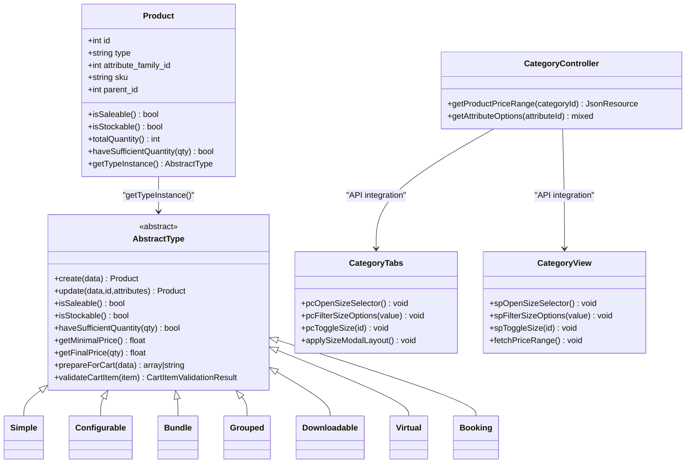

**Diagram sources**
- [Product.php:26-368](file://packages/Webkul/Product/src/Models/Product.php#L26-368)
- [AbstractType.php:32-139](file://packages/Webkul/Product/src/Type/AbstractType.php#L32-139)
- [Simple.php](file://packages/Webkul/Product/src/Type/Simple.php#L25)
- [Configurable.php](file://packages/Webkul/Product/src/Type/Configurable.php#L21)
- [Bundle.php](file://packages/Webkul/Product/src/Type/Bundle.php#L23)
- [Grouped.php](file://packages/Webkul/Product/src/Type/Grouped.php#L17)
- [Downloadable.php](file://packages/Webkul/Product/src/Type/Downloadable.php#L21)
- [Virtual.php](file://packages/Webkul/Product/src/Type/Virtual.php#L25)
- [Booking.php](file://packages/Webkul/Product/src/Type/Booking.php#L23)
- [CategoryController.php:110-127](file://packages/Webkul/Shop/src/Http/Controllers/Api/CategoryController.php#L110-127)
- [category-tabs.blade.php:912-962](file://packages/Webkul/Shop/src/Resources/views/components/categories/category-tabs.blade.php#L912-962)
- [view.blade.php:953-983](file://packages/Webkul/Shop/src/Resources/views/categories/view.blade.php#L953-983)

## Detailed Component Analysis

### Product Catalog Architecture
- Central Product model defines relations to attributes, categories, variants, media, inventory, pricing, reviews, and channels.
- getTypeInstance resolves the appropriate type class from configuration and injects the Product instance.
- Attribute values are lazily loaded and resolved per locale/channel according to attribute scoping.

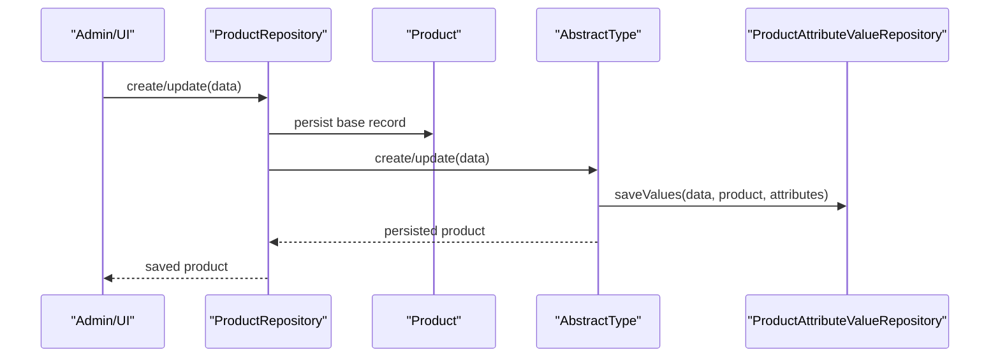

**Diagram sources**
- [Product.php:58-136](file://packages/Webkul/Product/src/Models/Product.php#L58-136)
- [AbstractType.php:146-208](file://packages/Webkul/Product/src/Type/AbstractType.php#L146-208)
- [ProductRepository.php](file://packages/Webkul/Product/src/Repositories/ProductRepository.php)

**Section sources**
- [Product.php:58-136](file://packages/Webkul/Product/src/Models/Product.php#L58-136)
- [AbstractType.php:146-208](file://packages/Webkul/Product/src/Type/AbstractType.php#L146-208)

### Product Types Overview
- Simple: stockable, customizable options, direct inventory checks, quantity box visible.
- Configurable: composite with variants, super attributes, SKU generation permutations, cart requires selection.
- Bundle: composite with linked products, dynamic pricing range, required option groups.
- Grouped: composite with associated simple products, per-item quantities.
- Downloadable: non-stocked, links and samples, cart requires selected links.
- Virtual: non-stocked, customizable options, similar to Simple but stock disabled.
- Booking: composite with slot availability, event tickets, rental durations, type-specific helpers.

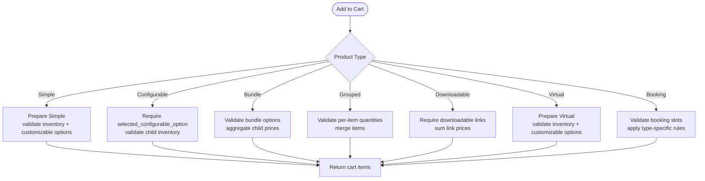

**Diagram sources**
- [Simple.php:189-281](file://packages/Webkul/Product/src/Type/Simple.php#L189-281)
- [Configurable.php:377-426](file://packages/Webkul/Product/src/Type/Configurable.php#L377-426)
- [Bundle.php:229-296](file://packages/Webkul/Product/src/Type/Bundle.php#L229-296)
- [Grouped.php:194-235](file://packages/Webkul/Product/src/Type/Grouped.php#L194-235)
- [Downloadable.php:146-169](file://packages/Webkul/Product/src/Type/Downloadable.php#L146-169)
- [Virtual.php:214-305](file://packages/Webkul/Product/src/Type/Virtual.php#L214-305)
- [Booking.php:155-226](file://packages/Webkul/Product/src/Type/Booking.php#L155-226)

**Section sources**
- [Simple.php:25-160](file://packages/Webkul/Product/src/Type/Simple.php#L25-160)
- [Configurable.php:21-131](file://packages/Webkul/Product/src/Type/Configurable.php#L21-131)
- [Bundle.php:23-100](file://packages/Webkul/Product/src/Type/Bundle.php#L23-100)
- [Grouped.php:17-78](file://packages/Webkul/Product/src/Type/Grouped.php#L17-78)
- [Downloadable.php:21-80](file://packages/Webkul/Product/src/Type/Downloadable.php#L21-80)
- [Virtual.php:25-84](file://packages/Webkul/Product/src/Type/Virtual.php#L25-84)
- [Booking.php:23-72](file://packages/Webkul/Product/src/Type/Booking.php#L23-72)

### Product Inheritance Patterns
- Parent-child hierarchy: variants under configurable, grouped associations, bundle options, and booking slots.
- Attribute inheritance: configurable variants inherit attribute family and selected super attributes; child inherits channels and pricing behavior.
- Type delegation: Product.getTypeInstance returns a type-specific instance that encapsulates behavior and validations.

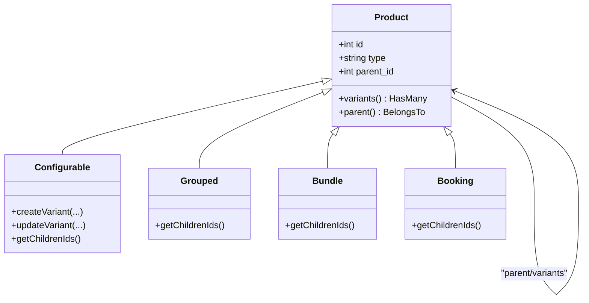

**Diagram sources**
- [Product.php:221-240](file://packages/Webkul/Product/src/Models/Product.php#L221-240)
- [Configurable.php:294-297](file://packages/Webkul/Product/src/Type/Configurable.php#L294-297)
- [Grouped.php:126-129](file://packages/Webkul/Product/src/Type/Grouped.php#L126-129)
- [Bundle.php:148-151](file://packages/Webkul/Product/src/Type/Bundle.php#L148-151)
- [Booking.php:115-135](file://packages/Webkul/Product/src/Type/Booking.php#L115-135)

**Section sources**
- [Product.php:221-240](file://packages/Webkul/Product/src/Models/Product.php#L221-240)
- [Configurable.php:197-255](file://packages/Webkul/Product/src/Type/Configurable.php#L197-255)

### Attribute System
- Attributes define product characteristics with type-specific validation and storage columns.
- Product loads attribute values dynamically, honoring channel/locale scoping and default fallbacks.
- Attribute families group attributes; configurable products bind super attributes to variants.

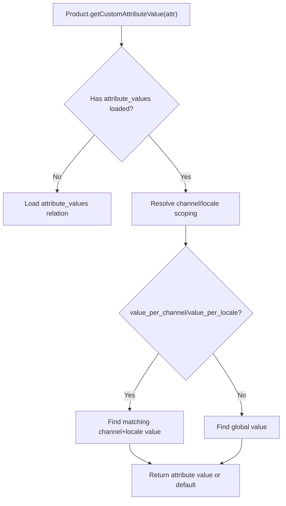

**Diagram sources**
- [Product.php:429-485](file://packages/Webkul/Product/src/Models/Product.php#L429-485)
- [Attribute.php:19-85](file://packages/Webkul/Attribute/src/Models/Attribute.php#L19-85)

**Section sources**
- [Product.php:429-485](file://packages/Webkul/Product/src/Models/Product.php#L429-485)
- [Attribute.php:19-85](file://packages/Webkul/Attribute/src/Models/Attribute.php#L19-85)

### Category Management
- Categories form a taxonomy with translations and observers for lifecycle events.
- Products are attached to categories via a pivot table; categories can be scoped by channels.

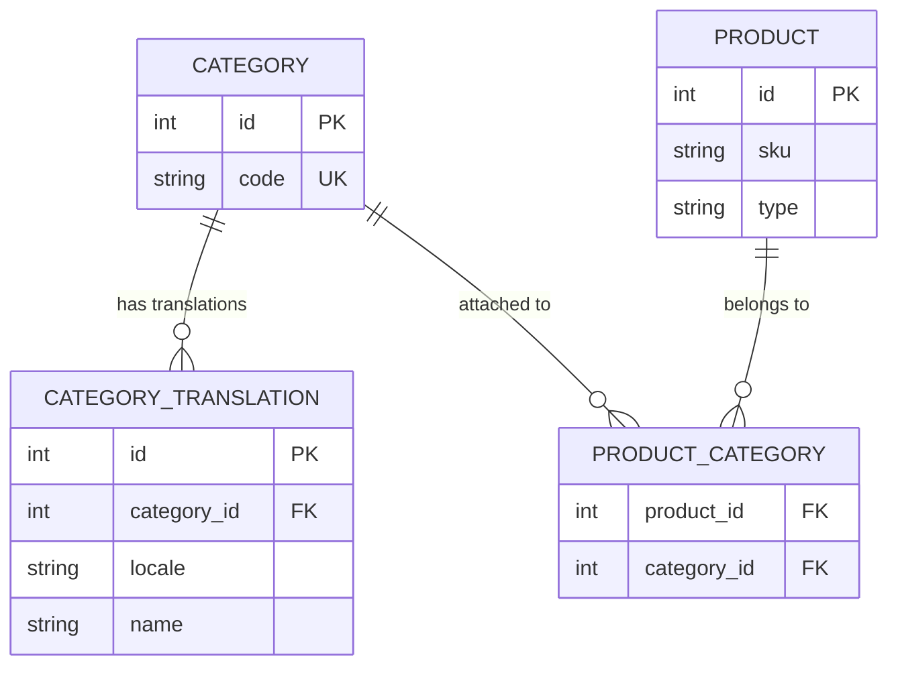

**Diagram sources**
- [Category.php](file://packages/Webkul/Category/src/Models/Category.php)
- [CategoryTranslation.php](file://packages/Webkul/Category/src/Models/CategoryTranslation.php)
- [Product.php:133-136](file://packages/Webkul/Product/src/Models/Product.php#L133-136)

**Section sources**
- [Category.php](file://packages/Webkul/Category/src/Models/Category.php)
- [CategoryTranslation.php](file://packages/Webkul/Category/src/Models/CategoryTranslation.php)
- [Product.php:133-136](file://packages/Webkul/Product/src/Models/Product.php#L133-136)

### Product Media Handling
- Images and videos are stored per product with ordering and repository-managed upload/copy.
- Copying a product duplicates media and stores copies under the new product's directory.

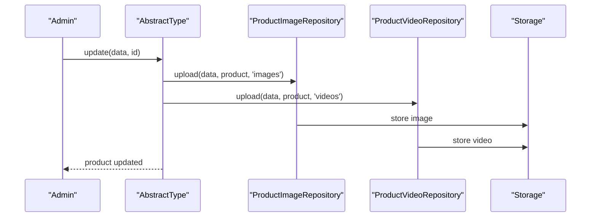

**Diagram sources**
- [AbstractType.php:201-204](file://packages/Webkul/Product/src/Type/AbstractType.php#L201-204)
- [ProductImageRepository.php](file://packages/Webkul/Product/src/Repositories/ProductImageRepository.php)
- [ProductVideoRepository.php](file://packages/Webkul/Product/src/Repositories/ProductVideoRepository.php)

**Section sources**
- [AbstractType.php:201-204](file://packages/Webkul/Product/src/Type/AbstractType.php#L201-204)

### Product Creation Workflows
- Creation: AbstractType.create persists base product and assigns default channel.
- Update: AbstractType.update saves attribute values, categories, channels, related products, inventories, media, and customer group prices.
- Copy: AbstractType.copy replicates product and relationships, respecting skip lists.

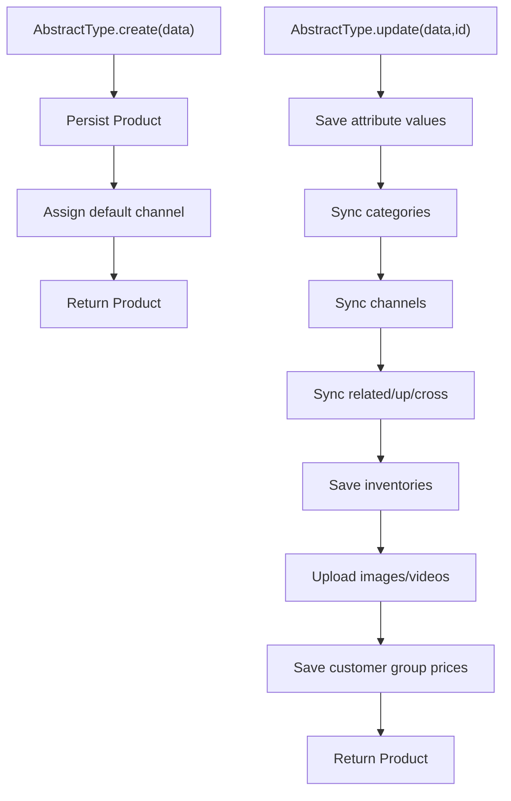

**Diagram sources**
- [AbstractType.php:146-208](file://packages/Webkul/Product/src/Type/AbstractType.php#L146-208)

**Section sources**
- [AbstractType.php:146-208](file://packages/Webkul/Product/src/Type/AbstractType.php#L146-208)

### Bulk Operations
- Bulk updates: Configurable supports mass update of variants; Booking integrates with mass update route.
- Bulk deletion/copy: AbstractType.copy supports selective skipping of attributes during duplication.

**Section sources**
- [Configurable.php:140-187](file://packages/Webkul/Product/src/Type/Configurable.php#L140-187)
- [Booking.php:79-94](file://packages/Webkul/Product/src/Type/Booking.php#L79-94)
- [AbstractType.php:230-247](file://packages/Webkul/Product/src/Type/AbstractType.php#L230-247)

### Product Variants
- Configurable generates variants from super attribute permutations, saving attribute values and inventories.
- Variant relations: parent_id links variants; variants inherit channels and pricing behavior.

**Section sources**
- [Configurable.php:197-255](file://packages/Webkul/Product/src/Type/Configurable.php#L197-255)
- [Product.php:221-224](file://packages/Webkul/Product/src/Models/Product.php#L221-224)

### Indexing, Search, and SEO
- Flat index: ProductFlat holds localized/channelized product data for rendering and filtering.
- Price and inventory indices: ProductPriceIndex and ProductInventoryIndex enable fast price queries and stock checks per channel/customer group.
- Elasticsearch: ElasticSearchRepository and SearchRepository support advanced search and faceted browsing.
- SEO: ProductFlat and attribute values provide structured metadata for storefront rendering.

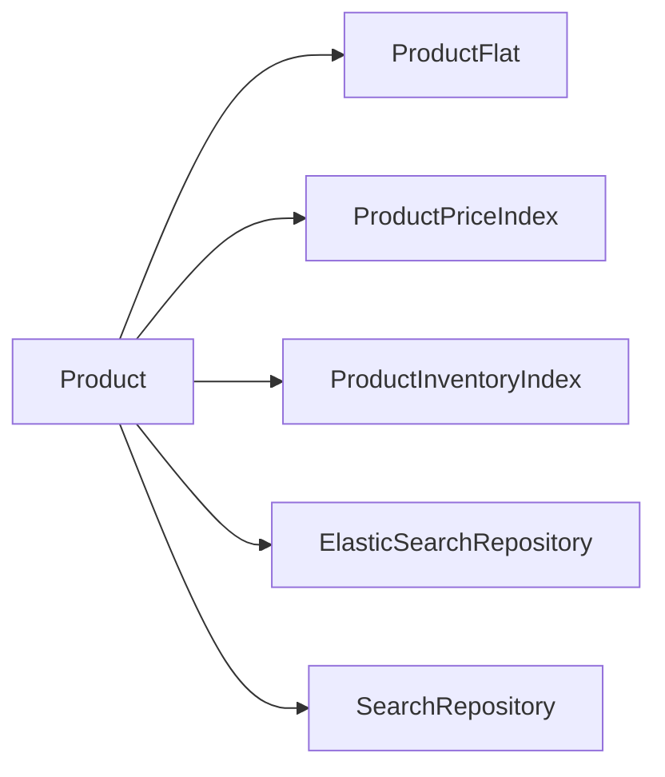

**Diagram sources**
- [ProductFlat.php](file://packages/Webkul/Product/src/Models/ProductFlat.php)
- [ProductFlatRepository.php](file://packages/Webkul/Product/src/Repositories/ProductFlatRepository.php)
- [ProductPriceIndex.php](file://packages/Webkul/Product/src/Models/ProductPriceIndex.php)
- [ProductPriceIndexRepository.php](file://packages/Webkul/Product/src/Repositories/ProductPriceIndexRepository.php)
- [ProductInventoryIndex.php](file://packages/Webkul/Product/src/Models/ProductInventoryIndex.php)
- [ProductInventoryIndexRepository.php](file://packages/Webkul/Product/src/Repositories/ProductInventoryIndexRepository.php)
- [ElasticSearchRepository.php](file://packages/Webkul/Product/src/Repositories/ElasticSearchRepository.php)
- [SearchRepository.php](file://packages/Webkul/Product/src/Repositories/SearchRepository.php)

**Section sources**
- [ProductFlat.php](file://packages/Webkul/Product/src/Models/ProductFlat.php)
- [ProductFlatRepository.php](file://packages/Webkul/Product/src/Repositories/ProductFlatRepository.php)
- [ProductPriceIndex.php](file://packages/Webkul/Product/src/Models/ProductPriceIndex.php)
- [ProductPriceIndexRepository.php](file://packages/Webkul/Product/src/Repositories/ProductPriceIndexRepository.php)
- [ProductInventoryIndex.php](file://packages/Webkul/Product/src/Models/ProductInventoryIndex.php)
- [ProductInventoryIndexRepository.php](file://packages/Webkul/Product/src/Repositories/ProductInventoryIndexRepository.php)
- [ElasticSearchRepository.php](file://packages/Webkul/Product/src/Repositories/ElasticSearchRepository.php)
- [SearchRepository.php](file://packages/Webkul/Product/src/Repositories/SearchRepository.php)

### Product Relationships, Inventory Tracking, and Pricing Strategies
- Relationships: related, up_sells, cross_sells, channels, categories, variants, grouped associations, bundle options, booking products.
- Inventory: per-source quantities via ProductInventory; salable inventory derived from indices; configurable aggregates variant quantities.
- Pricing: per-channel/customer group price indices; discounts computed against regular/min prices; configurable/grouped/bundle compute min/max ranges.

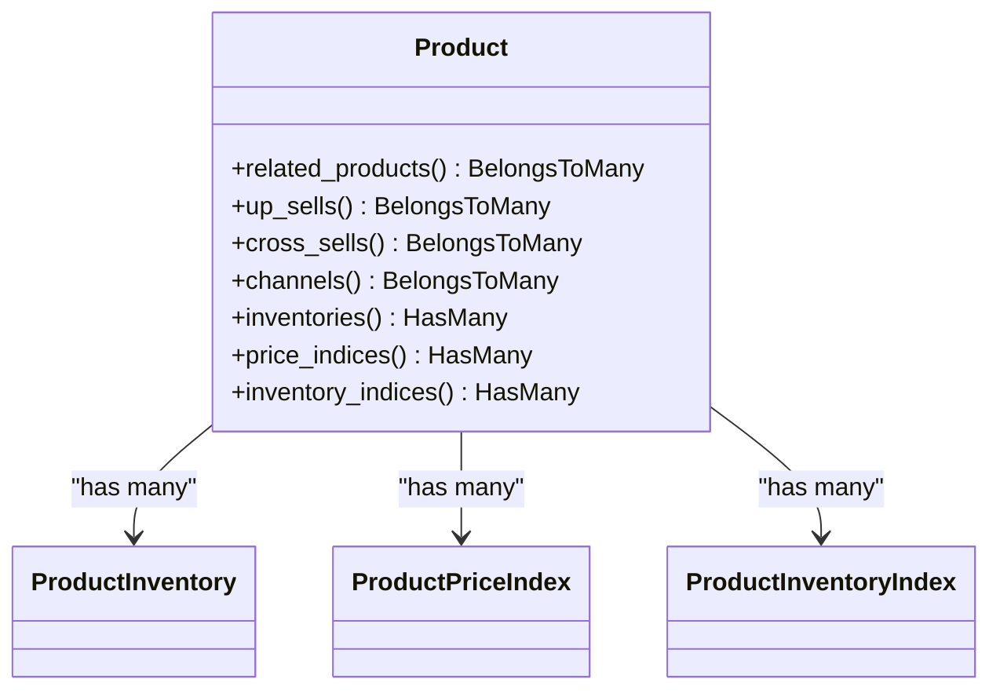

**Diagram sources**
- [Product.php:175-296](file://packages/Webkul/Product/src/Models/Product.php#L175-296)
- [ProductInventory.php](file://packages/Webkul/Product/src/Models/ProductInventory.php)
- [ProductPriceIndex.php](file://packages/Webkul/Product/src/Models/ProductPriceIndex.php)
- [ProductInventoryIndex.php](file://packages/Webkul/Product/src/Models/ProductInventoryIndex.php)

**Section sources**
- [Product.php:175-296](file://packages/Webkul/Product/src/Models/Product.php#L175-296)

## Enhanced Filtering and Display System

### Modal-Based Size Selector Implementation
The system now features a sophisticated modal-based size selector that replaces the previous inline grid approach. This enhancement provides a better user experience with improved accessibility and responsive design.

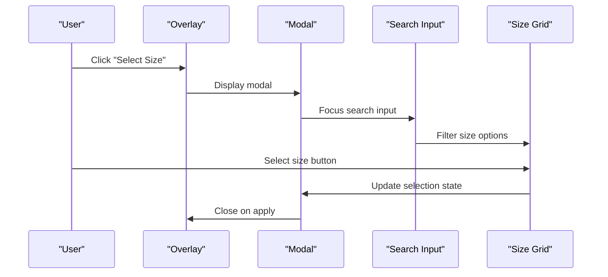

**Diagram sources**
- [category-tabs.blade.php:293-346](file://packages/Webkul/Shop/src/Resources/views/components/categories/category-tabs.blade.php#L293-346)
- [category-tabs.blade.php:912-962](file://packages/Webkul/Shop/src/Resources/views/components/categories/category-tabs.blade.php#L912-962)
- [view.blade.php:324-377](file://packages/Webkul/Shop/src/Resources/views/categories/view.blade.php#L324-377)
- [index.blade.php:953-983](file://packages/Webkul/Shop/src/Resources/views/search/index.blade.php#L953-983)

### Dynamic Price Range Filtering
Enhanced price range filtering now includes dynamic calculations with responsive step adjustments and real-time price bounds calculation.

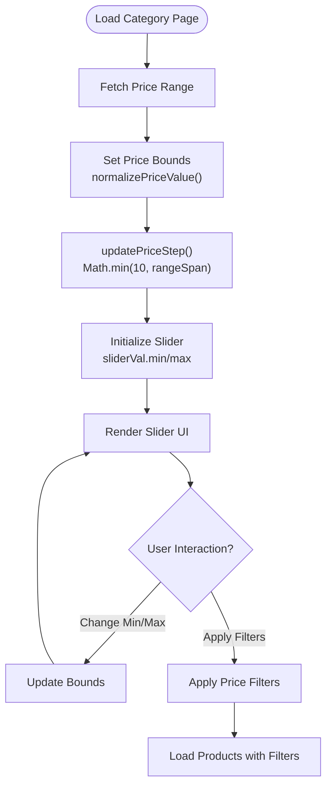

**Diagram sources**
- [category-tabs.blade.php:448-481](file://packages/Webkul/Shop/src/Resources/views/components/categories/category-tabs.blade.php#L448-481)
- [category-tabs.blade.php:497-515](file://packages/Webkul/Shop/src/Resources/views/components/categories/category-tabs.blade.php#L497-515)
- [view.blade.php:482-515](file://packages/Webkul/Shop/src/Resources/views/categories/view.blade.php#L482-515)
- [index.blade.php:1060-1069](file://packages/Webkul/Shop/src/Resources/views/search/index.blade.php#L1060-1069)

### Responsive Design and Layout Management
The enhanced filtering system includes responsive layout management that adapts the modal interface based on screen size and device type.

**Section sources**
- [category-tabs.blade.php:840-871](file://packages/Webkul/Shop/src/Resources/views/components/categories/category-tabs.blade.php#L840-871)
- [view.blade.php:969-975](file://packages/Webkul/Shop/src/Resources/views/categories/view.blade.php#L969-975)
- [index.blade.php:925-937](file://packages/Webkul/Shop/src/Resources/views/search/index.blade.php#L925-937)

### Enhanced Product Configuration Interface
The configurable product interface has been significantly improved with better user experience, enhanced size selection, and streamlined configuration workflows.

**Section sources**
- [category-tabs.blade.php:784-838](file://packages/Webkul/Shop/src/Resources/views/components/categories/category-tabs.blade.php#L784-838)
- [view.blade.php:913-967](file://packages/Webkul/Shop/src/Resources/views/categories/view.blade.php#L913-967)
- [index.blade.php:900-923](file://packages/Webkul/Shop/src/Resources/views/search/index.blade.php#L900-923)

## Dependency Analysis
- Product depends on Attribute, Category, Inventory, Pricing, Media, and Channel repositories.
- Product types depend on repositories for attributes, media, inventory, pricing, and configurable/grouped/bundle helpers.
- Observers on Product and Category manage lifecycle hooks for denormalization and indexing.
- **Enhanced UI layer**: CategoryController provides API endpoints for price range calculation and attribute option retrieval.

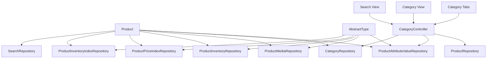

**Diagram sources**
- [Product.php:133-296](file://packages/Webkul/Product/src/Models/Product.php#L133-296)
- [AbstractType.php:130-139](file://packages/Webkul/Product/src/Type/AbstractType.php#L130-139)
- [CategoryController.php:110-127](file://packages/Webkul/Shop/src/Http/Controllers/Api/CategoryController.php#L110-127)
- [category-tabs.blade.php:912-962](file://packages/Webkul/Shop/src/Resources/views/components/categories/category-tabs.blade.php#L912-962)
- [view.blade.php:953-983](file://packages/Webkul/Shop/src/Resources/views/categories/view.blade.php#L953-983)
- [index.blade.php:953-983](file://packages/Webkul/Shop/src/Resources/views/search/index.blade.php#L953-983)

**Section sources**
- [Product.php:133-296](file://packages/Webkul/Product/src/Models/Product.php#L133-296)
- [AbstractType.php:130-139](file://packages/Webkul/Product/src/Type/AbstractType.php#L130-139)
- [CategoryController.php:110-127](file://packages/Webkul/Shop/src/Http/Controllers/Api/CategoryController.php#L110-127)

## Performance Considerations
- Lazy loading of attribute values reduces overhead when not accessed.
- Price and inventory indices enable O(1) lookups per channel/customer group.
- Elasticsearch search offloads heavy filtering and faceting from relational queries.
- Batch operations (bulk updates, copies) minimize N+1 queries via eager loading and targeted repository methods.
- **Enhanced UI performance**: Modal-based filtering reduces DOM manipulation overhead and improves responsiveness.
- **Dynamic price calculations**: Efficient price range fetching with caching mechanisms prevents unnecessary API calls.

## Troubleshooting Guide
- Missing options errors: Configurable requires selected_configurable_option; Bundle requires bundle_options; Downloadable requires links; Grouped requires qty map.
- Inventory warnings: Simple/Virtual/Booking types validate per-item quantity; Configurable validates child inventory; Bundle validates per-option availability.
- File extensions: Simple/Virtual validate uploaded file extensions against customizable options' allowed types.
- Cart item validation: Types recalculate prices and update totals if mismatch detected.
- **Modal issues**: Ensure proper overlay and modal element IDs match JavaScript selectors; verify CSS positioning for responsive layouts.
- **Price range errors**: Check API endpoint accessibility and verify price normalization functions are working correctly.
- **Filter synchronization**: Ensure filter state is properly maintained across page reloads and navigation.

**Section sources**
- [Simple.php:189-281](file://packages/Webkul/Product/src/Type/Simple.php#L189-281)
- [Configurable.php:377-426](file://packages/Webkul/Product/src/Type/Configurable.php#L377-426)
- [Bundle.php:229-296](file://packages/Webkul/Product/src/Type/Bundle.php#L229-296)
- [Downloadable.php:146-169](file://packages/Webkul/Product/src/Type/Downloadable.php#L146-169)
- [Virtual.php:214-305](file://packages/Webkul/Product/src/Type/Virtual.php#L214-305)
- [Booking.php:155-226](file://packages/Webkul/Product/src/Type/Booking.php#L155-226)
- [category-tabs.blade.php:912-962](file://packages/Webkul/Shop/src/Resources/views/components/categories/category-tabs.blade.php#L912-962)
- [view.blade.php:953-983](file://packages/Webkul/Shop/src/Resources/views/categories/view.blade.php#L953-983)
- [index.blade.php:953-983](file://packages/Webkul/Shop/src/Resources/views/search/index.blade.php#L953-983)

## Conclusion
Frooxi's product management system centers on a flexible type-based architecture, robust attribute and category systems, and efficient indexing/search. The recent enhancements include a sophisticated modal-based filtering system with responsive design, dynamic price range calculations, and improved product configuration interfaces. Product types encapsulate domain logic, while repositories and indices ensure scalability. The system supports complex workflows like configurable variants, bundles, grouped products, downloadable assets, virtual goods, and bookings, all integrated with inventory and pricing strategies across channels.

## Appendices

### Product Types Reference
- Simple: stockable, customizable options, direct inventory checks.
- Configurable: composite with variants, SKU permutations, required selection.
- Bundle: composite with linked products, dynamic pricing range.
- Grouped: composite with associated simple products, per-item quantities.
- Downloadable: non-stocked, links/samples, cart requires selected links.
- Virtual: non-stocked, customizable options, similar to Simple.
- Booking: composite with slot availability, event tickets, rental durations.

**Section sources**
- [Simple.php:25-160](file://packages/Webkul/Product/src/Type/Simple.php#L25-160)
- [Configurable.php:21-131](file://packages/Webkul/Product/src/Type/Configurable.php#L21-131)
- [Bundle.php:23-100](file://packages/Webkul/Product/src/Type/Bundle.php#L23-100)
- [Grouped.php:17-78](file://packages/Webkul/Product/src/Type/Grouped.php#L17-78)
- [Downloadable.php:21-80](file://packages/Webkul/Product/src/Type/Downloadable.php#L21-80)
- [Virtual.php:25-84](file://packages/Webkul/Product/src/Type/Virtual.php#L25-84)
- [Booking.php:23-72](file://packages/Webkul/Product/src/Type/Booking.php#L23-72)

### Enhanced Filtering Features
- Modal-based size selector with search functionality
- Dynamic price range calculation with responsive step adjustment
- Enhanced product configuration interface for configurable products
- Responsive design adapting to different screen sizes
- Real-time filter application and product loading

**Section sources**
- [CategoryController.php:110-127](file://packages/Webkul/Shop/src/Http/Controllers/Api/CategoryController.php#L110-127)
- [category-tabs.blade.php:770-838](file://packages/Webkul/Shop/src/Resources/views/components/categories/category-tabs.blade.php#L770-838)
- [view.blade.php:913-967](file://packages/Webkul/Shop/src/Resources/views/categories/view.blade.php#L913-967)
- [index.blade.php:900-923](file://packages/Webkul/Shop/src/Resources/views/search/index.blade.php#L900-923)