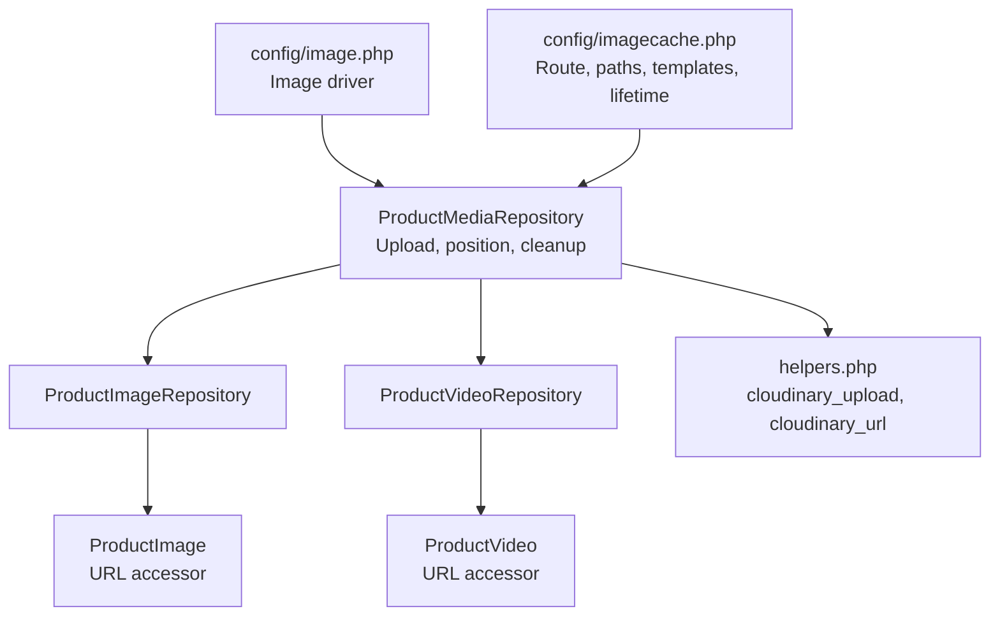
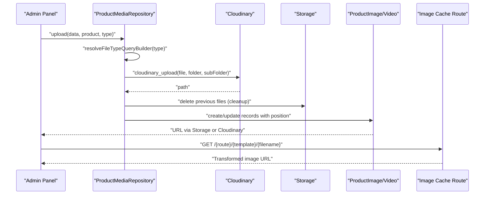
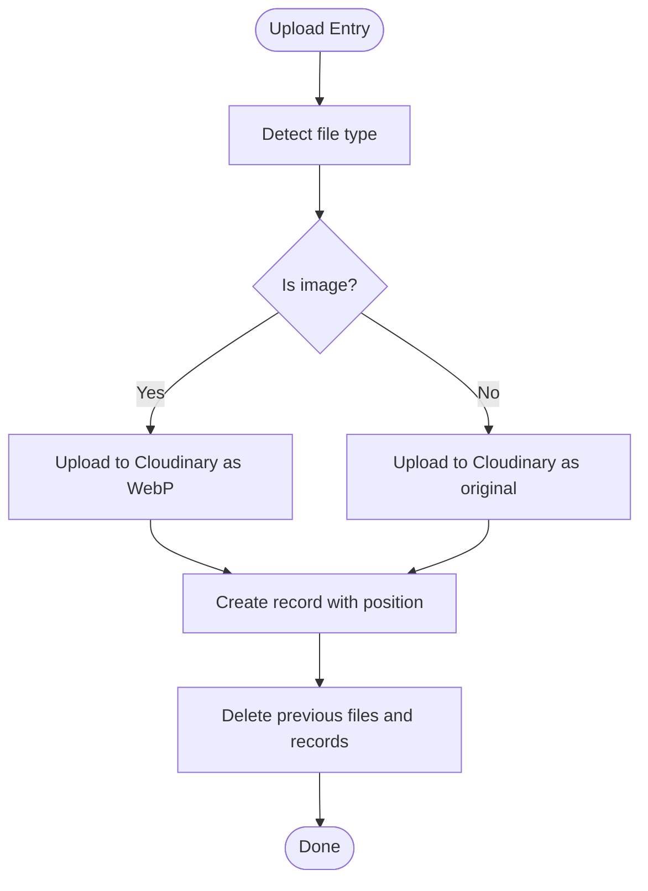
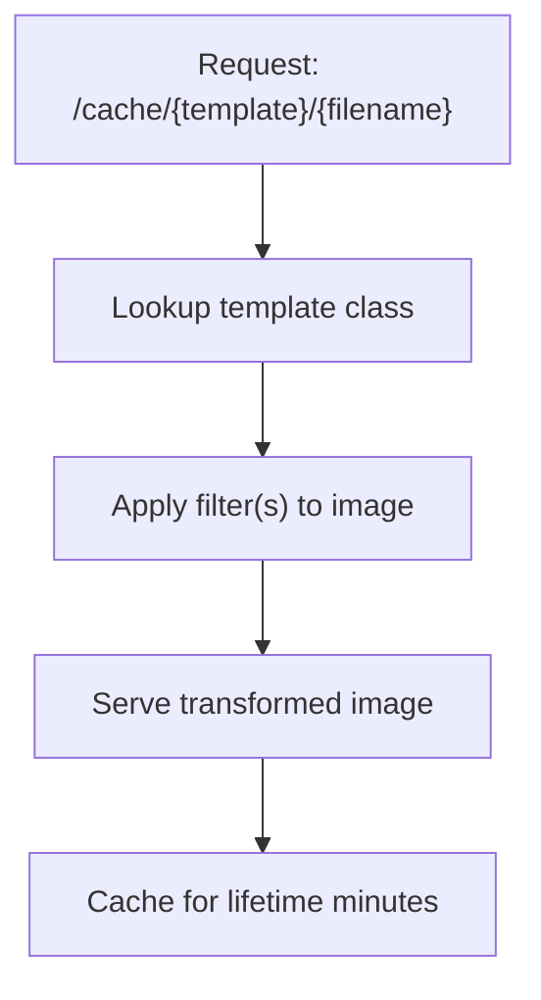
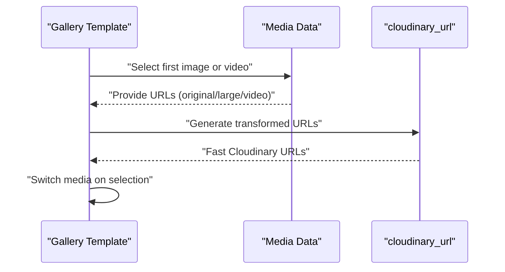
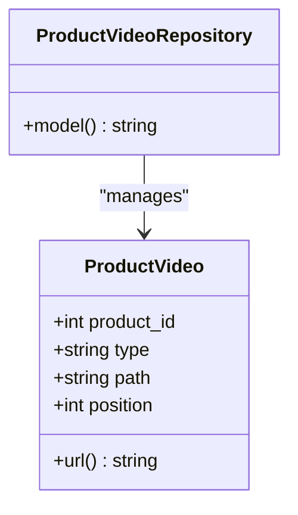
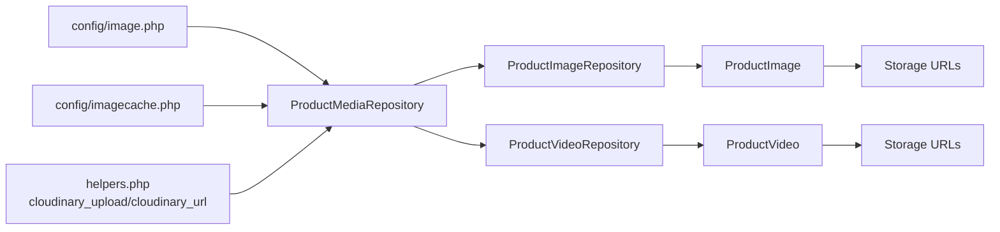

# Product Media and Assets

<cite>
**Referenced Files in This Document**
- [image.php](file://config/image.php)
- [imagecache.php](file://config/imagecache.php)
- [ProductMediaRepository.php](file://packages/Webkul/Product/src/Repositories/ProductMediaRepository.php)
- [ProductImageRepository.php](file://packages/Webkul/Product/src/Repositories/ProductImageRepository.php)
- [ProductVideoRepository.php](file://packages/Webkul/Product/src/Repositories/ProductVideoRepository.php)
- [ProductImage.php](file://packages/Webkul/Product/src/Models/ProductImage.php)
- [ProductVideo.php](file://packages/Webkul/Product/src/Models/ProductVideo.php)
- [helpers.php](file://packages/Webkul/Core/src/Http/helpers.php)
- [gallery.blade.php](file://packages/Webkul/Shop/src/Resources/views/products/view/gallery.blade.php)
</cite>

## Table of Contents
1. [Introduction](#introduction)
2. [Project Structure](#project-structure)
3. [Core Components](#core-components)
4. [Architecture Overview](#architecture-overview)
5. [Detailed Component Analysis](#detailed-component-analysis)
6. [Dependency Analysis](#dependency-analysis)
7. [Performance Considerations](#performance-considerations)
8. [Troubleshooting Guide](#troubleshooting-guide)
9. [Conclusion](#conclusion)

## Introduction
This document explains Frooxi's product media handling system with a focus on product image and video workflows. It covers upload, storage, transformation, caching, and responsive serving. It also documents supported formats, size considerations, Cloudinary integration, cache filtering (small, medium, large), and gallery functionality. Guidance is provided for custom cache filters and optimization strategies.

## Project Structure
The media system spans configuration, repositories, models, helpers, and frontend templates:
- Configuration defines image driver and cache route/templates.
- Repositories encapsulate upload and position management for images and videos.
- Models expose URLs and relationships to products.
- Helpers implement Cloudinary upload and URL generation.
- Frontend templates assemble galleries and select appropriate media variants.

**Diagram sources**
- [image.php:1-21](file://config/image.php#L1-L21)
- [imagecache.php:1-87](file://config/imagecache.php#L1-L87)
- [ProductMediaRepository.php:1-111](file://packages/Webkul/Product/src/Repositories/ProductMediaRepository.php#L1-L111)
- [ProductImageRepository.php:1-15](file://packages/Webkul/Product/src/Repositories/ProductImageRepository.php#L1-L15)
- [ProductVideoRepository.php:1-15](file://packages/Webkul/Product/src/Repositories/ProductVideoRepository.php#L1-L15)
- [ProductImage.php:1-79](file://packages/Webkul/Product/src/Models/ProductImage.php#L1-L79)
- [ProductVideo.php:1-79](file://packages/Webkul/Product/src/Models/ProductVideo.php#L1-L79)
- [helpers.php:187-248](file://packages/Webkul/Core/src/Http/helpers.php#L187-L248)

**Section sources**
- [image.php:1-21](file://config/image.php#L1-L21)
- [imagecache.php:1-87](file://config/imagecache.php#L1-L87)
- [ProductMediaRepository.php:1-111](file://packages/Webkul/Product/src/Repositories/ProductMediaRepository.php#L1-L111)
- [ProductImageRepository.php:1-15](file://packages/Webkul/Product/src/Repositories/ProductImageRepository.php#L1-L15)
- [ProductVideoRepository.php:1-15](file://packages/Webkul/Product/src/Repositories/ProductVideoRepository.php#L1-L15)
- [ProductImage.php:1-79](file://packages/Webkul/Product/src/Models/ProductImage.php#L1-L79)
- [ProductVideo.php:1-79](file://packages/Webkul/Product/src/Models/ProductVideo.php#L1-L79)
- [helpers.php:187-248](file://packages/Webkul/Core/src/Http/helpers.php#L187-L248)

## Core Components
- ProductMediaRepository: Centralized upload logic for images and videos, including Cloudinary integration, position updates, and cleanup of removed items.
- ProductImageRepository and ProductVideoRepository: Specializations that bind repositories to their contracts.
- ProductImage and ProductVideo models: Provide URL accessors and product relationships.
- helpers.php: Implements cloudinary_upload and cloudinary_url for fast URL generation without API calls.
- imagecache.php: Defines cache route, storage paths, manipulation templates (small, medium, large), lifetime, and optional cache driver.

Key responsibilities:
- Upload: Accepts uploaded files, detects type, stores via Cloudinary, assigns positions, and persists records.
- Cleanup: Removes previously stored files and deletes orphaned records after batch updates.
- Serving: Uses Storage URLs or Cloudinary URLs depending on model usage and configuration.

**Section sources**
- [ProductMediaRepository.php:29-90](file://packages/Webkul/Product/src/Repositories/ProductMediaRepository.php#L29-L90)
- [ProductImageRepository.php:5-14](file://packages/Webkul/Product/src/Repositories/ProductImageRepository.php#L5-L14)
- [ProductVideoRepository.php:5-14](file://packages/Webkul/Product/src/Repositories/ProductVideoRepository.php#L5-L14)
- [ProductImage.php:48-66](file://packages/Webkul/Product/src/Models/ProductImage.php#L48-L66)
- [ProductVideo.php:48-66](file://packages/Webkul/Product/src/Models/ProductVideo.php#L48-L66)
- [helpers.php:198-248](file://packages/Webkul/Core/src/Http/helpers.php#L198-L248)
- [imagecache.php:23-86](file://config/imagecache.php#L23-L86)

## Architecture Overview
The media pipeline integrates configuration, repositories, models, and helpers to deliver optimized and cached media to clients.

**Diagram sources**
- [ProductMediaRepository.php:45-90](file://packages/Webkul/Product/src/Repositories/ProductMediaRepository.php#L45-L90)
- [helpers.php:198-248](file://packages/Webkul/Core/src/Http/helpers.php#L198-L248)
- [ProductImage.php:53-56](file://packages/Webkul/Product/src/Models/ProductImage.php#L53-L56)
- [ProductVideo.php:53-56](file://packages/Webkul/Product/src/Models/ProductVideo.php#L53-L56)
- [imagecache.php:23-62](file://config/imagecache.php#L23-L62)

## Detailed Component Analysis

### Upload and Storage Workflow
- Type detection: Images are converted to WebP and stored; non-image files are stored as-is.
- Folder structure: Files are organized under a base path with entity-specific subfolders.
- Position management: Sequential positions are assigned during batch uploads.
- Cleanup: Removed files are deleted from storage and corresponding records are removed.

**Diagram sources**
- [ProductMediaRepository.php:45-90](file://packages/Webkul/Product/src/Repositories/ProductMediaRepository.php#L45-L90)
- [helpers.php:198-248](file://packages/Webkul/Core/src/Http/helpers.php#L198-L248)

**Section sources**
- [ProductMediaRepository.php:45-90](file://packages/Webkul/Product/src/Repositories/ProductMediaRepository.php#L45-L90)
- [helpers.php:198-248](file://packages/Webkul/Core/src/Http/helpers.php#L198-L248)

### Cache Filtering (Small, Medium, Large)
- Route and templates: The cache route accepts a template and filename, applying configured filters.
- Storage paths: The system searches configured storage paths for the requested file.
- Lifetime: Images served via the cache route expire after a configurable duration.
- Customization: Additional templates can be added to the templates map.

**Diagram sources**
- [imagecache.php:23-86](file://config/imagecache.php#L23-L86)

**Section sources**
- [imagecache.php:23-86](file://config/imagecache.php#L23-L86)

### Image Transformation and Responsive Serving
- Cloudinary URL generation: Provides fast, direct URLs without API calls, with resource type detection based on extension.
- Frontend gallery: Selects initial media (image or video), exposes attachments, and switches between images and videos while managing loading states and swipe gestures.

**Diagram sources**
- [helpers.php:232-248](file://packages/Webkul/Core/src/Http/helpers.php#L232-L248)
- [gallery.blade.php:68-129](file://packages/Webkul/Shop/src/Resources/views/products/view/gallery.blade.php#L68-L129)

**Section sources**
- [helpers.php:232-248](file://packages/Webkul/Core/src/Http/helpers.php#L232-L248)
- [gallery.blade.php:68-129](file://packages/Webkul/Shop/src/Resources/views/products/view/gallery.blade.php#L68-L129)

### Video Attachment Capabilities
- Storage: Videos are uploaded via Cloudinary and stored with metadata linked to the product.
- Embedding: The gallery template handles switching to video mode and sets the base file accordingly.
- URL Accessor: Models expose a URL accessor for video paths.

**Diagram sources**
- [ProductVideo.php:10-79](file://packages/Webkul/Product/src/Models/ProductVideo.php#L10-L79)
- [ProductVideoRepository.php:5-14](file://packages/Webkul/Product/src/Repositories/ProductVideoRepository.php#L5-L14)

**Section sources**
- [ProductVideo.php:19-66](file://packages/Webkul/Product/src/Models/ProductVideo.php#L19-L66)
- [ProductVideoRepository.php:5-14](file://packages/Webkul/Product/src/Repositories/ProductVideoRepository.php#L5-L14)
- [gallery.blade.php:107-129](file://packages/Webkul/Shop/src/Resources/views/products/view/gallery.blade.php#L107-L129)

### Media Validation, Formats, and Size Limitations
- Supported formats: Images are converted to WebP automatically; non-image files are stored as provided.
- Extension handling: The upload helper determines extensions and applies WebP conversion for recognized image types.
- Size considerations: No explicit size limits are enforced in the referenced code; practical constraints depend on Cloudinary account settings and server configuration.

Recommendations:
- Enforce client-side and server-side size checks at the controller level if needed.
- Configure Cloudinary plan limits and monitor usage.

**Section sources**
- [helpers.php:212-226](file://packages/Webkul/Core/src/Http/helpers.php#L212-L226)

### Storage Configuration
- Default disk: The upload helper reads the default filesystem disk from configuration.
- Public storage: The cache route searches configured paths for images/videos.
- Image driver: The image driver setting influences image processing libraries.

**Section sources**
- [helpers.php:200](file://packages/Webkul/Core/src/Http/helpers.php#L200)
- [imagecache.php:37-40](file://config/imagecache.php#L37-L40)
- [image.php:18](file://config/image.php#L18)

### Media Positioning and Gallery Functionality
- Positioning: During batch uploads, sequential positions are assigned to maintain order.
- Gallery: The gallery template composes attachments from images and videos, selects the base file, and manages loading states and swipe transitions.

**Section sources**
- [ProductMediaRepository.php:52-78](file://packages/Webkul/Product/src/Repositories/ProductMediaRepository.php#L52-L78)
- [gallery.blade.php:48-129](file://packages/Webkul/Shop/src/Resources/views/products/view/gallery.blade.php#L48-L129)

### Custom Cache Filters and Optimization Strategies
- Custom filters: Add new templates in the templates configuration to introduce additional cache filters.
- Optimization strategies:
  - Prefer WebP for images to reduce payload sizes.
  - Use Cloudinary URLs for fast delivery without API round trips.
  - Leverage cache lifetime to balance freshness and performance.
  - Consider aspect ratio and crop modes in templates for consistent layouts.

**Section sources**
- [imagecache.php:58-62](file://config/imagecache.php#L58-L62)
- [helpers.php:232-248](file://packages/Webkul/Core/src/Http/helpers.php#L232-L248)

## Dependency Analysis

**Diagram sources**
- [image.php:1-21](file://config/image.php#L1-L21)
- [imagecache.php:1-87](file://config/imagecache.php#L1-L87)
- [ProductMediaRepository.php:1-111](file://packages/Webkul/Product/src/Repositories/ProductMediaRepository.php#L1-L111)
- [helpers.php:198-248](file://packages/Webkul/Core/src/Http/helpers.php#L198-L248)
- [ProductImageRepository.php:1-15](file://packages/Webkul/Product/src/Repositories/ProductImageRepository.php#L1-L15)
- [ProductVideoRepository.php:1-15](file://packages/Webkul/Product/src/Repositories/ProductVideoRepository.php#L1-L15)
- [ProductImage.php:1-79](file://packages/Webkul/Product/src/Models/ProductImage.php#L1-L79)
- [ProductVideo.php:1-79](file://packages/Webkul/Product/src/Models/ProductVideo.php#L1-L79)

**Section sources**
- [image.php:1-21](file://config/image.php#L1-L21)
- [imagecache.php:1-87](file://config/imagecache.php#L1-L87)
- [ProductMediaRepository.php:1-111](file://packages/Webkul/Product/src/Repositories/ProductMediaRepository.php#L1-L111)
- [helpers.php:198-248](file://packages/Webkul/Core/src/Http/helpers.php#L198-L248)
- [ProductImageRepository.php:1-15](file://packages/Webkul/Product/src/Repositories/ProductImageRepository.php#L1-L15)
- [ProductVideoRepository.php:1-15](file://packages/Webkul/Product/src/Repositories/ProductVideoRepository.php#L1-L15)
- [ProductImage.php:1-79](file://packages/Webkul/Product/src/Models/ProductImage.php#L1-L79)
- [ProductVideo.php:1-79](file://packages/Webkul/Product/src/Models/ProductVideo.php#L1-L79)

## Performance Considerations
- Use Cloudinary for efficient storage and delivery.
- Prefer WebP for images to reduce bandwidth.
- Configure cache lifetime appropriately to balance freshness and performance.
- Minimize API calls by generating Cloudinary URLs directly.

## Troubleshooting Guide
- Upload failures: Verify Cloudinary credentials and disk configuration.
- Missing cache images: Confirm cache route, template names, and storage paths.
- Incorrect URLs: Ensure Storage URLs or Cloudinary URLs are used consistently.
- Position issues: Validate batch update logic and position increments.

**Section sources**
- [ProductMediaRepository.php:45-90](file://packages/Webkul/Product/src/Repositories/ProductMediaRepository.php#L45-L90)
- [imagecache.php:23-86](file://config/imagecache.php#L23-L86)
- [helpers.php:198-248](file://packages/Webkul/Core/src/Http/helpers.php#L198-L248)

## Conclusion
Frooxi’s product media system leverages Cloudinary for robust upload and delivery, with configurable cache templates for responsive serving. Repositories manage uploads, positions, and cleanup, while models expose URLs and relationships. The gallery template orchestrates media selection and transitions. By tuning cache templates, leveraging WebP, and optimizing Cloudinary settings, teams can achieve fast, scalable media experiences.