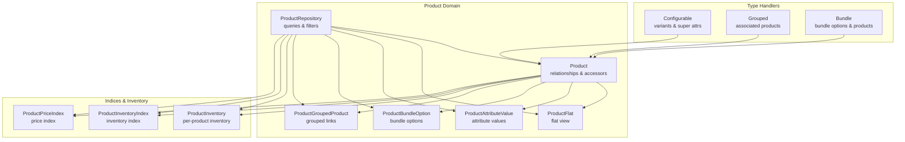
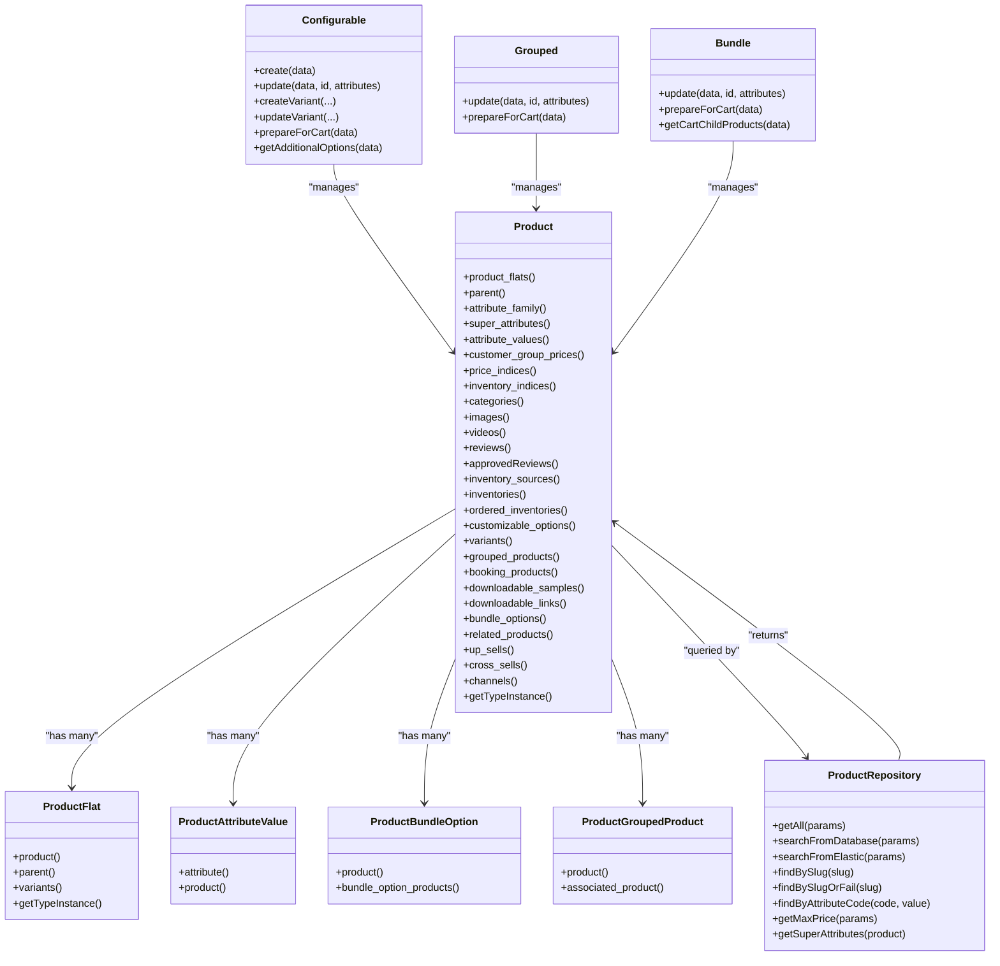
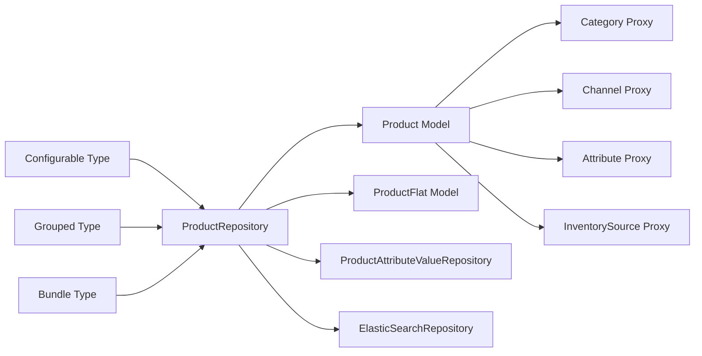

# Product Relationships and Associations

<cite>
**Referenced Files in This Document**
- [Product.php](file://packages/Webkul/Product/src/Models/Product.php)
- [ProductFlat.php](file://packages/Webkul/Product/src/Models/ProductFlat.php)
- [ProductAttributeValue.php](file://packages/Webkul/Product/src/Models/ProductAttributeValue.php)
- [ProductBundleOption.php](file://packages/Webkul/Product/src/Models/ProductBundleOption.php)
- [ProductGroupedProduct.php](file://packages/Webkul/Product/src/Models/ProductGroupedProduct.php)
- [ProductRepository.php](file://packages/Webkul/Product/src/Repositories/ProductRepository.php)
- [Configurable.php](file://packages/Webkul/Product/src/Type/Configurable.php)
- [Bundle.php](file://packages/Webkul/Product/src/Type/Bundle.php)
- [Grouped.php](file://packages/Webkul/Product/src/Type/Grouped.php)
- [2018_07_27_065727_create_products_table.php](file://packages/Webkul/Product/src/Database/Migrations/2018_07_27_065727_create_products_table.php)
- [2018_07_27_070011_create_product_attribute_values_table.php](file://packages/Webkul/Product/src/Database/Migrations/2018_07_27_070011_create_product_attribute_values_table.php)
- [2018_12_06_185202_create_product_flat_table.php](file://packages/Webkul/Product/src/Database/Migrations/2018_12_06_185202_create_product_flat_table.php)
- [2018_07_27_113956_create_product_inventories_table.php](file://packages/Webkul/Product/src/Database/Migrations/2018_07_27_113956_create_product_inventories_table.php)
- [2019_08_02_105320_create_product_grouped_products_table.php](file://packages/Webkul/Product/src/Database/Migrations/2019_08_02_105320_create_product_grouped_products_table.php)
- [2019_08_20_170510_create_product_bundle_options_table.php](file://packages/Webkul/Product/src/Database/Migrations/2019_08_20_170510_create_product_bundle_options_table.php)
- [2022_10_03_144232_create_product_price_indices_table.php](file://packages/Webkul/Product/src/Database/Migrations/2022_10_03_144232_create_product_price_indices_table.php)
- [2022_10_08_134150_create_product_inventory_indices_table.php](file://packages/Webkul/Product/src/Database/Migrations/2022_10_08_134150_create_product_inventory_indices_table.php)
- [Product.php](file://packages/Webkul/Product/src/Helpers/Product.php)
</cite>

## Table of Contents
1. [Introduction](#introduction)
2. [Project Structure](#project-structure)
3. [Core Components](#core-components)
4. [Architecture Overview](#architecture-overview)
5. [Detailed Component Analysis](#detailed-component-analysis)
6. [Dependency Analysis](#dependency-analysis)
7. [Performance Considerations](#performance-considerations)
8. [Troubleshooting Guide](#troubleshooting-guide)
9. [Conclusion](#conclusion)
10. [Appendices](#appendices)

## Introduction
This document explains Frooxi’s product relationship system in the Bagisto codebase. It covers:
- Product associations: grouped products, bundle options, related products, up-sells, and cross-sells
- Product attribute value relationships and configurable product super attributes
- Product-category many-to-many relationships and product-channel associations
- Inventory source connections and indices
- Relationship querying patterns, eager loading strategies, and performance optimization
- Examples of complex product relationship scenarios and their implementation patterns

## Project Structure
The product relationship system spans models, repositories, type handlers, and migrations:
- Models define relationships and expose accessors for related entities
- Repositories implement search, filtering, and eager loading strategies
- Type classes encapsulate product-type-specific behaviors (configurable, grouped, bundle)
- Migrations define the underlying relational schema

**Diagram sources**
- [Product.php:58-296](file://packages/Webkul/Product/src/Models/Product.php#L58-L296)
- [ProductFlat.php:47-80](file://packages/Webkul/Product/src/Models/ProductFlat.php#L47-L80)
- [ProductAttributeValue.php:66-76](file://packages/Webkul/Product/src/Models/ProductAttributeValue.php#L66-L76)
- [ProductBundleOption.php:44-54](file://packages/Webkul/Product/src/Models/ProductBundleOption.php#L44-L54)
- [ProductGroupedProduct.php:37-47](file://packages/Webkul/Product/src/Models/ProductGroupedProduct.php#L37-L47)
- [ProductRepository.php:256-480](file://packages/Webkul/Product/src/Repositories/ProductRepository.php#L256-L480)
- [Configurable.php:98-232](file://packages/Webkul/Product/src/Type/Configurable.php#L98-L232)
- [Grouped.php:87-98](file://packages/Webkul/Product/src/Type/Grouped.php#L87-L98)
- [Bundle.php:109-120](file://packages/Webkul/Product/src/Type/Bundle.php#L109-L120)

**Section sources**
- [Product.php:58-296](file://packages/Webkul/Product/src/Models/Product.php#L58-L296)
- [ProductRepository.php:256-480](file://packages/Webkul/Product/src/Repositories/ProductRepository.php#L256-L480)

## Core Components
- Product model exposes relationships for variants, grouped products, bundle options, related/up-sell/cross-sell products, categories, channels, images, videos, reviews, inventories, and indices.
- ProductAttributeValue stores localized/channelized attribute values and resolves them dynamically via the Product model.
- ProductRepository centralizes search, filtering, sorting, and eager loading across relationships.
- Type classes (Configurable, Grouped, Bundle) implement product-type-specific creation, updates, validation, and cart preparation logic.

Key relationship highlights:
- Variants and super attributes for configurable products
- Grouped product associations
- Bundle options and bundled products
- Related, up-sell, and cross-sell associations
- Categories many-to-many and channels many-to-many
- Inventory sources and indices

**Section sources**
- [Product.php:58-296](file://packages/Webkul/Product/src/Models/Product.php#L58-L296)
- [ProductAttributeValue.php:66-76](file://packages/Webkul/Product/src/Models/ProductAttributeValue.php#L66-L76)
- [ProductRepository.php:256-480](file://packages/Webkul/Product/src/Repositories/ProductRepository.php#L256-L480)
- [Configurable.php:98-232](file://packages/Webkul/Product/src/Type/Configurable.php#L98-L232)
- [Grouped.php:87-98](file://packages/Webkul/Product/src/Type/Grouped.php#L87-L98)
- [Bundle.php:109-120](file://packages/Webkul/Product/src/Type/Bundle.php#L109-L120)

## Architecture Overview
The product domain follows an Eloquent-based architecture with:
- Rich model relationships for product entities
- A repository layer for complex queries and filtering
- Type handlers for product-type-specific behaviors
- Flat and indexed tables for performance

**Diagram sources**
- [Product.php:58-296](file://packages/Webkul/Product/src/Models/Product.php#L58-L296)
- [ProductFlat.php:47-80](file://packages/Webkul/Product/src/Models/ProductFlat.php#L47-L80)
- [ProductAttributeValue.php:66-76](file://packages/Webkul/Product/src/Models/ProductAttributeValue.php#L66-L76)
- [ProductBundleOption.php:44-54](file://packages/Webkul/Product/src/Models/ProductBundleOption.php#L44-L54)
- [ProductGroupedProduct.php:37-47](file://packages/Webkul/Product/src/Models/ProductGroupedProduct.php#L37-L47)
- [ProductRepository.php:256-480](file://packages/Webkul/Product/src/Repositories/ProductRepository.php#L256-L480)
- [Configurable.php:98-232](file://packages/Webkul/Product/src/Type/Configurable.php#L98-L232)
- [Grouped.php:87-98](file://packages/Webkul/Product/src/Type/Grouped.php#L87-L98)
- [Bundle.php:109-120](file://packages/Webkul/Product/src/Type/Bundle.php#L109-L120)

## Detailed Component Analysis

### Product Model Relationships
- Variants and inheritance: Parent-child relationships via parent_id; variants are children of configurable products.
- Super attributes: Configurable products declare super attributes that drive variant generation.
- Attribute values: Dynamic resolution of attribute values per locale/channel.
- Categories and channels: Many-to-many relationships via pivot tables.
- Inventory: Direct inventory records and inventory indices; inventory sources via pivot with quantities.
- Media and reviews: Images, videos, and reviews are attached to products.
- Bundles and grouped: Dedicated relationships for bundle options and grouped product links.
- Cross-sell/up-sell/related: Many-to-many relationships for recommendation systems.

Implementation references:
- [Product.php:58-296](file://packages/Webkul/Product/src/Models/Product.php#L58-L296)

**Section sources**
- [Product.php:58-296](file://packages/Webkul/Product/src/Models/Product.php#L58-L296)

### Product Attribute Value Resolution
- ProductAttributeValue stores per-locale/per-channel values keyed by attribute type columns.
- Product model dynamically resolves attribute values based on requested channel/locale and falls back to defaults.
- Supports channel-scoped and locale-scoped attribute values.

Implementation references:
- [ProductAttributeValue.php:29-61](file://packages/Webkul/Product/src/Models/ProductAttributeValue.php#L29-L61)
- [Product.php:429-485](file://packages/Webkul/Product/src/Models/Product.php#L429-L485)

**Section sources**
- [ProductAttributeValue.php:29-61](file://packages/Webkul/Product/src/Models/ProductAttributeValue.php#L29-L61)
- [Product.php:429-485](file://packages/Webkul/Product/src/Models/Product.php#L429-L485)

### Configurable Product Super Attributes and Variants
- Super attributes are attached to configurable products and influence variant creation.
- Variants inherit attribute family and are created/updated programmatically.
- Variant inventory and images are synchronized during creation/update.
- Additional options for cart include selected super attribute labels.

Implementation references:
- [Configurable.php:98-232](file://packages/Webkul/Product/src/Type/Configurable.php#L98-L232)
- [ProductRepository.php:568-586](file://packages/Webkul/Product/src/Repositories/ProductRepository.php#L568-L586)

**Section sources**
- [Configurable.php:98-232](file://packages/Webkul/Product/src/Type/Configurable.php#L98-L232)
- [ProductRepository.php:568-586](file://packages/Webkul/Product/src/Repositories/ProductRepository.php#L568-L586)

### Grouped Products Association
- Grouped product links define associated simple products with quantities and sort order.
- Grouped type validates that only simple products are linked and supports per-item quantity selection.

Implementation references:
- [Grouped.php:87-98](file://packages/Webkul/Product/src/Type/Grouped.php#L87-L98)
- [ProductGroupedProduct.php:27-32](file://packages/Webkul/Product/src/Models/ProductGroupedProduct.php#L27-L32)

**Section sources**
- [Grouped.php:87-98](file://packages/Webkul/Product/src/Type/Grouped.php#L87-L98)
- [ProductGroupedProduct.php:27-32](file://packages/Webkul/Product/src/Models/ProductGroupedProduct.php#L27-L32)

### Bundle Options and Products
- Bundle options define required groups and labels; each option contains multiple bundle option products.
- Bundle type validates selections and computes cart items from selected options and quantities.

Implementation references:
- [Bundle.php:109-120](file://packages/Webkul/Product/src/Type/Bundle.php#L109-L120)
- [ProductBundleOption.php:44-54](file://packages/Webkul/Product/src/Models/ProductBundleOption.php#L44-L54)

**Section sources**
- [Bundle.php:109-120](file://packages/Webkul/Product/src/Type/Bundle.php#L109-L120)
- [ProductBundleOption.php:44-54](file://packages/Webkul/Product/src/Models/ProductBundleOption.php#L44-L54)

### Product Categories and Channels
- Categories many-to-many via product_categories pivot.
- Channels many-to-many via product_channels pivot.
- Repository filters support category and channel scoping.

Implementation references:
- [Product.php:133-136](file://packages/Webkul/Product/src/Models/Product.php#L133-L136)
- [Product.php:293-296](file://packages/Webkul/Product/src/Models/Product.php#L293-L296)
- [ProductRepository.php:283-304](file://packages/Webkul/Product/src/Repositories/ProductRepository.php#L283-L304)

**Section sources**
- [Product.php:133-136](file://packages/Webkul/Product/src/Models/Product.php#L133-L136)
- [Product.php:293-296](file://packages/Webkul/Product/src/Models/Product.php#L293-L296)
- [ProductRepository.php:283-304](file://packages/Webkul/Product/src/Repositories/ProductRepository.php#L283-L304)

### Inventory Sources and Indices
- Inventory sources many-to-many via product_inventories pivot with pivot qty.
- Inventories per product and ordered inventories track reserved quantities.
- Price and inventory indices enable fast price and stock lookups.

Implementation references:
- [Product.php:175-179](file://packages/Webkul/Product/src/Models/Product.php#L175-L179)
- [Product.php:196-207](file://packages/Webkul/Product/src/Models/Product.php#L196-L207)
- [Product.php:117-128](file://packages/Webkul/Product/src/Models/Product.php#L117-L128)
- [2018_07_27_113956_create_product_inventories_table.php](file://packages/Webkul/Product/src/Database/Migrations/2018_07_27_113956_create_product_inventories_table.php)
- [2022_10_03_144232_create_product_price_indices_table.php](file://packages/Webkul/Product/src/Database/Migrations/2022_10_03_144232_create_product_price_indices_table.php)
- [2022_10_08_134150_create_product_inventory_indices_table.php](file://packages/Webkul/Product/src/Database/Migrations/2022_10_08_134150_create_product_inventory_indices_table.php)

**Section sources**
- [Product.php:175-179](file://packages/Webkul/Product/src/Models/Product.php#L175-L179)
- [Product.php:196-207](file://packages/Webkul/Product/src/Models/Product.php#L196-L207)
- [Product.php:117-128](file://packages/Webkul/Product/src/Models/Product.php#L117-L128)
- [2018_07_27_113956_create_product_inventories_table.php](file://packages/Webkul/Product/src/Database/Migrations/2018_07_27_113956_create_product_inventories_table.php)
- [2022_10_03_144232_create_product_price_indices_table.php](file://packages/Webkul/Product/src/Database/Migrations/2022_10_03_144232_create_product_price_indices_table.php)
- [2022_10_08_134150_create_product_inventory_indices_table.php](file://packages/Webkul/Product/src/Database/Migrations/2022_10_08_134150_create_product_inventory_indices_table.php)

### Relationship Querying Patterns and Eager Loading
- Repository’s getAll/searchFromDatabase applies extensive eager loading to avoid N+1 queries:
  - attribute_family, images, videos, attribute_values, price_indices, inventory_indices, reviews, variants and nested relationships.
- Filtering supports category IDs (including descendants), channel IDs, product type, price range, and arbitrary attributes.
- Sorting supports attribute-based ordering with channel/locale-aware joins.

Implementation references:
- [ProductRepository.php:256-480](file://packages/Webkul/Product/src/Repositories/ProductRepository.php#L256-L480)

**Section sources**
- [ProductRepository.php:256-480](file://packages/Webkul/Product/src/Repositories/ProductRepository.php#L256-L480)

### Complex Scenarios and Implementation Patterns
- Configurable product creation with super attributes generates all variant permutations and synchronizes channels/inventories.
- Grouped product linkage ensures only simple products are selectable and supports per-item quantities.
- Bundle product selection enforces required options and computes child products and totals.

Implementation references:
- [Configurable.php:98-232](file://packages/Webkul/Product/src/Type/Configurable.php#L98-L232)
- [Grouped.php:194-235](file://packages/Webkul/Product/src/Type/Grouped.php#L194-L235)
- [Bundle.php:229-297](file://packages/Webkul/Product/src/Type/Bundle.php#L229-L297)

**Section sources**
- [Configurable.php:98-232](file://packages/Webkul/Product/src/Type/Configurable.php#L98-L232)
- [Grouped.php:194-235](file://packages/Webkul/Product/src/Type/Grouped.php#L194-L235)
- [Bundle.php:229-297](file://packages/Webkul/Product/src/Type/Bundle.php#L229-L297)

## Dependency Analysis
The product domain exhibits layered dependencies:
- Models depend on proxies for related entities (categories, channels, inventory sources, attributes)
- Repositories orchestrate queries and leverage indices for performance
- Type handlers encapsulate product-type logic and coordinate with repositories and value repositories

**Diagram sources**
- [Product.php:19-21](file://packages/Webkul/Product/src/Models/Product.php#L19-L21)
- [ProductRepository.php:31-41](file://packages/Webkul/Product/src/Repositories/ProductRepository.php#L31-L41)
- [Configurable.php:98-131](file://packages/Webkul/Product/src/Type/Configurable.php#L98-L131)
- [Grouped.php:87-98](file://packages/Webkul/Product/src/Type/Grouped.php#L87-L98)
- [Bundle.php:109-120](file://packages/Webkul/Product/src/Type/Bundle.php#L109-L120)

**Section sources**
- [Product.php:19-21](file://packages/Webkul/Product/src/Models/Product.php#L19-L21)
- [ProductRepository.php:31-41](file://packages/Webkul/Product/src/Repositories/ProductRepository.php#L31-L41)
- [Configurable.php:98-131](file://packages/Webkul/Product/src/Type/Configurable.php#L98-L131)
- [Grouped.php:87-98](file://packages/Webkul/Product/src/Type/Grouped.php#L87-L98)
- [Bundle.php:109-120](file://packages/Webkul/Product/src/Type/Bundle.php#L109-L120)

## Performance Considerations
- Eager load relationships in bulk queries to prevent N+1 issues:
  - Use repository’s preloaded sets for product lists and grids.
- Leverage indices:
  - product_price_indices and product_inventory_indices for fast price and stock lookups.
- Optimize attribute joins:
  - Join product_attribute_values with aliases for products and variants to reduce overhead.
- Use ElasticSearch for scalable search:
  - Repository supports switching engines and maintains ordering and pagination.

Practical tips:
- When listing products, include variants and their indices to avoid extra queries.
- For category browsing, fetch descendant IDs once and apply a single IN clause.
- For attribute filters, precompute filterable attributes and join only required columns.

**Section sources**
- [ProductRepository.php:256-480](file://packages/Webkul/Product/src/Repositories/ProductRepository.php#L256-L480)
- [2022_10_03_144232_create_product_price_indices_table.php](file://packages/Webkul/Product/src/Database/Migrations/2022_10_03_144232_create_product_price_indices_table.php)
- [2022_10_08_134150_create_product_inventory_indices_table.php](file://packages/Webkul/Product/src/Database/Migrations/2022_10_08_134150_create_product_inventory_indices_table.php)

## Troubleshooting Guide
Common issues and resolutions:
- Missing attribute values: Ensure attribute_values are loaded or rely on dynamic resolution; fallback to default values.
- Incorrect locale/channel values: Verify channel and locale scoping in attribute value retrieval.
- Bundle option validation failures: Confirm only simple products are linked and required options are selected.
- Grouped product selection errors: Validate that quantities are provided for each selected associated product.
- Elastic index naming: Use lowercased channel and locale codes for index names.

References:
- [Product.php:429-485](file://packages/Webkul/Product/src/Models/Product.php#L429-L485)
- [Bundle.php:570-591](file://packages/Webkul/Product/src/Type/Bundle.php#L570-L591)
- [Grouped.php:252-269](file://packages/Webkul/Product/src/Type/Grouped.php#L252-L269)
- [Product.php:11-16](file://packages/Webkul/Product/src/Helpers/Product.php#L11-L16)

**Section sources**
- [Product.php:429-485](file://packages/Webkul/Product/src/Models/Product.php#L429-L485)
- [Bundle.php:570-591](file://packages/Webkul/Product/src/Type/Bundle.php#L570-L591)
- [Grouped.php:252-269](file://packages/Webkul/Product/src/Type/Grouped.php#L252-L269)
- [Product.php:11-16](file://packages/Webkul/Product/src/Helpers/Product.php#L11-L16)

## Conclusion
Frooxi’s product relationship system integrates Eloquent models, a powerful repository layer, and specialized type handlers to support complex product configurations:
- Configurable products with super attributes and variants
- Grouped and bundle products with associated links
- Rich media, reviews, categories, channels, and inventory relationships
- Efficient querying via eager loading and indices
- Extensible patterns for related, up-sell, and cross-sell recommendations

## Appendices

### Schema Highlights
- Products table defines core product metadata and type.
- Product attribute values table stores localized/channelized values.
- Product flat table provides denormalized rows per product/locale/channel.
- Product inventories and indices tables support inventory and pricing performance.
- Pivot tables connect categories, channels, grouped products, bundle options/products, and inventory sources.

**Section sources**
- [2018_07_27_065727_create_products_table.php](file://packages/Webkul/Product/src/Database/Migrations/2018_07_27_065727_create_products_table.php)
- [2018_07_27_070011_create_product_attribute_values_table.php](file://packages/Webkul/Product/src/Database/Migrations/2018_07_27_070011_create_product_attribute_values_table.php)
- [2018_12_06_185202_create_product_flat_table.php](file://packages/Webkul/Product/src/Database/Migrations/2018_12_06_185202_create_product_flat_table.php)
- [2018_07_27_113956_create_product_inventories_table.php](file://packages/Webkul/Product/src/Database/Migrations/2018_07_27_113956_create_product_inventories_table.php)
- [2019_08_02_105320_create_product_grouped_products_table.php](file://packages/Webkul/Product/src/Database/Migrations/2019_08_02_105320_create_product_grouped_products_table.php)
- [2019_08_20_170510_create_product_bundle_options_table.php](file://packages/Webkul/Product/src/Database/Migrations/2019_08_20_170510_create_product_bundle_options_table.php)
- [2022_10_03_144232_create_product_price_indices_table.php](file://packages/Webkul/Product/src/Database/Migrations/2022_10_03_144232_create_product_price_indices_table.php)
- [2022_10_08_134150_create_product_inventory_indices_table.php](file://packages/Webkul/Product/src/Database/Migrations/2022_10_08_134150_create_product_inventory_indices_table.php)