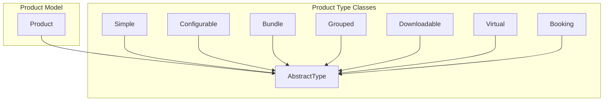
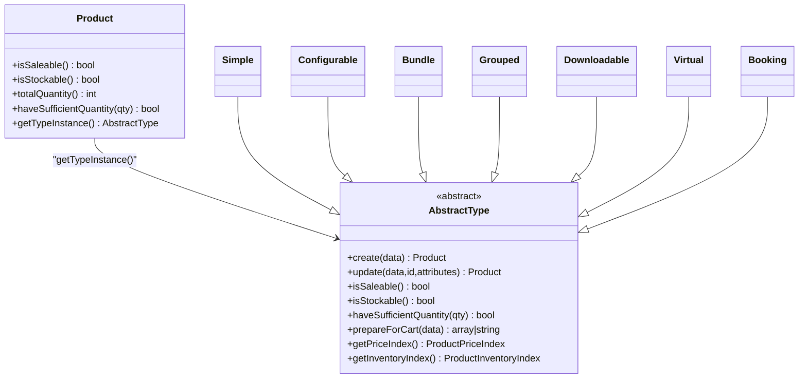
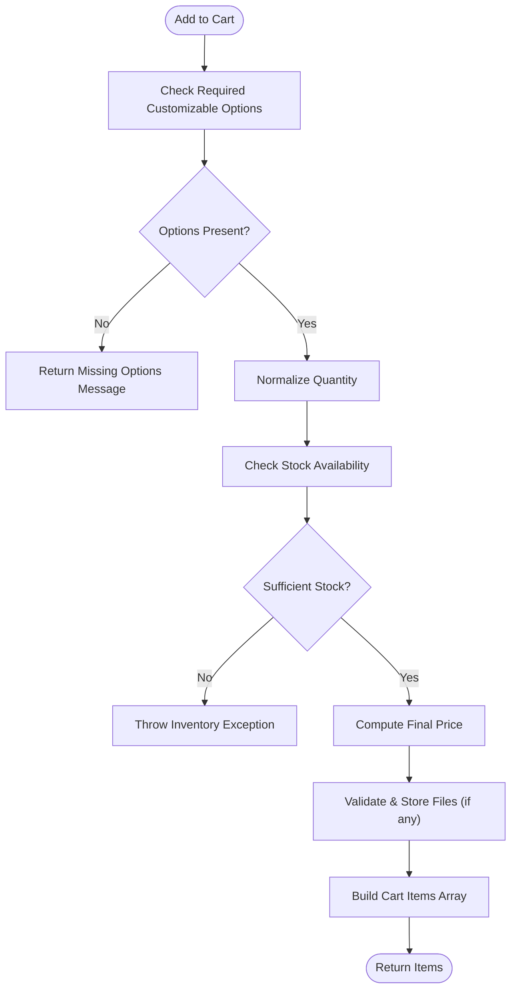
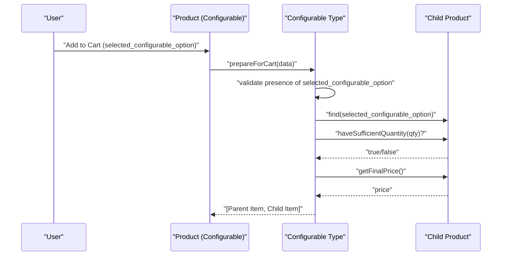
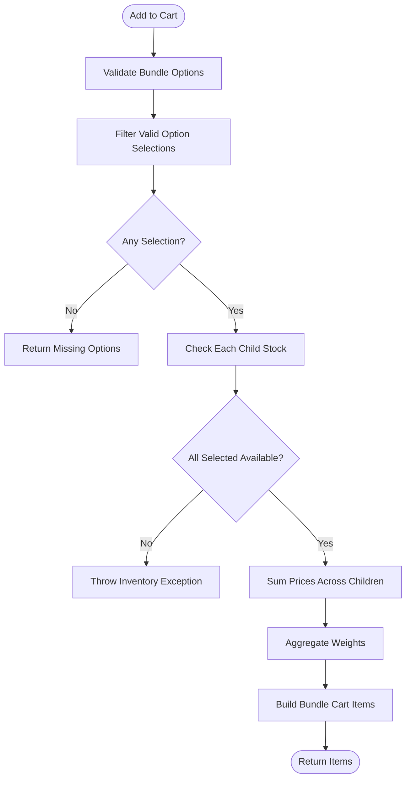
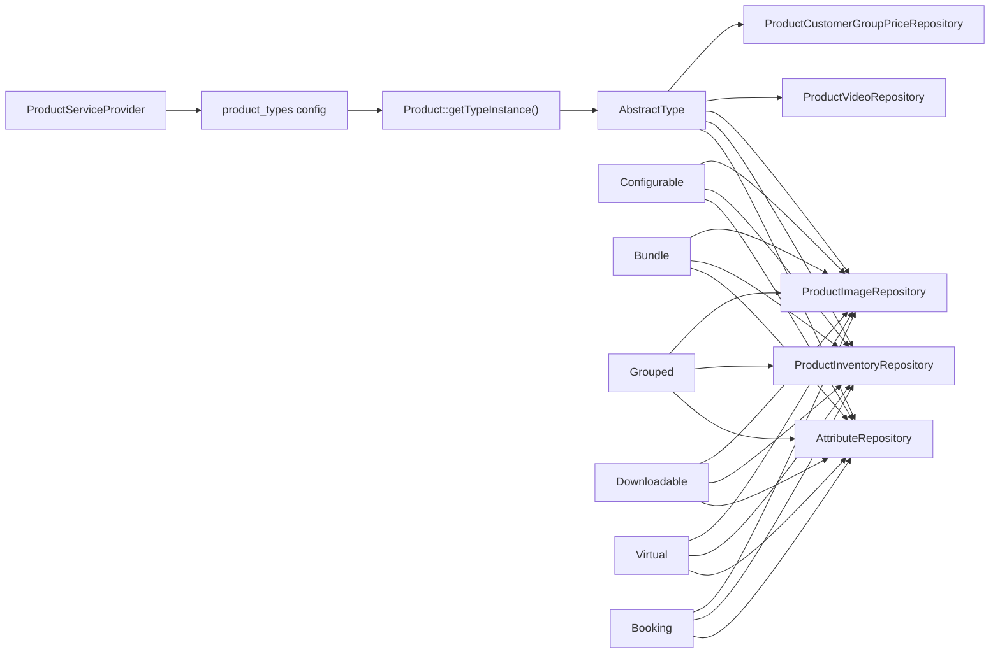

# Product Types and Configuration

<cite>
**Referenced Files in This Document**
- [AbstractType.php](file://packages/Webkul/Product/src/Type/AbstractType.php)
- [Simple.php](file://packages/Webkul/Product/src/Type/Simple.php)
- [Configurable.php](file://packages/Webkul/Product/src/Type/Configurable.php)
- [Bundle.php](file://packages/Webkul/Product/src/Type/Bundle.php)
- [Grouped.php](file://packages/Webkul/Product/src/Type/Grouped.php)
- [Downloadable.php](file://packages/Webkul/Product/src/Type/Downloadable.php)
- [Virtual.php](file://packages/Webkul/Product/src/Type/Virtual.php)
- [Booking.php](file://packages/Webkul/Product/src/Type/Booking.php)
- [Product.php](file://packages/Webkul/Product/src/Models/Product.php)
- [ProductServiceProvider.php](file://packages/Webkul/Product/src/Providers/ProductServiceProvider.php)
</cite>

## Table of Contents
1. [Introduction](#introduction)
2. [Project Structure](#project-structure)
3. [Core Components](#core-components)
4. [Architecture Overview](#architecture-overview)
5. [Detailed Component Analysis](#detailed-component-analysis)
6. [Dependency Analysis](#dependency-analysis)
7. [Performance Considerations](#performance-considerations)
8. [Troubleshooting Guide](#troubleshooting-guide)
9. [Conclusion](#conclusion)
10. [Appendices](#appendices)

## Introduction
This document explains Frooxi’s product type system used in the product catalog. It covers eight product types: Simple, Configurable, Bundle, Grouped, Downloadable, Virtual, Booking, and a placeholder for future types. It details the AbstractType base class, how each product type extends it, configuration and validation rules, business logic differences, and practical workflows for creation, variant management, bundles, and special handling for downloadable/virtual items. The goal is to help developers and administrators select appropriate product types and implement them correctly.

## Project Structure
The product type system is organized around a shared AbstractType base class extended by concrete product type classes. Each type encapsulates product-specific behavior for creation, validation, pricing, inventory, and cart preparation. Product instances delegate to their type-specific handlers via the Product model.

**Diagram sources**
- [AbstractType.php:32-139](file://packages/Webkul/Product/src/Type/AbstractType.php#L32-L139)
- [Simple.php:25](file://packages/Webkul/Product/src/Type/Simple.php#L25)
- [Configurable.php:21](file://packages/Webkul/Product/src/Type/Configurable.php#L21)
- [Bundle.php:23](file://packages/Webkul/Product/src/Type/Bundle.php#L23)
- [Grouped.php:17](file://packages/Webkul/Product/src/Type/Grouped.php#L17)
- [Downloadable.php:21](file://packages/Webkul/Product/src/Type/Downloadable.php#L21)
- [Virtual.php:25](file://packages/Webkul/Product/src/Type/Virtual.php#L25)
- [Booking.php:23](file://packages/Webkul/Product/src/Type/Booking.php#L23)
- [Product.php:353-368](file://packages/Webkul/Product/src/Models/Product.php#L353-L368)

**Section sources**
- [Product.php:353-368](file://packages/Webkul/Product/src/Models/Product.php#L353-L368)
- [ProductServiceProvider.php:48](file://packages/Webkul/Product/src/Providers/ProductServiceProvider.php#L48)

## Core Components
- AbstractType: Defines shared behavior and defaults for all product types, including creation/update hooks, inventory and pricing accessors, saleability checks, and cart preparation scaffolding.
- Concrete Types:
  - Simple: Standard physical product with optional customizable options and stock management.
  - Configurable: Composite product with variants generated from super attributes.
  - Bundle: Composite product grouping multiple simple products with selectable options.
  - Grouped: Composite product linking multiple simple products without variants.
  - Downloadable: Non-physical product with digital links and samples.
  - Virtual: Non-physical product with optional customizable options and no stock.
  - Booking: Composite product with availability-based slots and dynamic pricing.

Key capabilities exposed by AbstractType:
- Creation and update lifecycle
- Attribute editing and skipping
- Price and inventory indexing
- Saleability and quantity checks
- Cart preparation and validation
- Copying with configurable exclusions

**Section sources**
- [AbstractType.php:146-208](file://packages/Webkul/Product/src/Type/AbstractType.php#L146-L208)
- [AbstractType.php:422-489](file://packages/Webkul/Product/src/Type/AbstractType.php#L422-L489)
- [AbstractType.php:609-717](file://packages/Webkul/Product/src/Type/AbstractType.php#L609-L717)
- [AbstractType.php:787-807](file://packages/Webkul/Product/src/Type/AbstractType.php#L787-L807)

## Architecture Overview
The Product model resolves the active product type instance using configuration and delegates all type-specific operations to it. Each type class encapsulates domain logic for its product form.

**Diagram sources**
- [Product.php:305-368](file://packages/Webkul/Product/src/Models/Product.php#L305-L368)
- [AbstractType.php:32-139](file://packages/Webkul/Product/src/Type/AbstractType.php#L32-L139)
- [Simple.php:25](file://packages/Webkul/Product/src/Type/Simple.php#L25)
- [Configurable.php:21](file://packages/Webkul/Product/src/Type/Configurable.php#L21)
- [Bundle.php:23](file://packages/Webkul/Product/src/Type/Bundle.php#L23)
- [Grouped.php:17](file://packages/Webkul/Product/src/Type/Grouped.php#L17)
- [Downloadable.php:21](file://packages/Webkul/Product/src/Type/Downloadable.php#L21)
- [Virtual.php:25](file://packages/Webkul/Product/src/Type/Virtual.php#L25)
- [Booking.php:23](file://packages/Webkul/Product/src/Type/Booking.php#L23)

## Detailed Component Analysis

### AbstractType: Base Behavior and Shared Contracts
- Construction injects repositories for attributes, inventory, media, and customer group pricing.
- Provides create/update flows that persist product, channels, categories, relations, inventories, images, videos, and customer group prices.
- Offers helpers for copying products with configurable exclusions and media duplication.
- Centralized getters for price and inventory indices, saleability, stockability, and quantity checks.
- Cart preparation pipeline handles quantity normalization, stock validation, and price calculation.

Implementation highlights:
- Creation and update: [AbstractType.php:146-208](file://packages/Webkul/Product/src/Type/AbstractType.php#L146-L208)
- Copying logic: [AbstractType.php:230-372](file://packages/Webkul/Product/src/Type/AbstractType.php#L230-L372)
- Pricing and inventory accessors: [AbstractType.php:609-717](file://packages/Webkul/Product/src/Type/AbstractType.php#L609-L717)
- Cart preparation scaffold: [AbstractType.php:787-807](file://packages/Webkul/Product/src/Type/AbstractType.php#L787-L807)

**Section sources**
- [AbstractType.php:146-208](file://packages/Webkul/Product/src/Type/AbstractType.php#L146-L208)
- [AbstractType.php:230-372](file://packages/Webkul/Product/src/Type/AbstractType.php#L230-L372)
- [AbstractType.php:609-717](file://packages/Webkul/Product/src/Type/AbstractType.php#L609-L717)
- [AbstractType.php:787-807](file://packages/Webkul/Product/src/Type/AbstractType.php#L787-L807)

### Simple Product Type
Behavior:
- Stock-managed physical product with optional customizable options.
- Enforces sufficient stock when manage_stock is enabled.
- Supports customizable options with validation and file extension checks.
- Cart preparation validates required options and formats customizable selections.

Key methods and validations:
- Stock check: [Simple.php:152-159](file://packages/Webkul/Product/src/Type/Simple.php#L152-L159)
- Customizable option validation: [Simple.php:353-365](file://packages/Webkul/Product/src/Type/Simple.php#L353-L365)
- Cart preparation and file handling: [Simple.php:189-281](file://packages/Webkul/Product/src/Type/Simple.php#L189-L281)

**Diagram sources**
- [Simple.php:189-281](file://packages/Webkul/Product/src/Type/Simple.php#L189-L281)

**Section sources**
- [Simple.php:152-159](file://packages/Webkul/Product/src/Type/Simple.php#L152-L159)
- [Simple.php:353-365](file://packages/Webkul/Product/src/Type/Simple.php#L353-L365)
- [Simple.php:189-281](file://packages/Webkul/Product/src/Type/Simple.php#L189-L281)

### Configurable Product Type
Behavior:
- Composite product with variants derived from super attributes.
- Generates SKUs and persists variants; supports updating and deleting variants.
- Cart preparation requires a selected child variant; validates stock against the child.
- Provides price range display and configurable-specific cart item metadata.

Key methods and validations:
- Variant generation and persistence: [Configurable.php:197-232](file://packages/Webkul/Product/src/Type/Configurable.php#L197-L232)
- Cart preparation with child selection: [Configurable.php:377-426](file://packages/Webkul/Product/src/Type/Configurable.php#L377-L426)
- Validation rules for variants: [Configurable.php:315-326](file://packages/Webkul/Product/src/Type/Configurable.php#L315-L326)

**Diagram sources**
- [Configurable.php:377-426](file://packages/Webkul/Product/src/Type/Configurable.php#L377-L426)

**Section sources**
- [Configurable.php:197-232](file://packages/Webkul/Product/src/Type/Configurable.php#L197-L232)
- [Configurable.php:377-426](file://packages/Webkul/Product/src/Type/Configurable.php#L377-L426)
- [Configurable.php:315-326](file://packages/Webkul/Product/src/Type/Configurable.php#L315-L326)

### Bundle Product Type
Behavior:
- Composite product composed of multiple simple products grouped by options.
- Validates that only simple products are selected; computes total price across selected items.
- Ensures at least one in-stock option per required group.

Key methods and validations:
- Cart preparation and child aggregation: [Bundle.php:229-297](file://packages/Webkul/Product/src/Type/Bundle.php#L229-L297)
- Option validation and quantities: [Bundle.php:368-470](file://packages/Webkul/Product/src/Type/Bundle.php#L368-L470)
- Validation rules ensuring simple products only: [Bundle.php:570-591](file://packages/Webkul/Product/src/Type/Bundle.php#L570-L591)

**Diagram sources**
- [Bundle.php:229-297](file://packages/Webkul/Product/src/Type/Bundle.php#L229-L297)

**Section sources**
- [Bundle.php:229-297](file://packages/Webkul/Product/src/Type/Bundle.php#L229-L297)
- [Bundle.php:368-470](file://packages/Webkul/Product/src/Type/Bundle.php#L368-L470)
- [Bundle.php:570-591](file://packages/Webkul/Product/src/Type/Bundle.php#L570-L591)

### Grouped Product Type
Behavior:
- Links multiple simple products without variants; user selects quantities per linked product.
- Validates that only simple products are linked and at least one item is selected.

Key methods and validations:
- Cart preparation and aggregation: [Grouped.php:194-235](file://packages/Webkul/Product/src/Type/Grouped.php#L194-L235)
- Validation rules ensuring simple products only: [Grouped.php:252-269](file://packages/Webkul/Product/src/Type/Grouped.php#L252-L269)

**Section sources**
- [Grouped.php:194-235](file://packages/Webkul/Product/src/Type/Grouped.php#L194-L235)
- [Grouped.php:252-269](file://packages/Webkul/Product/src/Type/Grouped.php#L252-L269)

### Downloadable Product Type
Behavior:
- Non-physical product with digital links and samples; stock is disabled.
- Requires at least one downloadable link; adds link prices to cart.

Key methods and validations:
- Saleability depends on presence of links: [Downloadable.php:110-121](file://packages/Webkul/Product/src/Type/Downloadable.php#L110-L121)
- Cart preparation and link pricing: [Downloadable.php:146-169](file://packages/Webkul/Product/src/Type/Downloadable.php#L146-L169)
- Validation rules for links: [Downloadable.php:128-138](file://packages/Webkul/Product/src/Type/Downloadable.php#L128-L138)

**Section sources**
- [Downloadable.php:110-121](file://packages/Webkul/Product/src/Type/Downloadable.php#L110-L121)
- [Downloadable.php:146-169](file://packages/Webkul/Product/src/Type/Downloadable.php#L146-L169)
- [Downloadable.php:128-138](file://packages/Webkul/Product/src/Type/Downloadable.php#L128-L138)

### Virtual Product Type
Behavior:
- Non-physical product with optional customizable options; stock is disabled.
- Similar to Simple but without stock constraints and with customizable options support.

Key methods and validations:
- Stock check bypass: [Virtual.php:177-184](file://packages/Webkul/Product/src/Type/Virtual.php#L177-L184)
- Customizable option validation: [Virtual.php:378-390](file://packages/Webkul/Product/src/Type/Virtual.php#L378-L390)
- Cart preparation and file handling: [Virtual.php:214-306](file://packages/Webkul/Product/src/Type/Virtual.php#L214-L306)

**Section sources**
- [Virtual.php:177-184](file://packages/Webkul/Product/src/Type/Virtual.php#L177-L184)
- [Virtual.php:378-390](file://packages/Webkul/Product/src/Type/Virtual.php#L378-L390)
- [Virtual.php:214-306](file://packages/Webkul/Product/src/Type/Virtual.php#L214-L306)

### Booking Product Type
Behavior:
- Composite product with availability-based slots and dynamic pricing.
- Different handling per booking type (e.g., event tickets, rental hourly slots).
- Validates slot availability and adds type-specific pricing adjustments.

Key methods and validations:
- Slot availability and pricing adjustments: [Booking.php:155-226](file://packages/Webkul/Product/src/Type/Booking.php#L155-L226)
- Validation rules for booking type: [Booking.php:296-310](file://packages/Webkul/Product/src/Type/Booking.php#L296-L310)

**Section sources**
- [Booking.php:155-226](file://packages/Webkul/Product/src/Type/Booking.php#L155-L226)
- [Booking.php:296-310](file://packages/Webkul/Product/src/Type/Booking.php#L296-L310)

## Dependency Analysis
- Product model resolves the type instance via configuration keyed by product type code.
- Each type class depends on repositories for attributes, inventory, media, and customer group pricing.
- Configurable and Bundle types depend on additional repositories for variants, grouped links, and bundle options.
- Booking type integrates with booking-specific repositories and helpers.

**Diagram sources**
- [ProductServiceProvider.php:48](file://packages/Webkul/Product/src/Providers/ProductServiceProvider.php#L48)
- [Product.php:359](file://packages/Webkul/Product/src/Models/Product.php#L359)
- [AbstractType.php:130-139](file://packages/Webkul/Product/src/Type/AbstractType.php#L130-L139)
- [Configurable.php:197-232](file://packages/Webkul/Product/src/Type/Configurable.php#L197-L232)
- [Bundle.php:229-297](file://packages/Webkul/Product/src/Type/Bundle.php#L229-L297)
- [Grouped.php:194-235](file://packages/Webkul/Product/src/Type/Grouped.php#L194-L235)
- [Downloadable.php:146-169](file://packages/Webkul/Product/src/Type/Downloadable.php#L146-L169)
- [Virtual.php:214-306](file://packages/Webkul/Product/src/Type/Virtual.php#L214-L306)
- [Booking.php:155-226](file://packages/Webkul/Product/src/Type/Booking.php#L155-L226)

**Section sources**
- [ProductServiceProvider.php:48](file://packages/Webkul/Product/src/Providers/ProductServiceProvider.php#L48)
- [Product.php:359](file://packages/Webkul/Product/src/Models/Product.php#L359)
- [AbstractType.php:130-139](file://packages/Webkul/Product/src/Type/AbstractType.php#L130-L139)

## Performance Considerations
- Price and inventory indexing: Use the provided indexers and ensure scheduled indexing jobs are active to avoid repeated computation during cart preparation.
- Attribute loading: AbstractType caches attribute lookups by code to reduce repeated queries.
- Media duplication during copy: Ensure storage permissions and disk quotas are adequate for media copies.
- Bundle and Grouped aggregations: Minimize nested loops by pre-filtering valid selections and leveraging repository methods for bulk operations.

## Troubleshooting Guide
Common issues and resolutions:
- Missing options for configurable or bundle products: Ensure required selections are present before adding to cart.
  - See validation paths in [Configurable.php:315-326](file://packages/Webkul/Product/src/Type/Configurable.php#L315-L326) and [Bundle.php:570-591](file://packages/Webkul/Product/src/Type/Bundle.php#L570-L591).
- Insufficient inventory warnings: Verify stock levels and backorder settings; checkout logic throws exceptions when stock is unavailable.
  - See [AbstractType.php:793-795](file://packages/Webkul/Product/src/Type/AbstractType.php#L793-L795) and type-specific checks in [Simple.php:202-204](file://packages/Webkul/Product/src/Type/Simple.php#L202-L204), [Virtual.php:227-229](file://packages/Webkul/Product/src/Type/Virtual.php#L227-L229).
- Invalid file extensions for customizable options: Validate supported extensions and handle uploads accordingly.
  - See [Simple.php:214-228](file://packages/Webkul/Product/src/Type/Simple.php#L214-L228) and [Virtual.php:239-253](file://packages/Webkul/Product/src/Type/Virtual.php#L239-L253).
- Booking slot conflicts: Ensure selected slots are available and match type-specific constraints.
  - See [Booking.php:155-226](file://packages/Webkul/Product/src/Type/Booking.php#L155-L226).

**Section sources**
- [Configurable.php:315-326](file://packages/Webkul/Product/src/Type/Configurable.php#L315-L326)
- [Bundle.php:570-591](file://packages/Webkul/Product/src/Type/Bundle.php#L570-L591)
- [AbstractType.php:793-795](file://packages/Webkul/Product/src/Type/AbstractType.php#L793-L795)
- [Simple.php:202-204](file://packages/Webkul/Product/src/Type/Simple.php#L202-L204)
- [Virtual.php:227-229](file://packages/Webkul/Product/src/Type/Virtual.php#L227-L229)
- [Simple.php:214-228](file://packages/Webkul/Product/src/Type/Simple.php#L214-L228)
- [Virtual.php:239-253](file://packages/Webkul/Product/src/Type/Virtual.php#L239-L253)
- [Booking.php:155-226](file://packages/Webkul/Product/src/Type/Booking.php#L155-L226)

## Conclusion
Frooxi’s product type system leverages a robust AbstractType base class to standardize product lifecycle operations while allowing each product type to specialize behavior for creation, validation, pricing, inventory, and cart preparation. By understanding the distinct characteristics of Simple, Configurable, Bundle, Grouped, Downloadable, Virtual, and Booking types—and their respective validation rules and workflows—teams can confidently configure and extend the product catalog to meet diverse business needs.

## Appendices

### Practical Selection Criteria
- Choose Simple for standard physical goods with optional customization.
- Choose Configurable when products vary by attributes (e.g., size/color) and require variant management.
- Choose Bundle to package multiple simple products with selectable options and quantities.
- Choose Grouped for linking related simple products without variants.
- Choose Downloadable for digital-only products with links and samples.
- Choose Virtual for non-physical items with optional customization and no stock.
- Choose Booking for time-bound or resource-based offerings with availability constraints.

### Implementation Patterns
- Use AbstractType::create/update consistently for standardized persistence.
- Override type-specific validation rules via getTypeValidationRules for stricter checks.
- Leverage indexers for price and inventory calculations to maintain performance.
- For composite types, ensure child product integrity and stock checks before cart addition.