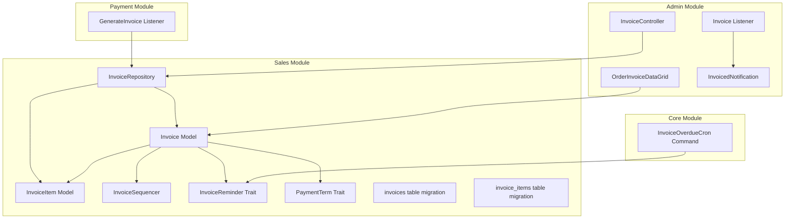
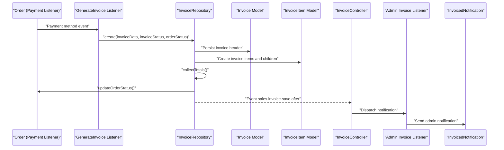
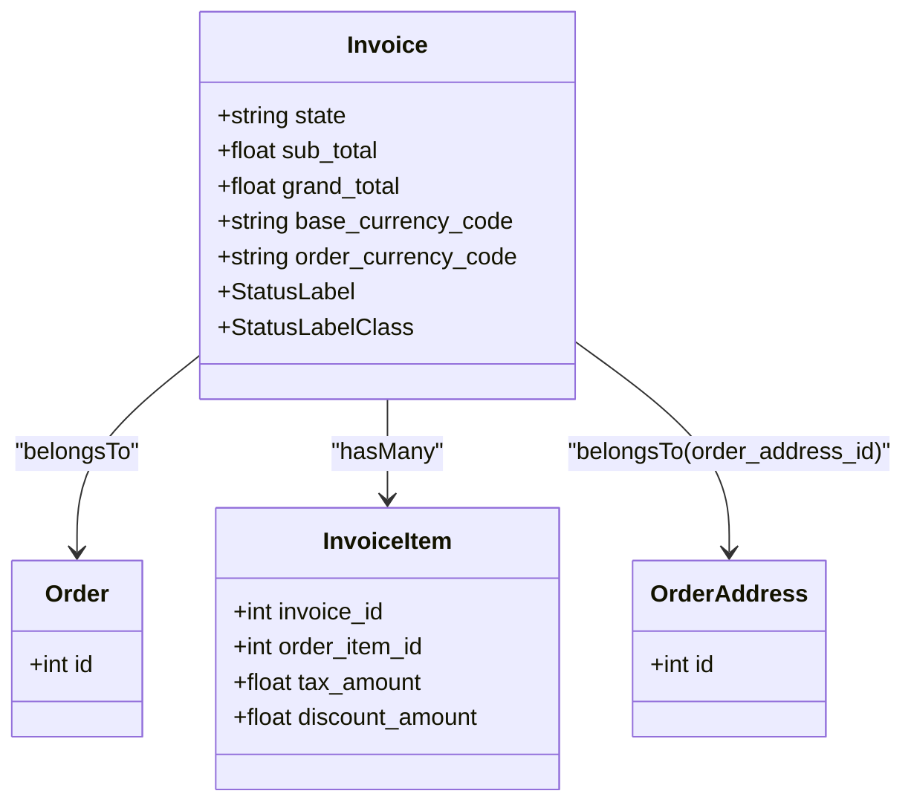
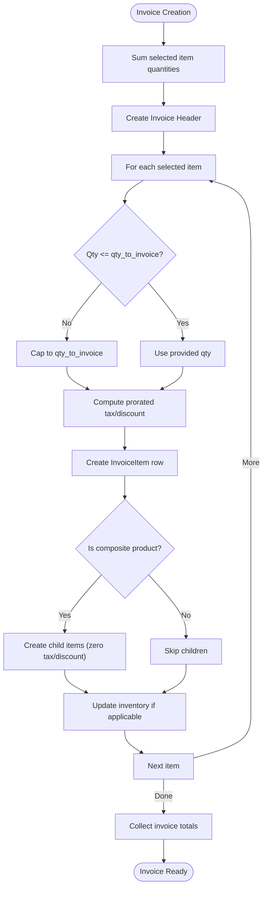
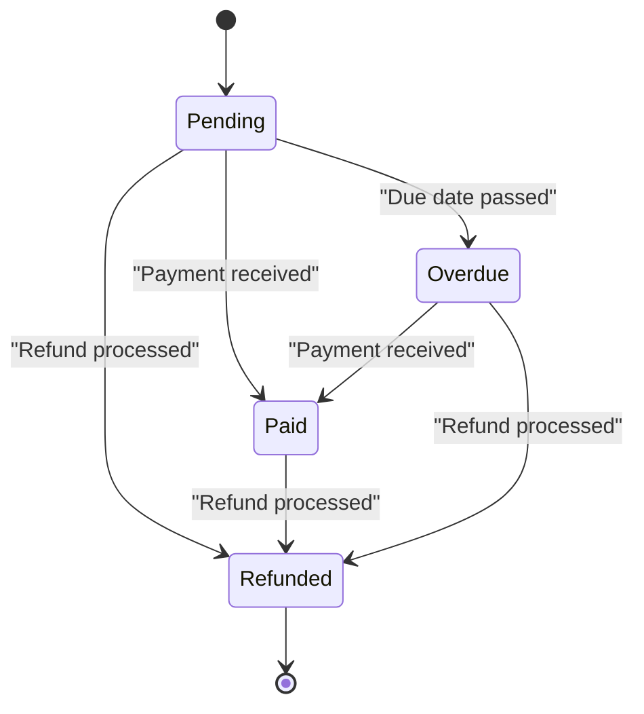
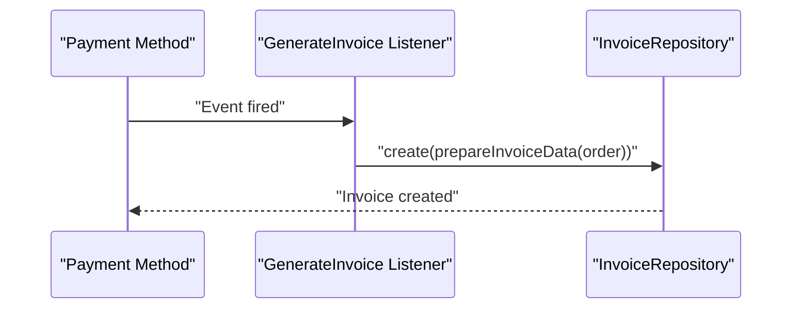
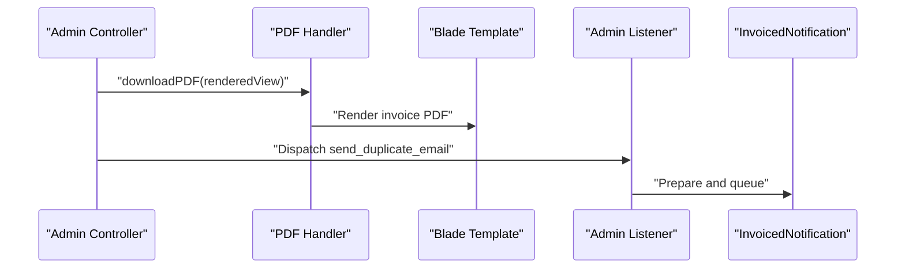
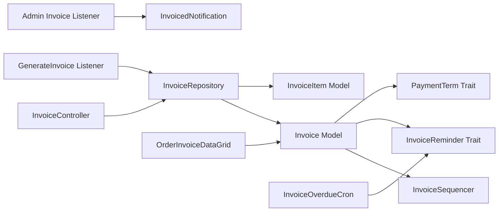

# Invoice Management

<cite>
**Referenced Files in This Document**
- [Invoice.php](file://packages/Webkul/Sales/src/Models/Invoice.php)
- [InvoiceItem.php](file://packages/Webkul/Sales/src/Models/InvoiceItem.php)
- [InvoiceRepository.php](file://packages/Webkul/Sales/src/Repositories/InvoiceRepository.php)
- [InvoiceController.php](file://packages/Webkul/Admin/src/Http/Controllers/Sales/InvoiceController.php)
- [InvoiceSequencer.php](file://packages/Webkul/Sales/src/Generators/InvoiceSequencer.php)
- [InvoiceReminder.php](file://packages/Webkul/Sales/src/Traits/InvoiceReminder.php)
- [PaymentTerm.php](file://packages/Webkul/Sales/src/Traits/PaymentTerm.php)
- [Invoice.php](file://packages/Webkul/Admin/src/Listeners/Invoice.php)
- [InvoiceOverdueCron.php](file://packages/Webkul/Core/src/Console/Commands/InvoiceOverdueCron.php)
- [InvoicedNotification.php](file://packages/Webkul/Admin/src/Mail/Order/InvoicedNotification.php)
- [2018_09_27_115135_create_invoices_table.php](file://packages/Webkul/Sales/src/Database/Migrations/2018_09_27_115135_create_invoices_table.php)
- [2018_09_27_115144_create_invoice_items_table.php](file://packages/Webkul/Sales/src/Database/Migrations/2018_09_27_115144_create_invoice_items_table.php)
- [OrderInvoiceDataGrid.php](file://packages/Webkul/Admin/src/DataGrids/Sales/OrderInvoiceDataGrid.php)
- [GenerateInvoice.php](file://packages/Webkul/Payment/src/Listeners/GenerateInvoice.php)
- [InvoiceSettings Configuration](file://packages/Webkul/Admin/src/Resources/lang/en/app.php)
</cite>

## Table of Contents
1. [Introduction](#introduction)
2. [Project Structure](#project-structure)
3. [Core Components](#core-components)
4. [Architecture Overview](#architecture-overview)
5. [Detailed Component Analysis](#detailed-component-analysis)
6. [Dependency Analysis](#dependency-analysis)
7. [Performance Considerations](#performance-considerations)
8. [Troubleshooting Guide](#troubleshooting-guide)
9. [Conclusion](#conclusion)
10. [Appendices](#appendices)

## Introduction
This document describes the invoice management system in Frooxi’s Bagisto-based platform. It covers invoice creation, lifecycle states, itemization, tax and discount handling, payment terms, automatic invoice generation upon order fulfillment, PDF generation, email notifications, bulk operations, search and filtering, and history tracking. The goal is to provide a clear understanding of how invoices are created, tracked, and managed across orders, while remaining accessible to both technical and non-technical stakeholders.

## Project Structure
The invoice management system spans several modules:
- Sales module: core invoice models, repositories, generators, traits, and migrations
- Admin module: controllers, listeners, datagrids, and email templates
- Payment module: automatic invoice generation based on payment methods
- Core module: scheduled overdue reminders

**Diagram sources**
- [Invoice.php:16-148](file://packages/Webkul/Sales/src/Models/Invoice.php#L16-L148)
- [InvoiceItem.php:16-94](file://packages/Webkul/Sales/src/Models/InvoiceItem.php#L16-L94)
- [InvoiceRepository.php:12-337](file://packages/Webkul/Sales/src/Repositories/InvoiceRepository.php#L12-L337)
- [InvoiceSequencer.php:7-50](file://packages/Webkul/Sales/src/Generators/InvoiceSequencer.php#L7-L50)
- [InvoiceReminder.php:9-97](file://packages/Webkul/Sales/src/Traits/InvoiceReminder.php#L9-L97)
- [PaymentTerm.php:5-45](file://packages/Webkul/Sales/src/Traits/PaymentTerm.php#L5-L45)
- [InvoiceController.php:17-176](file://packages/Webkul/Admin/src/Http/Controllers/Sales/InvoiceController.php#L17-L176)
- [Invoice.php:8-76](file://packages/Webkul/Admin/src/Listeners/Invoice.php#L8-L76)
- [OrderInvoiceDataGrid.php:11-184](file://packages/Webkul/Admin/src/DataGrids/Sales/OrderInvoiceDataGrid.php#L11-L184)
- [InvoicedNotification.php:11-48](file://packages/Webkul/Admin/src/Mail/Order/InvoicedNotification.php#L11-L48)
- [GenerateInvoice.php:11-70](file://packages/Webkul/Payment/src/Listeners/GenerateInvoice.php#L11-L70)
- [InvoiceOverdueCron.php:8-48](file://packages/Webkul/Core/src/Console/Commands/InvoiceOverdueCron.php#L8-L48)
- [2018_09_27_115135_create_invoices_table.php:14-55](file://packages/Webkul/Sales/src/Database/Migrations/2018_09_27_115135_create_invoices_table.php#L14-L55)
- [2018_09_27_115144_create_invoice_items_table.php:14-54](file://packages/Webkul/Sales/src/Database/Migrations/2018_09_27_115144_create_invoice_items_table.php#L14-L54)

**Section sources**
- [Invoice.php:16-148](file://packages/Webkul/Sales/src/Models/Invoice.php#L16-L148)
- [InvoiceItem.php:16-94](file://packages/Webkul/Sales/src/Models/InvoiceItem.php#L16-L94)
- [InvoiceRepository.php:12-337](file://packages/Webkul/Sales/src/Repositories/InvoiceRepository.php#L12-L337)
- [InvoiceController.php:17-176](file://packages/Webkul/Admin/src/Http/Controllers/Sales/InvoiceController.php#L17-L176)
- [InvoiceSequencer.php:7-50](file://packages/Webkul/Sales/src/Generators/InvoiceSequencer.php#L7-L50)
- [InvoiceReminder.php:9-97](file://packages/Webkul/Sales/src/Traits/InvoiceReminder.php#L9-L97)
- [PaymentTerm.php:5-45](file://packages/Webkul/Sales/src/Traits/PaymentTerm.php#L5-L45)
- [Invoice.php:8-76](file://packages/Webkul/Admin/src/Listeners/Invoice.php#L8-L76)
- [InvoiceOverdueCron.php:8-48](file://packages/Webkul/Core/src/Console/Commands/InvoiceOverdueCron.php#L8-L48)
- [InvoicedNotification.php:11-48](file://packages/Webkul/Admin/src/Mail/Order/InvoicedNotification.php#L11-L48)
- [2018_09_27_115135_create_invoices_table.php:14-55](file://packages/Webkul/Sales/src/Database/Migrations/2018_09_27_115135_create_invoices_table.php#L14-L55)
- [2018_09_27_115144_create_invoice_items_table.php:14-54](file://packages/Webkul/Sales/src/Database/Migrations/2018_09_27_115144_create_invoice_items_table.php#L14-L54)
- [OrderInvoiceDataGrid.php:11-184](file://packages/Webkul/Admin/src/DataGrids/Sales/OrderInvoiceDataGrid.php#L11-L184)
- [GenerateInvoice.php:11-70](file://packages/Webkul/Payment/src/Listeners/GenerateInvoice.php#L11-L70)

## Core Components
- Invoice model encapsulates invoice lifecycle states, currency codes, totals, and relationships to orders, items, addresses, and channels.
- InvoiceItem model captures per-item details, tax, discounts, and parent-child relationships for bundled/composite products.
- InvoiceRepository orchestrates invoice creation, itemization, totals computation, order state updates, and inventory adjustments.
- InvoiceController exposes admin endpoints for listing, creating, viewing, printing, emailing duplicates, and bulk state updates.
- InvoiceSequencer generates human-readable invoice identifiers based on configuration.
- InvoiceReminder trait manages overdue reminders and scheduling.
- PaymentTerm trait computes formatted due dates based on configuration.
- Admin listener sends notifications and optionally creates transactions after invoice creation.
- Payment module listeners automatically generate invoices for supported payment methods.
- Core cron job triggers overdue reminders for eligible invoices.
- DataGrid provides search, filter, sort, and mass update capabilities for invoices.

**Section sources**
- [Invoice.php:16-148](file://packages/Webkul/Sales/src/Models/Invoice.php#L16-L148)
- [InvoiceItem.php:16-94](file://packages/Webkul/Sales/src/Models/InvoiceItem.php#L16-L94)
- [InvoiceRepository.php:12-337](file://packages/Webkul/Sales/src/Repositories/InvoiceRepository.php#L12-L337)
- [InvoiceController.php:17-176](file://packages/Webkul/Admin/src/Http/Controllers/Sales/InvoiceController.php#L17-L176)
- [InvoiceSequencer.php:7-50](file://packages/Webkul/Sales/src/Generators/InvoiceSequencer.php#L7-L50)
- [InvoiceReminder.php:9-97](file://packages/Webkul/Sales/src/Traits/InvoiceReminder.php#L9-L97)
- [PaymentTerm.php:5-45](file://packages/Webkul/Sales/src/Traits/PaymentTerm.php#L5-L45)
- [Invoice.php:8-76](file://packages/Webkul/Admin/src/Listeners/Invoice.php#L8-L76)
- [GenerateInvoice.php:11-70](file://packages/Webkul/Payment/src/Listeners/GenerateInvoice.php#L11-L70)
- [InvoiceOverdueCron.php:8-48](file://packages/Webkul/Core/src/Console/Commands/InvoiceOverdueCron.php#L8-L48)
- [OrderInvoiceDataGrid.php:11-184](file://packages/Webkul/Admin/src/DataGrids/Sales/OrderInvoiceDataGrid.php#L11-L184)

## Architecture Overview
The invoice lifecycle integrates order events, payment method logic, and administrative controls.

**Diagram sources**
- [GenerateInvoice.php:29-52](file://packages/Webkul/Payment/src/Listeners/GenerateInvoice.php#L29-L52)
- [InvoiceRepository.php:44-194](file://packages/Webkul/Sales/src/Repositories/InvoiceRepository.php#L44-L194)
- [Invoice.php:25-32](file://packages/Webkul/Admin/src/Listeners/Invoice.php#L25-L32)
- [InvoicedNotification.php:23-46](file://packages/Webkul/Admin/src/Mail/Order/InvoicedNotification.php#L23-L46)

## Detailed Component Analysis

### Invoice Model and States
- States include pending, pending_payment, paid, overdue, and refunded. Each state has a label and CSS class for UI rendering.
- Relationships:
  - Belongs to Order via order_id
  - Has many InvoiceItems (excluding children)
  - Morphs to customer/channel
  - Associated billing address via order_address_id
- Totals and currency fields are maintained for base and order currencies.

**Diagram sources**
- [Invoice.php:16-148](file://packages/Webkul/Sales/src/Models/Invoice.php#L16-L148)
- [InvoiceItem.php:16-94](file://packages/Webkul/Sales/src/Models/InvoiceItem.php#L16-L94)

**Section sources**
- [Invoice.php:20-96](file://packages/Webkul/Sales/src/Models/Invoice.php#L20-L96)
- [2018_09_27_115135_create_invoices_table.php:16-42](file://packages/Webkul/Sales/src/Database/Migrations/2018_09_27_115135_create_invoices_table.php#L16-L42)

### Invoice Itemization and Taxes
- Each invoice item mirrors order item pricing, SKU, and name.
- Tax and discount amounts are prorated based on invoiced quantity vs. ordered quantity.
- Composite products create child invoice items with zero tax/discount for bundled components.
- Inventory updates occur for non-stockable, quantity-showing products during invoice creation.

**Diagram sources**
- [InvoiceRepository.php:72-167](file://packages/Webkul/Sales/src/Repositories/InvoiceRepository.php#L72-L167)
- [InvoiceItem.php:40-76](file://packages/Webkul/Sales/src/Models/InvoiceItem.php#L40-L76)

**Section sources**
- [InvoiceRepository.php:72-167](file://packages/Webkul/Sales/src/Repositories/InvoiceRepository.php#L72-L167)
- [InvoiceItem.php:33-84](file://packages/Webkul/Sales/src/Models/InvoiceItem.php#L33-L84)

### Invoice Lifecycle and Status Tracking
- Creation: Admin UI or Payment Listener invokes repository create with optional invoice/order states.
- Totals: collectTotals aggregates item totals, shipping, taxes, and discounts; ensures shipping tax is not duplicated across invoices.
- State transitions: updateState sets state; mass update endpoint supports bulk changes.
- History: DataGrid displays invoice ID, order ID, grand total, status, and invoice date with filters and sorting.

**Diagram sources**
- [Invoice.php:21-44](file://packages/Webkul/Sales/src/Models/Invoice.php#L21-L44)
- [InvoiceRepository.php:321-327](file://packages/Webkul/Sales/src/Repositories/InvoiceRepository.php#L321-L327)
- [OrderInvoiceDataGrid.php:77-124](file://packages/Webkul/Admin/src/DataGrids/Sales/OrderInvoiceDataGrid.php#L77-L124)

**Section sources**
- [Invoice.php:21-96](file://packages/Webkul/Sales/src/Models/Invoice.php#L21-L96)
- [InvoiceRepository.php:321-337](file://packages/Webkul/Sales/src/Repositories/InvoiceRepository.php#L321-L337)
- [OrderInvoiceDataGrid.php:77-135](file://packages/Webkul/Admin/src/DataGrids/Sales/OrderInvoiceDataGrid.php#L77-L135)

### Automatic Invoice Generation During Order Fulfillment
- Payment listeners inspect payment method configuration and generate invoices accordingly.
- Data prepared includes order_id and per-item quantities from order items.

**Diagram sources**
- [GenerateInvoice.php:29-52](file://packages/Webkul/Payment/src/Listeners/GenerateInvoice.php#L29-L52)
- [InvoiceRepository.php:44-95](file://packages/Webkul/Sales/src/Repositories/InvoiceRepository.php#L44-L95)

**Section sources**
- [GenerateInvoice.php:29-68](file://packages/Webkul/Payment/src/Listeners/GenerateInvoice.php#L29-L68)

### Payment Terms and Due Dates
- Payment term is configured in settings and exposed via a trait method.
- DataGrid augments status display with days left/days overdue computed from invoice creation date plus due duration.

**Section sources**
- [PaymentTerm.php:12-43](file://packages/Webkul/Sales/src/Traits/PaymentTerm.php#L12-L43)
- [OrderInvoiceDataGrid.php:85-124](file://packages/Webkul/Admin/src/DataGrids/Sales/OrderInvoiceDataGrid.php#L85-L124)
- [InvoiceSettings Configuration:4873-4892](file://packages/Webkul/Admin/src/Resources/lang/en/app.php#L4873-L4892)

### Invoice Templates, PDF Generation, and Email Notifications
- PDF: Admin controller renders a PDF using a Blade template and downloads it with a filename derived from invoice creation date.
- Email: Admin listener dispatches an admin notification email upon invoice creation.
- Duplicate email: Admin controller allows sending a duplicate invoice to a specified email address.

**Diagram sources**
- [InvoiceController.php:142-152](file://packages/Webkul/Admin/src/Http/Controllers/Sales/InvoiceController.php#L142-L152)
- [Invoice.php:40-51](file://packages/Webkul/Admin/src/Listeners/Invoice.php#L40-L51)
- [InvoicedNotification.php:23-46](file://packages/Webkul/Admin/src/Mail/Order/InvoicedNotification.php#L23-L46)

**Section sources**
- [InvoiceController.php:142-152](file://packages/Webkul/Admin/src/Http/Controllers/Sales/InvoiceController.php#L142-L152)
- [Invoice.php:40-51](file://packages/Webkul/Admin/src/Listeners/Invoice.php#L40-L51)
- [InvoicedNotification.php:23-46](file://packages/Webkul/Admin/src/Mail/Order/InvoicedNotification.php#L23-L46)

### Bulk Operations, Search, Filtering, and History
- Bulk state update: Admin controller accepts selected invoice IDs and updates state in batch.
- DataGrid: Provides columns for ID, order ID, grand total, status, and invoice date with filters and sortable columns.
- Actions: View action navigates to invoice details.

**Section sources**
- [InvoiceController.php:159-174](file://packages/Webkul/Admin/src/Http/Controllers/Sales/InvoiceController.php#L159-L174)
- [OrderInvoiceDataGrid.php:18-184](file://packages/Webkul/Admin/src/DataGrids/Sales/OrderInvoiceDataGrid.php#L18-L184)

### Overdue Invoices and Reminders
- Overdue reminders are governed by configuration limits and intervals.
- Cron command queries overdue invoices within reminder limits and sends reminders, updating next reminder date and counter.

**Section sources**
- [InvoiceReminder.php:16-95](file://packages/Webkul/Sales/src/Traits/InvoiceReminder.php#L16-L95)
- [InvoiceOverdueCron.php:39-46](file://packages/Webkul/Core/src/Console/Commands/InvoiceOverdueCron.php#L39-L46)

## Dependency Analysis
- Controllers depend on repositories for persistence and on traits for formatting and reminders.
- Repositories depend on models, factories, and sequencers; orchestrate order and inventory updates.
- Listeners depend on email infrastructure and transaction repositories.
- DataGrids depend on invoices and orders for reporting.

**Diagram sources**
- [InvoiceController.php:17-176](file://packages/Webkul/Admin/src/Http/Controllers/Sales/InvoiceController.php#L17-L176)
- [InvoiceRepository.php:12-337](file://packages/Webkul/Sales/src/Repositories/InvoiceRepository.php#L12-L337)
- [Invoice.php:16-148](file://packages/Webkul/Sales/src/Models/Invoice.php#L16-L148)
- [InvoiceSequencer.php:7-50](file://packages/Webkul/Sales/src/Generators/InvoiceSequencer.php#L7-L50)
- [InvoiceReminder.php:9-97](file://packages/Webkul/Sales/src/Traits/InvoiceReminder.php#L9-L97)
- [PaymentTerm.php:5-45](file://packages/Webkul/Sales/src/Traits/PaymentTerm.php#L5-L45)
- [Invoice.php:8-76](file://packages/Webkul/Admin/src/Listeners/Invoice.php#L8-L76)
- [InvoicedNotification.php:11-48](file://packages/Webkul/Admin/src/Mail/Order/InvoicedNotification.php#L11-L48)
- [GenerateInvoice.php:11-70](file://packages/Webkul/Payment/src/Listeners/GenerateInvoice.php#L11-L70)
- [InvoiceOverdueCron.php:8-48](file://packages/Webkul/Core/src/Console/Commands/InvoiceOverdueCron.php#L8-L48)
- [OrderInvoiceDataGrid.php:11-184](file://packages/Webkul/Admin/src/DataGrids/Sales/OrderInvoiceDataGrid.php#L11-L184)

**Section sources**
- [InvoiceController.php:17-176](file://packages/Webkul/Admin/src/Http/Controllers/Sales/InvoiceController.php#L17-L176)
- [InvoiceRepository.php:12-337](file://packages/Webkul/Sales/src/Repositories/InvoiceRepository.php#L12-L337)
- [Invoice.php:16-148](file://packages/Webkul/Sales/src/Models/Invoice.php#L16-L148)
- [Invoice.php:8-76](file://packages/Webkul/Admin/src/Listeners/Invoice.php#L8-L76)
- [GenerateInvoice.php:11-70](file://packages/Webkul/Payment/src/Listeners/GenerateInvoice.php#L11-L70)
- [InvoiceOverdueCron.php:8-48](file://packages/Webkul/Core/src/Console/Commands/InvoiceOverdueCron.php#L8-L48)
- [OrderInvoiceDataGrid.php:11-184](file://packages/Webkul/Admin/src/DataGrids/Sales/OrderInvoiceDataGrid.php#L11-L184)

## Performance Considerations
- Totals aggregation loops through items; ensure minimal item counts per invoice to reduce compute overhead.
- Composite product handling creates child items; limit deeply nested bundles to reduce database writes.
- Bulk operations (mass update) process records server-side; use pagination and appropriate filters to avoid large payloads.
- PDF generation renders Blade views; keep templates lightweight and avoid heavy computations inside views.

## Troubleshooting Guide
- Invoice creation errors:
  - Ensure the order can generate invoices and that item quantities are valid and non-negative.
  - Validate that at least one item has a positive quantity.
- Payment method not generating invoice:
  - Confirm payment method configuration flags and statuses are enabled.
- Overdue reminders not sent:
  - Verify reminder limits and intervals in configuration.
  - Ensure the cron job runs and that invoices meet the overdue and reminder criteria.
- Email notifications not received:
  - Check admin notification email settings and listener logic.

**Section sources**
- [InvoiceController.php:66-100](file://packages/Webkul/Admin/src/Http/Controllers/Sales/InvoiceController.php#L66-L100)
- [InvoiceRepository.php:199-224](file://packages/Webkul/Sales/src/Repositories/InvoiceRepository.php#L199-L224)
- [GenerateInvoice.php:29-52](file://packages/Webkul/Payment/src/Listeners/GenerateInvoice.php#L29-L52)
- [InvoiceReminder.php:16-95](file://packages/Webkul/Sales/src/Traits/InvoiceReminder.php#L16-L95)
- [Invoice.php:40-51](file://packages/Webkul/Admin/src/Listeners/Invoice.php#L40-L51)

## Conclusion
Frooxi’s invoice management system integrates order events, payment method logic, and administrative controls to support robust invoice creation, lifecycle tracking, and reporting. With configurable numbering, payment terms, reminders, and automated generation, the system provides flexibility for varied business needs while maintaining strong separation of concerns across modules.

## Appendices

### Database Schema Highlights
- Invoices table stores header-level data including state, currency codes, totals, and reminder metadata.
- Invoice items table stores per-item details, taxes, discounts, and parent-child relationships for composite products.

**Section sources**
- [2018_09_27_115135_create_invoices_table.php:16-42](file://packages/Webkul/Sales/src/Database/Migrations/2018_09_27_115135_create_invoices_table.php#L16-L42)
- [2018_09_27_115144_create_invoice_items_table.php:16-41](file://packages/Webkul/Sales/src/Database/Migrations/2018_09_27_115144_create_invoice_items_table.php#L16-L41)