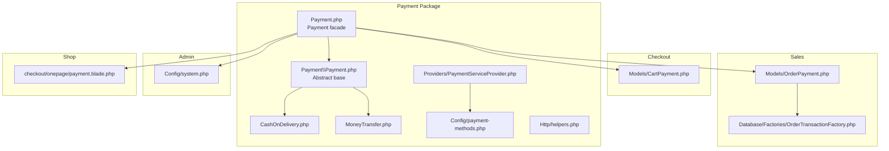
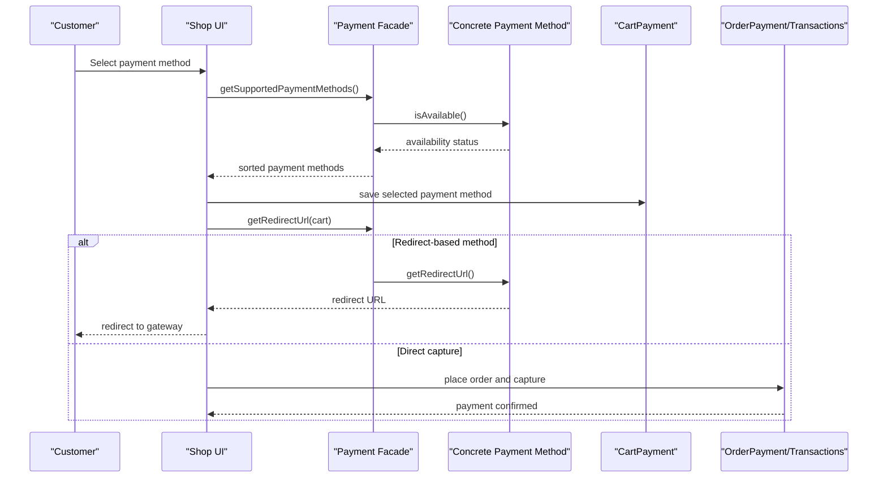
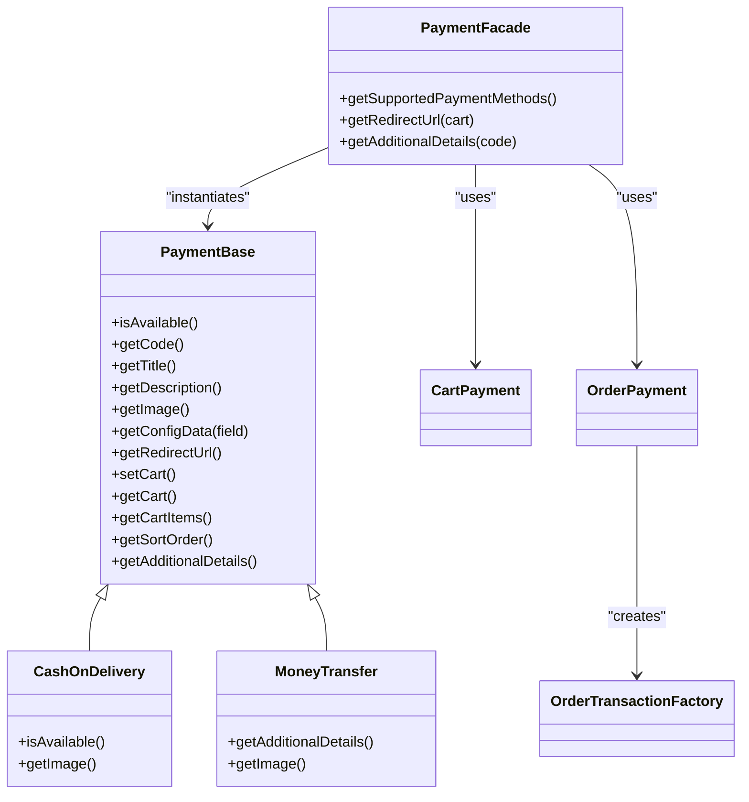

# Payment Integration

<cite>
**Referenced Files in This Document**
- [Payment.php](file://packages/Webkul/Payment/src/Payment.php)
- [Payment.php](file://packages/Webkul/Payment/src/Payment/Payment.php)
- [CashOnDelivery.php](file://packages/Webkul/Payment/src/Payment/CashOnDelivery.php)
- [MoneyTransfer.php](file://packages/Webkul/Payment/src/Payment/MoneyTransfer.php)
- [payment-methods.php](file://packages/Webkul/Payment/src/Config/payment-methods.php)
- [PaymentServiceProvider.php](file://packages/Webkul/Payment/src/Providers/PaymentServiceProvider.php)
- [helpers.php](file://packages/Webkul/Payment/src/Http/helpers.php)
- [CartPayment.php](file://packages/Webkul/Checkout/src/Models/CartPayment.php)
- [OrderPayment.php](file://packages/Webkul/Sales/src/Models/OrderPayment.php)
- [OrderTransactionFactory.php](file://packages/Webkul/Sales/src/Database/Factories/OrderTransactionFactory.php)
- [InvoiceOverdueCron.php](file://packages/Webkul/Core/src/Console/Commands/InvoiceOverdueCron.php)
- [system.php](file://packages/Webkul/Admin/src/Config/system.php)
- [payment.blade.php](file://packages/Webkul/Shop/src/Resources/views/checkout/onepage/payment.blade.php)
- [CheckoutTest.php](file://packages/Webkul/Shop/tests/Feature/Checkout/CheckoutTest.php)
</cite>

## Table of Contents
1. [Introduction](#introduction)
2. [Project Structure](#project-structure)
3. [Core Components](#core-components)
4. [Architecture Overview](#architecture-overview)
5. [Detailed Component Analysis](#detailed-component-analysis)
6. [Dependency Analysis](#dependency-analysis)
7. [Performance Considerations](#performance-considerations)
8. [Troubleshooting Guide](#troubleshooting-guide)
9. [Conclusion](#conclusion)
10. [Appendices](#appendices)

## Introduction
This document describes the payment integration system in Frooxi’s e-commerce platform. It explains supported payment methods, gateway configurations, and transaction processing flows. It also covers payment method selection, payment capture workflows, settlement procedures, order-to-payment linkage, transaction recording, reconciliation, failure handling, retries, manual interventions, multi-currency considerations, customization, third-party gateway integration hooks, security and PCI compliance considerations, fraud prevention, reminders, overdue handling, and dispute resolution.

## Project Structure
The payment system is implemented as a modular package with a base payment abstraction, concrete payment method implementations, configuration, service provider registration, and integration points with checkout and sales modules.

**Diagram sources**
- [Payment.php:1-82](file://packages/Webkul/Payment/src/Payment.php#L1-L82)
- [Payment.php:1-156](file://packages/Webkul/Payment/src/Payment/Payment.php#L1-L156)
- [CashOnDelivery.php:1-49](file://packages/Webkul/Payment/src/Payment/CashOnDelivery.php#L1-L49)
- [MoneyTransfer.php:1-52](file://packages/Webkul/Payment/src/Payment/MoneyTransfer.php#L1-L52)
- [payment-methods.php:1-27](file://packages/Webkul/Payment/src/Config/payment-methods.php#L1-L27)
- [PaymentServiceProvider.php:1-43](file://packages/Webkul/Payment/src/Providers/PaymentServiceProvider.php#L1-L43)
- [helpers.php](file://packages/Webkul/Payment/src/Http/helpers.php)
- [CartPayment.php:1-25](file://packages/Webkul/Checkout/src/Models/CartPayment.php#L1-L25)
- [OrderPayment.php:1-35](file://packages/Webkul/Sales/src/Models/OrderPayment.php#L1-L35)
- [OrderTransactionFactory.php:1-29](file://packages/Webkul/Sales/src/Database/Factories/OrderTransactionFactory.php#L1-L29)
- [system.php](file://packages/Webkul/Admin/src/Config/system.php)
- [payment.blade.php](file://packages/Webkul/Shop/src/Resources/views/checkout/onepage/payment.blade.php)

**Section sources**
- [Payment.php:1-82](file://packages/Webkul/Payment/src/Payment.php#L1-L82)
- [Payment.php:1-156](file://packages/Webkul/Payment/src/Payment/Payment.php#L1-L156)
- [CashOnDelivery.php:1-49](file://packages/Webkul/Payment/src/Payment/CashOnDelivery.php#L1-L49)
- [MoneyTransfer.php:1-52](file://packages/Webkul/Payment/src/Payment/MoneyTransfer.php#L1-L52)
- [payment-methods.php:1-27](file://packages/Webkul/Payment/src/Config/payment-methods.php#L1-L27)
- [PaymentServiceProvider.php:1-43](file://packages/Webkul/Payment/src/Providers/PaymentServiceProvider.php#L1-L43)
- [helpers.php](file://packages/Webkul/Payment/src/Http/helpers.php)
- [CartPayment.php:1-25](file://packages/Webkul/Checkout/src/Models/CartPayment.php#L1-L25)
- [OrderPayment.php:1-35](file://packages/Webkul/Sales/src/Models/OrderPayment.php#L1-L35)
- [OrderTransactionFactory.php:1-29](file://packages/Webkul/Sales/src/Database/Factories/OrderTransactionFactory.php#L1-L29)
- [system.php](file://packages/Webkul/Admin/src/Config/system.php)
- [payment.blade.php](file://packages/Webkul/Shop/src/Resources/views/checkout/onepage/payment.blade.php)

## Core Components
- Payment facade: Provides discovery and retrieval of available payment methods, redirect URLs, and additional payment details.
- Abstract payment base: Defines common behavior, configuration access, cart integration, and abstract redirect URL method.
- Concrete payment methods: Cash On Delivery and Money Transfer implementations.
- Configuration: Declares built-in payment methods and their metadata.
- Service provider: Registers configuration and events.
- Checkout integration: Cart payment model stores selected payment method during checkout.
- Sales integration: Order payment and transaction models record captured payments and statuses.
- Admin configuration: System configuration fields for enabling and configuring payment methods.
- Frontend view: One-page checkout payment selection UI.

Key responsibilities:
- Payment method availability and ordering
- Redirect URL retrieval for methods requiring external gateways
- Additional payment details rendering (e.g., instructions, mailing address)
- Cart-to-order payment linkage via checkout and sales models

**Section sources**
- [Payment.php:15-80](file://packages/Webkul/Payment/src/Payment.php#L15-L80)
- [Payment.php:22-154](file://packages/Webkul/Payment/src/Payment/Payment.php#L22-L154)
- [CashOnDelivery.php:28-47](file://packages/Webkul/Payment/src/Payment/CashOnDelivery.php#L28-L47)
- [MoneyTransfer.php:28-50](file://packages/Webkul/Payment/src/Payment/MoneyTransfer.php#L28-L50)
- [payment-methods.php:6-26](file://packages/Webkul/Payment/src/Config/payment-methods.php#L6-L26)
- [PaymentServiceProvider.php:26-41](file://packages/Webkul/Payment/src/Providers/PaymentServiceProvider.php#L26-L41)
- [CartPayment.php:11-24](file://packages/Webkul/Checkout/src/Models/CartPayment.php#L11-L24)
- [OrderPayment.php:11-35](file://packages/Webkul/Sales/src/Models/OrderPayment.php#L11-L35)
- [system.php](file://packages/Webkul/Admin/src/Config/system.php)

## Architecture Overview
The payment system follows a modular, extensible architecture:
- Payment facade aggregates configured payment methods and exposes them to the UI and checkout flow.
- Each payment method extends a shared base class, implementing required behaviors (availability, redirect URL, details).
- Configuration defines method metadata and activation flags.
- Checkout persists the chosen payment method in the cart.
- Sales records the payment against the order and creates transactions for settlement.
- Admin configuration controls method-specific settings and UI presentation.

**Diagram sources**
- [Payment.php:15-80](file://packages/Webkul/Payment/src/Payment.php#L15-L80)
- [Payment.php:22-154](file://packages/Webkul/Payment/src/Payment/Payment.php#L22-L154)
- [CashOnDelivery.php:28-47](file://packages/Webkul/Payment/src/Payment/CashOnDelivery.php#L28-L47)
- [MoneyTransfer.php:28-50](file://packages/Webkul/Payment/src/Payment/MoneyTransfer.php#L28-L50)
- [CartPayment.php:11-24](file://packages/Webkul/Checkout/src/Models/CartPayment.php#L11-L24)
- [OrderPayment.php:11-35](file://packages/Webkul/Sales/src/Models/OrderPayment.php#L11-L35)

## Detailed Component Analysis

### Payment Facade
Responsibilities:
- Enumerate supported payment methods from configuration.
- Sort methods by configured order.
- Resolve a payment method’s redirect URL for checkout redirection.
- Fetch additional payment details for display.

Behavior highlights:
- Uses configuration-driven method registry to instantiate concrete classes.
- Filters methods by availability before exposing to UI.
- Delegates redirect URL retrieval to the selected method.

**Section sources**
- [Payment.php:15-80](file://packages/Webkul/Payment/src/Payment.php#L15-L80)

### Abstract Payment Base
Responsibilities:
- Provide configuration accessors for title, description, image, sort order, and instructions.
- Manage cart context for methods that depend on cart state.
- Define abstract redirect URL method for gateway-based methods.
- Offer additional details extraction for UI rendering.

Key methods:
- Availability check via configuration flag.
- Cart retrieval and item enumeration for gateway integrations.
- Sorting and presentation metadata accessors.

**Section sources**
- [Payment.php:22-154](file://packages/Webkul/Payment/src/Payment/Payment.php#L22-L154)

### Cash On Delivery Implementation
Capabilities:
- Conditional availability based on cart stockability.
- Image resolution with fallback asset.
- No redirect URL for direct capture scenarios.

Integration:
- Used in checkout when selected; does not require external gateway redirection.

**Section sources**
- [CashOnDelivery.php:28-47](file://packages/Webkul/Payment/src/Payment/CashOnDelivery.php#L28-L47)

### Money Transfer Implementation
Capabilities:
- Additional details include mailing address for bank transfer instructions.
- Image resolution with fallback asset.
- No redirect URL for direct capture scenarios.

Integration:
- Used in checkout when selected; provides payer instructions via additional details.

**Section sources**
- [MoneyTransfer.php:28-50](file://packages/Webkul/Payment/src/Payment/MoneyTransfer.php#L28-L50)

### Payment Method Configuration
Structure:
- Registry of payment methods with class, code, title, description, activation flag, invoice generation flag, and sort order.
- Built-in methods include Cash On Delivery and Money Transfer.

Extensibility:
- New methods can be added by registering a class and metadata in the configuration.

**Section sources**
- [payment-methods.php:6-26](file://packages/Webkul/Payment/src/Config/payment-methods.php#L6-L26)

### Service Provider Registration
Responsibilities:
- Merge payment method configuration into the application.
- Register event service provider.
- Load HTTP helpers.

Impact:
- Ensures configuration is available at runtime and payment methods are discoverable.

**Section sources**
- [PaymentServiceProvider.php:26-41](file://packages/Webkul/Payment/src/Providers/PaymentServiceProvider.php#L26-L41)
- [helpers.php](file://packages/Webkul/Payment/src/Http/helpers.php)

### Checkout Integration (Cart Payment)
Purpose:
- Persist the selected payment method during checkout for later order creation.

Schema:
- Eloquent model representing the cart payment record.

Usage:
- After selection, the cart payment record holds the chosen method code for order creation.

**Section sources**
- [CartPayment.php:11-24](file://packages/Webkul/Checkout/src/Models/CartPayment.php#L11-L24)

### Sales Integration (Order Payment and Transactions)
Purpose:
- Record payment against the order and track transaction outcomes.

Models:
- OrderPayment: Stores payment metadata linked to an order.
- OrderTransactionFactory: Generates default transaction entries with type and status.

Workflow:
- During checkout completion, an order is created with associated payment and transactions reflecting the outcome (e.g., paid).

**Section sources**
- [OrderPayment.php:11-35](file://packages/Webkul/Sales/src/Models/OrderPayment.php#L11-L35)
- [OrderTransactionFactory.php:20-28](file://packages/Webkul/Sales/src/Database/Factories/OrderTransactionFactory.php#L20-L28)

### Admin Configuration Fields
Scope:
- Per-method fields for enabling/disabling, titles, descriptions, images, sort order, sandbox/test mode toggles, and method-specific credentials.
- Supports channel-based and locale-based overrides.

Impact:
- Controls visibility and behavior of payment methods in the storefront and admin panel.

**Section sources**
- [system.php](file://packages/Webkul/Admin/src/Config/system.php)

### Frontend Payment Selection
UI:
- One-page checkout payment selection view integrates with the payment facade to render available methods and their details.

Validation:
- Tests assert the presence and ordering of payment methods, including built-ins and placeholders for third-party methods.

**Section sources**
- [payment.blade.php](file://packages/Webkul/Shop/src/Resources/views/checkout/onepage/payment.blade.php)
- [CheckoutTest.php:812-822](file://packages/Webkul/Shop/tests/Feature/Checkout/CheckoutTest.php#L812-L822)

## Dependency Analysis
High-level dependencies:
- Payment facade depends on configuration and concrete payment method classes.
- Concrete methods depend on the abstract base and core configuration accessors.
- Checkout depends on CartPayment to persist the selected method.
- Sales depends on OrderPayment and transaction factories to finalize payments.
- Admin configuration influences method availability and presentation.

**Diagram sources**
- [Payment.php:15-80](file://packages/Webkul/Payment/src/Payment.php#L15-L80)
- [Payment.php:22-154](file://packages/Webkul/Payment/src/Payment/Payment.php#L22-L154)
- [CashOnDelivery.php:28-47](file://packages/Webkul/Payment/src/Payment/CashOnDelivery.php#L28-L47)
- [MoneyTransfer.php:28-50](file://packages/Webkul/Payment/src/Payment/MoneyTransfer.php#L28-L50)
- [CartPayment.php:11-24](file://packages/Webkul/Checkout/src/Models/CartPayment.php#L11-L24)
- [OrderPayment.php:11-35](file://packages/Webkul/Sales/src/Models/OrderPayment.php#L11-L35)
- [OrderTransactionFactory.php:20-28](file://packages/Webkul/Sales/src/Database/Factories/OrderTransactionFactory.php#L20-L28)

**Section sources**
- [Payment.php:15-80](file://packages/Webkul/Payment/src/Payment.php#L15-L80)
- [Payment.php:22-154](file://packages/Webkul/Payment/src/Payment/Payment.php#L22-L154)
- [CashOnDelivery.php:28-47](file://packages/Webkul/Payment/src/Payment/CashOnDelivery.php#L28-L47)
- [MoneyTransfer.php:28-50](file://packages/Webkul/Payment/src/Payment/MoneyTransfer.php#L28-L50)
- [CartPayment.php:11-24](file://packages/Webkul/Checkout/src/Models/CartPayment.php#L11-L24)
- [OrderPayment.php:11-35](file://packages/Webkul/Sales/src/Models/OrderPayment.php#L11-L35)
- [OrderTransactionFactory.php:20-28](file://packages/Webkul/Sales/src/Database/Factories/OrderTransactionFactory.php#L20-L28)

## Performance Considerations
- Method enumeration and sorting: The facade sorts methods by configured order; keep the number of registered methods reasonable to avoid unnecessary overhead.
- Redirect URL resolution: Minimal cost per request; avoid heavy computation inside getRedirectUrl for non-redirect methods.
- Cart context: Accessing cart items is cached via the base class; avoid redundant cart loads.
- Configuration reads: Configuration is accessed per method; caching at the application level reduces repeated reads.

[No sources needed since this section provides general guidance]

## Troubleshooting Guide
Common issues and resolutions:
- Payment method not visible:
  - Verify activation flag and sort order in configuration.
  - Confirm availability checks pass (e.g., stockable items for Cash On Delivery).
- Incorrect method ordering:
  - Adjust sort values in configuration.
- Missing redirect URL:
  - Ensure the method returns a URL only when applicable; non-redirect methods intentionally return empty.
- Additional details not displayed:
  - Confirm configuration fields for instructions or mailing address are set.
- Overdue invoices and reminders:
  - Run the overdue reminder cron to send reminders for invoices within limits.
- Manual intervention:
  - Admin can enable/disable methods and adjust credentials; review system configuration fields.

**Section sources**
- [payment-methods.php:6-26](file://packages/Webkul/Payment/src/Config/payment-methods.php#L6-L26)
- [CashOnDelivery.php:28-47](file://packages/Webkul/Payment/src/Payment/CashOnDelivery.php#L28-L47)
- [InvoiceOverdueCron.php:39-46](file://packages/Webkul/Core/src/Console/Commands/InvoiceOverdueCron.php#L39-L46)
- [system.php](file://packages/Webkul/Admin/src/Config/system.php)

## Conclusion
Frooxi’s payment integration provides a clean, extensible foundation for supporting multiple payment methods. The configuration-driven approach enables easy addition of new methods, while the abstract base ensures consistent behavior. Checkout and sales modules integrate seamlessly to link orders with payments and record transactions. Admin configuration offers granular control over method presentation and behavior. The current implementation includes built-in methods and placeholders for third-party integrations, with clear extension points for advanced features like multi-currency, advanced retry logic, and fraud controls.

[No sources needed since this section summarizes without analyzing specific files]

## Appendices

### Supported Payment Methods
- Cash On Delivery: Available under specific cart conditions; no redirect URL; image resolution with fallback.
- Money Transfer: Provides additional details (e.g., mailing address); no redirect URL; image resolution with fallback.

**Section sources**
- [CashOnDelivery.php:28-47](file://packages/Webkul/Payment/src/Payment/CashOnDelivery.php#L28-L47)
- [MoneyTransfer.php:28-50](file://packages/Webkul/Payment/src/Payment/MoneyTransfer.php#L28-L50)
- [payment-methods.php:6-26](file://packages/Webkul/Payment/src/Config/payment-methods.php#L6-L26)

### Gateway Configuration and Third-Party Integration
- Configuration registry: Add new methods by registering class and metadata.
- Abstract base: Implement getRedirectUrl for gateway-based methods; implement availability checks as needed.
- Admin fields: Use system configuration to manage credentials, sandbox modes, and presentation settings.

**Section sources**
- [payment-methods.php:6-26](file://packages/Webkul/Payment/src/Config/payment-methods.php#L6-L26)
- [Payment.php:87-113](file://packages/Webkul/Payment/src/Payment/Payment.php#L87-L113)
- [system.php](file://packages/Webkul/Admin/src/Config/system.php)

### Transaction Processing and Settlement
- Order payment linkage: Cart payment selection leads to order creation with associated payment records.
- Transaction recording: Default transactions reflect method type and status; extend factories or listeners for custom statuses.
- Settlement: Orders are settled upon successful capture; refunds and disputes are managed via sales models.

**Section sources**
- [CartPayment.php:11-24](file://packages/Webkul/Checkout/src/Models/CartPayment.php#L11-L24)
- [OrderPayment.php:11-35](file://packages/Webkul/Sales/src/Models/OrderPayment.php#L11-L35)
- [OrderTransactionFactory.php:20-28](file://packages/Webkul/Sales/src/Database/Factories/OrderTransactionFactory.php#L20-L28)

### Multi-Currency Support
- Current scope: Payment methods expose currency-neutral metadata; currency conversion is handled by core currency facilities.
- Recommendation: Integrate currency exchange rates and amount normalization in gateway implementations and order totals.

[No sources needed since this section provides general guidance]

### Payment Security and PCI Compliance
- PCI considerations: For card-present or card-not-present scenarios, ensure sensitive data is not stored; leverage hosted payment pages or tokens.
- Fraud prevention: Implement AVS/CVV checks, velocity limits, and risk scoring at the gateway layer; use admin-configured thresholds.
- Logging and audit: Record transaction IDs and statuses; maintain immutable logs for reconciliation.

[No sources needed since this section provides general guidance]

### Payment Reminders and Disputes
- Overdue reminders: Cron job sends reminders for invoices within limits.
- Disputes: Manage disputes via admin panels; reconcile discrepancies by adjusting order payment statuses and generating credit memos.

**Section sources**
- [InvoiceOverdueCron.php:39-46](file://packages/Webkul/Core/src/Console/Commands/InvoiceOverdueCron.php#L39-L46)