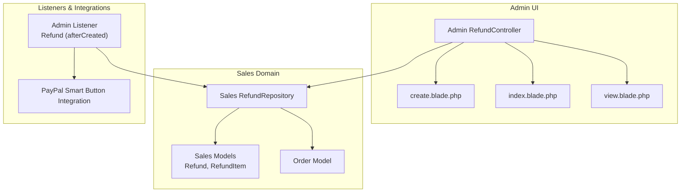
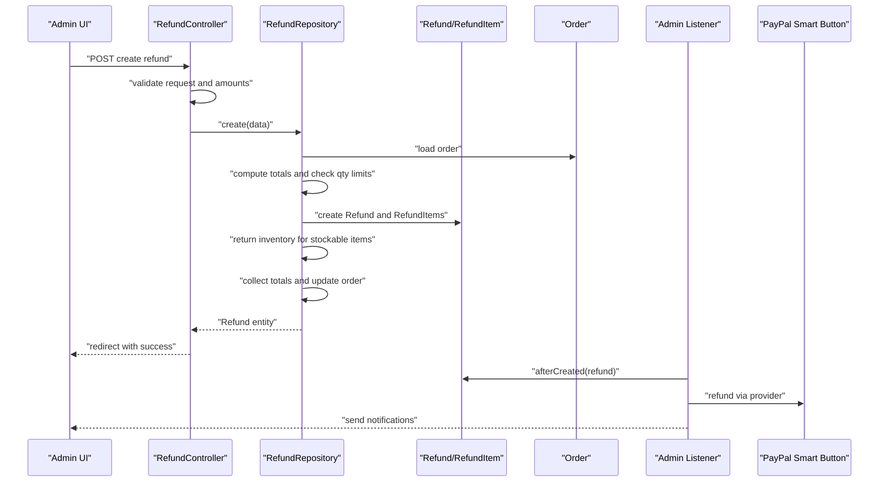
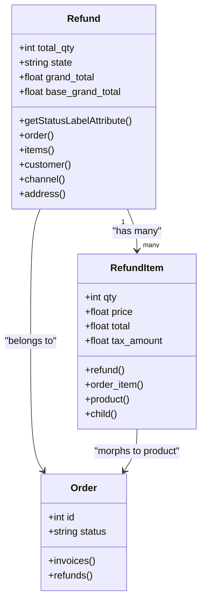
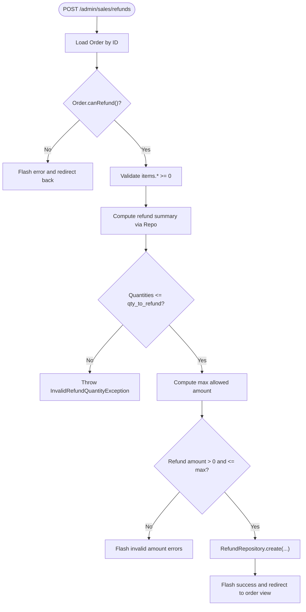
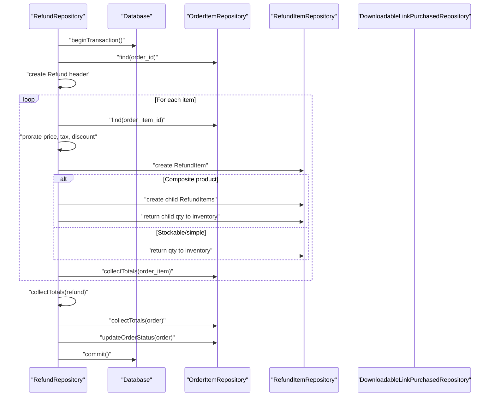
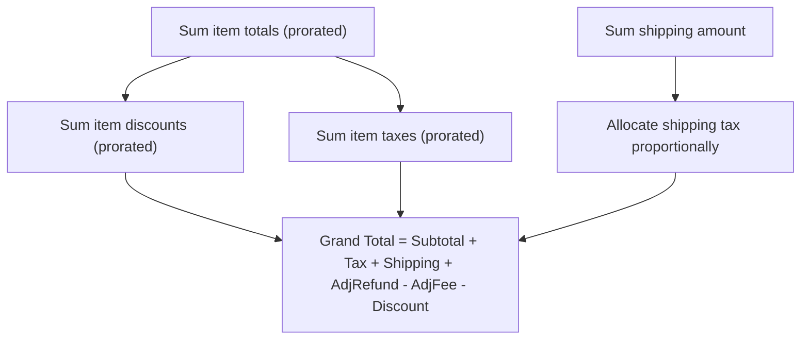
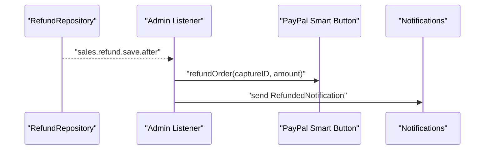
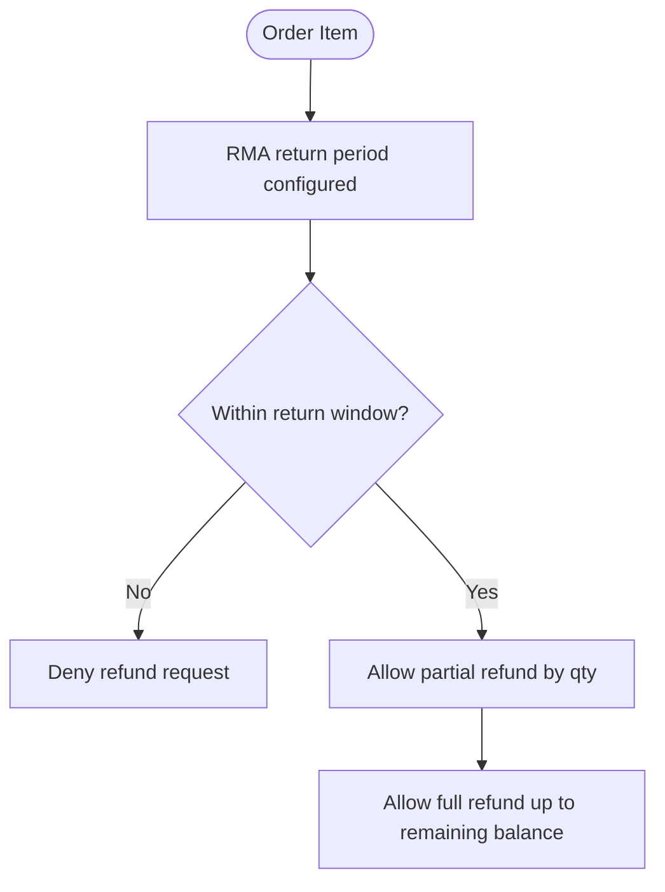
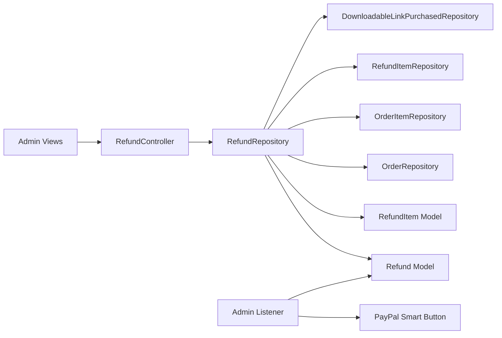

# Refund Management

<cite>
**Referenced Files in This Document**
- [Refund.php](file://packages/Webkul/Sales/src/Models/Refund.php)
- [RefundItem.php](file://packages/Webkul/Sales/src/Models/RefundItem.php)
- [RefundController.php](file://packages/Webkul/Admin/src/Http/Controllers/Sales/RefundController.php)
- [RefundRepository.php](file://packages/Webkul/Sales/src/Repositories/RefundRepository.php)
- [Refund.php (Listener)](file://packages/Webkul/Admin/src/Listeners/Refund.php)
- [InvalidRefundQuantityException.php](file://packages/Webkul/Sales/src/Exceptions/InvalidRefundQuantityException.php)
- [create.blade.php](file://packages/Webkul/Admin/src/Resources/views/sales/refunds/create.blade.php)
- [index.blade.php](file://packages/Webkul/Admin/src/Resources/views/sales/refunds/index.blade.php)
- [view.blade.php](file://packages/Webkul/Admin/src/Resources/views/sales/refunds/view.blade.php)
- [Order.php](file://packages/Webkul/Sales/src/Models/Order.php)
- [2019_09_11_184519_create_refund_items_table.php](file://packages/Webkul/Sales/src/Database/Migrations/2019_09_11_184519_create_refund_items_table.php)
- [2019_09_11_184511_create_refunds_table.php](file://packages/Webkul/Sales/src/Database/Migrations/2019_09_11_184511_create_refunds_table.php)
- [2026_02_11_095547_add_rma_return_period_to_order_items_table.php](file://packages/Webkul/Sales/src/Database/Migrations/2026_02_11_095547_add_rma_return_period_to_order_items_table.php)
</cite>

## Table of Contents
1. [Introduction](#introduction)
2. [Project Structure](#project-structure)
3. [Core Components](#core-components)
4. [Architecture Overview](#architecture-overview)
5. [Detailed Component Analysis](#detailed-component-analysis)
6. [Dependency Analysis](#dependency-analysis)
7. [Performance Considerations](#performance-considerations)
8. [Troubleshooting Guide](#troubleshooting-guide)
9. [Conclusion](#conclusion)
10. [Appendices](#appendices)

## Introduction
This document describes Frooxi's refund management system within the Bagisto-based platform. It covers refund initiation, approval workflows, and processing procedures. It explains refund itemization, quantity validation, and price calculations, and details the relationship between refunds and original invoices, including partial and full refunds. It also documents refund methods (store credit, original payment, replacement), their accounting treatment, return merchandise authorization (RMA) processes, refund tracking, customer communication, policy-based restrictions, time limits, restocking fees, dispute handling, reversals, and reconciliation procedures.

## Project Structure
The refund management system spans several modules:
- Sales domain models and repositories for Refund and RefundItem
- Admin controllers for initiating and viewing refunds
- Admin listeners for payment provider integration and notifications
- Views for refund creation, listing, and detail
- Database migrations defining refund and refund item schemas
- Order model integration and RMA return period support

**Diagram sources**
- [RefundController.php:15-148](file://packages/Webkul/Admin/src/Http/Controllers/Sales/RefundController.php#L15-L148)
- [RefundRepository.php:12-275](file://packages/Webkul/Sales/src/Repositories/RefundRepository.php#L12-L275)
- [Refund.php:14-93](file://packages/Webkul/Sales/src/Models/Refund.php#L14-L93)
- [RefundItem.php:8-52](file://packages/Webkul/Sales/src/Models/RefundItem.php#L8-L52)
- [Order.php:16-421](file://packages/Webkul/Sales/src/Models/Order.php#L16-L421)
- [Refund.php (Listener):8-61](file://packages/Webkul/Admin/src/Listeners/Refund.php#L8-L61)

**Section sources**
- [RefundController.php:15-148](file://packages/Webkul/Admin/src/Http/Controllers/Sales/RefundController.php#L15-L148)
- [RefundRepository.php:12-275](file://packages/Webkul/Sales/src/Repositories/RefundRepository.php#L12-L275)
- [Refund.php:14-93](file://packages/Webkul/Sales/src/Models/Refund.php#L14-L93)
- [RefundItem.php:8-52](file://packages/Webkul/Sales/src/Models/RefundItem.php#L8-L52)
- [Order.php:16-421](file://packages/Webkul/Sales/src/Models/Order.php#L16-L421)
- [Refund.php (Listener):8-61](file://packages/Webkul/Admin/src/Listeners/Refund.php#L8-L61)

## Core Components
- Refund model: Represents a refund transaction linked to an order, customer, channel, and address. It exposes relationships to items and supports status labeling.
- RefundItem model: Represents individual items being refunded, including parent-child relationships for configurable/composite products, and morphs to the product type.
- RefundRepository: Orchestrates refund creation, validates quantities, calculates totals, updates inventory, collects order totals, and dispatches events.
- RefundController: Handles refund creation UI, validation, amount checks against order balance, and redirects to order view upon success.
- Admin Listener: Executes payment provider refund (e.g., PayPal Smart Button) and sends email notifications after a refund is created.
- Views: Provide listing, creation, and detail screens for refunds in the Admin panel.
- Exceptions: InvalidRefundQuantityException signals invalid quantities during refund calculation.
- Database Migrations: Define refunds and refund_items tables, including tax-inclusive columns and RMA return period support.

**Section sources**
- [Refund.php:14-93](file://packages/Webkul/Sales/src/Models/Refund.php#L14-L93)
- [RefundItem.php:8-52](file://packages/Webkul/Sales/src/Models/RefundItem.php#L8-L52)
- [RefundRepository.php:12-275](file://packages/Webkul/Sales/src/Repositories/RefundRepository.php#L12-L275)
- [RefundController.php:15-148](file://packages/Webkul/Admin/src/Http/Controllers/Sales/RefundController.php#L15-L148)
- [Refund.php (Listener):8-61](file://packages/Webkul/Admin/src/Listeners/Refund.php#L8-L61)
- [InvalidRefundQuantityException.php:1-8](file://packages/Webkul/Sales/src/Exceptions/InvalidRefundQuantityException.php#L1-L8)
- [2019_09_11_184511_create_refunds_table.php](file://packages/Webkul/Sales/src/Database/Migrations/2019_09_11_184511_create_refunds_table.php)
- [2019_09_11_184519_create_refund_items_table.php](file://packages/Webkul/Sales/src/Database/Migrations/2019_09_11_184519_create_refund_items_table.php)
- [2026_02_11_095547_add_rma_return_period_to_order_items_table.php](file://packages/Webkul/Sales/src/Database/Migrations/2026_02_11_095547_add_rma_return_period_to_order_items_table.php)

## Architecture Overview
The refund lifecycle integrates UI, business logic, persistence, and external payment systems:
- Admin initiates refund via RefundController, which validates input and delegates to RefundRepository.
- RefundRepository computes totals, enforces quantity limits, updates inventory, recalculates refund and order totals, and persists data.
- An Admin listener triggers payment provider refund and emails notifications.
- Views render refund creation, listing, and detail pages.

**Diagram sources**
- [RefundController.php:59-115](file://packages/Webkul/Admin/src/Http/Controllers/Sales/RefundController.php#L59-L115)
- [RefundRepository.php:40-172](file://packages/Webkul/Sales/src/Repositories/RefundRepository.php#L40-L172)
- [Refund.php (Listener):16-59](file://packages/Webkul/Admin/src/Listeners/Refund.php#L16-L59)

## Detailed Component Analysis

### Refund Model and Relationships
The Refund model encapsulates refund metadata and relationships:
- Belongs to Order, Customer, Channel, and Order Address
- Has many RefundItems (excluding children)
- Supports status label retrieval

**Diagram sources**
- [Refund.php:14-93](file://packages/Webkul/Sales/src/Models/Refund.php#L14-L93)
- [RefundItem.php:8-52](file://packages/Webkul/Sales/src/Models/RefundItem.php#L8-L52)
- [Order.php:16-421](file://packages/Webkul/Sales/src/Models/Order.php#L16-L421)

**Section sources**
- [Refund.php:14-93](file://packages/Webkul/Sales/src/Models/Refund.php#L14-L93)
- [RefundItem.php:8-52](file://packages/Webkul/Sales/src/Models/RefundItem.php#L8-L52)
- [Order.php:16-421](file://packages/Webkul/Sales/src/Models/Order.php#L16-L421)

### Refund Creation Workflow (Controller)
The RefundController handles:
- Loading the order and validating refund eligibility
- Request validation for item quantities
- Computing refund summary and checking max allowed amount
- Creating the refund via RefundRepository
- Redirecting to the order view with success feedback

**Diagram sources**
- [RefundController.php:59-115](file://packages/Webkul/Admin/src/Http/Controllers/Sales/RefundController.php#L59-L115)
- [RefundRepository.php:228-273](file://packages/Webkul/Sales/src/Repositories/RefundRepository.php#L228-L273)
- [InvalidRefundQuantityException.php:1-8](file://packages/Webkul/Sales/src/Exceptions/InvalidRefundQuantityException.php#L1-L8)

**Section sources**
- [RefundController.php:59-115](file://packages/Webkul/Admin/src/Http/Controllers/Sales/RefundController.php#L59-L115)
- [RefundRepository.php:228-273](file://packages/Webkul/Sales/src/Repositories/RefundRepository.php#L228-L273)
- [InvalidRefundQuantityException.php:1-8](file://packages/Webkul/Sales/src/Exceptions/InvalidRefundQuantityException.php#L1-L8)

### Refund Processing (Repository)
The RefundRepository performs:
- Transactional creation of Refund and RefundItems
- Quantity enforcement per order item
- Tax and discount proration across quantities
- Inventory return for stockable items
- Composite product child item creation and inventory return
- Totals collection for refund and order recalculation
- Order status update and event dispatch

**Diagram sources**
- [RefundRepository.php:40-172](file://packages/Webkul/Sales/src/Repositories/RefundRepository.php#L40-L172)

**Section sources**
- [RefundRepository.php:40-172](file://packages/Webkul/Sales/src/Repositories/RefundRepository.php#L40-L172)

### Refund Totals Calculation
Refund totals computation includes:
- Subtotal and base subtotal from prorated item prices
- Discount proration across quantities
- Tax proration for items and shipping
- Shipping tax allocation proportional to shipped vs invoiced shipping
- Grand total derived from subtotal, tax, shipping, adjustment refund, minus adjustment fee and discount

**Diagram sources**
- [RefundRepository.php:180-219](file://packages/Webkul/Sales/src/Repositories/RefundRepository.php#L180-L219)

**Section sources**
- [RefundRepository.php:180-219](file://packages/Webkul/Sales/src/Repositories/RefundRepository.php#L180-L219)

### Payment Provider Integration and Notifications
After a refund is created:
- An Admin listener triggers provider-specific refund (e.g., PayPal Smart Button)
- Email notifications are sent to configured recipients

**Diagram sources**
- [RefundRepository.php:45-46](file://packages/Webkul/Sales/src/Repositories/RefundRepository.php#L45-L46)
- [RefundRepository.php:162-162](file://packages/Webkul/Sales/src/Repositories/RefundRepository.php#L162-L162)
- [Refund.php (Listener):16-59](file://packages/Webkul/Admin/src/Listeners/Refund.php#L16-L59)

**Section sources**
- [RefundRepository.php:45-46](file://packages/Webkul/Sales/src/Repositories/RefundRepository.php#L45-L46)
- [RefundRepository.php:162-162](file://packages/Webkul/Sales/src/Repositories/RefundRepository.php#L162-L162)
- [Refund.php (Listener):16-59](file://packages/Webkul/Admin/src/Listeners/Refund.php#L16-L59)

### RMA, Partial and Full Refunds
- RMA return period is supported at the order item level via migration.
- Partial refunds are supported by specifying quantities per order item.
- Full refunds occur when total refund amount equals remaining eligible balance.

**Diagram sources**
- [2026_02_11_095547_add_rma_return_period_to_order_items_table.php](file://packages/Webkul/Sales/src/Database/Migrations/2026_02_11_095547_add_rma_return_period_to_order_items_table.php)

**Section sources**
- [2026_02_11_095547_add_rma_return_period_to_order_items_table.php](file://packages/Webkul/Sales/src/Database/Migrations/2026_02_11_095547_add_rma_return_period_to_order_items_table.php)

### Refund Methods and Accounting Treatment
- Refund methods supported by the system include original payment method and store credit (via adjustments).
- Accounting treatment:
  - Refund header stores base and channel currency codes and amount fields in base and order currency.
  - Refund items carry prorated price, tax, discount, and totals in both currencies.
  - Totals aggregation ensures grand total reflects subtotal, tax, shipping, adjustment refund/fee, and discount.

**Section sources**
- [RefundRepository.php:51-64](file://packages/Webkul/Sales/src/Repositories/RefundRepository.php#L51-L64)
- [RefundRepository.php:180-219](file://packages/Webkul/Sales/src/Repositories/RefundRepository.php#L180-L219)

### Refund Tracking and Customer Communication
- Admin views provide listing and detail of refunds.
- After creation, an email notification is dispatched to configured recipients.

**Section sources**
- [index.blade.php](file://packages/Webkul/Admin/src/Resources/views/sales/refunds/index.blade.php)
- [view.blade.php](file://packages/Webkul/Admin/src/Resources/views/sales/refunds/view.blade.php)
- [Refund.php (Listener):16-29](file://packages/Webkul/Admin/src/Listeners/Refund.php#L16-L29)

### Policy-Based Restrictions, Time Limits, and Restocking Fees
- Time limits: Enforced via RMA return period at the order item level.
- Quantity validation: Enforced so quantities do not exceed qty_to_refund.
- Restocking fees: Supported via adjustment_fee field in refund creation.

**Section sources**
- [2026_02_11_095547_add_rma_return_period_to_order_items_table.php](file://packages/Webkul/Sales/src/Database/Migrations/2026_02_11_095547_add_rma_return_period_to_order_items_table.php)
- [RefundRepository.php:247-249](file://packages/Webkul/Sales/src/Repositories/RefundRepository.php#L247-L249)
- [RefundController.php:92-108](file://packages/Webkul/Admin/src/Http/Controllers/Sales/RefundController.php#L92-L108)

### Disputes, Reversals, and Reconciliation
- Disputes: Not modeled in the current code; potential extension points include adding dispute status and manual override flags.
- Reversals: Not modeled in the current code; reversal would require a new transaction type and reverse ledger entries.
- Reconciliation: The system tracks base and order currency amounts and uses prorated allocations to reconcile taxes and discounts across items and shipping.

[No sources needed since this section provides general guidance]

## Dependency Analysis
The refund system exhibits clear separation of concerns:
- Controller depends on repositories for orchestration
- Repository depends on models, order repositories, and inventory repositories
- Listener depends on payment provider integration and email services
- Views depend on controller actions and repository-provided data

**Diagram sources**
- [RefundController.php:22-26](file://packages/Webkul/Admin/src/Http/Controllers/Sales/RefundController.php#L22-L26)
- [RefundRepository.php:17-25](file://packages/Webkul/Sales/src/Repositories/RefundRepository.php#L17-L25)
- [Refund.php (Listener):8-61](file://packages/Webkul/Admin/src/Listeners/Refund.php#L8-L61)

**Section sources**
- [RefundController.php:22-26](file://packages/Webkul/Admin/src/Http/Controllers/Sales/RefundController.php#L22-L26)
- [RefundRepository.php:17-25](file://packages/Webkul/Sales/src/Repositories/RefundRepository.php#L17-L25)
- [Refund.php (Listener):8-61](file://packages/Webkul/Admin/src/Listeners/Refund.php#L8-L61)

## Performance Considerations
- Batch inventory returns and totals recalculation are performed per item; ensure order item counts remain reasonable.
- Use of proration avoids floating-point drift by computing per-item allocations before summing.
- Transactions wrap refund creation to maintain consistency.

[No sources needed since this section provides general guidance]

## Troubleshooting Guide
Common issues and resolutions:
- Invalid refund quantity: Thrown when requested quantity exceeds qty_to_refund; adjust quantities accordingly.
- Invalid refund amount: Occurs when refund amount is zero or exceeds remaining eligible balance; verify shipping, adjustment refund/fee, and discount allocations.
- Payment provider refund failures: Inspect listener logs and payment provider responses; ensure capture ID resolution and amount formatting.

**Section sources**
- [InvalidRefundQuantityException.php:1-8](file://packages/Webkul/Sales/src/Exceptions/InvalidRefundQuantityException.php#L1-L8)
- [RefundController.php:86-108](file://packages/Webkul/Admin/src/Http/Controllers/Sales/RefundController.php#L86-L108)
- [Refund.php (Listener):37-59](file://packages/Webkul/Admin/src/Listeners/Refund.php#L37-L59)

## Conclusion
Frooxi’s refund management system provides robust support for partial and full refunds, strict quantity validation, accurate prorated calculations, inventory reconciliation, and payment provider integration. The modular design enables extensibility for advanced features such as dispute handling, reversals, and expanded refund methods.

## Appendices

### Database Schema Notes
- Refunds table captures header-level refund data including currency codes, totals, and adjustment fields.
- Refund Items table captures prorated item-level details and supports hierarchical relationships for composite products.
- RMA return period column on order items supports time-bound refund eligibility.

**Section sources**
- [2019_09_11_184511_create_refunds_table.php](file://packages/Webkul/Sales/src/Database/Migrations/2019_09_11_184511_create_refunds_table.php)
- [2019_09_11_184519_create_refund_items_table.php](file://packages/Webkul/Sales/src/Database/Migrations/2019_09_11_184519_create_refund_items_table.php)
- [2026_02_11_095547_add_rma_return_period_to_order_items_table.php](file://packages/Webkul/Sales/src/Database/Migrations/2026_02_11_095547_add_rma_return_period_to_order_items_table.php)