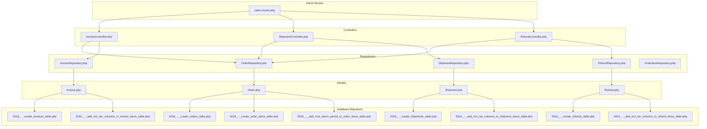
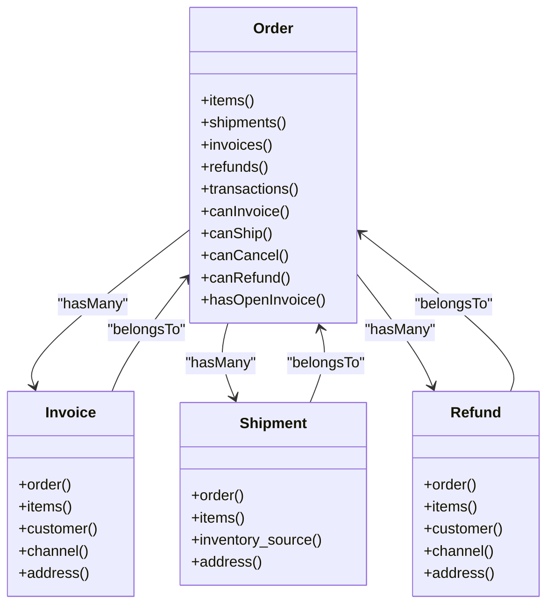
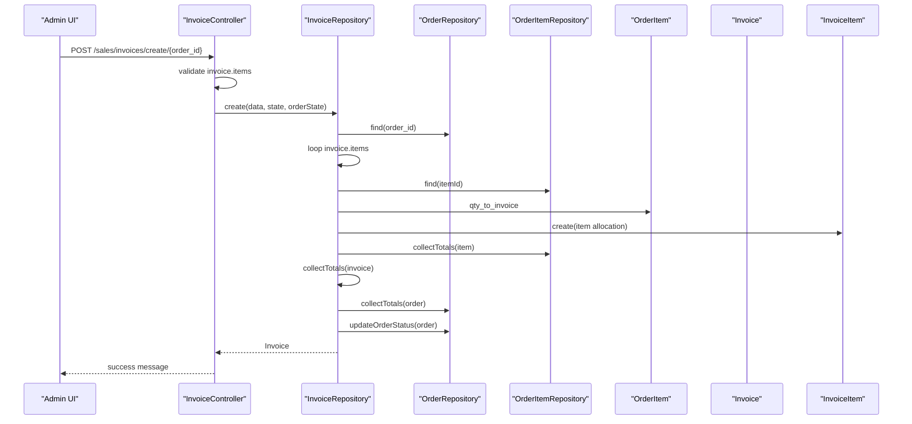
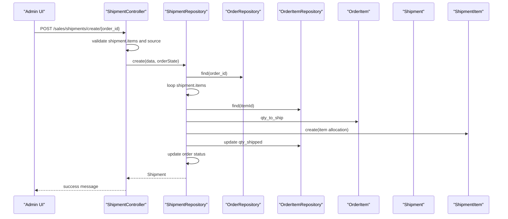
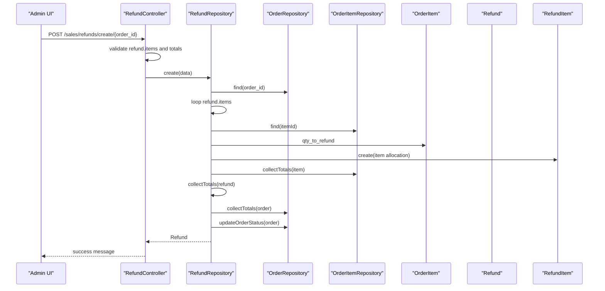
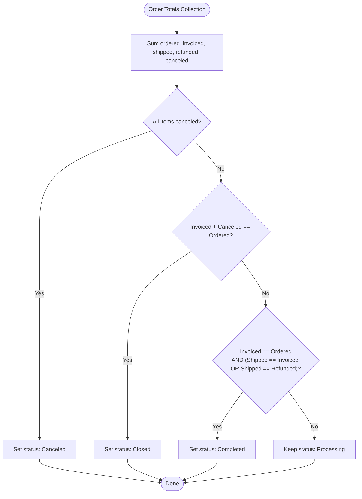
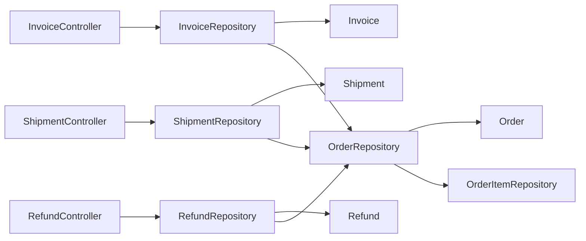

# Sales & Invoicing

<cite>
**Referenced Files in This Document**
- [Order.php](file://packages/Webkul/Sales/src/Models/Order.php)
- [Invoice.php](file://packages/Webkul/Sales/src/Models/Invoice.php)
- [Shipment.php](file://packages/Webkul/Sales/src/Models/Shipment.php)
- [Refund.php](file://packages/Webkul/Sales/src/Models/Refund.php)
- [OrderRepository.php](file://packages/Webkul/Sales/src/Repositories/OrderRepository.php)
- [InvoiceRepository.php](file://packages/Webkul/Sales/src/Repositories/InvoiceRepository.php)
- [ShipmentRepository.php](file://packages/Webkul/Sales/src/Repositories/ShipmentRepository.php)
- [RefundRepository.php](file://packages/Webkul/Sales/src/Repositories/RefundRepository.php)
- [OrderItemRepository.php](file://packages/Webkul/Sales/src/Repositories/OrderItemRepository.php)
- [sales-routes.php](file://packages/Webkul/Admin/src/Routes/sales-routes.php)
- [InvoiceController.php](file://packages/Webkul/Admin/src/Http/Controllers/Sales/InvoiceController.php)
- [ShipmentController.php](file://packages/Webkul/Admin/src/Http/Controllers/Sales/ShipmentController.php)
- [RefundController.php](file://packages/Webkul/Admin/src/Http/Controllers/Sales/RefundController.php)
- [2018_09_27_115135_create_invoices_table.php](file://packages/Webkul/Sales/src/Database/Migrations/2018_09_27_115135_create_invoices_table.php)
- [2018_09_27_115022_create_shipments_table.php](file://packages/Webkul/Sales/src/Database/Migrations/2018_09_27_115022_create_shipments_table.php)
- [2019_09_11_184511_create_refunds_table.php](file://packages/Webkul/Sales/src/Database/Migrations/2019_09_11_184511_create_refunds_table.php)
- [2018_09_27_113154_create_orders_table.php](file://packages/Webkul/Sales/src/Database/Migrations/2018_09_27_113154_create_orders_table.php)
- [2018_09_27_113207_create_order_items_table.php](file://packages/Webkul/Sales/src/Database/Migrations/2018_09_27_113207_create_order_items_table.php)
- [2024_04_24_144641_add_incl_tax_columns_in_invoice_items_table.php](file://packages/Webkul/Sales/src/Database/Migrations/2024_04_24_144641_add_incl_tax_columns_in_invoice_items_table.php)
- [2024_04_24_144641_add_incl_tax_columns_in_refund_items_table.php](file://packages/Webkul/Sales/src/Database/Migrations/2024_04_24_144641_add_incl_tax_columns_in_refund_items_table.php)
- [2024_04_24_144641_add_incl_tax_columns_in_shipment_items_table.php](file://packages/Webkul/Sales/src/Database/Migrations/2024_04_24_144641_add_incl_tax_columns_in_shipment_items_table.php)
- [2026_02_11_095547_add_rma_return_period_to_order_items_table.php](file://packages/Webkul/Sales/src/Database/Migrations/2026_02_11_095547_add_rma_return_period_to_order_items_table.php)
</cite>

## Table of Contents
1. [Introduction](#introduction)
2. [Project Structure](#project-structure)
3. [Core Components](#core-components)
4. [Architecture Overview](#architecture-overview)
5. [Detailed Component Analysis](#detailed-component-analysis)
6. [Dependency Analysis](#dependency-analysis)
7. [Performance Considerations](#performance-considerations)
8. [Troubleshooting Guide](#troubleshooting-guide)
9. [Conclusion](#conclusion)

## Introduction
This document explains Frooxi’s sales and invoicing system built on the Sales module. It covers invoice generation, shipment processing, refund management, and payment handling. It also details the relationships among orders, invoices, shipments, and refunds, along with invoicing workflows, tax calculation, financial reporting, payment method integration, transaction processing, reconciliation, refund policies, return management, and credit memo generation.

## Project Structure
The Sales module organizes core domain entities (Order, Invoice, Shipment, Refund), repositories for persistence and business logic orchestration, and admin controllers exposing CRUD operations via routes. The database schema is defined through migrations, including support for inclusive tax columns and RMA return periods.

**Diagram sources**
- [sales-routes.php:1-68](file://packages/Webkul/Admin/src/Routes/sales-routes.php#L1-L68)
- [InvoiceController.php:1-176](file://packages/Webkul/Admin/src/Http/Controllers/Sales/InvoiceController.php#L1-L176)
- [ShipmentController.php:1-174](file://packages/Webkul/Admin/src/Http/Controllers/Sales/ShipmentController.php#L1-L174)
- [RefundController.php:1-148](file://packages/Webkul/Admin/src/Http/Controllers/Sales/RefundController.php#L1-L148)
- [OrderRepository.php:1-415](file://packages/Webkul/Sales/src/Repositories/OrderRepository.php#L1-L415)
- [InvoiceRepository.php:1-337](file://packages/Webkul/Sales/src/Repositories/InvoiceRepository.php#L1-L337)
- [ShipmentRepository.php:1-151](file://packages/Webkul/Sales/src/Repositories/ShipmentRepository.php#L1-L151)
- [RefundRepository.php:1-275](file://packages/Webkul/Sales/src/Repositories/RefundRepository.php#L1-L275)
- [OrderItemRepository.php:1-232](file://packages/Webkul/Sales/src/Repositories/OrderItemRepository.php#L1-L232)
- [Order.php:1-421](file://packages/Webkul/Sales/src/Models/Order.php#L1-L421)
- [Invoice.php:1-148](file://packages/Webkul/Sales/src/Models/Invoice.php#L1-L148)
- [Shipment.php:1-74](file://packages/Webkul/Sales/src/Models/Shipment.php#L1-L74)
- [Refund.php:1-93](file://packages/Webkul/Sales/src/Models/Refund.php#L1-L93)
- [2018_09_27_115135_create_invoices_table.php](file://packages/Webkul/Sales/src/Database/Migrations/2018_09_27_115135_create_invoices_table.php)
- [2018_09_27_115022_create_shipments_table.php](file://packages/Webkul/Sales/src/Database/Migrations/2018_09_27_115022_create_shipments_table.php)
- [2019_09_11_184511_create_refunds_table.php](file://packages/Webkul/Sales/src/Database/Migrations/2019_09_11_184511_create_refunds_table.php)
- [2018_09_27_113154_create_orders_table.php](file://packages/Webkul/Sales/src/Database/Migrations/2018_09_27_113154_create_orders_table.php)
- [2018_09_27_113207_create_order_items_table.php](file://packages/Webkul/Sales/src/Database/Migrations/2018_09_27_113207_create_order_items_table.php)
- [2024_04_24_144641_add_incl_tax_columns_in_invoice_items_table.php](file://packages/Webkul/Sales/src/Database/Migrations/2024_04_24_144641_add_incl_tax_columns_in_invoice_items_table.php)
- [2024_04_24_144641_add_incl_tax_columns_in_refund_items_table.php](file://packages/Webkul/Sales/src/Database/Migrations/2024_04_24_144641_add_incl_tax_columns_in_refund_items_table.php)
- [2024_04_24_144641_add_incl_tax_columns_in_shipment_items_table.php](file://packages/Webkul/Sales/src/Database/Migrations/2024_04_24_144641_add_incl_tax_columns_in_shipment_items_table.php)
- [2026_02_11_095547_add_rma_return_period_to_order_items_table.php](file://packages/Webkul/Sales/src/Database/Migrations/2026_02_11_095547_add_rma_return_period_to_order_items_table.php)

**Section sources**
- [sales-routes.php:1-68](file://packages/Webkul/Admin/src/Routes/sales-routes.php#L1-L68)
- [InvoiceController.php:1-176](file://packages/Webkul/Admin/src/Http/Controllers/Sales/InvoiceController.php#L1-L176)
- [ShipmentController.php:1-174](file://packages/Webkul/Admin/src/Http/Controllers/Sales/ShipmentController.php#L1-L174)
- [RefundController.php:1-148](file://packages/Webkul/Admin/src/Http/Controllers/Sales/RefundController.php#L1-L148)

## Core Components
- Order: Central entity representing a customer purchase, linking to items, addresses, payments, shipments, invoices, refunds, and transactions. Provides status checks for invoicing, shipping, cancellation, and refund eligibility.
- Invoice: Represents a bill issued against an order, with per-item tax and discount allocations and inclusive tax support.
- Shipment: Tracks shipped items, weight, carrier, and inventory source linkage.
- Refund: Records returned/refunded amounts, including item-level tax and discount allocations and inclusive tax adjustments.
- Repositories: Encapsulate business logic for creating, validating, and updating entities while maintaining transactional integrity and order/financial state consistency.

Key capabilities:
- Order lifecycle state transitions driven by totals collected across invoices and refunds.
- Invoice creation validates quantities, collects per-item totals, and updates order totals and status.
- Shipment creation updates item shipped quantities, inventory, and order status.
- Refund creation validates quantities, computes totals with inclusive taxes, and updates order totals and status.

**Section sources**
- [Order.php:1-421](file://packages/Webkul/Sales/src/Models/Order.php#L1-L421)
- [Invoice.php:1-148](file://packages/Webkul/Sales/src/Models/Invoice.php#L1-L148)
- [Shipment.php:1-74](file://packages/Webkul/Sales/src/Models/Shipment.php#L1-L74)
- [Refund.php:1-93](file://packages/Webkul/Sales/src/Models/Refund.php#L1-L93)
- [OrderRepository.php:1-415](file://packages/Webkul/Sales/src/Repositories/OrderRepository.php#L1-L415)
- [InvoiceRepository.php:1-337](file://packages/Webkul/Sales/src/Repositories/InvoiceRepository.php#L1-L337)
- [ShipmentRepository.php:1-151](file://packages/Webkul/Sales/src/Repositories/ShipmentRepository.php#L1-L151)
- [RefundRepository.php:1-275](file://packages/Webkul/Sales/src/Repositories/RefundRepository.php#L1-L275)
- [OrderItemRepository.php:1-232](file://packages/Webkul/Sales/src/Repositories/OrderItemRepository.php#L1-L232)

## Architecture Overview
The Sales module follows a layered architecture:
- Controllers expose admin endpoints for invoices, shipments, refunds, and orders.
- Repositories encapsulate domain logic and coordinate model updates, totals collection, and order state transitions.
- Models define relationships and constants for statuses and attributes.
- Migrations define schema and inclusive tax support.

**Diagram sources**
- [Order.php:102-212](file://packages/Webkul/Sales/src/Models/Order.php#L102-L212)
- [Invoice.php:99-138](file://packages/Webkul/Sales/src/Models/Invoice.php#L99-L138)
- [Shipment.php:25-64](file://packages/Webkul/Sales/src/Models/Shipment.php#L25-L64)
- [Refund.php:45-83](file://packages/Webkul/Sales/src/Models/Refund.php#L45-L83)

## Detailed Component Analysis

### Invoice Generation Workflow
Invoice creation validates requested quantities against order items, constructs invoice items with price, tax, and discount allocations, and updates order totals and status. It supports inclusive tax columns and ensures shipping tax is handled correctly across multiple invoices.

**Diagram sources**
- [InvoiceController.php:66-100](file://packages/Webkul/Admin/src/Http/Controllers/Sales/InvoiceController.php#L66-L100)
- [InvoiceRepository.php:44-194](file://packages/Webkul/Sales/src/Repositories/InvoiceRepository.php#L44-L194)
- [OrderRepository.php:345-400](file://packages/Webkul/Sales/src/Repositories/OrderRepository.php#L345-L400)
- [OrderItemRepository.php:23-76](file://packages/Webkul/Sales/src/Repositories/OrderItemRepository.php#L23-L76)

**Section sources**
- [InvoiceController.php:66-100](file://packages/Webkul/Admin/src/Http/Controllers/Sales/InvoiceController.php#L66-L100)
- [InvoiceRepository.php:44-194](file://packages/Webkul/Sales/src/Repositories/InvoiceRepository.php#L44-L194)
- [OrderRepository.php:345-400](file://packages/Webkul/Sales/src/Repositories/OrderRepository.php#L345-L400)
- [2024_04_24_144641_add_incl_tax_columns_in_invoice_items_table.php](file://packages/Webkul/Sales/src/Database/Migrations/2024_04_24_144641_add_incl_tax_columns_in_invoice_items_table.php)

### Shipment Processing Workflow
Shipment creation validates inventory availability per source, records shipped items with weights and prices, updates item shipped quantities, and adjusts order status depending on open invoices.

**Diagram sources**
- [ShipmentController.php:63-93](file://packages/Webkul/Admin/src/Http/Controllers/Sales/ShipmentController.php#L63-L93)
- [ShipmentRepository.php:42-149](file://packages/Webkul/Sales/src/Repositories/ShipmentRepository.php#L42-L149)
- [OrderRepository.php:312-337](file://packages/Webkul/Sales/src/Repositories/OrderRepository.php#L312-L337)
- [OrderItemRepository.php:133-166](file://packages/Webkul/Sales/src/Repositories/OrderItemRepository.php#L133-L166)

**Section sources**
- [ShipmentController.php:63-93](file://packages/Webkul/Admin/src/Http/Controllers/Sales/ShipmentController.php#L63-L93)
- [ShipmentRepository.php:42-149](file://packages/Webkul/Sales/src/Repositories/ShipmentRepository.php#L42-L149)
- [OrderRepository.php:312-337](file://packages/Webkul/Sales/src/Repositories/OrderRepository.php#L312-L337)
- [2024_04_24_144641_add_incl_tax_columns_in_shipment_items_table.php](file://packages/Webkul/Sales/src/Database/Migrations/2024_04_24_144641_add_incl_tax_columns_in_shipment_items_table.php)

### Refund Management Workflow
Refund creation validates requested quantities, computes inclusive tax and discount allocations, updates item refunded quantities, and recalculates order totals and status. It also manages downloadable link expiration and inventory returns.

**Diagram sources**
- [RefundController.php:59-115](file://packages/Webkul/Admin/src/Http/Controllers/Sales/RefundController.php#L59-L115)
- [RefundRepository.php:40-172](file://packages/Webkul/Sales/src/Repositories/RefundRepository.php#L40-L172)
- [OrderRepository.php:345-400](file://packages/Webkul/Sales/src/Repositories/OrderRepository.php#L345-L400)
- [OrderItemRepository.php:23-76](file://packages/Webkul/Sales/src/Repositories/OrderItemRepository.php#L23-L76)

**Section sources**
- [RefundController.php:59-115](file://packages/Webkul/Admin/src/Http/Controllers/Sales/RefundController.php#L59-L115)
- [RefundRepository.php:40-172](file://packages/Webkul/Sales/src/Repositories/RefundRepository.php#L40-L172)
- [OrderRepository.php:345-400](file://packages/Webkul/Sales/src/Repositories/OrderRepository.php#L345-L400)
- [2024_04_24_144641_add_incl_tax_columns_in_refund_items_table.php](file://packages/Webkul/Sales/src/Database/Migrations/2024_04_24_144641_add_incl_tax_columns_in_refund_items_table.php)

### Order State Transition Logic
Order status is derived from item-level shipped, invoiced, refunded, and canceled quantities, ensuring accurate completion, cancellation, and closure states.

**Diagram sources**
- [OrderRepository.php:209-266](file://packages/Webkul/Sales/src/Repositories/OrderRepository.php#L209-L266)

**Section sources**
- [OrderRepository.php:209-266](file://packages/Webkul/Sales/src/Repositories/OrderRepository.php#L209-L266)

### Tax Calculations and Inclusive Taxes
- Inclusive tax columns were added to invoice items, refund items, and shipment items to support tax-inclusive pricing.
- Invoice totals aggregation accounts for inclusive tax and shipping tax, excluding shipping tax from subsequent invoices.
- Refund totals compute shipping tax proportionally based on invoiced shipping amounts.

**Section sources**
- [2024_04_24_144641_add_incl_tax_columns_in_invoice_items_table.php](file://packages/Webkul/Sales/src/Database/Migrations/2024_04_24_144641_add_incl_tax_columns_in_invoice_items_table.php)
- [2024_04_24_144641_add_incl_tax_columns_in_refund_items_table.php](file://packages/Webkul/Sales/src/Database/Migrations/2024_04_24_144641_add_incl_tax_columns_in_refund_items_table.php)
- [2024_04_24_144641_add_incl_tax_columns_in_shipment_items_table.php](file://packages/Webkul/Sales/src/Database/Migrations/2024_04_24_144641_add_incl_tax_columns_in_shipment_items_table.php)
- [InvoiceRepository.php:242-313](file://packages/Webkul/Sales/src/Repositories/InvoiceRepository.php#L242-L313)
- [RefundRepository.php:180-219](file://packages/Webkul/Sales/src/Repositories/RefundRepository.php#L180-L219)

### Financial Reporting and Reconciliation
- Order totals reflect invoiced and refunded amounts across sub-total, tax, shipping, and discount dimensions.
- Repositories compute grand totals and base equivalents for invoices and refunds, enabling reconciliation.
- Order totals collection aggregates across existing invoices and refunds to prevent double-counting.

**Section sources**
- [OrderRepository.php:345-400](file://packages/Webkul/Sales/src/Repositories/OrderRepository.php#L345-L400)
- [InvoiceRepository.php:242-313](file://packages/Webkul/Sales/src/Repositories/InvoiceRepository.php#L242-L313)
- [RefundRepository.php:180-219](file://packages/Webkul/Sales/src/Repositories/RefundRepository.php#L180-L219)

### Payment Handling and Integration
- Orders maintain a payment relationship and status flags for pending states.
- Invoice creation optionally triggers transaction creation based on request flags.
- Payment method-specific restrictions are enforced in controllers (for example, PayPal Standard invoice creation is blocked).

**Section sources**
- [Order.php:34-67](file://packages/Webkul/Sales/src/Models/Order.php#L34-L67)
- [InvoiceRepository.php:182-184](file://packages/Webkul/Sales/src/Repositories/InvoiceRepository.php#L182-L184)
- [InvoiceController.php:54-56](file://packages/Webkul/Admin/src/Http/Controllers/Sales/InvoiceController.php#L54-L56)

### Return Management and Credit Memo Generation
- Refund creation handles item-level returns, inclusive tax, and discount allocations.
- Inventory is returned for stockable and quantity-box products upon refund.
- Downloadable links are expired when an item is fully refunded/canceled.
- Credit memos correspond to Refund entities with adjustment refund/fee fields.

**Section sources**
- [RefundRepository.php:130-154](file://packages/Webkul/Sales/src/Repositories/RefundRepository.php#L130-L154)
- [OrderItemRepository.php:133-166](file://packages/Webkul/Sales/src/Repositories/OrderItemRepository.php#L133-L166)

### RMA Return Period Support
- A return period field was added to order items to support RMA workflows.

**Section sources**
- [2026_02_11_095547_add_rma_return_period_to_order_items_table.php](file://packages/Webkul/Sales/src/Database/Migrations/2026_02_11_095547_add_rma_return_period_to_order_items_table.php)

## Dependency Analysis
The controllers depend on repositories to enforce business rules and maintain transactional consistency. Repositories coordinate model updates, totals computation, and order state transitions. Models define relationships and constants, while migrations evolve schema to support inclusive taxes and RMA.

**Diagram sources**
- [InvoiceController.php:26-29](file://packages/Webkul/Admin/src/Http/Controllers/Sales/InvoiceController.php#L26-L29)
- [ShipmentController.php:20-24](file://packages/Webkul/Admin/src/Http/Controllers/Sales/ShipmentController.php#L20-L24)
- [RefundController.php:22-26](file://packages/Webkul/Admin/src/Http/Controllers/Sales/RefundController.php#L22-L26)
- [InvoiceRepository.php:19-27](file://packages/Webkul/Sales/src/Repositories/InvoiceRepository.php#L19-L27)
- [ShipmentRepository.php:19-26](file://packages/Webkul/Sales/src/Repositories/ShipmentRepository.php#L19-L26)
- [RefundRepository.php:17-25](file://packages/Webkul/Sales/src/Repositories/RefundRepository.php#L17-L25)
- [OrderRepository.php:23-30](file://packages/Webkul/Sales/src/Repositories/OrderRepository.php#L23-L30)
- [OrderItemRepository.php:10-18](file://packages/Webkul/Sales/src/Repositories/OrderItemRepository.php#L10-L18)

**Section sources**
- [InvoiceController.php:26-29](file://packages/Webkul/Admin/src/Http/Controllers/Sales/InvoiceController.php#L26-L29)
- [ShipmentController.php:20-24](file://packages/Webkul/Admin/src/Http/Controllers/Sales/ShipmentController.php#L20-L24)
- [RefundController.php:22-26](file://packages/Webkul/Admin/src/Http/Controllers/Sales/RefundController.php#L22-L26)
- [InvoiceRepository.php:19-27](file://packages/Webkul/Sales/src/Repositories/InvoiceRepository.php#L19-L27)
- [ShipmentRepository.php:19-26](file://packages/Webkul/Sales/src/Repositories/ShipmentRepository.php#L19-L26)
- [RefundRepository.php:17-25](file://packages/Webkul/Sales/src/Repositories/RefundRepository.php#L17-L25)
- [OrderRepository.php:23-30](file://packages/Webkul/Sales/src/Repositories/OrderRepository.php#L23-L30)
- [OrderItemRepository.php:10-18](file://packages/Webkul/Sales/src/Repositories/OrderItemRepository.php#L10-L18)

## Performance Considerations
- Batch totals computation: Repositories aggregate sums across related entities; ensure indices exist on foreign keys for efficient joins.
- Transaction boundaries: All create/update flows wrap in transactions to maintain consistency; keep payload sizes reasonable to avoid long-running transactions.
- Inventory updates: Composite items and inventory adjustments occur per item; batch operations where feasible to reduce database round-trips.
- Inclusive tax calculations: Additional columns improve precision but require careful indexing and aggregation logic.

## Troubleshooting Guide
Common issues and resolutions:
- Invalid invoice quantity: Ensure requested quantities do not exceed item’s remaining quantity to invoice.
- Invalid refund quantity: Validate requested quantities against item’s remaining quantity to refund.
- Refund limit exceeded: The refund amount must not exceed the maximum allowed based on prior refunds and adjustments.
- Inventory validation failures during shipment: Confirm sufficient stock exists at the selected inventory source and requested quantities.
- Order status inconsistencies: Totals collection recalculates order state; verify invoice and refund totals are up-to-date.

**Section sources**
- [InvoiceController.php:76-91](file://packages/Webkul/Admin/src/Http/Controllers/Sales/InvoiceController.php#L76-L91)
- [RefundController.php:69-108](file://packages/Webkul/Admin/src/Http/Controllers/Sales/RefundController.php#L69-L108)
- [ShipmentController.php:101-160](file://packages/Webkul/Admin/src/Http/Controllers/Sales/ShipmentController.php#L101-L160)
- [OrderRepository.php:345-400](file://packages/Webkul/Sales/src/Repositories/OrderRepository.php#L345-L400)

## Conclusion
Frooxi’s Sales module provides a robust foundation for managing orders, invoices, shipments, and refunds. It enforces strict business rules around quantities, inclusive tax handling, and order state transitions, while supporting financial reconciliation and return management. The modular repository pattern and transactional operations ensure data integrity across invoicing workflows, making it suitable for production environments requiring accurate financial reporting and compliance.