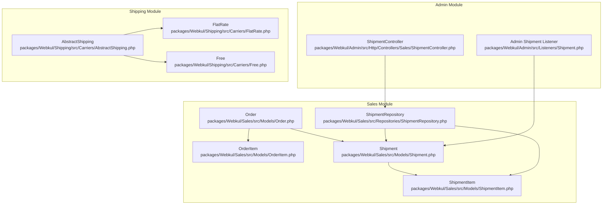
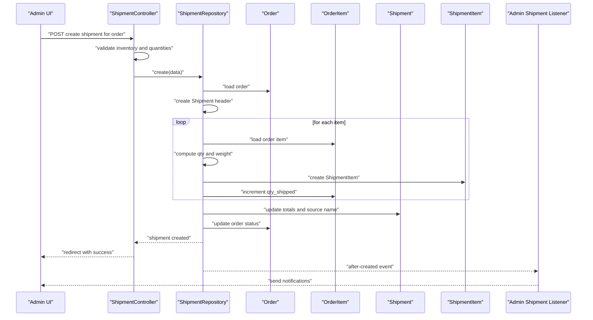
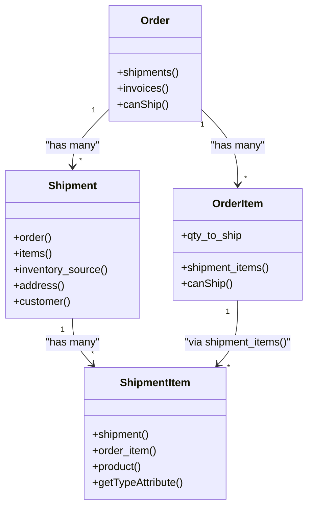
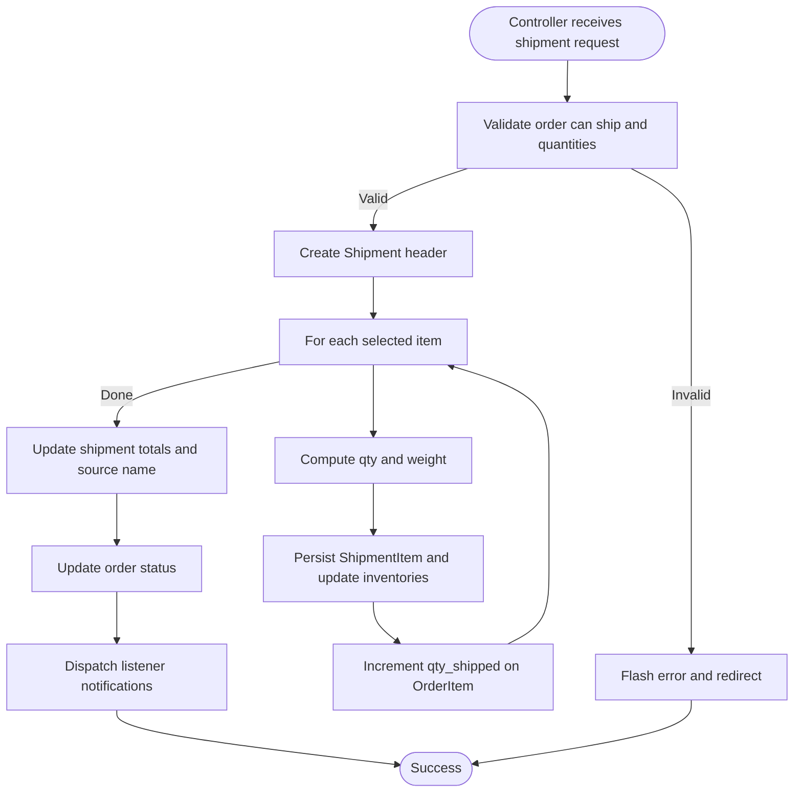
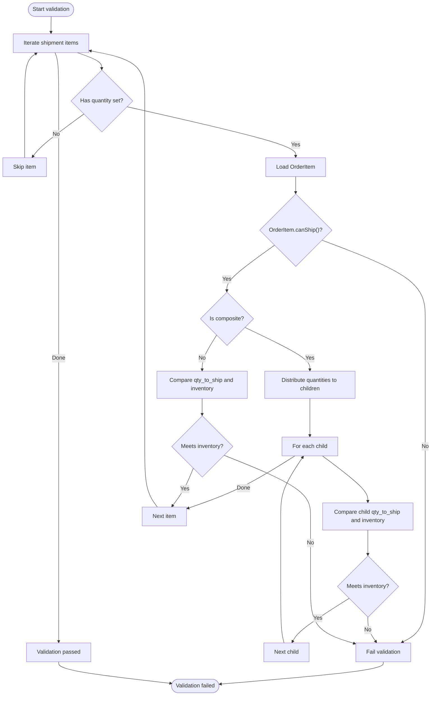
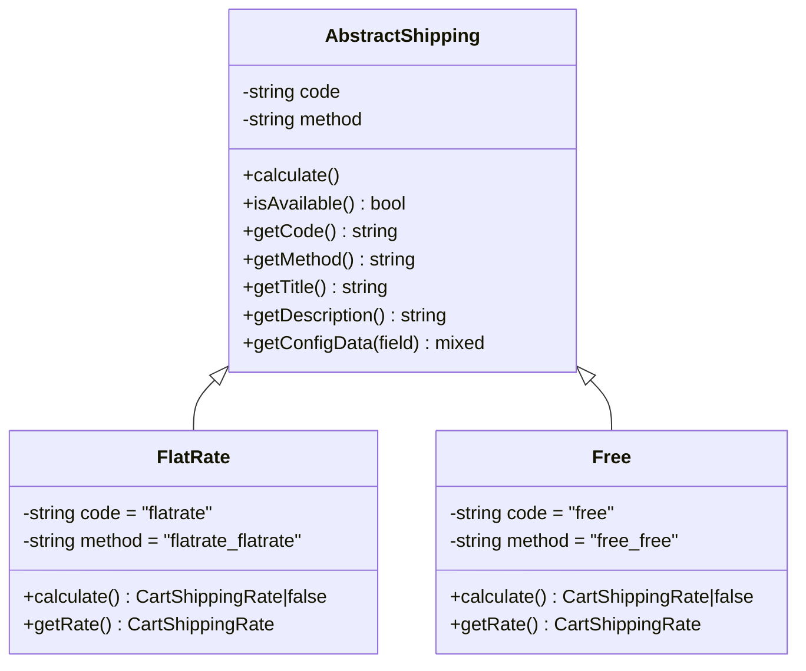
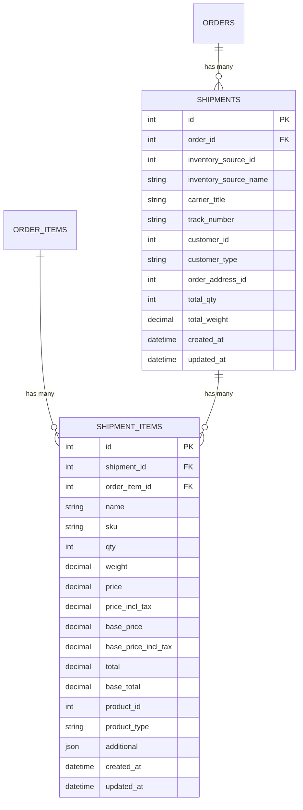
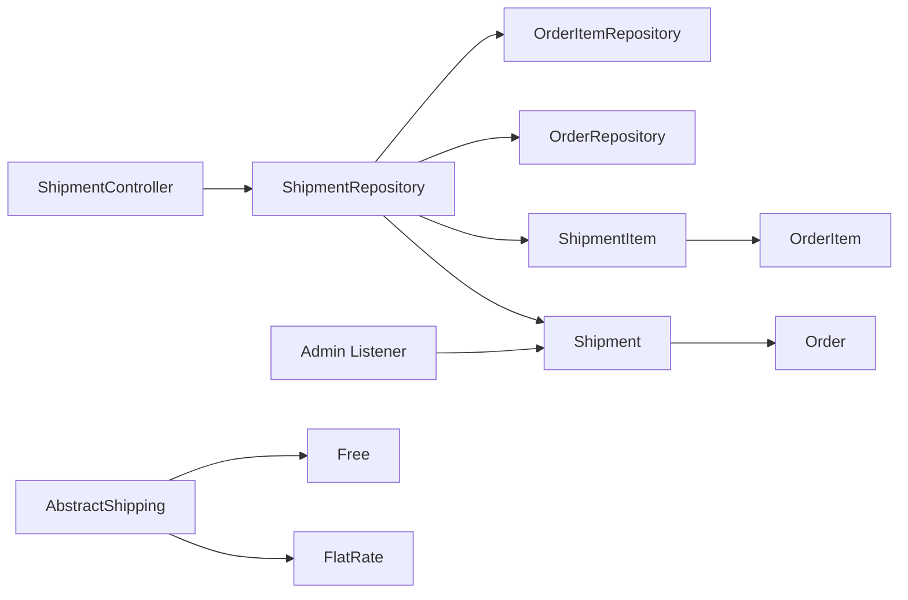

# Shipment Processing

<cite>
**Referenced Files in This Document**
- [Shipment.php](file://packages/Webkul/Sales/src/Models/Shipment.php)
- [ShipmentItem.php](file://packages/Webkul/Sales/src/Models/ShipmentItem.php)
- [Order.php](file://packages/Webkul/Sales/src/Models/Order.php)
- [OrderItem.php](file://packages/Webkul/Sales/src/Models/OrderItem.php)
- [ShipmentRepository.php](file://packages/Webkul/Sales/src/Repositories/ShipmentRepository.php)
- [ShipmentController.php](file://packages/Webkul/Admin/src/Http/Controllers/Sales/ShipmentController.php)
- [Shipment.php (Admin Listener)](file://packages/Webkul/Admin/src/Listeners/Shipment.php)
- [AbstractShipping.php](file://packages/Webkul/Shipping/src/Carriers/AbstractShipping.php)
- [FlatRate.php](file://packages/Webkul/Shipping/src/Carriers/FlatRate.php)
- [Free.php](file://packages/Webkul/Shipping/src/Carriers/Free.php)
- [2018_09_27_115022_create_shipments_table.php](file://packages/Webkul/Sales/src/Database/Migrations/2018_09_27_115022_create_shipments_table.php)
- [2018_09_27_115029_create_shipment_items_table.php](file://packages/Webkul/Sales/src/Database/Migrations/2018_09_27_115029_create_shipment_items_table.php)
- [2025_05_07_121250_update_total_weight_columns_in_shipments_and_weight_shipment_items_tables.php](file://packages/Webkul/Sales/src/Database/Migrations/2025_05_07_121250_update_total_weight_columns_in_shipments_and_weight_shipment_items_tables.php)
</cite>

## Table of Contents
1. [Introduction](#introduction)
2. [Project Structure](#project-structure)
3. [Core Components](#core-components)
4. [Architecture Overview](#architecture-overview)
5. [Detailed Component Analysis](#detailed-component-analysis)
6. [Dependency Analysis](#dependency-analysis)
7. [Performance Considerations](#performance-considerations)
8. [Troubleshooting Guide](#troubleshooting-guide)
9. [Conclusion](#conclusion)

## Introduction
This document explains the shipment processing system in Frooxi’s e-commerce platform. It covers how shipments are created from orders, how packing slips are generated, and how carriers are integrated. It also documents shipment item tracking, weight calculation, packaging requirements, the relationship between shipments and invoices, shipping cost allocation, status updates, tracking number assignment, delivery confirmation, multi-item and partial fulfillment handling, international shipping considerations, notifications, delivery tracking, and proof of delivery management.

## Project Structure
The shipment processing system spans several modules:
- Sales module: models, repositories, factories, migrations, and listeners for orders, invoices, and shipments
- Admin module: controllers and listeners for administrative actions around shipments
- Shipping module: carrier abstractions and implementations for flat-rate and free shipping

**Diagram sources**
- [Order.php:150-188](file://packages/Webkul/Sales/src/Models/Order.php#L150-L188)
- [OrderItem.php:147-198](file://packages/Webkul/Sales/src/Models/OrderItem.php#L147-L198)
- [Shipment.php:25-64](file://packages/Webkul/Sales/src/Models/Shipment.php#L25-L64)
- [ShipmentItem.php:42-63](file://packages/Webkul/Sales/src/Models/ShipmentItem.php#L42-L63)
- [ShipmentRepository.php:42-149](file://packages/Webkul/Sales/src/Repositories/ShipmentRepository.php#L42-L149)
- [ShipmentController.php:45-93](file://packages/Webkul/Admin/src/Http/Controllers/Sales/ShipmentController.php#L45-L93)
- [Shipment.php (Admin Listener):16-29](file://packages/Webkul/Admin/src/Listeners/Shipment.php#L16-L29)
- [AbstractShipping.php:23-94](file://packages/Webkul/Shipping/src/Carriers/AbstractShipping.php#L23-L94)
- [FlatRate.php:29-68](file://packages/Webkul/Shipping/src/Carriers/FlatRate.php#L29-L68)
- [Free.php:28-53](file://packages/Webkul/Shipping/src/Carriers/Free.php#L28-L53)

**Section sources**
- [Shipment.php:15-73](file://packages/Webkul/Sales/src/Models/Shipment.php#L15-L73)
- [ShipmentItem.php:8-72](file://packages/Webkul/Sales/src/Models/ShipmentItem.php#L8-L72)
- [Order.php:150-188](file://packages/Webkul/Sales/src/Models/Order.php#L150-L188)
- [OrderItem.php:147-198](file://packages/Webkul/Sales/src/Models/OrderItem.php#L147-L198)
- [ShipmentRepository.php:42-149](file://packages/Webkul/Sales/src/Repositories/ShipmentRepository.php#L42-L149)
- [ShipmentController.php:45-93](file://packages/Webkul/Admin/src/Http/Controllers/Sales/ShipmentController.php#L45-L93)
- [Shipment.php (Admin Listener):16-29](file://packages/Webkul/Admin/src/Listeners/Shipment.php#L16-L29)
- [AbstractShipping.php:23-94](file://packages/Webkul/Shipping/src/Carriers/AbstractShipping.php#L23-L94)
- [FlatRate.php:29-68](file://packages/Webkul/Shipping/src/Carriers/FlatRate.php#L29-L68)
- [Free.php:28-53](file://packages/Webkul/Shipping/src/Carriers/Free.php#L28-L53)

## Core Components
- Shipment: represents a physical dispatch against an order, linking to order, items, inventory source, and shipping address
- ShipmentItem: records per-product quantities shipped, pricing, and product linkage
- Order and OrderItem: define the order state, eligibility to ship, remaining quantities, and relationships to invoices and shipments
- ShipmentRepository: orchestrates shipment creation, inventory updates, totals computation, and order status transitions
- ShipmentController: validates inventory availability, persists shipment data, and redirects to order view
- Admin Listener: sends shipment-related notifications to admins and inventory sources
- Carriers: AbstractShipping defines carrier interface; FlatRate and Free implement shipping cost calculation

Key responsibilities:
- Validate inventory availability and composite product composition before creating a shipment
- Compute total quantity and total weight for the shipment
- Persist shipment items and update order item shipped quantities
- Update order status based on invoice state
- Dispatch notifications upon shipment creation

**Section sources**
- [Shipment.php:15-73](file://packages/Webkul/Sales/src/Models/Shipment.php#L15-L73)
- [ShipmentItem.php:8-72](file://packages/Webkul/Sales/src/Models/ShipmentItem.php#L8-L72)
- [Order.php:314-329](file://packages/Webkul/Sales/src/Models/Order.php#L314-L329)
- [OrderItem.php:75-98](file://packages/Webkul/Sales/src/Models/OrderItem.php#L75-L98)
- [ShipmentRepository.php:42-149](file://packages/Webkul/Sales/src/Repositories/ShipmentRepository.php#L42-L149)
- [ShipmentController.php:101-160](file://packages/Webkul/Admin/src/Http/Controllers/Sales/ShipmentController.php#L101-L160)
- [Shipment.php (Admin Listener):16-29](file://packages/Webkul/Admin/src/Listeners/Shipment.php#L16-L29)
- [AbstractShipping.php:23-94](file://packages/Webkul/Shipping/src/Carriers/AbstractShipping.php#L23-L94)

## Architecture Overview
The shipment lifecycle begins when an administrator initiates a shipment from an order. The controller validates requested quantities against order item availability and inventory sources. The repository creates the shipment header, iterates over selected items, computes totals, persists shipment items, updates inventories, and adjusts order item shipped quantities. Finally, it updates the order status and triggers listeners for notifications.

**Diagram sources**
- [ShipmentController.php:63-93](file://packages/Webkul/Admin/src/Http/Controllers/Sales/ShipmentController.php#L63-L93)
- [ShipmentRepository.php:42-149](file://packages/Webkul/Sales/src/Repositories/ShipmentRepository.php#L42-L149)
- [Order.php:314-329](file://packages/Webkul/Sales/src/Models/Order.php#L314-L329)
- [OrderItem.php:75-98](file://packages/Webkul/Sales/src/Models/OrderItem.php#L75-L98)
- [Shipment.php (Admin Listener):16-29](file://packages/Webkul/Admin/src/Listeners/Shipment.php#L16-L29)

## Detailed Component Analysis

### Shipment and ShipmentItem Models
These models define the shipment entity and per-item records. Shipment links to the originating order, inventory source, shipping address, and customer. ShipmentItem links to the shipment, the original order item, and the product, and exposes computed attributes via the order item.

**Diagram sources**
- [Order.php:184-188](file://packages/Webkul/Sales/src/Models/Order.php#L184-L188)
- [OrderItem.php:194-198](file://packages/Webkul/Sales/src/Models/OrderItem.php#L194-L198)
- [Shipment.php:28-64](file://packages/Webkul/Sales/src/Models/Shipment.php#L28-L64)
- [ShipmentItem.php:44-71](file://packages/Webkul/Sales/src/Models/ShipmentItem.php#L44-L71)

**Section sources**
- [Shipment.php:15-73](file://packages/Webkul/Sales/src/Models/Shipment.php#L15-L73)
- [ShipmentItem.php:8-72](file://packages/Webkul/Sales/src/Models/ShipmentItem.php#L8-L72)
- [Order.php:184-188](file://packages/Webkul/Sales/src/Models/Order.php#L184-L188)
- [OrderItem.php:194-198](file://packages/Webkul/Sales/src/Models/OrderItem.php#L194-L198)

### Shipment Creation Workflow
The controller validates that the order can ship and that requested quantities are valid against inventory. The repository performs the following steps:
- Create the shipment header with carrier title, tracking number, customer info, shipping address, and inventory source
- Iterate over items, compute quantities and weights, persist shipment items, and update inventories
- Update shipment totals and inventory source name
- Transition order status depending on open invoices
- Emit events for post-save actions

**Diagram sources**
- [ShipmentController.php:63-93](file://packages/Webkul/Admin/src/Http/Controllers/Sales/ShipmentController.php#L63-L93)
- [ShipmentRepository.php:42-149](file://packages/Webkul/Sales/src/Repositories/ShipmentRepository.php#L42-L149)
- [Shipment.php (Admin Listener):16-29](file://packages/Webkul/Admin/src/Listeners/Shipment.php#L16-L29)

**Section sources**
- [ShipmentController.php:63-93](file://packages/Webkul/Admin/src/Http/Controllers/Sales/ShipmentController.php#L63-L93)
- [ShipmentRepository.php:42-149](file://packages/Webkul/Sales/src/Repositories/ShipmentRepository.php#L42-L149)

### Inventory Validation Logic
The controller ensures:
- Requested quantities do not exceed remaining quantities to ship
- Composite products distribute quantities proportionally to children
- Available inventory at the selected source meets requested quantities

**Diagram sources**
- [ShipmentController.php:101-160](file://packages/Webkul/Admin/src/Http/Controllers/Sales/ShipmentController.php#L101-L160)

**Section sources**
- [ShipmentController.php:101-160](file://packages/Webkul/Admin/src/Http/Controllers/Sales/ShipmentController.php#L101-L160)

### Carrier Integration
Carriers implement a common interface to calculate shipping costs. The abstract class provides configuration retrieval, availability checks, and method codes. Concrete carriers (FlatRate, Free) compute rates based on configuration and cart contents.

**Diagram sources**
- [AbstractShipping.php:7-95](file://packages/Webkul/Shipping/src/Carriers/AbstractShipping.php#L7-L95)
- [FlatRate.php:8-68](file://packages/Webkul/Shipping/src/Carriers/FlatRate.php#L8-L68)
- [Free.php:7-53](file://packages/Webkul/Shipping/src/Carriers/Free.php#L7-L53)

**Section sources**
- [AbstractShipping.php:23-94](file://packages/Webkul/Shipping/src/Carriers/AbstractShipping.php#L23-L94)
- [FlatRate.php:29-68](file://packages/Webkul/Shipping/src/Carriers/FlatRate.php#L29-L68)
- [Free.php:28-53](file://packages/Webkul/Shipping/src/Carriers/Free.php#L28-L53)

### Database Schema and Weight Updates
The shipment and shipment items tables capture shipment metadata and per-item details. A recent migration updated total weight columns to support accurate weight tracking.

**Diagram sources**
- [2018_09_27_115022_create_shipments_table.php](file://packages/Webkul/Sales/src/Database/Migrations/2018_09_27_115022_create_shipments_table.php)
- [2018_09_27_115029_create_shipment_items_table.php](file://packages/Webkul/Sales/src/Database/Migrations/2018_09_27_115029_create_shipment_items_table.php)
- [2025_05_07_121250_update_total_weight_columns_in_shipments_and_weight_shipment_items_tables.php](file://packages/Webkul/Sales/src/Database/Migrations/2025_05_07_121250_update_total_weight_columns_in_shipments_and_weight_shipment_items_tables.php)

**Section sources**
- [2018_09_27_115022_create_shipments_table.php](file://packages/Webkul/Sales/src/Database/Migrations/2018_09_27_115022_create_shipments_table.php)
- [2018_09_27_115029_create_shipment_items_table.php](file://packages/Webkul/Sales/src/Database/Migrations/2018_09_27_115029_create_shipment_items_table.php)
- [2025_05_07_121250_update_total_weight_columns_in_shipments_and_weight_shipment_items_tables.php](file://packages/Webkul/Sales/src/Database/Migrations/2025_05_07_121250_update_total_weight_columns_in_shipments_and_weight_shipment_items_tables.php)

## Dependency Analysis
- Shipment depends on Order, ShipmentItem, InventorySource, OrderAddress, and polymorphic customer
- ShipmentItem depends on Shipment, OrderItem, and Product
- ShipmentRepository depends on OrderRepository, OrderItemRepository, ShipmentItemRepository, and encapsulates transactional creation
- ShipmentController depends on repositories and validates input before delegating to the repository
- Admin Listener reacts to shipment creation to send notifications
- Carriers depend on configuration and cart context to compute rates

**Diagram sources**
- [ShipmentController.php:20-24](file://packages/Webkul/Admin/src/Http/Controllers/Sales/ShipmentController.php#L20-L24)
- [ShipmentRepository.php:19-26](file://packages/Webkul/Sales/src/Repositories/ShipmentRepository.php#L19-L26)
- [Shipment.php:28-64](file://packages/Webkul/Sales/src/Models/Shipment.php#L28-L64)
- [ShipmentItem.php:44-63](file://packages/Webkul/Sales/src/Models/ShipmentItem.php#L44-L63)
- [Shipment.php (Admin Listener):16-29](file://packages/Webkul/Admin/src/Listeners/Shipment.php#L16-L29)
- [AbstractShipping.php:23-94](file://packages/Webkul/Shipping/src/Carriers/AbstractShipping.php#L23-L94)
- [FlatRate.php:29-68](file://packages/Webkul/Shipping/src/Carriers/FlatRate.php#L29-L68)
- [Free.php:28-53](file://packages/Webkul/Shipping/src/Carriers/Free.php#L28-L53)

**Section sources**
- [ShipmentController.php:20-24](file://packages/Webkul/Admin/src/Http/Controllers/Sales/ShipmentController.php#L20-L24)
- [ShipmentRepository.php:19-26](file://packages/Webkul/Sales/src/Repositories/ShipmentRepository.php#L19-L26)
- [Shipment.php:28-64](file://packages/Webkul/Sales/src/Models/Shipment.php#L28-L64)
- [ShipmentItem.php:44-63](file://packages/Webkul/Sales/src/Models/ShipmentItem.php#L44-L63)
- [Shipment.php (Admin Listener):16-29](file://packages/Webkul/Admin/src/Listeners/Shipment.php#L16-L29)
- [AbstractShipping.php:23-94](file://packages/Webkul/Shipping/src/Carriers/AbstractShipping.php#L23-L94)

## Performance Considerations
- Transactional creation: The repository wraps shipment creation in a database transaction to maintain consistency during inventory updates and order status changes.
- Batch inventory updates: Inventory adjustments are performed per item and per child for composite products, minimizing redundant queries by leveraging existing loaded relationships.
- Totals computation: Total quantity and weight are accumulated during item insertion to avoid additional scans later.
- Event-driven notifications: Listeners are invoked after successful creation, avoiding blocking operations in the main creation flow.

[No sources needed since this section provides general guidance]

## Troubleshooting Guide
Common issues and resolutions:
- Quantity validation failures:
  - Cause: Requested quantity exceeds remaining quantity to ship or available inventory at the selected source
  - Resolution: Adjust quantities or select another inventory source; ensure composite product distribution logic is satisfied
- Order cannot ship:
  - Cause: Order status closed or fraud, or items are not eligible to ship
  - Resolution: Verify order status and item stockability; only stockable items with positive remaining quantities can be shipped
- Missing tracking number or carrier title:
  - Cause: Missing data in the shipment payload
  - Resolution: Ensure carrier title and tracking number are provided when creating the shipment
- Order status not updating:
  - Cause: Open invoices prevent automatic completion
  - Resolution: Confirm invoice state; the system sets order status accordingly

**Section sources**
- [ShipmentController.php:101-160](file://packages/Webkul/Admin/src/Http/Controllers/Sales/ShipmentController.php#L101-L160)
- [Order.php:314-329](file://packages/Webkul/Sales/src/Models/Order.php#L314-L329)
- [OrderItem.php:75-98](file://packages/Webkul/Sales/src/Models/OrderItem.php#L75-L98)
- [ShipmentRepository.php:131-137](file://packages/Webkul/Sales/src/Repositories/ShipmentRepository.php#L131-L137)

## Conclusion
Frooxi’s shipment processing system integrates order management, inventory validation, and carrier configuration to reliably create shipments. It supports multi-item and composite product scenarios, tracks weight and quantities, and updates order statuses appropriately. Administrative notifications are dispatched upon shipment creation, and the modular design allows easy extension with additional carriers and fulfillment workflows.