# Customer Experience & Interaction

<cite>
**Referenced Files in This Document**
- [SessionController.php](file://packages/Webkul/Shop/src/Http/Controllers/Customer/SessionController.php)
- [OnepageController.php](file://packages/Webkul/Shop/src/Http/Controllers/OnepageController.php)
- [Cart.php](file://packages/Webkul/Checkout/src/Cart.php)
- [Customer.php](file://packages/Webkul/Customer/src/Models/Customer.php)
- [WishlistController.php](file://packages/Webkul/Shop/src/Http/Controllers/Customer/Account/WishlistController.php)
- [OrderController.php](file://packages/Webkul/Shop/src/Http/Controllers/Customer/Account/OrderController.php)
- [AddressController.php](file://packages/Webkul/Shop/src/Http/Controllers/Customer/Account/AddressController.php)
- [Theme.php](file://packages/Webkul/Theme/src/Theme.php)
- [system.php](file://packages/Webkul/Admin/src/Config/system.php)
- [ConfigTableSeeder.php](file://packages/Webkul/Installer/src/Database/Seeders/Core/ConfigTableSeeder.php)
- [notification.spec.ts](file://packages/Webkul/Admin/tests/e2e-pw/tests/configuration/email/notification.spec.ts)
- [settings.spec.ts](file://packages/Webkul/Admin/tests/e2e-pw/tests/configuration/customer/settings.spec.ts)
- [auth.spec.ts](file://packages/Webkul/Shop/tests/e2e-pw/tests/auth.spec.ts)
- [customer.spec.ts](file://packages/Webkul/Shop/tests/e2e-pw/tests/customer.spec.ts)
- [WishlistTest.php](file://packages/Webkul/Shop/tests/Feature/Customers/WishlistTest.php)
- [index.blade.php](file://packages/Webkul/Shop/src/Resources/views/compare/index.blade.php)
- [2023_05_26_213120_create_compare_items_table.php](file://packages/Webkul/Customer/src/Database/Migrations/2023_05_26_213120_create_compare_items_table.php)
- [CompareItem.php](file://packages/Webkul/Customer/src/Contracts/CompareItem.php)
- [CompareItemProxy.php](file://packages/Webkul/Customer/src/Models/CompareItemProxy.php)
- [category-tabs.blade.php](file://packages/Webkul/Shop/src/Resources/views/components/categories/category-tabs.blade.php)
- [view.blade.php](file://packages/Webkul/Shop/src/Resources/views/categories/view.blade.php)
- [drawer.blade.php](file://packages/Webkul/Shop/src/Resources/views/components/drawer/index.blade.php)
- [bottom.blade.php](file://packages/Webkul/Shop/src/Resources/views/components/layouts/header/desktop/bottom.blade.php)
- [results.blade.php](file://packages/Webkul/Shop/src/Resources/views/search/images/results.blade.php)
- [card.blade.php](file://packages/Webkul/Shop/src/Resources/views/components/products/card.blade.php)
- [shop.js](file://packages/Webkul/Shop/src/Resources/assets/js/plugins/shop.js)
- [index.blade.php](file://packages/Webkul/Shop/src/Resources/views/components/layouts/index.blade.php)
- [view.blade.php](file://packages/Webkul/Shop/src/Resources/views/products/view.blade.php)
- [index.blade.php](file://storage/framework/views/7415f2863d273a3942f838763f8dad26.php)
- [dbf69baef508b5f080e2413c84a0639f.php](file://storage/framework/views/dbf69baef508b5f080e2413c84a0639f.php)
- [2fae6bdcdc397f4bc6e8fb6631052bd2.php](file://storage/framework/views/2fae6bdcdc397f4bc6e8fb6631052bd2.php)
- [gallery.mobile.blade.php](file://packages/Webkul/Shop/src/Resources/views/products/view/gallery/mobile.blade.php)
</cite>

## Update Summary
**Changes Made**
- Added new WhatsApp floating action button (FAB) for customer service with responsive design
- Enhanced header adaptive styling system with homepage-aware color schemes and fixed positioning
- Improved mobile-responsive design patterns with device-specific optimizations
- Integrated WhatsApp sharing functionality in product views and layouts
- Added adaptive header styling that responds to scroll and page context

## Table of Contents
1. [Introduction](#introduction)
2. [Project Structure](#project-structure)
3. [Core Components](#core-components)
4. [Architecture Overview](#architecture-overview)
5. [Detailed Component Analysis](#detailed-component-analysis)
6. [Dependency Analysis](#dependency-analysis)
7. [Performance Considerations](#performance-considerations)
8. [Troubleshooting Guide](#troubleshooting-guide)
9. [Conclusion](#conclusion)
10. [Appendices](#appendices)

## Introduction
This document explains the customer-facing features and user interaction patterns in the system, focusing on account management, authentication, profile editing, shopping cart and checkout, order tracking/history, communication via email notifications and support, customer segments, wishlists, product comparison, and user experience optimization including mobile responsiveness and accessibility. It synthesizes behavior from controllers, repositories, models, configuration, and tests to present a practical guide for developers and stakeholders.

**Updated** Enhanced with new WhatsApp floating action button for customer service, improved header adaptive styling system, and advanced mobile-responsive design patterns.

## Project Structure
The customer experience spans several modules:
- Authentication and session handling under the Shop module
- Shopping cart and checkout logic under the Checkout module
- Customer account features (orders, addresses, wishlists) under Shop
- Email notification configuration under Admin configuration
- Theme and asset pipeline for responsive UI under Theme
- Tests validating end-to-end flows for auth, customer actions, and configuration

```mermaid
graph TB
subgraph "Shop Module"
SC["SessionController<br/>Login/Logout"]
OPC["OnepageController<br/>Checkout Page"]
WCtrl["WishlistController<br/>Wishlist Listing"]
OCtrl["OrderController<br/>Orders & History"]
ACtrl["AddressController<br/>Customer Addresses"]
PC["Product Cards<br/>Enhanced Navigation"]
DC["Drawer Components<br/>Escape Key Support"]
WHATSAPP["WhatsApp FAB<br/>Customer Service"]
END
subgraph "Checkout Module"
Cart["Cart<br/>Cart Operations"]
end
subgraph "Customer Module"
Cust["Customer Model<br/>Relations & Links"]
WL["Wishlist Items"]
CMP["Compare Items"]
end
subgraph "Admin Config"
SysCfg["Admin System Config<br/>Email & Features"]
Seed["ConfigTableSeeder<br/>Defaults"]
end
subgraph "Theme"
Theme["Theme<br/>Assets & Vite"]
Header["Adaptive Header Styling<br/>Scroll & Context Awareness"]
Mobile["Mobile Responsive Patterns<br/>Device-Specific Optimizations"]
end
SC --> Cart
OPC --> Cart
WCtrl --> WL
OCtrl --> Cust
ACtrl --> Cust
Cart --> WL
SysCfg --> SC
Seed --> SysCfg
Theme --> SC
PC --> DC
Header --> WHATSAPP
Mobile --> WHATSAPP
```

**Diagram sources**
- [SessionController.php:13-94](file://packages/Webkul/Shop/src/Http/Controllers/Customer/SessionController.php#L13-L94)
- [OnepageController.php:12-51](file://packages/Webkul/Shop/src/Http/Controllers/OnepageController.php#L12-L51)
- [Cart.php:25-800](file://packages/Webkul/Checkout/src/Cart.php#L25-L800)
- [Customer.php:25-307](file://packages/Webkul/Customer/src/Models/Customer.php#L25-L307)
- [WishlistController.php:8-23](file://packages/Webkul/Shop/src/Http/Controllers/Customer/Account/WishlistController.php#L8-L23)
- [OrderController.php:14-135](file://packages/Webkul/Shop/src/Http/Controllers/Customer/Account/OrderController.php#L14-L135)
- [AddressController.php:12-201](file://packages/Webkul/Shop/src/Http/Controllers/Customer/Account/AddressController.php#L12-L201)
- [category-tabs.blade.php:733](file://packages/Webkul/Shop/src/Resources/views/components/categories/category-tabs.blade.php#L733)
- [view.blade.php:1146](file://packages/Webkul/Shop/src/Resources/views/categories/view.blade.php#L1146)
- [drawer.blade.php:150](file://packages/Webkul/Shop/src/Resources/views/components/drawer/index.blade.php#L150)
- [system.php:1450-1477](file://packages/Webkul/Admin/src/Config/system.php#L1450-L1477)
- [ConfigTableSeeder.php:55-126](file://packages/Webkul/Installer/src/Database/Seeders/Core/ConfigTableSeeder.php#L55-L126)
- [Theme.php:7-117](file://packages/Webkul/Theme/src/Theme.php#L7-L117)
- [index.blade.php:273-282](file://packages/Webkul/Shop/src/Resources/views/components/layouts/index.blade.php#L273-L282)
- [bottom.blade.php:144-154](file://packages/Webkul/Shop/src/Resources/views/components/layouts/header/desktop/bottom.blade.php#L144-L154)

**Section sources**
- [SessionController.php:13-94](file://packages/Webkul/Shop/src/Http/Controllers/Customer/SessionController.php#L13-L94)
- [Cart.php:25-800](file://packages/Webkul/Checkout/src/Cart.php#L25-L800)
- [Customer.php:25-307](file://packages/Webkul/Customer/src/Models/Customer.php#L25-L307)
- [system.php:1450-1477](file://packages/Webkul/Admin/src/Config/system.php#L1450-L1477)

## Core Components
- Authentication and session lifecycle: Login, logout, verification flow, and redirection rules.
- Shopping cart: Add/remove/update items, address saving, shipping/payment selection, coupon handling, and cross-module events.
- Customer account: Orders listing/view/cancel/reorder, invoices, addresses CRUD, and profile-related actions.
- Wishlists and compare: Wishlist listing gated by configuration, move-to-cart, and guest/non-customer compare persistence.
- Communication: Email notification toggles and defaults, contact email configuration, and new WhatsApp customer service integration.
- UX: Theme asset resolution and Vite integration for responsive builds.
- **Enhanced Product Navigation**: Dynamic URL generation for product cards with improved click handling and cross-platform compatibility.
- **Accessibility**: Drawer components now support escape key functionality for better keyboard navigation.
- **WhatsApp Customer Service**: Floating action button for instant customer support via WhatsApp with responsive design.
- **Adaptive Header Styling**: Homepage-aware color schemes, fixed positioning, and scroll-responsive header behavior.
- **Mobile Responsive Patterns**: Device-specific optimizations with adaptive grid layouts and touch-friendly interfaces.

**Section sources**
- [SessionController.php:13-94](file://packages/Webkul/Shop/src/Http/Controllers/Customer/SessionController.php#L13-L94)
- [Cart.php:25-800](file://packages/Webkul/Checkout/src/Cart.php#L25-L800)
- [OrderController.php:14-135](file://packages/Webkul/Shop/src/Http/Controllers/Customer/Account/OrderController.php#L14-L135)
- [AddressController.php:12-201](file://packages/Webkul/Shop/src/Http/Controllers/Customer/Account/AddressController.php#L12-L201)
- [WishlistController.php:8-23](file://packages/Webkul/Shop/src/Http/Controllers/Customer/Account/WishlistController.php#L8-L23)
- [system.php:1450-1477](file://packages/Webkul/Admin/src/Config/system.php#L1450-L1477)
- [Theme.php:7-117](file://packages/Webkul/Theme/src/Theme.php#L7-L117)
- [category-tabs.blade.php:733](file://packages/Webkul/Shop/src/Resources/views/components/categories/category-tabs.blade.php#L733)
- [view.blade.php:1146](file://packages/Webkul/Shop/src/Resources/views/categories/view.blade.php#L1146)
- [drawer.blade.php:150](file://packages/Webkul/Shop/src/Resources/views/components/drawer/index.blade.php#L150)
- [index.blade.php:273-282](file://packages/Webkul/Shop/src/Resources/views/components/layouts/index.blade.php#L273-L282)
- [bottom.blade.php:144-154](file://packages/Webkul/Shop/src/Resources/views/components/layouts/header/desktop/bottom.blade.php#L144-L154)

## Architecture Overview
The customer experience is orchestrated by controllers that delegate to repositories and models, with configuration-driven behavior and event hooks for extensibility.

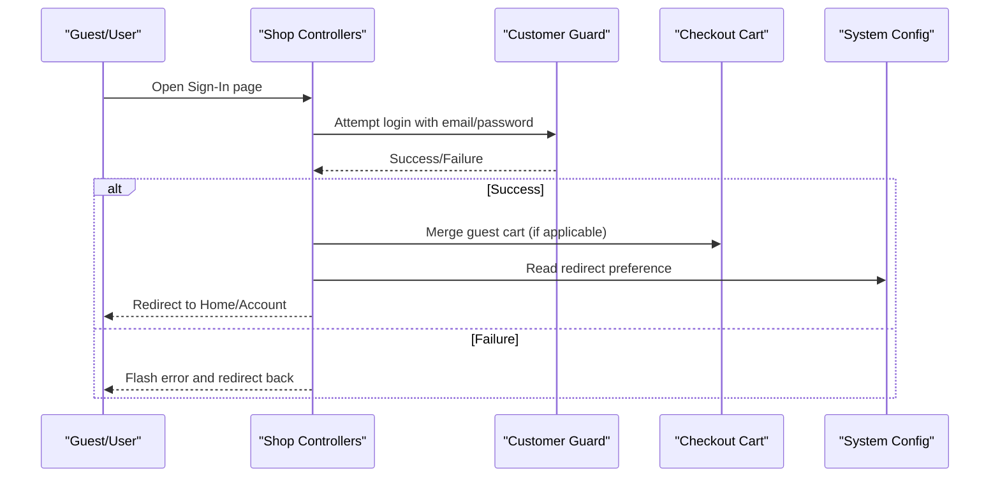

**Diagram sources**
- [SessionController.php:34-76](file://packages/Webkul/Shop/src/Http/Controllers/Customer/SessionController.php#L34-L76)
- [Cart.php:211-254](file://packages/Webkul/Checkout/src/Cart.php#L211-L254)
- [system.php:1450-1477](file://packages/Webkul/Admin/src/Config/system.php#L1450-L1477)

## Detailed Component Analysis

### Authentication and Session Management
- Login validates credentials, checks activation and verification, dispatches post-login events, and redirects according to configuration.
- Logout ends the session and dispatches a post-logout event.
- Guest checkout gating and account suspension checks influence checkout access.

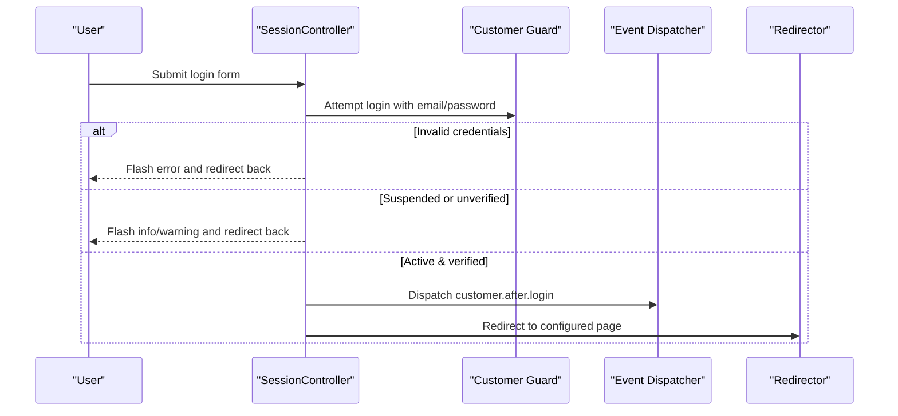

**Diagram sources**
- [SessionController.php:34-76](file://packages/Webkul/Shop/src/Http/Controllers/Customer/SessionController.php#L34-L76)

**Section sources**
- [SessionController.php:13-94](file://packages/Webkul/Shop/src/Http/Controllers/Customer/SessionController.php#L13-L94)

### Enhanced Product Card Navigation
**Updated** Product cards now feature improved dynamic URL generation and enhanced click handling for better user experience.

- Dynamic URL generation ensures proper navigation to product pages regardless of platform or routing differences.
- Click handling prevents navigation interference from CTA buttons and wishlist interactions.
- Cross-platform compatibility achieved through direct window.location manipulation instead of route helper functions.
- Vue-based product cards provide consistent navigation patterns across different product display modes.

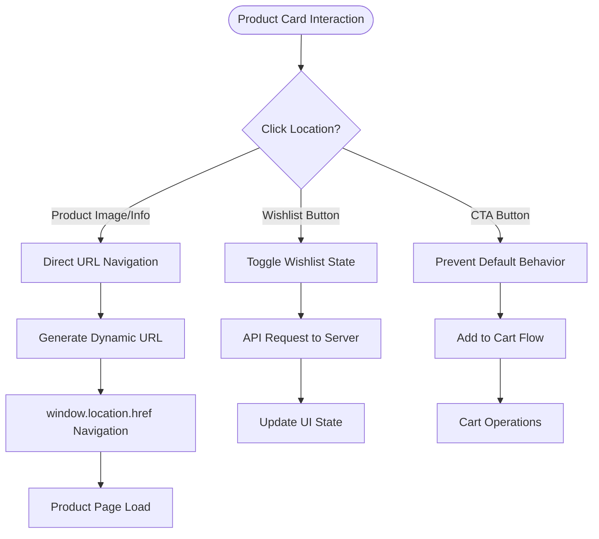

**Diagram sources**
- [category-tabs.blade.php:733](file://packages/Webkul/Shop/src/Resources/views/components/categories/category-tabs.blade.php#L733)
- [view.blade.php:1146](file://packages/Webkul/Shop/src/Resources/views/categories/view.blade.php#L1146)
- [card.blade.php:26](file://packages/Webkul/Shop/src/Resources/views/components/products/card.blade.php#L26)

**Section sources**
- [category-tabs.blade.php:733](file://packages/Webkul/Shop/src/Resources/views/components/categories/category-tabs.blade.php#L733)
- [view.blade.php:1146](file://packages/Webkul/Shop/src/Resources/views/categories/view.blade.php#L1146)
- [card.blade.php:26](file://packages/Webkul/Shop/src/Resources/views/components/products/card.blade.php#L26)

### Enhanced Drawer Components with Accessibility
**Updated** Drawer components now include escape key support for improved keyboard accessibility and cross-platform compatibility.

- Escape key functionality allows users to close drawers using the keyboard.
- Proper event listener management with mount/unmount lifecycle handling.
- Enhanced drawer state management with overflow control and scroll prevention.
- Cross-browser compatibility through direct DOM manipulation instead of framework-specific routing.

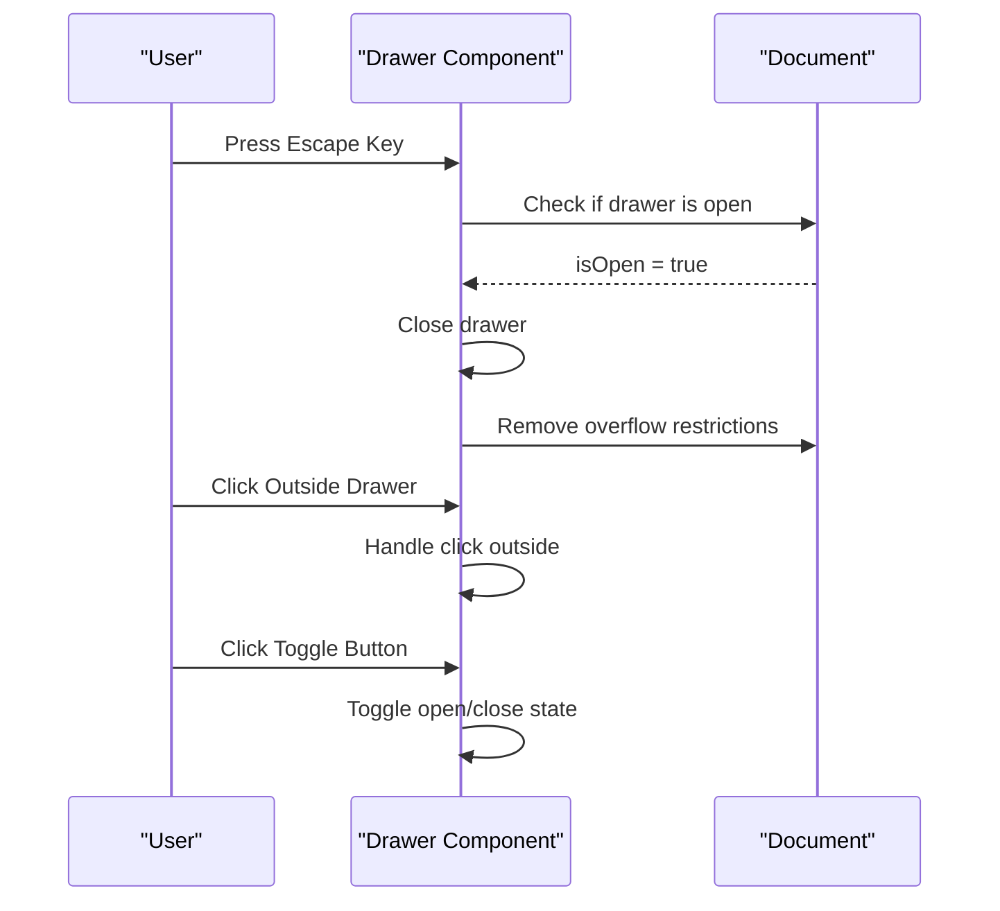

**Diagram sources**
- [drawer.blade.php:150](file://packages/Webkul/Shop/src/Resources/views/components/drawer/index.blade.php#L150)
- [bottom.blade.php:612](file://packages/Webkul/Shop/src/Resources/views/components/layouts/header/desktop/bottom.blade.php#L612)

**Section sources**
- [drawer.blade.php:150](file://packages/Webkul/Shop/src/Resources/views/components/drawer/index.blade.php#L150)
- [bottom.blade.php:612](file://packages/Webkul/Shop/src/Resources/views/components/layouts/header/desktop/bottom.blade.php#L612)

### WhatsApp Floating Action Button (New)
**New** The system now includes a WhatsApp floating action button for instant customer service access.

- Positioned as a fixed element in the bottom-right corner with responsive adjustments for mobile devices.
- Uses WhatsApp Business API (`https://wa.me/`) for direct chat initiation.
- Green color scheme (#25D366) matching WhatsApp branding.
- Hover effects with scaling and enhanced shadow for better user interaction.
- Mobile-optimized with larger dimensions and adjusted positioning for better thumb reach.
- Includes accessibility attributes (aria-label) for screen readers.
- Integrated into both main layout and product view pages for universal access.

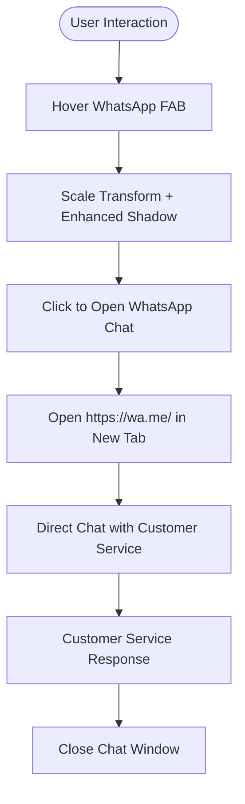

**Diagram sources**
- [index.blade.php:273-282](file://packages/Webkul/Shop/src/Resources/views/components/layouts/index.blade.php#L273-L282)
- [view.blade.php](file://packages/Webkul/Shop/src/Resources/views/products/view.blade.php#L442)
- [index.blade.php:445-454](file://storage/framework/views/7415f2863d273a3942f838763f8dad26.php#L445-L454)

**Section sources**
- [index.blade.php:167-212](file://packages/Webkul/Shop/src/Resources/views/components/layouts/index.blade.php#L167-L212)
- [index.blade.php:273-282](file://packages/Webkul/Shop/src/Resources/views/components/layouts/index.blade.php#L273-L282)
- [view.blade.php](file://packages/Webkul/Shop/src/Resources/views/products/view.blade.php#L442)
- [index.blade.php:201-246](file://storage/framework/views/7415f2863d273a3942f838763f8dad26.php#L201-L246)
- [dbf69baef508b5f080e2413c84a0639f.php:588-590](file://storage/framework/views/dbf69baef508b5f080e2413c84a0639f.php#L588-L590)

### Adaptive Header Styling System (Enhanced)
**Updated** The header system now features adaptive styling that responds to page context and scroll position.

- Homepage-aware color schemes with inverted colors for better contrast on white backgrounds.
- Fixed positioning that activates when scrolling beyond header area.
- Dynamic icon color changes based on page context (white on homepage, black on other pages).
- Smooth transitions and hover effects for navigation elements.
- Category link indicators with contextual color coding.
- Scroll-responsive mega menu positioning with automatic top offset calculation.

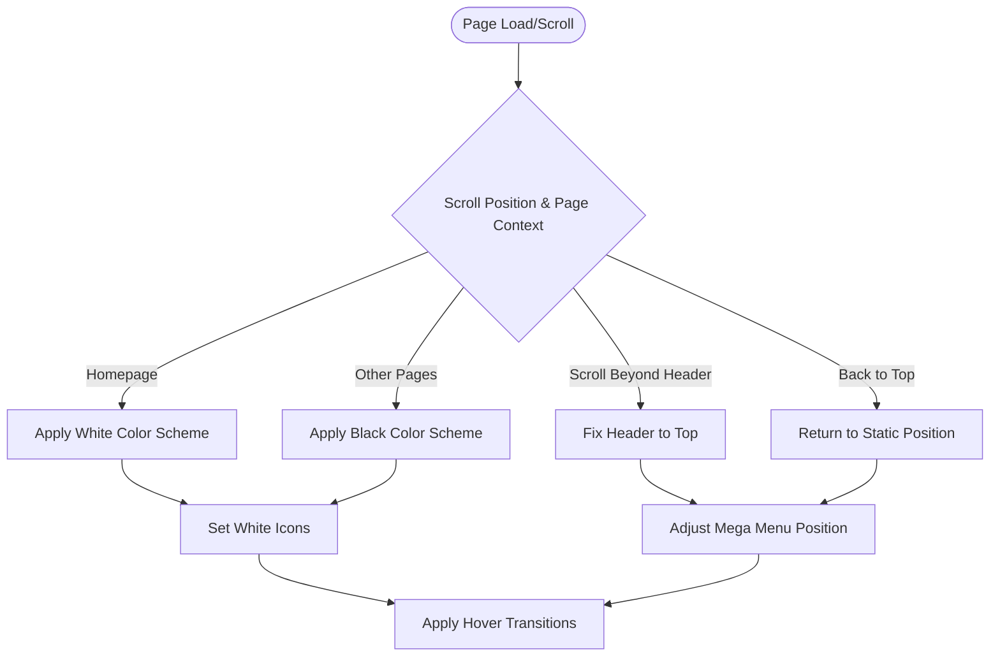

**Diagram sources**
- [bottom.blade.php:144-154](file://packages/Webkul/Shop/src/Resources/views/components/layouts/header/desktop/bottom.blade.php#L144-L154)
- [bottom.blade.php:189-213](file://packages/Webkul/Shop/src/Resources/views/components/layouts/header/desktop/bottom.blade.php#L189-L213)
- [bottom.blade.php:429-436](file://packages/Webkul/Shop/src/Resources/views/components/layouts/header/desktop/bottom.blade.php#L429-L436)

**Section sources**
- [bottom.blade.php:144-154](file://packages/Webkul/Shop/src/Resources/views/components/layouts/header/desktop/bottom.blade.php#L144-L154)
- [bottom.blade.php:189-213](file://packages/Webkul/Shop/src/Resources/views/components/layouts/header/desktop/bottom.blade.php#L189-L213)
- [bottom.blade.php:429-436](file://packages/Webkul/Shop/src/Resources/views/components/layouts/header/desktop/bottom.blade.php#L429-L436)

### Mobile Responsive Design Patterns (Enhanced)
**Updated** The system implements advanced mobile-responsive design patterns with device-specific optimizations.

- Adaptive grid layouts that adjust column counts based on viewport width.
- Touch-friendly interface elements with appropriate sizing and spacing.
- Device-specific media queries for optimal mobile experience.
- Responsive product cards with mobile-optimized CTA buttons.
- Adaptive thumbnail galleries with horizontal scrolling.
- Safe area insets for modern mobile devices with notches.
- Responsive typography and spacing adjustments.

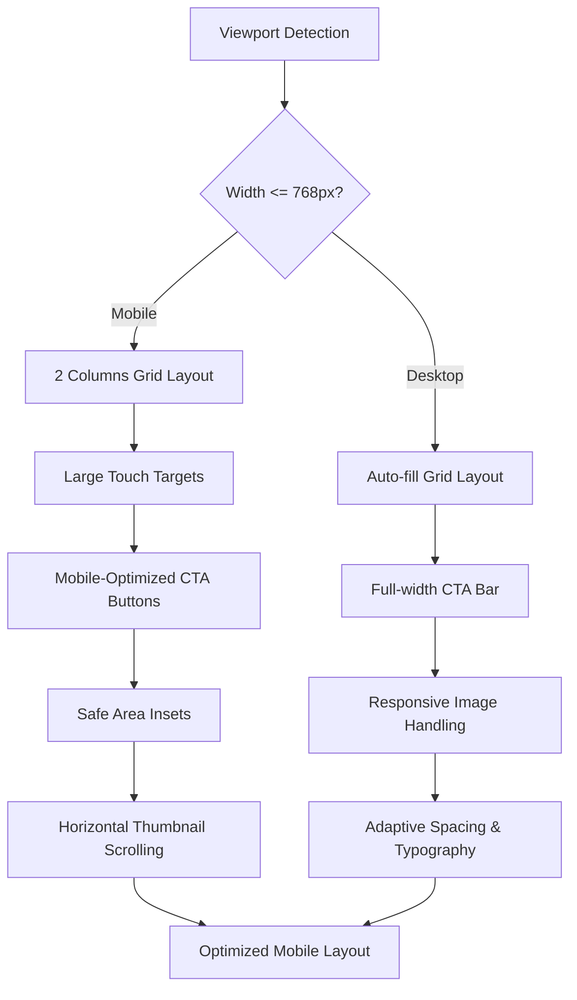

**Diagram sources**
- [view.blade.php:971-997](file://packages/Webkul/Shop/src/Resources/views/categories/view.blade.php#L971-L997)
- [category-tabs.blade.php:643-659](file://packages/Webkul/Shop/src/Resources/views/components/categories/category-tabs.blade.php#L643-L659)
- [gallery.mobile.blade.php:75-110](file://packages/Webkul/Shop/src/Resources/views/products/view/gallery/mobile.blade.php#L75-L110)

**Section sources**
- [view.blade.php:971-997](file://packages/Webkul/Shop/src/Resources/views/categories/view.blade.php#L971-L997)
- [category-tabs.blade.php:643-659](file://packages/Webkul/Shop/src/Resources/views/components/categories/category-tabs.blade.php#L643-L659)
- [gallery.mobile.blade.php:75-110](file://packages/Webkul/Shop/src/Resources/views/products/view/gallery/mobile.blade.php#L75-L110)

### Shopping Cart and Checkout
- Cart initialization supports guest and customer contexts, merges guest cart upon login, and updates totals.
- Address saving enforces billing address presence for shipping and sets customer personnel details.
- Coupon code assignment/removal and shipping/payment method selection are supported.
- Error detection validates inventory sufficiency, minimum order amount, and cart existence.

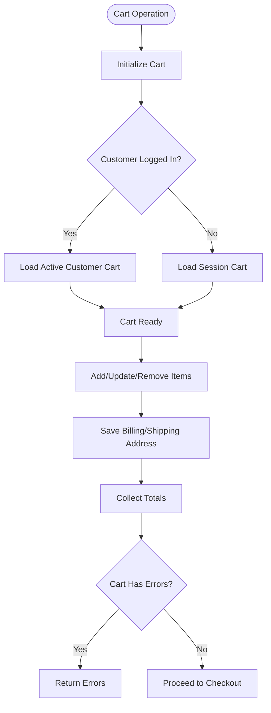

**Diagram sources**
- [Cart.php:70-800](file://packages/Webkul/Checkout/src/Cart.php#L70-L800)

**Section sources**
- [Cart.php:25-800](file://packages/Webkul/Checkout/src/Cart.php#L25-L800)
- [OnepageController.php:12-51](file://packages/Webkul/Shop/src/Http/Controllers/OnepageController.php#L12-L51)

### Customer Account: Orders, Invoices, and Reorders
- Orders listing uses a datagrid for AJAX rendering; individual order view restricts access to the owning customer.
- Reorder duplicates previous items into the cart.
- Invoices can be downloaded as PDFs.
- Cancellation attempts are handled with success/error messaging.

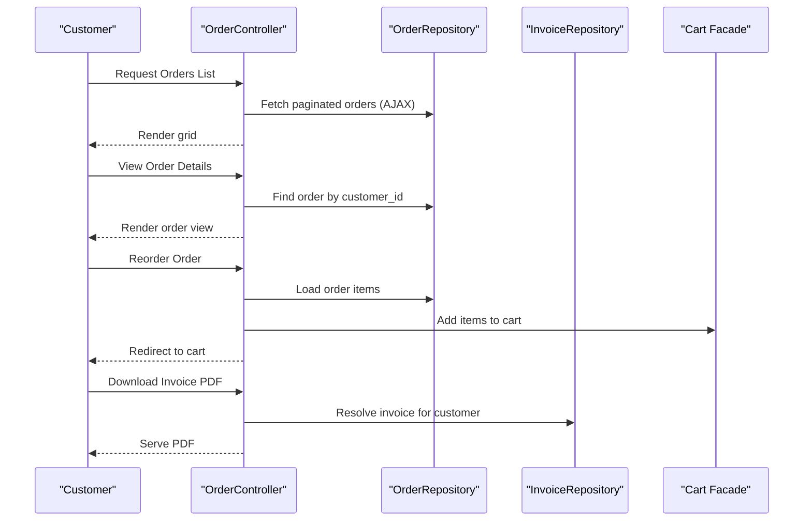

**Diagram sources**
- [OrderController.php:14-135](file://packages/Webkul/Shop/src/Http/Controllers/Customer/Account/OrderController.php#L14-L135)

**Section sources**
- [OrderController.php:14-135](file://packages/Webkul/Shop/src/Http/Controllers/Customer/Account/OrderController.php#L14-L135)

### Customer Account: Addresses
- Addresses listing, creation, editing, default address switching, and deletion are supported with security checks and events.

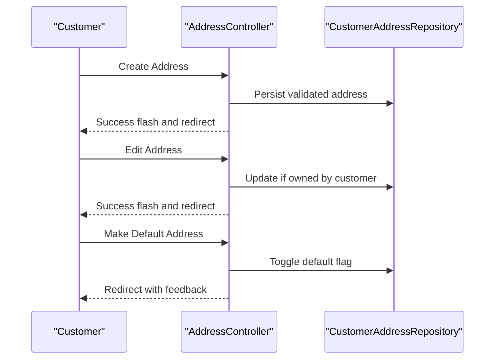

**Diagram sources**
- [AddressController.php:12-201](file://packages/Webkul/Shop/src/Http/Controllers/Customer/Account/AddressController.php#L12-L201)

**Section sources**
- [AddressController.php:12-201](file://packages/Webkul/Shop/src/Http/Controllers/Customer/Account/AddressController.php#L12-L201)

### Customer Account: Profile and Account Actions
- Profile editing and deletion flows are covered by end-to-end tests, including changing passwords and deleting profiles.

**Section sources**
- [customer.spec.ts:341-707](file://packages/Webkul/Shop/tests/e2e-pw/tests/customer.spec.ts#L341-L707)

### Wishlists
- Wishlist listing is gated by configuration; API endpoints support adding, moving to cart, and removing items.
- Tests confirm index retrieval and API listing of wishlist items.

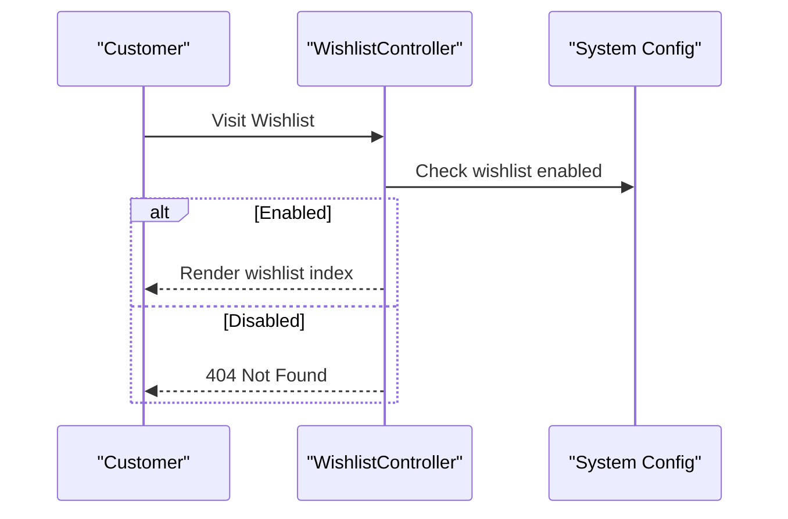

**Diagram sources**
- [WishlistController.php:8-23](file://packages/Webkul/Shop/src/Http/Controllers/Customer/Account/WishlistController.php#L8-L23)

**Section sources**
- [WishlistController.php:8-23](file://packages/Webkul/Shop/src/Http/Controllers/Customer/Account/WishlistController.php#L8-L23)
- [WishlistTest.php:11-104](file://packages/Webkul/Shop/tests/Feature/Customers/WishlistTest.php#L11-L104)

### Compare Functionality
- Compare items are persisted per customer or guest session and rendered via a Vue component that fetches items via API.
- Database schema defines compare items with foreign keys to products and customers.

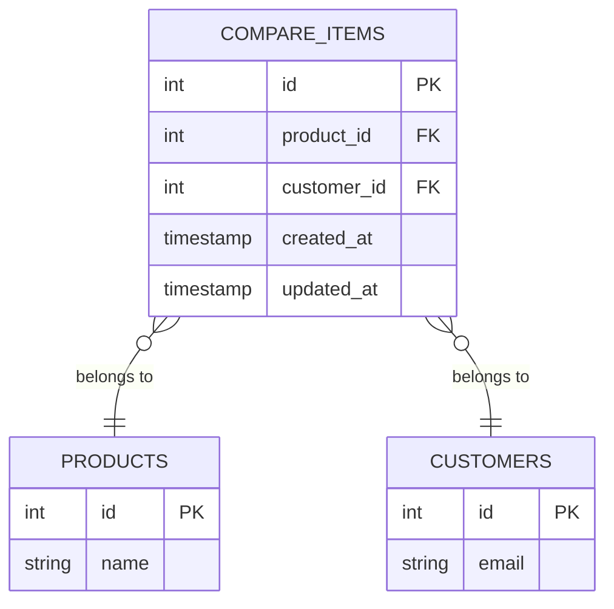

**Diagram sources**
- [2023_05_26_213120_create_compare_items_table.php:14-22](file://packages/Webkul/Customer/src/Database/Migrations/2023_05_26_213120_create_compare_items_table.php#L14-L22)
- [CompareItem.php:1-5](file://packages/Webkul/Customer/src/Contracts/CompareItem.php#L1-L5)
- [CompareItemProxy.php:1-7](file://packages/Webkul/Customer/src/Models/CompareItemProxy.php#L1-L7)

**Section sources**
- [index.blade.php:165-207](file://packages/Webkul/Shop/src/Resources/views/compare/index.blade.php#L165-L207)
- [2023_05_26_213120_create_compare_items_table.php:14-22](file://packages/Webkul/Customer/src/Database/Migrations/2023_05_26_213120_create_compare_items_table.php#L14-L22)

### Customer Segments
- Customer belongs to a group and can be associated with channels; these relations support segmentation and targeted experiences.

**Section sources**
- [Customer.php:149-152](file://packages/Webkul/Customer/src/Models/Customer.php#L149-L152)
- [Customer.php:292-295](file://packages/Webkul/Customer/src/Models/Customer.php#L292-L295)

### Email Notifications and Support
- Admin configuration exposes toggles for registration, order, invoice, refund, shipment, and other notifications.
- Defaults are seeded during installation.
- Tests demonstrate enabling/disabling notification settings.

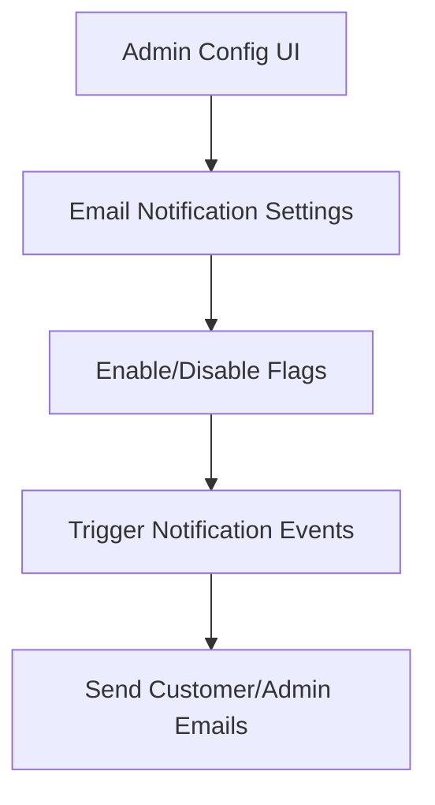

**Diagram sources**
- [system.php:1450-1477](file://packages/Webkul/Admin/src/Config/system.php#L1450-L1477)
- [ConfigTableSeeder.php:55-126](file://packages/Webkul/Installer/src/Database/Seeders/Core/ConfigTableSeeder.php#L55-L126)
- [notification.spec.ts:1-19](file://packages/Webkul/Admin/tests/e2e-pw/tests/configuration/email/notification.spec.ts#L1-L19)

**Section sources**
- [system.php:1450-1477](file://packages/Webkul/Admin/src/Config/system.php#L1450-L1477)
- [ConfigTableSeeder.php:55-126](file://packages/Webkul/Installer/src/Database/Seeders/Core/ConfigTableSeeder.php#L55-L126)
- [notification.spec.ts:1-19](file://packages/Webkul/Admin/tests/e2e-pw/tests/configuration/email/notification.spec.ts#L1-L19)

### Mobile Responsiveness and Accessibility
- Theme integrates Vite for asset bundling and resolves URLs consistently across themes.
- Tailwind and Vite configurations enable responsive design and modern frontend tooling.
- Enhanced accessibility through escape key support in drawer components.
- Cross-platform compatibility through direct window.location manipulation for navigation.
- **WhatsApp Integration**: Floating action button with responsive design and accessibility features.
- **Adaptive Headers**: Context-aware styling that changes based on page location and scroll position.
- **Mobile Optimization**: Device-specific layouts, touch targets, and responsive media handling.

**Section sources**
- [Theme.php:7-117](file://packages/Webkul/Theme/src/Theme.php#L7-L117)
- [drawer.blade.php:150](file://packages/Webkul/Shop/src/Resources/views/components/drawer/index.blade.php#L150)
- [results.blade.php:115](file://packages/Webkul/Shop/src/Resources/views/search/images/results.blade.php#L115)
- [index.blade.php:167-212](file://packages/Webkul/Shop/src/Resources/views/components/layouts/index.blade.php#L167-L212)
- [bottom.blade.php:144-154](file://packages/Webkul/Shop/src/Resources/views/components/layouts/header/desktop/bottom.blade.php#L144-L154)

## Dependency Analysis
Key dependencies and interactions:
- SessionController depends on the customer guard and configuration for redirects.
- Cart orchestrates repositories for items, addresses, and totals; integrates with shipping and payment modules.
- OrderController relies on repositories for orders and invoices; reordering uses Cart facade.
- AddressController uses CustomerAddressRepository and enforces ownership.
- WishlistController gates visibility by configuration; Cart supports move-to-cart and move-from-cart.
- Admin system configuration drives feature flags and notification toggles.
- **Enhanced Product Navigation**: Product cards depend on dynamic URL generation and cross-platform compatibility.
- **Accessibility**: Drawer components rely on escape key event listeners and proper lifecycle management.
- **WhatsApp Integration**: Layout components depend on configuration and asset availability.
- **Adaptive Headers**: Header components rely on scroll detection and context awareness.
- **Mobile Optimization**: Components depend on viewport detection and responsive breakpoints.

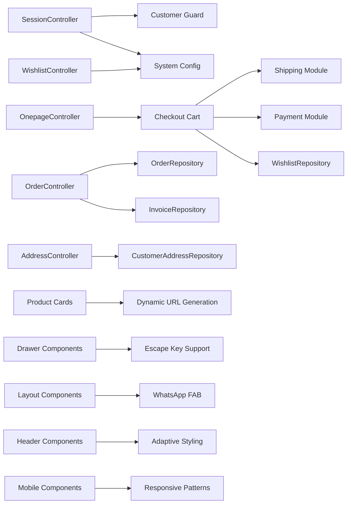

**Diagram sources**
- [SessionController.php:13-94](file://packages/Webkul/Shop/src/Http/Controllers/Customer/SessionController.php#L13-L94)
- [OnepageController.php:12-51](file://packages/Webkul/Shop/src/Http/Controllers/OnepageController.php#L12-L51)
- [Cart.php:25-800](file://packages/Webkul/Checkout/src/Cart.php#L25-L800)
- [OrderController.php:14-135](file://packages/Webkul/Shop/src/Http/Controllers/Customer/Account/OrderController.php#L14-L135)
- [AddressController.php:12-201](file://packages/Webkul/Shop/src/Http/Controllers/Customer/Account/AddressController.php#L12-L201)
- [WishlistController.php:8-23](file://packages/Webkul/Shop/src/Http/Controllers/Customer/Account/WishlistController.php#L8-L23)
- [category-tabs.blade.php:733](file://packages/Webkul/Shop/src/Resources/views/components/categories/category-tabs.blade.php#L733)
- [drawer.blade.php:150](file://packages/Webkul/Shop/src/Resources/views/components/drawer/index.blade.php#L150)
- [index.blade.php:273-282](file://packages/Webkul/Shop/src/Resources/views/components/layouts/index.blade.php#L273-L282)
- [bottom.blade.php:144-154](file://packages/Webkul/Shop/src/Resources/views/components/layouts/header/desktop/bottom.blade.php#L144-L154)

**Section sources**
- [SessionController.php:13-94](file://packages/Webkul/Shop/src/Http/Controllers/Customer/SessionController.php#L13-L94)
- [Cart.php:25-800](file://packages/Webkul/Checkout/src/Cart.php#L25-L800)
- [OrderController.php:14-135](file://packages/Webkul/Shop/src/Http/Controllers/Customer/Account/OrderController.php#L14-L135)
- [AddressController.php:12-201](file://packages/Webkul/Shop/src/Http/Controllers/Customer/Account/AddressController.php#L12-L201)
- [WishlistController.php:8-23](file://packages/Webkul/Shop/src/Http/Controllers/Customer/Account/WishlistController.php#L8-L23)
- [category-tabs.blade.php:733](file://packages/Webkul/Shop/src/Resources/views/components/categories/category-tabs.blade.php#L733)
- [drawer.blade.php:150](file://packages/Webkul/Shop/src/Resources/views/components/drawer/index.blade.php#L150)
- [index.blade.php:273-282](file://packages/Webkul/Shop/src/Resources/views/components/layouts/index.blade.php#L273-L282)
- [bottom.blade.php:144-154](file://packages/Webkul/Shop/src/Resources/views/components/layouts/header/desktop/bottom.blade.php#L144-L154)

## Performance Considerations
- Minimize redundant cart recalculations by batching updates and using collectTotals strategically.
- Use AJAX for datagrids (as seen in orders) to reduce page reload overhead.
- Leverage repository queries with appropriate scopes to avoid N+1 issues in listings.
- Cache frequently accessed configuration flags (e.g., guest checkout, wishlist enablement) to reduce repeated reads.
- **Optimized Product Navigation**: Direct window.location manipulation reduces routing overhead and improves navigation performance across platforms.
- **Enhanced Drawer Performance**: Escape key event listeners are properly managed with lifecycle hooks to prevent memory leaks.
- **WhatsApp FAB Performance**: CSS-only animations with hardware acceleration for smooth hover effects.
- **Adaptive Header Performance**: Efficient scroll event handling with throttled updates and minimal DOM manipulation.
- **Mobile Optimization**: Device-specific optimizations reduce unnecessary calculations and improve rendering performance.

## Troubleshooting Guide
- Login failures: Check invalid credentials messaging and activation/verification states; cookies may be used to trigger resend flows.
- Cart errors: Inspect insufficient quantity, minimum order thresholds, and cart existence; handle error responses gracefully.
- Checkout access: Guest checkout must be enabled; suspended accounts receive warnings and are redirected.
- Orders not visible: Ensure customer ownership checks and AJAX grid rendering are functioning.
- Email notifications: Confirm admin configuration toggles and defaults; tests show enabling/disabling flags.
- **Product Navigation Issues**: Verify dynamic URL generation and ensure window.location manipulation is working correctly across browsers.
- **Drawer Accessibility**: Check escape key event listeners are properly attached and detached during component lifecycle.
- **Cross-Platform Compatibility**: Test navigation behavior across different browsers and platforms to ensure consistent window.location handling.
- **WhatsApp FAB Issues**: Verify asset paths are correct and WhatsApp API endpoint is accessible; check browser popup blockers.
- **Adaptive Header Problems**: Ensure scroll event listeners are properly attached and cleaned up; verify CSS media queries are functioning.
- **Mobile Responsive Issues**: Test breakpoint behavior across various device sizes and orientations; check safe area inset calculations.

**Section sources**
- [SessionController.php:34-76](file://packages/Webkul/Shop/src/Http/Controllers/Customer/SessionController.php#L34-L76)
- [Cart.php:752-800](file://packages/Webkul/Checkout/src/Cart.php#L752-L800)
- [OnepageController.php:19-51](file://packages/Webkul/Shop/src/Http/Controllers/OnepageController.php#L19-L51)
- [OrderController.php:33-58](file://packages/Webkul/Shop/src/Http/Controllers/Customer/Account/OrderController.php#L33-L58)
- [notification.spec.ts:1-19](file://packages/Webkul/Admin/tests/e2e-pw/tests/configuration/email/notification.spec.ts#L1-L19)
- [category-tabs.blade.php:733](file://packages/Webkul/Shop/src/Resources/views/components/categories/category-tabs.blade.php#L733)
- [drawer.blade.php:150](file://packages/Webkul/Shop/src/Resources/views/components/drawer/index.blade.php#L150)
- [index.blade.php:273-282](file://packages/Webkul/Shop/src/Resources/views/components/layouts/index.blade.php#L273-L282)
- [bottom.blade.php:144-154](file://packages/Webkul/Shop/src/Resources/views/components/layouts/header/desktop/bottom.blade.php#L144-L154)

## Conclusion
The customer experience is built around secure authentication, robust cart/checkout orchestration, comprehensive order/account management, and configurable communication channels. Feature flags and configuration drive flexibility, while repositories and models encapsulate domain logic. Tests validate critical flows, ensuring reliability across sign-in, profile actions, wishlists, compare, and email notifications.

**Enhanced** Recent improvements include optimized product card navigation with dynamic URL generation, enhanced drawer accessibility through escape key support, better cross-platform compatibility through direct window.location manipulation, new WhatsApp floating action button for customer service, adaptive header styling system with context awareness, and advanced mobile-responsive design patterns with device-specific optimizations, providing a more seamless, accessible, and engaging user experience across all devices and platforms.

## Appendices
- Authentication end-to-end tests validate registration, login, and logout flows.
- Customer profile tests cover editing, password changes, and deletion.
- Admin configuration tests demonstrate enabling features like wishlist and managing notification toggles.
- **New** Product card navigation tests validate dynamic URL generation and cross-platform compatibility.
- **New** Drawer accessibility tests verify escape key functionality and proper event listener management.
- **New** WhatsApp FAB integration tests validate customer service accessibility and responsive behavior.
- **New** Adaptive header styling tests verify context-aware color schemes and scroll-responsive behavior.
- **New** Mobile responsive design tests validate device-specific optimizations and touch interactions.

**Section sources**
- [auth.spec.ts:1-43](file://packages/Webkul/Shop/tests/e2e-pw/tests/auth.spec.ts#L1-L43)
- [customer.spec.ts:341-707](file://packages/Webkul/Shop/tests/e2e-pw/tests/customer.spec.ts#L341-L707)
- [settings.spec.ts:1-39](file://packages/Webkul/Admin/tests/e2e-pw/tests/configuration/customer/settings.spec.ts#L1-L39)
- [category-tabs.blade.php:733](file://packages/Webkul/Shop/src/Resources/views/components/categories/category-tabs.blade.php#L733)
- [drawer.blade.php:150](file://packages/Webkul/Shop/src/Resources/views/components/drawer/index.blade.php#L150)
- [index.blade.php:273-282](file://packages/Webkul/Shop/src/Resources/views/components/layouts/index.blade.php#L273-L282)
- [bottom.blade.php:144-154](file://packages/Webkul/Shop/src/Resources/views/components/layouts/header/desktop/bottom.blade.php#L144-L154)