# Product Display & Catalog

<cite>
**Referenced Files in This Document**
- [product_types.php](file://packages/Webkul/Product/src/Config/product_types.php)
- [Product.php](file://packages/Webkul/Product/src/Models/Product.php)
- [ProductRepository.php](file://packages/Webkul/Product/src/Repositories/ProductRepository.php)
- [Simple.php](file://packages/Webkul/Product/src/Type/Simple.php)
- [Configurable.php](file://packages/Webkul/Product/src/Type/Configurable.php)
- [AbstractType.php](file://packages/Webkul/Product/src/Type/AbstractType.php)
- [Toolbar.php](file://packages/Webkul/Product/src/Helpers/Toolbar.php)
- [View.php](file://packages/Webkul/Product/src/Helpers/View.php)
- [ProductController.php](file://packages/Webkul/Shop/src/Http/Controllers/ProductController.php)
- [SearchController.php](file://packages/Webkul/Shop/src/Http/Controllers/SearchController.php)
- [CompareController.php](file://packages/Webkul/Shop/src/Http/Controllers/CompareController.php)
- [index.blade.php](file://packages/Webkul/Shop/src/Resources/views/search/index.blade.php)
- [view.blade.php](file://packages/Webkul/Shop/src/Resources/views/products/view.blade.php)
- [accordion/index.blade.php](file://packages/Webkul/Shop/src/Resources/views/components/accordion/index.blade.php)
- [image-zoomer/index.blade.php](file://packages/Webkul/Shop/src/Resources/views/components/image-zoomer/index.blade.php)
- [gallery.blade.php](file://packages/Webkul/Shop/src/Resources/views/products/view/gallery.blade.php)
- [desktop.blade.php](file://packages/Webkul/Shop/src/Resources/views/products/view/gallery/desktop.blade.php)
- [mobile.blade.php](file://packages/Webkul/Shop/src/Resources/views/products/view/gallery/mobile.blade.php)
</cite>

## Update Summary
**Changes Made**
- Updated product display architecture to reflect new mobile-first accordion system
- Added documentation for enhanced image zoom functionality with Teleport integration
- Enhanced product information presentation with improved accordion components
- Updated gallery system with responsive desktop/mobile implementations
- Added new image zoomer component with advanced interaction capabilities

## Table of Contents
1. [Introduction](#introduction)
2. [Project Structure](#project-structure)
3. [Core Components](#core-components)
4. [Architecture Overview](#architecture-overview)
5. [Detailed Component Analysis](#detailed-component-analysis)
6. [Mobile-First Accordion System](#mobile-first-accordion-system)
7. [Enhanced Image Zoom Functionality](#enhanced-image-zoom-functionality)
8. [Improved Product Information Presentation](#improved-product-information-presentation)
9. [Dependency Analysis](#dependency-analysis)
10. [Performance Considerations](#performance-considerations)
11. [Troubleshooting Guide](#troubleshooting-guide)
12. [Conclusion](#conclusion)
13. [Appendices](#appendices)

## Introduction
This document explains how product listings, category browsing, filtering, and product rendering work in the storefront. It covers product grids and lists, sorting and layout modes, search and suggestions, image handling, pricing and inventory indicators, product comparison, wishlist integration, and customer reviews. The system now features a mobile-first accordion system replacing traditional tab-based layouts, enhanced image zoom functionality with Teleport integration, and improved product information presentation with responsive design considerations.

## Project Structure
The product display and catalog features span several modules with enhanced mobile responsiveness:
- Product domain: product models, repositories, type system, helpers, and indexing
- Shop domain: storefront controllers and views for search, product listing, and comparison
- Admin domain: catalog management (not covered here, but relevant for product creation and updates)
- **New**: Mobile-first accordion components for improved information accessibility
- **New**: Advanced image zoomer with Teleport integration for enhanced media viewing experience

Key areas:
- Product types and rendering: product_types configuration, type-specific logic, and shared type base
- Catalog queries and filtering: repository with database and Elasticsearch engines
- Storefront UI: search results page, toolbar, filters, and responsive product cards
- **Enhanced**: Mobile-responsive accordion system for product information
- **Enhanced**: Image gallery with zoom functionality and media handling

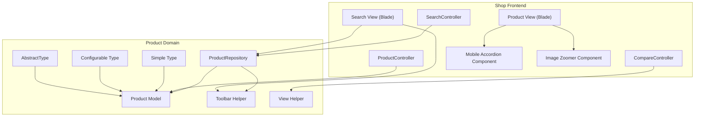

**Diagram sources**
- [SearchController.php:12-112](file://packages/Webkul/Shop/src/Http/Controllers/SearchController.php#L12-L112)
- [CompareController.php:8-29](file://packages/Webkul/Shop/src/Http/Controllers/CompareController.php#L8-L29)
- [ProductController.php:12-156](file://packages/Webkul/Shop/src/Http/Controllers/ProductController.php#L12-L156)
- [view.blade.php:87-169](file://packages/Webkul/Shop/src/Resources/views/products/view.blade.php#L87-L169)
- [accordion/index.blade.php:1-137](file://packages/Webkul/Shop/src/Resources/views/components/accordion/index.blade.php#L1-L137)
- [image-zoomer/index.blade.php:1-393](file://packages/Webkul/Shop/src/Resources/views/components/image-zoomer/index.blade.php#L1-L393)

**Section sources**
- [product_types.php:1-53](file://packages/Webkul/Product/src/Config/product_types.php#L1-L53)
- [ProductRepository.php:19-651](file://packages/Webkul/Product/src/Repositories/ProductRepository.php#L19-L651)
- [Product.php:26-528](file://packages/Webkul/Product/src/Models/Product.php#L26-L528)
- [Toolbar.php:7-168](file://packages/Webkul/Product/src/Helpers/Toolbar.php#L7-L168)
- [index.blade.php:1-317](file://packages/Webkul/Shop/src/Resources/views/search/index.blade.php#L1-L317)
- [view.blade.php:87-169](file://packages/Webkul/Shop/src/Resources/views/products/view.blade.php#L87-L169)

## Core Components
- Product types and configuration: product_types.php defines available product types and their classes. Each product delegates rendering and behavior to its type instance.
- Product model: central entity with relationships to images, videos, reviews, categories, inventories, and price indices. Provides dynamic attribute access and type instance resolution.
- Product repository: orchestrates search across database or Elasticsearch, applies filters, sorts, paginates, and loads related data efficiently.
- Type system: AbstractType defines shared behavior (pricing, inventory, tax category, cart preparation). Simple and Configurable extend it with type-specific logic.
- Storefront helpers: Toolbar provides sorting, limits, and layout modes; View formats visible attributes for display.
- Controllers: SearchController handles search requests and suggestions; CompareController renders comparison page; ProductController handles downloads.
- **Enhanced**: Mobile-first accordion system for product information sections
- **Enhanced**: Advanced image zoomer with Teleport integration for modal-based media viewing

**Section sources**
- [product_types.php:1-53](file://packages/Webkul/Product/src/Config/product_types.php#L1-L53)
- [Product.php:26-528](file://packages/Webkul/Product/src/Models/Product.php#L26-L528)
- [ProductRepository.php:19-651](file://packages/Webkul/Product/src/Repositories/ProductRepository.php#L19-L651)
- [AbstractType.php:32-800](file://packages/Webkul/Product/src/Type/AbstractType.php#L32-L800)
- [Simple.php:25-545](file://packages/Webkul/Product/src/Type/Simple.php#L25-L545)
- [Configurable.php:21-616](file://packages/Webkul/Product/src/Type/Configurable.php#L21-L616)
- [Toolbar.php:7-168](file://packages/Webkul/Product/src/Helpers/Toolbar.php#L7-L168)
- [View.php:8-71](file://packages/Webkul/Product/src/Helpers/View.php#L8-L71)
- [SearchController.php:12-112](file://packages/Webkul/Shop/src/Http/Controllers/SearchController.php#L12-L112)
- [CompareController.php:8-29](file://packages/Webkul/Shop/src/Http/Controllers/CompareController.php#L8-L29)
- [ProductController.php:12-156](file://packages/Webkul/Shop/src/Http/Controllers/ProductController.php#L12-L156)

## Architecture Overview
The storefront search and product listing pipeline with enhanced mobile responsiveness:
- SearchController validates query, builds suggestions, and renders the search view.
- The view initializes a Vue component that fetches product data via an API endpoint.
- ProductRepository executes the search against database or Elasticsearch, applies filters, sorting, and pagination.
- Results render as grid or list cards, driven by toolbar configuration.
- **Enhanced**: Product view now features mobile-first accordion system for information sections.

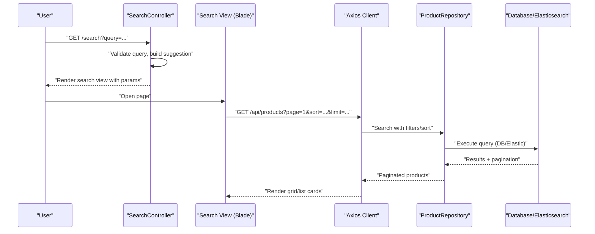

**Diagram sources**
- [SearchController.php:12-112](file://packages/Webkul/Shop/src/Http/Controllers/SearchController.php#L12-L112)
- [index.blade.php:193-314](file://packages/Webkul/Shop/src/Resources/views/search/index.blade.php#L193-L314)
- [ProductRepository.php:234-560](file://packages/Webkul/Product/src/Repositories/ProductRepository.php#L234-L560)

## Detailed Component Analysis

### Product Types and Rendering
- Product types are configured centrally and resolved per product. Each product has a type instance that encapsulates behavior for pricing, inventory, cart preparation, and rendering.
- Simple type supports customizable options, file uploads, and quantity handling.
- Configurable type manages variants, super attributes, and prepares parent/child cart entries.

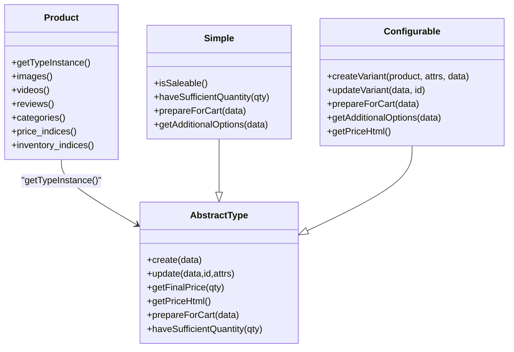

**Diagram sources**
- [Product.php:26-528](file://packages/Webkul/Product/src/Models/Product.php#L26-L528)
- [AbstractType.php:32-800](file://packages/Webkul/Product/src/Type/AbstractType.php#L32-L800)
- [Simple.php:25-545](file://packages/Webkul/Product/src/Type/Simple.php#L25-L545)
- [Configurable.php:21-616](file://packages/Webkul/Product/src/Type/Configurable.php#L21-L616)

**Section sources**
- [product_types.php:1-53](file://packages/Webkul/Product/src/Config/product_types.php#L1-L53)
- [Product.php:353-368](file://packages/Webkul/Product/src/Models/Product.php#L353-L368)
- [AbstractType.php:667-765](file://packages/Webkul/Product/src/Type/AbstractType.php#L667-L765)
- [Simple.php:140-281](file://packages/Webkul/Product/src/Type/Simple.php#L140-L281)
- [Configurable.php:377-478](file://packages/Webkul/Product/src/Type/Configurable.php#L377-L478)

### Catalog Queries, Filtering, Sorting, and Pagination
- ProductRepository supports two engines: database and Elasticsearch. It builds complex joins to load product relations and applies filters by category, price, attributes, and visibility.
- Sorting is driven by Toolbar helper, supporting name/price asc/desc and latest/oldest. Limits and modes (grid/list) are also configurable.
- Pagination uses Laravel paginator with computed page and limit.

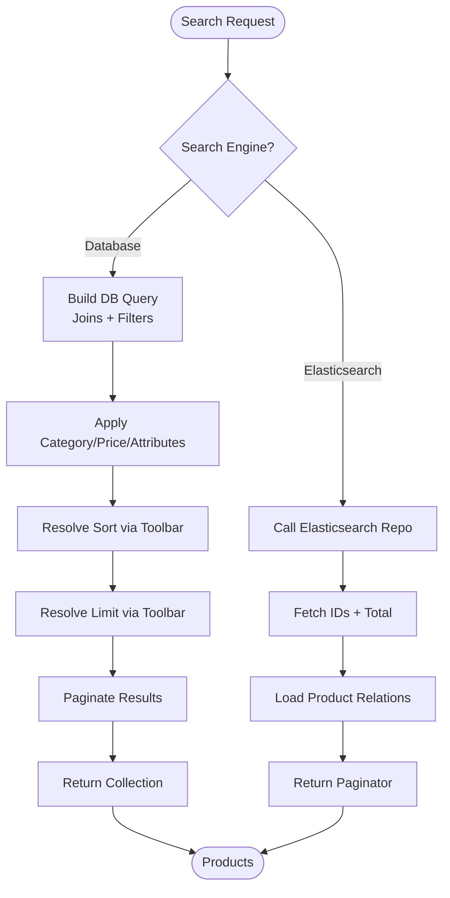

**Diagram sources**
- [ProductRepository.php:234-560](file://packages/Webkul/Product/src/Repositories/ProductRepository.php#L234-L560)
- [Toolbar.php:74-128](file://packages/Webkul/Product/src/Helpers/Toolbar.php#L74-L128)

**Section sources**
- [ProductRepository.php:234-560](file://packages/Webkul/Product/src/Repositories/ProductRepository.php#L234-L560)
- [Toolbar.php:12-128](file://packages/Webkul/Product/src/Helpers/Toolbar.php#L12-L128)

### Product Rendering, Images, Pricing, and Inventory Indicators
- Pricing: AbstractType computes minimal/regular prices and generates HTML for price display. Simple and Configurable override behavior for final price calculation and cart preparation.
- Inventory: Product model exposes total quantity and checks sufficiency via type instances. Configurable aggregates variant quantities.
- Images/Videos: Product model defines images/videos relationships ordered by position; type instances can provide base image for cart/wishlist contexts.
- Attribute display: View helper collects visible front-end attributes and formats values (boolean, select, multiselect).

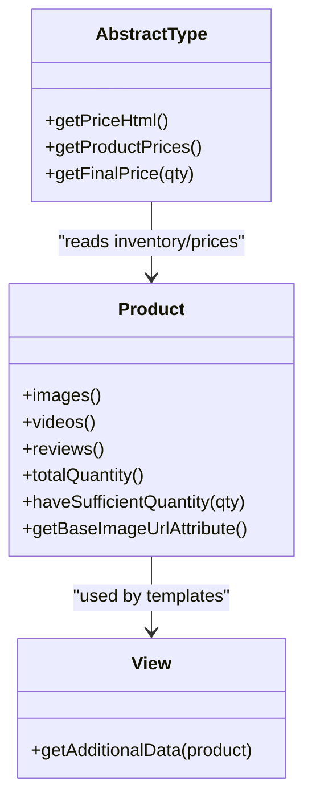

**Diagram sources**
- [Product.php:141-191](file://packages/Webkul/Product/src/Models/Product.php#L141-L191)
- [View.php:16-69](file://packages/Webkul/Product/src/Helpers/View.php#L16-L69)
- [AbstractType.php:739-765](file://packages/Webkul/Product/src/Type/AbstractType.php#L739-L765)

**Section sources**
- [AbstractType.php:667-765](file://packages/Webkul/Product/src/Type/AbstractType.php#L667-L765)
- [Product.php:141-191](file://packages/Webkul/Product/src/Models/Product.php#L141-L191)
- [View.php:16-69](file://packages/Webkul/Product/src/Helpers/View.php#L16-L69)

### Search, Suggestions, and Image-Based Search
- SearchController validates query, optionally builds suggestions based on configured engine (database or Elasticsearch), and renders the search view with parameters.
- Image-based search uploads an image and optionally uses AI to extract keywords, then returns engine selection.

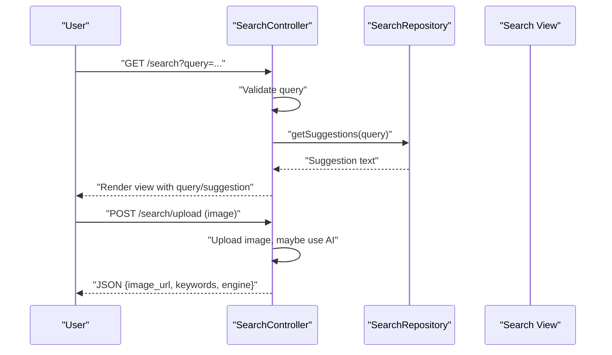

**Diagram sources**
- [SearchController.php:12-112](file://packages/Webkul/Shop/src/Http/Controllers/SearchController.php#L12-L112)
- [index.blade.php:26-112](file://packages/Webkul/Shop/src/Resources/views/search/index.blade.php#L26-L112)

**Section sources**
- [SearchController.php:12-112](file://packages/Webkul/Shop/src/Http/Controllers/SearchController.php#L12-L112)
- [index.blade.php:26-112](file://packages/Webkul/Shop/src/Resources/views/search/index.blade.php#L26-L112)

### Product Comparison and Wishlist Integration
- CompareController renders the comparison page using comparable attributes from the attribute family.
- Configurable type integrates with wishlist/cart by validating selected options and preparing cart items with additional attributes.

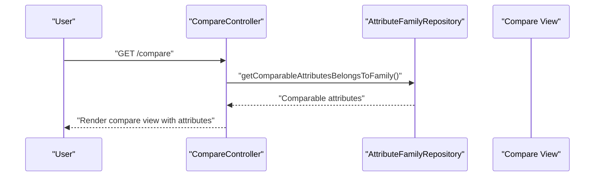

**Diagram sources**
- [CompareController.php:8-29](file://packages/Webkul/Shop/src/Http/Controllers/CompareController.php#L8-L29)

**Section sources**
- [CompareController.php:8-29](file://packages/Webkul/Shop/src/Http/Controllers/CompareController.php#L8-L29)
- [Configurable.php:334-478](file://packages/Webkul/Product/src/Type/Configurable.php#L334-L478)

### Downloads and Media Handling
- ProductController supports downloading downloadable samples and links, including validation of external URLs and handling file vs. URL-based samples.

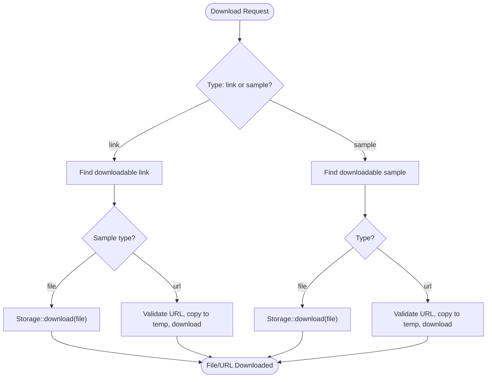

**Diagram sources**
- [ProductController.php:12-156](file://packages/Webkul/Shop/src/Http/Controllers/ProductController.php#L12-L156)

**Section sources**
- [ProductController.php:12-156](file://packages/Webkul/Shop/src/Http/Controllers/ProductController.php#L12-L156)

## Mobile-First Accordion System

**Updated** The product display now features a mobile-first accordion system that replaces traditional tab-based layouts for improved mobile user experience.

### Accordion Component Architecture
The accordion system consists of both Blade components and Vue.js implementations:

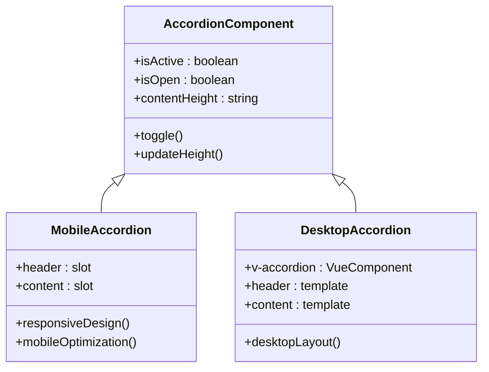

**Diagram sources**
- [accordion/index.blade.php:1-137](file://packages/Webkul/Shop/src/Resources/views/components/accordion/index.blade.php#L1-L137)
- [view.blade.php:87-169](file://packages/Webkul/Shop/src/Resources/views/products/view.blade.php#L87-L169)

### Mobile-First Implementation
The system implements a mobile-first approach with separate sections for mobile and desktop:

- **Mobile Section**: Uses Blade components with `1180:hidden` class for mobile-only display
- **Desktop Section**: Uses Vue.js `v-accordion` components with `max-1180:hidden` for desktop-only display
- **Responsive Design**: Automatic switching between mobile accordion and desktop tabs based on screen size

### Product Information Sections
The accordion system organizes product information into collapsible sections:

1. **Product Details**: Description content with mobile-friendly typography
2. **Additional Information**: Custom attributes in a responsive grid layout
3. **Delivery & Returns**: Shipping and return policy information
4. **Care Instructions**: Product care and maintenance guidelines

**Section sources**
- [accordion/index.blade.php:1-137](file://packages/Webkul/Shop/src/Resources/views/components/accordion/index.blade.php#L1-L137)
- [view.blade.php:87-169](file://packages/Webkul/Shop/src/Resources/views/products/view.blade.php#L87-L169)

## Enhanced Image Zoom Functionality

**Updated** The image zoom system now features advanced Teleport integration for modal-based media viewing with enhanced interaction capabilities.

### Teleport Integration
The image zoomer component utilizes Vue 3's Teleport feature for improved modal handling:

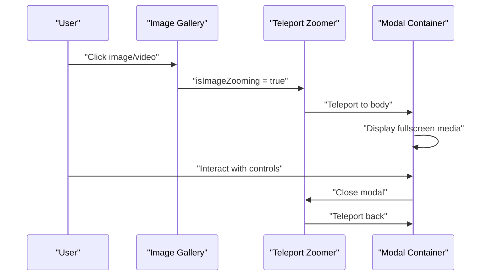

**Diagram sources**
- [image-zoomer/index.blade.php:8-166](file://packages/Webkul/Shop/src/Resources/views/components/image-zoomer/index.blade.php#L8-L166)

### Advanced Interaction Features
The enhanced zoom system provides comprehensive interaction capabilities:

- **Touch Gestures**: Swipe navigation for mobile devices
- **Mouse Wheel Zoom**: Precise zoom control with mouse wheel
- **Drag and Pan**: Click-and-drag to move images around
- **Keyboard Navigation**: Arrow keys for navigation, Escape to close
- **Responsive Thumbnails**: Adaptive thumbnail strip for media navigation

### Media Support
The zoom system handles multiple media types:

- **Images**: High-resolution display with zoom and pan capabilities
- **Videos**: Fullscreen playback with controls overlay
- **Mixed Galleries**: Seamless switching between images and videos
- **Accessibility**: Proper ARIA labels and keyboard navigation support

**Section sources**
- [image-zoomer/index.blade.php:1-393](file://packages/Webkul/Shop/src/Resources/views/components/image-zoomer/index.blade.php#L1-L393)
- [gallery.blade.php:29-33](file://packages/Webkul/Shop/src/Resources/views/products/view/gallery.blade.php#L29-L33)

## Improved Product Information Presentation

**Updated** Product information presentation now features enhanced responsive design with mobile-first accordion system and improved visual hierarchy.

### Responsive Layout Architecture
The product view implements a sophisticated responsive layout system:

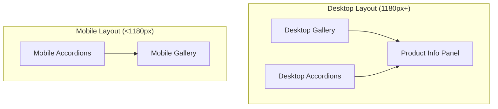

**Diagram sources**
- [view.blade.php:57-71](file://packages/Webkul/Shop/src/Resources/views/products/view.blade.php#L57-L71)
- [view.blade.php:384-430](file://packages/Webkul/Shop/src/Resources/views/products/view.blade.php#L384-L430)

### Visual Hierarchy and Typography
Enhanced typography and spacing improvements:

- **Product Name**: Large, readable typography with proper spacing
- **Pricing**: Clear visual hierarchy with regular and sale prices
- **Short Description**: Optimized line height and readability
- **Custom Attributes**: Grid-based layout with proper alignment
- **Section Headers**: Consistent uppercase styling with decorative elements

### Interactive Elements
Improved interactive components:

- **Quantity Changer**: Enhanced numeric input with validation
- **Add to Cart/Buy Now**: Prominent placement with clear visual feedback
- **Wishlist/Compare**: Accessible action buttons with hover states
- **Share Controls**: Social media integration with proper icons

**Section sources**
- [view.blade.php:220-450](file://packages/Webkul/Shop/src/Resources/views/products/view.blade.php#L220-L450)

## Dependency Analysis
- ProductRepository depends on:
  - AttributeRepository for filterable attributes
  - ElasticSearchRepository for Elasticsearch engine
  - CustomerRepository for customer group context
  - ProductAttributeValueRepository for attribute value filtering
- Product model depends on:
  - AttributeFamily, Categories, Reviews, Images, Videos, Price/Inventory Indices
  - Type instance resolution via product_types configuration
- Controllers depend on repositories and helpers; views depend on Vue components and API endpoints.
- **Enhanced**: Accordion components depend on Vue.js for interactive behavior
- **Enhanced**: Image zoomer depends on Teleport for modal rendering

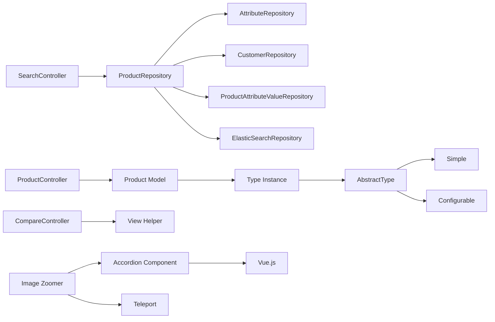

**Diagram sources**
- [ProductRepository.php:19-651](file://packages/Webkul/Product/src/Repositories/ProductRepository.php#L19-L651)
- [Product.php:26-528](file://packages/Webkul/Product/src/Models/Product.php#L26-L528)
- [AbstractType.php:32-800](file://packages/Webkul/Product/src/Type/AbstractType.php#L32-L800)
- [SearchController.php:12-112](file://packages/Webkul/Shop/src/Http/Controllers/SearchController.php#L12-L112)
- [CompareController.php:8-29](file://packages/Webkul/Shop/src/Http/Controllers/CompareController.php#L8-L29)
- [ProductController.php:12-156](file://packages/Webkul/Shop/src/Http/Controllers/ProductController.php#L12-L156)
- [accordion/index.blade.php:74-135](file://packages/Webkul/Shop/src/Resources/views/components/accordion/index.blade.php#L74-L135)
- [image-zoomer/index.blade.php:169-391](file://packages/Webkul/Shop/src/Resources/views/components/image-zoomer/index.blade.php#L169-L391)

**Section sources**
- [ProductRepository.php:19-651](file://packages/Webkul/Product/src/Repositories/ProductRepository.php#L19-L651)
- [Product.php:26-528](file://packages/Webkul/Product/src/Models/Product.php#L26-L528)
- [AbstractType.php:32-800](file://packages/Webkul/Product/src/Type/AbstractType.php#L32-L800)

## Performance Considerations
- Efficient loading: ProductRepository eagerly loads related data (images, videos, reviews, price/inventory indices) to prevent N+1 queries and improve rendering performance.
- Sorting and filtering: Attribute joins and grouping are applied carefully; ensure appropriate indices exist for filterable attributes and price ranges.
- Pagination: Respect configured limits and avoid excessive per-page values to keep memory usage low.
- Search engine choice: Elasticsearch can accelerate complex queries and large catalogs; fallback to database is supported.
- **Enhanced**: Accordion components use lazy loading and conditional rendering to minimize DOM overhead.
- **Enhanced**: Image zoomer uses Teleport to avoid DOM manipulation overhead and improves modal performance.
- **Enhanced**: Responsive galleries implement proper image lazy loading and aspect ratio calculations.

## Troubleshooting Guide
Common issues and resolutions:
- Missing product suggestions: Verify search engine configuration and that Elasticsearch is reachable.
- Incorrect sorting or missing filters: Confirm attribute visibility flags and that filterable attributes are properly mapped.
- Out-of-stock items still appearing: Ensure inventory indices are updated and manage_stock/backorders settings align with expectations.
- Download failures: Validate external URL scheme and DNS records; confirm file paths exist on storage.
- **New**: Accordion sections not displaying: Check responsive breakpoint classes and ensure proper conditional rendering.
- **New**: Image zoom not working: Verify Teleport availability and modal container accessibility.
- **New**: Mobile gallery not swiping: Check touch event handlers and CSS positioning properties.

**Section sources**
- [SearchController.php:57-64](file://packages/Webkul/Shop/src/Http/Controllers/SearchController.php#L57-L64)
- [ProductRepository.php:270-480](file://packages/Webkul/Product/src/Repositories/ProductRepository.php#L270-L480)
- [ProductController.php:108-154](file://packages/Webkul/Shop/src/Http/Controllers/ProductController.php#L108-L154)
- [accordion/index.blade.php:74-135](file://packages/Webkul/Shop/src/Resources/views/components/accordion/index.blade.php#L74-L135)
- [image-zoomer/index.blade.php:169-391](file://packages/Webkul/Shop/src/Resources/views/components/image-zoomer/index.blade.php#L169-L391)

## Conclusion
The product display and catalog system combines a flexible type-driven architecture, robust repository-based queries, and a configurable storefront UI. The recent enhancements include a mobile-first accordion system for improved information accessibility, advanced image zoom functionality with Teleport integration for enhanced media viewing, and responsive product information presentation. These improvements provide better user experience across devices while maintaining the system's flexibility and performance.

## Appendices

### Configuration Options
- Sorting: Configure default sort and available orders via the storefront sort_by setting; orders include name asc/desc, latest/oldest, cheapest/expensive.
- Layout and pagination: Configure products per page and default mode (grid/list) via storefront settings.
- Search engine: Choose between database and Elasticsearch for search; storefront mode can be set per channel.
- **New**: Accordion behavior: Configure default accordion states and animation timing.
- **New**: Image zoom settings: Control zoom sensitivity, transition effects, and interaction modes.

**Section sources**
- [Toolbar.php:64-128](file://packages/Webkul/Product/src/Helpers/Toolbar.php#L64-L128)
- [SearchController.php:57-64](file://packages/Webkul/Shop/src/Http/Controllers/SearchController.php#L57-L64)
- [accordion/index.blade.php:78-89](file://packages/Webkul/Shop/src/Resources/views/components/accordion/index.blade.php#L78-L89)
- [image-zoomer/index.blade.php:173-193](file://packages/Webkul/Shop/src/Resources/views/components/image-zoomer/index.blade.php#L173-L193)