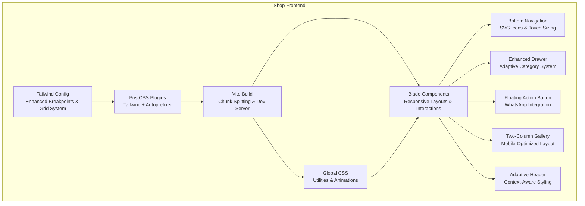
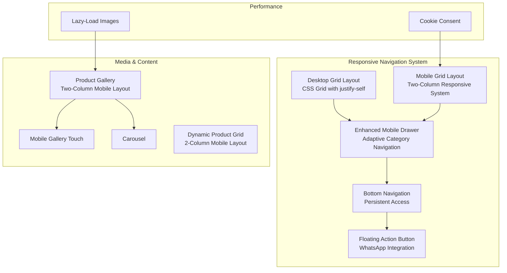
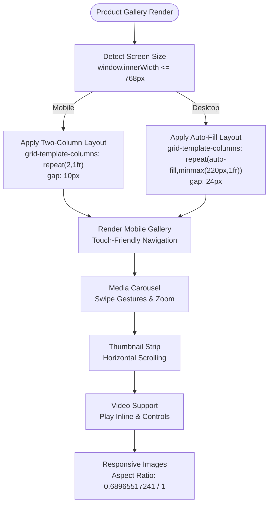
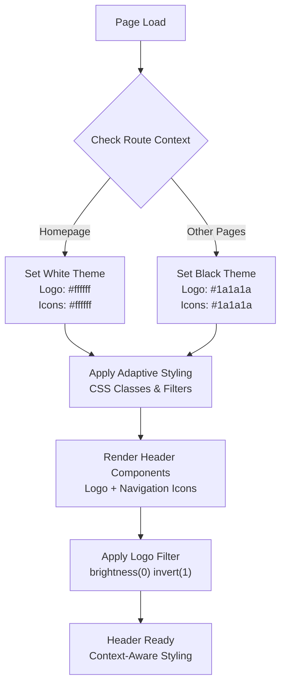
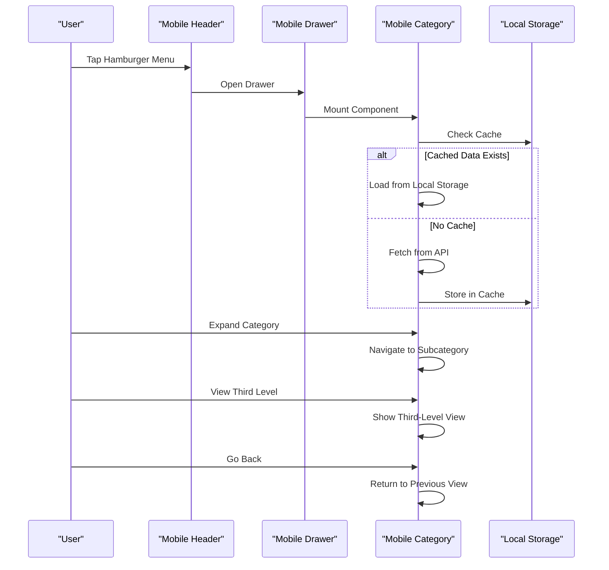
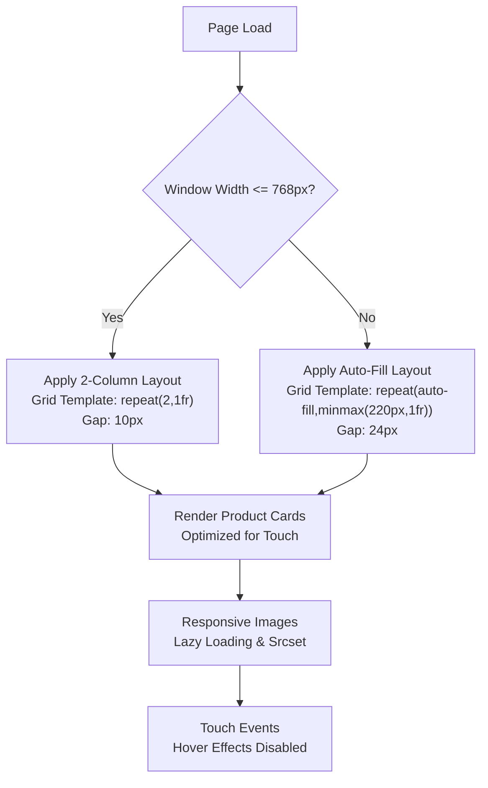
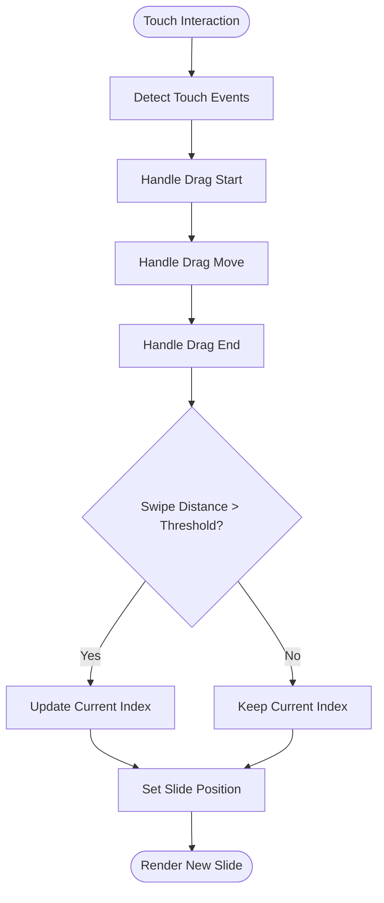
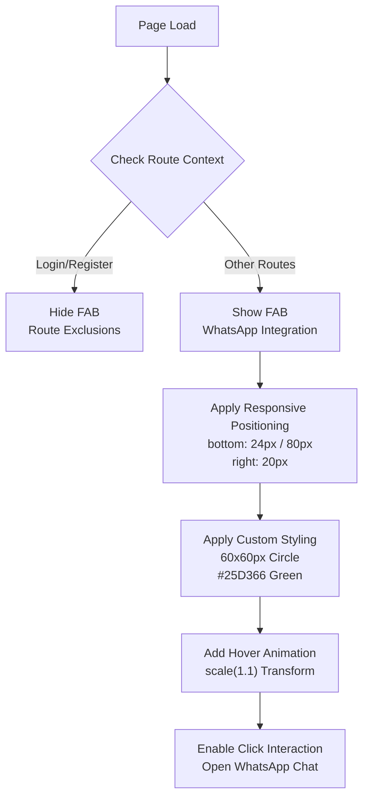
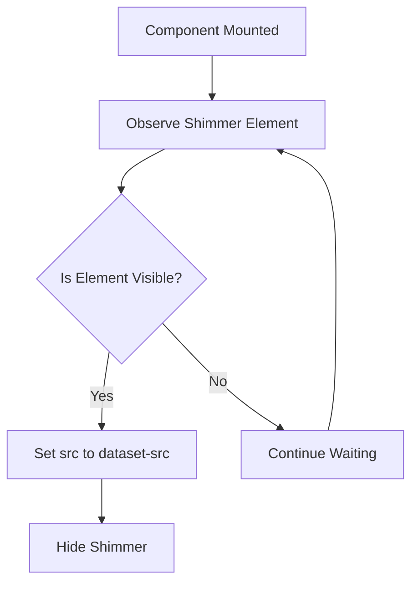
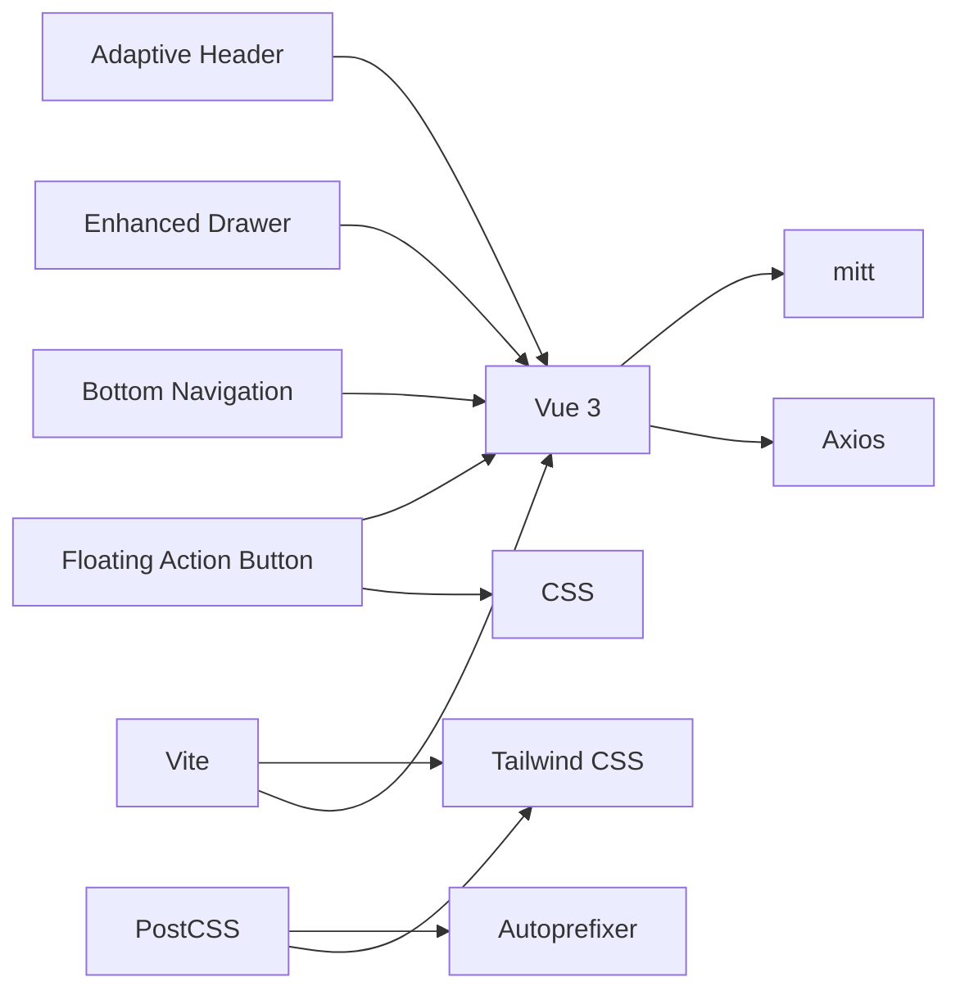

# Responsive Design & Mobile

<cite>
**Referenced Files in This Document**
- [tailwind.config.js](file://packages/Webkul/Shop/tailwind.config.js)
- [vite.config.js](file://packages/Webkul/Shop/vite.config.js)
- [package.json](file://packages/Webkul/Shop/package.json)
- [postcss.config.cjs](file://packages/Webkul/Shop/postcss.config.cjs)
- [app.css](file://packages/Webkul/Shop/src/Resources/assets/css/app.css)
- [index.blade.php](file://packages/Webkul/Shop/src/Resources/views/components/layouts/header/mobile/index.blade.php)
- [bottom.blade.php](file://packages/Webkul/Shop/src/Resources/views/components/layouts/header/desktop/bottom.blade.php)
- [top.blade.php](file://packages/Webkul/Shop/src/Resources/views/components/layouts/header/desktop/top.blade.php)
- [index.blade.php](file://packages/Webkul/Shop/src/Resources/views/components/layouts/header/desktop/index.blade.php)
- [index.blade.php](file://packages/Webkul/Shop/src/Resources/views/components/layouts/header/index.blade.php)
- [bottom-nav.blade.php](file://packages/Webkul/Shop/src/Resources/views/components/layouts/bottom-nav.blade.php)
- [index.blade.php](file://packages/Webkul/Shop/src/Resources/views/components/drawer/index.blade.php)
- [gallery.blade.php](file://packages/Webkul/Shop/src/Resources/views/products/view/gallery.blade.php)
- [mobile.blade.php](file://packages/Webkul/Shop/src/Resources/views/products/view/gallery/mobile.blade.php)
- [carousel.blade.php](file://packages/Webkul/Shop/src/Resources/views/components/products/carousel.blade.php)
- [index.blade.php](file://packages/Webkul/Shop/src/Resources/views/components/carousel/index.blade.php)
- [lazy.blade.php](file://packages/Webkul/Shop/src/Resources/views/components/media/images/lazy.blade.php)
- [index.blade.php](file://packages/Webkul/Shop/src/Resources/views/components/layouts/cookie/index.blade.php)
- [view.blade.php](file://packages/Webkul/Shop/src/Resources/views/categories/view.blade.php)
- [card.blade.php](file://packages/Webkul/Shop/src/Resources/views/components/products/card.blade.php)
- [CheckoutTest.php](file://packages/Webkul/Shop/tests/Feature/Checkout/CheckoutTest.php)
- [index.blade.php](file://packages/Webkul/Shop/src/Resources/views/components/layouts/index.blade.php)
</cite>

## Update Summary
**Changes Made**
- Enhanced responsive design patterns with new floating action button system for mobile navigation
- Improved bottom navigation components with persistent access and touch-friendly layout
- Updated mobile-specific layouts with WhatsApp floating action button integration
- Refined mobile drawer behavior with adaptive category navigation system
- Implemented adaptive header styling based on page context with conditional logo and icon coloring
- Added new custom screen sizes (1180px, 1060px, 991px, 868px) for enhanced breakpoint management
- Refined mobile drawer integration with improved category tree navigation and local caching

## Table of Contents
1. [Introduction](#introduction)
2. [Project Structure](#project-structure)
3. [Core Components](#core-components)
4. [Architecture Overview](#architecture-overview)
5. [Detailed Component Analysis](#detailed-component-analysis)
6. [Dependency Analysis](#dependency-analysis)
7. [Performance Considerations](#performance-considerations)
8. [Troubleshooting Guide](#troubleshooting-guide)
9. [Conclusion](#conclusion)
10. [Appendices](#appendices)

## Introduction
This document explains how the Bagisto Shop module implements responsive design and mobile optimization. It covers the mobile-first approach, breakpoint management, adaptive layouts, touch-friendly interface elements, mobile navigation patterns, optimized loading strategies, integration between desktop and mobile experiences, progressive enhancement, cross-device consistency, and performance and accessibility considerations. It also outlines mobile-specific features such as drawer-based navigation, bottom navigation system, floating action buttons, carousel interactions, lazy-loading images, cookie consent, and supported payment methods.

## Project Structure
The Shop module organizes responsive assets and components under a dedicated package with Tailwind CSS, Vite, and Vue-based Blade components. Key areas:
- Tailwind configuration defines breakpoints and containers for adaptive layouts.
- Vite handles bundling, chunk splitting, and dev server for fast iteration.
- Blade templates assemble mobile-first UIs with Vue components for interactivity.
- CSS utilities and animations support progressive enhancement and accessibility.
- Floating action button system provides persistent mobile navigation access.
- Bottom navigation component offers four-column touch-friendly interface.

**Diagram sources**
- [tailwind.config.js:18-28](file://packages/Webkul/Shop/tailwind.config.js#L18-L28)
- [postcss.config.cjs:1-3](file://packages/Webkul/Shop/postcss.config.cjs#L1-L3)
- [vite.config.js:1-60](file://packages/Webkul/Shop/vite.config.js#L1-L60)
- [app.css:1-529](file://packages/Webkul/Shop/src/Resources/assets/css/app.css#L1-L529)
- [bottom-nav.blade.php:1-76](file://packages/Webkul/Shop/src/Resources/views/components/layouts/bottom-nav.blade.php#L1-L76)
- [index.blade.php:11-568](file://packages/Webkul/Shop/src/Resources/views/components/layouts/header/mobile/index.blade.php#L11-L568)
- [index.blade.php:167-282](file://packages/Webkul/Shop/src/Resources/views/components/layouts/index.blade.php#L167-L282)

**Section sources**
- [tailwind.config.js:1-54](file://packages/Webkul/Shop/tailwind.config.js#L1-L54)
- [vite.config.js:1-60](file://packages/Webkul/Shop/vite.config.js#L1-L60)
- [postcss.config.cjs:1-3](file://packages/Webkul/Shop/postcss.config.cjs#L1-L3)
- [app.css:1-529](file://packages/Webkul/Shop/src/Resources/assets/css/app.css#L1-L529)

## Core Components
- Enhanced responsive gallery system: New two-column layout for mobile devices with adaptive image sizing and touch-friendly navigation.
- Adaptive header styling: Context-aware header styling with conditional logo coloring and icon theming based on page context.
- Enhanced mobile drawer and nested category navigation: A left-positioned drawer with layered category views supports hierarchical browsing on small screens, integrated with the new bottom navigation system.
- Bottom navigation component: New mobile-first navigation bar with four touch-friendly columns featuring SVG icons and improved accessibility.
- Floating action button system: Persistent WhatsApp integration with custom styling and responsive positioning for enhanced customer engagement.
- Touch-enabled carousels and image galleries: Gesture handling for swiping and zooming enhances media interaction on mobile.
- Dynamic product grid: Responsive grid layout that automatically adjusts to 2-column layout on mobile devices for optimal touch interaction.
- Lazy-loading images: IntersectionObserver defers image loading until in viewport to improve initial load performance.
- Cookie consent dialog: A lightweight Vue component manages consent UI and persistence.
- Payment method integration: Tests confirm Stripe, Razorpay, PayU, PayPal Smart Button, and PayPal Standard are available.

**Section sources**
- [tailwind.config.js:18-28](file://packages/Webkul/Shop/tailwind.config.js#L18-L28)
- [bottom-nav.blade.php:1-76](file://packages/Webkul/Shop/src/Resources/views/components/layouts/bottom-nav.blade.php#L1-L76)
- [index.blade.php:11-568](file://packages/Webkul/Shop/src/Resources/views/components/layouts/header/mobile/index.blade.php#L11-L568)
- [bottom.blade.php:4-133](file://packages/Webkul/Shop/src/Resources/views/components/layouts/header/desktop/bottom.blade.php#L4-L133)
- [index.blade.php:80-111](file://packages/Webkul/Shop/src/Resources/views/components/drawer/index.blade.php#L80-L111)
- [mobile.blade.php:128-240](file://packages/Webkul/Shop/src/Resources/views/products/view/gallery/mobile.blade.php#L128-L240)
- [view.blade.php:129-146](file://packages/Webkul/Shop/src/Resources/views/categories/view.blade.php#L129-L146)
- [lazy.blade.php:59-88](file://packages/Webkul/Shop/src/Resources/views/components/media/images/lazy.blade.php#L59-L88)
- [index.blade.php:150-160](file://packages/Webkul/Shop/src/Resources/views/components/layouts/cookie/index.blade.php#L150-L160)
- [CheckoutTest.php:450-1316](file://packages/Webkul/Shop/tests/Feature/Checkout/CheckoutTest.php#L450-L1316)
- [index.blade.php:167-282](file://packages/Webkul/Shop/src/Resources/views/components/layouts/index.blade.php#L167-L282)

## Architecture Overview
The Shop module's responsive architecture combines Tailwind utilities, Vite bundling, and Vue-driven Blade components. The mobile header integrates a drawer that lazily loads categories and supports nested views. The new bottom navigation system provides persistent access to core navigation functions. The floating action button system offers instant customer engagement through WhatsApp integration. Image galleries and carousels use gesture APIs and IntersectionObserver for smooth, performant interactions. The product grid dynamically adjusts column count based on screen size for optimal mobile touch interaction.

**Diagram sources**
- [bottom.blade.php:4-133](file://packages/Webkul/Shop/src/Resources/views/components/layouts/header/desktop/bottom.blade.php#L4-L133)
- [index.blade.php:2-50](file://packages/Webkul/Shop/src/Resources/views/components/layouts/header/mobile/index.blade.php#L2-L50)
- [bottom-nav.blade.php:1-76](file://packages/Webkul/Shop/src/Resources/views/components/layouts/bottom-nav.blade.php#L1-L76)
- [index.blade.php:80-111](file://packages/Webkul/Shop/src/Resources/views/components/drawer/index.blade.php#L80-L111)
- [mobile.blade.php:128-240](file://packages/Webkul/Shop/src/Resources/views/products/view/gallery/mobile.blade.php#L128-L240)
- [carousel.blade.php:142-157](file://packages/Webkul/Shop/src/Resources/views/components/products/carousel/carousel.blade.php#L142-L157)
- [index.blade.php:105-145](file://packages/Webkul/Shop/src/Resources/views/components/carousel/carousel.blade.php#L105-L145)
- [view.blade.php:129-146](file://packages/Webkul/Shop/src/Resources/views/categories/view.blade.php#L129-L146)
- [lazy.blade.php:59-88](file://packages/Webkul/Shop/src/Resources/views/components/media/images/lazy.blade.php#L59-L88)
- [index.blade.php:150-160](file://packages/Webkul/Shop/src/Resources/views/components/layouts/cookie/index.blade.php#L150-L160)
- [index.blade.php:167-282](file://packages/Webkul/Shop/src/Resources/views/components/layouts/index.blade.php#L167-L282)

## Detailed Component Analysis

### Enhanced Responsive Gallery System with Two-Column Layout
The product gallery system has been enhanced with a sophisticated two-column layout specifically optimized for mobile devices. This new pattern provides better touch interaction and improved user experience on smaller screens, with adaptive image sizing and responsive navigation.

**Diagram sources**
- [mobile.blade.php:128-240](file://packages/Webkul/Shop/src/Resources/views/products/view/gallery/mobile.blade.php#L128-L240)
- [gallery.blade.php:128-145](file://packages/Webkul/Shop/src/Resources/views/products/view/gallery/gallery.blade.php#L128-L145)

**Section sources**
- [mobile.blade.php:128-240](file://packages/Webkul/Shop/src/Resources/views/products/view/gallery/mobile.blade.php#L128-L240)
- [gallery.blade.php:128-145](file://packages/Webkul/Shop/src/Resources/views/products/view/gallery/gallery.blade.php#L128-L145)

### Adaptive Header Styling Based on Page Context
The header system now implements adaptive styling that changes based on the current page context. The logo and icon colors dynamically adjust between white and black themes depending on whether the user is on the homepage or other pages, ensuring optimal contrast and visual hierarchy.

**Diagram sources**
- [index.blade.php:23-29](file://packages/Webkul/Shop/src/Resources/views/components/layouts/header/mobile/index.blade.php#L23-L29)
- [bottom.blade.php:156-234](file://packages/Webkul/Shop/src/Resources/views/components/layouts/header/desktop/bottom.blade.php#L156-L234)

**Section sources**
- [index.blade.php:23-29](file://packages/Webkul/Shop/src/Resources/views/components/layouts/header/mobile/index.blade.php#L23-L29)
- [bottom.blade.php:156-234](file://packages/Webkul/Shop/src/Resources/views/components/layouts/header/desktop/bottom.blade.php#L156-L234)

### Enhanced Mobile Navigation Drawer with Adaptive Behavior
The mobile drawer system has been significantly improved with adaptive category navigation, local caching, and enhanced user experience. The drawer now supports three-level category navigation with smooth transitions and persistent state management.

**Diagram sources**
- [index.blade.php:237-568](file://packages/Webkul/Shop/src/Resources/views/components/layouts/header/mobile/index.blade.php#L237-L568)
- [index.blade.php:80-111](file://packages/Webkul/Shop/src/Resources/views/components/drawer/index.blade.php#L80-L111)

**Section sources**
- [index.blade.php:11-568](file://packages/Webkul/Shop/src/Resources/views/components/layouts/header/mobile/index.blade.php#L11-L568)
- [index.blade.php:80-111](file://packages/Webkul/Shop/src/Resources/views/components/drawer/index.blade.php#L80-L111)

### Dynamic Product Grid with Mobile Optimization
The product grid now features intelligent column adjustment based on screen size, implementing a 2-column layout specifically optimized for mobile devices. This ensures better touch interaction and improved user experience on smaller screens.

**Diagram sources**
- [view.blade.php:129-146](file://packages/Webkul/Shop/src/Resources/views/categories/view.blade.php#L129-L146)
- [view.blade.php:377-402](file://packages/Webkul/Shop/src/Resources/views/categories/view.blade.php#L377-L402)

**Section sources**
- [view.blade.php:129-146](file://packages/Webkul/Shop/src/Resources/views/categories/view.blade.php#L129-L146)
- [view.blade.php:377-402](file://packages/Webkul/Shop/src/Resources/views/categories/view.blade.php#L377-L402)

### Touch-Friendly Media Interactions
The product gallery and carousel components implement touch gestures for swiping and zooming, with RTL-aware logic and drag prevention for images. The bottom navigation system enhances touch interactions with proper spacing and accessibility considerations.

**Diagram sources**
- [mobile.blade.php:164-224](file://packages/Webkul/Shop/src/Resources/views/products/view/gallery/mobile.blade.php#L164-L224)

**Section sources**
- [mobile.blade.php:128-240](file://packages/Webkul/Shop/src/Resources/views/products/view/gallery/mobile.blade.php#L128-L240)
- [gallery.blade.php:128-145](file://packages/Webkul/Shop/src/Resources/views/products/view/gallery/gallery.blade.php#L128-L145)
- [carousel.blade.php:142-157](file://packages/Webkul/Shop/src/Resources/views/components/products/carousel/carousel.blade.php#L142-L157)
- [index.blade.php:105-145](file://packages/Webkul/Shop/src/Resources/views/components/carousel/carousel.blade.php#L105-L145)

### Floating Action Button System for Mobile Navigation
The floating action button (FAB) system provides persistent mobile navigation access through a WhatsApp integration. The button features custom styling, responsive positioning, and smooth hover animations for enhanced user engagement and customer support accessibility.

**Diagram sources**
- [index.blade.php:167-282](file://packages/Webkul/Shop/src/Resources/views/components/layouts/index.blade.php#L167-L282)

**Section sources**
- [index.blade.php:167-282](file://packages/Webkul/Shop/src/Resources/views/components/layouts/index.blade.php#L167-L282)

### Lazy Loading and Progressive Enhancement
Images are deferred until they enter the viewport using IntersectionObserver, reducing initial payload and improving perceived performance. The carousel disables certain drag features for simplicity on mobile, while still enabling smooth transitions. The bottom navigation system uses SVG icons for crisp rendering across all device densities.

**Diagram sources**
- [lazy.blade.php:59-88](file://packages/Webkul/Shop/src/Resources/views/components/media/images/lazy.blade.php#L59-L88)
- [index.blade.php:113-118](file://packages/Webkul/Shop/src/Resources/views/components/carousel/carousel.blade.php#L113-L118)

**Section sources**
- [lazy.blade.php:59-88](file://packages/Webkul/Shop/src/Resources/views/components/media/images/lazy.blade.php#L59-L88)
- [index.blade.php:105-145](file://packages/Webkul/Shop/src/Resources/views/components/carousel/carousel.blade.php#L105-L145)

### Cookie Consent Dialog
A Vue-managed dialog controls cookie consent visibility and persistence, ensuring compliance and user choice.

**Section sources**
- [index.blade.php:150-160](file://packages/Webkul/Shop/src/Resources/views/components/layouts/cookie/index.blade.php#L150-L160)

### Payment Methods on Mobile
Automated tests confirm availability of multiple payment methods on the checkout endpoint, supporting diverse mobile payment preferences.

**Section sources**
- [CheckoutTest.php:450-1316](file://packages/Webkul/Shop/tests/Feature/Checkout/CheckoutTest.php#L450-L1316)

## Dependency Analysis
The Shop frontend stack relies on Tailwind for utility classes, PostCSS for plugin processing, and Vite for bundling and chunking. Vue components integrate with Axios and mitt for HTTP and event bus patterns. The bottom navigation system integrates with the existing drawer and header components. The floating action button system leverages CSS custom properties and responsive design principles.

**Diagram sources**
- [package.json:1-31](file://packages/Webkul/Shop/package.json#L1-L31)
- [postcss.config.cjs:1-3](file://packages/Webkul/Shop/postcss.config.cjs#L1-L3)
- [vite.config.js:1-60](file://packages/Webkul/Shop/vite.config.js#L1-L60)
- [bottom-nav.blade.php:1-76](file://packages/Webkul/Shop/src/Resources/views/components/layouts/bottom-nav.blade.php#L1-L76)
- [index.blade.php:167-282](file://packages/Webkul/Shop/src/Resources/views/components/layouts/index.blade.php#L167-L282)

**Section sources**
- [package.json:1-31](file://packages/Webkul/Shop/package.json#L1-L31)
- [postcss.config.cjs:1-3](file://packages/Webkul/Shop/postcss.config.cjs#L1-L3)
- [vite.config.js:1-60](file://packages/Webkul/Shop/vite.config.js#L1-L60)

## Performance Considerations
- Chunk splitting: Vendor chunks separate Vue, validation, and HTTP libraries to improve caching and load performance.
- Lazy loading: Images are loaded only when visible, reducing initial bundle size.
- Dynamic grid layout: Mobile-optimized 2-column grid reduces DOM complexity on smaller screens.
- Bottom navigation optimization: SVG icons provide crisp rendering without additional image loading overhead.
- Floating action button optimization: CSS transforms and transitions ensure smooth animations without layout thrashing.
- Carousel behavior: Drag/swipe logic is simplified on mobile to minimize overhead while preserving usability.
- CSS delivery: Tailwind utilities and animations are scoped to reduce unused styles.
- Grid layout optimization: CSS Grid provides better performance than complex flexbox layouts for precise positioning.
- Adaptive header styling: Conditional theming reduces unnecessary reflows and repaints.
- Local caching: Category data is cached locally to reduce API calls and improve navigation performance.
- Responsive positioning: FAB adapts position based on viewport size and safe area insets.

**Section sources**
- [vite.config.js:11-25](file://packages/Webkul/Shop/vite.config.js#L11-L25)
- [lazy.blade.php:59-88](file://packages/Webkul/Shop/src/Resources/views/components/media/images/lazy.blade.php#L59-L88)
- [view.blade.php:129-146](file://packages/Webkul/Shop/src/Resources/views/categories/view.blade.php#L129-L146)
- [bottom-nav.blade.php:1-76](file://packages/Webkul/Shop/src/Resources/views/components/layouts/bottom-nav.blade.php#L1-L76)
- [index.blade.php:113-118](file://packages/Webkul/Shop/src/Resources/views/components/carousel/carousel.blade.php#L113-L118)
- [app.css:441-469](file://packages/Webkul/Shop/src/Resources/assets/css/app.css#L441-L469)
- [index.blade.php:167-282](file://packages/Webkul/Shop/src/Resources/views/components/layouts/index.blade.php#L167-L282)

## Troubleshooting Guide
- Bottom navigation not displaying: Verify the bottom navigation component is included in the layout and check for proper SVG icon rendering.
- Floating action button not appearing: Check route exclusions and verify the FAB markup is present in the layout. Ensure responsive positioning styles are applied correctly.
- Drawer not opening: Verify the drawer toggle element and component registration. Confirm the drawer slot structure and transition classes.
- Category tree not rendering: Ensure the categories API endpoint is reachable and the component fetches/caches data correctly.
- Touch gestures not working: Check passive event listeners and RTL direction handling. Validate that drag events are not being prevented unintentionally.
- Images not loading: Confirm IntersectionObserver is initialized and dataset-src is set properly.
- Cookie dialog not appearing: Ensure the dialog element exists and the component toggles display correctly.
- Product grid not adjusting: Check the responsive JavaScript logic and verify media query conditions are met.
- Mobile header interactions broken: Ensure proper event delegation and touch event handling for the enhanced header components.
- Grid layout issues: Verify CSS Grid syntax and `justify-self` properties are correctly applied. Check for conflicting styles.
- Adaptive header styling: Ensure the route checking logic is working correctly and CSS filters are applied conditionally.
- Two-column gallery layout: Verify the mobile breakpoint logic and grid template properties are correctly configured.
- FAB positioning issues: Check safe area insets and viewport calculations. Verify media query conditions for responsive positioning.
- Route exclusions not working: Ensure the route exclusion array matches current authentication routes and login/register endpoints.

**Section sources**
- [bottom-nav.blade.php:1-76](file://packages/Webkul/Shop/src/Resources/views/components/layouts/bottom-nav.blade.php#L1-L76)
- [index.blade.php:80-111](file://packages/Webkul/Shop/src/Resources/views/components/drawer/index.blade.php#L80-L111)
- [index.blade.php:527-536](file://packages/Webkul/Shop/src/Resources/views/components/layouts/header/mobile/index.blade.php#L527-L536)
- [mobile.blade.php:145-150](file://packages/Webkul/Shop/src/Resources/views/products/view/gallery/mobile.blade.php#L145-L150)
- [lazy.blade.php:66-76](file://packages/Webkul/Shop/src/Resources/views/components/media/images/lazy.blade.php#L66-L76)
- [index.blade.php:150-160](file://packages/Webkul/Shop/src/Resources/views/components/layouts/cookie/index.blade.php#L150-L160)
- [view.blade.php:129-146](file://packages/Webkul/Shop/src/Resources/views/categories/view.blade.php#L129-L146)
- [index.blade.php:167-282](file://packages/Webkul/Shop/src/Resources/views/components/layouts/index.blade.php#L167-L282)

## Conclusion
Bagisto's Shop module implements a comprehensive mobile-first responsive design using Tailwind, Vite, and Vue. The new floating action button system with WhatsApp integration, enhanced bottom navigation components, and improved mobile drawer system collectively deliver a superior mobile shopping experience. The adaptive header system with context-aware theming ensures optimal visual hierarchy across different pages, while the enhanced drawer provides seamless category navigation with local caching. Touch-friendly interfaces, optimized loading strategies, and seamless integration between navigation components ensure cross-device consistency and improved user satisfaction. The floating action button system provides persistent customer engagement opportunities while maintaining excellent performance and accessibility standards.

## Appendices
- Breakpoints and container configuration are defined centrally for consistent responsive behavior, including new custom screen sizes (1180px, 1060px, 991px, 868px).
- Global CSS utilities and animations support accessibility and visual polish.
- Bottom navigation system provides persistent access to core application functions.
- Floating action button system offers instant customer support through WhatsApp integration.
- Dynamic grid layout ensures optimal touch interaction on mobile devices.
- CSS Grid layout system enables precise element positioning with `justify-self` utilities.
- Adaptive header styling provides context-aware theming for improved visual hierarchy.
- Route-based visibility control ensures appropriate component rendering across different user states.

**Section sources**
- [tailwind.config.js:5-44](file://packages/Webkul/Shop/tailwind.config.js#L5-L44)
- [app.css:521-527](file://packages/Webkul/Shop/src/Resources/assets/css/app.css#L521-L527)
- [bottom-nav.blade.php:1-76](file://packages/Webkul/Shop/src/Resources/views/components/layouts/bottom-nav.blade.php#L1-L76)
- [view.blade.php:129-146](file://packages/Webkul/Shop/src/Resources/views/categories/view.blade.php#L129-L146)
- [bottom.blade.php:4-133](file://packages/Webkul/Shop/src/Resources/views/components/layouts/header/desktop/bottom.blade.php#L4-L133)
- [index.blade.php:167-282](file://packages/Webkul/Shop/src/Resources/views/components/layouts/index.blade.php#L167-L282)