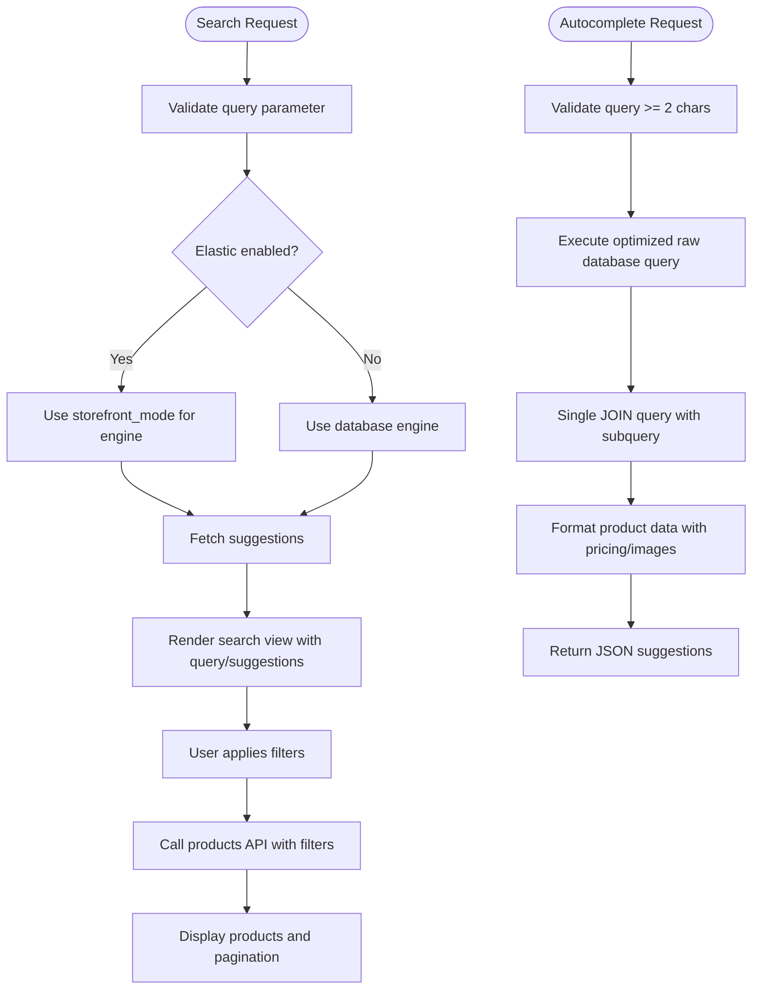
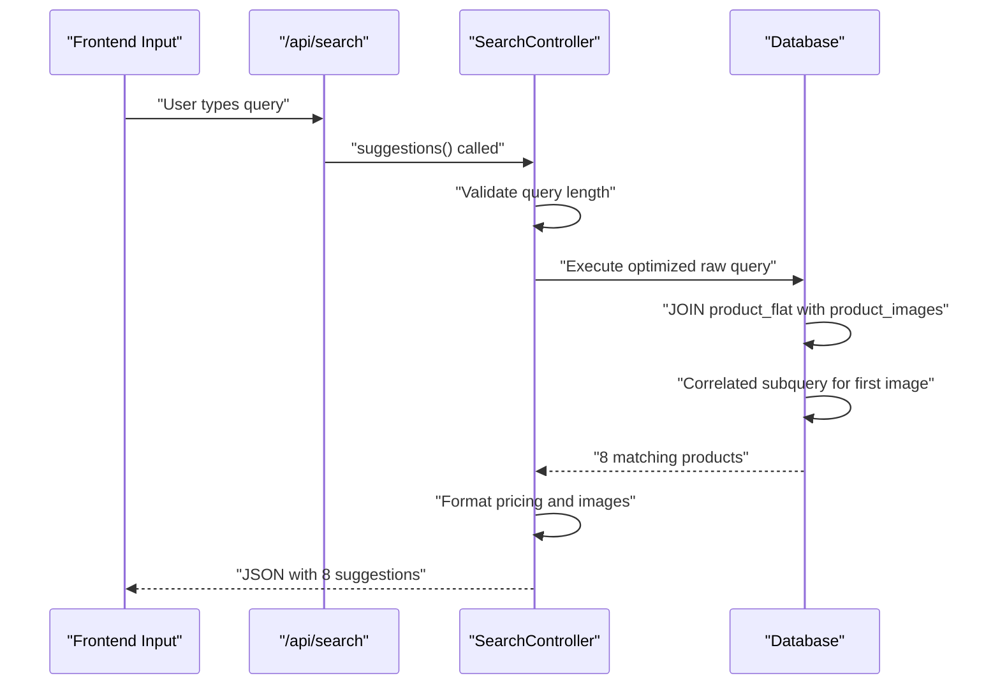
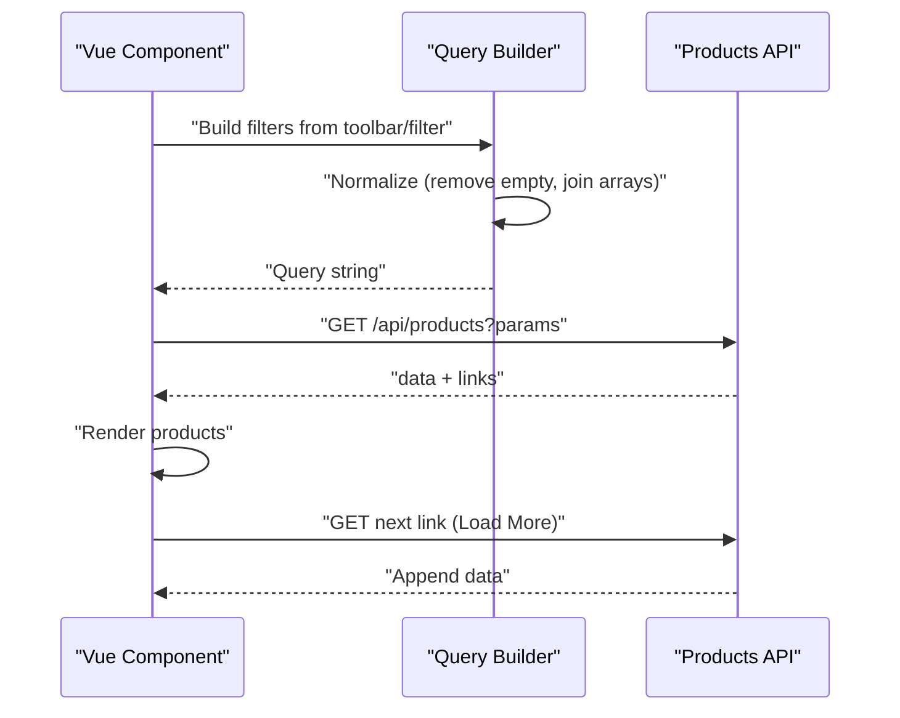
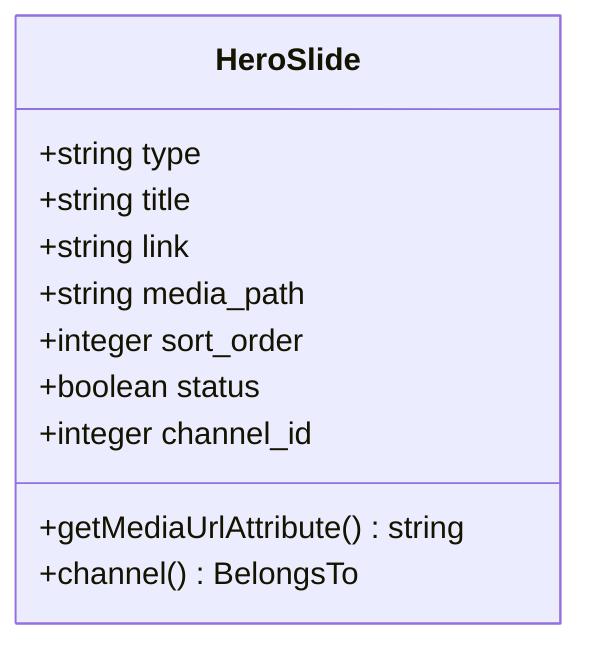
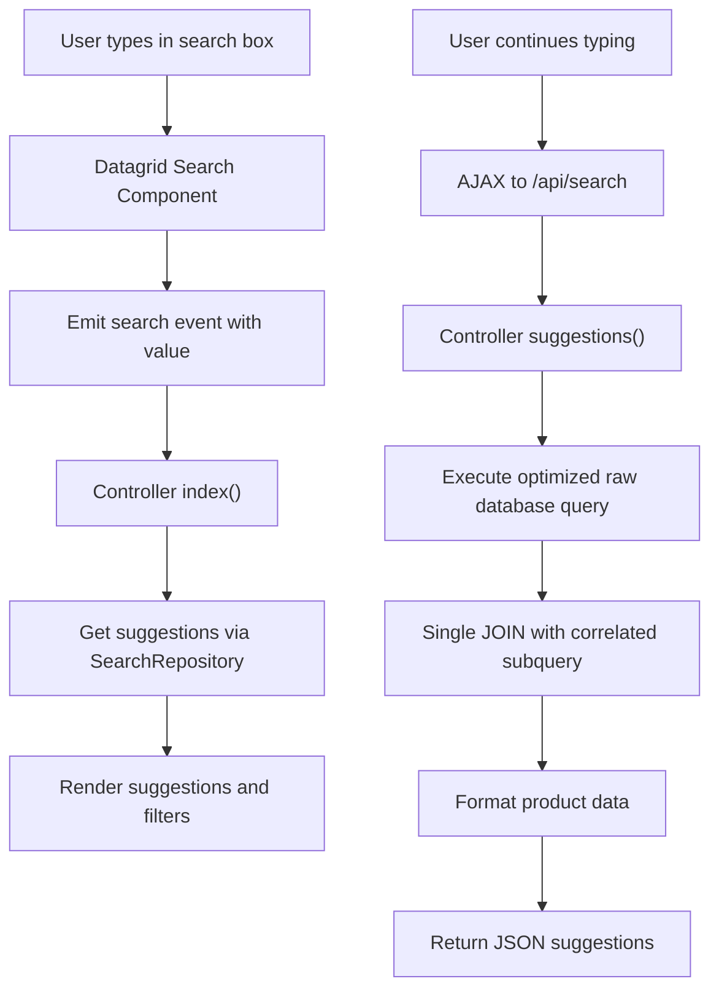
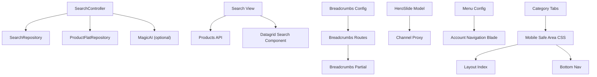

# Search & Navigation

<cite>
**Referenced Files in This Document**
- [SearchController.php](file://packages/Webkul/Shop/src/Http/Controllers/SearchController.php)
- [ProductFlatRepository.php](file://packages/Webkul/Product/src/Repositories/ProductFlatRepository.php)
- [store-front-routes.php](file://packages/Webkul/Shop/src/Routes/store-front-routes.php)
- [search/index.blade.php](file://packages/Webkul/Shop/src/Resources/views/search/index.blade.php)
- [search.blade.php](file://packages/Webkul/Shop/src/Resources/views/components/datagrid/toolbar/search.blade.php)
- [breadcrumbs.php](file://config/breadcrumbs.php)
- [breadcrumbs.php](file://routes/breadcrumbs.php)
- [breadcrumbs.blade.php](file://packages/Webkul/Shop/src/Resources/views/partials/breadcrumbs.blade.php)
- [HeroSlide.php](file://packages/Webkul/Shop/src/Models/HeroSlide.php)
- [menu.php](file://packages/Webkul/Shop/src/Config/menu.php)
- [navigation.blade.php](file://packages/Webkul/Shop/src/Resources/views/components/layouts/account/navigation.blade.php)
- [ProductController.php](file://packages/Webkul/Shop/src/Http/Controllers/ProductController.php)
- [category-tabs.blade.php](file://packages/Webkul/Shop/src/Resources/views/components/categories/category-tabs.blade.php)
- [index.blade.php](file://packages/Webkul/Shop/src/Resources/views/components/layouts/index.blade.php)
- [bottom-nav.blade.php](file://packages/Webkul/Shop/src/Resources/views/components/layouts/bottom-nav.blade.php)
</cite>

## Update Summary
**Changes Made**
- Updated SearchController section to reflect optimized raw database queries for product suggestions
- Enhanced autocomplete functionality documentation with improved performance optimizations
- Updated category tabs section to document enhanced button click handling and mobile-safe area padding calculations
- Added performance considerations for raw database query optimization
- Updated troubleshooting guide with new performance-related guidance

## Table of Contents
1. [Introduction](#introduction)
2. [Project Structure](#project-structure)
3. [Core Components](#core-components)
4. [Architecture Overview](#architecture-overview)
5. [Detailed Component Analysis](#detailed-component-analysis)
6. [Dependency Analysis](#dependency-analysis)
7. [Performance Considerations](#performance-considerations)
8. [Troubleshooting Guide](#troubleshooting-guide)
9. [Conclusion](#conclusion)

## Introduction
This document explains the search and navigation systems in the Shop module. It covers the search bar implementation, product search algorithms, filtering mechanisms, category navigation, breadcrumb systems, site map generation, hero carousel and promotional banners, dynamic content placement, search result optimization, faceted search, and **intelligent autocomplete functionality**. It also documents navigation menu customization, mobile navigation patterns, and accessibility compliance for navigation elements.

## Project Structure
The search and navigation features span backend controllers, repositories, models, configuration, and frontend Blade components and Vue.js integration.

```mermaid
graph TB
SC["SearchController<br/>packages/Webkul/Shop/src/Http/Controllers/SearchController.php"]
PFR["ProductFlatRepository<br/>packages/Webkul/Product/src/Repositories/ProductFlatRepository.php"]
SR["SearchRepository<br/>(via facade)"]
SV["Search Results View<br/>packages/Webkul/Shop/src/Resources/views/search/index.blade.php"]
DGS["Datagrid Search Component<br/>packages/Webkul/Shop/src/Resources/views/components/datagrid/toolbar/search.blade.php"]
API["Autocomplete API<br/>GET /api/search"]
BC["Breadcrumbs Config<br/>config/breadcrumbs.php"]
BR["Breadcrumbs Routes<br/>routes/breadcrumbs.php"]
BP["Breadcrumbs Partial<br/>packages/Webkul/Shop/src/Resources/views/partials/breadcrumbs.blade.php"]
HS["HeroSlide Model<br/>packages/Webkul/Shop/src/Models/HeroSlide.php"]
NM["Navigation Menu Config<br/>packages/Webkul/Shop/src/Config/menu.php"]
NAV["Account Navigation Blade<br/>packages/Webkul/Shop/src/Resources/views/components/layouts/account/navigation.blade.php"]
CT["Category Tabs<br/>packages/Webkul/Shop/src/Resources/views/components/categories/category-tabs.blade.php"]
MSAP["Mobile Safe Area Padding<br/>layouts/index.blade.php & bottom-nav.blade.php"]
SC --> PFR
SC --> SR
SC --> SV
SC --> API
SV --> DGS
BC --> BR
BR --> BP
SV --> HS
NM --> NAV
CT --> MSAP
```



**Diagram sources**
- [SearchController.php:13-25](file://packages/Webkul/Shop/src/Http/Controllers/SearchController.php#L13-L25)
- [ProductFlatRepository.php:7-16](file://packages/Webkul/Product/src/Repositories/ProductFlatRepository.php#L7-L16)
- [store-front-routes.php:51](file://packages/Webkul/Shop/src/Routes/store-front-routes.php#L51)

**Section sources**
- [SearchController.php:13-25](file://packages/Webkul/Shop/src/Http/Controllers/SearchController.php#L13-L25)
- [ProductFlatRepository.php:7-16](file://packages/Webkul/Product/src/Repositories/ProductFlatRepository.php#L7-L16)
- [store-front-routes.php:51](file://packages/Webkul/Shop/src/Routes/store-front-routes.php#L51)

## Core Components
- SearchController: Handles search requests, suggestion retrieval, image-based search, and **optimized intelligent autocomplete** functionality using raw database queries.
- ProductFlatRepository: Provides access to flattened product data for efficient autocomplete queries.
- Search Results View: Renders the search page, applies filters, and loads products via AJAX.
- Datagrid Search Component: Provides a reusable search panel for datagrids with live updates and autocomplete integration.
- Autocomplete API: New endpoint (`/api/search`) that returns intelligent product suggestions with pricing and images using optimized raw database queries.
- Breadcrumb System: Config-driven breadcrumbs with route definitions and a Blade partial renderer.
- Hero Slide Model: Manages hero carousel entries and media URLs.
- Navigation Menu Config and Account Navigation: Defines menu structure and renders account-side navigation.
- Category Tabs: Enhanced tab system with improved button click handling and mobile-safe area padding calculations.
- Mobile Safe Area Support: CSS environment variables for safe area insets on mobile devices.

**Section sources**
- [SearchController.php:13-25](file://packages/Webkul/Shop/src/Http/Controllers/SearchController.php#L13-L25)
- [ProductFlatRepository.php:7-16](file://packages/Webkul/Product/src/Repositories/ProductFlatRepository.php#L7-L16)
- [store-front-routes.php:51](file://packages/Webkul/Shop/src/Routes/store-front-routes.php#L51)

## Architecture Overview
The search pipeline integrates user input, backend validation, suggestion retrieval, optimized autocomplete, and product listing with dynamic filters and pagination. Breadcrumbs and navigation complement the UX by guiding users and organizing content. The enhanced architecture now features raw database queries for improved performance and better mobile support.

```mermaid
sequenceDiagram
participant U as "User"
participant C as "SearchController"
participant DB as "Database"
PFR as "ProductFlatRepository"
participant SR as "SearchRepository"
participant V as "Search View"
participant API as "Products API"
U->>C : "GET /search?query=..."
C->>C : "Validate query parameter"
C->>SR : "getSuggestions(query)"
SR-->>C : "suggestions"
C->>V : "Render search results with query and suggestions"
U->>C : "GET /api/search?query=text"
C->>DB : "Raw query to product_flat table"
DB-->>C : "Matching products"
C->>C : "Optimized formatting with single query"
C-->>U : "JSON with formatted results"
U->>V : "Apply filters (sort, limit, mode)"
V->>API : "GET /api/products?filters"
API-->>V : "Products + pagination links"
V-->>U : "Render products and load more"
```

**Diagram sources**
- [SearchController.php:32-77](file://packages/Webkul/Shop/src/Http/Controllers/SearchController.php#L32-L77)
- [SearchController.php:117-184](file://packages/Webkul/Shop/src/Http/Controllers/SearchController.php#L117-L184)
- [store-front-routes.php:51](file://packages/Webkul/Shop/src/Routes/store-front-routes.php#L51)

## Detailed Component Analysis

### Search Bar Implementation
- Request handling and validation: The controller validates the query parameter and determines whether to fetch suggestions based on configuration and query parameters.
- Suggestion engine selection: Chooses between Elasticsearch storefront mode and database-backed search depending on configuration.
- Image-based search: Optional AI-powered keyword extraction for uploaded images, returning engine type and suggested keywords.
- **Optimized intelligent autocomplete**: New endpoint that uses raw database queries for real-time suggestions with formatted pricing and images, eliminating multiple API calls and reducing database overhead.



**Diagram sources**
- [SearchController.php:55-77](file://packages/Webkul/Shop/src/Http/Controllers/SearchController.php#L55-L77)
- [SearchController.php:117-184](file://packages/Webkul/Shop/src/Http/Controllers/SearchController.php#L117-L184)

**Section sources**
- [SearchController.php:32-77](file://packages/Webkul/Shop/src/Http/Controllers/SearchController.php#L32-L77)
- [SearchController.php:117-184](file://packages/Webkul/Shop/src/Http/Controllers/SearchController.php#L117-L184)

### Optimized Intelligent Autocomplete System
**Updated** The SearchController now includes a highly optimized autocomplete system that uses raw database queries for intelligent product suggestions, significantly improving performance.

- **Backend Implementation**: The `suggestions()` method in SearchController handles autocomplete requests with the following optimized logic:
  - Validates minimum query length (≥ 2 characters)
  - Retrieves current channel and locale context
  - Executes a single raw database query joining product_flat with product_images using a correlated subquery to get the first image
  - Filters for active, visible products in the current channel and locale
  - Returns formatted results with product ID, name, URL, image, and pricing information

- **Performance Optimizations**: 
  - Eliminates multiple API calls and reduces database overhead
  - Uses raw SQL with JOIN and correlated subquery for optimal performance
  - Limits results to 8 products for fast response times
  - Minimizes data transfer by selecting only essential columns

- **ProductFlatRepository Integration**: Uses the flattened product table for efficient autocomplete queries, accessing product metadata like name, description, and pricing.

- **Frontend Response Format**: Returns structured JSON with:
  - Product ID for linking
  - Formatted product name
  - Route URL for product navigation
  - Base image URL for visual representation
  - Formatted price and old price (when applicable)



**Diagram sources**
- [SearchController.php:117-184](file://packages/Webkul/Shop/src/Http/Controllers/SearchController.php#L117-L184)
- [ProductFlatRepository.php:7-16](file://packages/Webkul/Product/src/Repositories/ProductFlatRepository.php#L7-L16)

**Section sources**
- [SearchController.php:117-184](file://packages/Webkul/Shop/src/Http/Controllers/SearchController.php#L117-L184)
- [ProductFlatRepository.php:7-16](file://packages/Webkul/Product/src/Repositories/ProductFlatRepository.php#L7-L16)

### Product Search Algorithms and Filtering Mechanisms
- Frontend filtering: Vue component composes query parameters from toolbar and filter selections, converts to query string, and pushes state to history.
- Backend API: Products endpoint receives filtered parameters and returns paginated results; "Load more" fetches next page links.
- Filter normalization: Removes empty values and serializes arrays for consistent query construction.



**Diagram sources**
- [search/index.blade.php:225-311](file://packages/Webkul/Shop/src/Resources/views/search/index.blade.php#L225-L311)

**Section sources**
- [search/index.blade.php:225-311](file://packages/Webkul/Shop/src/Resources/views/search/index.blade.php#L225-L311)

### Enhanced Category Navigation and Breadcrumb Systems
- Breadcrumb configuration: Selects the rendering view and defines breadcrumb files.
- Route-defined breadcrumbs: Declares named trails for common pages (Home, Account, Orders, Cart, Product, etc.) and parent-child relationships.
- Blade partial: Renders breadcrumbs as an accessible nav element with separators and last-item semantics.


**Diagram sources**
- [breadcrumbs.php:29-43](file://config/breadcrumbs.php#L29-L43)
- [breadcrumbs.php:6-120](file://routes/breadcrumbs.php#L6-L120)
- [breadcrumbs.blade.php:1-28](file://packages/Webkul/Shop/src/Resources/views/partials/breadcrumbs.blade.php#L1-L28)

**Section sources**
- [breadcrumbs.php:1-79](file://config/breadcrumbs.php#L1-L79)
- [breadcrumbs.php:1-120](file://routes/breadcrumbs.php#L1-L120)
- [breadcrumbs.blade.php:1-28](file://packages/Webkul/Shop/src/Resources/views/partials/breadcrumbs.blade.php#L1-L28)

### Site Map Generation
- Breadcrumb routes define canonical paths for pages, enabling structured navigation and implicit sitemaps for crawler-friendly URLs.
- Use the breadcrumb trail definitions to generate navigational sitemaps programmatically by iterating route names and their parents.

**Section sources**
- [breadcrumbs.php:6-120](file://routes/breadcrumbs.php#L6-L120)

### Hero Carousel and Promotional Banners
- HeroSlide model encapsulates carousel entries with attributes for type, title, link, media path, sort order, status, and channel association.
- Media URL resolution uses Cloudinary helpers to produce full URLs for slides.
- The view layer can render hero slides dynamically; the model ensures typed attributes and boolean casting for status.



**Diagram sources**
- [HeroSlide.php:9-65](file://packages/Webkul/Shop/src/Models/HeroSlide.php#L9-L65)

**Section sources**
- [HeroSlide.php:1-65](file://packages/Webkul/Shop/src/Models/HeroSlide.php#L1-L65)

### Dynamic Content Placement
- Search results page uses a Vue component wrapper to lazily render shimmer placeholders while loading, then replace with product cards and apply list/grid modes.
- Filters and toolbar are included conditionally based on device and layout needs.

**Section sources**
- [search/index.blade.php:74-191](file://packages/Webkul/Shop/src/Resources/views/search/index.blade.php#L74-L191)

### Search Result Optimization, Faceted Search, and Autocomplete
- Suggestion retrieval: The controller queries suggestions based on configured engine and query parameters.
- Faceted filters: The Vue component merges toolbar and filter selections, normalizes parameters, and triggers API calls on change.
- **Optimized intelligent autocomplete**: The new `/api/search` endpoint provides real-time product suggestions with intelligent matching and formatted display data using optimized raw database queries.



**Diagram sources**
- [search.blade.php:84-107](file://packages/Webkul/Shop/src/Resources/views/components/datagrid/toolbar/search.blade.php#L84-L107)
- [SearchController.php:61-64](file://packages/Webkul/Shop/src/Http/Controllers/SearchController.php#L61-L64)
- [SearchController.php:117-184](file://packages/Webkul/Shop/src/Http/Controllers/SearchController.php#L117-L184)

**Section sources**
- [SearchController.php:55-77](file://packages/Webkul/Shop/src/Http/Controllers/SearchController.php#L55-L77)
- [SearchController.php:117-184](file://packages/Webkul/Shop/src/Http/Controllers/SearchController.php#L117-L184)
- [search.blade.php:1-124](file://packages/Webkul/Shop/src/Resources/views/components/datagrid/toolbar/search.blade.php#L1-L124)

### Enhanced Navigation Menu Customization and Mobile Patterns
**Updated** The navigation system now includes enhanced category tabs with improved button click handling and comprehensive mobile-safe area padding calculations.

- **Enhanced Category Tabs**: The category tabs component features improved button click handling with better visual feedback and state management.
- **Mobile Safe Area Support**: Comprehensive CSS environment variable support for safe area insets on modern mobile devices.
- **Menu configuration**: The Shop module's menu config defines top-level account navigation items with routes, icons, and sort orders.
- **Account navigation blade**: Iterates through menu items and renders grouped child items with active-state indicators and responsive styles.
- **Mobile responsiveness**: The navigation adapts to smaller screens with reduced padding and inline borders, and the search view switches to a drawer-style filter layout on small screens.

**Section sources**
- [menu.php:1-68](file://packages/Webkul/Shop/src/Config/menu.php#L1-L68)
- [navigation.blade.php:31-59](file://packages/Webkul/Shop/src/Resources/views/components/layouts/account/navigation.blade.php#L31-L59)
- [search/index.blade.php:203-207](file://packages/Webkul/Shop/src/Resources/views/search/index.blade.php#L203-L207)
- [category-tabs.blade.php:10-25](file://packages/Webkul/Shop/src/Resources/views/components/categories/category-tabs.blade.php#L10-L25)
- [index.blade.php:142-150](file://packages/Webkul/Shop/src/Resources/views/components/layouts/index.blade.php#L142-L150)
- [bottom-nav.blade.php:1-3](file://packages/Webkul/Shop/src/Resources/views/components/layouts/bottom-nav.blade.php#L1-L3)

### Enhanced Accessibility Compliance for Navigation Elements
**Updated** The navigation system now includes comprehensive mobile-safe area support for improved accessibility on modern devices.

- Breadcrumb partial wraps the list in a nav element with an accessible label and marks the current page item appropriately.
- Search input includes autocomplete off and proper aria labeling for submit actions.
- Product cards and buttons use semantic roles and labels for screen reader support.
- **Mobile Safe Area Support**: CSS environment variables `env(safe-area-inset-bottom)` provide proper spacing for devices with home indicators and notches.

**Section sources**
- [breadcrumbs.blade.php:1-28](file://packages/Webkul/Shop/src/Resources/views/partials/breadcrumbs.blade.php#L1-L28)
- [search/index.blade.php:38-70](file://packages/Webkul/Shop/src/Resources/views/search/index.blade.php#L38-L70)
- [index.blade.php:142-150](file://packages/Webkul/Shop/src/Resources/views/components/layouts/index.blade.php#L142-L150)
- [bottom-nav.blade.php:1-3](file://packages/Webkul/Shop/src/Resources/views/components/layouts/bottom-nav.blade.php#L1-L3)

## Dependency Analysis
- SearchController depends on SearchRepository for suggestions and ProductFlatRepository for autocomplete functionality, with optional MagicAI integration for image search.
- Search view depends on the Products API for paginated results and on the datagrid search component for filter input.
- Breadcrumb system depends on route definitions and a configurable view renderer.
- HeroSlide model depends on channel association and Cloudinary media URL generation.
- Navigation relies on menu configuration and Blade rendering of grouped items.
- **Enhanced Dependencies**: Category tabs now depend on mobile-safe area CSS variables and improved JavaScript event handling.



**Diagram sources**
- [SearchController.php:19-25](file://packages/Webkul/Shop/src/Http/Controllers/SearchController.php#L19-L25)
- [search/index.blade.php:263-274](file://packages/Webkul/Shop/src/Resources/views/search/index.blade.php#L263-L274)
- [breadcrumbs.php:29-43](file://config/breadcrumbs.php#L29-L43)
- [breadcrumbs.php:6-120](file://routes/breadcrumbs.php#L6-L120)
- [HeroSlide.php:52-55](file://packages/Webkul/Shop/src/Models/HeroSlide.php#L52-L55)
- [menu.php:1-68](file://packages/Webkul/Shop/src/Config/menu.php#L1-L68)
- [navigation.blade.php:31-59](file://packages/Webkul/Shop/src/Resources/views/components/layouts/account/navigation.blade.php#L31-L59)
- [category-tabs.blade.php:10-25](file://packages/Webkul/Shop/src/Resources/views/components/categories/category-tabs.blade.php#L10-L25)
- [index.blade.php:142-150](file://packages/Webkul/Shop/src/Resources/views/components/layouts/index.blade.php#L142-L150)
- [bottom-nav.blade.php:1-3](file://packages/Webkul/Shop/src/Resources/views/components/layouts/bottom-nav.blade.php#L1-L3)

**Section sources**
- [SearchController.php:19-25](file://packages/Webkul/Shop/src/Http/Controllers/SearchController.php#L19-L25)
- [search/index.blade.php:263-274](file://packages/Webkul/Shop/src/Resources/views/search/index.blade.php#L263-L274)
- [breadcrumbs.php:29-43](file://config/breadcrumbs.php#L29-L43)
- [breadcrumbs.php:6-120](file://routes/breadcrumbs.php#L6-L120)
- [HeroSlide.php:52-55](file://packages/Webkul/Shop/src/Models/HeroSlide.php#L52-L55)
- [menu.php:1-68](file://packages/Webkul/Shop/src/Config/menu.php#L1-L68)
- [navigation.blade.php:31-59](file://packages/Webkul/Shop/src/Resources/views/components/layouts/account/navigation.blade.php#L31-L59)
- [category-tabs.blade.php:10-25](file://packages/Webkul/Shop/src/Resources/views/components/categories/category-tabs.blade.php#L10-L25)
- [index.blade.php:142-150](file://packages/Webkul/Shop/src/Resources/views/components/layouts/index.blade.php#L142-L150)
- [bottom-nav.blade.php:1-3](file://packages/Webkul/Shop/src/Resources/views/components/layouts/bottom-nav.blade.php#L1-L3)

## Performance Considerations
- Use the configured search engine (Elasticstorefront mode vs. database) to balance accuracy and speed.
- Normalize and serialize filters efficiently to minimize query string bloat.
- Lazy-load product lists and use "Load more" to reduce initial payload.
- Cache frequently accessed suggestions and hero carousel entries where appropriate.
- **Optimize autocomplete queries**: The SearchController now uses raw database queries with JOIN operations and correlated subqueries to eliminate multiple API calls and reduce database overhead.
- **Minimize data transfer**: Autocomplete responses include only essential product information (ID, name, URL, image, pricing) from a single optimized query.
- **Enhanced category tab performance**: Improved button click handling reduces unnecessary DOM manipulations and state updates.
- **Mobile performance**: CSS environment variables for safe area insets avoid JavaScript-based calculations and improve rendering performance.

**Updated** The new raw database query approach in SearchController provides significant performance improvements:
- Single query execution instead of multiple API calls
- Correlated subquery optimizes image retrieval without additional joins
- Limited result set of 8 products for faster response times
- Reduced memory footprint through selective column selection

**Section sources**
- [SearchController.php:130-150](file://packages/Webkul/Shop/src/Http/Controllers/SearchController.php#L130-L150)
- [category-tabs.blade.php:292-316](file://packages/Webkul/Shop/src/Resources/views/components/categories/category-tabs.blade.php#L292-L316)

## Troubleshooting Guide
- Query validation failures: Ensure the query matches the expected pattern and is present when required.
- Suggestion engine misconfiguration: Verify the engine setting and storefront mode in configuration.
- Image search errors: If AI analysis fails, the system falls back to a non-AI engine; check AI service availability and logs.
- **Optimized autocomplete not working**: Check that the `/api/search` endpoint is accessible and that the raw database query executes successfully. Verify that product_flat table has proper indexing on name, channel, and locale columns.
- **Low autocomplete quality**: Verify that product_flat table contains properly indexed product names and descriptions. Check that the correlated subquery for image retrieval is functioning correctly.
- **Performance issues**: Monitor database query execution times and consider adding indexes to product_flat table for improved autocomplete performance.
- **Mobile layout problems**: Verify that CSS environment variables for safe-area-inset-bottom are properly calculated and applied. Check that the mobile-safe area padding calculations are working correctly across different device types.
- **Category tab click handling issues**: Ensure that the moveCategoryTab function is properly handling click events and updating the tab indicator position. Check for JavaScript errors in the browser console.

**Section sources**
- [SearchController.php:32-34](file://packages/Webkul/Shop/src/Http/Controllers/SearchController.php#L32-L34)
- [SearchController.php:90-110](file://packages/Webkul/Shop/src/Http/Controllers/SearchController.php#L90-L110)
- [SearchController.php:117-184](file://packages/Webkul/Shop/src/Http/Controllers/SearchController.php#L117-L184)
- [ProductController.php:108-154](file://packages/Webkul/Shop/src/Http/Controllers/ProductController.php#L108-L154)
- [category-tabs.blade.php:300-316](file://packages/Webkul/Shop/src/Resources/views/components/categories/category-tabs.blade.php#L300-L316)

## Conclusion
The Shop module implements a robust search experience with configurable suggestion engines, dynamic filtering, responsive layouts, and **highly optimized intelligent autocomplete functionality**. The new optimized autocomplete system leverages raw database queries with JOIN operations and correlated subqueries for fast, relevant product suggestions with formatted pricing and images. The enhanced category tabs provide improved button click handling and comprehensive mobile-safe area padding support. Breadcrumbs and navigation enhance usability and accessibility, while hero slides and promotional banners enrich the storefront. The architecture cleanly separates concerns between controller logic, frontend components, and data models, enabling maintainability and extensibility with significant performance improvements through optimized database queries and mobile-responsive design patterns.