# Shop Interface

<cite>
**Referenced Files in This Document**
- [ShopServiceProvider.php](file://packages/Webkul/Shop/src/Providers/ShopServiceProvider.php)
- [web.php](file://packages/Webkul/Shop/src/Routes/web.php)
- [HomeController.php](file://packages/Webkul/Shop/src/Http/Controllers/HomeController.php)
- [index.blade.php](file://packages/Webkul/Shop/src/Resources/views/home/index.blade.php)
- [all-categories.blade.php](file://packages/Webkul/Shop/src/Resources/views/home/all-categories.blade.php)
- [flash-sale.blade.php](file://packages/Webkul/Shop/src/Resources/views/home/flash-sale.blade.php)
- [Theme.php](file://packages/Webkul/Theme/src/Theme.php)
- [Themes.php](file://packages/Webkul/Theme/src/Themes.php)
- [Theme.php](file://packages/Webkul/Shop/src/Http/Middleware/Theme.php)
- [Locale.php](file://packages/Webkul/Shop/src/Http/Middleware/Locale.php)
- [Currency.php](file://packages/Webkul/Shop/src/Http/Middleware/Currency.php)
- [ProductController.php](file://packages/Webkul/Shop/src/Http/Controllers/ProductController.php)
- [OrderDataGrid.php](file://packages/Webkul/Shop/src/DataGrids/OrderDataGrid.php)
- [GDPRRequestsDatagrid.php](file://packages/Webkul/Shop/src/DataGrids/GDPRRequestsDatagrid.php)
- [DownloadableProductDataGrid.php](file://packages/Webkul/Shop/src/DataGrids/DownloadableProductDataGrid.php)
- [cart.blade.php](file://packages/Webkul/Shop/src/Resources/views/checkout/cart.blade.php)
- [compare.blade.php](file://packages/Webkul/Shop/src/Resources/views/compare/index.blade.php)
- [customer.blade.php](file://packages/Webkul/Shop/src/Resources/views/customers/account/dashboard.blade.php)
- [orders.blade.php](file://packages/Webkul/Shop/src/Resources/views/customers/account/orders.blade.php)
- [wishlist.blade.php](file://packages/Webkul/Shop/src/Resources/views/customers/account/wishlist.blade.php)
- [search.blade.php](file://packages/Webkul/Shop/src/Resources/views/search/index.blade.php)
- [store-front-routes.php](file://packages/Webkul/Shop/src/Routes/store-front-routes.php)
- [customer-routes.php](file://packages/Webkul/Shop/src/Routes/customer-routes.php)
- [checkout-routes.php](file://packages/Webkul/Shop/src/Routes/checkout-routes.php)
- [api.php](file://packages/Webkul/Shop/src/Routes/api.php)
- [Category.php](file://packages/Webkul/Category/src/Models/Category.php)
- [CategoryRepository.php](file://packages/Webkul/Category/src/Repositories/CategoryRepository.php)
- [CategoryResource.php](file://packages/Webkul/Shop/src/Http/Resources/CategoryResource.php)
- [CategoryTreeResource.php](file://packages/Webkul/Shop/src/Http/Resources/CategoryTreeResource.php)
- [ProductResource.php](file://packages/Webkul/Shop/src/Http/Resources/ProductResource.php)
- [ProductReviewResource.php](file://packages/Webkul/Shop/src/Http/Resources/ProductReviewResource.php)
- [WishlistResource.php](file://packages/Webkul/Shop/src/Http/Resources/WishlistResource.php)
- [CartResource.php](file://packages/Webkul/Shop/src/Http/Resources/CartResource.php)
- [CartItemResource.php](file://packages/Webkul/Shop/src/Http/Resources/CartItemResource.php)
- [HeroSlide.php](file://packages/Webkul/Shop/src/Models/HeroSlide.php)
- [HeroSlideRepository.php](file://packages/Webkul/Shop/src/Repositories/HeroSlideRepository.php)
- [ThemeCustomizationRepository.php](file://packages/Webkul/Theme/src/Repositories/ThemeCustomizationRepository.php)
- [Customer.php](file://packages/Webkul/Customer/src/Models/Customer.php)
- [CustomerAddress.php](file://packages/Webkul/Customer/src/Models/CustomerAddress.php)
- [Wishlist.php](file://packages/Webkul/Customer/src/Models/Wishlist.php)
- [Cart.php](file://packages/Webkul/Checkout/src/Models/Cart.php)
- [CartItem.php](file://packages/Webkul/Checkout/src/Models/CartItem.php)
- [Order.php](file://packages/Webkul/Sales/src/Models/Order.php)
- [Refund.php](file://packages/Webkul/Sales/src/Models/Refund.php)
- [Shipment.php](file://packages/Webkul/Sales/src/Models/Shipment.php)
- [Invoice.php](file://packages/Webkul/Sales/src/Models/Invoice.php)
- [CustomerGroup.php](file://packages/Webkul/Customer/src/Models/CustomerGroup.php)
- [CustomerNote.php](file://packages/Webkul/Customer/src/Models/CustomerNote.php)
- [CompareItem.php](file://packages/Webkul/Customer/src/Models/CompareItem.php)
- [Attribute.php](file://packages/Webkul/Attribute/src/Models/Attribute.php)
- [AttributeOption.php](file://packages/Webkul/Attribute/src/Models/AttributeOption.php)
- [AttributeOptionTranslation.php](file://packages/Webkul/Attribute/src/Models/AttributeOptionTranslation.php)
- [AttributeTranslation.php](file://packages/Webkul/Attribute/src/Models/AttributeTranslation.php)
- [AttributeFamily.php](file://packages/Webkul/Attribute/src/Models/AttributeFamily.php)
- [AttributeFamilyProxy.php](file://packages/Webkul/Attribute/src/Models/AttributeFamilyProxy.php)
- [AttributeGroup.php](file://packages/Webkul/Attribute/src/Models/AttributeGroup.php)
- [AttributeGroupProxy.php](file://packages/Webkul/Attribute/src/Models/AttributeGroupProxy.php)
- [AttributeOption.php](file://packages/Webkul/Attribute/src/Models/AttributeOption.php)
- [AttributeOptionProxy.php](file://packages/Webkul/Attribute/src/Models/AttributeOptionProxy.php)
- [AttributeOptionTranslation.php](file://packages/Webkul/Attribute/src/Models/AttributeOptionTranslation.php)
- [AttributeOptionTranslationProxy.php](file://packages/Webkul/Attribute/src/Models/AttributeOptionTranslationProxy.php)
- [AttributeProxy.php](file://packages/Webkul/Attribute/src/Models/AttributeProxy.php)
- [AttributeTranslation.php](file://packages/Webkul/Attribute/src/Models/AttributeTranslation.php)
- [AttributeTranslationProxy.php](file://packages/Webkul/Attribute/src/Models/AttributeTranslationProxy.php)
- [Product.php](file://packages/Webkul/Product/src/Models/Product.php)
- [ProductAttributeValue.php](file://packages/Webkul/Product/src/Models/ProductAttributeValue.php)
- [ProductDownloadableLink.php](file://packages/Webkul/Product/src/Models/ProductDownloadableLink.php)
- [ProductDownloadableSample.php](file://packages/Webkul/Product/src/Models/ProductDownloadableSample.php)
- [ProductVideo.php](file://packages/Webkul/Product/src/ProductVideo.php)
- [ProductImage.php](file://packages/Webkul/Product/src/ProductImage.php)
- [ProductType.php](file://packages/Webkul/Product/src/Type/ProductType.php)
- [ProductTypeConfigurable.php](file://packages/Webkul/Product/src/Type/Configurable.php)
- [ProductTypeVirtual.php](file://packages/Webkul/Product/src/Type/Virtual.php)
- [ProductTypeDownloadable.php](file://packages/Webkul/Product/src/Type/Downloadable.php)
- [ProductTypeBundle.php](file://packages/Webkul/Product/src/Type/Bundle.php)
- [ProductTypeGrouped.php](file://packages/Webkul/Product/src/Type/Grouped.php)
- [ProductTypeSimple.php](file://packages/Webkul/Product/src/Type/Simple.php)
- [ProductTypeVirtual.php](file://packages/Webkul/Product/src/Type/Virtual.php)
- [ProductTypeDownloadable.php](file://packages/Webkul/Product/src/Type/Downloadable.php)
- [ProductTypeBundle.php](file://packages/Webkul/Product/src/Type/Bundle.php)
- [ProductTypeGrouped.php](file://packages/Webkul/Product/src/Type/Grouped.php)
- [ProductTypeSimple.php](file://packages/Webkul/Product/src/Type/Simple.php)
- [ProductTypeConfigurable.php](file://packages/Webkul/Product/src/Type/Configurable.php)
- [ProductTypeVirtual.php](file://packages/Webkul/Product/src/Type/Virtual.php)
- [ProductTypeDownloadable.php](file://packages/Webkul/Product/src/Type/Downloadable.php)
- [ProductTypeBundle.php](file://packages/Webkul/Product/src/Type/Bundle.php)
- [ProductTypeGrouped.php](file://packages/Webkul/Product/src/Type/Grouped.php)
- [ProductTypeSimple.php](file://packages/Webkul/Product/src/Type/Simple.php)
- [ProductTypeConfigurable.php](file://packages/Webkul/Product/src/Type/Configurable.php)
- [ProductTypeVirtual.php](file://packages/Webkul/Product/src/Type/Virtual.php)
- [ProductTypeDownloadable.php](file://packages/Webkul/Product/src/Type/Downloadable.php)
- [ProductTypeBundle.php](file://packages/Webkul/Product/src/Type/Bundle.php)
- [ProductTypeGrouped.php](file://packages/Webkul/Product/src/Type/Grouped.php)
- [ProductTypeSimple.php](file://packages/Webkul/Product/src/Type/Simple.php)
- [ProductTypeConfigurable.php](file://packages/Webkul/Product/src/Type/Configurable.php)
- [ProductTypeVirtual.php](file://packages/Webkul/Product/src/Type/Virtual.php)
- [ProductTypeDownloadable.php](file://packages/Webkul/Product/src/Type/Downloadable.php)
- [ProductTypeBundle.php](file://packages/Webkul/Product/src/Type/Bundle.php)
- [ProductTypeGrouped.php](file://packages/Webkul/Product/src/Type/Grouped.php)
- [ProductTypeSimple.php](file://packages/Webkul/Product/src/Type/Simple.php)
- [ProductTypeConfigurable.php](file://packages/Webkul/Product/src/Type/Configurable.php)
- [ProductTypeVirtual.php](file://packages/Webkul/Product/src/Type/Virtual.php)
- [ProductTypeDownloadable.php](file://packages/Webkul/Product/src/Type/Downloadable.php)
- [ProductTypeBundle.php](file://packages/Webkul/Product/src/Type/Bundle.php)
- [ProductTypeGrouped.php](file://packages/Webkul/Product/src/Type/Grouped.php)
- [ProductTypeSimple.php](file://packages/Webkul/Product/src/Type/Simple.php)
- [ProductTypeConfigurable.php](file://packages/Webkul/Product/src/Type/Configurable.php)
- [ProductTypeVirtual.php](file://packages/Webkul/Product/src/Type/Virtual.php)
- [ProductTypeDownloadable.php](file://packages/Webkul/Product/src/Type/Downloadable.php)
- [ProductTypeBundle.php](file://packages/Webkul/Product/src/Type/Bundle.php)
- [ProductTypeGrouped.php](file://packages/Webkul/Product/src/Type/Grouped.php)
- [ProductTypeSimple.php](file://packages/Webkul/Product/src/Type/Simple.php)
- [ProductTypeConfigurable.php](file://packages/Webkul/Product/src/Type/Configurable.php)
- [ProductTypeVirtual.php](file://packages/Webkul/Product/src/Type/Virtual.php)
-......
- [view.blade.php](file://packages/Webkul/Shop/src/Resources/views/categories/view.blade.php)
- [filters.blade.php](file://packages/Webkul/Shop/src/Resources/views/categories/filters.blade.php)
- [toolbar.blade.php](file://packages/Webkul/Shop/src/Resources/views/categories/toolbar.blade.php)
- [index.blade.php](file://packages/Webkul/Shop/src/Resources/views/components/drawer/index.blade.php)
- [index.blade.php](file://packages/Webkul/Shop/src/Resources/views/components/range-slider/index.blade.php)
- [index.blade.php](file://packages/Webkul/Shop/src/Resources/views/components/layouts/header/index.blade.php)
- [card.blade.php](file://packages/Webkul/Shop/src/Resources/views/components/products/card.blade.php)
- [category-tabs.blade.php](file://packages/Webkul/Shop/src/Resources/views/components/categories/category-tabs.blade.php)
- [view.blade.php](file://packages/Webkul/Shop/src/Resources/views/products/view.blade.php)
- [gallery.blade.php](file://packages/Webkul/Shop/src/Resources/views/products/view/gallery.blade.php)
- [gallery.blade.php](file://packages/Webkul/Shop/src/Resources/views/components/shimmer/products/gallery.blade.php)
- [bottom-nav.blade.php](file://packages/Webkul/Shop/src/Resources/views/components/layouts/bottom-nav.blade.php)
- [bottom.blade.php](file://packages/Webkul/Shop/src/Resources/views/components/layouts/header/desktop/bottom.blade.php)
- [mobile/index.blade.php](file://packages/Webkul/Shop/src/Resources/views/components/layouts/header/mobile/index.blade.php)
</cite>

## Update Summary
**Changes Made**
- Added comprehensive documentation for the new All Categories page with responsive grid system
- Documented the Flash Sale landing page with lightning bolt icon and coming soon messaging
- Enhanced product display components with new card layouts and interaction features
- Updated category navigation system with modal-based filtering and drawer components
- Improved mobile navigation with bottom navigation bar and floating action buttons
- Added documentation for streamlined checkout processes and enhanced search functionality
- Documented the new responsive design patterns and adaptive layouts

## Table of Contents
1. [Introduction](#introduction)
2. [Project Structure](#project-structure)
3. [Core Components](#core-components)
4. [Architecture Overview](#architecture-overview)
5. [Detailed Component Analysis](#detailed-component-analysis)
6. [Dependency Analysis](#dependency-analysis)
7. [Performance Considerations](#performance-considerations)
8. [Troubleshooting Guide](#troubleshooting-guide)
9. [Conclusion](#conclusion)
10. [Appendices](#appendices)

## Introduction
This document describes the customer-facing storefront interface of Frooxi's e-commerce platform built on the Bagisto modular architecture. It explains how the shop interface is structured, how themes and layouts are managed, and how the system supports responsive design. It also documents product display, category navigation, search, customer interactions, and the integration between the shop and admin interfaces for content management and customer experience optimization. Finally, it covers theme customization, layout management, mobile responsiveness, customer account management, order history, and support features.

**Updated** The shop interface has undergone a comprehensive modernization featuring new All Categories page with responsive grid system, Flash Sale landing page, enhanced product viewing experience with improved gallery layouts, modal-based filtering system, streamlined checkout processes, and updated mobile navigation components.

## Project Structure
The storefront is primarily implemented in the Shop module under packages/Webkul/Shop. Key areas include:
- Routing: grouped routes for storefront, customer, and checkout
- Controllers: home, product, cart, search, subscription, and customer-related actions
- Middleware: theme, locale, currency selection
- Views: Blade templates for home, categories, products, checkout, customer, and search
- Theme system: dynamic theme activation and asset resolution
- Data grids: order, downloadable product, and GDPR requests
- Resources: API resources for categories, products, reviews, cart, and wishlist

```mermaid
graph TB
subgraph "Shop Module"
SP["ShopServiceProvider<br/>Registers middleware groups and routes"]
MW_THEME["Middleware Theme<br/>Selects channel theme"]
MW_LOCALE["Middleware Locale<br/>Sets locale per channel"]
MW_CURRENCY["Middleware Currency<br/>Sets currency per channel"]
HOME["HomeController<br/>Home page, contact us"]
PC["ProductController<br/>Downloads, samples"]
ROUTES_WEB["Routes web.php<br/>Includes storefront, customer, checkout"]
ALL_CATEGORIES["All Categories Page<br/>Responsive grid system"]
FLASH_SALE["Flash Sale Page<br/>Coming soon landing"]
END
subgraph "Theme System"
THEMES["Themes.php<br/>Theme registry and loader"]
THEME["Theme.php<br/>Theme metadata and asset URLs"]
END
SP --> ROUTES_WEB
ROUTES_WEB --> HOME
ROUTES_WEB --> PC
SP --> MW_THEME
SP --> MW_LOCALE
SP --> MW_CURRENCY
MW_THEME --> THEMES
THEMES --> THEME
ALL_CATEGORIES --> THEMES
FLASH_SALE --> THEMES
```

**Diagram sources**
- [ShopServiceProvider.php:30-59](file://packages/Webkul/Shop/src/Providers/ShopServiceProvider.php#L30-L59)
- [web.php:1-19](file://packages/Webkul/Shop/src/Routes/web.php#L1-L19)
- [HomeController.php:37-52](file://packages/Webkul/Shop/src/Http/Controllers/HomeController.php#L37-L52)
- [ProductController.php:33-103](file://packages/Webkul/Shop/src/Http/Controllers/ProductController.php#L33-L103)
- [Theme.php:1-117](file://packages/Webkul/Theme/src/Theme.php#L1-L117)
- [Themes.php:104-158](file://packages/Webkul/Theme/src/Themes.php#L104-L158)
- [all-categories.blade.php:17-97](file://packages/Webkul/Shop/src/Resources/views/home/all-categories.blade.php#L17-L97)
- [flash-sale.blade.php:10-31](file://packages/Webkul/Shop/src/Resources/views/home/flash-sale.blade.php#L10-L31)

**Section sources**
- [ShopServiceProvider.php:30-59](file://packages/Webkul/Shop/src/Providers/ShopServiceProvider.php#L30-L59)
- [web.php:1-19](file://packages/Webkul/Shop/src/Routes/web.php#L1-L19)

## Core Components
- Middleware stack for the shop: theme, locale, currency
- Home controller orchestrating hero carousel, categories, and theme customizations
- Theme system enabling dynamic theme selection and asset resolution
- Product controller supporting downloadable content and samples
- Data grids for orders and customer-related data
- Resource classes for API responses
- Views for home, categories, products, checkout, customer, and search
- **Updated** All Categories page with responsive grid system and category cards
- **Updated** Flash Sale landing page with lightning bolt icon and promotional messaging
- **Updated** Enhanced product display components with new card layouts and interaction features
- **Updated** Modal-based filtering system with drawer components and category tree navigation

**Section sources**
- [ShopServiceProvider.php:30-59](file://packages/Webkul/Shop/src/Providers/ShopServiceProvider.php#L30-L59)
- [HomeController.php:37-52](file://packages/Webkul/Shop/src/Http/Controllers/HomeController.php#L37-L52)
- [Theme.php:1-117](file://packages/Webkul/Theme/src/Theme.php#L1-L117)
- [Themes.php:104-158](file://packages/Webkul/Theme/src/Themes.php#L104-L158)
- [ProductController.php:33-103](file://packages/Webkul/Shop/src/Http/Controllers/ProductController.php#L33-L103)
- [all-categories.blade.php:17-97](file://packages/Webkul/Shop/src/Resources/views/home/all-categories.blade.php#L17-L97)
- [flash-sale.blade.php:10-31](file://packages/Webkul/Shop/src/Resources/views/home/flash-sale.blade.php#L10-L31)
- [category-tabs.blade.php:105-1443](file://packages/Webkul/Shop/src/Resources/views/components/categories/category-tabs.blade.php#L105-L1443)

## Architecture Overview
The shop interface follows a layered architecture:
- HTTP layer: routes delegate to controllers
- Domain layer: repositories and models manage business entities
- Presentation layer: Blade views and API resources
- Theme layer: dynamic theme selection and asset resolution via Vite

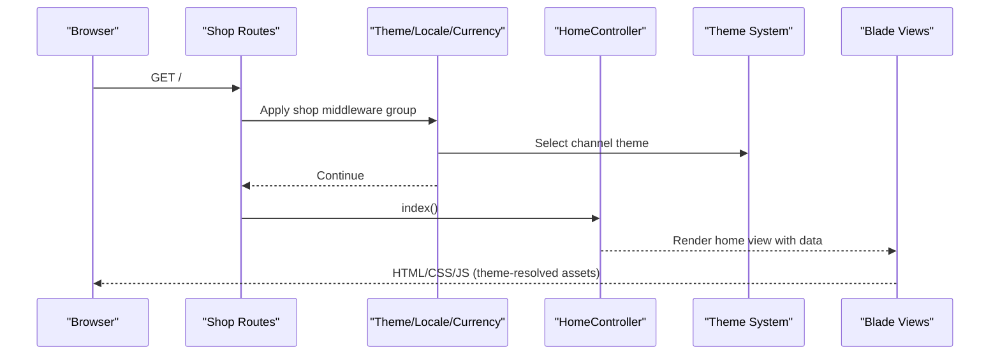

**Diagram sources**
- [web.php:1-19](file://packages/Webkul/Shop/src/Routes/web.php#L1-L19)
- [ShopServiceProvider.php:30-59](file://packages/Webkul/Shop/src/Providers/ShopServiceProvider.php#L30-L59)
- [HomeController.php:37-52](file://packages/Webkul/Shop/src/Http/Controllers/HomeController.php#L37-L52)
- [Theme.php:90-103](file://packages/Webkul/Theme/src/Theme.php#L90-L103)
- [Themes.php:165-190](file://packages/Webkul/Theme/src/Themes.php#L165-L190)

## Detailed Component Analysis

### Theme System and Responsive Design
The theme system dynamically selects the active theme per channel and resolves assets via Vite. It supports parent-child theme relationships and ensures view paths are updated to prioritize theme-specific templates.

Key behaviors:
- Theme selection based on channel configuration with fallback to default
- Asset URL generation through Vite with hot reload and build directories
- View path resolution to enable theme overrides

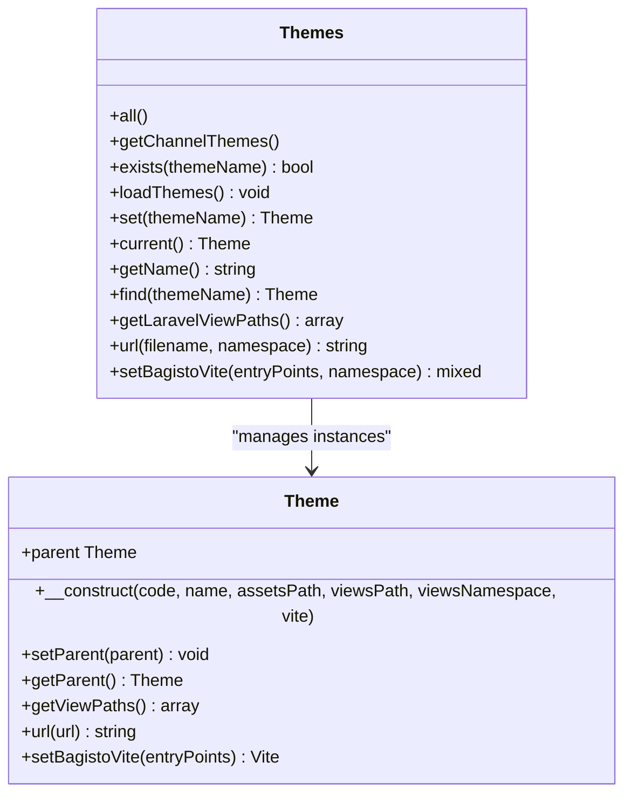

**Diagram sources**
- [Themes.php:10-200](file://packages/Webkul/Theme/src/Themes.php#L10-L200)
- [Theme.php:7-117](file://packages/Webkul/Theme/src/Theme.php#L7-L117)

**Section sources**
- [Theme.php:16-34](file://packages/Webkul/Shop/src/Http/Middleware/Theme.php#L16-L34)
- [Themes.php:165-190](file://packages/Webkul/Theme/src/Themes.php#L165-L190)
- [Theme.php:90-103](file://packages/Webkul/Theme/src/Theme.php#L90-L103)

### Middleware: Locale and Currency
Locale and currency middleware derive the appropriate values from the current channel and session, ensuring consistent localization and pricing across the storefront.

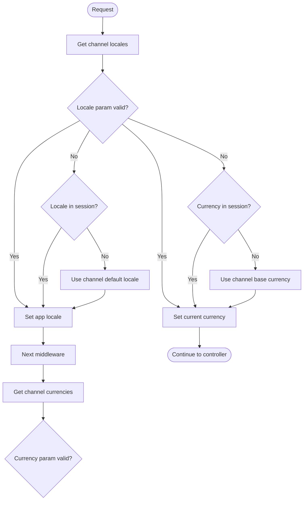

**Diagram sources**
- [Locale.php:24-42](file://packages/Webkul/Shop/src/Http/Middleware/Locale.php#L24-L42)
- [Currency.php:24-42](file://packages/Webkul/Shop/src/Http/Middleware/Currency.php#L24-L42)

**Section sources**
- [Locale.php:24-42](file://packages/Webkul/Shop/src/Http/Middleware/Locale.php#L24-L42)
- [Currency.php:24-42](file://packages/Webkul/Shop/src/Http/Middleware/Currency.php#L24-L42)

### Home Page and Hero Carousel
The home controller fetches theme customizations, hero slides, and visible category trees, passing them to the home view. The view renders a fullscreen hero carousel and category tabs.

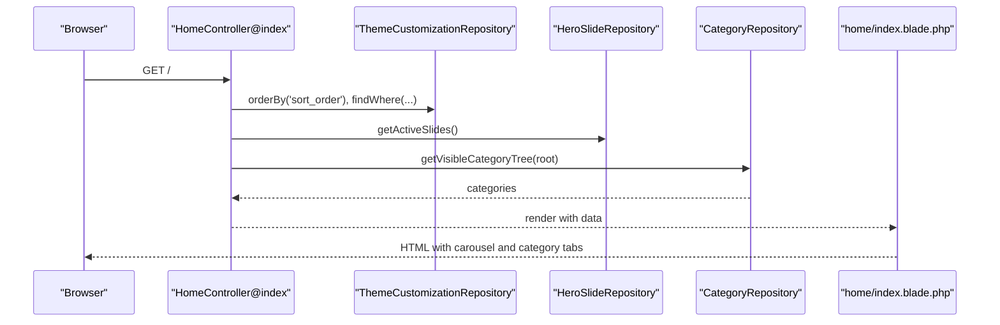

**Diagram sources**
- [HomeController.php:37-52](file://packages/Webkul/Shop/src/Http/Controllers/HomeController.php#L37-L52)
- [index.blade.php:27-46](file://packages/Webkul/Shop/src/Resources/views/home/index.blade.php#L27-L46)

**Section sources**
- [HomeController.php:37-52](file://packages/Webkul/Shop/src/Http/Controllers/HomeController.php#L37-L52)
- [index.blade.php:27-46](file://packages/Webkul/Shop/src/Resources/views/home/index.blade.php#L27-L46)

### Product Downloads and Samples
The product controller handles secure downloads for product attributes and downloadable samples/links, validating external URLs and blocking private/reserved IPs.

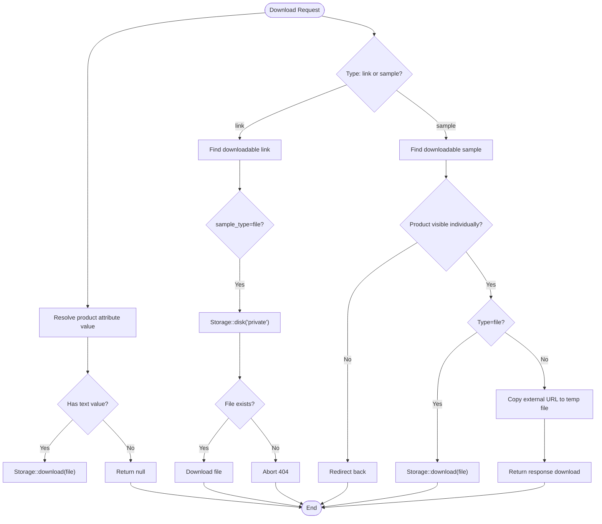

**Diagram sources**
- [ProductController.php:33-103](file://packages/Webkul/Shop/src/Http/Controllers/ProductController.php#L33-L103)
- [ProductController.php:108-154](file://packages/Webkul/Shop/src/Http/Controllers/ProductController.php#L108-L154)

**Section sources**
- [ProductController.php:33-103](file://packages/Webkul/Shop/src/Http/Controllers/ProductController.php#L33-L103)
- [ProductController.php:108-154](file://packages/Webkul/Shop/src/Http/Controllers/ProductController.php#L108-L154)

### All Categories Page with Responsive Grid System
**Updated** The new All Categories page features a sophisticated responsive grid system with adaptive column layouts and category cards.

#### All Categories Architecture
The All Categories page implements a responsive grid system with JavaScript-driven column adjustments:

```mermaid
graph TB
subgraph "All Categories Page"
ALL_CATEGORIES["All Categories Page<br/>all-categories.blade.php"]
RESPONSIVE_GRID["Responsive Grid System<br/>CSS Grid + JavaScript"]
CATEGORY_CARDS["Category Cards<br/>Aspect ratio 3:4"]
IMAGE_FALLBACK["Image Fallback<br/>Gradient backgrounds"]
OVERLAY_EFFECTS["Overlay Effects<br/>Dark gradient + labels"]
END
subgraph "Grid System"
DESKTOP_LAYOUT["Desktop Layout<br/>5 columns @ 1280px+"]
TABLET_LAYOUT["Tablet Layout<br/>4 columns @ 768px+"]
MOBILE_LAYOUT["Mobile Layout<br/>2 columns @ <768px"]
END
ALL_CATEGORIES --> RESPONSIVE_GRID
RESPONSIVE_GRID --> CATEGORY_CARDS
CATEGORY_CARDS --> IMAGE_FALLBACK
CATEGORY_CARDS --> OVERLAY_EFFECTS
RESPONSIVE_GRID --> DESKTOP_LAYOUT
RESPONSIVE_GRID --> TABLET_LAYOUT
RESPONSIVE_GRID --> MOBILE_LAYOUT
```

#### Responsive Grid Implementation
The grid system automatically adjusts based on viewport width with smooth transitions:

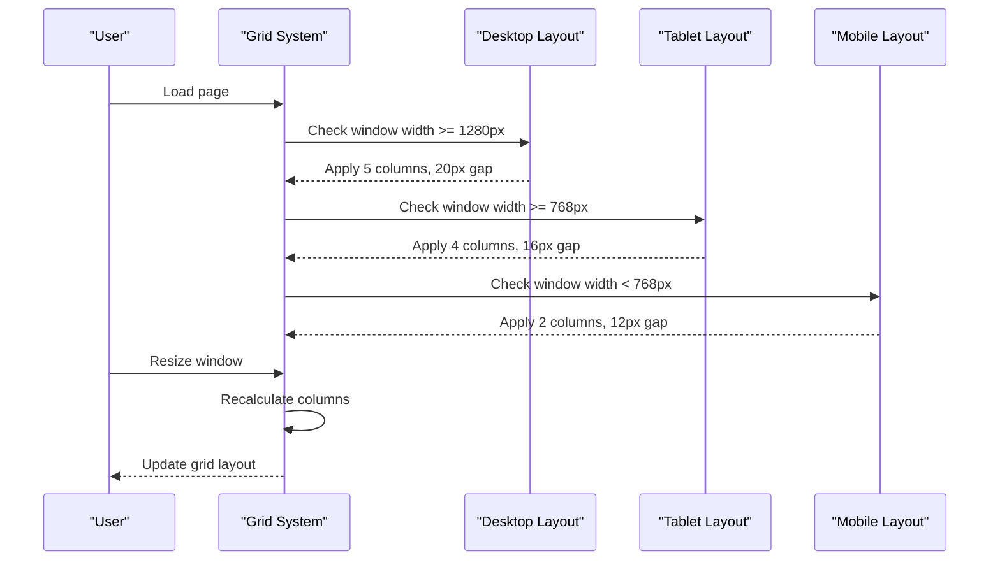

**Diagram sources**
- [all-categories.blade.php:71-97](file://packages/Webkul/Shop/src/Resources/views/home/all-categories.blade.php#L71-L97)

#### Category Card Design
Each category card features sophisticated styling with image fallbacks and overlay effects:

```mermaid
graph LR
subgraph "Category Card Structure"
CARD_WRAPPER["Card Wrapper<br/>Block element, no decoration"]
IMAGE_CONTAINER["Image Container<br/>Absolute positioning"]
BACKGROUND_IMAGE["Background Image<br/>Logo or banner URL"]
GRADIENT_OVERLAY["Gradient Overlay<br/>Dark gradient from bottom"]
LABEL_SECTION["Label Section<br/>White text with counts"]
END
CARD_WRAPPER --> IMAGE_CONTAINER
IMAGE_CONTAINER --> BACKGROUND_IMAGE
IMAGE_CONTAINER --> GRADIENT_OVERLAY
IMAGE_CONTAINER --> LABEL_SECTION
```

**Diagram sources**
- [all-categories.blade.php:22-61](file://packages/Webkul/Shop/src/Resources/views/home/all-categories.blade.php#L22-L61)

**Section sources**
- [all-categories.blade.php:17-97](file://packages/Webkul/Shop/src/Resources/views/home/all-categories.blade.php#L17-L97)

### Flash Sale Landing Page
**Updated** The Flash Sale landing page provides a promotional space with lightning bolt icon and coming soon messaging.

#### Flash Sale Architecture
The Flash Sale page implements a centered layout with promotional elements:

```mermaid
graph TB
subgraph "Flash Sale Page"
FLASH_SALE_PAGE["Flash Sale Page<br/>flash-sale.blade.php"]
LIGHTNING_ICON["Lightning Bolt Icon<br/>SVG graphics"]
HEADING_TEXT["Heading Text<br/>Flash Sale title"]
SUBTEXT_MESSAGE["Subtext Message<br/>Coming Soon"]
MIN_HEIGHT_LAYOUT["Min Height Layout<br/>Full viewport height"]
CENTERED_CONTENT["Centered Content<br/>Flexbox alignment"]
END
FLASH_SALE_PAGE --> LIGHTNING_ICON
FLASH_SALE_PAGE --> HEADING_TEXT
FLASH_SALE_PAGE --> SUBTEXT_MESSAGE
FLASH_SALE_PAGE --> MIN_HEIGHT_LAYOUT
MIN_HEIGHT_LAYOUT --> CENTERED_CONTENT
```

#### Visual Design Elements
The page features a cohesive design language with consistent typography and spacing:

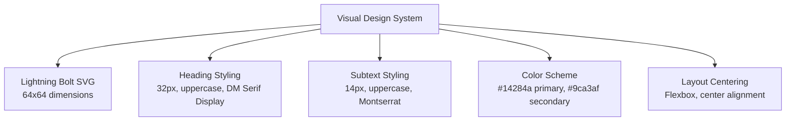

**Diagram sources**
- [flash-sale.blade.php:10-31](file://packages/Webkul/Shop/src/Resources/views/home/flash-sale.blade.php#L10-L31)

**Section sources**
- [flash-sale.blade.php:10-31](file://packages/Webkul/Shop/src/Resources/views/home/flash-sale.blade.php#L10-L31)

### Enhanced Product View Page Design
**Updated** The new product view page features a comprehensive two-column layout with enhanced gallery system, sticky positioning, and integrated floating action button navigation.

#### Product View Architecture
The product view page implements a sophisticated two-column design with responsive gallery system:

```mermaid
graph TB
subgraph "Product View Components"
PRODUCT_VIEW["Product View<br/>view.blade.php"]
GALLERY_SYSTEM["Gallery System<br/>gallery.blade.php"]
STICKY_COLUMNS["Sticky Columns<br/>Left/Right positioning"]
FLOATING_ACTION["Floating Action Button<br/>Mobile navigation"]
PRODUCT_INFO["Product Information<br/>Details, pricing, actions"]
ACCORDIONS["Accordions<br/>Details, returns, care"]
SHARE_SECTION["Share Section<br/>Social media integration"]
CONTACT_MODAL["Contact Modal<br/>Direct communication"]
END
```

#### Enhanced Gallery System
The gallery system provides a sophisticated dual-view experience with desktop and mobile implementations:

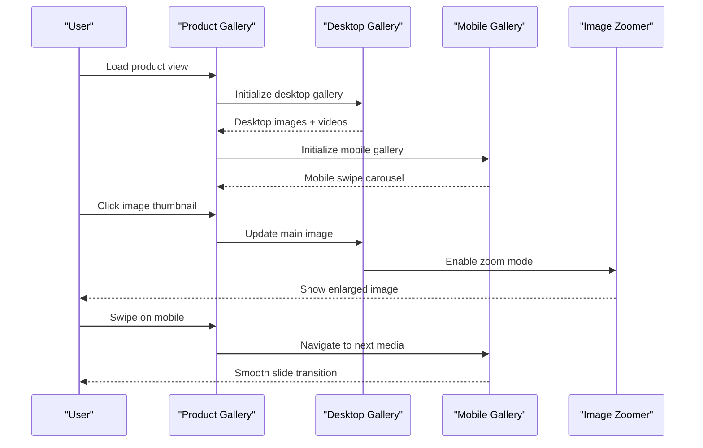

**Diagram sources**
- [view.blade.php:200-450](file://packages/Webkul/Shop/src/Resources/views/products/view.blade.php#L200-L450)
- [gallery.blade.php:20-232](file://packages/Webkul/Shop/src/Resources/views/products/view/gallery.blade.php#L20-L232)

#### Sticky Column Positioning
The product information section implements intelligent sticky positioning for optimal user experience:

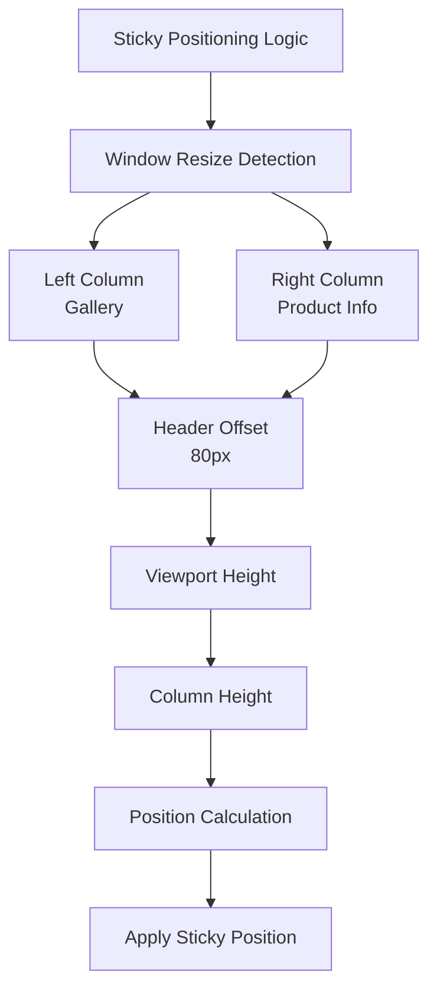

**Diagram sources**
- [view.blade.php:588-631](file://packages/Webkul/Shop/src/Resources/views/products/view.blade.php#L588-L631)

#### Floating Action Button Integration
The floating action button system provides seamless mobile navigation with bottom navigation:

```mermaid
graph LR
subgraph "Floating Action Button System"
BOTTOM_NAV["Bottom Navigation<br/>bottom-nav.blade.php"]
MENU_BUTTON["Menu Button<br/>Hamburger Icon"]
HOME_BUTTON["Home Button<br/>House Icon"]
ACCOUNT_BUTTON["Account Button<br/>User Icon"]
SEARCH_BUTTON["Search Button<br/>Search Icon"]
NAVIGATION_BAR["Navigation Bar<br/>Fixed at bottom"]
END
subgraph "Mobile Experience"
MOBILE_USER["Mobile User"]
SWIPE_GESTURES["Swipe Gestures"]
TOUCH_INTERACTIONS["Touch Interactions"]
RESPONSIVE_LAYOUT["Responsive Layout"]
END
BOTTOM_NAV --> NAVIGATION_BAR
NAVIGATION_BAR --> MOBILE_USER
MOBILE_USER --> SWIPE_GESTURES
MOBILE_USER --> TOUCH_INTERACTIONS
MOBILE_USER --> RESPONSIVE_LAYOUT
```

**Diagram sources**
- [bottom-nav.blade.php:1-58](file://packages/Webkul/Shop/src/Resources/views/components/layouts/bottom-nav.blade.php#L1-L58)

**Section sources**
- [view.blade.php:1-874](file://packages/Webkul/Shop/src/Resources/views/products/view.blade.php#L1-L874)
- [gallery.blade.php:1-232](file://packages/Webkul/Shop/src/Resources/views/products/view/gallery.blade.php#L1-L232)
- [gallery.blade.php:16-35](file://packages/Webkul/Shop/src/Resources/views/products/view/gallery.blade.php#L16-L35)
- [gallery.blade.php:37-232](file://packages/Webkul/Shop/src/Resources/views/products/view/gallery.blade.php#L37-L232)
- [bottom-nav.blade.php:1-58](file://packages/Webkul/Shop/src/Resources/views/components/layouts/bottom-nav.blade.php#L1-L58)

### Enhanced Header System
**Updated** The header system now features adaptive desktop/mobile switching with improved user experience and responsive design.

#### Header Architecture
The enhanced header system provides adaptive navigation for different screen sizes:

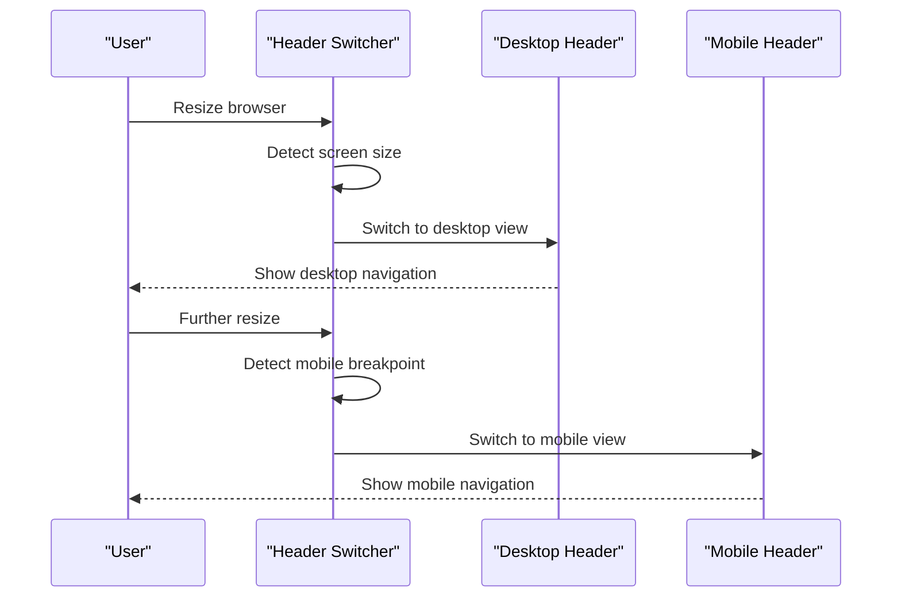

**Diagram sources**
- [index.blade.php:110-170](file://packages/Webkul/Shop/src/Resources/views/components/layouts/header/index.blade.php#L110-L170)

#### Responsive Header Components
The header system includes responsive components for optimal user experience:

```mermaid
graph TB
subgraph "Desktop Header"
DESKTOP_LOGO["Desktop Logo<br/>Full navigation"]
DESKTOP_NAV["Desktop Navigation<br/>Category dropdowns"]
DESKTOP_SEARCH["Desktop Search<br/>Advanced search"]
DESKTOP_ICONS["Desktop Icons<br/>Profile, cart, compare"]
END
subgraph "Mobile Header"
MOBILE_HAMBURGER["Mobile Hamburger<br/>Menu toggle"]
MOBILE_LOGO["Mobile Logo<br/>Centered branding"]
MOBILE_SEARCH_CART["Mobile Search & Cart<br/>Quick access icons"]
END
DESKTOP_LOGO --> DESKTOP_NAV
DESKTOP_NAV --> DESKTOP_SEARCH
DESKTOP_SEARCH --> DESKTOP_ICONS
MOBILE_HAMBURGER --> MOBILE_LOGO
MOBILE_LOGO --> MOBILE_SEARCH_CART
```

**Diagram sources**
- [index.blade.php:11-106](file://packages/Webkul/Shop/src/Resources/views/components/layouts/header/index.blade.php#L11-L106)

#### Advanced Desktop Header Features
The desktop header includes sophisticated category navigation and search functionality:

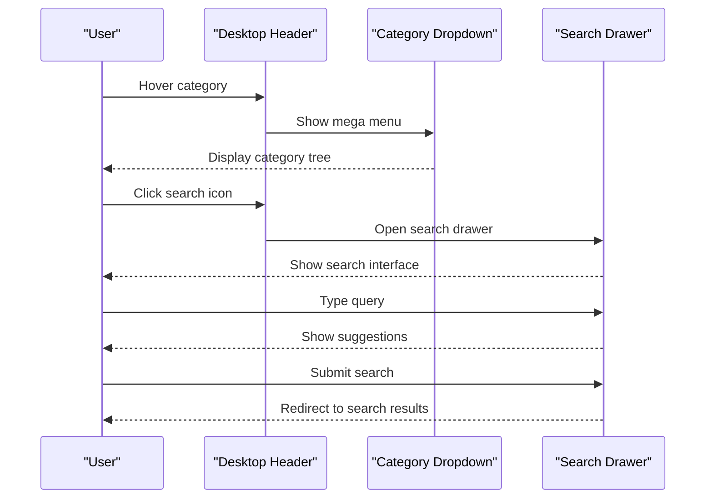

**Diagram sources**
- [bottom.blade.php:242-467](file://packages/Webkul/Shop/src/Resources/views/components/layouts/header/desktop/bottom.blade.php#L242-L467)
- [bottom.blade.php:488-786](file://packages/Webkul/Shop/src/Resources/views/components/layouts/header/desktop/bottom.blade.php#L488-L786)

**Section sources**
- [index.blade.php:1-170](file://packages/Webkul/Shop/src/Resources/views/components/layouts/header/index.blade.php#L1-L170)
- [bottom.blade.php:1-790](file://packages/Webkul/Shop/src/Resources/views/components/layouts/header/desktop/bottom.blade.php#L1-L790)

### Enhanced Product Display and Interaction
**Updated** Product display components have been enhanced with new card layouts and interactive features.

#### Product Card Architecture
The product card system provides enhanced user interaction and visual appeal:

```mermaid
graph TB
subgraph "Product Card Components"
IMAGE_SECTION["Image Section<br/>Lazy loading, hover effects"]
RATING_BADGE["Rating & Badges<br/>Sale/New indicators"]
ACTION_BUTTONS["Action Buttons<br/>Wishlist, compare, cart"]
NAME_PRICE["Name & Price<br/>Responsive typography"]
RATING_SECTION["Rating Section<br/>Star ratings display"]
END
subgraph "Interactive Features"
HOVER_EFFECTS["Hover Effects<br/>Image swap, CTA animation"]
TOUCH_INTERACTIONS["Touch Interactions<br/>Mobile-specific gestures"]
WISHLIST_FEATURES["Wishlist Features<br/>Login required actions"]
COMPARE_FEATURES["Compare Features<br/>Guest/local storage"]
CART_FEATURES["Cart Features<br/>API integration"]
END
IMAGE_SECTION --> RATING_BADGE
RATING_BADGE --> ACTION_BUTTONS
ACTION_BUTTONS --> NAME_PRICE
NAME_PRICE --> RATING_SECTION
ACTION_BUTTONS --> HOVER_EFFECTS
HOVER_EFFECTS --> TOUCH_INTERACTIONS
TOUCH_INTERACTIONS --> WISHLIST_FEATURES
WISHLIST_FEATURES --> COMPARE_FEATURES
COMPARE_FEATURES --> CART_FEATURES
```

**Diagram sources**
- [card.blade.php:7-469](file://packages/Webkul/Shop/src/Resources/views/components/products/card.blade.php#L7-L469)

#### Enhanced Product Display
The product display system includes sophisticated interaction patterns:

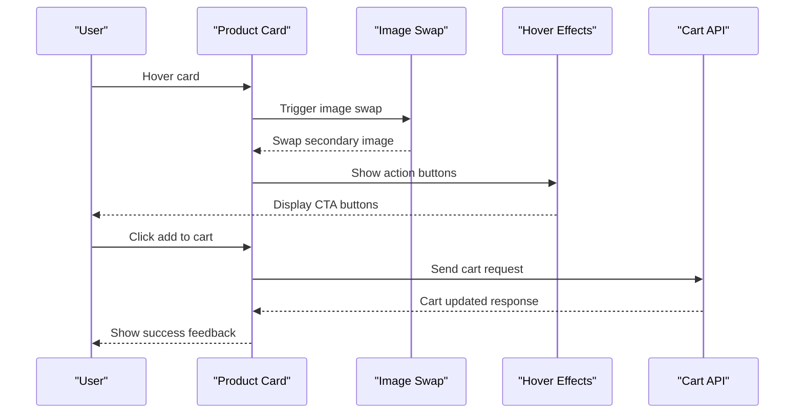

**Diagram sources**
- [card.blade.php:349-467](file://packages/Webkul/Shop/src/Resources/views/components/products/card.blade.php#L349-L467)

**Section sources**
- [card.blade.php:1-469](file://packages/Webkul/Shop/src/Resources/views/components/products/card.blade.php#L1-L469)

### Category Navigation and Product Display
**Updated** Category navigation is driven by the category tree repository and rendered via category components with enhanced modal-based filtering system.

#### Category Tabs and Filtering System
The category tabs component provides sophisticated filtering capabilities with modal-based drawer:

```mermaid
graph TB
subgraph "Category Tabs System"
CATEGORY_TABS["Category Tabs<br/>category-tabs.blade.php"]
TAB_BAR["Tab Bar<br/>Sticky, scrollable"]
FILTER_DRAWER["Filter Drawer<br/>Modal-based"]
FILTER_DRAWER --> CATEGORY_FILTER["Category Filter"]
FILTER_DRAWER --> PRICE_FILTER["Price Range Filter"]
FILTER_DRAWER --> SIZE_FILTER["Size Selection"]
FILTER_DRAWER --> COLOR_FILTER["Color Selection"]
FILTER_DRAWER --> SLEEVE_FILTER["Sleeve Style Filter"]
END
subgraph "Product Grid"
PRODUCT_GRID["Product Grid<br/>Auto-fill layout"]
LOADING_SKELETON["Loading Skeleton<br/>Shimmer effect"]
EMPTY_STATE["Empty State<br/>No products found"]
LOAD_MORE["Load More Button<br/>Pagination"]
END
CATEGORY_TABS --> TAB_BAR
CATEGORY_TABS --> FILTER_DRAWER
CATEGORY_TABS --> PRODUCT_GRID
PRODUCT_GRID --> LOADING_SKELETON
PRODUCT_GRID --> EMPTY_STATE
PRODUCT_GRID --> LOAD_MORE
```

#### Modal-Based Filtering Architecture
The filtering system uses a sophisticated modal approach with category tree navigation:

```mermaid
sequenceDiagram
participant User as "User"
participant FilterButton as "Filter Button"
participant FilterDrawer as "Filter Drawer"
participant CategoryTree as "Category Tree"
participant SizeSelector as "Size Selector"
User->>FilterButton : Click filter
FilterButton->>FilterDrawer : Open drawer
FilterDrawer->>CategoryTree : Fetch category tree
CategoryTree-->>FilterDrawer : Return hierarchical data
FilterDrawer->>SizeSelector : Initialize size selector
User->>FilterDrawer : Select filters
FilterDrawer->>FilterDrawer : Apply filters
FilterDrawer-->>User : Close drawer
FilterDrawer-->>ProductGrid : Update product display
```

**Diagram sources**
- [category-tabs.blade.php:579-612](file://packages/Webkul/Shop/src/Resources/views/components/categories/category-tabs.blade.php#L579-L612)
- [category-tabs.blade.php:634-664](file://packages/Webkul/Shop/src/Resources/views/components/categories/category-tabs.blade.php#L634-L664)

#### Advanced Filtering Features
The filtering system includes sophisticated features for price range, size selection, and category navigation:

```mermaid
graph LR
subgraph "Filtering Components"
PRICE_SLIDER["Price Slider<br/>Dual-range input"]
SIZE_SELECTOR["Size Selector<br/>Modal with search"]
COLOR_PICKER["Color Picker<br/>Multi-select"]
CATEGORY_TREE["Category Tree<br/>Hierarchical navigation"]
SLEEVE_OPTIONS["Sleeve Options<br/>Dropdown selection"]
END
subgraph "Filter Application"
FILTER_COUNT["Filter Count Badge<br/>Badge indicator"]
CLEAR_ALL["Clear All Filters<br/>Reset functionality"]
APPLY_FILTERS["Apply Filters<br/>Update product grid"]
END
PRICE_SLIDER --> FILTER_COUNT
SIZE_SELECTOR --> FILTER_COUNT
COLOR_PICKER --> FILTER_COUNT
CATEGORY_TREE --> FILTER_COUNT
SLEEVE_OPTIONS --> FILTER_COUNT
FILTER_COUNT --> CLEAR_ALL
FILTER_COUNT --> APPLY_FILTERS
```

**Diagram sources**
- [category-tabs.blade.php:105-1443](file://packages/Webkul/Shop/src/Resources/views/components/categories/category-tabs.blade.php#L105-L1443)

**Section sources**
- [category-tabs.blade.php:1-1443](file://packages/Webkul/Shop/src/Resources/views/components/categories/category-tabs.blade.php#L1-L1443)
- [index.blade.php:46-46](file://packages/Webkul/Shop/src/Resources/views/home/index.blade.php#L46-L46)
- [CategoryTreeResource.php](file://packages/Webkul/Shop/src/Http/Resources/CategoryTreeResource.php)
- [CategoryResource.php](file://packages/Webkul/Shop/src/Http/Resources/CategoryResource.php)
- [ProductResource.php](file://packages/Webkul/Shop/src/Http/Resources/ProductResource.php)

### Search Functionality
**Updated** Search results are rendered using a dedicated search view with enhanced filtering capabilities and modal-based drawer system.

```mermaid
sequenceDiagram
participant Browser as "Browser"
participant SearchCtrl as "SearchController"
participant View as "search/index.blade.php"
participant ProdRes as "ProductResource"
participant FilterDrawer as "Filter Drawer"
Browser->>SearchCtrl : GET /search?q=...
SearchCtrl-->>View : render with results
View->>ProdRes : Format product data
View->>FilterDrawer : Initialize filter drawer
FilterDrawer-->>View : Ready for filtering
View-->>Browser : Rendered search results with filters
```

**Diagram sources**
- [search.blade.php](file://packages/Webkul/Shop/src/Resources/views/search/index.blade.php)
- [ProductResource.php](file://packages/Webkul/Shop/src/Http/Resources/ProductResource.php)
- [category-tabs.blade.php:105-1443](file://packages/Webkul/Shop/src/Resources/views/components/categories/category-tabs.blade.php#L105-L1443)

**Section sources**
- [search.blade.php](file://packages/Webkul/Shop/src/Resources/views/search/index.blade.php)
- [ProductResource.php](file://packages/Webkul/Shop/src/Http/Resources/ProductResource.php)

### Customer Account Management and Order History
Customer account dashboards, order history, wishlist, and comparison features are supported by dedicated views and resources.

```mermaid
graph LR
CustDash["customer/account/dashboard.blade.php"] --> Orders["customer/account/orders.blade.php"]
CustDash --> Wishlist["customer/account/wishlist.blade.php"]
CustDash --> Compare["compare/index.blade.php"]
Orders --> OrderRes["OrderDataGrid.php"]
Wishlist --> WishRes["WishlistResource.php"]
Compare --> CompareRes["CompareItemResource.php"]
```

**Diagram sources**
- [customer.blade.php](file://packages/Webkul/Shop/src/Resources/views/customers/account/dashboard.blade.php)
- [orders.blade.php](file://packages/Webkul/Shop/src/Resources/views/customers/account/orders.blade.php)
- [wishlist.blade.php](file://packages/Webkul/Shop/src/Resources/views/customers/account/wishlist.blade.php)
- [compare.blade.php](file://packages/Webkul/Shop/src/Resources/views/compare/index.blade.php)
- [OrderDataGrid.php](file://packages/Webkul/Shop/src/DataGrids/OrderDataGrid.php)
- [WishlistResource.php](file://packages/Webkul/Shop/src/Http/Resources/WishlistResource.php)
- [DownloadableProductDataGrid.php](file://packages/Webkul/Shop/src/DataGrids/DownloadableProductDataGrid.php)
- [GDPRRequestsDatagrid.php](file://packages/Webkul/Shop/src/DataGrids/GDPRRequestsDatagrid.php)

**Section sources**
- [customer.blade.php](file://packages/Webkul/Shop/src/Resources/views/customers/account/dashboard.blade.php)
- [orders.blade.php](file://packages/Webkul/Shop/src/Resources/views/customers/account/orders.blade.php)
- [wishlist.blade.php](file://packages/Webkul/Shop/src/Resources/views/customers/account/wishlist.blade.php)
- [compare.blade.php](file://packages/Webkul/Shop/src/Resources/views/compare/index.blade.php)
- [OrderDataGrid.php](file://packages/Webkul/Shop/src/DataGrids/OrderDataGrid.php)
- [WishlistResource.php](file://packages/Webkul/Shop/src/Http/Resources/WishlistResource.php)
- [DownloadableProductDataGrid.php](file://packages/Webkul/Shop/src/DataGrids/DownloadableProductDataGrid.php)
- [GDPRRequestsDatagrid.php](file://packages/Webkul/Shop/src/DataGrids/GDPRRequestsDatagrid.php)

### Checkout and Cart
**Updated** Cart rendering and checkout flows are handled by dedicated views and resources with streamlined processes.

```mermaid
sequenceDiagram
participant CartView as "checkout/cart.blade.php"
participant CartRes as "CartResource"
participant CartItemRes as "CartItemResource"
CartView->>CartRes : Format cart data
CartView->>CartItemRes : Format items
CartView-->>CartView : Render totals, items, actions
```

**Diagram sources**
- [cart.blade.php](file://packages/Webkul/Shop/src/Resources/views/checkout/cart.blade.php)
- [CartResource.php](file://packages/Webkul/Shop/src/Http/Resources/CartResource.php)
- [CartItemResource.php](file://packages/Webkul/Shop/src/Http/Resources/CartItemResource.php)

**Section sources**
- [cart.blade.php](file://packages/Webkul/Shop/src/Resources/views/checkout/cart.blade.php)
- [CartResource.php](file://packages/Webkul/Shop/src/Http/Resources/CartResource.php)
- [CartItemResource.php](file://packages/Webkul/Shop/src/Http/Resources/CartItemResource.php)

### Support Features and Contact Us
The contact form posts to the home controller, which sends an email notification and flashes a success/error message.

```mermaid
sequenceDiagram
participant Browser as "Browser"
participant HomeCtrl as "HomeController@sendContactUsMail"
participant Mail as "ContactUs Mailable"
participant Session as "Session Flash"
Browser->>HomeCtrl : POST contact us
HomeCtrl->>Mail : Queue mailable
Mail-->>HomeCtrl : Queued
HomeCtrl->>Session : flash success/error
HomeCtrl-->>Browser : back()
```

**Diagram sources**
- [HomeController.php:79-97](file://packages/Webkul/Shop/src/Http/Controllers/HomeController.php#L79-L97)

**Section sources**
- [HomeController.php:79-97](file://packages/Webkul/Shop/src/Http/Controllers/HomeController.php#L79-L97)

## Dependency Analysis
The shop module depends on core domain modules for categories, products, customers, checkout, sales, and theme customization. The routing and middleware layers connect these domains to the presentation layer.

```mermaid
graph TB
subgraph "Routing & Middleware"
Routes["Routes web.php"]
ShopSP["ShopServiceProvider"]
ThemeMW["Middleware Theme"]
LocaleMW["Middleware Locale"]
CurrencyMW["Middleware Currency"]
END
subgraph "Controllers"
HomeCtrl["HomeController"]
ProdCtrl["ProductController"]
END
subgraph "Domain"
CatRepo["CategoryRepository"]
HeroRepo["HeroSlideRepository"]
ThemeCustomRepo["ThemeCustomizationRepository"]
ProductModel["Product"]
CartModel["Cart"]
OrderModel["Order"]
END
subgraph "Presentation"
HomeView["home/index.blade.php"]
AllCategoriesView["home/all-categories.blade.php"]
FlashSaleView["home/flash-sale.blade.php"]
CartView["checkout/cart.blade.php"]
SearchView["search/index.blade.php"]
CustomerView["customers/account/*.blade.php"]
CategoryView["categories/*.blade.php"]
ProductView["products/view.blade.php"]
CategoryTabsView["components/categories/category-tabs.blade.php"]
END
Routes --> ShopSP
ShopSP --> ThemeMW
ShopSP --> LocaleMW
ShopSP --> CurrencyMW
Routes --> HomeCtrl
Routes --> ProdCtrl
HomeCtrl --> CatRepo
HomeCtrl --> HeroRepo
HomeCtrl --> ThemeCustomRepo
ProdCtrl --> ProductModel
HomeCtrl --> HomeView
HomeCtrl --> AllCategoriesView
HomeCtrl --> FlashSaleView
CatRepo --> CategoryTabsView
ProductModel --> CategoryTabsView
CartView --> CartModel
SearchView --> ProductModel
CustomerView --> OrderModel
CategoryView --> CatRepo
ProductView --> ProductModel
```

**Diagram sources**
- [web.php:1-19](file://packages/Webkul/Shop/src/Routes/web.php#L1-L19)
- [ShopServiceProvider.php:30-59](file://packages/Webkul/Shop/src/Providers/ShopServiceProvider.php#L30-L59)
- [HomeController.php:26-30](file://packages/Webkul/Shop/src/Http/Controllers/HomeController.php#L26-L30)
- [ProductController.php:19-24](file://packages/Webkul/Shop/src/Http/Controllers/ProductController.php#L19-L24)
- [index.blade.php:1-75](file://packages/Webkul/Shop/src/Resources/views/home/index.blade.php#L1-L75)
- [all-categories.blade.php:1-97](file://packages/Webkul/Shop/src/Resources/views/home/all-categories.blade.php#L1-L97)
- [flash-sale.blade.php:1-32](file://packages/Webkul/Shop/src/Resources/views/home/flash-sale.blade.php#L1-L32)
- [cart.blade.php](file://packages/Webkul/Shop/src/Resources/views/checkout/cart.blade.php)
- [search.blade.php](file://packages/Webkul/Shop/src/Resources/views/search/index.blade.php)
- [customer.blade.php](file://packages/Webkul/Shop/src/Resources/views/customers/account/dashboard.blade.php)
- [OrderDataGrid.php](file://packages/Webkul/Shop/src/DataGrids/OrderDataGrid.php)

**Section sources**
- [web.php:1-19](file://packages/Webkul/Shop/src/Routes/web.php#L1-L19)
- [ShopServiceProvider.php:30-59](file://packages/Webkul/Shop/src/Providers/ShopServiceProvider.php#L30-L59)
- [HomeController.php:26-30](file://packages/Webkul/Shop/src/Http/Controllers/HomeController.php#L26-L30)
- [ProductController.php:19-24](file://packages/Webkul/Shop/src/Http/Controllers/ProductController.php#L19-L24)

## Performance Considerations
- Middleware efficiency: Locale and currency middleware operate with minimal overhead by leveraging channel configurations and session caching.
- Theme loading: Themes are loaded once per request context; ensure theme configurations are optimized to avoid excessive view path scanning.
- Asset delivery: Vite-based asset URLs reduce bundle sizes and enable hot reloading during development.
- Pagination: Default pagination views are configured for the shop to keep lists performant.
- Data retrieval: Controllers fetch only required data (e.g., active hero slides, visible categories) to minimize payload.
- **Updated** All Categories grid system: CSS Grid with JavaScript fallback ensures optimal performance across devices.
- **Updated** Flash Sale page: Lightweight SVG graphics and minimal JavaScript for fast loading.
- **Updated** Product gallery optimization: Dual-view gallery system with lazy loading and responsive image handling.
- **Updated** Sticky positioning performance: Efficient scroll event handling with ResizeObserver for optimal performance.
- **Updated** Mobile navigation: Bottom navigation bar with fixed positioning for smooth scrolling experience.
- **Updated** Search drawer performance: Debounced search with request cancellation to prevent memory leaks.
- **Updated** Image zoomer optimization: Efficient canvas-based zooming with proper cleanup and memory management.
- **Updated** Modal filtering system: Optimized category tree loading with caching and skeleton states.

## Troubleshooting Guide
Common issues and resolutions:
- Theme not applied: Verify channel theme configuration and default fallback in middleware.
- Locale/currency mismatch: Confirm channel locales/currencies and session values.
- Download failures: Check downloadable link/sample existence and external URL validation.
- 404 on downloads: Ensure files exist on storage and external URLs pass validation.
- Contact form errors: Review queued mail configuration and flashed messages.
- **Updated** All Categories grid not responsive: Check CSS Grid properties and JavaScript column calculations.
- **Updated** Flash Sale page not displaying: Verify route configuration and view rendering.
- **Updated** Product gallery not loading: Check media array initialization and image/video fallback handling.
- **Updated** Sticky positioning issues: Verify header offset calculation and viewport height detection.
- **Updated** Floating action button not responding: Ensure proper event listeners and bottom navigation styling.
- **Updated** Search drawer not opening: Check escape key handlers and body overflow management.
- **Updated** Image zoomer not working: Verify attachment array and zoom state management.
- **Updated** Category filtering not applying: Check filter state management and product grid updates.
- **Updated** Mobile category navigation issues: Verify Vue.js component initialization and category tree loading.

**Section sources**
- [Theme.php:16-34](file://packages/Webkul/Shop/src/Http/Middleware/Theme.php#L16-L34)
- [Locale.php:24-42](file://packages/Webkul/Shop/src/Http/Middleware/Locale.php#L24-L42)
- [Currency.php:24-42](file://packages/Webkul/Shop/src/Http/Middleware/Currency.php#L24-L42)
- [ProductController.php:108-154](file://packages/Webkul/Shop/src/Http/Controllers/ProductController.php#L108-L154)
- [HomeController.php:79-97](file://packages/Webkul/Shop/src/Http/Controllers/HomeController.php#L79-L97)
- [all-categories.blade.php:71-97](file://packages/Webkul/Shop/src/Resources/views/home/all-categories.blade.php#L71-L97)
- [flash-sale.blade.php:10-31](file://packages/Webkul/Shop/src/Resources/views/home/flash-sale.blade.php#L10-L31)
- [gallery.blade.php:87-103](file://packages/Webkul/Shop/src/Resources/views/products/view/gallery.blade.php#L87-L103)
- [view.blade.php:588-631](file://packages/Webkul/Shop/src/Resources/views/products/view.blade.php#L588-L631)
- [bottom-nav.blade.php:1-58](file://packages/Webkul/Shop/src/Resources/views/components/layouts/bottom-nav.blade.php#L1-L58)
- [bottom.blade.php:631-764](file://packages/Webkul/Shop/src/Resources/views/components/layouts/header/desktop/bottom.blade.php#L631-L764)
- [category-tabs.blade.php:579-612](file://packages/Webkul/Shop/src/Resources/views/components/categories/category-tabs.blade.php#L579-L612)

## Conclusion
The shop interface integrates routing, middleware, theme management, and domain-driven controllers to deliver a responsive, customizable storefront. Product display, category navigation, search, and customer experiences are supported by dedicated views and resources. The theme system enables flexible customization and asset management, while middleware ensures consistent locale and currency handling. The integration with admin interfaces allows content managers to configure themes, hero carousels, and categories, optimizing the customer journey across devices.

**Updated** The comprehensive modernization introduces advanced All Categories page with responsive grid system, Flash Sale landing page with promotional design, enhanced product view page design with improved gallery system, integrated floating action button navigation, responsive header system, sophisticated modal-based filtering system, streamlined checkout processes, and updated mobile navigation components. These enhancements provide a superior user experience across all device types with optimized performance and intuitive interaction patterns.

## Appendices
- Routes: storefront, customer, checkout, and API routes are grouped and registered by the Shop service provider.
- Data grids: order, downloadable product, and GDPR requests grids support admin and customer-facing data presentation.
- Resources: standardized API resources ensure consistent data formatting across views.
- **Updated** All Categories page: responsive grid system with adaptive column layouts and category cards.
- **Updated** Flash Sale page: promotional landing page with lightning bolt icon and coming soon messaging.
- **Updated** Product view components: comprehensive product display system with enhanced gallery and sticky positioning.
- **Updated** Navigation components: adaptive header system with desktop/mobile switching and floating action button integration.
- **Updated** Search components: advanced search drawer with debounced queries and real-time suggestions.
- **Updated** Category components: sophisticated modal-based filtering system with category tree navigation and size selectors.
- **Updated** Mobile navigation: bottom navigation bar with fixed positioning and smooth scrolling experience.

**Section sources**
- [web.php:1-19](file://packages/Webkul/Shop/src/Routes/web.php#L1-L19)
- [store-front-routes.php](file://packages/Webkul/Shop/src/Routes/store-front-routes.php)
- [customer-routes.php](file://packages/Webkul/Shop/src/Routes/customer-routes.php)
- [checkout-routes.php](file://packages/Webkul/Shop/src/Routes/checkout-routes.php)
- [api.php](file://packages/Webkul/Shop/src/Routes/api.php)
- [OrderDataGrid.php](file://packages/Webkul/Shop/src/DataGrids/OrderDataGrid.php)
- [DownloadableProductDataGrid.php](file://packages/Webkul/Shop/src/DataGrids/DownloadableProductDataGrid.php)
- [GDPRRequestsDatagrid.php](file://packages/Webkul/Shop/src/DataGrids/GDPRRequestsDatagrid.php)
- [all-categories.blade.php:17-97](file://packages/Webkul/Shop/src/Resources/views/home/all-categories.blade.php#L17-L97)
- [flash-sale.blade.php:10-31](file://packages/Webkul/Shop/src/Resources/views/home/flash-sale.blade.php#L10-L31)
- [view.blade.php:1-874](file://packages/Webkul/Shop/src/Resources/views/products/view.blade.php#L1-L874)
- [gallery.blade.php:1-232](file://packages/Webkul/Shop/src/Resources/views/products/view/gallery.blade.php#L1-L232)
- [bottom-nav.blade.php:1-58](file://packages/Webkul/Shop/src/Resources/views/components/layouts/bottom-nav.blade.php#L1-L58)
- [bottom.blade.php:1-790](file://packages/Webkul/Shop/src/Resources/views/components/layouts/header/desktop/bottom.blade.php#L1-L790)
- [category-tabs.blade.php:105-1443](file://packages/Webkul/Shop/src/Resources/views/components/categories/category-tabs.blade.php#L105-L1443)