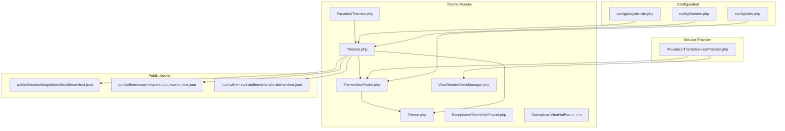
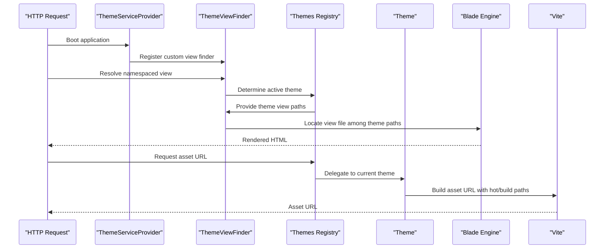
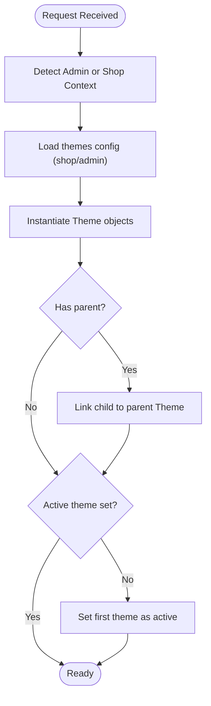
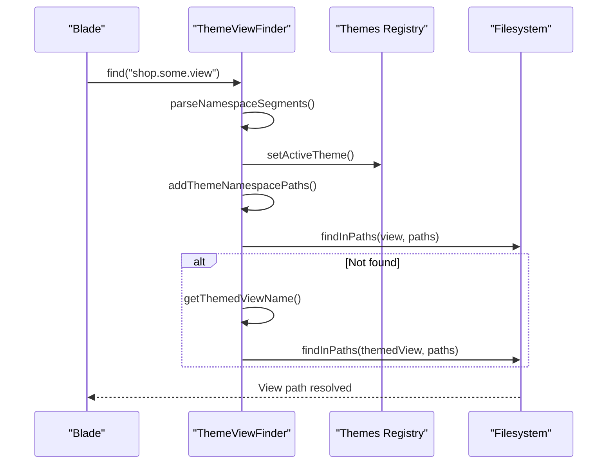
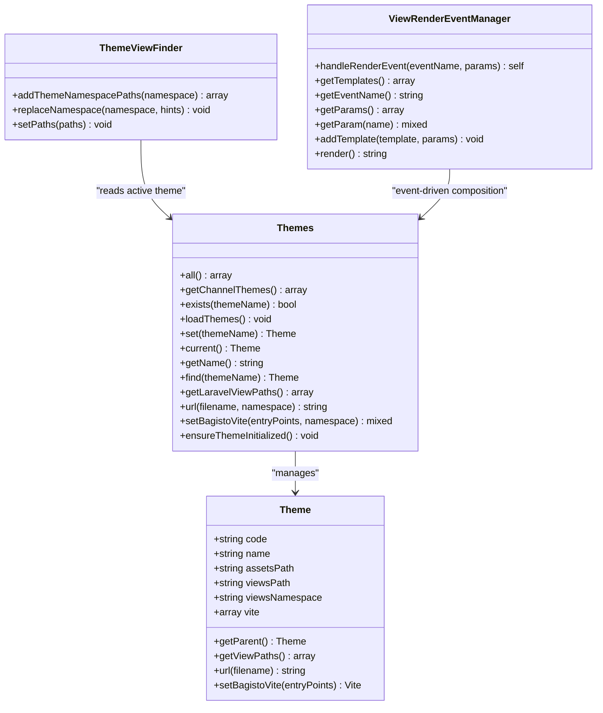
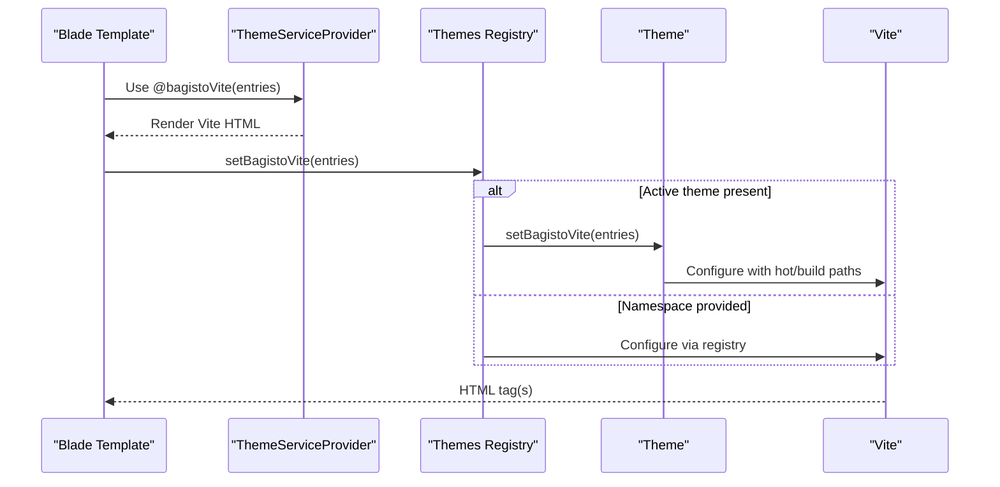
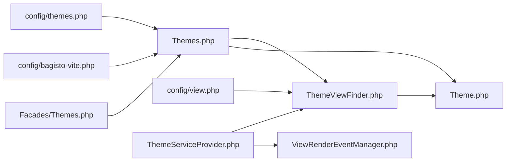

# Theme System

<cite>
**Referenced Files in This Document**
- [config/themes.php](file://config/themes.php)
- [config/view.php](file://config/view.php)
- [config/bagisto-vite.php](file://config/bagisto-vite.php)
- [packages/Webkul/Theme/src/Themes.php](file://packages/Webkul/Theme/src/Themes.php)
- [packages/Webkul/Theme/src/Theme.php](file://packages/Webkul/Theme/src/Theme.php)
- [packages/Webkul/Theme/src/ThemeViewFinder.php](file://packages/Webkul/Theme/src/ThemeViewFinder.php)
- [packages/Webkul/Theme/src/ViewRenderEventManager.php](file://packages/Webkul/Theme/src/ViewRenderEventManager.php)
- [packages/Webkul/Theme/src/Providers/ThemeServiceProvider.php](file://packages/Webkul/Theme/src/Providers/ThemeServiceProvider.php)
- [packages/Webkul/Theme/src/Facades/Themes.php](file://packages/Webkul/Theme/src/Facades/Themes.php)
- [packages/Webkul/Theme/src/Exceptions/ThemeNotFound.php](file://packages/Webkul/Theme/src/Exceptions/ThemeNotFound.php)
- [packages/Webkul/Theme/src/Exceptions/ViterNotFound.php](file://packages/Webkul/Theme/src/Exceptions/ViterNotFound.php)
- [public/themes/shop/default/build/manifest.json](file://public/themes/shop/default/build/manifest.json)
- [public/themes/admin/default/build/manifest.json](file://public/themes/admin/default/build/manifest.json)
- [public/themes/installer/default/build/manifest.json](file://public/themes/installer/default/build/manifest.json)
</cite>

## Table of Contents
1. [Introduction](#introduction)
2. [Project Structure](#project-structure)
3. [Core Components](#core-components)
4. [Architecture Overview](#architecture-overview)
5. [Detailed Component Analysis](#detailed-component-analysis)
6. [Dependency Analysis](#dependency-analysis)
7. [Performance Considerations](#performance-considerations)
8. [Troubleshooting Guide](#troubleshooting-guide)
9. [Conclusion](#conclusion)
10. [Appendices](#appendices)

## Introduction
This document explains the theme system architecture and customization capabilities in the project. It covers how themes are discovered, registered, loaded, and rendered; how the view finder resolves themed views; and how template rendering events are managed. It also documents the theme configuration system, asset management via Vite, and practical guidance for creating and modifying themes, including CSS overrides, component replacement, layout modifications, and responsive design patterns.

## Project Structure
The theme system spans configuration, a dedicated module, and runtime services:
- Configuration defines shop and admin themes, default theme selection, and Vite registries.
- The Theme module provides the Theme model, a theme registry, a custom view finder, and a view rendering event manager.
- The Theme service provider registers the custom view finder and Blade directives for Vite integration.
- Public build artifacts under the public/themes directory provide compiled assets per theme.

**Diagram sources**
- [config/themes.php:1-54](file://config/themes.php#L1-L54)
- [config/view.php:1-44](file://config/view.php#L1-L44)
- [config/bagisto-vite.php:1-33](file://config/bagisto-vite.php#L1-L33)
- [packages/Webkul/Theme/src/Themes.php:1-349](file://packages/Webkul/Theme/src/Themes.php#L1-L349)
- [packages/Webkul/Theme/src/Theme.php:1-117](file://packages/Webkul/Theme/src/Theme.php#L1-L117)
- [packages/Webkul/Theme/src/ThemeViewFinder.php:1-164](file://packages/Webkul/Theme/src/ThemeViewFinder.php#L1-L164)
- [packages/Webkul/Theme/src/ViewRenderEventManager.php:1-133](file://packages/Webkul/Theme/src/ViewRenderEventManager.php#L1-L133)
- [packages/Webkul/Theme/src/Providers/ThemeServiceProvider.php:1-50](file://packages/Webkul/Theme/src/Providers/ThemeServiceProvider.php#L1-L50)
- [packages/Webkul/Theme/src/Facades/Themes.php:1-20](file://packages/Webkul/Theme/src/Facades/Themes.php#L1-L20)
- [packages/Webkul/Theme/src/Exceptions/ThemeNotFound.php:1-18](file://packages/Webkul/Theme/src/Exceptions/ThemeNotFound.php#L1-L18)
- [packages/Webkul/Theme/src/Exceptions/ViterNotFound.php:1-18](file://packages/Webkul/Theme/src/Exceptions/ViterNotFound.php#L1-L18)
- [public/themes/shop/default/build/manifest.json](file://public/themes/shop/default/build/manifest.json)
- [public/themes/admin/default/build/manifest.json](file://public/themes/admin/default/build/manifest.json)
- [public/themes/installer/default/build/manifest.json](file://public/themes/installer/default/build/manifest.json)

**Section sources**
- [config/themes.php:1-54](file://config/themes.php#L1-L54)
- [config/view.php:1-44](file://config/view.php#L1-L44)
- [config/bagisto-vite.php:1-33](file://config/bagisto-vite.php#L1-L33)
- [packages/Webkul/Theme/src/Providers/ThemeServiceProvider.php:1-50](file://packages/Webkul/Theme/src/Providers/ThemeServiceProvider.php#L1-L50)

## Core Components
- Theme model: Holds theme metadata (code, name, assets path, views path, views namespace, Vite config) and computes view paths up the parent chain. Provides asset URL generation and Vite entry point binding.
- Themes registry: Loads configured themes, supports parent-child relationships, activates a theme, updates Laravel’s view paths, and exposes helpers for asset URLs and Vite entry points.
- ThemeViewFinder: Extends Laravel’s FileViewFinder to resolve namespaced views with theme-aware precedence, supports admin vs shop namespaces, and overlays theme-specific paths.
- ViewRenderEventManager: Centralized event-driven template aggregation for rendering partials or blocks during page composition.
- Theme service provider: Registers the custom view finder, Blade directives for Vite, and the view rendering event manager singleton.
- Facade: Provides a convenient themes() global accessor to the Themes registry.

**Section sources**
- [packages/Webkul/Theme/src/Theme.php:1-117](file://packages/Webkul/Theme/src/Theme.php#L1-L117)
- [packages/Webkul/Theme/src/Themes.php:1-349](file://packages/Webkul/Theme/src/Themes.php#L1-L349)
- [packages/Webkul/Theme/src/ThemeViewFinder.php:1-164](file://packages/Webkul/Theme/src/ThemeViewFinder.php#L1-L164)
- [packages/Webkul/Theme/src/ViewRenderEventManager.php:1-133](file://packages/Webkul/Theme/src/ViewRenderEventManager.php#L1-L133)
- [packages/Webkul/Theme/src/Providers/ThemeServiceProvider.php:1-50](file://packages/Webkul/Theme/src/Providers/ThemeServiceProvider.php#L1-L50)
- [packages/Webkul/Theme/src/Facades/Themes.php:1-20](file://packages/Webkul/Theme/src/Facades/Themes.php#L1-L20)

## Architecture Overview
The theme system integrates tightly with Laravel’s view engine and Vite. At runtime:
- The Themes registry loads configured themes and sets the active theme based on request context.
- The ThemeViewFinder augments Laravel’s view resolution to prioritize theme-specific views and overlay paths.
- Asset URLs are generated via Theme::url or Themes::url, delegating to Vite with hot-file and build-directory settings from theme or Vite registry configs.
- The ViewRenderEventManager coordinates template rendering through events.

**Diagram sources**
- [packages/Webkul/Theme/src/Providers/ThemeServiceProvider.php:17-48](file://packages/Webkul/Theme/src/Providers/ThemeServiceProvider.php#L17-L48)
- [packages/Webkul/Theme/src/ThemeViewFinder.php:32-49](file://packages/Webkul/Theme/src/ThemeViewFinder.php#L32-L49)
- [packages/Webkul/Theme/src/Themes.php:165-190](file://packages/Webkul/Theme/src/Themes.php#L165-L190)
- [packages/Webkul/Theme/src/Theme.php:90-103](file://packages/Webkul/Theme/src/Theme.php#L90-L103)

## Detailed Component Analysis

### Theme Discovery and Registration
- Configuration: Themes are declared in config/themes.php under shop and admin sections, specifying default theme codes and per-theme metadata including assets_path, views_path, and Vite settings. A separate config/bagisto-vite.php holds Vite registries keyed by namespace.
- Registry loading: Themes::loadThemes reads the appropriate section based on request context (admin vs shop), constructs Theme instances, and establishes parent-child relationships when configured.
- Default activation: If no theme is active, Themes::ensureThemeInitialized loads themes again (octane-safe) and activates the first configured theme.

**Diagram sources**
- [packages/Webkul/Theme/src/Themes.php:104-158](file://packages/Webkul/Theme/src/Themes.php#L104-L158)
- [config/themes.php:13-52](file://config/themes.php#L13-L52)

**Section sources**
- [config/themes.php:13-52](file://config/themes.php#L13-L52)
- [packages/Webkul/Theme/src/Themes.php:104-158](file://packages/Webkul/Theme/src/Themes.php#L104-L158)

### View Finder and Template Resolution
- Namespaced views: ThemeViewFinder::findNamespacedView parses the namespace and view name, sets the active theme, and attempts resolution against theme-aware paths.
- Theme-specific fallback: If initial lookup fails, the finder derives a themed view name by prefixing the theme code to shop/admin namespaces and retries resolution.
- Overlay paths: ThemeViewFinder::addThemeNamespacePaths prepends theme-specific namespace hints and theme view paths, then appends base paths derived from non-Laravel view paths.
- Error and mail overlays: replaceNamespace allows injecting theme-specific error and mail view paths.

**Diagram sources**
- [packages/Webkul/Theme/src/ThemeViewFinder.php:32-90](file://packages/Webkul/Theme/src/ThemeViewFinder.php#L32-L90)
- [packages/Webkul/Theme/src/ThemeViewFinder.php:98-132](file://packages/Webkul/Theme/src/ThemeViewFinder.php#L98-L132)

**Section sources**
- [packages/Webkul/Theme/src/ThemeViewFinder.php:32-90](file://packages/Webkul/Theme/src/ThemeViewFinder.php#L32-L90)
- [packages/Webkul/Theme/src/ThemeViewFinder.php:98-132](file://packages/Webkul/Theme/src/ThemeViewFinder.php#L98-L132)

### Template Inheritance Patterns and Rendering Events
- Inheritance: Theme::getViewPaths traverses the parent chain to produce a layered stack of view paths, enabling inheritance-like overlay behavior.
- Event-driven rendering: ViewRenderEventManager aggregates templates for a given event, merges parameters, renders each template if it exists, and resets state after rendering.

**Diagram sources**
- [packages/Webkul/Theme/src/Theme.php:1-117](file://packages/Webkul/Theme/src/Theme.php#L1-L117)
- [packages/Webkul/Theme/src/Themes.php:1-349](file://packages/Webkul/Theme/src/Themes.php#L1-L349)
- [packages/Webkul/Theme/src/ThemeViewFinder.php:1-164](file://packages/Webkul/Theme/src/ThemeViewFinder.php#L1-L164)
- [packages/Webkul/Theme/src/ViewRenderEventManager.php:1-133](file://packages/Webkul/Theme/src/ViewRenderEventManager.php#L1-L133)

**Section sources**
- [packages/Webkul/Theme/src/Theme.php:64-83](file://packages/Webkul/Theme/src/Theme.php#L64-L83)
- [packages/Webkul/Theme/src/ViewRenderEventManager.php:34-117](file://packages/Webkul/Theme/src/ViewRenderEventManager.php#L34-L117)

### Asset Management and Vite Integration
- Theme-level Vite: Theme::url and Theme::setBagistoVite use per-theme hot_file and build_directory to generate asset URLs and configure Vite entry points.
- Global Vite registry: Themes::url and Themes::setBagistoVite accept a namespace to delegate to the Vite registry in config/bagisto-vite.php when a theme is not active.
- Blade directives: ThemeServiceProvider registers @bagistoVite and @frooxiVite directives to embed Vite-managed assets in Blade templates.

**Diagram sources**
- [packages/Webkul/Theme/src/Providers/ThemeServiceProvider.php:41-47](file://packages/Webkul/Theme/src/Providers/ThemeServiceProvider.php#L41-L47)
- [packages/Webkul/Theme/src/Themes.php:289-323](file://packages/Webkul/Theme/src/Themes.php#L289-L323)
- [packages/Webkul/Theme/src/Theme.php:110-115](file://packages/Webkul/Theme/src/Theme.php#L110-L115)
- [config/bagisto-vite.php:13-32](file://config/bagisto-vite.php#L13-L32)

**Section sources**
- [packages/Webkul/Theme/src/Theme.php:90-103](file://packages/Webkul/Theme/src/Theme.php#L90-L103)
- [packages/Webkul/Theme/src/Theme.php:110-115](file://packages/Webkul/Theme/src/Theme.php#L110-L115)
- [packages/Webkul/Theme/src/Providers/ThemeServiceProvider.php:41-47](file://packages/Webkul/Theme/src/Providers/ThemeServiceProvider.php#L41-L47)
- [config/bagisto-vite.php:13-32](file://config/bagisto-vite.php#L13-L32)

### Theme Customization Options
- CSS overrides: Place theme-specific styles under the configured assets_path and reference them via Vite-managed entry points. Use Themes::url or @bagistoVite/@frooxiVite to serve assets.
- Component replacement: Override package Blade views by placing files in the theme’s views_path with the same relative path. ThemeViewFinder resolves theme paths before falling back to default package views.
- Layout modifications: Extend or replace layouts by adding files in the theme’s views_path. Use ViewRenderEventManager to compose blocks and inject additional templates during rendering events.
- Responsive design: Structure CSS and JS assets so that responsive breakpoints and media queries are applied in theme stylesheets built via Vite.

[No sources needed since this section provides general guidance]

## Dependency Analysis
- Themes depends on configuration for theme definitions and Vite registries; it manipulates Laravel’s view.paths and delegates to the view finder.
- ThemeViewFinder depends on Themes for active theme info and on Laravel’s FileViewFinder for filesystem resolution.
- Theme depends on Vite facade to generate asset URLs and entry points.
- Theme service provider binds the custom view finder and registers Blade directives.

**Diagram sources**
- [config/themes.php:1-54](file://config/themes.php#L1-L54)
- [config/bagisto-vite.php:1-33](file://config/bagisto-vite.php#L1-L33)
- [config/view.php:1-44](file://config/view.php#L1-L44)
- [packages/Webkul/Theme/src/Themes.php:1-349](file://packages/Webkul/Theme/src/Themes.php#L1-L349)
- [packages/Webkul/Theme/src/Theme.php:1-117](file://packages/Webkul/Theme/src/Theme.php#L1-L117)
- [packages/Webkul/Theme/src/ThemeViewFinder.php:1-164](file://packages/Webkul/Theme/src/ThemeViewFinder.php#L1-L164)
- [packages/Webkul/Theme/src/ViewRenderEventManager.php:1-133](file://packages/Webkul/Theme/src/ViewRenderEventManager.php#L1-L133)
- [packages/Webkul/Theme/src/Providers/ThemeServiceProvider.php:1-50](file://packages/Webkul/Theme/src/Providers/ThemeServiceProvider.php#L1-L50)
- [packages/Webkul/Theme/src/Facades/Themes.php:1-20](file://packages/Webkul/Theme/src/Facades/Themes.php#L1-L20)

**Section sources**
- [packages/Webkul/Theme/src/Themes.php:165-190](file://packages/Webkul/Theme/src/Themes.php#L165-L190)
- [packages/Webkul/Theme/src/ThemeViewFinder.php:157-162](file://packages/Webkul/Theme/src/ThemeViewFinder.php#L157-L162)

## Performance Considerations
- View path caching: ThemeViewFinder flushes internal caches when paths change via setPaths, ensuring accurate resolution without stale results.
- Octane safety: Themes::ensureThemeInitialized reloads theme context and activates a default theme when none is set, preventing errors in long-running environments.
- Asset delivery: Using Vite hot files and build directories minimizes dev-server overhead and improves asset caching in production builds.

**Section sources**
- [packages/Webkul/Theme/src/ThemeViewFinder.php:157-162](file://packages/Webkul/Theme/src/ThemeViewFinder.php#L157-L162)
- [packages/Webkul/Theme/src/Themes.php:330-347](file://packages/Webkul/Theme/src/Themes.php#L330-L347)

## Troubleshooting Guide
- Theme not found: Occurs when searching for a non-existent theme code. Ensure the theme code matches a configured theme.
- Viter not found: Thrown when a namespace is provided but not present in the Vite registry. Add the namespace to config/bagisto-vite.php.
- View resolution failures: Verify that the theme’s views_path contains the intended view and that ThemeViewFinder::addThemeNamespacePaths is prepending the correct theme namespace hints.

**Section sources**
- [packages/Webkul/Theme/src/Exceptions/ThemeNotFound.php:1-18](file://packages/Webkul/Theme/src/Exceptions/ThemeNotFound.php#L1-L18)
- [packages/Webkul/Theme/src/Exceptions/ViterNotFound.php:1-18](file://packages/Webkul/Theme/src/Exceptions/ViterNotFound.php#L1-L18)
- [packages/Webkul/Theme/src/ThemeViewFinder.php:141-152](file://packages/Webkul/Theme/src/ThemeViewFinder.php#L141-L152)

## Conclusion
The theme system provides a robust, extensible foundation for storefront and admin customization. It leverages Laravel’s view engine with a custom finder, supports hierarchical view overlays, and integrates seamlessly with Vite for asset management. Developers can create custom themes, override components, and implement responsive designs by aligning views and assets with the configured theme paths and Vite registries.

## Appendices

### Practical Examples

- Creating a custom shop theme
  - Define a new theme entry in config/themes.php under the shop section with assets_path, views_path, and Vite settings.
  - Activate the theme using Themes::set or rely on automatic initialization.
  - Place Blade views in resources/themes/<your-theme>/views to override package templates.
  - Reference assets via @bagistoVite in Blade templates.

- Modifying an existing theme
  - Adjust config/themes.php to update assets_path or Vite build_directory.
  - Replace or extend views in the theme’s views_path.
  - Use Themes::url to generate asset URLs for CSS/JS.

- Implementing responsive design
  - Add responsive CSS rules in theme stylesheets built via Vite.
  - Use media queries aligned with device breakpoints.
  - Serve assets through Vite to leverage caching and minification.

[No sources needed since this section provides general guidance]