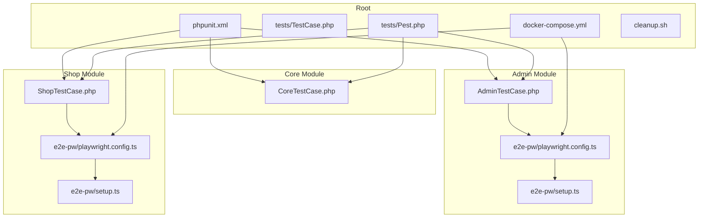
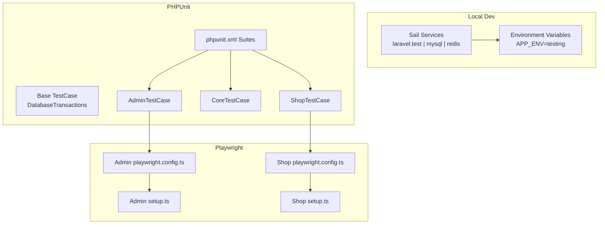
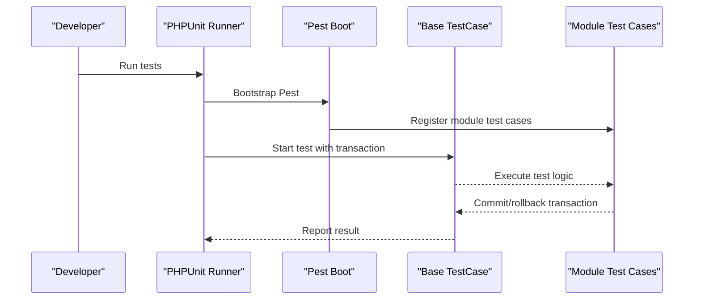
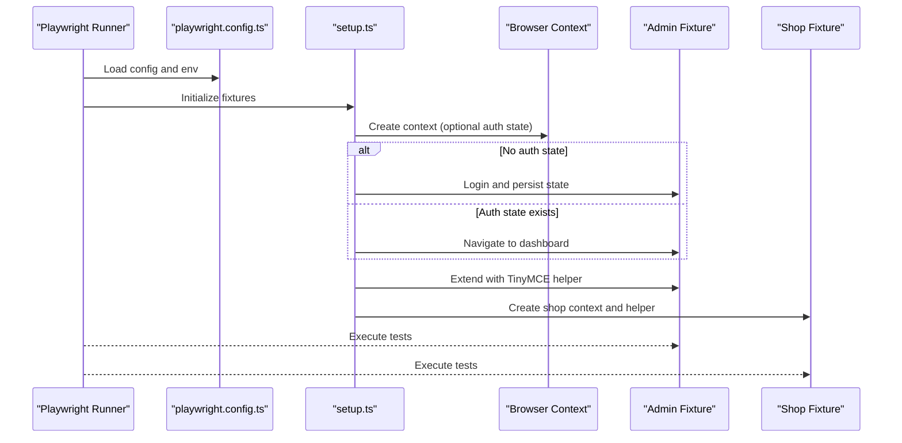
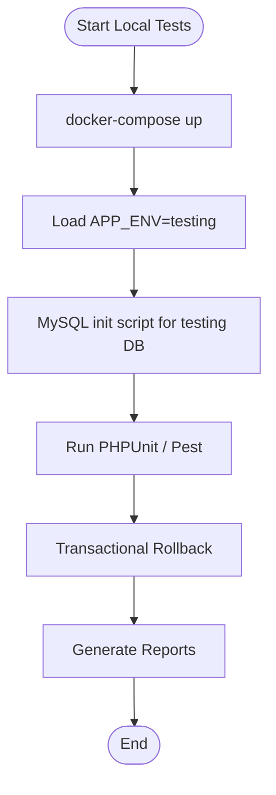
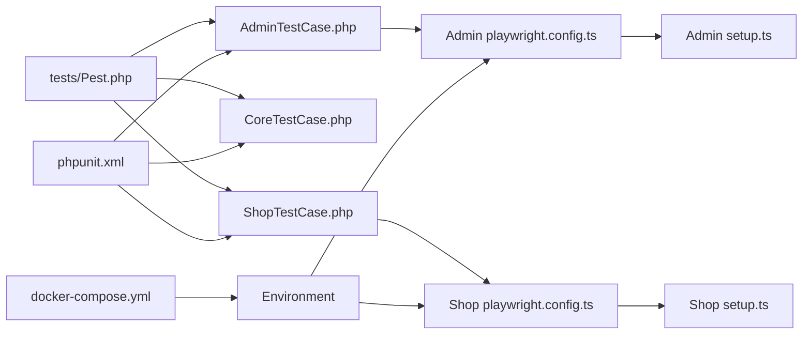

# Automated Testing and CI/CD

<cite>
**Referenced Files in This Document**
- [phpunit.xml](file://phpunit.xml)
- [tests/TestCase.php](file://tests/TestCase.php)
- [tests/Pest.php](file://tests/Pest.php)
- [packages/Webkul/Admin/tests/AdminTestCase.php](file://packages/Webkul/Admin/tests/AdminTestCase.php)
- [packages/Webkul/Core/tests/CoreTestCase.php](file://packages/Webkul/Core/tests/CoreTestCase.php)
- [packages/Webkul/Shop/tests/ShopTestCase.php](file://packages/Webkul/Shop/tests/ShopTestCase.php)
- [packages/Webkul/Admin/tests/e2e-pw/playwright.config.ts](file://packages/Webkul/Admin/tests/e2e-pw/playwright.config.ts)
- [packages/Webkul/Admin/tests/e2e-pw/setup.ts](file://packages/Webkul/Admin/tests/e2e-pw/setup.ts)
- [packages/Webkul/Shop/tests/e2e-pw/playwright.config.ts](file://packages/Webkul/Shop/tests/e2e-pw/playwright.config.ts)
- [packages/Webkul/Shop/tests/e2e-pw/setup.ts](file://packages/Webkul/Shop/tests/e2e-pw/setup.ts)
- [docker-compose.yml](file://docker-compose.yml)
- [cleanup.sh](file://cleanup.sh)
</cite>

## Table of Contents
1. [Introduction](#introduction)
2. [Project Structure](#project-structure)
3. [Core Components](#core-components)
4. [Architecture Overview](#architecture-overview)
5. [Detailed Component Analysis](#detailed-component-analysis)
6. [Dependency Analysis](#dependency-analysis)
7. [Performance Considerations](#performance-considerations)
8. [Troubleshooting Guide](#troubleshooting-guide)
9. [Conclusion](#conclusion)
10. [Appendices](#appendices)

## Introduction
This document explains Frooxi’s automated testing infrastructure and continuous integration setup. It covers the test execution pipeline, automated test running, and CI/CD integration patterns. It documents Playwright configuration for end-to-end (e2e) testing, test environment setup, and parallel test execution. It also details configuration for different testing environments, database setup for tests, and test data management. Reporting, artifacts, and quality gates are described, along with scheduling, flaky test handling, and maintenance procedures. Guidance is included for local testing environments and debugging test failures in CI/CD pipelines.

## Project Structure
Frooxi uses a modular monolith with Laravel Sail for containerized development and Pest for expressive PHP testing. The repository organizes tests per module under packages/Webkul/<Module>/tests, with separate suites for unit, feature, and e2e tests. The root tests directory defines shared base test cases and Pest configuration. Playwright e2e tests are colocated with module-specific tests.

**Diagram sources**
- [phpunit.xml](file://phpunit.xml)
- [tests/TestCase.php](file://tests/TestCase.php)
- [tests/Pest.php](file://tests/Pest.php)
- [packages/Webkul/Admin/tests/AdminTestCase.php](file://packages/Webkul/Admin/tests/AdminTestCase.php)
- [packages/Webkul/Core/tests/CoreTestCase.php](file://packages/Webkul/Core/tests/CoreTestCase.php)
- [packages/Webkul/Shop/tests/ShopTestCase.php](file://packages/Webkul/Shop/tests/ShopTestCase.php)
- [packages/Webkul/Admin/tests/e2e-pw/playwright.config.ts](file://packages/Webkul/Admin/tests/e2e-pw/playwright.config.ts)
- [packages/Webkul/Admin/tests/e2e-pw/setup.ts](file://packages/Webkul/Admin/tests/e2e-pw/setup.ts)
- [packages/Webkul/Shop/tests/e2e-pw/playwright.config.ts](file://packages/Webkul/Shop/tests/e2e-pw/playwright.config.ts)
- [packages/Webkul/Shop/tests/e2e-pw/setup.ts](file://packages/Webkul/Shop/tests/e2e-pw/setup.ts)
- [docker-compose.yml](file://docker-compose.yml)

**Section sources**
- [phpunit.xml](file://phpunit.xml)
- [tests/TestCase.php](file://tests/TestCase.php)
- [tests/Pest.php](file://tests/Pest.php)
- [packages/Webkul/Admin/tests/AdminTestCase.php](file://packages/Webkul/Admin/tests/AdminTestCase.php)
- [packages/Webkul/Core/tests/CoreTestCase.php](file://packages/Webkul/Core/tests/CoreTestCase.php)
- [packages/Webkul/Shop/tests/ShopTestCase.php](file://packages/Webkul/Shop/tests/ShopTestCase.php)
- [packages/Webkul/Admin/tests/e2e-pw/playwright.config.ts](file://packages/Webkul/Admin/tests/e2e-pw/playwright.config.ts)
- [packages/Webkul/Admin/tests/e2e-pw/setup.ts](file://packages/Webkul/Admin/tests/e2e-pw/setup.ts)
- [packages/Webkul/Shop/tests/e2e-pw/playwright.config.ts](file://packages/Webkul/Shop/tests/e2e-pw/playwright.config.ts)
- [packages/Webkul/Shop/tests/e2e-pw/setup.ts](file://packages/Webkul/Shop/tests/e2e-pw/setup.ts)
- [docker-compose.yml](file://docker-compose.yml)

## Core Components
- Root test harness:
  - Base TestCase enables database transactions for fast rollback between tests.
  - Pest bootstraps module-specific test cases and sets global expectations and helpers.
  - phpunit.xml defines test suites per module and environment variables for deterministic testing.
- Module test cases:
  - AdminTestCase, CoreTestCase, and ShopTestCase extend the base TestCase and include module-specific assertions and test benches.
- Playwright e2e:
  - Separate Playwright configs per module with shared fixtures for admin/shop contexts, authentication state caching, screenshots, videos, and traces.

**Section sources**
- [tests/TestCase.php](file://tests/TestCase.php)
- [tests/Pest.php](file://tests/Pest.php)
- [phpunit.xml](file://phpunit.xml)
- [packages/Webkul/Admin/tests/AdminTestCase.php](file://packages/Webkul/Admin/tests/AdminTestCase.php)
- [packages/Webkul/Core/tests/CoreTestCase.php](file://packages/Webkul/Core/tests/CoreTestCase.php)
- [packages/Webkul/Shop/tests/ShopTestCase.php](file://packages/Webkul/Shop/tests/ShopTestCase.php)
- [packages/Webkul/Admin/tests/e2e-pw/playwright.config.ts](file://packages/Webkul/Admin/tests/e2e-pw/playwright.config.ts)
- [packages/Webkul/Admin/tests/e2e-pw/setup.ts](file://packages/Webkul/Admin/tests/e2e-pw/setup.ts)
- [packages/Webkul/Shop/tests/e2e-pw/playwright.config.ts](file://packages/Webkul/Shop/tests/e2e-pw/playwright.config.ts)
- [packages/Webkul/Shop/tests/e2e-pw/setup.ts](file://packages/Webkul/Shop/tests/e2e-pw/setup.ts)

## Architecture Overview
The testing architecture combines:
- PHPUnit-based unit and feature tests with module-specific suites.
- Pest-driven test organization and shared test case inheritance.
- Playwright e2e tests with isolated module configurations and reusable fixtures.
- Laravel Sail for local containerized environments with MySQL and Redis.

**Diagram sources**
- [phpunit.xml](file://phpunit.xml)
- [tests/TestCase.php](file://tests/TestCase.php)
- [packages/Webkul/Admin/tests/AdminTestCase.php](file://packages/Webkul/Admin/tests/AdminTestCase.php)
- [packages/Webkul/Core/tests/CoreTestCase.php](file://packages/Webkul/Core/tests/CoreTestCase.php)
- [packages/Webkul/Shop/tests/ShopTestCase.php](file://packages/Webkul/Shop/tests/ShopTestCase.php)
- [packages/Webkul/Admin/tests/e2e-pw/playwright.config.ts](file://packages/Webkul/Admin/tests/e2e-pw/playwright.config.ts)
- [packages/Webkul/Admin/tests/e2e-pw/setup.ts](file://packages/Webkul/Admin/tests/e2e-pw/setup.ts)
- [packages/Webkul/Shop/tests/e2e-pw/playwright.config.ts](file://packages/Webkul/Shop/tests/e2e-pw/playwright.config.ts)
- [packages/Webkul/Shop/tests/e2e-pw/setup.ts](file://packages/Webkul/Shop/tests/e2e-pw/setup.ts)
- [docker-compose.yml](file://docker-compose.yml)

## Detailed Component Analysis

### PHPUnit Test Execution Pipeline
- Test discovery and suites:
  - phpunit.xml enumerates per-module suites for feature and unit tests.
  - Pest registers module test cases globally to reduce duplication.
- Environment isolation:
  - phpunit.xml sets APP_ENV=testing and disables caches, queues, sessions, and telemetry for determinism.
- Transactional rollbacks:
  - Base TestCase wraps each test in a database transaction to keep state clean.

**Diagram sources**
- [phpunit.xml](file://phpunit.xml)
- [tests/Pest.php](file://tests/Pest.php)
- [tests/TestCase.php](file://tests/TestCase.php)
- [packages/Webkul/Admin/tests/AdminTestCase.php](file://packages/Webkul/Admin/tests/AdminTestCase.php)
- [packages/Webkul/Core/tests/CoreTestCase.php](file://packages/Webkul/Core/tests/CoreTestCase.php)
- [packages/Webkul/Shop/tests/ShopTestCase.php](file://packages/Webkul/Shop/tests/ShopTestCase.php)

**Section sources**
- [phpunit.xml](file://phpunit.xml)
- [tests/Pest.php](file://tests/Pest.php)
- [tests/TestCase.php](file://tests/TestCase.php)

### Playwright e2e Configuration and Fixtures
- Configuration:
  - Each module defines a Playwright config with timeouts, output directories, reporters, and browser device targets.
  - Configs read APP_URL from environment and enable screenshots, videos, and traces on failure.
- Authentication and fixtures:
  - setup.ts creates admin and shop page fixtures with optional persisted authentication state.
  - Admin fixture logs in when needed and reuses stored state to speed runs.
  - Both fixtures extend pages with TinyMCE helpers for content editing.

**Diagram sources**
- [packages/Webkul/Admin/tests/e2e-pw/playwright.config.ts](file://packages/Webkul/Admin/tests/e2e-pw/playwright.config.ts)
- [packages/Webkul/Admin/tests/e2e-pw/setup.ts](file://packages/Webkul/Admin/tests/e2e-pw/setup.ts)
- [packages/Webkul/Shop/tests/e2e-pw/playwright.config.ts](file://packages/Webkul/Shop/tests/e2e-pw/playwright.config.ts)
- [packages/Webkul/Shop/tests/e2e-pw/setup.ts](file://packages/Webkul/Shop/tests/e2e-pw/setup.ts)

**Section sources**
- [packages/Webkul/Admin/tests/e2e-pw/playwright.config.ts](file://packages/Webkul/Admin/tests/e2e-pw/playwright.config.ts)
- [packages/Webkul/Admin/tests/e2e-pw/setup.ts](file://packages/Webkul/Admin/tests/e2e-pw/setup.ts)
- [packages/Webkul/Shop/tests/e2e-pw/playwright.config.ts](file://packages/Webkul/Shop/tests/e2e-pw/playwright.config.ts)
- [packages/Webkul/Shop/tests/e2e-pw/setup.ts](file://packages/Webkul/Shop/tests/e2e-pw/setup.ts)

### Test Environment Setup and Database Management
- Local environment:
  - docker-compose.yml provisions laravel.test, MySQL, and Redis with health checks.
  - MySQL initializes a dedicated testing database via Sail scripts.
- Test environment variables:
  - phpunit.xml sets APP_ENV=testing and disables cache, queue, session, and telescope for reproducible runs.
- Transactional tests:
  - Base TestCase ensures database rollback per test to avoid cross-test contamination.

**Diagram sources**
- [docker-compose.yml](file://docker-compose.yml)
- [phpunit.xml](file://phpunit.xml)
- [tests/TestCase.php](file://tests/TestCase.php)

**Section sources**
- [docker-compose.yml](file://docker-compose.yml)
- [phpunit.xml](file://phpunit.xml)
- [tests/TestCase.php](file://tests/TestCase.php)

### Parallel Test Execution and Workers
- Playwright:
  - Both Admin and Shop configs set workers to 1 and fullyParallel to false, prioritizing stability over speed.
- PHPUnit:
  - phpunit.xml does not specify parallel workers; default behavior applies.

**Section sources**
- [packages/Webkul/Admin/tests/e2e-pw/playwright.config.ts](file://packages/Webkul/Admin/tests/e2e-pw/playwright.config.ts)
- [packages/Webkul/Shop/tests/e2e-pw/playwright.config.ts](file://packages/Webkul/Shop/tests/e2e-pw/playwright.config.ts)
- [phpunit.xml](file://phpunit.xml)

### Test Reporting, Artifacts, and Quality Gates
- Playwright:
  - Reports include list and HTML reports with configurable output folders.
  - Screenshots, videos, and traces are retained on failure for diagnostics.
- PHPUnit:
  - phpunit.xml includes source coverage paths; quality gates can be enforced via CI policies.
- Quality gates:
  - forbidOnly is enabled in Playwright configs when running under CI, ensuring only intended tests run.

**Section sources**
- [packages/Webkul/Admin/tests/e2e-pw/playwright.config.ts](file://packages/Webkul/Admin/tests/e2e-pw/playwright.config.ts)
- [packages/Webkul/Shop/tests/e2e-pw/playwright.config.ts](file://packages/Webkul/Shop/tests/e2e-pw/playwright.config.ts)
- [phpunit.xml](file://phpunit.xml)

### Test Scheduling, Flaky Test Handling, and Maintenance
- Scheduling:
  - Use CI scheduler to trigger test jobs on branches/tags or PRs.
- Flaky tests:
  - Playwright retries are disabled; stabilize tests by improving fixtures, waits, and deterministic selectors.
  - Prefer explicit waits and visibility checks; leverage TinyMCE helpers consistently.
- Maintenance:
  - cleanup.sh removes obsolete module artifacts to keep the repository tidy.
  - Regularly review and refactor Playwright fixtures and module-specific test cases.

**Section sources**
- [cleanup.sh](file://cleanup.sh)
- [packages/Webkul/Admin/tests/e2e-pw/setup.ts](file://packages/Webkul/Admin/tests/e2e-pw/setup.ts)
- [packages/Webkul/Shop/tests/e2e-pw/setup.ts](file://packages/Webkul/Shop/tests/e2e-pw/setup.ts)

### Performance and Load Testing Integration
- Current scope:
  - The repository focuses on unit, feature, and Playwright e2e tests.
- Recommendations:
  - Integrate external performance/load tools (e.g., k6, Artillery) as separate CI jobs.
  - Use dedicated environments for load tests and isolate databases to prevent interference.

[No sources needed since this section provides general guidance]

### Local Testing Environments and Debugging Failures
- Local setup:
  - Use docker-compose to provision services and ensure APP_URL points to the running application.
  - Run PHPUnit/Pest suites locally to validate changes.
- Debugging:
  - Inspect Playwright HTML reports, screenshots, videos, and traces for failing tests.
  - Verify authentication state persistence and re-run with fresh state if needed.

**Section sources**
- [docker-compose.yml](file://docker-compose.yml)
- [packages/Webkul/Admin/tests/e2e-pw/playwright.config.ts](file://packages/Webkul/Admin/tests/e2e-pw/playwright.config.ts)
- [packages/Webkul/Shop/tests/e2e-pw/playwright.config.ts](file://packages/Webkul/Shop/tests/e2e-pw/playwright.config.ts)

## Dependency Analysis
The testing stack exhibits clear separation of concerns:
- Pest orchestrates module test cases.
- phpunit.xml defines suite boundaries and environment.
- Playwright configs and fixtures encapsulate e2e concerns per module.
- docker-compose provides the runtime environment.

**Diagram sources**
- [tests/Pest.php](file://tests/Pest.php)
- [packages/Webkul/Admin/tests/AdminTestCase.php](file://packages/Webkul/Admin/tests/AdminTestCase.php)
- [packages/Webkul/Core/tests/CoreTestCase.php](file://packages/Webkul/Core/tests/CoreTestCase.php)
- [packages/Webkul/Shop/tests/ShopTestCase.php](file://packages/Webkul/Shop/tests/ShopTestCase.php)
- [phpunit.xml](file://phpunit.xml)
- [packages/Webkul/Admin/tests/e2e-pw/playwright.config.ts](file://packages/Webkul/Admin/tests/e2e-pw/playwright.config.ts)
- [packages/Webkul/Admin/tests/e2e-pw/setup.ts](file://packages/Webkul/Admin/tests/e2e-pw/setup.ts)
- [packages/Webkul/Shop/tests/e2e-pw/playwright.config.ts](file://packages/Webkul/Shop/tests/e2e-pw/playwright.config.ts)
- [packages/Webkul/Shop/tests/e2e-pw/setup.ts](file://packages/Webkul/Shop/tests/e2e-pw/setup.ts)
- [docker-compose.yml](file://docker-compose.yml)

**Section sources**
- [tests/Pest.php](file://tests/Pest.php)
- [phpunit.xml](file://phpunit.xml)
- [packages/Webkul/Admin/tests/AdminTestCase.php](file://packages/Webkul/Admin/tests/AdminTestCase.php)
- [packages/Webkul/Core/tests/CoreTestCase.php](file://packages/Webkul/Core/tests/CoreTestCase.php)
- [packages/Webkul/Shop/tests/ShopTestCase.php](file://packages/Webkul/Shop/tests/ShopTestCase.php)
- [packages/Webkul/Admin/tests/e2e-pw/playwright.config.ts](file://packages/Webkul/Admin/tests/e2e-pw/playwright.config.ts)
- [packages/Webkul/Admin/tests/e2e-pw/setup.ts](file://packages/Webkul/Admin/tests/e2e-pw/setup.ts)
- [packages/Webkul/Shop/tests/e2e-pw/playwright.config.ts](file://packages/Webkul/Shop/tests/e2e-pw/playwright.config.ts)
- [packages/Webkul/Shop/tests/e2e-pw/setup.ts](file://packages/Webkul/Shop/tests/e2e-pw/setup.ts)
- [docker-compose.yml](file://docker-compose.yml)

## Performance Considerations
- Prefer sequential Playwright runs (workers=1) during development to reduce flakiness.
- Use transactional tests to minimize database overhead and speed up test cycles.
- Keep fixtures minimal and reuse authentication state to cut login overhead.

[No sources needed since this section provides general guidance]

## Troubleshooting Guide
- Playwright failures:
  - Review HTML report and attached artifacts (screenshots/videos/traces).
  - Confirm APP_URL is reachable and authentication state is valid.
- PHPUnit instability:
  - Ensure database transactions are not disabled unintentionally.
  - Verify environment variables align with phpunit.xml settings.
- Cleanup and maintenance:
  - Use cleanup.sh to remove obsolete module artifacts and keep the repository maintainable.

**Section sources**
- [packages/Webkul/Admin/tests/e2e-pw/playwright.config.ts](file://packages/Webkul/Admin/tests/e2e-pw/playwright.config.ts)
- [packages/Webkul/Shop/tests/e2e-pw/playwright.config.ts](file://packages/Webkul/Shop/tests/e2e-pw/playwright.config.ts)
- [phpunit.xml](file://phpunit.xml)
- [cleanup.sh](file://cleanup.sh)

## Conclusion
Frooxi’s testing infrastructure leverages Pest for expressive PHP tests, PHPUnit for structured suites, and Playwright for robust e2e flows. Laravel Sail provides a consistent local environment, while transactional tests and deterministic environment settings improve reliability. The current setup emphasizes stability with sequential execution and rich diagnostics. Extending with scheduled runs, quality gates, and optional performance/load tools can further strengthen the CI/CD pipeline.

[No sources needed since this section summarizes without analyzing specific files]

## Appendices
- Test data management:
  - Use factories and seeded data within module tests; rely on transactional rollbacks to keep state isolated.
- CI/CD integration patterns:
  - Trigger PHPUnit and Playwright jobs on PRs and releases; enforce forbidOnly in CI to prevent accidental single-test runs.

[No sources needed since this section provides general guidance]