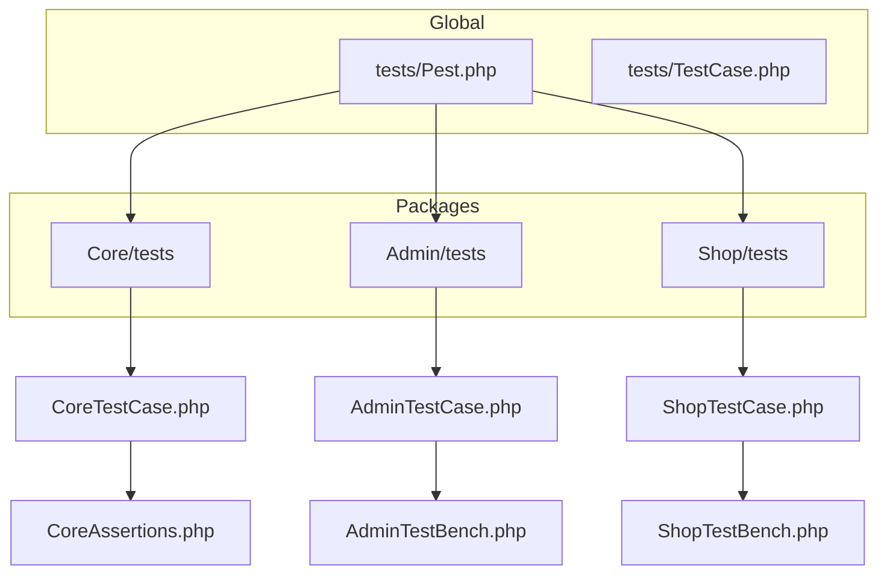
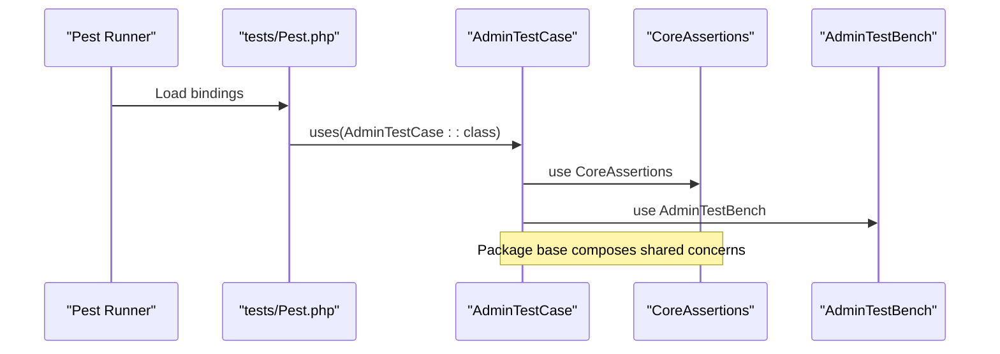
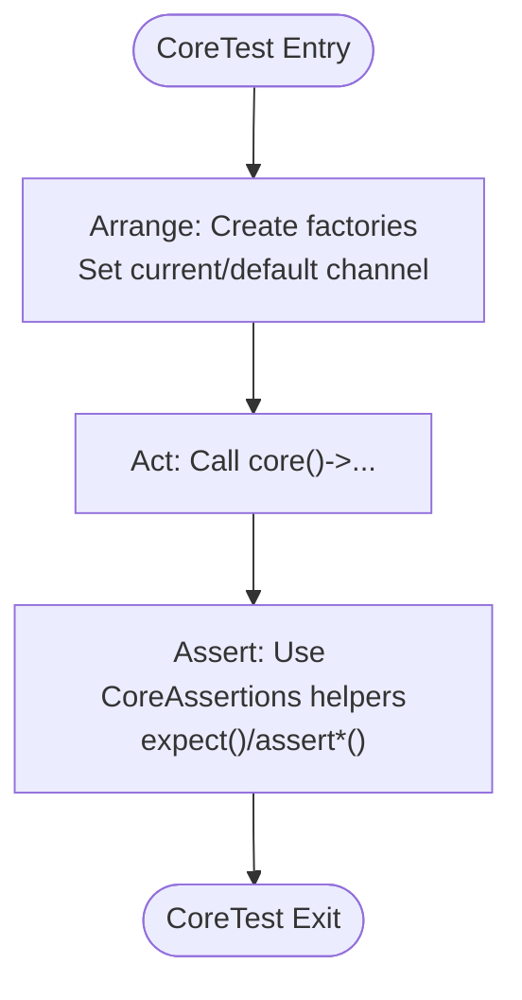
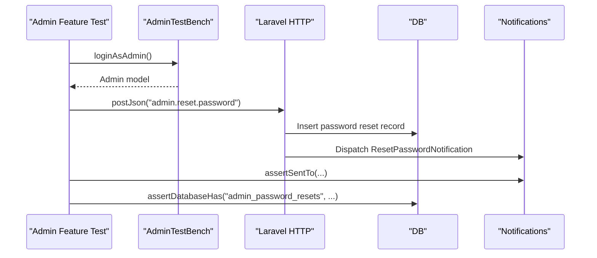
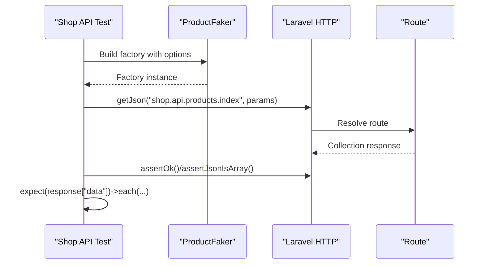
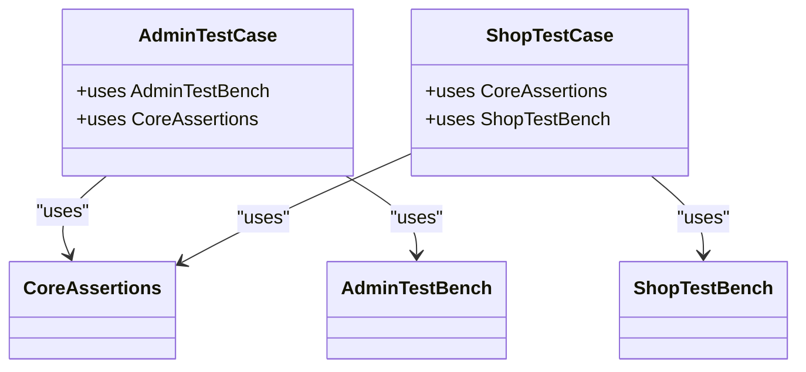
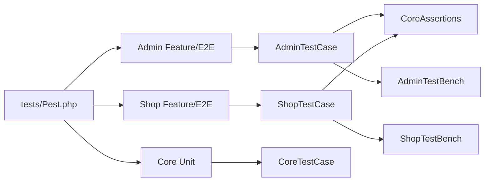

# Package-Specific Testing

<cite>
**Referenced Files in This Document**
- [Pest.php](file://tests/Pest.php)
- [TestCase.php](file://tests/TestCase.php)
- [AdminTestCase.php](file://packages/Webkul/Admin/tests/AdminTestCase.php)
- [CoreTestCase.php](file://packages/Webkul/Core/tests/CoreTestCase.php)
- [ShopTestCase.php](file://packages/Webkul/Shop/tests/ShopTestCase.php)
- [AdminTestBench.php](file://packages/Webkul/Admin/tests/Concerns/AdminTestBench.php)
- [CoreAssertions.php](file://packages/Webkul/Core/tests/Concerns/CoreAssertions.php)
- [ShopTestBench.php](file://packages/Webkul/Shop/tests/Concerns/ShopTestBench.php)
- [ForgotPasswordTest.php](file://packages/Webkul/Admin/tests/Feature/Admin/ForgotPasswordTest.php)
- [CoreTest.php](file://packages/Webkul/Core/tests/Unit/CoreTest.php)
- [ProductTest.php](file://packages/Webkul/Shop/tests/Feature/API/ProductTest.php)
- [playwright.config.ts (Admin)](file://packages/Webkul/Admin/tests/e2e-pw/playwright.config.ts)
- [playwright.config.ts (Shop)](file://packages/Webkul/Shop/tests/e2e-pw/playwright.config.ts)
</cite>

## Table of Contents
1. [Introduction](#introduction)
2. [Project Structure](#project-structure)
3. [Core Components](#core-components)
4. [Architecture Overview](#architecture-overview)
5. [Detailed Component Analysis](#detailed-component-analysis)
6. [Dependency Analysis](#dependency-analysis)
7. [Performance Considerations](#performance-considerations)
8. [Troubleshooting Guide](#troubleshooting-guide)
9. [Conclusion](#conclusion)

## Introduction
This document explains how individual Frooxi packages implement their own testing strategies. It covers package-specific test suites, organization patterns, and utilities. It also documents how packages isolate themselves, mock and fake external behaviors, and integrate across boundaries. Guidance is provided for extending tests for new packages and maintaining consistency across the modular architecture.

## Project Structure
The repository follows a modular package layout under packages/Webkul/<Package>/src, with each package containing its own tests directory. Global test bootstrapping is centralized in tests/Pest.php, which binds package-specific test base classes to their respective test folders. Each package defines a TestCase-like base class that composes reusable concerns (traits) for setup, authentication, and assertions.

**Diagram sources**
- [Pest.php:27-36](file://tests/Pest.php#L27-L36)
- [CoreTestCase.php:1-12](file://packages/Webkul/Core/tests/CoreTestCase.php#L1-L12)
- [AdminTestCase.php:1-13](file://packages/Webkul/Admin/tests/AdminTestCase.php#L1-L13)
- [ShopTestCase.php:1-13](file://packages/Webkul/Shop/tests/ShopTestCase.php#L1-L13)
- [CoreAssertions.php:18-555](file://packages/Webkul/Core/tests/Concerns/CoreAssertions.php#L18-L555)
- [AdminTestBench.php:8-22](file://packages/Webkul/Admin/tests/Concerns/AdminTestBench.php#L8-L22)
- [ShopTestBench.php:8-22](file://packages/Webkul/Shop/tests/Concerns/ShopTestBench.php#L8-L22)

**Section sources**
- [Pest.php:27-36](file://tests/Pest.php#L27-L36)
- [TestCase.php:8-11](file://tests/TestCase.php#L8-L11)
- [CoreTestCase.php:8-11](file://packages/Webkul/Core/tests/CoreTestCase.php#L8-L11)
- [AdminTestCase.php:9-11](file://packages/Webkul/Admin/tests/AdminTestCase.php#L9-L11)
- [ShopTestCase.php:9-12](file://packages/Webkul/Shop/tests/ShopTestCase.php#L9-L12)

## Core Components
- Global test harness binding: tests/Pest.php binds each package’s test suite to its package-specific base class using uses(...)->in(...).
- Package base test classes:
  - CoreTestCase: Provides CoreAssertions trait for domain-wide assertions.
  - AdminTestCase: Uses AdminTestBench for admin authentication and ShopTestBench via Shop base.
  - ShopTestCase: Uses CoreAssertions and ShopTestBench for customer authentication.
- Shared concerns:
  - CoreAssertions: Rich helpers for asserting orders, carts, invoices, rules, and formatted prices.
  - AdminTestBench: Factory-driven admin login.
  - ShopTestBench: Factory-driven customer login using a faker helper.

These components enable consistent setup, teardown, and assertions across packages while preserving package isolation.

**Section sources**
- [Pest.php:3-12](file://tests/Pest.php#L3-L12)
- [Pest.php:27-36](file://tests/Pest.php#L27-L36)
- [CoreAssertions.php:18-555](file://packages/Webkul/Core/tests/Concerns/CoreAssertions.php#L18-L555)
- [AdminTestBench.php:8-22](file://packages/Webkul/Admin/tests/Concerns/AdminTestBench.php#L8-L22)
- [ShopTestBench.php:8-22](file://packages/Webkul/Shop/tests/Concerns/ShopTestBench.php#L8-L22)

## Architecture Overview
The testing architecture is layered:
- Global layer: Bootstraps Pest and binds package test suites.
- Package layer: Each package defines a base test class that composes traits for common behaviors.
- Feature/e2e layer: Package-specific tests live under Feature or e2e-pw, leveraging the base classes and concerns.

**Diagram sources**
- [Pest.php:27-36](file://tests/Pest.php#L27-L36)
- [AdminTestCase.php:9-11](file://packages/Webkul/Admin/tests/AdminTestCase.php#L9-L11)
- [CoreAssertions.php:18-555](file://packages/Webkul/Core/tests/Concerns/CoreAssertions.php#L18-L555)
- [AdminTestBench.php:8-22](file://packages/Webkul/Admin/tests/Concerns/AdminTestBench.php#L8-L22)

## Detailed Component Analysis

### Core Package Testing Strategy
- Organization: Unit tests under packages/Webkul/Core/tests/Unit.
- Approach: Functional/unit tests using Pest with factories and assertions from CoreAssertions.
- Key utilities:
  - CoreAssertions: Provides helpers to assert order/cart/invoice structures, formatted prices, and rule configurations.
- Example patterns:
  - Using factories to create channels/currencies.
  - Verifying currency symbol placement and formatting rules.
  - Validating channel selection logic and defaults.

**Diagram sources**
- [CoreTest.php:7-17](file://packages/Webkul/Core/tests/Unit/CoreTest.php#L7-L17)
- [CoreAssertions.php:18-555](file://packages/Webkul/Core/tests/Concerns/CoreAssertions.php#L18-L555)

**Section sources**
- [CoreTestCase.php:8-11](file://packages/Webkul/Core/tests/CoreTestCase.php#L8-L11)
- [CoreAssertions.php:18-555](file://packages/Webkul/Core/tests/Concerns/CoreAssertions.php#L18-L555)
- [CoreTest.php:7-17](file://packages/Webkul/Core/tests/Unit/CoreTest.php#L7-L17)

### Admin Package Testing Strategy
- Organization:
  - Feature tests under packages/Webkul/Admin/tests/Feature.
  - End-to-end tests under packages/Webkul/Admin/tests/e2e-pw.
- Approach:
  - Feature tests use Pest with JSON requests and notifications faking.
  - e2e-pw uses Playwright with project-specific configuration and state persistence.
- Key utilities:
  - AdminTestBench: loginAsAdmin helper.
  - CoreAssertions: re-used for cross-domain assertions when needed.
- Example patterns:
  - Faking notifications and asserting redirects and database records.
  - Using factories to create admins and verifying password reset flows.

**Diagram sources**
- [ForgotPasswordTest.php:9-32](file://packages/Webkul/Admin/tests/Feature/Admin/ForgotPasswordTest.php#L9-L32)
- [AdminTestBench.php:13-20](file://packages/Webkul/Admin/tests/Concerns/AdminTestBench.php#L13-L20)

**Section sources**
- [AdminTestCase.php:9-11](file://packages/Webkul/Admin/tests/AdminTestCase.php#L9-L11)
- [AdminTestBench.php:8-22](file://packages/Webkul/Admin/tests/Concerns/AdminTestBench.php#L8-L22)
- [ForgotPasswordTest.php:9-32](file://packages/Webkul/Admin/tests/Feature/Admin/ForgotPasswordTest.php#L9-L32)
- [playwright.config.ts (Admin):15-58](file://packages/Webkul/Admin/tests/e2e-pw/playwright.config.ts#L15-L58)

### Shop Package Testing Strategy
- Organization:
  - Feature tests under packages/Webkul/Shop/tests/Feature.
  - End-to-end tests under packages/Webkul/Shop/tests/e2e-pw.
- Approach:
  - Feature tests use JSON APIs and faker helpers to generate product data.
  - e2e-pw mirrors Admin’s e2e setup with its own configuration.
- Key utilities:
  - ShopTestBench: loginAsCustomer helper.
  - CoreAssertions: reused for cross-domain assertions.
- Example patterns:
  - Using ProductFaker to create products with specific attributes.
  - Asserting API responses for new/featured/all listings.

**Diagram sources**
- [ProductTest.php:8-35](file://packages/Webkul/Shop/tests/Feature/API/ProductTest.php#L8-L35)
- [ShopTestBench.php:13-20](file://packages/Webkul/Shop/tests/Concerns/ShopTestBench.php#L13-L20)

**Section sources**
- [ShopTestCase.php:9-12](file://packages/Webkul/Shop/tests/ShopTestCase.php#L9-L12)
- [ShopTestBench.php:8-22](file://packages/Webkul/Shop/tests/Concerns/ShopTestBench.php#L8-L22)
- [ProductTest.php:8-35](file://packages/Webkul/Shop/tests/Feature/API/ProductTest.php#L8-L35)
- [playwright.config.ts (Shop):15-58](file://packages/Webkul/Shop/tests/e2e-pw/playwright.config.ts#L15-L58)

### Cross-Package Integration Patterns
- Shared assertions: CoreAssertions is consumed by AdminTestCase and ShopTestCase, enabling consistent assertions across packages.
- Authentication helpers: AdminTestBench and ShopTestBench encapsulate login flows, reducing duplication.
- Global bootstrapping: tests/Pest.php centralizes binding so each package runs with its own base class and concerns.

**Diagram sources**
- [AdminTestCase.php:9-11](file://packages/Webkul/Admin/tests/AdminTestCase.php#L9-L11)
- [ShopTestCase.php:11](file://packages/Webkul/Shop/tests/ShopTestCase.php#L11)
- [CoreAssertions.php:18-555](file://packages/Webkul/Core/tests/Concerns/CoreAssertions.php#L18-L555)
- [AdminTestBench.php:8-22](file://packages/Webkul/Admin/tests/Concerns/AdminTestBench.php#L8-L22)
- [ShopTestBench.php:8-22](file://packages/Webkul/Shop/tests/Concerns/ShopTestBench.php#L8-L22)

**Section sources**
- [Pest.php:3-12](file://tests/Pest.php#L3-L12)
- [CoreAssertions.php:18-555](file://packages/Webkul/Core/tests/Concerns/CoreAssertions.php#L18-L555)
- [AdminTestBench.php:8-22](file://packages/Webkul/Admin/tests/Concerns/AdminTestBench.php#L8-L22)
- [ShopTestBench.php:8-22](file://packages/Webkul/Shop/tests/Concerns/ShopTestBench.php#L8-L22)

## Dependency Analysis
- Package isolation:
  - Each package’s tests are bound independently via Pest, ensuring minimal coupling between packages’ test setups.
- Shared dependencies:
  - CoreAssertions is shared across Admin and Shop test bases, promoting consistency.
  - Base classes inherit from a global database transactional TestCase to keep tests isolated and fast.
- External integration:
  - Admin e2e-pw and Shop e2e-pw rely on Playwright configuration and environment variables for browser automation.

**Diagram sources**
- [Pest.php:27-36](file://tests/Pest.php#L27-L36)
- [AdminTestCase.php:9-11](file://packages/Webkul/Admin/tests/AdminTestCase.php#L9-L11)
- [ShopTestCase.php:11](file://packages/Webkul/Shop/tests/ShopTestCase.php#L11)
- [CoreTestCase.php:8-11](file://packages/Webkul/Core/tests/CoreTestCase.php#L8-L11)
- [CoreAssertions.php:18-555](file://packages/Webkul/Core/tests/Concerns/CoreAssertions.php#L18-L555)
- [AdminTestBench.php:8-22](file://packages/Webkul/Admin/tests/Concerns/AdminTestBench.php#L8-L22)
- [ShopTestBench.php:8-22](file://packages/Webkul/Shop/tests/Concerns/ShopTestBench.php#L8-L22)

**Section sources**
- [Pest.php:27-36](file://tests/Pest.php#L27-L36)
- [TestCase.php:8-11](file://tests/TestCase.php#L8-L11)

## Performance Considerations
- Transactions: tests/TestCase.php enables database transactions for fast, isolated tests that roll back after each test.
- Factories and fakes: Packages use factories and Laravel fakes (e.g., notifications) to avoid heavy I/O and external dependencies.
- E2E timeouts: e2e-pw configs set explicit timeouts and workers=1 to stabilize CI runs at the cost of speed; adjust per environment needs.

[No sources needed since this section provides general guidance]

## Troubleshooting Guide
- Authentication helpers:
  - AdminTestBench::loginAsAdmin and ShopTestBench::loginAsCustomer create and log in users via factories; ensure factories exist and are seeded.
- Assertions:
  - CoreAssertions provides structured helpers for orders, carts, invoices, and rules; verify the expected shapes match your models.
- Notifications:
  - Admin forgot-password tests fake notifications; confirm notification dispatch and counts in tests.
- E2E state:
  - Admin and Shop e2e-pw configs persist auth state; ensure APP_URL is configured and state directories exist.

**Section sources**
- [AdminTestBench.php:13-20](file://packages/Webkul/Admin/tests/Concerns/AdminTestBench.php#L13-L20)
- [ShopTestBench.php:13-20](file://packages/Webkul/Shop/tests/Concerns/ShopTestBench.php#L13-L20)
- [CoreAssertions.php:18-555](file://packages/Webkul/Core/tests/Concerns/CoreAssertions.php#L18-L555)
- [ForgotPasswordTest.php:26-32](file://packages/Webkul/Admin/tests/Feature/Admin/ForgotPasswordTest.php#L26-L32)
- [playwright.config.ts (Admin):13-13](file://packages/Webkul/Admin/tests/e2e-pw/playwright.config.ts#L13-L13)
- [playwright.config.ts (Shop):13-13](file://packages/Webkul/Shop/tests/e2e-pw/playwright.config.ts#L13-L13)

## Conclusion
The Frooxi testing architecture emphasizes package isolation with shared, composable test utilities. Each package defines its own base test class and concerns, enabling consistent, maintainable tests across Core, Admin, Shop, and others. Global Pest bindings ensure each package runs with its own setup, while shared assertions and helpers reduce duplication and improve reliability. Extending tests for new packages follows the established pattern: create a package-specific base class, compose concerns, and organize tests under Feature or e2e-pw with appropriate fixtures and fakes.