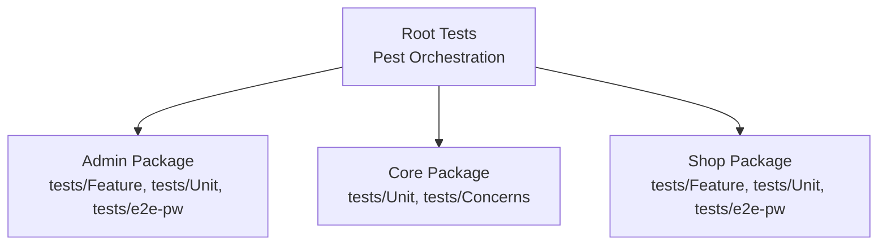
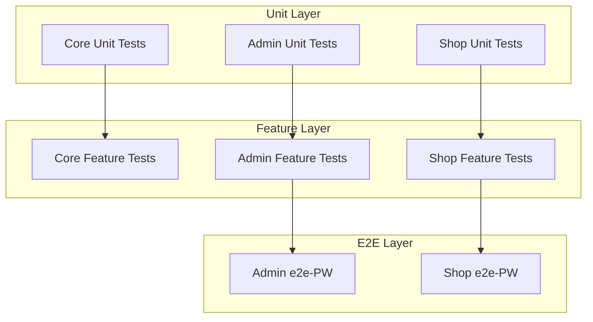
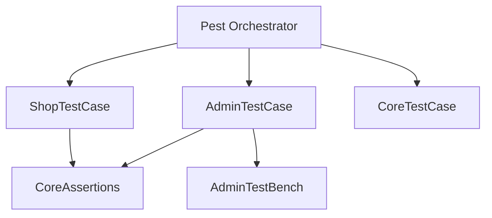
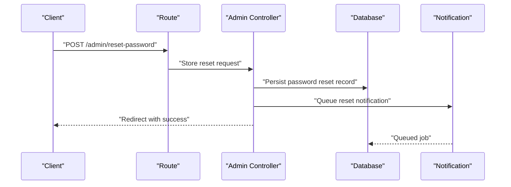
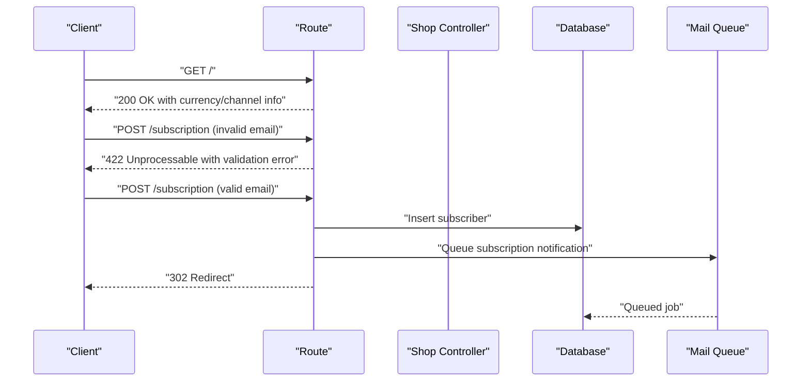

# Test Types and Coverage

<cite>
**Referenced Files in This Document**
- [tests/TestCase.php](file://tests/TestCase.php)
- [tests/Pest.php](file://tests/Pest.php)
- [packages/Webkul/Admin/tests/AdminTestCase.php](file://packages/Webkul/Admin/tests/AdminTestCase.php)
- [packages/Webkul/Admin/tests/Concerns/AdminTestBench.php](file://packages/Webkul/Admin/tests/Concerns/AdminTestBench.php)
- [packages/Webkul/Admin/tests/Feature/Admin/ForgotPasswordTest.php](file://packages/Webkul/Admin/tests/Feature/Admin/ForgotPasswordTest.php)
- [packages/Webkul/Admin/tests/e2e-pw/playwright.config.ts](file://packages/Webkul/Admin/tests/e2e-pw/playwright.config.ts)
- [packages/Webkul/Core/tests/CoreTestCase.php](file://packages/Webkul/Core/tests/CoreTestCase.php)
- [packages/Webkul/Core/tests/Concerns/CoreAssertions.php](file://packages/Webkul/Core/tests/Concerns/CoreAssertions.php)
- [packages/Webkul/Core/tests/Unit/CoreTest.php](file://packages/Webkul/Core/tests/Unit/CoreTest.php)
- [packages/Webkul/Shop/tests/ShopTestCase.php](file://packages/Webkul/Shop/tests/ShopTestCase.php)
- [packages/Webkul/Shop/tests/Feature/HomePageTest.php](file://packages/Webkul/Shop/tests/Feature/HomePageTest.php)
- [packages/Webkul/Shop/tests/e2e-pw/playwright.config.ts](file://packages/Webkul/Shop/tests/e2e-pw/playwright.config.ts)
</cite>

## Table of Contents
1. [Introduction](#introduction)
2. [Project Structure](#project-structure)
3. [Core Components](#core-components)
4. [Architecture Overview](#architecture-overview)
5. [Detailed Component Analysis](#detailed-component-analysis)
6. [Dependency Analysis](#dependency-analysis)
7. [Performance Considerations](#performance-considerations)
8. [Troubleshooting Guide](#troubleshooting-guide)
9. [Conclusion](#conclusion)
10. [Appendices](#appendices)

## Introduction
This document describes Frooxi’s multi-layered testing approach across unit, feature, and end-to-end (e2e) layers. It explains how tests are organized by package, naming conventions, assertion patterns, database strategies, mocks, and test data management. It also covers isolation, dependency injection in tests, cleanup, edge cases, error conditions, and performance validation. Examples focus on Core, Admin, and Shop packages, with guidance applicable to other packages.

## Project Structure
The repository follows a modular package structure under packages/Webkul/<Package>/src. Each package includes:
- Unit tests under tests/Unit
- Feature tests under tests/Feature
- e2e tests under tests/e2e-pw with Playwright configuration

Root-level test orchestration uses Pest with a central configuration that binds package-specific test base classes to their respective folders.

**Diagram sources**
- [tests/Pest.php:27-36](file://tests/Pest.php#L27-L36)
- [packages/Webkul/Admin/tests/AdminTestCase.php:1-13](file://packages/Webkul/Admin/tests/AdminTestCase.php#L1-L13)
- [packages/Webkul/Core/tests/CoreTestCase.php:1-12](file://packages/Webkul/Core/tests/CoreTestCase.php#L1-L12)
- [packages/Webkul/Shop/tests/ShopTestCase.php:1-13](file://packages/Webkul/Shop/tests/ShopTestCase.php#L1-L13)

**Section sources**
- [tests/Pest.php:27-36](file://tests/Pest.php#L27-L36)
- [tests/TestCase.php:1-12](file://tests/TestCase.php#L1-L12)

## Core Components
- Global base test class with transactional database behavior ensures isolation and automatic rollback after each test.
- Pest configuration binds package-specific test base classes to their directories, enabling shared traits and helpers.
- Package-specific test base classes provide reusable fixtures and helpers (e.g., login helpers, assertions).

Key behaviors:
- DatabaseTransactions trait ensures each test runs inside a transaction and rolls back afterward.
- Pest uses() binds a base test class per package folder, applying traits and helpers automatically.

**Section sources**
- [tests/TestCase.php:5-11](file://tests/TestCase.php#L5-L11)
- [tests/Pest.php:27-36](file://tests/Pest.php#L27-L36)

## Architecture Overview
The testing architecture is layered and package-centric:
- Unit tests validate isolated logic and helpers.
- Feature tests validate HTTP/API flows and domain logic.
- e2e tests validate real browser workflows for admin and shop.

**Diagram sources**
- [packages/Webkul/Core/tests/Unit/CoreTest.php:1-20](file://packages/Webkul/Core/tests/Unit/CoreTest.php#L1-L20)
- [packages/Webkul/Admin/tests/Feature/Admin/ForgotPasswordTest.php:1-20](file://packages/Webkul/Admin/tests/Feature/Admin/ForgotPasswordTest.php#L1-L20)
- [packages/Webkul/Shop/tests/Feature/HomePageTest.php:1-20](file://packages/Webkul/Shop/tests/Feature/HomePageTest.php#L1-L20)
- [packages/Webkul/Admin/tests/e2e-pw/playwright.config.ts:15-58](file://packages/Webkul/Admin/tests/e2e-pw/playwright.config.ts#L15-L58)
- [packages/Webkul/Shop/tests/e2e-pw/playwright.config.ts:15-58](file://packages/Webkul/Shop/tests/e2e-pw/playwright.config.ts#L15-L58)

## Detailed Component Analysis

### Unit Testing: Core
- Purpose: Validate pure functions, helpers, enums, and small units in isolation.
- Patterns:
  - Arrange inputs, call core helper, assert expectations using Pest expect().
  - Use factories to create minimal models for deterministic tests.
  - Currency formatting tests demonstrate decimal precision and symbol placement logic.

Examples:
- Channel retrieval and defaults
- Currency formatting with multiple positions and symbols
- Price formatting with channel and base currency contexts

Best practices:
- Keep tests fast and deterministic.
- Prefer factory-generated data and explicit configuration overrides.

**Section sources**
- [packages/Webkul/Core/tests/Unit/CoreTest.php:1-719](file://packages/Webkul/Core/tests/Unit/CoreTest.php#L1-L719)
- [packages/Webkul/Core/tests/Concerns/CoreAssertions.php:168-328](file://packages/Webkul/Core/tests/Concerns/CoreAssertions.php#L168-L328)

### Feature Testing: Admin
- Purpose: Validate admin HTTP/API flows, including authentication, notifications, and redirects.
- Patterns:
  - Use Pest HTTP helpers (e.g., postJson) to simulate requests.
  - Fake notifications/mails to assert queuing and counts.
  - Assert redirects, validation errors, and database records.

Example:
- Admin forgot password flow: request submission, redirect, password reset record creation, and notification dispatch.

**Section sources**
- [packages/Webkul/Admin/tests/Feature/Admin/ForgotPasswordTest.php:1-33](file://packages/Webkul/Admin/tests/Feature/Admin/ForgotPasswordTest.php#L1-L33)

### Feature Testing: Shop
- Purpose: Validate storefront flows such as home page rendering, search, subscriptions, compare lists, and customer actions.
- Patterns:
  - Use Pest HTTP helpers for GET/POST/DELETE.
  - Assert response status, content presence, and JSON validation errors.
  - Use CoreAssertions trait for structured model assertions and price comparisons.

Example:
- Home page renders with currency/channel codes, navigation changes for logged-in users, product search results, newsletter subscription, and compare list CRUD.

**Section sources**
- [packages/Webkul/Shop/tests/Feature/HomePageTest.php:1-310](file://packages/Webkul/Shop/tests/Feature/HomePageTest.php#L1-L310)
- [packages/Webkul/Core/tests/Concerns/CoreAssertions.php:23-30](file://packages/Webkul/Core/tests/Concerns/CoreAssertions.php#L23-L30)

### End-to-End Testing: Admin and Shop
- Purpose: Browser-driven workflows simulating real user journeys.
- Tools: Playwright with TypeScript configs per package.
- Configuration highlights:
  - Shared reporter and output directories.
  - Retention of screenshots/videos/traces on failure.
  - Sequential execution (workers: 1) and relaxed timeouts for stability.

Admin e2e:
- Playwright config defines testDir, timeouts, reporters, and device targets.

Shop e2e:
- Similar configuration tailored to shop workflows.

**Section sources**
- [packages/Webkul/Admin/tests/e2e-pw/playwright.config.ts:15-58](file://packages/Webkul/Admin/tests/e2e-pw/playwright.config.ts#L15-L58)
- [packages/Webkul/Shop/tests/e2e-pw/playwright.config.ts:15-58](file://packages/Webkul/Shop/tests/e2e-pw/playwright.config.ts#L15-L58)

### Test Organization by Package
- Admin:
  - tests/Feature/Admin for admin-specific flows.
  - tests/e2e-pw for browser automation.
- Core:
  - tests/Unit for core logic and helpers.
  - tests/Concerns for shared assertions.
- Shop:
  - tests/Feature for storefront flows.
  - tests/e2e-pw for browser automation.

Naming conventions:
- Feature tests: <FeatureName>Test.php
- Unit tests: <ComponentName>Test.php
- e2e specs: <Workflow>.spec.ts

**Section sources**
- [packages/Webkul/Admin/tests/Feature/Admin/ForgotPasswordTest.php:1-33](file://packages/Webkul/Admin/tests/Feature/Admin/ForgotPasswordTest.php#L1-L33)
- [packages/Webkul/Shop/tests/Feature/HomePageTest.php:1-310](file://packages/Webkul/Shop/tests/Feature/HomePageTest.php#L1-L310)

### Assertion Patterns
Common patterns across packages:
- Redirect assertions for controller actions.
- Validation error assertions for API endpoints.
- Database assertions using assertDatabaseHas/assertDatabaseMissing.
- Model-wise assertions via CoreAssertions::assertModelWise.
- Price equality assertions with decimal precision.

Examples:
- Redirect and notification assertions in Admin forgot password.
- Content checks and JSON validation in Shop home page.
- Structured model assertions in Shop subscription and compare flows.

**Section sources**
- [packages/Webkul/Admin/tests/Feature/Admin/ForgotPasswordTest.php:16-32](file://packages/Webkul/Admin/tests/Feature/Admin/ForgotPasswordTest.php#L16-L32)
- [packages/Webkul/Shop/tests/Feature/HomePageTest.php:125-170](file://packages/Webkul/Shop/tests/Feature/HomePageTest.php#L125-L170)
- [packages/Webkul/Core/tests/Concerns/CoreAssertions.php:23-30](file://packages/Webkul/Core/tests/Concerns/CoreAssertions.php#L23-L30)

### Database Testing Strategies
- Transactional isolation: All tests inherit DatabaseTransactions, ensuring rollback after each test.
- Factories: Use model factories to create deterministic test data.
- Assertions:
  - assertDatabaseHas/assertDatabaseMissing for row-level checks.
  - assertModelWise for batch model assertions keyed by model class.
- CoreAssertions provides prepared structures for orders, carts, invoices, and pricing to simplify assertions.

Cleanup:
- Automatic rollback via DatabaseTransactions.
- No manual teardown required for database state.

**Section sources**
- [tests/TestCase.php:5-11](file://tests/TestCase.php#L5-L11)
- [packages/Webkul/Core/tests/Concerns/CoreAssertions.php:23-30](file://packages/Webkul/Core/tests/Concerns/CoreAssertions.php#L23-L30)

### Mock Implementations and Test Data Management
- Notifications/Mail faking:
  - Notification::fake() and Notification::assertSentTo() in Admin tests.
  - Mail::fake() and Mail::assertQueued() in Shop tests.
- Test data:
  - Model factories for Admin, Shop, Core, and related models.
  - Faker helpers for dynamic values in Shop tests.

**Section sources**
- [packages/Webkul/Admin/tests/Feature/Admin/ForgotPasswordTest.php:11-29](file://packages/Webkul/Admin/tests/Feature/Admin/ForgotPasswordTest.php#L11-L29)
- [packages/Webkul/Shop/tests/Feature/HomePageTest.php:150-170](file://packages/Webkul/Shop/tests/Feature/HomePageTest.php#L150-L170)

### Dependency Injection in Tests
- Package-specific test base classes:
  - AdminTestCase uses AdminTestBench and CoreAssertions.
  - ShopTestCase uses CoreAssertions and ShopTestBench.
  - CoreTestCase uses CoreAssertions.
- Pest binding:
  - uses(PackageTestCase::class)->in('.../tests') applies traits globally within that folder.

Benefits:
- Centralized helpers and assertions.
- Consistent setup across tests in a package.

**Section sources**
- [packages/Webkul/Admin/tests/AdminTestCase.php:9-12](file://packages/Webkul/Admin/tests/AdminTestCase.php#L9-L12)
- [packages/Webkul/Admin/tests/Concerns/AdminTestBench.php:13-20](file://packages/Webkul/Admin/tests/Concerns/AdminTestBench.php#L13-L20)
- [packages/Webkul/Shop/tests/ShopTestCase.php:9-12](file://packages/Webkul/Shop/tests/ShopTestCase.php#L9-L12)
- [packages/Webkul/Core/tests/CoreTestCase.php:8-11](file://packages/Webkul/Core/tests/CoreTestCase.php#L8-L11)
- [tests/Pest.php:27-36](file://tests/Pest.php#L27-L36)

### Test Isolation and Cleanup
- Isolation:
  - DatabaseTransactions ensures each test runs in a transaction and rolls back afterward.
- Cleanup:
  - No manual cleanup required; rollback handles database state.
  - Playwright e2e artifacts (screenshots, videos, traces) are retained on failure for diagnostics.

**Section sources**
- [tests/TestCase.php:5-11](file://tests/TestCase.php#L5-L11)
- [packages/Webkul/Admin/tests/e2e-pw/playwright.config.ts:45-50](file://packages/Webkul/Admin/tests/e2e-pw/playwright.config.ts#L45-L50)
- [packages/Webkul/Shop/tests/e2e-pw/playwright.config.ts:45-50](file://packages/Webkul/Shop/tests/e2e-pw/playwright.config.ts#L45-L50)

### Edge Cases, Error Conditions, and Performance Validation
- Edge cases:
  - Wrong email format during newsletter subscription triggers validation error.
  - Missing product ID in compare list operations triggers validation error.
- Error conditions:
  - JSON validation failures are asserted using assertJsonValidationErrorFor.
  - Redirects vs. errors are differentiated via response assertions.
- Performance:
  - Playwright timeouts configured per package to accommodate slower workflows.
  - Sequential execution (workers: 1) reduces flakiness in CI environments.

Recommendations:
- Add negative tests for missing inputs and invalid formats.
- Introduce performance benchmarks for critical flows (e.g., search, cart calculation) using Pest timing or external profilers.

**Section sources**
- [packages/Webkul/Shop/tests/Feature/HomePageTest.php:125-130](file://packages/Webkul/Shop/tests/Feature/HomePageTest.php#L125-L130)
- [packages/Webkul/Shop/tests/Feature/HomePageTest.php:222-229](file://packages/Webkul/Shop/tests/Feature/HomePageTest.php#L222-L229)
- [packages/Webkul/Admin/tests/e2e-pw/playwright.config.ts:18-26](file://packages/Webkul/Admin/tests/e2e-pw/playwright.config.ts#L18-L26)
- [packages/Webkul/Shop/tests/e2e-pw/playwright.config.ts:18-26](file://packages/Webkul/Shop/tests/e2e-pw/playwright.config.ts#L18-L26)

## Dependency Analysis
The test suite exhibits low coupling and high cohesion:
- Pest orchestrates package-specific base classes.
- CoreAssertions is reused across Admin and Shop tests.
- AdminTestBench and ShopTestBench encapsulate login and common setup.

**Diagram sources**
- [tests/Pest.php:27-36](file://tests/Pest.php#L27-L36)
- [packages/Webkul/Admin/tests/AdminTestCase.php:9-12](file://packages/Webkul/Admin/tests/AdminTestCase.php#L9-L12)
- [packages/Webkul/Shop/tests/ShopTestCase.php:9-12](file://packages/Webkul/Shop/tests/ShopTestCase.php#L9-L12)
- [packages/Webkul/Core/tests/CoreTestCase.php:8-11](file://packages/Webkul/Core/tests/CoreTestCase.php#L8-L11)
- [packages/Webkul/Admin/tests/Concerns/AdminTestBench.php:8-21](file://packages/Webkul/Admin/tests/Concerns/AdminTestBench.php#L8-L21)
- [packages/Webkul/Core/tests/Concerns/CoreAssertions.php:18-30](file://packages/Webkul/Core/tests/Concerns/CoreAssertions.php#L18-L30)

**Section sources**
- [tests/Pest.php:27-36](file://tests/Pest.php#L27-L36)
- [packages/Webkul/Admin/tests/AdminTestCase.php:9-12](file://packages/Webkul/Admin/tests/AdminTestCase.php#L9-L12)
- [packages/Webkul/Shop/tests/ShopTestCase.php:9-12](file://packages/Webkul/Shop/tests/ShopTestCase.php#L9-L12)
- [packages/Webkul/Core/tests/CoreTestCase.php:8-11](file://packages/Webkul/Core/tests/CoreTestCase.php#L8-L11)
- [packages/Webkul/Admin/tests/Concerns/AdminTestBench.php:8-21](file://packages/Webkul/Admin/tests/Concerns/AdminTestBench.php#L8-L21)
- [packages/Webkul/Core/tests/Concerns/CoreAssertions.php:18-30](file://packages/Webkul/Core/tests/Concerns/CoreAssertions.php#L18-L30)

## Performance Considerations
- Use factories and lightweight data to keep unit tests fast.
- For e2e tests, configure appropriate timeouts and disable parallelism in CI to reduce flakiness.
- Prefer targeted assertions to minimize DOM parsing overhead in browser tests.

## Troubleshooting Guide
Common issues and resolutions:
- Flaky e2e tests:
  - Increase timeouts or reduce workers in Playwright config.
  - Inspect retained screenshots/videos/traces for failure causes.
- Database state leakage:
  - Ensure DatabaseTransactions is inherited; avoid manual commits in tests.
- Assertion mismatches:
  - Use CoreAssertions prepared structures for prices/orders/carts to normalize numeric formatting.
  - Verify decimal precision and currency formatting expectations.

**Section sources**
- [packages/Webkul/Admin/tests/e2e-pw/playwright.config.ts:18-50](file://packages/Webkul/Admin/tests/e2e-pw/playwright.config.ts#L18-L50)
- [packages/Webkul/Shop/tests/e2e-pw/playwright.config.ts:18-50](file://packages/Webkul/Shop/tests/e2e-pw/playwright.config.ts#L18-L50)
- [tests/TestCase.php:5-11](file://tests/TestCase.php#L5-L11)
- [packages/Webkul/Core/tests/Concerns/CoreAssertions.php:35-44](file://packages/Webkul/Core/tests/Concerns/CoreAssertions.php#L35-L44)

## Conclusion
Frooxi’s testing approach combines Pest-driven unit and feature tests with Playwright-powered e2e workflows. The architecture emphasizes package-centric organization, shared assertions, and transactional isolation. By leveraging factories, fakes, and structured assertions, the suite maintains reliability and readability while supporting robust coverage across Core, Admin, and Shop.

## Appendices

### Example Workflows

#### Admin Forgot Password Workflow

**Diagram sources**
- [packages/Webkul/Admin/tests/Feature/Admin/ForgotPasswordTest.php:9-32](file://packages/Webkul/Admin/tests/Feature/Admin/ForgotPasswordTest.php#L9-L32)

#### Shop Home Page and Subscription Workflow

**Diagram sources**
- [packages/Webkul/Shop/tests/Feature/HomePageTest.php:14-170](file://packages/Webkul/Shop/tests/Feature/HomePageTest.php#L14-L170)

### Assertion Reference
- Redirects: Assert redirection and route names.
- Validation errors: Assert JSON validation failures for required fields.
- Database: assertDatabaseHas/assertDatabaseMissing for rows.
- Model-wise: assertModelWise for batch model assertions.
- Price equality: assertPrice with optional decimal precision.

**Section sources**
- [packages/Webkul/Admin/tests/Feature/Admin/ForgotPasswordTest.php:16-32](file://packages/Webkul/Admin/tests/Feature/Admin/ForgotPasswordTest.php#L16-L32)
- [packages/Webkul/Shop/tests/Feature/HomePageTest.php:125-170](file://packages/Webkul/Shop/tests/Feature/HomePageTest.php#L125-L170)
- [packages/Webkul/Core/tests/Concerns/CoreAssertions.php:23-44](file://packages/Webkul/Core/tests/Concerns/CoreAssertions.php#L23-L44)