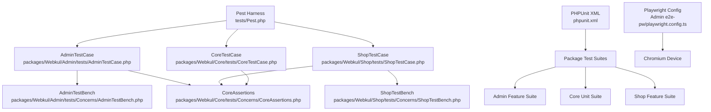
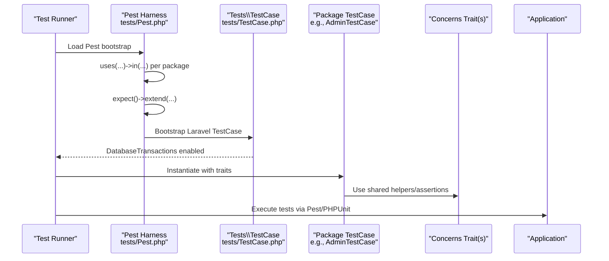
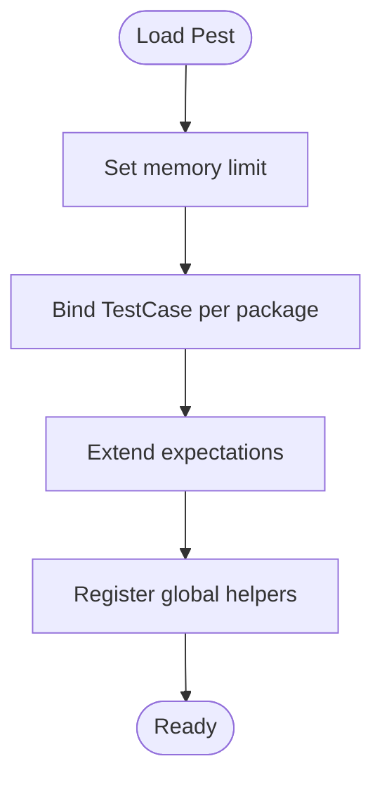
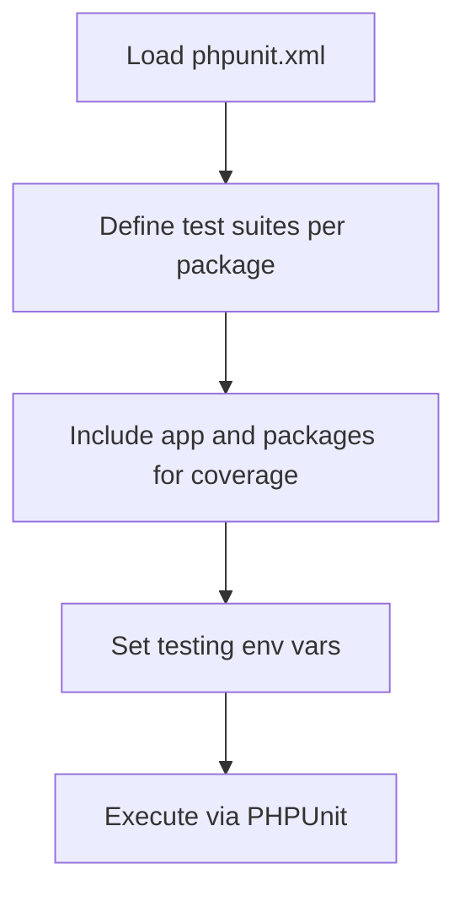
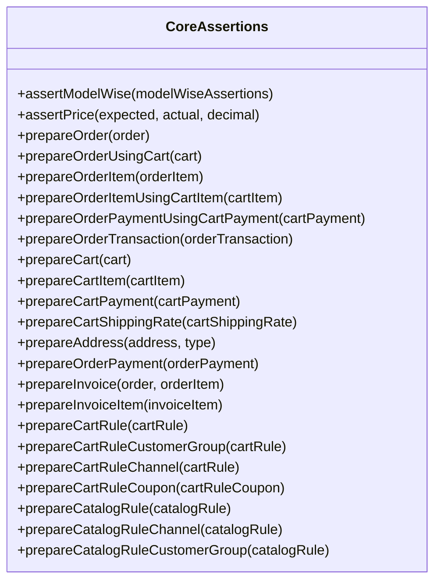
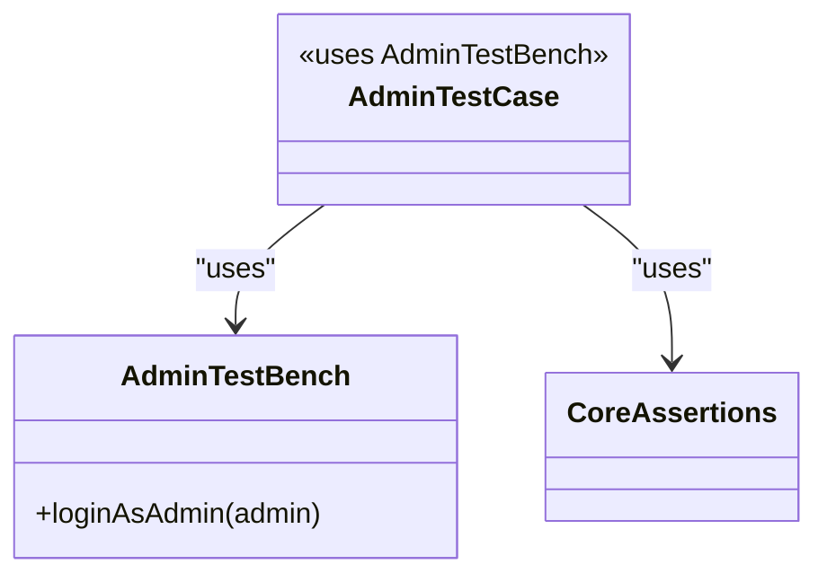
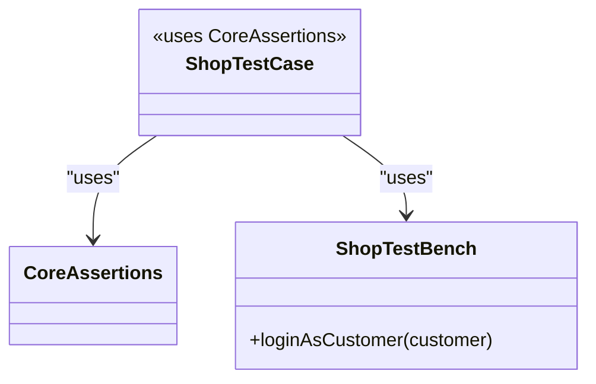
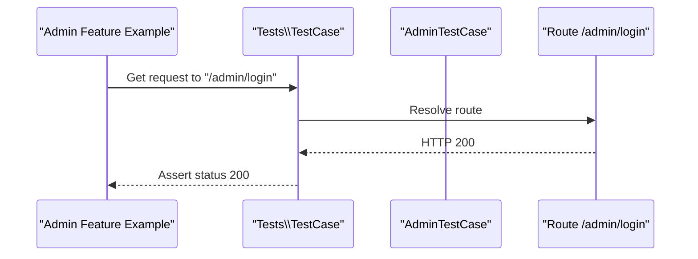
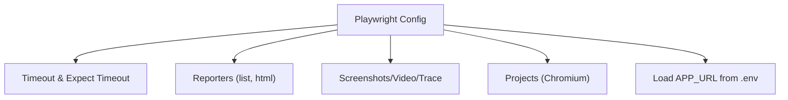
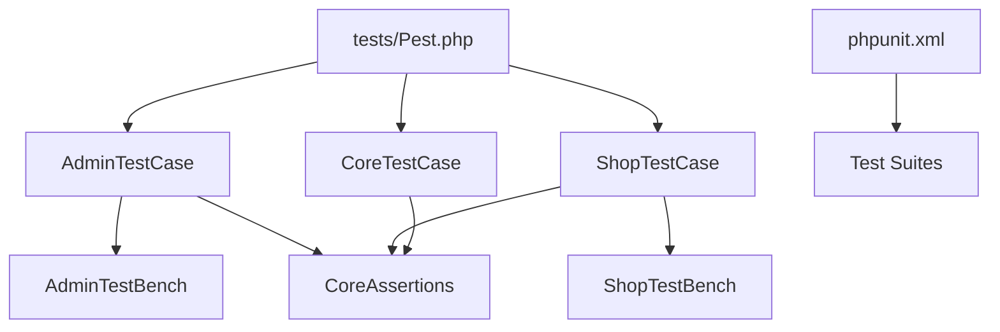

# Testing Frameworks

<cite>
**Referenced Files in This Document**
- [tests/Pest.php](file://tests/Pest.php)
- [tests/TestCase.php](file://tests/TestCase.php)
- [phpunit.xml](file://phpunit.xml)
- [packages/Webkul/Admin/tests/AdminTestCase.php](file://packages/Webkul/Admin/tests/AdminTestCase.php)
- [packages/Webkul/Admin/tests/Concerns/AdminTestBench.php](file://packages/Webkul/Admin/tests/Concerns/AdminTestBench.php)
- [packages/Webkul/Admin/tests/Feature/ExampleTest.php](file://packages/Webkul/Admin/tests/Feature/ExampleTest.php)
- [packages/Webkul/Core/tests/CoreTestCase.php](file://packages/Webkul/Core/tests/CoreTestCase.php)
- [packages/Webkul/Core/tests/Concerns/CoreAssertions.php](file://packages/Webkul/Core/tests/Concerns/CoreAssertions.php)
- [packages/Webkul/Core/tests/Unit/CoreTest.php](file://packages/Webkul/Core/tests/Unit/CoreTest.php)
- [packages/Webkul/Shop/tests/ShopTestCase.php](file://packages/Webkul/Shop/tests/ShopTestCase.php)
- [packages/Webkul/Shop/tests/Concerns/ShopTestBench.php](file://packages/Webkul/Shop/tests/Concerns/ShopTestBench.php)
- [packages/Webkul/Admin/tests/e2e-pw/playwright.config.ts](file://packages/Webkul/Admin/tests/e2e-pw/playwright.config.ts)
</cite>

## Table of Contents
1. [Introduction](#introduction)
2. [Project Structure](#project-structure)
3. [Core Components](#core-components)
4. [Architecture Overview](#architecture-overview)
5. [Detailed Component Analysis](#detailed-component-analysis)
6. [Dependency Analysis](#dependency-analysis)
7. [Performance Considerations](#performance-considerations)
8. [Troubleshooting Guide](#troubleshooting-guide)
9. [Conclusion](#conclusion)
10. [Appendices](#appendices)

## Introduction
This document describes the testing framework architecture used across the Frooxi project. It covers Pest-based functional/unit tests, PHPUnit configuration, shared base test case classes, global test harness initialization, expectation extensions, helper traits, and end-to-end testing setup with Playwright. It also documents test case inheritance patterns across packages (Core, Admin, Shop, etc.), configuration options, memory limits, and performance optimizations. Guidance is included for organizing tests consistently across the modular architecture.

## Project Structure
The testing system is organized around:
- A central Pest harness that bootstraps per-package test suites and registers global expectations and helpers.
- A Laravel base TestCase enabling database transactions for isolation.
- Per-package test case base classes that compose reusable concerns (traits) for common assertions and test benches.
- PHPUnit XML defining test suites for each package and environment configuration for deterministic runs.
- End-to-end tests powered by Playwright under Admin and Shop packages.

**Diagram sources**
- [tests/Pest.php:1-68](file://tests/Pest.php#L1-L68)
- [packages/Webkul/Admin/tests/AdminTestCase.php:1-13](file://packages/Webkul/Admin/tests/AdminTestCase.php#L1-L13)
- [packages/Webkul/Admin/tests/Concerns/AdminTestBench.php:1-22](file://packages/Webkul/Admin/tests/Concerns/AdminTestBench.php#L1-L22)
- [packages/Webkul/Core/tests/CoreTestCase.php:1-12](file://packages/Webkul/Core/tests/CoreTestCase.php#L1-L12)
- [packages/Webkul/Core/tests/Concerns/CoreAssertions.php:1-555](file://packages/Webkul/Core/tests/Concerns/CoreAssertions.php#L1-L555)
- [packages/Webkul/Shop/tests/ShopTestCase.php:1-13](file://packages/Webkul/Shop/tests/ShopTestCase.php#L1-L13)
- [packages/Webkul/Shop/tests/Concerns/ShopTestBench.php:1-22](file://packages/Webkul/Shop/tests/Concerns/ShopTestBench.php#L1-L22)
- [phpunit.xml:1-87](file://phpunit.xml#L1-L87)
- [packages/Webkul/Admin/tests/e2e-pw/playwright.config.ts:1-59](file://packages/Webkul/Admin/tests/e2e-pw/playwright.config.ts#L1-L59)

**Section sources**
- [tests/Pest.php:1-68](file://tests/Pest.php#L1-L68)
- [tests/TestCase.php:1-12](file://tests/TestCase.php#L1-L12)
- [phpunit.xml:1-87](file://phpunit.xml#L1-L87)

## Core Components
- Pest harness
  - Registers package-specific test case base classes and binds them to their respective test directories.
  - Sets runtime memory limit globally for tests.
  - Extends expectations with custom matchers.
  - Declares global helper functions.
- Laravel base TestCase
  - Provides database transaction isolation for each test via the DatabaseTransactions trait.
- Package test case base classes
  - AdminTestCase composes AdminTestBench and CoreAssertions.
  - CoreTestCase composes CoreAssertions.
  - ShopTestCase composes CoreAssertions and ShopTestBench.
- CoreAssertions
  - Provides domain-specific assertion helpers for orders, carts, payments, invoices, rules, and addresses.
  - Includes helpers to normalize and compare prices with channel-specific decimal precision.
- AdminTestBench and ShopTestBench
  - Provide convenience methods to log in as admin or customer respectively, leveraging factories and actingAs.

**Section sources**
- [tests/Pest.php:14-67](file://tests/Pest.php#L14-L67)
- [tests/TestCase.php:8-11](file://tests/TestCase.php#L8-L11)
- [packages/Webkul/Admin/tests/AdminTestCase.php:9-12](file://packages/Webkul/Admin/tests/AdminTestCase.php#L9-L12)
- [packages/Webkul/Core/tests/CoreTestCase.php:8-11](file://packages/Webkul/Core/tests/CoreTestCase.php#L8-L11)
- [packages/Webkul/Shop/tests/ShopTestCase.php:9-12](file://packages/Webkul/Shop/tests/ShopTestCase.php#L9-L12)
- [packages/Webkul/Admin/tests/Concerns/AdminTestBench.php:8-21](file://packages/Webkul/Admin/tests/Concerns/AdminTestBench.php#L8-L21)
- [packages/Webkul/Shop/tests/Concerns/ShopTestBench.php:8-21](file://packages/Webkul/Shop/tests/Concerns/ShopTestBench.php#L8-L21)
- [packages/Webkul/Core/tests/Concerns/CoreAssertions.php:18-554](file://packages/Webkul/Core/tests/Concerns/CoreAssertions.php#L18-L554)

## Architecture Overview
The testing architecture follows a layered pattern:
- Global harness initializes Pest and sets environment/memory constraints.
- Each package defines a base TestCase that aggregates reusable concerns.
- Tests leverage Pest’s expressive DSL (expect, it, test) and the shared assertions.
- PHPUnit orchestrates cross-package suites for CI and coverage inclusion.

**Diagram sources**
- [tests/Pest.php:27-36](file://tests/Pest.php#L27-L36)
- [tests/TestCase.php:8-11](file://tests/TestCase.php#L8-L11)
- [packages/Webkul/Admin/tests/AdminTestCase.php:9-12](file://packages/Webkul/Admin/tests/AdminTestCase.php#L9-L12)
- [packages/Webkul/Core/tests/Concerns/CoreAssertions.php:18-554](file://packages/Webkul/Core/tests/Concerns/CoreAssertions.php#L18-L554)

## Detailed Component Analysis

### Pest Harness Initialization
- Memory limit is raised to accommodate larger datasets and concurrent operations during tests.
- Global uses directives bind each package’s TestCase to its tests directory.
- Expectation extension demonstrates extensibility for custom assertions.
- Global helper function declaration centralizes reusable utilities.

**Diagram sources**
- [tests/Pest.php:14-67](file://tests/Pest.php#L14-L67)

**Section sources**
- [tests/Pest.php:14-67](file://tests/Pest.php#L14-L67)

### PHPUnit Configuration
- Defines separate test suites for each package (Admin Feature, Core Unit, Shop Feature, etc.).
- Includes source directories for app and packages to enable coverage.
- Sets environment variables for a fast, deterministic testing environment (array stores, sync queues, maintenance driver, etc.).

**Diagram sources**
- [phpunit.xml:8-85](file://phpunit.xml#L8-L85)

**Section sources**
- [phpunit.xml:1-87](file://phpunit.xml#L1-L87)

### Core Assertions and Price Formatting
CoreAssertions provides:
- Model-wise database assertions.
- Price comparison with channel-specific decimal precision.
- Comprehensive preparation helpers for orders, carts, items, payments, transactions, invoices, and rules.
These utilities ensure consistent assertions across financial and inventory domains.

**Diagram sources**
- [packages/Webkul/Core/tests/Concerns/CoreAssertions.php:18-554](file://packages/Webkul/Core/tests/Concerns/CoreAssertions.php#L18-L554)

**Section sources**
- [packages/Webkul/Core/tests/Concerns/CoreAssertions.php:18-554](file://packages/Webkul/Core/tests/Concerns/CoreAssertions.php#L18-L554)

### Admin Test Case and Bench
- AdminTestCase extends the base TestCase and uses AdminTestBench and CoreAssertions.
- AdminTestBench provides loginAsAdmin to quickly authenticate admin users for tests.

**Diagram sources**
- [packages/Webkul/Admin/tests/AdminTestCase.php:9-12](file://packages/Webkul/Admin/tests/AdminTestCase.php#L9-L12)
- [packages/Webkul/Admin/tests/Concerns/AdminTestBench.php:8-21](file://packages/Webkul/Admin/tests/Concerns/AdminTestBench.php#L8-L21)

**Section sources**
- [packages/Webkul/Admin/tests/AdminTestCase.php:9-12](file://packages/Webkul/Admin/tests/AdminTestCase.php#L9-L12)
- [packages/Webkul/Admin/tests/Concerns/AdminTestBench.php:8-21](file://packages/Webkul/Admin/tests/Concerns/AdminTestBench.php#L8-L21)

### Shop Test Case and Bench
- ShopTestCase extends the base TestCase and uses CoreAssertions and ShopTestBench.
- ShopTestBench provides loginAsCustomer to authenticate customers for storefront tests.

**Diagram sources**
- [packages/Webkul/Shop/tests/ShopTestCase.php:9-12](file://packages/Webkul/Shop/tests/ShopTestCase.php#L9-L12)
- [packages/Webkul/Shop/tests/Concerns/ShopTestBench.php:8-21](file://packages/Webkul/Shop/tests/Concerns/ShopTestBench.php#L8-L21)

**Section sources**
- [packages/Webkul/Shop/tests/ShopTestCase.php:9-12](file://packages/Webkul/Shop/tests/ShopTestCase.php#L9-L12)
- [packages/Webkul/Shop/tests/Concerns/ShopTestBench.php:8-21](file://packages/Webkul/Shop/tests/Concerns/ShopTestBench.php#L8-L21)

### Example Test Case Organization
- Admin Feature example demonstrates a simple GET request test using the base TestCase and package TestCase.
- Core Unit tests showcase Pest’s it blocks with expect assertions and factory-driven setup.

**Diagram sources**
- [packages/Webkul/Admin/tests/Feature/ExampleTest.php:3-7](file://packages/Webkul/Admin/tests/Feature/ExampleTest.php#L3-L7)

**Section sources**
- [packages/Webkul/Admin/tests/Feature/ExampleTest.php:1-8](file://packages/Webkul/Admin/tests/Feature/ExampleTest.php#L1-L8)
- [packages/Webkul/Core/tests/Unit/CoreTest.php:7-17](file://packages/Webkul/Core/tests/Unit/CoreTest.php#L7-L17)

### End-to-End Testing with Playwright (Admin)
- Playwright configuration defines timeouts, reporters, screenshots, videos, and traces.
- Projects specify a single Chromium device; fullyParallel disabled and workers constrained for stability.
- Environment variables loaded from root .env to configure APP_URL.

**Diagram sources**
- [packages/Webkul/Admin/tests/e2e-pw/playwright.config.ts:15-58](file://packages/Webkul/Admin/tests/e2e-pw/playwright.config.ts#L15-L58)

**Section sources**
- [packages/Webkul/Admin/tests/e2e-pw/playwright.config.ts:1-59](file://packages/Webkul/Admin/tests/e2e-pw/playwright.config.ts#L1-L59)

## Dependency Analysis
- Pest harness depends on:
  - Package TestCase classes for binding.
  - Global helpers and expectations.
- Package TestCases depend on:
  - CoreAssertions for shared domain logic.
  - Package-specific bench traits for authentication helpers.
- PHPUnit depends on:
  - Directory-based test suite definitions.
  - Environment variables for consistent behavior.

**Diagram sources**
- [tests/Pest.php:27-36](file://tests/Pest.php#L27-L36)
- [packages/Webkul/Admin/tests/AdminTestCase.php:9-12](file://packages/Webkul/Admin/tests/AdminTestCase.php#L9-L12)
- [packages/Webkul/Core/tests/CoreTestCase.php:8-11](file://packages/Webkul/Core/tests/CoreTestCase.php#L8-L11)
- [packages/Webkul/Shop/tests/ShopTestCase.php:9-12](file://packages/Webkul/Shop/tests/ShopTestCase.php#L9-L12)
- [phpunit.xml:8-65](file://phpunit.xml#L8-L65)

**Section sources**
- [tests/Pest.php:27-36](file://tests/Pest.php#L27-L36)
- [phpunit.xml:8-65](file://phpunit.xml#L8-L65)

## Performance Considerations
- Memory limit increased in Pest harness to support heavier test workloads.
- PHPUnit uses array-backed stores and sync queues to avoid external dependencies and reduce flakiness.
- Workers set to 1 in Playwright config to prevent concurrency-induced instability in e2e tests.
- FullyParallel disabled to keep resource usage predictable during CI runs.

Recommendations:
- Prefer factory-driven data creation to minimize database overhead.
- Use CoreAssertions’ prepared structures to avoid repeated queries in assertions.
- Keep e2e tests scoped and ordered to reduce flakiness; leverage traces and artifacts for diagnostics.

**Section sources**
- [tests/Pest.php:14](file://tests/Pest.php#L14)
- [phpunit.xml:75-84](file://phpunit.xml#L75-L84)
- [packages/Webkul/Admin/tests/e2e-pw/playwright.config.ts:24-26](file://packages/Webkul/Admin/tests/e2e-pw/playwright.config.ts#L24-L26)

## Troubleshooting Guide
Common issues and resolutions:
- Tests failing due to memory constraints
  - Increase memory limit in Pest harness if tests require heavy datasets.
- Flaky e2e tests
  - Verify APP_URL in .env; confirm Playwright timeouts and artifacts are configured appropriately.
- Assertion mismatches on prices
  - Use CoreAssertions::assertPrice with explicit decimal precision to align with channel settings.
- Authentication-dependent tests
  - Use AdminTestBench::loginAsAdmin or ShopTestBench::loginAsCustomer to ensure proper actingAs context.

**Section sources**
- [tests/Pest.php:14](file://tests/Pest.php#L14)
- [packages/Webkul/Admin/tests/e2e-pw/playwright.config.ts:45-50](file://packages/Webkul/Admin/tests/e2e-pw/playwright.config.ts#L45-L50)
- [packages/Webkul/Core/tests/Concerns/CoreAssertions.php:35-44](file://packages/Webkul/Core/tests/Concerns/CoreAssertions.php#L35-L44)
- [packages/Webkul/Admin/tests/Concerns/AdminTestBench.php:13-20](file://packages/Webkul/Admin/tests/Concerns/AdminTestBench.php#L13-L20)
- [packages/Webkul/Shop/tests/Concerns/ShopTestBench.php:13-20](file://packages/Webkul/Shop/tests/Concerns/ShopTestBench.php#L13-L20)

## Conclusion
The Frooxi testing framework combines Pest’s expressive power with Laravel’s robust base TestCase and a set of reusable concerns. Package-specific test case bases streamline authentication and assertions, while PHPUnit and Playwright configurations ensure consistent, reproducible, and artifact-rich test runs. Adhering to the documented inheritance patterns and using CoreAssertions will maintain test quality and consistency across the modular architecture.

## Appendices

### Best Practices for Test Organization
- Use Pest’s it/test blocks for unit and feature tests; group related tests in Feature/Unit directories per package.
- Keep package TestCase classes minimal; rely on traits for shared behavior.
- Centralize custom expectations and helpers in Pest harness for global reuse.
- Prefer CoreAssertions for domain-specific validations to reduce duplication.
- For e2e tests, isolate flaky steps, capture artifacts, and keep workers low for reliability.

[No sources needed since this section provides general guidance]