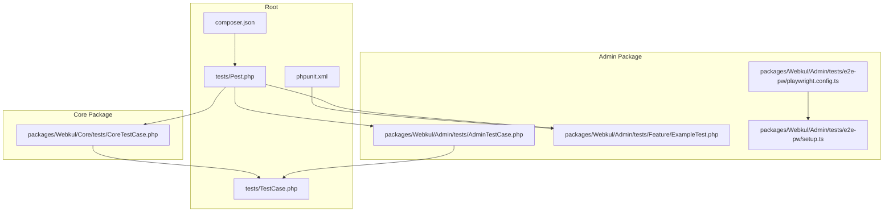
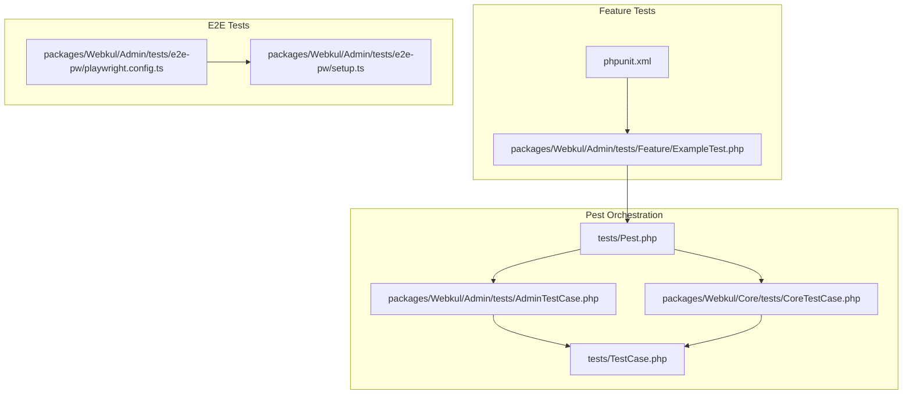
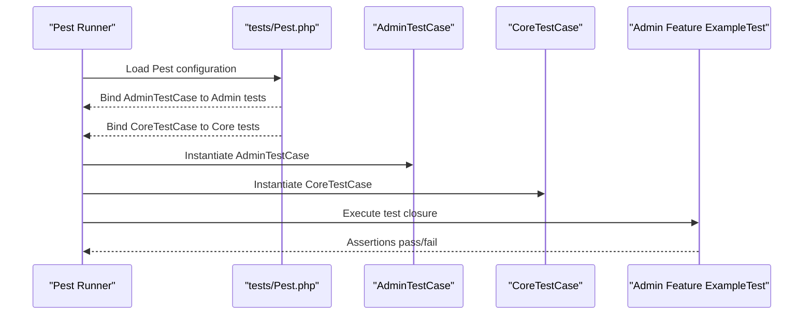
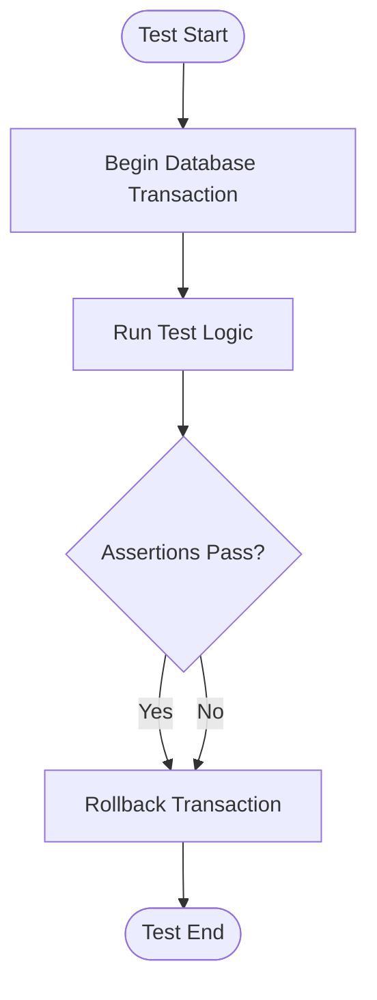
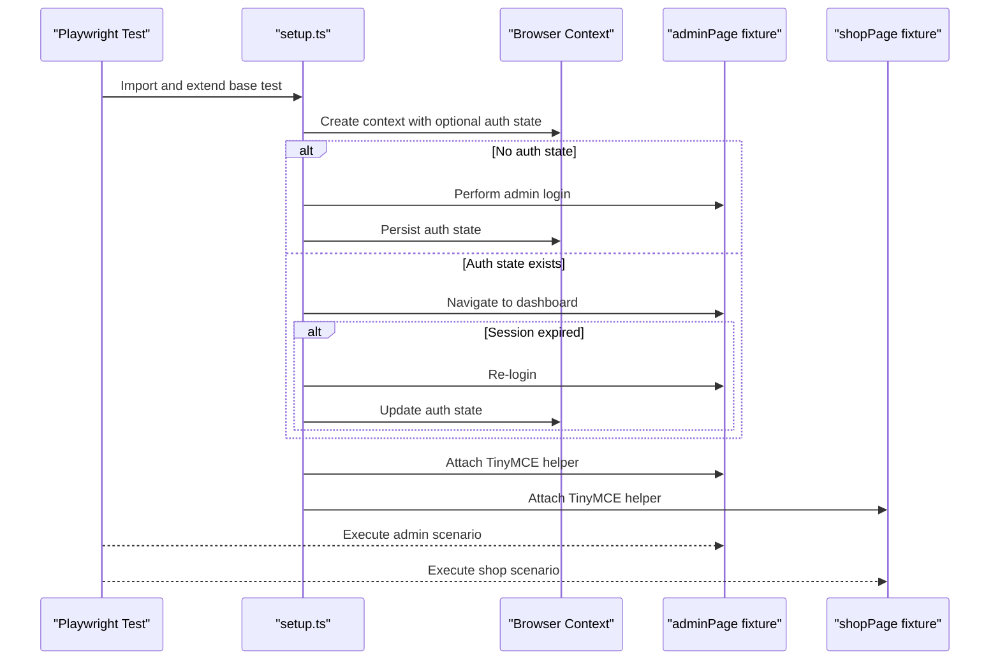
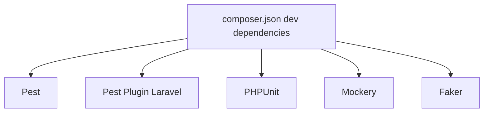

# Testing Strategy

<cite>
**Referenced Files in This Document**
- [tests/Pest.php](file://tests/Pest.php)
- [tests/TestCase.php](file://tests/TestCase.php)
- [phpunit.xml](file://phpunit.xml)
- [composer.json](file://composer.json)
- [packages/Webkul/Admin/tests/AdminTestCase.php](file://packages/Webkul/Admin/tests/AdminTestCase.php)
- [packages/Webkul/Core/tests/CoreTestCase.php](file://packages/Webkul/Core/tests/CoreTestCase.php)
- [packages/Webkul/Admin/tests/Feature/ExampleTest.php](file://packages/Webkul/Admin/tests/Feature/ExampleTest.php)
- [packages/Webkul/Admin/tests/e2e-pw/playwright.config.ts](file://packages/Webkul/Admin/tests/e2e-pw/playwright.config.ts)
- [packages/Webkul/Admin/tests/e2e-pw/setup.ts](file://packages/Webkul/Admin/tests/e2e-pw/setup.ts)
</cite>

## Table of Contents
1. [Introduction](#introduction)
2. [Project Structure](#project-structure)
3. [Core Components](#core-components)
4. [Architecture Overview](#architecture-overview)
5. [Detailed Component Analysis](#detailed-component-analysis)
6. [Dependency Analysis](#dependency-analysis)
7. [Performance Considerations](#performance-considerations)
8. [Troubleshooting Guide](#troubleshooting-guide)
9. [Conclusion](#conclusion)

## Introduction
This document describes the testing strategy and quality assurance processes for the project. It covers unit testing, feature testing, and end-to-end testing approaches, the Pest testing framework usage, test case organization, automated testing procedures, database testing strategies, mock implementations, test data management, continuous integration setup, test automation, quality metrics, best practices, debugging techniques, and performance testing methodologies. The project employs Pest for expressive PHP testing and Playwright for end-to-end browser automation.

## Project Structure
The testing ecosystem is organized around a central Pest configuration that binds reusable test cases to module-specific test suites. Each package defines its own test suites under Feature, Unit, and e2e-pw directories. The root phpunit.xml aggregates per-package suites for legacy or complementary runs. Composer dev dependencies include Pest and PHPUnit.

**Diagram sources**
- [tests/Pest.php:1-68](file://tests/Pest.php#L1-L68)
- [tests/TestCase.php:1-12](file://tests/TestCase.php#L1-L12)
- [phpunit.xml:1-87](file://phpunit.xml#L1-L87)
- [composer.json:1-135](file://composer.json#L1-L135)
- [packages/Webkul/Admin/tests/AdminTestCase.php:1-13](file://packages/Webkul/Admin/tests/AdminTestCase.php#L1-L13)
- [packages/Webkul/Core/tests/CoreTestCase.php:1-12](file://packages/Webkul/Core/tests/CoreTestCase.php#L1-L12)
- [packages/Webkul/Admin/tests/Feature/ExampleTest.php:1-8](file://packages/Webkul/Admin/tests/Feature/ExampleTest.php#L1-L8)
- [packages/Webkul/Admin/tests/e2e-pw/playwright.config.ts:1-59](file://packages/Webkul/Admin/tests/e2e-pw/playwright.config.ts#L1-L59)
- [packages/Webkul/Admin/tests/e2e-pw/setup.ts:1-108](file://packages/Webkul/Admin/tests/e2e-pw/setup.ts#L1-L108)

**Section sources**
- [tests/Pest.php:1-68](file://tests/Pest.php#L1-L68)
- [tests/TestCase.php:1-12](file://tests/TestCase.php#L1-L12)
- [phpunit.xml:1-87](file://phpunit.xml#L1-L87)
- [composer.json:1-135](file://composer.json#L1-L135)

## Core Components
- Central Pest configuration binds reusable test cases to module test suites and sets global expectations and helpers.
- Root TestCase enables database transactions for fast, isolated rollbacks during tests.
- Per-module test cases extend the root TestCase and bring shared assertions or helpers.
- phpunit.xml defines test suites for packages and sets environment variables for deterministic test runs.
- Admin and Shop packages include both Pest Feature tests and Playwright e2e tests.

Key implementation references:
- Pest bootstrapping and suite bindings: [tests/Pest.php:27-36](file://tests/Pest.php#L27-L36)
- Global expectation extension: [tests/Pest.php:49-51](file://tests/Pest.php#L49-L51)
- Root test base enabling transactions: [tests/TestCase.php:8-11](file://tests/TestCase.php#L8-L11)
- Admin test case composition: [packages/Webkul/Admin/tests/AdminTestCase.php:9-12](file://packages/Webkul/Admin/tests/AdminTestCase.php#L9-L12)
- Core test case composition: [packages/Webkul/Core/tests/CoreTestCase.php:8-11](file://packages/Webkul/Core/tests/CoreTestCase.php#L8-L11)
- Example Pest Feature test: [packages/Webkul/Admin/tests/Feature/ExampleTest.php:3-7](file://packages/Webkul/Admin/tests/Feature/ExampleTest.php#L3-L7)
- PHPUnit suites for packages: [phpunit.xml:8-65](file://phpunit.xml#L8-L65)

**Section sources**
- [tests/Pest.php:1-68](file://tests/Pest.php#L1-L68)
- [tests/TestCase.php:1-12](file://tests/TestCase.php#L1-L12)
- [packages/Webkul/Admin/tests/AdminTestCase.php:1-13](file://packages/Webkul/Admin/tests/AdminTestCase.php#L1-L13)
- [packages/Webkul/Core/tests/CoreTestCase.php:1-12](file://packages/Webkul/Core/tests/CoreTestCase.php#L1-L12)
- [packages/Webkul/Admin/tests/Feature/ExampleTest.php:1-8](file://packages/Webkul/Admin/tests/Feature/ExampleTest.php#L1-L8)
- [phpunit.xml:1-87](file://phpunit.xml#L1-L87)

## Architecture Overview
The testing architecture combines Pest-driven unit and feature tests with Playwright-powered end-to-end tests. Pest orchestrates reusable test cases and per-package suites. Playwright manages browser contexts, authentication state caching, and page fixtures for admin and shop flows.

**Diagram sources**
- [tests/Pest.php:1-68](file://tests/Pest.php#L1-L68)
- [tests/TestCase.php:1-12](file://tests/TestCase.php#L1-L12)
- [packages/Webkul/Admin/tests/AdminTestCase.php:1-13](file://packages/Webkul/Admin/tests/AdminTestCase.php#L1-L13)
- [packages/Webkul/Core/tests/CoreTestCase.php:1-12](file://packages/Webkul/Core/tests/CoreTestCase.php#L1-L12)
- [packages/Webkul/Admin/tests/Feature/ExampleTest.php:1-8](file://packages/Webkul/Admin/tests/Feature/ExampleTest.php#L1-L8)
- [phpunit.xml:1-87](file://phpunit.xml#L1-L87)
- [packages/Webkul/Admin/tests/e2e-pw/playwright.config.ts:1-59](file://packages/Webkul/Admin/tests/e2e-pw/playwright.config.ts#L1-L59)
- [packages/Webkul/Admin/tests/e2e-pw/setup.ts:1-108](file://packages/Webkul/Admin/tests/e2e-pw/setup.ts#L1-L108)

## Detailed Component Analysis

### Pest Testing Framework and Test Case Organization
- Pest is configured to bind reusable test cases to module test directories via the uses directive and in directive.
- Global expectations and helpers are registered centrally for reuse across suites.
- Each package defines its own test case class extending the root TestCase, enabling shared behaviors and assertions.

Implementation references:
- Pest suite bindings: [tests/Pest.php:27-36](file://tests/Pest.php#L27-L36)
- Global expectation extension: [tests/Pest.php:49-51](file://tests/Pest.php#L49-L51)
- Admin test case composition: [packages/Webkul/Admin/tests/AdminTestCase.php:9-12](file://packages/Webkul/Admin/tests/AdminTestCase.php#L9-L12)
- Core test case composition: [packages/Webkul/Core/tests/CoreTestCase.php:8-11](file://packages/Webkul/Core/tests/CoreTestCase.php#L8-L11)
- Example Pest Feature test: [packages/Webkul/Admin/tests/Feature/ExampleTest.php:3-7](file://packages/Webkul/Admin/tests/Feature/ExampleTest.php#L3-L7)

**Diagram sources**
- [tests/Pest.php:27-36](file://tests/Pest.php#L27-L36)
- [packages/Webkul/Admin/tests/AdminTestCase.php:9-12](file://packages/Webkul/Admin/tests/AdminTestCase.php#L9-L12)
- [packages/Webkul/Core/tests/CoreTestCase.php:8-11](file://packages/Webkul/Core/tests/CoreTestCase.php#L8-L11)
- [packages/Webkul/Admin/tests/Feature/ExampleTest.php:3-7](file://packages/Webkul/Admin/tests/Feature/ExampleTest.php#L3-L7)

**Section sources**
- [tests/Pest.php:1-68](file://tests/Pest.php#L1-L68)
- [packages/Webkul/Admin/tests/AdminTestCase.php:1-13](file://packages/Webkul/Admin/tests/AdminTestCase.php#L1-L13)
- [packages/Webkul/Core/tests/CoreTestCase.php:1-12](file://packages/Webkul/Core/tests/CoreTestCase.php#L1-L12)
- [packages/Webkul/Admin/tests/Feature/ExampleTest.php:1-8](file://packages/Webkul/Admin/tests/Feature/ExampleTest.php#L1-L8)

### Database Testing Strategies and Transactions
- The root TestCase enables database transactions so that each test runs inside a transaction that is rolled back afterward, ensuring isolation and fast execution.
- Environment variables in phpunit.xml configure cache, queues, sessions, and mailers to in-memory or synchronous drivers for deterministic behavior.

Implementation references:
- Root test base with transactions: [tests/TestCase.php:8-11](file://tests/TestCase.php#L8-L11)
- Environment configuration for tests: [phpunit.xml:75-85](file://phpunit.xml#L75-L85)

**Diagram sources**
- [tests/TestCase.php:8-11](file://tests/TestCase.php#L8-L11)

**Section sources**
- [tests/TestCase.php:1-12](file://tests/TestCase.php#L1-L12)
- [phpunit.xml:75-85](file://phpunit.xml#L75-L85)

### Mock Implementations and Test Data Management
- Mockery is available as a dev dependency for creating mocks and stubs in tests.
- Faker is available as a dev dependency for generating synthetic test data.
- Data factories and seeders are available at the application and package level for structured test data creation.

Implementation references:
- Dev dependencies including Mockery and Faker: [composer.json:46-56](file://composer.json#L46-L56)

Best practices:
- Prefer factories and seeders for realistic datasets.
- Use mocks sparingly and focus on interface boundaries.
- Keep fixtures minimal and deterministic.

**Section sources**
- [composer.json:46-56](file://composer.json#L46-L56)

### Continuous Integration Setup and Test Automation
- phpunit.xml defines test suites per package and sets environment variables suitable for CI environments.
- Playwright configuration supports CI-friendly settings such as enforced failures on forbidden-only tests and HTML reports.

Implementation references:
- PHPUnit suites and environment: [phpunit.xml:8-65](file://phpunit.xml#L8-L65), [phpunit.xml:75-85](file://phpunit.xml#L75-L85)
- Playwright CI settings: [packages/Webkul/Admin/tests/e2e-pw/playwright.config.ts:28](file://packages/Webkul/Admin/tests/e2e-pw/playwright.config.ts#L28), [packages/Webkul/Admin/tests/e2e-pw/playwright.config.ts:34-43](file://packages/Webkul/Admin/tests/e2e-pw/playwright.config.ts#L34-L43)

Quality metrics:
- Track pass/fail rates, flakiness, and slow tests.
- Use Playwright HTML reports for visual diagnostics.

**Section sources**
- [phpunit.xml:1-87](file://phpunit.xml#L1-L87)
- [packages/Webkul/Admin/tests/e2e-pw/playwright.config.ts:1-59](file://packages/Webkul/Admin/tests/e2e-pw/playwright.config.ts#L1-L59)

### End-to-End Testing with Playwright
- Playwright configuration defines timeouts, reporters, screenshots, videos, and traces for robust diagnostics.
- A custom setup establishes admin and shop page fixtures, including TinyMCE helpers and authentication state caching.
- Tests are organized under e2e-pw/tests with modular spec files covering admin and shop domains.

Implementation references:
- Playwright configuration: [packages/Webkul/Admin/tests/e2e-pw/playwright.config.ts:15-58](file://packages/Webkul/Admin/tests/e2e-pw/playwright.config.ts#L15-L58)
- Admin and shop fixtures and TinyMCE helpers: [packages/Webkul/Admin/tests/e2e-pw/setup.ts:27-104](file://packages/Webkul/Admin/tests/e2e-pw/setup.ts#L27-L104)

**Diagram sources**
- [packages/Webkul/Admin/tests/e2e-pw/playwright.config.ts:15-58](file://packages/Webkul/Admin/tests/e2e-pw/playwright.config.ts#L15-L58)
- [packages/Webkul/Admin/tests/e2e-pw/setup.ts:27-104](file://packages/Webkul/Admin/tests/e2e-pw/setup.ts#L27-L104)

**Section sources**
- [packages/Webkul/Admin/tests/e2e-pw/playwright.config.ts:1-59](file://packages/Webkul/Admin/tests/e2e-pw/playwright.config.ts#L1-L59)
- [packages/Webkul/Admin/tests/e2e-pw/setup.ts:1-108](file://packages/Webkul/Admin/tests/e2e-pw/setup.ts#L1-L108)

### Feature Testing with Pest
- Feature tests are written as Pest closures under Feature directories for each package.
- Example: Admin login page test asserts a successful response.

Implementation references:
- Example Pest Feature test: [packages/Webkul/Admin/tests/Feature/ExampleTest.php:3-7](file://packages/Webkul/Admin/tests/Feature/ExampleTest.php#L3-L7)
- Pest suite bindings: [tests/Pest.php:27-36](file://tests/Pest.php#L27-L36)

**Section sources**
- [packages/Webkul/Admin/tests/Feature/ExampleTest.php:1-8](file://packages/Webkul/Admin/tests/Feature/ExampleTest.php#L1-L8)
- [tests/Pest.php:27-36](file://tests/Pest.php#L27-L36)

### Unit Testing with Pest
- Unit tests are organized under Unit directories for packages.
- Root TestCase and package-specific test cases enable consistent setup and assertions.

Implementation references:
- Core unit test case: [packages/Webkul/Core/tests/CoreTestCase.php:8-11](file://packages/Webkul/Core/tests/CoreTestCase.php#L8-L11)
- Pest suite bindings for unit tests: [tests/Pest.php:27-36](file://tests/Pest.php#L27-L36)

**Section sources**
- [packages/Webkul/Core/tests/CoreTestCase.php:1-12](file://packages/Webkul/Core/tests/CoreTestCase.php#L1-L12)
- [tests/Pest.php:27-36](file://tests/Pest.php#L27-L36)

## Dependency Analysis
The testing stack relies on Pest and PHPUnit for orchestration, with Playwright for E2E. Composer dev dependencies include Pest, PHPUnit, Mockery, and Faker. phpunit.xml aggregates suites per package.

**Diagram sources**
- [composer.json:46-56](file://composer.json#L46-L56)

**Section sources**
- [composer.json:46-56](file://composer.json#L46-L56)
- [phpunit.xml:1-87](file://phpunit.xml#L1-L87)

## Performance Considerations
- Use database transactions to avoid disk writes and keep tests fast.
- Favor in-memory caches, sync queues, and array mailers for deterministic and quick runs.
- Limit browser parallelism in CI to reduce resource contention; Playwright configuration sets workers intentionally low.
- Capture minimal artifacts (screenshots on failure, videos on failure) to balance diagnostics and storage costs.

[No sources needed since this section provides general guidance]

## Troubleshooting Guide
Common issues and resolutions:
- Authentication state expiration in Playwright: The setup re-authenticates automatically if the admin login page is detected, ensuring reliable runs.
- CI-only enforcement: Playwright forbids “forbidOnly” tests in CI to prevent accidental skips.
- Diagnostics: Enable screenshots on failure, retain videos on failure, and capture traces on failure for deep inspection.

Implementation references:
- Admin auth state handling and re-login: [packages/Webkul/Admin/tests/e2e-pw/setup.ts:42-53](file://packages/Webkul/Admin/tests/e2e-pw/setup.ts#L42-L53)
- CI forbidOnly enforcement: [packages/Webkul/Admin/tests/e2e-pw/playwright.config.ts:28](file://packages/Webkul/Admin/tests/e2e-pw/playwright.config.ts#L28)
- Artifacts configuration: [packages/Webkul/Admin/tests/e2e-pw/playwright.config.ts:45-50](file://packages/Webkul/Admin/tests/e2e-pw/playwright.config.ts#L45-L50)

**Section sources**
- [packages/Webkul/Admin/tests/e2e-pw/setup.ts:1-108](file://packages/Webkul/Admin/tests/e2e-pw/setup.ts#L1-L108)
- [packages/Webkul/Admin/tests/e2e-pw/playwright.config.ts:1-59](file://packages/Webkul/Admin/tests/e2e-pw/playwright.config.ts#L1-L59)

## Conclusion
The project’s testing strategy leverages Pest for expressive unit and feature tests, with Playwright for robust end-to-end scenarios. Centralized Pest configuration and reusable test cases promote consistency across packages. Database transactions and CI-friendly Playwright settings ensure fast, reliable, and reproducible test runs. Adopting the recommended best practices and leveraging the provided fixtures and configurations will maintain high-quality assurance across development and CI pipelines.