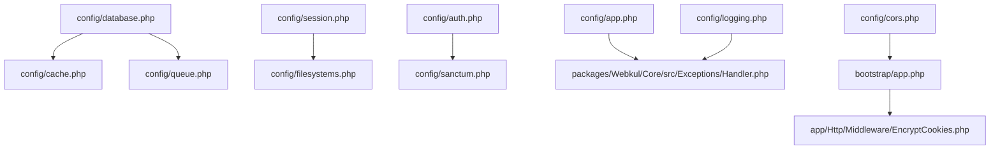
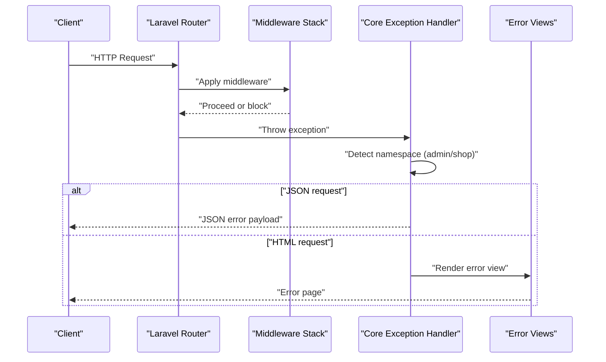
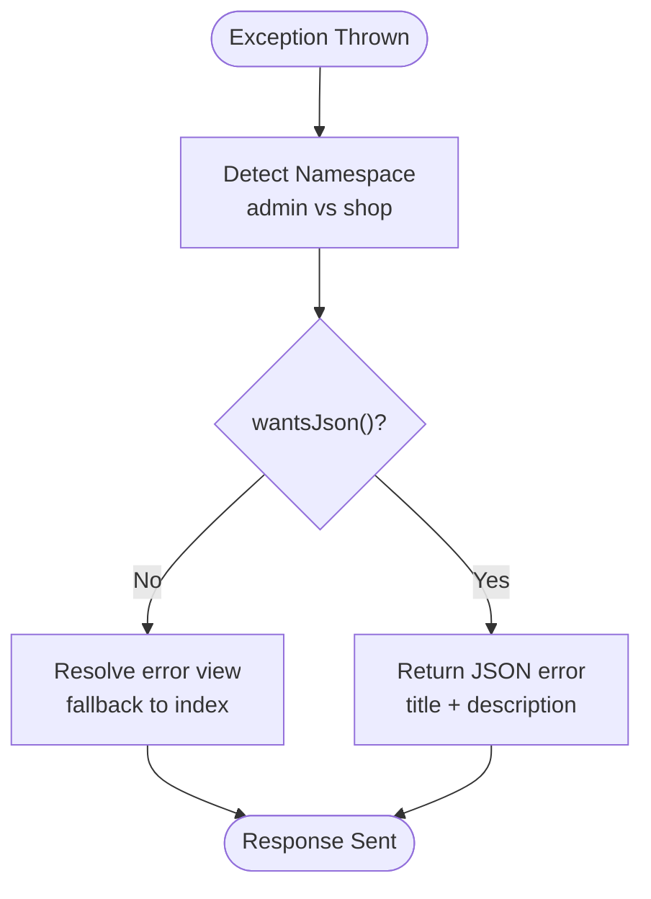
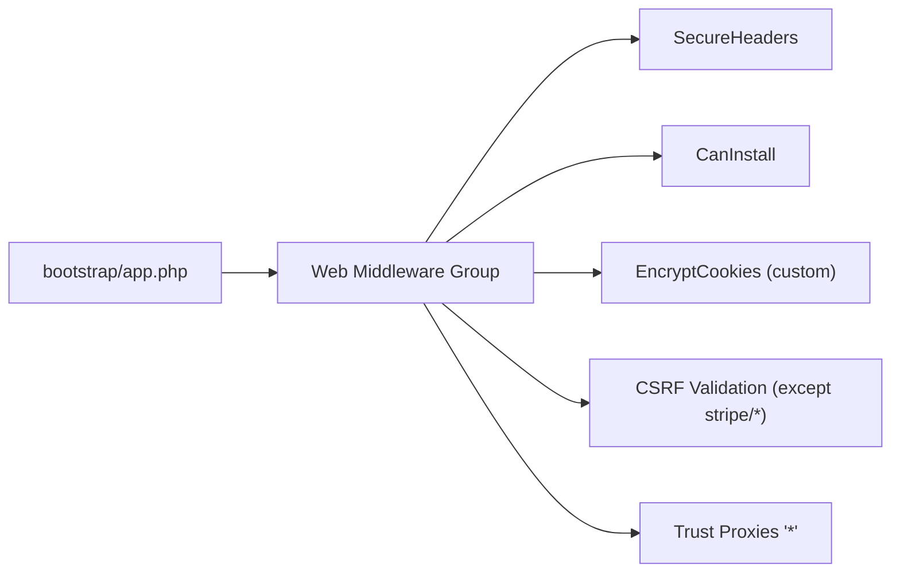
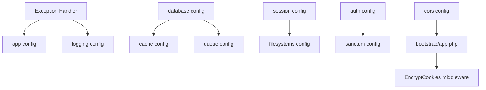

# Troubleshooting & FAQ

<cite>
**Referenced Files in This Document**
- [config/app.php](file://config/app.php)
- [config/logging.php](file://config/logging.php)
- [config/database.php](file://config/database.php)
- [config/cache.php](file://config/cache.php)
- [config/queue.php](file://config/queue.php)
- [config/session.php](file://config/session.php)
- [config/filesystems.php](file://config/filesystems.php)
- [config/auth.php](file://config/auth.php)
- [config/sanctum.php](file://config/sanctum.php)
- [config/cors.php](file://config/cors.php)
- [packages/Webkul/Core/src/Exceptions/Handler.php](file://packages/Webkul/Core/src/Exceptions/Handler.php)
- [bootstrap/app.php](file://bootstrap/app.php)
- [app/Http/Middleware/EncryptCookies.php](file://app/Http/Middleware/EncryptCookies.php)
- [SECURITY.md](file://SECURITY.md)
</cite>

## Table of Contents
1. [Introduction](#introduction)
2. [Project Structure](#project-structure)
3. [Core Components](#core-components)
4. [Architecture Overview](#architecture-overview)
5. [Detailed Component Analysis](#detailed-component-analysis)
6. [Dependency Analysis](#dependency-analysis)
7. [Performance Considerations](#performance-considerations)
8. [Troubleshooting Guide](#troubleshooting-guide)
9. [Security and Compliance](#security-and-compliance)
10. [Community Resources and Contribution Guidelines](#community-resources-and-contribution-guidelines)
11. [Conclusion](#conclusion)

## Introduction
This document provides a comprehensive troubleshooting guide and FAQ for operating Bagisto (Frooxi implementation). It focuses on diagnosing installation issues, configuration problems, runtime errors, debugging techniques, log analysis, performance tuning, memory optimization, database query optimization, security vulnerability reporting, update procedures, compatibility considerations, and community support channels.

## Project Structure
Bagisto is a modular Laravel-based e-commerce platform. Operational troubleshooting centers around configuration files under config/, exception handling in packages/Webkul/Core/src/Exceptions/Handler.php, and middleware stacks defined in bootstrap/app.php and app/Http/Middleware/EncryptCookies.php. Logs are managed via config/logging.php, while database, cache, queues, sessions, and filesystems are governed by their respective config files.

**Diagram sources**
- [config/app.php:1-188](file://config/app.php#L1-L188)
- [config/logging.php:1-133](file://config/logging.php#L1-L133)
- [config/database.php:1-183](file://config/database.php#L1-L183)
- [config/cache.php:1-109](file://config/cache.php#L1-L109)
- [config/queue.php:1-113](file://config/queue.php#L1-L113)
- [config/session.php:1-218](file://config/session.php#L1-L218)
- [config/filesystems.php:1-94](file://config/filesystems.php#L1-L94)
- [config/auth.php:1-117](file://config/auth.php#L1-L117)
- [config/sanctum.php:1-72](file://config/sanctum.php#L1-L72)
- [config/cors.php:1-35](file://config/cors.php#L1-L35)
- [packages/Webkul/Core/src/Exceptions/Handler.php:1-118](file://packages/Webkul/Core/src/Exceptions/Handler.php#L1-L118)
- [bootstrap/app.php:1-56](file://bootstrap/app.php#L1-L56)
- [app/Http/Middleware/EncryptCookies.php:1-19](file://app/Http/Middleware/EncryptCookies.php#L1-L19)

**Section sources**
- [config/app.php:1-188](file://config/app.php#L1-L188)
- [config/logging.php:1-133](file://config/logging.php#L1-L133)
- [config/database.php:1-183](file://config/database.php#L1-L183)
- [config/cache.php:1-109](file://config/cache.php#L1-L109)
- [config/queue.php:1-113](file://config/queue.php#L1-L113)
- [config/session.php:1-218](file://config/session.php#L1-L218)
- [config/filesystems.php:1-94](file://config/filesystems.php#L1-L94)
- [config/auth.php:1-117](file://config/auth.php#L1-L117)
- [config/sanctum.php:1-72](file://config/sanctum.php#L1-L72)
- [config/cors.php:1-35](file://config/cors.php#L1-L35)
- [packages/Webkul/Core/src/Exceptions/Handler.php:1-118](file://packages/Webkul/Core/src/Exceptions/Handler.php#L1-L118)
- [bootstrap/app.php:1-56](file://bootstrap/app.php#L1-L56)
- [app/Http/Middleware/EncryptCookies.php:1-19](file://app/Http/Middleware/EncryptCookies.php#L1-L19)

## Core Components
- Application configuration: controls environment, debug mode, admin URL, timezone, locale, encryption key, and maintenance mode driver.
- Logging: defines default channel, deprecation logging, and handlers (single, daily, slack, syslog, stderr, stack).
- Database: supports sqlite, mysql, mariadb, pgsql, sqlsrv; includes migration table and Redis options.
- Cache: supports array, database, file, memcached, redis, dynamodb, octane, null; includes key prefixing.
- Queues: supports sync, database, beanstalkd, sqs, redis; includes failed job storage.
- Sessions: supports file, cookie, database, apc, memcached, redis, dynamodb, array; includes cookie attributes.
- Filesystems: supports local, private/public mapping, s3, cloudinary; includes symbolic links.
- Authentication and API security: guards, providers, Sanctum configuration, CORS policy.
- Exception handling: centralized handler for authentication, HTTP, validation, and server errors.

**Section sources**
- [config/app.php:1-188](file://config/app.php#L1-L188)
- [config/logging.php:1-133](file://config/logging.php#L1-L133)
- [config/database.php:1-183](file://config/database.php#L1-L183)
- [config/cache.php:1-109](file://config/cache.php#L1-L109)
- [config/queue.php:1-113](file://config/queue.php#L1-L113)
- [config/session.php:1-218](file://config/session.php#L1-L218)
- [config/filesystems.php:1-94](file://config/filesystems.php#L1-L94)
- [config/auth.php:1-117](file://config/auth.php#L1-L117)
- [config/sanctum.php:1-72](file://config/sanctum.php#L1-L72)
- [config/cors.php:1-35](file://config/cors.php#L1-L35)
- [packages/Webkul/Core/src/Exceptions/Handler.php:1-118](file://packages/Webkul/Core/src/Exceptions/Handler.php#L1-L118)

## Architecture Overview
The runtime error handling pipeline integrates configuration-driven behavior with middleware and module-specific providers. The exception handler adapts responses based on request namespace (admin/shop) and JSON expectations, while middleware ensures secure headers, install checks, and CSRF exemptions for specific routes.

**Diagram sources**
- [packages/Webkul/Core/src/Exceptions/Handler.php:35-78](file://packages/Webkul/Core/src/Exceptions/Handler.php#L35-L78)
- [bootstrap/app.php:20-49](file://bootstrap/app.php#L20-L49)

**Section sources**
- [packages/Webkul/Core/src/Exceptions/Handler.php:1-118](file://packages/Webkul/Core/src/Exceptions/Handler.php#L1-L118)
- [bootstrap/app.php:1-56](file://bootstrap/app.php#L1-L56)

## Detailed Component Analysis

### Exception Handling Pipeline
- Authentication exceptions redirect to appropriate login routes depending on namespace and JSON expectation.
- HTTP exceptions map to standard codes and render localized error views or JSON payloads.
- Validation exceptions preserve default Laravel conversion to JSON.
- Unhandled server exceptions return generic 500 with localized messaging.

**Diagram sources**
- [packages/Webkul/Core/src/Exceptions/Handler.php:35-115](file://packages/Webkul/Core/src/Exceptions/Handler.php#L35-L115)

**Section sources**
- [packages/Webkul/Core/src/Exceptions/Handler.php:1-118](file://packages/Webkul/Core/src/Exceptions/Handler.php#L1-L118)

### Middleware and Security Controls
- SecureHeaders middleware is appended to the web group.
- CanInstall middleware is appended to allow installer flows.
- EncryptCookies replaces the default to exclude sidebar and theme preferences.
- CSRF tokens are validated except for specific Stripe routes.
- Proxies trust is enabled broadly.

**Diagram sources**
- [bootstrap/app.php:20-49](file://bootstrap/app.php#L20-L49)
- [app/Http/Middleware/EncryptCookies.php:1-19](file://app/Http/Middleware/EncryptCookies.php#L1-L19)

**Section sources**
- [bootstrap/app.php:1-56](file://bootstrap/app.php#L1-L56)
- [app/Http/Middleware/EncryptCookies.php:1-19](file://app/Http/Middleware/EncryptCookies.php#L1-L19)

### Configuration Surfaces for Troubleshooting
- Application: environment, debug, admin URL, timezone, locale, encryption key, maintenance driver.
- Logging: default channel, deprecations, handler stack.
- Database: connection defaults, per-driver settings, Redis options.
- Cache: store selection, backends, key prefix.
- Queue: connection defaults, backends, failed job storage.
- Session: driver, lifetime, cookie attributes, store.
- Filesystems: disks, visibility, symbolic links.
- Auth/Sanctum/CORS: guards/providers, stateful domains, headers, origins.

**Section sources**
- [config/app.php:1-188](file://config/app.php#L1-L188)
- [config/logging.php:1-133](file://config/logging.php#L1-L133)
- [config/database.php:1-183](file://config/database.php#L1-L183)
- [config/cache.php:1-109](file://config/cache.php#L1-L109)
- [config/queue.php:1-113](file://config/queue.php#L1-L113)
- [config/session.php:1-218](file://config/session.php#L1-L218)
- [config/filesystems.php:1-94](file://config/filesystems.php#L1-L94)
- [config/auth.php:1-117](file://config/auth.php#L1-L117)
- [config/sanctum.php:1-72](file://config/sanctum.php#L1-L72)
- [config/cors.php:1-35](file://config/cors.php#L1-L35)

## Dependency Analysis
- Exception handling depends on app configuration (admin URL) and localization namespaces.
- Middleware stack depends on module providers and custom overrides.
- Logging depends on environment variables for channel selection and handler parameters.
- Database and cache/queue interdependencies affect performance and reliability.
- Sessions and filesystems influence asset serving and media availability.

**Diagram sources**
- [packages/Webkul/Core/src/Exceptions/Handler.php:1-118](file://packages/Webkul/Core/src/Exceptions/Handler.php#L1-L118)
- [config/app.php:1-188](file://config/app.php#L1-L188)
- [config/logging.php:1-133](file://config/logging.php#L1-L133)
- [config/database.php:1-183](file://config/database.php#L1-L183)
- [config/cache.php:1-109](file://config/cache.php#L1-L109)
- [config/queue.php:1-113](file://config/queue.php#L1-L113)
- [config/session.php:1-218](file://config/session.php#L1-L218)
- [config/filesystems.php:1-94](file://config/filesystems.php#L1-L94)
- [config/auth.php:1-117](file://config/auth.php#L1-L117)
- [config/sanctum.php:1-72](file://config/sanctum.php#L1-L72)
- [config/cors.php:1-35](file://config/cors.php#L1-L35)
- [bootstrap/app.php:1-56](file://bootstrap/app.php#L1-L56)
- [app/Http/Middleware/EncryptCookies.php:1-19](file://app/Http/Middleware/EncryptCookies.php#L1-L19)

**Section sources**
- [packages/Webkul/Core/src/Exceptions/Handler.php:1-118](file://packages/Webkul/Core/src/Exceptions/Handler.php#L1-L118)
- [config/app.php:1-188](file://config/app.php#L1-L188)
- [config/logging.php:1-133](file://config/logging.php#L1-L133)
- [config/database.php:1-183](file://config/database.php#L1-L183)
- [config/cache.php:1-109](file://config/cache.php#L1-L109)
- [config/queue.php:1-113](file://config/queue.php#L1-L113)
- [config/session.php:1-218](file://config/session.php#L1-L218)
- [config/filesystems.php:1-94](file://config/filesystems.php#L1-L94)
- [config/auth.php:1-117](file://config/auth.php#L1-L117)
- [config/sanctum.php:1-72](file://config/sanctum.php#L1-L72)
- [config/cors.php:1-35](file://config/cors.php#L1-L35)
- [bootstrap/app.php:1-56](file://bootstrap/app.php#L1-L56)
- [app/Http/Middleware/EncryptCookies.php:1-19](file://app/Http/Middleware/EncryptCookies.php#L1-L19)

## Performance Considerations
- Logging
  - Use daily rotation for production to limit single-file growth.
  - Adjust LOG_LEVEL to reduce overhead in production.
- Cache
  - Prefer Redis or Memcached for distributed environments.
  - Tune CACHE_PREFIX to avoid key collisions across apps.
- Database
  - Enable strict SQL modes appropriately for your RDBMS.
  - Use persistent connections and connection pooling.
  - Monitor slow queries and add indexes as needed.
- Queues
  - Choose Redis or SQS for scalable async processing.
  - Configure retry_after and queue names per workload.
- Sessions
  - Use database or Redis-backed sessions for multi-node deployments.
  - Reduce SESSION_LIFETIME to balance UX and resource usage.
- Filesystems
  - Serve static assets via CDN or S3 in production.
  - Ensure storage symlink is created and writable.

[No sources needed since this section provides general guidance]

## Troubleshooting Guide

### Installation and Setup
- Missing APP_KEY
  - Symptom: Application fails to boot with encryption errors.
  - Resolution: Generate and set APP_KEY in environment.
  - Reference: [config/app.php:159-167](file://config/app.php#L159-L167)
- Incorrect APP_ENV or APP_DEBUG
  - Symptom: Unexpected error pages or excessive verbosity.
  - Resolution: Align APP_ENV with deployment stage; set APP_DEBUG appropriately.
  - Reference: [config/app.php:29-42](file://config/app.php#L29-L42)
- Admin URL conflicts
  - Symptom: Login redirects loop or 404s on admin routes.
  - Resolution: Verify APP_ADMIN_URL and route prefixes.
  - Reference: [config/app.php](file://config/app.php#L79)
- Maintenance mode activation
  - Symptom: Entire site down behind maintenance screen.
  - Resolution: Clear maintenance state via maintenance driver/store.
  - Reference: [config/app.php:182-185](file://config/app.php#L182-L185)

**Section sources**
- [config/app.php:29-42](file://config/app.php#L29-L42)
- [config/app.php](file://config/app.php#L79)
- [config/app.php:182-185](file://config/app.php#L182-L185)

### Configuration Problems
- Database connectivity
  - Symptom: Migration failures, ORM errors, or queue timeouts.
  - Resolution: Validate DB_* environment variables and connection driver.
  - Reference: [config/database.php:19-114](file://config/database.php#L19-L114)
- Cache store misconfiguration
  - Symptom: Missing cache entries or lock contention.
  - Resolution: Select supported store and set CACHE_STORE; verify Redis/Memcached availability.
  - Reference: [config/cache.php:18-93](file://config/cache.php#L18-L93)
- Queue backend issues
  - Symptom: Jobs stuck or not processed.
  - Resolution: Confirm QUEUE_CONNECTION and backend credentials; check failed_jobs table.
  - Reference: [config/queue.php:16-111](file://config/queue.php#L16-L111)
- Session persistence
  - Symptom: Users logged out unexpectedly or session errors.
  - Resolution: Set SESSION_DRIVER to database/redis; confirm SESSION_LIFETIME and secure flags.
  - Reference: [config/session.php:21-217](file://config/session.php#L21-L217)
- Filesystem permissions
  - Symptom: Uploads fail or assets not served.
  - Resolution: Run storage symlink creation and ensure writable directories.
  - Reference: [config/filesystems.php:89-91](file://config/filesystems.php#L89-L91)

**Section sources**
- [config/database.php:19-114](file://config/database.php#L19-L114)
- [config/cache.php:18-93](file://config/cache.php#L18-L93)
- [config/queue.php:16-111](file://config/queue.php#L16-L111)
- [config/session.php:21-217](file://config/session.php#L21-L217)
- [config/filesystems.php:89-91](file://config/filesystems.php#L89-L91)

### Runtime Errors and Diagnostics
- Authentication failures
  - Symptom: Redirect loops to login or 401 responses.
  - Resolution: Check guards/providers and Sanctum stateful domains; verify CSRF exemptions.
  - References: [config/auth.php:41-80](file://config/auth.php#L41-L80), [config/sanctum.php:21-25](file://config/sanctum.php#L21-L25)
- HTTP error pages
  - Symptom: Generic 500 or localized error pages.
  - Resolution: Inspect exception handler behavior and JSON expectations.
  - Reference: [packages/Webkul/Core/src/Exceptions/Handler.php:55-78](file://packages/Webkul/Core/src/Exceptions/Handler.php#L55-L78)
- Validation errors
  - Symptom: JSON validation payloads on form submissions.
  - Resolution: Preserve default conversion; review client-side validation.
  - Reference: [packages/Webkul/Core/src/Exceptions/Handler.php:84-88](file://packages/Webkul/Core/src/Exceptions/Handler.php#L84-L88)
- CORS and API issues
  - Symptom: Browser blocking API requests.
  - Resolution: Adjust CORS allowed_origins and headers for development/testing.
  - Reference: [config/cors.php:18-33](file://config/cors.php#L18-L33)
- Middleware conflicts
  - Symptom: Maintenance mode blocking legitimate routes or CSRF failures.
  - Resolution: Review custom EncryptCookies exclusions and CSRF exceptions.
  - References: [bootstrap/app.php:28-46](file://bootstrap/app.php#L28-L46), [app/Http/Middleware/EncryptCookies.php:14-17](file://app/Http/Middleware/EncryptCookies.php#L14-L17)

**Section sources**
- [config/auth.php:41-80](file://config/auth.php#L41-L80)
- [config/sanctum.php:21-25](file://config/sanctum.php#L21-L25)
- [packages/Webkul/Core/src/Exceptions/Handler.php:55-78](file://packages/Webkul/Core/src/Exceptions/Handler.php#L55-L78)
- [packages/Webkul/Core/src/Exceptions/Handler.php:84-88](file://packages/Webkul/Core/src/Exceptions/Handler.php#L84-L88)
- [config/cors.php:18-33](file://config/cors.php#L18-L33)
- [bootstrap/app.php:28-46](file://bootstrap/app.php#L28-L46)
- [app/Http/Middleware/EncryptCookies.php:14-17](file://app/Http/Middleware/EncryptCookies.php#L14-L17)

### Debugging Techniques and Log Analysis
- Enable debug mode locally with IP allowlist to restrict visibility.
- Use daily log rotation and filter by level to isolate issues.
- Correlate timestamps across logs, database, and queue workers.
- For API issues, capture request/response payloads and headers.

**Section sources**
- [config/app.php:42-54](file://config/app.php#L42-L54)
- [config/logging.php:21-74](file://config/logging.php#L21-L74)

### Performance Troubleshooting
- Memory spikes
  - Use cache stores (Redis/Memcached) and reduce session lifetime.
  - Reference: [config/cache.php:74-78](file://config/cache.php#L74-L78), [config/session.php](file://config/session.php#L35)
- Slow queries
  - Profile with slow query logs; add missing indexes; consider read replicas.
  - Reference: [config/database.php:58-62](file://config/database.php#L58-L62)
- Queue backlog
  - Scale workers, tune retry_after, and monitor failed_jobs.
  - Reference: [config/queue.php:42-73](file://config/queue.php#L42-L73)

**Section sources**
- [config/cache.php:74-78](file://config/cache.php#L74-L78)
- [config/session.php](file://config/session.php#L35)
- [config/database.php:58-62](file://config/database.php#L58-L62)
- [config/queue.php:42-73](file://config/queue.php#L42-L73)

### Database Query Optimization
- Use EXPLAIN/EXPLAIN QUERY PLAN to identify bottlenecks.
- Add composite indexes for frequent JOINs and WHERE clauses.
- Normalize denormalized data where appropriate; avoid N+1 selects.
- Batch writes and reads; leverage database cursors for large datasets.

[No sources needed since this section provides general guidance]

## Security and Compliance

### Security Vulnerability Reporting
- Do not use the public issue tracker for vulnerabilities.
- Report via email or support ticket with detailed information.
- Both channels ensure responsible handling prior to public disclosure.

**Section sources**
- [SECURITY.md:1-18](file://SECURITY.md#L1-L18)

### Update Procedures and Compatibility
- Review upgrade notes and environment variable changes before updating.
- Back up database and storage prior to upgrades.
- Test updates in staging with identical configuration.

[No sources needed since this section provides general guidance]

## Community Resources and Contribution Guidelines
- Reporting security issues: see dedicated process and channels.
- Contribution guidelines: follow repository standards for patches and PRs.
- Code of conduct: adhere to community standards in all interactions.

**Section sources**
- [SECURITY.md:1-18](file://SECURITY.md#L1-L18)

## Conclusion
This guide consolidates actionable steps to troubleshoot Bagisto installations and operations. By aligning configuration with environment needs, leveraging structured logging, optimizing caching and database access, and following security and update practices, teams can maintain reliable, secure, and performant deployments.